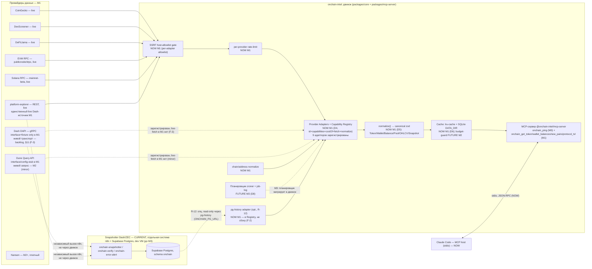
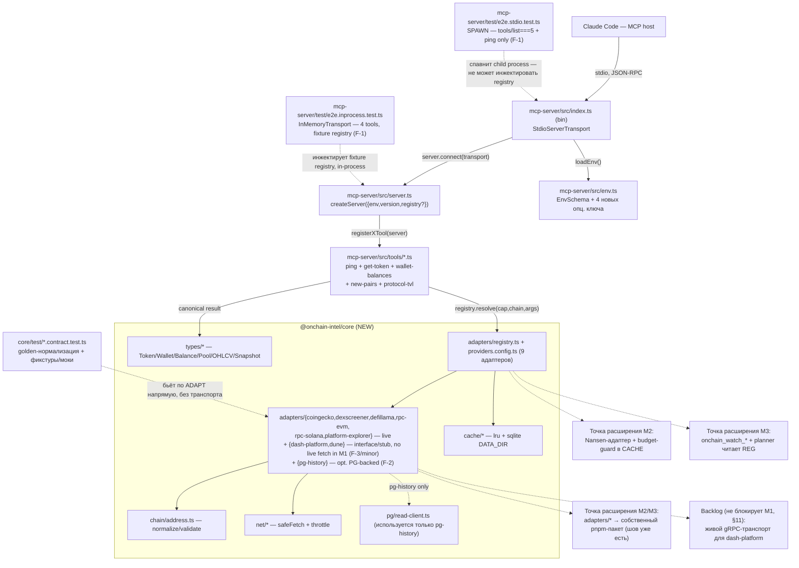
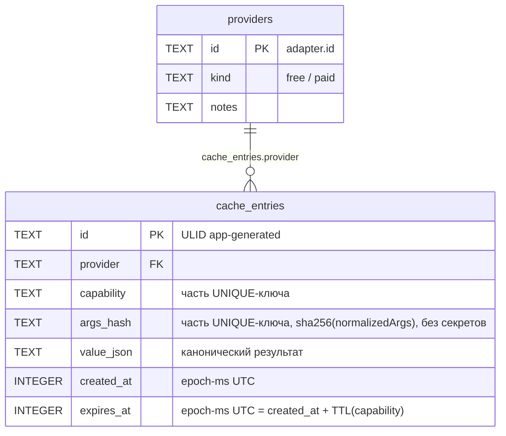

# ARCHITECTURE — `onchain-intel`

| Поле                 | Значение                                                                                                                                                                                                                                                                                                                                                                                                                                                                                                                                                                                                                                                                                                                                                                                                               |
| -------------------- | ---------------------------------------------------------------------------------------------------------------------------------------------------------------------------------------------------------------------------------------------------------------------------------------------------------------------------------------------------------------------------------------------------------------------------------------------------------------------------------------------------------------------------------------------------------------------------------------------------------------------------------------------------------------------------------------------------------------------------------------------------------------------------------------------------------------------- |
| **Статус документа** | Living document — обновляется **на месте**, никогда не архивируется по задачам                                                                                                                                                                                                                                                                                                                                                                                                                                                                                                                                                                                                                                                                                                                                         |
| **Текущая задача**   | M1 ([TASK-003 `m1-read-layer`](TASK.md)) — предыдущая M0 ✅ ([task-001](tasks/task-001-m0-discovery-skeleton.md))                                                                                                                                                                                                                                                                                                                                                                                                                                                                                                                                                                                                                                                                                                      |
| **ADR**              | [ADR-001-tech-stack.md](onchain-analytics/ADR-001-tech-stack.md) — **Accepted**, sign-off 2026-07-20 (Sergey), решения D1–D12                                                                                                                                                                                                                                                                                                                                                                                                                                                                                                                                                                                                                                                                                          |
| **Схема данных**     | [DB-SCHEMA-CONCEPT.md](onchain-analytics/DB-SCHEMA-CONCEPT.md) §1 — portable-конвенции, применены здесь к кеш-БД (M1)                                                                                                                                                                                                                                                                                                                                                                                                                                                                                                                                                                                                                                                                                                  |
| **Roadmap**          | [ROADMAP.md](onchain-analytics/ROADMAP.md) — фазы M0–M6                                                                                                                                                                                                                                                                                                                                                                                                                                                                                                                                                                                                                                                                                                                                                                |
| **Обновлено**        | 2026-07-22, **v2.1** — адверсариальный ревью-цикл 1 (CHANGES_REQUESTED → исправлено): F-1 разделён spawn-vs-in-process E2E, F-2 зарегистрирован `pg-history`-адаптер (+ history-маршрутизация через `platform-explorer`), F-3 `dash-platform` сужен до interface+fixture-контракта в M1 (живой gRPC-транспорт — отдельная backlog-задача, `@grpc/*` убраны из M1-зависимостей); + majors (dexscreener `pool.info`, `onchain_wallet_balances` chain-enum сужен) и minors (канонический key-order в `deriveArgsHash`, явное решение по Dune R-8, `Snapshot` camelCase↔snake_case примечание, диаграмма §2.2 исправлена). v2 — M1 read-слой (TASK-003): канонические типы, Adapter/Capability Registry, девять адаптеров, двухуровневый кеш, 4 MCP-tools. v1.1 (M0 sync) сохранена как история ниже, где не пересмотрена. |

---

## 1. Задача (Task Description)

`onchain-intel` — движок ончейн-аналитики: провайдер-адаптеры (Nansen/Dune/CoinGecko/DexScreener/
Bitquery/DAPI/…) → нормализация в канонический zod-типаж → кеш + credit-budget → snapshotter/
signals → собственный агрегирующий MCP-сервер. Стек и 12 решений (D1–D12) зафиксированы и
**Accepted** в ADR-001 — эта архитектура их не пересматривает, а конкретизирует **M1**
([TASK-003](TASK.md), R-1…R-28): канонические zod-типы, Adapter + Capability Registry, девять
адаптеров (CoinGecko/DexScreener/DeFiLlama/RPC-EVM/RPC-Solana — live; `dash-platform` — interface

- fixture-контракт, живой gRPC-транспорт отложен в backlog; `platform-explorer` — единственный
  live Dash-источник M1; `dune` — interface/config-stub, живой запрос отложен на M2; `pg-history` —
  опциональный read-only PG-адаптер истории), двухуровневый кеш (D6), четыре MCP-tools
  (`onchain_get_token`, `onchain_wallet_balances`, `onchain_new_pairs`, `onchain_protocol_tvl`),
  SSRF-гейт, per-provider rate-limit.

M0 (предыдущий срез — pnpm-монорепо, TS strict, `onchain_ping` на stdio, CI-гейт) **не
пересматривается**; §3.2/§6.4/§10.2 этого документа сохраняют M0-детали там, где они остаются
верны, и расширяют их под M1. Полная RTM M1 — в [TASK.md](TASK.md) §5 (R-1…R-28); трассировка
exit-критериев ROADMAP §M1 — TASK.md §6.

**Что уже существует и не является предметом этой архитектуры:** снапшоттер Dash Platform/ZEC —
**n8n workflows + Supabase Postgres** в dev VM (`onchain-snapshotter`, `onchain-verify`,
`onchain-error-alert`; см. `CLAUDE.n8n.md`). Он продолжает писать снапшоты **независимо** от
движка до M3 (кикофф-решение пользователя, TASK.md §1, п.1) — движок в M1 **только читает** живые
данные DAPI/platform-explorer напрямую (свой собственный, независимый вызов тех же источников, не
через n8n) и **опционально** читает уже накопленную n8n-историю из Supabase read-only (R-12). Два
пути не пересекаются в коде.

**Кикофф-решения пользователя (2026-07-22), зафиксированные в TASK.md §1 и обязательные для этого
дизайна:**

1. Снапшоттер/история остаются за n8n до M3; `dash-platform` в M1 — строго READ-ONLY.
2. Кеш (D6) — **двухуровневый, engine-local**: `lru-cache` (hot) + `better-sqlite3` (persistent) в
   `DATA_DIR`, схема по DB-SCHEMA-CONCEPT §1. Кеш **не** живёт в Postgres.
   > **Аннотация к ADR-001 D6 (не правка ADR):** дополнение D6 от 2026-07-20 («профиль деплоя
   > выделенный сервер» → Postgres день-1 для кеша) описывает **другой** профиль деплоя
   > (always-on планировщик на выделенном сервере). Движок `onchain-intel` в M1 — локальный stdio
   > MCP-процесс под Claude Code, не тот профиль; поэтому для него в силе базовая ветка D6
   > (SQLite+LRU). ADR не редактируется этой задачей — расхождение профилей документируется здесь.
3. Весь блок M1 — один пайплайн-прогон; атомарную нарезку делает Planner.

---

## 2. Функциональная архитектура

### 2.1. Функциональные компоненты

**Компонент: Chain/Address Normalization — NOW (M1, часть D5)**

- **Назначение:** единая точка входа для валидации и канонизации адресов/сетей, используемая и
  MCP-tool input-схемами, и адаптерами при построении кеш-ключа — гарантирует «один и тот же адрес
  в любом регистре ⇒ один и тот же кеш-ключ» (обязательное требование ревьюера TASK-003).
- **Функции:** `ChainSchema` (enum `ethereum | solana | dash`); `normalizeAddress(chain,
raw): string` — EIP-55 checksum для EVM, валидация base58/32-байта для Solana (без изменения
  регистра — base58 регистро-чувствителен); `isValidAddress(chain, raw): boolean`.
- **Зависимости:** используется `Provider Adapters`, MCP-tool input-схемами (§5.1); не зависит ни
  от чего внутри движка.

**Компонент: Provider Adapters + Capability Registry — NOW (M1, D4)**

- **Назначение:** горячо-заменяемый доступ к внешним провайдерам за стабильным внутренним
  интерфейсом (`id/capabilities()/costOf()/fetch()/normalize()`, D4 — включая поле `id`).
- **Функции:** маршрутизация по способности **и сети** (`(capability, chain)` → упорядоченный
  список адаптеров), приоритет free→paid, hot-swap fallback внутри одной способности (R-11,
  доказательство — DAPI ⇄ platform-explorer), anti-corruption layer (провайдер-DTO не протекают
  наружу — только через `normalize()` в канонический тип).
  - Input: `(capability: string, chain: Chain, args: object)`.
  - Output: `{ result: CanonicalResult, source: string, cache: 'hit'|'miss' }` либо структурированная
    ошибка недоступности (R-24).
  - Related Use Cases: UC-2 (основной путь), UC-3 (кеш), UC-4 (hot-swap).
- **Девять адаптеров M1** (детали — §3.2): `coingecko`, `dexscreener`, `defillama`, `dune`,
  `rpc-evm`, `rpc-solana`, `dash-platform`, `platform-explorer`, `pg-history`. Реконсиляция после
  ревью цикла 1: `dash-platform` (interface + fixture-контракт, живой транспорт — backlog, F-3) и
  `dune` (interface/config-stub, живой запрос — M2, minor) зарегистрированы, но не имеют живого
  сетевого пути в M1; `pg-history` — новый read-only PG-адаптер (F-2), закрывающий R-12 через тот
  же Registry/`providers`-FK контур, что и остальные восемь.
- **Зависимости:** зависит от Chain/Address Normalization, Cache, SSRF-гейта, Rate-limiter;
  зависят от него — MCP tools.

**Компонент: Normalization → canonical zod-схема — NOW (M1, D5)**

- **Назначение:** единый словарь домена: `Token`, `Wallet`/`Balance`, `Pool`, `OHLCV` (типаж
  зарезервирован, ни один M1-tool его пока не потребляет), `Snapshot` (персистентная форма —
  DB-SCHEMA-CONCEPT.md, не используется кеш-БД M1 напрямую — это разные хранилища).
- Провайдер-DTO **никогда** не покидают `normalize()` — все 4 MCP-tools видят только эти типы.

**Компонент: Cache (двухуровневый) — NOW (M1, D6) / Credit-Budget guard — FUTURE (M2)**

- **Назначение:** `lru-cache` (hot, in-process) → `better-sqlite3` (persistent, `DATA_DIR`).
  Ключ = `(provider, capability, argsHash)`; TTL по типу данных (§3.2 таблица). Budget-guard
  (`usage`-таблица, дневной потолок) — **не строится в M1** (TASK.md §4), но схема кеш-БД
  спроектирована так, чтобы `usage` FK-ился на тот же `providers`-реестр без миграции (R-14).
- Hit/miss счётчики — видимы в двух местах (решение архитектора, обосновано в §5.2/§9.3): (1)
  структурированная строка в **stderr**; (2) поле `_meta.cache` в ответе каждого из 4 tools —
  не часть zod-валидируемого `structuredContent`, схема выхода не растёт.

**Компонент: SSRF-гейт + Rate-limiter — NOW (M1)**

- **Назначение:** единственная точка исходящего сетевого доступа. `safeFetch()` проверяет
  hostname запроса (и каждого редиректа) против allowlist **конкретного вызывающего адаптера**
  (не глобального объединённого списка — компрометация/баг одного адаптера не даёт доступа к
  хостам другого). Общий примитив `assertAllowedHost()` спроектирован transport-агностично (для
  будущих неHTTP-транспортов вроде gRPC), но в M1 фактически используется только `safeFetch()` —
  `dash-platform`'s gRPC-канал в M1 не создаётся (interface + fixture-контракт only, F-3, §3.2).
- Rate-limiter — token-bucket per-provider, конфиг в `providers.config.ts`, in-memory (M1 —
  один процесс, персистентность не нужна).

**Компонент: `pg-history` — read-only Postgres адаптер истории — NOW (M1, опционально, R-12)**

- **Назначение:** реализован **как обычный `ProviderAdapter`** (`id: 'pg-history'`), а не
  бесхозный клиент сбоку — регистрируется в `providers`-реестре наравне с остальными восемью
  (закрывает F-2: строка кеша с `provider='pg-history'` иначе нарушала бы FK `cache_entries.
provider → providers(id)`). Ленивое (только когда задан `ONCHAIN_PG_URL` **и** вызвана
  history-способность) SELECT-only подключение к схеме `onchain` (той же, что пишет n8n) для
  истории `privacy.shielded_pool.history`/`platform.metrics.history`. Никакого write-пути в коде
  движка (R-12, R-27). Не единственный источник истории — `platform-explorer` отдаёт **свою**
  history через собственные REST-эндпоинты первым в маршруте (R-10, keyless, всегда доступен);
  `pg-history` — второй по приоритету, доступен только при наличии DSN (детали маршрута — §3.2).

**Компонент: Планировщик / Snapshotter-Signals — CURRENT (n8n, отдельная система) + FUTURE (M3, D8)**

- Без изменений относительно v1.1 — не предмет M1 (TASK.md §4: планировщик — M3).

**Компонент: MCP-сервер (`@onchain-intel/mcp-server`) — NOW (M0 ping) + NOW (M1: 4 новых tools)**

- **NOW (M0, не меняется по контракту, R-20):** `onchain_ping`.
- **NOW (M1):** `onchain_get_token`, `onchain_wallet_balances`, `onchain_new_pairs`,
  `onchain_protocol_tvl` — zod in/out, registry-routed. **Пятого tool нет** (OQ-2 решение
  архитектора, ниже): dash-platform/platform-explorer регистрируют способности в Capability
  Registry и покрываются contract-тестами, но **не** получают отдельный MCP-tool в M1 — Platform
  privacy-правила (M3) — первый реальный потребитель, ROADMAP называет ровно 4 tool для M1.
- **FUTURE:** `onchain_smart_money_flows`, `onchain_entity_label`, `onchain_token_risk`,
  `onchain_watch_add/list/remove` (M2+/M3, D3); Streamable HTTP транспорт (M6).

**Связанные Use Cases (TASK.md §2):** UC-1 (пустой `.env`), UC-2 (4 tools на 2 сетях), UC-3
(cache-hit метрики), UC-4 (hot-swap DAPI→platform-explorer), UC-5 (контрактные тесты без сети).

### 2.2. Диаграмма функциональных компонентов



---

## 3. Системная архитектура

### 3.1. Архитектурный стиль

**Стиль M1: два пакета в pnpm-монорепо** — `packages/core` (новый) + `packages/mcp-server`
(существующий, M0). Внутри каждого пакета — простая модульная структура, без DI-контейнеров.

**Решение по OQ-3 (packages/core split — предмет решения архитектора, TASK.md §7):** выбрана
**ровно одна** дополнительная граница пакета (`packages/core`), а не полная D12-раскладка
(`core`+`adapters`+`signals`+`cli` четырьмя пакетами).

- **Почему не один пакет (не всё в `mcp-server`):** объём M1 — канонические типы, 9 адаптеров,
  двухуровневый кеш, SSRF-гейт, rate-limiter, PG-клиент — это самостоятельный, тестируемый без
  MCP-транспорта домен (все контрактные тесты D11 бьют по `normalize()`/`fetch()` напрямую, без
  сервера). Смешивание его с MCP-обвязкой в одном пакете усложнило бы M2 (Nansen) и M3 (signals):
  им обоим тоже нужен доступ к Registry/Cache/types, но не к MCP tool-регистрации.
- **Почему не четыре пакета (`core`+`adapters`+`signals`+`cli` сразу):** M0 уже показал реальную
  цену **каждого** нового workspace-пакета в этом toolchain (свой `tsconfig.json` +
  `tsconfig.build.json` + `.prettierignore` из-за CWD-relative resolution — см.
  `packages/mcp-server/.AGENTS.md`; TS strict + `noUncheckedIndexedAccess` дисциплина). D12 сам
  говорит «старт минимальный, режем по швам по мере роста» — `signals`/`cli` не имеют кода до
  M3/по потребности (R-27 anti-scope-creep). Адаптеры — не отдельный пакет, а модульная граница
  **внутри** `packages/core` (`src/adapters/<id>/`): это уже «шов» D12 на уровне директорий —
  вынести их в собственный pnpm-пакет в M2/M3 значит переместить директорию + добавить
  `package.json`, не переписывать код (импорты внутри `core` уже идут через
  `adapters/registry.ts`, а не напрямую между адаптерами).
- **Дополнительный выигрыш:** `packages/core` не нуждается в tsup — это чистая библиотека без
  `bin`, поэтому её `build` — простой `tsc -p tsconfig.build.json` (NodeNext эмит из коробки).
  Это **обходит** баг tsup/rollup-plugin-dts (TS6/TS7 `baseUrl`-конфликт, см. M0 `.AGENTS.md`)
  целиком, а не воспроизводит его во втором пакете — `core` проще собрать, чем `mcp-server`.

**Обоснование стиля в целом:** YAGNI (architecture-design skill, «Simplicity Above All») —
минимальная граница, которая делает M1 честным (тестируемым независимо от MCP) и не создаёт
рефакторинг для M2/M3 slicing.

### 3.2. Системные компоненты

#### Компонент: `@onchain-intel/core` (НОВЫЙ, M1)

- **Тип:** TypeScript library-пакет (без `bin`), потребляется `mcp-server` через
  `workspace:*`-зависимость.
- **Назначение:** канонические типы, chain/address normalization, Adapter + Capability Registry,
  девять адаптеров (два — `dash-platform` и `dune` — interface/fixture-only в M1, см. ниже),
  двухуровневый кеш, SSRF-гейт, rate-limiter, read-only PG-клиент (`pg-history`-адаптер).
- **Технологии:** TypeScript strict, zod, `better-sqlite3`, `lru-cache`, `ulid`, `@noble/hashes`
  (EIP-55 keccak256 — единственная причина её появления: ADR-001 D5 явно требует EVM-checksum, не
  просто lowercase; см. §4.1), `bs58` (Solana base58 decode/validate — не переизобретается вручную
  ради корректности на security-границе валидации адреса), `pg` (read-only PG-клиент,
  `pg-history`-адаптер). **`@grpc/grpc-js`+`@grpc/proto-loader` НЕ входят в M1** (были в v2 —
  убраны в v2.1, F-3): `dash-platform` сужен до interface + fixture-контракта, живого gRPC-вызова
  в M1 нет — см. §3.2 `dash-platform` ниже.
  > Версии выше — реалистичные мажоры, **не** проверенные `pnpm add`-резолвом (в отличие от уже
  > установленных M0-зависимостей в `mcp-server/package.json`); точные minor/patch фиксируются в
  > Development при первом `pnpm add`, не изобретаются здесь (vendor-drift дисциплина).

**Модуль: `src/types/*`** (D5, R-1/R-2)

Канонические zod-схемы, единственный источник правды (используются и рантайм-валидацией, и
tool-схемами через реэкспорт в `mcp-server`):

```ts
export const ChainSchema = z.enum(['ethereum', 'solana', 'dash']);
export type Chain = z.infer<typeof ChainSchema>;

export const TokenSchema = z
  .object({
    chain: ChainSchema,
    address: z.string(), // нормализован: checksum EVM / base58 Solana
    symbol: z.string(),
    name: z.string(),
    decimals: z.number().int().nonnegative().optional(),
    priceUsd: z.number().nonnegative().optional(),
    marketCapUsd: z.number().nonnegative().optional(),
    source: z.string(), // id адаптера-источника
    fetchedAt: z.number().int(), // epoch-ms UTC
  })
  .strict();

export const BalanceSchema = z
  .object({
    assetType: z.enum(['native', 'token']), // M1 заполняет только 'native' — см. §4.1 ниже
    symbol: z.string(),
    decimals: z.number().int().nonnegative(),
    amountRaw: z.string(), // точное целое строкой (DB-SCHEMA §1.7 конвенция)
    amountNum: z.number().optional(), // lossy-проекция
    contractAddress: z.string().optional(), // заполняется, когда assetType === 'token'
  })
  .strict();

export const WalletSchema = z
  .object({
    chain: ChainSchema,
    address: z.string(),
    balances: z.array(BalanceSchema),
    source: z.string(),
    fetchedAt: z.number().int(),
  })
  .strict();

export const PoolSchema = z
  .object({
    id: z.string(),
    chain: ChainSchema,
    dexId: z.string(),
    baseTokenSymbol: z.string(),
    quoteTokenSymbol: z.string(),
    pairAddress: z.string(),
    createdAt: z.number().int().optional(),
    liquidityUsd: z.number().nonnegative().optional(),
    volume24hUsd: z.number().nonnegative().optional(),
    source: z.string(),
    fetchedAt: z.number().int(),
  })
  .strict();

// Зарезервирован (R-1 требует существование типа), M1 не подключает ни одного потребляющего
// tool — первый потребитель: будущий candlestick/chart-tool (M1.5+).
export const OhlcvSchema = z
  .object({
    chain: ChainSchema,
    pairAddress: z.string(),
    ts: z.number().int(),
    open: z.number(),
    high: z.number(),
    low: z.number(),
    close: z.number(),
    volumeUsd: z.number().nonnegative().optional(),
    source: z.string(),
  })
  .strict();

// Персистентная форма D5-дополнения (snapshotter-режим) — согласована с DB-SCHEMA-CONCEPT §2,
// но M1 не пишет её никуда (n8n пишет отдельно); тип существует для будущего M3-поглощения (R-2).
// Маппинг имён на persistence-границе (M3, не M1, minor): valueRaw↔value_raw, valueNum↔value_num
// — остальные поля совпадают буквально (см. §4.1 Entity Snapshot).
export const SnapshotSchema = z
  .object({
    metric: z.string(),
    asset: z.string(),
    ts: z.number().int(),
    valueRaw: z.string(),
    valueNum: z.number().optional(),
    source: z.string(),
    height: z.number().int().optional(),
  })
  .strict();
```

#### 4.1 Address/Chain Normalization (`src/chain/address.ts`) — детально по замечанию ревьюера

- **EVM (ethereum):** канонический вид — **EIP-55 checksum**, не lowercase (ADR-001 D5 явно
  требует checksum). Алгоритм: `keccak256` от lowercase hex-адреса (без `0x`, как ASCII-байты) →
  для каждого hex-символа исходного lowercase-адреса — если соответствующий ниббл хеша ≥ 8,
  символ идёт в верхнем регистре, иначе в нижнем. Это **чистая функция байт адреса**: любой
  входной регистр даёт **один и тот же** checksum-результат — кеш-ключ и хранение детерминированы
  автоматически, отдельная «lowercase-для-ключей» форма не нужна.
- **Solana:** канонический вид — **как есть** (base58 регистро-чувствителен: lowercase испортил
  бы адрес, в отличие от hex). Валидация: base58-декодирование успешно **и** длина декодированных
  байт **точно 32** (Solana-адрес — сырой ed25519-pubkey, без version/checksum-байтов в отличие
  от Bitcoin base58check).
- **Dash:** участвует в `ChainSchema` для консистентности словаря (совпадает с `assets.chain_family`
  из DB-SCHEMA), но `Wallet`/`Balance`-типы для него в M1 не используются — dash-platform отдаёт
  `Snapshot`, не `Balance` (см. §2.1).
- **Единая точка использования:** и MCP-tool input-схемы (`superRefine` вызывает
  `isValidAddress(chain, address)`), и адаптеры (`normalizeAddress` перед вызовом
  `fetch`/построением кеш-ключа) — один модуль, не дублируется.

**Модуль: `src/adapters/*`** (D4, R-3, R-5…R-11)

```ts
export interface CapabilityDescriptor {
  id: string; // 'token.price' | 'wallet.balances.native' | 'pairs.new' | ...
  chains?: Chain[]; // отсутствует = capability не привязана к конкретной сети
}

export interface ProviderAdapter {
  id: string; // D4: явное поле id
  capabilities(): CapabilityDescriptor[];
  costOf(cap: string, args: Record<string, unknown>): { credits: number };
  fetch(cap: string, args: Record<string, unknown>): Promise<unknown>;
  normalize(cap: string, raw: unknown): unknown; // сужается адаптером внутри
  isAvailable?(): { ok: true } | { ok: false; reason: string }; // env/key-готовность, R-24
}
```

**Capability Registry** (`src/adapters/registry.ts`) маршрутизирует по `(capability, chain)`:

```ts
export interface CapabilityRoute {
  capability: string;
  chains?: Chain[];
  adapterIds: string[]; // порядок = приоритет + fallback-цепочка (R-11)
}

export class CapabilityRegistry {
  resolve(
    capability: string,
    chain: Chain,
    args: Record<string, unknown>,
  ): Promise<{ result: unknown; source: string; cache: 'hit' | 'miss'; ageMs?: number }>;
  // при недоступности всех адаптеров маршрута — бросает CapabilityUnavailableError со списком
  // (adapterId, reason) — не тихий пустой ответ (R-24); при ошибке fetch/normalize текущего
  // адаптера — переходит к следующему в adapterIds (R-11 hot-swap), не падает целиком.
}
```

`providers.config.ts` — декларативные маршруты + реестр адаптеров (id → hosts/rate-limit/env):

```ts
export const routes: CapabilityRoute[] = [
  { capability: 'token.price', chains: ['ethereum', 'solana'], adapterIds: ['coingecko'] },
  { capability: 'token.metadata', chains: ['ethereum', 'solana'], adapterIds: ['coingecko'] },
  { capability: 'pairs.new', chains: ['ethereum', 'solana'], adapterIds: ['dexscreener'] },
  // R-6 Must требует и pairs.new, и pool.info — pool.info пока без tool-потребителя в M1
  // (дёшево объявить сейчас, major fix, ревью цикл 1):
  { capability: 'pool.info', chains: ['ethereum', 'solana'], adapterIds: ['dexscreener'] },
  { capability: 'protocol.tvl', chains: ['ethereum', 'solana'], adapterIds: ['defillama'] },
  { capability: 'wallet.balances.native', chains: ['ethereum'], adapterIds: ['rpc-evm'] },
  { capability: 'wallet.balances.native', chains: ['solana'], adapterIds: ['rpc-solana'] },
  {
    capability: 'privacy.shielded_pool',
    chains: ['dash'],
    adapterIds: ['dash-platform', 'platform-explorer'],
  },
  {
    capability: 'platform.identities',
    chains: ['dash'],
    adapterIds: ['dash-platform', 'platform-explorer'],
  },
  {
    capability: 'platform.contracts',
    chains: ['dash'],
    adapterIds: ['dash-platform', 'platform-explorer'],
  },
  {
    capability: 'platform.documents',
    chains: ['dash'],
    adapterIds: ['dash-platform', 'platform-explorer'],
  },
  {
    capability: 'platform.credits',
    chains: ['dash'],
    adapterIds: ['dash-platform', 'platform-explorer'],
  },
  // R-10 (platform-explorer's own history, always live/keyless) + R-12 (opt. PG-backed history) —
  // fix F-2, ревью цикл 1: platform-explorer первым (не нужен DSN, всегда доступен), pg-history
  // вторым (доп./альтернативный вид истории, только когда задан ONCHAIN_PG_URL):
  {
    capability: 'privacy.shielded_pool.history',
    chains: ['dash'],
    adapterIds: ['platform-explorer', 'pg-history'],
  },
  {
    capability: 'platform.metrics.history',
    chains: ['dash'],
    adapterIds: ['platform-explorer', 'pg-history'],
  },
  // R-8 — Dune, Should, interface/config-stub в M1 (см. решение по dune ниже, F-2/minor):
  // зарегистрирован, не потребляется ни одним из 4 tools, live fetch/фикстура — не в M1.
  { capability: 'token.holders', chains: ['ethereum'], adapterIds: ['dune'] },
];

export const adapterRegistrations: AdapterRegistration[] = [
  {
    id: 'coingecko',
    hosts: ['api.coingecko.com', 'pro-api.coingecko.com'],
    rateLimit: { capacity: 10, refillPerSec: 0.5 },
    requiresEnv: [],
  },
  {
    id: 'dexscreener',
    hosts: ['api.dexscreener.com'],
    rateLimit: { capacity: 5, refillPerSec: 1 },
    requiresEnv: [],
  },
  {
    id: 'defillama',
    hosts: ['api.llama.fi'],
    rateLimit: { capacity: 5, refillPerSec: 1 },
    requiresEnv: [],
  },
  // interface/config-stub в M1 — isAvailable() возвращает false безусловно (см. решение ниже):
  {
    id: 'dune',
    hosts: ['api.dune.com'],
    rateLimit: { capacity: 2, refillPerSec: 0.1 },
    requiresEnv: ['DUNE_API_KEY'],
  },
  {
    id: 'rpc-evm',
    hosts: ['ethereum-rpc.publicnode.com', 'eth.drpc.org'],
    rateLimit: { capacity: 5, refillPerSec: 1 },
    requiresEnv: [],
  },
  {
    id: 'rpc-solana',
    hosts: ['api.mainnet-beta.solana.com'],
    rateLimit: { capacity: 5, refillPerSec: 1 },
    requiresEnv: [],
  },
  // F-3: нет live host в M1 — interface + fixture-контракт only; hosts заполняются, когда
  // приземлится отложенная backlog-задача живого gRPC-транспорта (§11):
  { id: 'dash-platform', hosts: [], rateLimit: { capacity: 5, refillPerSec: 1 }, requiresEnv: [] },
  {
    id: 'platform-explorer',
    hosts: ['platform-explorer.pshenmic.dev'],
    rateLimit: { capacity: 5, refillPerSec: 1 },
    requiresEnv: [],
  },
  // NEW (F-2) — не HTTP-хост: Postgres wire-протокол; сам DSN — контроль доступа, не
  // hostname-allowlist. Регистрация здесь нужна ИСКЛЮЧИТЕЛЬНО для providers-FK (§4.2).
  {
    id: 'pg-history',
    hosts: [],
    rateLimit: { capacity: 2, refillPerSec: 0.2 },
    requiresEnv: ['ONCHAIN_PG_URL'],
  },
];
```

Rate-limit значения — консервативные стартовые (не документированные вендором лимиты, кроме
Dune-кредитов) — легко подкручиваются правкой конфига без изменения кода вызывающей стороны (R-4).

**Девять адаптеров — сводка:**

| id                  | Capability(-ies)                                            | Транспорт                                                             | Ключ                                                                   | Примечание                                                                                                                                                           |
| ------------------- | ----------------------------------------------------------- | --------------------------------------------------------------------- | ---------------------------------------------------------------------- | -------------------------------------------------------------------------------------------------------------------------------------------------------------------- |
| `coingecko`         | `token.price`, `token.metadata`                             | REST (`fetch`), `/coins/{platform}/contract/{address}`                | опц. `COINGECKO_API_KEY` (demo/free работает без)                      | R-5, **live**                                                                                                                                                        |
| `dexscreener`       | `pairs.new`, `pool.info`                                    | REST (`fetch`)                                                        | нет (keyless)                                                          | R-6 Must требует оба; `pool.info` пока без tool-потребителя (дёшево объявить, major fix); точный endpoint — подтверждается при записи фикстуры (R-22), §11; **live** |
| `defillama`         | `protocol.tvl`                                              | REST (`fetch`), `/protocol/{slug}`, срез `chainTvls[chain]`           | нет (keyless)                                                          | R-7, **live**                                                                                                                                                        |
| `dune`              | `token.holders` (Should, не в 4 tools)                      | REST Query API — **не реализован в M1** (interface/config-stub)       | `DUNE_API_KEY` (free tier), но `isAvailable()` безусловно `false` в M1 | R-8, решение ниже                                                                                                                                                    |
| `rpc-evm`           | `wallet.balances.native` (ethereum)                         | JSON-RPC `eth_getBalance` (`fetch`)                                   | нет (keyless)                                                          | R-16/R-17, OQ-1, **live**                                                                                                                                            |
| `rpc-solana`        | `wallet.balances.native` (solana)                           | JSON-RPC `getBalance` (`fetch`)                                       | нет (keyless)                                                          | R-16/R-17, OQ-1, **live**                                                                                                                                            |
| `dash-platform`     | `privacy.shielded_pool`, `platform.*`                       | **gRPC** — **не реализован в M1** (interface + fixture-контракт only) | нет (keyless), но недостижим в M1                                      | R-9 через мок, F-3; см. ниже                                                                                                                                         |
| `platform-explorer` | те же (fallback) + `*.history`                              | REST (`fetch`)                                                        | нет (keyless)                                                          | R-10/R-11, **единственный live Dash-источник M1**                                                                                                                    |
| `pg-history`        | `privacy.shielded_pool.history`, `platform.metrics.history` | Postgres wire (SELECT-only)                                           | `ONCHAIN_PG_URL` (опц.)                                                | R-12, новый (F-2), **live опционально**                                                                                                                              |

**`dash-platform` — сужен до interface + fixture-контракта в M1 (F-3, решение ревью-цикла 1):**

Изначальный дизайн (v2) предполагал живой gRPC-транспорт (`@grpc/grpc-js` + `@grpc/proto-loader` +
вендоренный `.proto` + канал-level SSRF-проверка) уже в M1. Ревью справедливо указало: DAPI не
имеет ни одного M1-tool-потребителя (OQ-2 ниже — Platform-метрики без отдельного tool), конкретный
evonode-host не верифицирован (живой пробник, §11), а способности `privacy.shielded_pool`/
`platform.*` **полностью** покрыты `platform-explorer` (keyless REST, уже работает). Это делает
живой gRPC самым дорогим/наименее окупаемым пунктом на 1–2-недельном критическом пути M1.

**Решение:** `dash-platform` в M1 — **только** интерфейс + fixture-backed contract-тест:

- `capabilities()` объявляет `privacy.shielded_pool` + `platform.identities/contracts/documents/
credits` (R-9 acceptance «capabilities() включает X» — удовлетворено).
- `normalize()` реализован и golden-протестирован против **вручную собранной** фикстуры, форма
  которой списана с полей addendum (`getShieldedPoolState`, `getTotalCreditsInPlatform`, …) —
  contract-тест зелёный без единого живого вызова (R-9 «contract-тест на фикстуре зелёный» —
  удовлетворено через мок, не живой пробник).
- `fetch()` в M1 — **не реализован** (stub, бросает `NotImplementedInM1Error`) — недостижим в
  рантайме, т.к. `isAvailable()` ниже уже отсекает адаптер раньше.
- `isAvailable()` **безусловно** возвращает `{ ok: false, reason: 'dash-platform live transport
deferred — see backlog, use platform-explorer' }` в M1 (не «если evonode недоступен», а
  всегда) — Registry поэтому **всегда** маршрутизирует `privacy.shielded_pool`/`platform.*` на
  `platform-explorer`. Это не имитация hot-swap «на всякий случай» — это **реальный, постоянно
  активный** fallback-путь, доказывающий механизм Registry (R-11) настоящим прогоном, просто с
  заведомо известной (не флаки-зависимой) причиной недоступности primary.
- **`@grpc/grpc-js` и `@grpc/proto-loader` убраны из M1-зависимостей** `packages/core` (были в
  v2, удалены в v2.1) — не нужны, пока `fetch()` не реализован; появятся вместе с backlog-задачей
  ниже.
- **Живой gRPC-транспорт — отдельная, не блокирующая M1, backlog-задача** (§11): vendoring
  `.proto` (`raw.githubusercontent.com/dashpay/platform/.../platform.proto`, источник+дата в
  комментарии), `@grpc/grpc-js`+`@grpc/proto-loader`, конкретный evonode-host (живой пробник),
  канал-level `assertAllowedHost()`. Когда задача landится, `isAvailable()` заменяется на
  условную проверку (host сконфигурирован ⇒ пробовать; иначе — тот же явный `false`), не меняя
  `ProviderAdapter`-контракт наружу.

**`platform-explorer` — единственный live Dash-источник M1 (F-3 требование):** реализует ту же
capability-поверхность, что и `dash-platform` (REST, keyless, всегда доступен), **и** собственный
history-метод (R-10) — используется первым в history-маршрутах (`privacy.shielded_pool.history`/
`platform.metrics.history`, `routes` выше), не только как fallback для live-состояния.

**dash-platform / platform-explorer / dune — не получают отдельный tool (OQ-2, решение
архитектора, без изменений в v2.1):** ROADMAP называет ровно 4 MCP-tool для M1, ни один не про
Platform-метрики или holder-статистику; Registry регистрирует способности и покрывает их
contract-тестами там, где они существуют (R-9/R-10/R-11 через `platform-explorer` + мок
`dash-platform`) — первый реальный **потребитель**-tool для Platform-метрик появится в M3
(privacy-правила), для `token.holders` — в M2 (`onchain_token_risk`).

**`dune` — R-8 явное решение (реконсиляция ревью-цикла 1, minor):** ревьюер рекомендовал более
узкую, явно проговорённую резолюцию R-8 (Should), чем «полный адаптер + фикстура» из v2 —
**interface/config-stub в M1**:

- `capabilities()` объявляет `token.holders` (число держателей + концентрация топ-10) —
  способность, которую не покрывает ни один из остальных восьми адаптеров (CoinGecko —
  цена/метаданные, DexScreener — пары/ликвидность/`pool.info`, DeFiLlama — TVL, RPC — баланс
  конкретного адреса, dash-platform/platform-explorer/pg-history — Dash-specific).
- `fetch()`/`normalize()` **не реализованы в M1** — ни живого запроса, ни фикстуры, ни
  contract-теста (fixture-less registration — нечего golden-тестировать до авторинга запроса).
- `isAvailable()` возвращает `{ ok: false, reason: 'dune query authoring deferred to M2' }`
  безусловно в M1, независимо от присутствия `DUNE_API_KEY` — авторинг живого Dune SQL-запроса
  (query id, параметризация) переносится на M2, вместе с первым реальным потребителем
  (`onchain_token_risk`).
- Ни один из 4 Must-tools от `token.holders` не зависит ⇒ пустой `.env` остаётся полностью
  функциональным (UC-1) независимо от этого решения.
- **Примечание для Planner:** это ýже буквального текста acceptance R-8 («contract-тест на
  фикстуре», TASK.md) — резолюция одобрена ревьюером архитектуры явно (F-2/minor, цикл 1);
  Planner либо принимает её как обновлённый scope R-8 для M1-задачи, либо эскалирует к Analyst
  для формальной правки RTM, если нужен строгий 1:1 с исходной acceptance-формулировкой.

**ERC-20/SPL-балансы — решение архитектора (не в M1):** `onchain_wallet_balances` в M1 заполняет
только `assetType: 'native'` (нативный ETH/SOL через `rpc-evm`/`rpc-solana`). Токен-балансы
(ERC-20/SPL) требуют **либо** per-контракт `eth_call`/`getTokenAccountsByOwner` над неограниченным
множеством контрактов (нужен источник «какие токены проверять» — вопрос не тривиальный на $0),
**либо** индексер/multicall-сервис (обычно платный/недостаточно надёжный keyless), **либо** Dune
(кредиты + латентность). R-17 acceptance ограничивается «контракт зафиксирован, ≥2 сети реально
работают» — нативный баланс это закрывает дёшево. `BalanceSchema` уже несёт `assetType`/
`contractAddress` (§4.1 выше) специально, чтобы M1.5/M2 добавили ERC-20/SPL **без** изменения
схемы — только заполнением дополнительных строк массива `balances`. Зафиксировано как backlog
work-item, не блокирует M1.

**Модуль: `src/cache/*`** (D6, R-13/R-14/R-15)

Двухуровневый: `lru-cache` (hot, in-process, TTL встроен в `set()`) перед `better-sqlite3`
(persistent, `DATA_DIR`). DDL следует DB-SCHEMA-CONCEPT §1 конвенциям, применённым к **новому**
контексту (кеш, не аналитический снапшот):

```sql
CREATE TABLE IF NOT EXISTS providers (
  id    TEXT PRIMARY KEY,   -- adapter.id, напр. 'coingecko' | 'rpc-evm' | ...
  kind  TEXT NOT NULL,      -- 'free' | 'paid' — информационно, отражает приоритет D4
  notes TEXT
);

CREATE TABLE IF NOT EXISTS cache_entries (
  id          TEXT PRIMARY KEY,              -- ULID, генерит приложение (DB-SCHEMA §1.3)
  provider    TEXT NOT NULL REFERENCES providers(id),
  capability  TEXT NOT NULL,
  args_hash   TEXT NOT NULL,                 -- sha256(hex) нормализованных args — НИКОГДА секретов (см. §7)
  value_json  TEXT NOT NULL,                 -- канонический результат, JSON как TEXT (DB-SCHEMA §1.4)
  created_at  INTEGER NOT NULL,              -- epoch-ms UTC
  expires_at  INTEGER NOT NULL,              -- epoch-ms UTC = created_at + TTL(capability)
  UNIQUE (provider, capability, args_hash)
);
CREATE INDEX IF NOT EXISTS idx_cache_entries_expiry ON cache_entries (expires_at);
```

- **Запись — upsert, не append-only:** кеш-запись — пересчитываемая проекция, не наблюдение
  (в терминах DB-SCHEMA §1.5 это ветка «`aggregates`», не «`snapshots`»): `INSERT ... ON CONFLICT
(provider, capability, args_hash) DO UPDATE SET value_json=excluded.value_json,
created_at=excluded.created_at, expires_at=excluded.expires_at`. Обычный insert-only здесь
  оставил бы устаревшее значение молча (то же предостережение, что DB-SCHEMA §1.5 даёт для
  `aggregates`).
- **`providers` — upsert ДО первой записи в `cache_entries`** (registry bootstrap из **всех
  девяти** `adapterRegistrations`, включая `pg-history` — F-2, при старте), FK **включён явно**:
  `PRAGMA foreign_keys=ON` при открытии соединения (DB-SCHEMA §1.6). Это же готовит место для M2
  `usage(provider, day, credits_used)` — FK на тот же `providers`-реестр без миграции (R-14
  acceptance).
- `PRAGMA journal_mode=WAL` — конкурентное чтение hot-path/дебага не блокируется записью.
- **`DATA_DIR`:** опциональный env, по умолчанию `path.join(os.homedir(), '.onchain-intel')`
  (не `process.cwd()`-относительный путь — MCP-сервер запускается Claude Code с произвольным cwd,
  стабильный домашний каталог предсказуем независимо от того, откуда стартовал хост). Файл кеша —
  `${DATA_DIR}/cache.sqlite3`. Перенос инсталляции = перенос одного каталога (DB-SCHEMA §1.10).
- **TTL по типу данных** (ADR-001 D6 диапазоны, конкретизированы под M1-способности):

  | Capability                            | TTL   | Обоснование                                                                |
  | ------------------------------------- | ----- | -------------------------------------------------------------------------- |
  | `token.price`                         | 60с   | D6: цена 15–60с                                                            |
  | `token.metadata`                      | 3600с | имя/символ/decimals почти не меняются                                      |
  | `wallet.balances.native`              | 60с   | D6: балансы 1–5мин, нижняя граница — баланс меняется с каждой tx           |
  | `pairs.new`                           | 30с   | свежесть критична для «new»                                                |
  | `protocol.tvl`                        | 300с  | D6: TVL 5–30мин, нижняя граница                                            |
  | `privacy.shielded_pool`, `platform.*` | 3600с | не имеет смысла опрашивать чаще часового каденса существующего снапшоттера |
  | `token.holders` (dune)                | 3600с | кредит-метрируемо, низкая волатильность                                    |

- **Hit/miss счётчики** (`src/cache/stats.ts`) — `Map<capability, { hit: number; miss: number
}>` в процессе, инкрементируется Registry на каждое разрешение способности; экспортируется
  функцией `getCacheStats()`, используемой (a) для одной stderr-строки на вызов
  (`cache=hit|miss provider=<id> capability=<cap> ageMs=<n>` — без значений args/секретов) и (b)
  для `_meta.cache` в ответе tool. **Обоснование выбора (обе точки, не одна):** stderr —
  greppable для dev/CI-ассертов без изменения протокола (инвариант §7.3 M0 не нарушается — это
  не stdout); `_meta` — прямая видимость вызывающему агенту (Claude Code) без парсинга логов,
  тестируется прямо в E2E через `result._meta.cache`, не растит `structuredContent`/схему выхода
  (R-15 acceptance «проверяемо в тесте или debug-выводе» — закрыто обоими путями).

**Модуль: `src/net/*`** (SSRF, R-25 + rate-limit, R-26)

```ts
export function assertAllowedHost(hostname: string, allowlist: string[]): void; // throws SsrfBlockedError
export function safeFetch(url: string, opts: RequestInit, allowlist: string[]): Promise<Response>;
// safeFetch: redirect: 'manual' + ручная проверка Location-хоста на каждом хопе (макс. 3),
// прежде чем следовать редиректу — никогда не доверяет редиректу вслепую.

export interface TokenBucketConfig {
  capacity: number;
  refillPerSec: number;
}
export function throttle(providerId: string, config: TokenBucketConfig): Promise<void>;
```

**Модуль: `src/pg/read-client.ts`** (R-12, используется **только** `adapters/pg-history/index.ts` —
не отдельный side-channel, F-2)

Ленивый `pg.Pool` — создаётся **только** при первом вызове history-способности **и** наличии
`ONCHAIN_PG_URL`; иначе `pg-history.isAvailable()` возвращает `{ ok: false, reason: 'needs
ONCHAIN_PG_URL' }` (R-24). `search_path=onchain` через connection option (`options: '-c
search_path=onchain'`). Все запросы кода движка — **только `SELECT`** (код-ревью гейт, R-27);
рекомендация для оператора БД — сама роль на сервере тоже должна быть SELECT-only (defense in
depth, §7). `pg-history` оборачивает этот клиент в стандартный `ProviderAdapter` (`id:
'pg-history'`, `capabilities()` → `privacy.shielded_pool.history`/`platform.metrics.history`,
`normalize()` → `Snapshot[]`) — регистрируется в `providers` наравне с остальными восемью (§4.2).

#### Компонент: `@onchain-intel/mcp-server` (M0, расширяется в M1)

- Тип/технологии — без изменений от v1.1 (Node CLI, stdio, `@modelcontextprotocol/sdk`, zod,
  tsup+tsx+vitest). **Новая** `workspace:*`-зависимость на `@onchain-intel/core`.
- `createServer(deps: { env: Env; version: string; registry?: CapabilityRegistry })` —
  **`registry` теперь injectable** (по умолчанию — реальный, собранный из
  `providers.config.ts`; тесты передают fixture-backed реализацию того же интерфейса
  `resolve()`). Это единственный механизм «MCP E2E без сети» (R-21) — не мокается глобальный
  `fetch`, инжектируется другая реализация того же контракта на границе `createServer`.
  **Важно (F-1, ревью цикл 1):** эта инъекция работает только **in-process** — она недостижима
  через границу спавненного дочернего процесса (`e2e.stdio.test.ts` спавнит `src/index.ts` как
  отдельный процесс через `tsx`, у которого нет способа получить объект `registry` вызывающего
  теста). Поэтому её использует **новый** in-process suite (`e2e.inprocess.test.ts`, см. «Тест-
  сьют» ниже), не спавн-сьют — это и есть ключевое разделение F-1.
- **4 новых `src/tools/*.ts`** (`get-token.ts`, `wallet-balances.ts`, `new-pairs.ts`,
  `protocol-tvl.ts`) — тот же паттерн, что `ping.ts`: pure-хендлер (юнит-тестируем без
  транспорта) + `registerXTool` (обвязка над SDK). Хендлер оборачивает вызов
  `registry.resolve(...)` в `try/catch`; при `CapabilityUnavailableError` возвращает `{ isError:
true, content: [{ type: 'text', text: <причина, без значений секретов> }] }` явно (не
  полагается на автоматическое `isError`-преобразование SDK, которое M0 `.AGENTS.md` описывает
  только для zod input-валидации, не для ошибок бизнес-логики).
- `src/env.ts` — 4 новых **опциональных** ключа (R-23): `COINGECKO_API_KEY`, `DUNE_API_KEY`,
  `ONCHAIN_PG_URL` (`z.string().url().optional()` — WHATWG URL-парсинг принимает `postgres://`;
  проверить на реальной строке подключения в Development, §11), `DATA_DIR`
  (`z.string().optional()`). `EnvSchema.parse({})` продолжает не бросать (R-23).

#### Тест-сьют — расширения M1 (D11, R-21/R-22)

- **`packages/core/test/`:** по одному `*.contract.test.ts` на адаптер, где есть живой/fixture/
  mock путь — golden-нормализация «сырой ответ фикстуры → канонический объект» (D11);
  `test/fixtures/<adapter>/*.json` — закоммичены (`coingecko`, `dexscreener`, `defillama`,
  `rpc-evm`, `rpc-solana`, `platform-explorer` — реальные HTTP-фикстуры; `dash-platform` —
  вручную собранная фикстура по форме addendum, см. §3.2 выше; `pg-history` — не HTTP-фикстура, а
  мок pg-клиента с фиксированными строками; `dune` — **без** фикстуры/теста в M1, F-2/minor).
  `registry.fallback.test.ts` — R-11: `dash-platform.isAvailable()` детерминированно `false` в M1
  (не мок недоступности, а реальная M1-конфигурация, F-3) → способность отвечает через
  `platform-explorer` — прогон настоящего, не симулированного fallback-пути. `cache.test.ts` —
  hit/miss/TTL обоих уровней, включая `pg-history` (провайдер существует в `providers`-реестре —
  FK не нарушается, F-2). `safe-fetch.test.ts` — SSRF-гейт (allowlist + редирект-цепочка).
  `rate-limit.test.ts` — throttle. `chain-address.test.ts` — checksum/base58/невалидные адреса.
- **`packages/core/scripts/record-fixture.mjs`** (R-22) — ручной dev-скрипт: один живой вызов
  провайдера → сохраняет фикстуру **и** evidence (реальные поля/эндпоинт/дату записи, не
  предположение) рядом в `test/fixtures/<adapter>/<name>.evidence.md`; **не входит в CI**.
- **`packages/mcp-server/test/e2e.stdio.test.ts`** (spawn, **механизм не меняется** от M0) —
  спавнит `src/index.ts` дочерним процессом через `tsx`, как в M0. Расширяется **только** до
  `tools/list` === **5** tools (`onchain_ping` + 4 новых, проверка по имени) и продолжает гонять
  `onchain_ping` end-to-end так же, как в M0. **Не вызывает 4 новых tool через этот транспорт**
  (F-1, ревью цикл 1): инъекция `registry` в `createServer({registry})` — in-process-механизм,
  недостижимый через границу спавненного дочернего процесса; вызов реального (не fixture-backed)
  registry там означал бы живые сетевые вызовы из-под spawn — нарушение R-21.
- **`packages/mcp-server/test/e2e.inprocess.test.ts`** (НОВЫЙ, F-1 fix) — не спавнит процесс:
  использует SDK-шный `InMemoryTransport.createLinkedPair()` (часть `@modelcontextprotocol/sdk`,
  новой зависимости не требует) + `Client` + `createServer({ env, version, registry:
fixtureRegistry })` **в одном процессе теста**. `fixtureRegistry` — реализация того же
  публичного контракта `CapabilityRegistry.resolve()`, собранная из `packages/core/test/
fixtures/`. Гоняет все 4 новых tool целиком через MCP-протокол (input-валидация,
  `structuredContent`, `_meta.cache`, `isError`-путь при недоступности способности) — **0
  сетевых вызовов** (R-21), т.к. инъекция здесь физически возможна (нет границы процесса). Это и
  есть фактический механизм «E2E расширен на 4 tool с mocked/fixture-backed registry» из скоупа
  TASK-003 — терминология уточнена: не «stdio E2E» в буквальном смысле (spawn), а in-process
  JSON-RPC-раунд-трип через `InMemoryTransport`.
- **`scripts/smoke-dist.mjs`** — **решение архитектора: остаётся ping-only.** Его роль —
  проверить, что _собранный_ `dist/index.js` вообще поднимается и говорит по wire-протоколу
  (post-build слепая зона M0). Расширение его до реальных сетевых вызовов против живых провайдеров
  вернуло бы именно ту сетевую зависимость CI, которую R-21 запрещает; `e2e.inprocess.test.ts`
  (на `tsx`, не на `dist/`) уже покрывает поведение всех 4 tools против фикстур. Дублировать в
  build-специфичном смоук-тесте не нужно.

### 3.3. Диаграмма компонентов



---

## 4. Data Model (Conceptual)

### 4.1. Entities Overview

**Канонические типы (M1, `packages/core/src/types/*`)** — см. полные zod-схемы в §3.2. Кратко:

#### Entity: `Token`

- **Описание:** метаданные + цена токена на конкретной сети/адресе.
- **Ключевые атрибуты:** `chain`, `address` (нормализован), `symbol`, `name`, `decimals?`,
  `priceUsd?`, `marketCapUsd?`, `source`, `fetchedAt`.
- **Business rule:** `address` всегда прошёл `normalizeAddress(chain, raw)` до попадания в тип —
  ни один адаптер не кладёт сырой ввод пользователя в канонический объект напрямую.

#### Entity: `Wallet` / `Balance`

- **Описание:** список балансов кошелька на сети. `Balance` — элемент массива, различает
  `assetType: 'native' | 'token'` — в M1 заполняется только `'native'` (§3.2 решение).
- **Relationships:** `Wallet 1:N Balance` (встроенный массив, не отдельная таблица — M1 не
  персистирует их вне кеша).
- **Business rule:** `amountRaw` — точное целое **строкой** (DB-SCHEMA §1.7 конвенция: wei/lamports
  превышают безопасные 2^53); `amountNum` — lossy-проекция, никогда не источник истины.

#### Entity: `Pool`

- **Описание:** торговая пара (DEX) — используется `onchain_new_pairs`.
- **Ключевые атрибуты:** `id`, `chain`, `dexId`, `baseTokenSymbol`/`quoteTokenSymbol`,
  `pairAddress`, `createdAt?`, `liquidityUsd?`, `volume24hUsd?`, `source`, `fetchedAt`.

#### Entity: `OHLCV` (зарезервирован, не потребляется в M1)

- Поля — см. §3.2 схема. Существует для R-1 (тип должен существовать), первый потребитель — M1.5+.

#### Entity: `Snapshot` (D5-дополнение, персистентная форма — DB-SCHEMA-CONCEPT §2)

- В M1 движок его **не пишет** (n8n пишет отдельно, TASK.md §1); тип существует для будущего M3
  поглощения снапшоттера и уже согласован с `snapshots`-таблицей DB-SCHEMA.
- **Маппинг имён на persistence-границе (minor, ревью цикл 1):** `SnapshotSchema` — camelCase
  (`valueRaw`, `valueNum`); персистентная колонка DB-SCHEMA §2 — snake_case (`value_raw`,
  `value_num`). `metric`/`asset`/`ts`/`source`/`height` совпадают буквально и не переименовываются.
  M1 не пишет `snapshots`, поэтому маппинг сейчас нигде не реализован — но когда M3 поглощает
  снапшоттер, понадобится явный (де)сериализатор именно для `valueRaw↔value_raw`/
  `valueNum↔value_num`, не автоматический camelCase→snake_case по всем полям. Зафиксировано здесь
  заранее, чтобы M3 не открывал вопрос заново.

### 4.2. Логическая модель — кеш-БД (`DATA_DIR/cache.sqlite3`)

Полный DDL — §3.2 «Модуль `src/cache/*`». Кратко: `providers(id PK)` ← `cache_entries(provider
FK, capability, args_hash, value_json, created_at, expires_at, UNIQUE(provider,capability,
args_hash))`. Портируемые типы (`TEXT`/`INTEGER`), epoch-ms `INTEGER`, app-generated `TEXT` ULID
id, `PRAGMA foreign_keys=ON` — DB-SCHEMA-CONCEPT §1 применены буквально к новому контексту (кеш,
не аналитический снапшот — см. апсерт-семантику §3.2, отличную от append-only `snapshots`). **Все
девять `adapterRegistrations` (включая `pg-history` — F-2, ревью цикл 1) upsert-ятся в
`providers` при старте** — ни один кеш-хит/промах не может сослаться на несуществующий
`provider`, FK не нарушается ни для одного адаптера, зарегистрированного в `providers.config.ts`.

### 4.3. Диаграмма данных



### 4.4. Миграции и версионирование

M2 добавляет `usage(provider FK, day, credits_used)` — FK на тот же `providers`-реестр, без
изменения `cache_entries` (R-14 acceptance). Канонические типы версионируются по D5 (тип-версия —
поле зарезервировано, но M1 не вводит breaking-change механику — первая ревизия схем).

---

## 5. Интерфейсы

### 5.1. Внешние API — 5 MCP-tools

`onchain_ping` (M0, не меняется, R-20) — см. v1.1 §5.1 (сохранено ниже в §5.1.1).

**Новые 4 (M1), input/output — уровень контракта, не буквальный код:**

```jsonc
// onchain_get_token — { chain: "ethereum"|"solana", address: string }
// → Token (§4.1) | isError: true при недоступности/невалидном адресе
// (chain сужен до 2 сетей, TASK.md UC-2 сам ограничивает M1-tools ethereum+solana; 'dash'
// остаётся в ChainSchema/Token для консистентности словаря, но ни один M1-tool его не принимает
// на входе — см. также WalletBalancesInputSchema ниже, Major-2 ревью цикла 1)
// onchain_wallet_balances — { chain: "ethereum"|"solana", address: string }
// → Wallet (§4.1, balances: Balance[] — только assetType:'native' в M1)
// onchain_new_pairs — { chain: "ethereum"|"solana", limit?: number }
// → { chain, pairs: Pool[], source, fetchedAt }
// onchain_protocol_tvl — { chain: "ethereum"|"solana", protocolSlug: string }
// → { protocol, chain, tvlUsd, totalTvlUsd, source, fetchedAt }
```

Каждый ответ несёт `_meta.cache: { status: 'hit'|'miss', ageMs?, provider, capability }` (§3.2) —
вне `structuredContent`, схема выхода не растёт.

`chain`+`address`-входы валидируются через общий idiom:

```ts
// chain сужен до z.enum(['ethereum','solana']) — НЕ полный ChainSchema (Major-2, ревью цикл 1):
// isValidAddress()/normalizeAddress() не реализуют валидацию Dash-адресов (§4.1 — dash-platform
// работает через Snapshot, не Wallet/Balance), поэтому 'dash' здесь был бы принимаемым, но
// гарантированно проваливающим superRefine значением — вводящий в заблуждение контракт.
export const WalletBalancesInputSchema = z
  .object({
    chain: z.enum(['ethereum', 'solana']),
    address: z.string().min(1),
  })
  .strict()
  .superRefine((val, ctx) => {
    if (!isValidAddress(val.chain, val.address)) {
      ctx.addIssue({
        code: 'custom',
        message: `invalid address for chain ${val.chain}`,
        path: ['address'],
      });
    }
  });
```

Ошибки — MCP tool-error (`isError: true`), не падение процесса (UC-2 alt, унаследовано от M0
§7.3-инварианта: невалидный вход/недоступная способность никогда не крашит сервер).

#### 5.1.1 `onchain_ping` (M0, сохранено без изменений)

```jsonc
// tools/call { name: "onchain_ping", arguments: {} }
// → { "ok": true, "service": "onchain-intel-mcp-server", "version": "0.1.0", "ts": 1784000000000 }
```

### 5.2. Внутренние интерфейсы

```ts
// packages/core — публичный API пакета (реэкспорт из src/index.ts)
export {
  ChainSchema,
  TokenSchema,
  WalletSchema,
  BalanceSchema,
  PoolSchema,
  OhlcvSchema,
  SnapshotSchema,
};
export { normalizeAddress, isValidAddress };
export {
  CapabilityRegistry,
  type CapabilityRoute,
  type ProviderAdapter,
  type CapabilityDescriptor,
};
export { routes, adapterRegistrations } from './providers.config.js';
export { safeFetch, assertAllowedHost, throttle };
export { getCacheStats } from './cache/stats.js';

// packages/mcp-server/src/server.ts — расширенная фабрика (transport-agnostic, D3, не меняется):
export function createServer(deps: {
  env: Env;
  version: string;
  registry?: CapabilityRegistry; // injectable для тестов (§3.2)
}): McpServer;
```

`registry` по умолчанию — единственная реальная сборка из `providers.config.ts` + `adapterRegistrations`
(строится один раз в `index.ts`, передаётся в `createServer`); тесты передают собственную реализацию
того же публичного контракта `resolve()`, собранную из фикстур (не мокая транспорт/сеть глобально).

### 5.3. Интеграции с внешними системами

| Провайдер (`adapter.id`) | Base host(s)                                                                     | Auth                     | Транспорт                   | Статус в M1                                           |
| ------------------------ | -------------------------------------------------------------------------------- | ------------------------ | --------------------------- | ----------------------------------------------------- |
| `coingecko`              | `api.coingecko.com`, `pro-api.coingecko.com`                                     | опц. `COINGECKO_API_KEY` | REST                        | live                                                  |
| `dexscreener`            | `api.dexscreener.com`                                                            | none                     | REST                        | live                                                  |
| `defillama`              | `api.llama.fi`                                                                   | none                     | REST                        | live                                                  |
| `dune`                   | `api.dune.com`                                                                   | `DUNE_API_KEY` (free)    | REST (Query API)            | **interface/stub, не вызывается** (F-2/minor)         |
| `rpc-evm`                | `ethereum-rpc.publicnode.com` (primary), `eth.drpc.org` (fallback)               | none                     | JSON-RPC over HTTP          | live                                                  |
| `rpc-solana`             | `api.mainnet-beta.solana.com`                                                    | none                     | JSON-RPC over HTTP          | live                                                  |
| `dash-platform`          | evonode host(s) — TBD, backlog §11                                               | none                     | gRPC                        | **interface + fixture-контракт, не вызывается** (F-3) |
| `platform-explorer`      | `platform-explorer.pshenmic.dev`                                                 | none                     | REST                        | live — единственный live Dash-источник M1             |
| `pg-history`             | из `ONCHAIN_PG_URL` (не hostname-allowlist — DSN сам является контролем доступа) | DSN (не логируется)      | Postgres wire (SELECT-only) | live, опционально (R-12)                              |

Каждая строка — источник `hosts`-allowlist SSRF-гейта для **своего** адаптера (§3.2, §7); `dune` и
`dash-platform` регистрируют `hosts`/DSN-конфигурацию, но не совершают исходящих вызовов в M1.

---

## 6. Технологический стек

### 6.1. Backend

Без изменений в базе (TS strict / Node 22 LTS, pnpm + tsup/tsx, `@modelcontextprotocol/sdk`, zod).
**Новые в `packages/core` (M1):** `better-sqlite3`, `lru-cache`, `ulid`, `@noble/hashes` (keccak256
для EIP-55 — единственная причина: D5 требует checksum, не lowercase), `bs58` (base58 decode/
validate), `pg` (read-only PG-клиент, используется `pg-history`-адаптером). Обоснование каждой —
§3.2 (не `viem`/`ethers` целиком ради одной checksum-функции — Zero-Dependency, architecture-design
skill).

**Убрано из M1-зависимостей (F-3, ревью цикл 1):** `@grpc/grpc-js` + `@grpc/proto-loader` — были в
v2 для живого DAPI-транспорта; `dash-platform` в v2.1 сужен до interface + fixture-контракта
(§3.2), живого `fetch()` в M1 нет, поэтому и gRPC-клиент не нужен в M1. Обе зависимости возвращаются
вместе с отложенной backlog-задачей живого gRPC-транспорта (§11) — не раньше.

### 6.2. Frontend

N/A — без изменений (M0).

### 6.3. Database

**Кеш (M1):** `better-sqlite3` в `DATA_DIR` (см. §3.2/§4.2) — движко-локальный, не Postgres
(кикофф-решение, §1 п.2 + аннотация к D6 addendum). **Опционально читаемый** Postgres (Supabase,
схема `onchain`) — только для истории Dash Platform (R-12, через `pg-history`-адаптер, §3.2),
чужая БД, движок её не создаёт/не мигрирует.

### 6.4. Инфраструктура

**Монорепо-раскладка (M1 — добавляет `packages/core`, `packages/mcp-server` расширяется):**

```
onchain-analytics/
├─ pnpm-workspace.yaml                 # без изменений: packages/* + allowBuilds.esbuild
├─ package.json                        # без изменений (root scripts)
├─ tsconfig.base.json                  # без изменений — обе пакета его extend'ят
├─ eslint.config.js                    # без изменений — резолвится upward обоими пакетами
├─ .prettierrc / .prettierignore       # без изменений
├─ .github/workflows/ci.yml            # см. §10.2 — шаги те же, порядок доп. пакета учтён
├─ packages/
│  ├─ core/                            # НОВЫЙ (M1)
│  │  ├─ package.json                  # name: @onchain-intel/core, private, Apache-2.0
│  │  ├─ tsconfig.json                 # extends ../../tsconfig.base.json; include src+test
│  │  ├─ tsconfig.build.json           # extends ./tsconfig.json; include src, rootDir src
│  │  ├─ .prettierignore               # dist (CWD-relative lookup — тот же паттерн, что mcp-server)
│  │  ├─ src/
│  │  │  ├─ types/                     # ChainSchema, Token, Wallet, Balance, Pool, OHLCV, Snapshot
│  │  │  ├─ chain/
│  │  │  │  └─ address.ts              # normalizeAddress / isValidAddress
│  │  │  ├─ adapters/
│  │  │  │  ├─ types.ts                # ProviderAdapter, CapabilityDescriptor
│  │  │  │  ├─ registry.ts              # CapabilityRegistry
│  │  │  │  ├─ coingecko/
│  │  │  │  ├─ dexscreener/
│  │  │  │  ├─ defillama/
│  │  │  │  ├─ dune/                    # interface/config-stub в M1 — fetch()/normalize() не реализованы (F-2/minor)
│  │  │  │  ├─ rpc-evm/
│  │  │  │  ├─ rpc-solana/
│  │  │  │  ├─ dash-platform/           # interface + fixture-контракт в M1 — fetch() stub, isAvailable() всегда false (F-3)
│  │  │  │  │                           #   нет proto/ в M1 — вендоринг живого .proto приходит с backlog-задачей §11
│  │  │  │  ├─ platform-explorer/       # единственный live Dash-источник M1
│  │  │  │  └─ pg-history/              # NEW (F-2) — ProviderAdapter поверх pg/read-client.ts, R-12
│  │  │  ├─ cache/                     # store.ts, lru.ts, key.ts, stats.ts
│  │  │  ├─ net/                       # safe-fetch.ts, rate-limit.ts
│  │  │  ├─ pg/
│  │  │  │  └─ read-client.ts          # используется только adapters/pg-history/, не side-channel
│  │  │  ├─ providers.config.ts        # routes + adapterRegistrations (9 адаптеров)
│  │  │  └─ index.ts                   # публичный реэкспорт (§5.2)
│  │  ├─ test/
│  │  │  ├─ fixtures/<adapter>/*.json  # закоммичены (D11) — все, кроме `dune` (F-2/minor, нет live-пути в M1)
│  │  │  ├─ *.contract.test.ts         # по адаптеру, где есть fixture/mock-путь (не `dune`)
│  │  │  ├─ registry.fallback.test.ts
│  │  │  ├─ cache.test.ts
│  │  │  ├─ safe-fetch.test.ts
│  │  │  ├─ rate-limit.test.ts
│  │  │  └─ chain-address.test.ts
│  │  └─ scripts/
│  │     └─ record-fixture.mjs         # ручной, вне CI (R-22)
│  └─ mcp-server/                      # M0, расширяется
│     ├─ package.json                  # + "@onchain-intel/core": "workspace:*"
│     ├─ src/
│     │  ├─ index.ts                   # без изменений в контракте (bin, единственный transport-выбор)
│     │  ├─ server.ts                  # createServer({env,version,registry?}) — registry injectable
│     │  ├─ env.ts                     # + 4 опц. ключа (§3.2)
│     │  └─ tools/
│     │     ├─ ping.ts                 # не меняется (R-20)
│     │     ├─ get-token.ts            # NEW
│     │     ├─ wallet-balances.ts      # NEW
│     │     ├─ new-pairs.ts            # NEW
│     │     └─ protocol-tvl.ts         # NEW
│     └─ test/
│        ├─ env.test.ts / ping.test.ts     # без изменений
│        ├─ e2e.stdio.test.ts              # SPAWN — tools/list===5 + ping only (F-1)
│        └─ e2e.inprocess.test.ts          # NEW — InMemoryTransport, 4 tools, fixture registry (F-1)
├─ n8n-workflows/ · sql/               # без изменений, отдельная система
└─ docs/
```

**`packages/core/package.json` (ключевые поля):**

```jsonc
{
  "name": "@onchain-intel/core",
  "version": "0.1.0",
  "private": true,
  "license": "Apache-2.0",
  "type": "module",
  "engines": { "node": ">=22" },
  "main": "./dist/index.js",
  "types": "./dist/index.d.ts",
  "scripts": {
    "build": "tsc -p tsconfig.build.json", // без tsup — plain tsc, обходит dts-баг M0 целиком
    "lint": "eslint .",
    "format:check": "prettier --check .",
    "typecheck": "tsc --noEmit",
    "test": "vitest run",
  },
  "dependencies": {
    "zod": "^4.4.3",
    "better-sqlite3": "^11",
    "lru-cache": "^11",
    "ulid": "^2",
    "@noble/hashes": "^1",
    "bs58": "^6",
    "pg": "^8",
    // @grpc/grpc-js + @grpc/proto-loader — НЕ здесь в M1 (F-3, ревью цикл 1): dash-platform
    // сужен до interface + fixture-контракт, живой gRPC-fetch не реализован; обе зависимости
    // приходят вместе с отложенной backlog-задачей живого DAPI-транспорта (§11).
  },
  "devDependencies": {
    "typescript": "^6.0.3", // тот же пин, что mcp-server — единый TS6-line (см. M0 .AGENTS.md)
    "vitest": "^4.1.10",
    "@types/node": "^22",
    "@types/pg": "^8",
    "@types/better-sqlite3": "^7",
  },
}
```

> Версии — реалистичные мажоры, не резолвленные `pnpm add` (в отличие от уже установленных M0
> зависимостей выше в §mcp-server) — точные minor/patch фиксируются в Development.

`pnpm -r build`/`test`: `mcp-server` зависит от `@onchain-intel/core` через `workspace:*` →
pnpm-топология по умолчанию строит `core` раньше `mcp-server` — **предположение, подлежащее
эмпирической проверке в Development** (тот же стиль верификации, что M0 `.AGENTS.md` уже
практикует для tsup/tsc-квирков), не гарантия, зафиксированная здесь как факт.

**Контейнеризация/деплой:** без изменений от v1.1 — вне скоупа, FUTURE (M6).

---

## 7. Безопасность

### 7.1. Аутентификация и авторизация

Без изменений от v1.1 (N/A — локальный stdio-процесс, доверие через хост-процесс). PG read-only
клиент (M1) не добавляет auth-периметр движку — авторизация происходит на стороне Postgres-роли
(рекомендация ниже), движок лишь потребляет DSN.

### 7.2. Защита данных

- Секреты — по-прежнему только `.env` (0600) + zod (D10); **4 новых опциональных ключа** (§3.2)
  подчиняются тому же правилу: никогда не логируются, никогда не попадают в кеш-ключ.
- **Кеш-ключ явно исключает env-значения** (обязательное требование задачи) — `args_hash` в
  `cache_entries` — это `sha256(hex)` от **нормализованных входных аргументов tool-вызова**
  (`chain`, адрес, `protocolSlug`, `limit`, …), полученных **после** валидации zod-схемой и
  `normalizeAddress`. Ни `COINGECKO_API_KEY`, ни `DUNE_API_KEY`, ни `ONCHAIN_PG_URL` никогда не
  входят в объект, который хешируется — они read-only читаются адаптером внутри `fetch()`, после
  того как ключ уже вычислен из args:

  ```ts
  function canonicalize(value: unknown): unknown {
    if (Array.isArray(value)) return value.map(canonicalize);
    if (value !== null && typeof value === 'object') {
      return Object.keys(value as Record<string, unknown>)
        .sort()
        .reduce(
          (acc, k) => {
            acc[k] = canonicalize((value as Record<string, unknown>)[k]);
            return acc;
          },
          {} as Record<string, unknown>,
        );
    }
    return value;
  }

  function deriveArgsHash(capability: string, args: Record<string, unknown>): string {
    // args — ТОЛЬКО нормализованный tool-input (chain/address/limit/...), НИКОГДА process.env.
    // canonicalize(): рекурсивно сортирует ключи ДО JSON.stringify (minor, ревью цикл 1) —
    // иначе {chain,address} и {address,chain} (семантически один и тот же вход, разный порядок
    // построения объекта) дают разные JSON-строки → разные хеши → ложный (spurious) cache miss.
    return sha256Hex(JSON.stringify({ capability, args: canonicalize(args) }));
  }
  ```

### 7.3. Защита от атак / поверхность

- **stdout-дисциплина** (M0-инвариант, не меняется) — по-прежнему в силе для всех 5 tools; `_meta`
  и любой лог по-прежнему только через MCP-протокольный ответ/stderr, не сырой stdout-вывод.
- **SSRF-гейт (новое, R-25):** `safeFetch()` — единственная точка исходящего HTTP; allowlist —
  **per-adapter** (не глобальный), редирект проверяется на каждом хопе (макс. 3), никогда не
  доверяет `Location`-заголовку вслепую (§3.2/§5.3). `assertAllowedHost()` — тот же примитив,
  transport-агностичный (задуман и для будущих неHTTP-транспортов вроде gRPC), но в M1 фактически
  не задействован ни одним живым адаптером (`dash-platform`'s gRPC-канал не создаётся в M1, F-3) —
  остаётся готовым для backlog-задачи живого DAPI-транспорта (§11), когда канал-level проверка
  снова понадобится.
- **Rate-limit (R-26):** token-bucket per-provider — защищает и провайдера (good citizen), и нас
  (не сжигаем платный `DUNE_API_KEY`-кредит быстрее, чем нужно, до появления полноценного
  budget-guard в M2).
- **PG read-only (R-12):** движок пишет только `SELECT`-запросы (код-ревью гейт); **рекомендация
  для оператора БД** — сама Postgres-роль, под которой подключается движок, должна быть
  server-side SELECT-only (`GRANT SELECT ON SCHEMA onchain TO <role>`, без `INSERT/UPDATE/
DELETE`), т.к. код-дисциплина — не защита от компрометации ключа/DSN; это defense-in-depth,
  которую не может обеспечить сам движок.
- **Supply chain / лицензии:** новые зависимости M1 — `@noble/hashes` (MIT), `bs58` (MIT), `pg`
  (MIT), `better-sqlite3` (MIT), `lru-cache` (ISC), `ulid` (MIT) — все permissive, совместимы с
  Apache-2.0 движка (D12). `@grpc/grpc-js`+`@grpc/proto-loader` (Apache-2.0) и вендоренный
  `platform-v0.proto` (IDL-файл, не код; лицензия `dashpay/platform` — подлежит проверке перед
  вендорингом, ожидание permissive) **не входят в M1** (F-3, ревью цикл 1) — приходят вместе с
  отложенной backlog-задачей живого DAPI-транспорта (§11), не раньше.
- `pnpm install --frozen-lockfile` в CI — без изменений.

---

## 8. Масштабируемость и производительность

Без изменений в стратегии от v1.1: M1 остаётся однопроцессным (`lru-cache`+SQLite, in-memory
rate-limiter/registry) — абстракции (`CacheStore`, `ProviderAdapter`, `CapabilityRegistry`)
спроектированы так, чтобы Redis/BullMQ/Postgres (M6, ADR-001 §Revisit) подменялись без
переписывания вызывающего кода (тот же принцип, что D6/D7/D8). Ничего в M1 не вводит
синглтон-состояние, которое пришлось бы откатывать при масштабировании — `CapabilityRegistry` и
`SqliteCacheStore` — фабрики, не глобальные singletons модуля (тестируемость + будущая
многоинстансность).

---

## 9. Надёжность и отказоустойчивость

### 9.1. Обработка ошибок

- **Hot-swap fallback (R-11):** ошибка `fetch()`/`normalize()` **или** `isAvailable() === false`
  текущего адаптера в маршруте → Registry переходит к следующему `adapterId` в
  `route.adapterIds`, не падает целиком — доказано `registry.fallback.test.ts` на **реальной**
  M1-конфигурации (`dash-platform.isAvailable()` детерминированно `false` → `platform-explorer`
  отвечает; F-3, не симулированная недоступность).
- **Явная недоступность (R-24):** отсутствующий ключ/DSN → `isAvailable()` возвращает
  структурированную причину **до** попытки сети — не молчаливый `undefined`, не краш. Если **все**
  адаптеры маршрута недоступны/упали — `CapabilityUnavailableError` со списком `(adapterId,
reason)`, tool возвращает `isError: true` с понятным текстом (без значений секретов).
- Ошибка валидации input (zod, включая `superRefine`-адрес-проверку) — по-прежнему MCP tool-error,
  не падение процесса (унаследовано от M0).
- Retry/circuit-breaker поверх отдельного provider-вызова — **не вводится в M1** (YAGNI; hot-swap
  fallback + rate-limit достаточны на этом объёме; retry-слой — кандидат M2/M6, если понадобится).

### 9.2. Backup

Без изменений — `DATA_DIR` (кеш) не требует backup-стратегии (кеш восстанавливается пересчётом);
n8n/Supabase backup — вне скоупа движка (уже покрыт DB-SCHEMA-CONCEPT §8.6, отдельная система).

### 9.3. Мониторинг и алертинг

M1: stderr-строки (cache hit/miss, недоступность способности — reasons) + `_meta.cache` в ответах
tools (§3.2/§7.3) — без нового фреймворка (YAGNI на этом размере, как и в M0). **FUTURE (M6):**
pino + OpenTelemetry, дашборд per-provider costs (ROADMAP) — не пересматривается здесь.

---

## 10. Деплой

### 10.1. Окружения

Без изменений — только dev, локально, под Claude Code (M0/M1 не вводит staging/prod для этого
пакета). PG read-only клиент **подключается** к уже существующей dev-VM Supabase-инсталляции
(CLAUDE.n8n.md), но не разворачивает и не мигрирует её — read-only потребитель чужой БД.

### 10.2. CI/CD Pipeline

Порядок шагов CI (`.github/workflows/ci.yml`) расширяется охватом второго пакета через
repo-wide/`pnpm -r`-скрипты **плюс один структурный шаг, добавленный по результату верификации
003-8 (2026-07-23):** на свежем checkout `dist/` (gitignored) не существует, а `@onchain-intel/core`
экспонируется потребителю только через `main`/`types` → `dist/*` — поэтому **до** `typecheck`/`test`
обязателен `pnpm --filter @onchain-intel/core build` (иначе TS2307 / 7 из 9 mcp-сьютов не
резолвят пакет; локально это маскировалось остаточным dist). Шаг идемпотентен (plain tsc) и
сохраняет инвариант «mcp-server build — после test» (E2E спавнит tsx на src):

```
checkout(SHA-pin) → corepack enable (pnpm) → setup-node@22 (кеш pnpm store)
  → pnpm install --frozen-lockfile
  → pnpm lint            # repo-wide, теперь покрывает packages/core тоже
  → pnpm format:check    # repo-wide
  → pnpm --filter @onchain-intel/core build   # prerequisite: core dist для резолюции пакета (003-8)
  → pnpm typecheck       # pnpm -r typecheck — core, затем mcp-server (топология)
  → pnpm test            # pnpm -r test — core (contract+cache+SSRF+rate-limit тесты, все на фикстурах/моках)
                          #                затем mcp-server (env/ping/e2e.stdio [spawn, 5-tool list+ping]/
                          #                e2e.inprocess [InMemoryTransport, 4 tools, fixture registry] — F-1)
  → pnpm build           # pnpm -r build — core (plain tsc) → mcp-server (tsup+tsc, как в M0)
  → smoke:dist           # без изменений, ping-only (см. §3.2 обоснование)
```

**Что меняется по сути:** фикстуры/моки (D11) делают весь новый тест-объём (9 адаптеров, из
которых `dash-platform` — fixture-мок и `dune` — вообще без теста в M1, F-2/F-3/minor + registry +
cache + SSRF + rate-limit + 4 tool'а через **два** E2E-сьюта, F-1) **сетево-независимым** — ни
один новый секрет не появляется в CI (R-21: `DUNE_API_KEY`/`COINGECKO_API_KEY`/`ONCHAIN_PG_URL`
не нужны тестам, только Development-скрипту `record-fixture.mjs`, который **вне** CI). Никакого
сетевого вызова в `pnpm test` по-прежнему не должно происходить — тот же инвариант R-15/R-21 M0,
теперь проверяемый на кратно большем объёме кода.

### 10.3. Конфигурация

`EnvSchema` (`mcp-server/src/env.ts`) — по-прежнему единственный источник конфигурации процесса;
4 новых ключа **все опциональны** (R-23), пустой env остаётся валидным (UC-1). `providers.config.ts`
(`packages/core`) — единственный источник маршрутизации/allowlist/rate-limit — смена приоритета
провайдера или добавление нового хоста в allowlist — правка одного файла, не кода (R-4).

### 10.4. Инструкция по развёртыванию (dev)

1. `git clone` → `pnpm install` в корне (workspaces поднимают оба пакета).
2. `pnpm build` (`pnpm -r build`: `core` — plain `tsc`, `mcp-server` — tsup+tsc, топологический
   порядок).
3. `pnpm lint && pnpm typecheck && pnpm test` — всё зелёное без сети/секретов (UC-1, R-21).
4. (Опционально) `.env` с `COINGECKO_API_KEY`/`DUNE_API_KEY`/`ONCHAIN_PG_URL`/`DATA_DIR` — ни один
   не обязателен; отсутствующие способности деградируют явно (UC-1 alt, R-24).
5. Подключение к Claude Code как локальный stdio MCP-сервер — без изменений от M0 (`node
packages/mcp-server/dist/index.js` или `tsx packages/mcp-server/src/index.ts`).
6. Вызов любого из 5 tools → канонический ответ; повторный вызов с теми же нормализованными
   аргументами в пределах TTL → `_meta.cache.status === 'hit'` (UC-3, exit-критерий ROADMAP).

---

## 11. Открытые вопросы

Блокирующих для старта Planning-фазы нет — интерфейсные контракты (типы, `ProviderAdapter`,
Registry, cache DDL, tool-схемы) решены и не зависят от пунктов ниже. Зафиксированы как
**неблокирующие**, требующие live-пробника/решения до соответствующей атомарной Dev-задачи
(vendor-drift дисциплина, ADR-001):

- **DAPI живой gRPC-транспорт — отдельная backlog-задача (F-3, ревью цикл 1; было dev-time-
  пробником внутри M1, теперь явно вне M1-критического пути):** `dash-platform` в M1 — interface +
  fixture-контракт only (§3.2); живой транспорт (evonode host — live-пробник, `@grpc/grpc-js`+
  `@grpc/proto-loader`, вендоринг `.proto`, канал-level `assertAllowedHost`) — самостоятельная, **не
  блокирующая M1** задача бэклога, не атомарная M1-задача. `platform-explorer` несёт 100%
  фактического Dash-трафика в M1 (R-9 удовлетворён регистрацией + fixture/mock-контрактом;
  R-10/R-11 полностью — через фактический, не симулированный fallback-путь, см. §3.2).
- **Второй keyless Solana RPC-эндпоинт (fallback):** OQ-1 живой пробник подтвердил только
  `api.mainnet-beta.solana.com`; `rpc-solana` в M1 стартует **без** проверенного fallback (одиночная
  точка отказа с retry, не hot-swap) — нужен отдельный живой пробник второго кандидата
  (например publicnode Solana endpoint) перед добавлением в `hosts`/`adapterIds`-цепочку.
- **Dune `token.holders` — точный query id/SQL:** авторится в Dune UI/API в Development;
  R-8/R-22 требуют живого пробника перед фиксацией в коде/фикстуре (сама Dune-задача в M1 —
  interface/config-stub, см. следующий пункт).
- **Dune R-8 — сужение scope, не блокирует (F-2/minor, ревью цикл 1):** M1 поставляет `dune` как
  interface/config-stub (без `fetch`/`normalize`/фикстуры/теста) — ýже буквальной acceptance-
  формулировки R-8 в TASK.md («contract-тест на фикстуре»). Ревью архитектуры одобрило это явно;
  Planner либо принимает как обновлённый scope R-8 для M1-задачи, либо эскалирует к Analyst для
  формальной правки RTM, если нужен строгий 1:1 с исходным текстом.
- **DexScreener точный endpoint для `pairs.new`/`pool.info`:** (`/latest/dex/pairs/{chainId}` vs
  `/token-profiles/latest/v1` vs другой) — подтверждается при первой записи фикстуры (R-22), не
  критично для архитектуры (контракт capability не меняется от выбора).
- **Лицензия `dashpay/platform`** (для вендоринга `.proto`, когда backlog-задача живого
  gRPC-транспорта landится) — проверить конкретный `LICENSE`-файл репозитория в Development перед
  копированием IDL-файла (ожидание: permissive).
- **`ONCHAIN_PG_URL` zod-валидация** (`z.string().url()` vs `z.string()`, используется
  `pg-history`-адаптером, §3.2/§5.3) — подтвердить, что WHATWG URL-парсинг не отклоняет реальную
  Supabase connection-string с спецсимволами в пароле; тривиальный dev-time чек, не архитектурное
  решение.
- **ERC-20/SPL-балансы** — явно вне M1 (§3.2); backlog work-item для M1.5/M2, схема `Balance`
  уже готова принять их без миграции.
- **`pnpm -r build`/`test`-топология** (core перед mcp-server, §6.4) — предположение о pnpm
  default-поведении, не проверенный факт; эмпирическая проверка — Development.

---

## Приложение: M0-детали, сохранённые без пересмотра

Полный текст M0-специфичных разделов (тест-сьют `packages/mcp-server/test/`, CI-hardening
детали адверсариальных циклов 1–2, инструкция по `onchain_ping`) — не дублируется здесь построчно,
т.к. §3.2/§10.2 этого документа уже включают актуальные ссылки на них там, где M1 их расширяет.
Полная история M0-версии документа — `git log docs/ARCHITECTURE.md` (v1.1, коммит перед этим
обновлением) и архивные task-файлы `docs/tasks/task-001-m0-discovery-skeleton.md` /
`docs/tasks/task-002-m0-docs-sync.md`.
