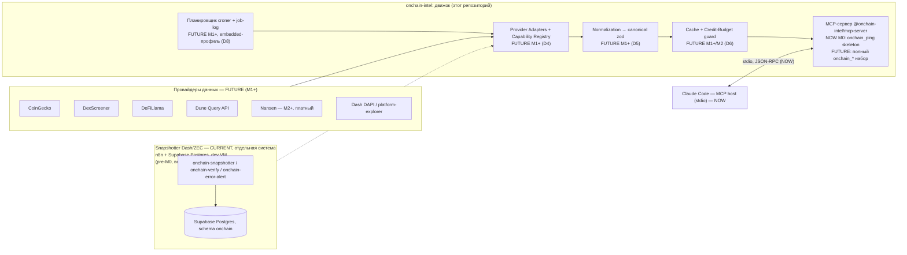
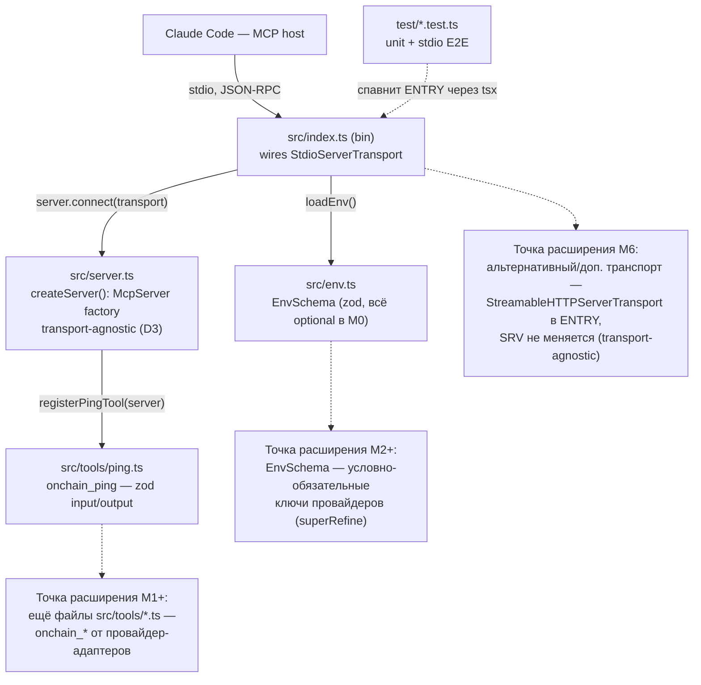

# ARCHITECTURE — `onchain-intel`

| Поле | Значение |
|---|---|
| **Статус документа** | Living document — обновляется **на месте**, никогда не архивируется по задачам |
| **Текущая задача** | [TASK-001 `m0-discovery-skeleton`](TASK.md) |
| **ADR** | [ADR-001-tech-stack.md](onchain-analytics/ADR-001-tech-stack.md) — **Accepted**, sign-off 2026-07-20 (Sergey), решения D1–D12 |
| **Схема данных (future)** | [DB-SCHEMA-CONCEPT.md](onchain-analytics/DB-SCHEMA-CONCEPT.md) — вне скоупа M0, контекст на будущее |
| **Roadmap** | [ROADMAP.md](onchain-analytics/ROADMAP.md) — фазы M0–M6 |
| **Обновлено** | 2026-07-21, версия v1 (первая версия документа, создана в рамках M0) |

---

## 1. Задача (Task Description)

`onchain-intel` — движок ончейн-аналитики: провайдер-адаптеры (Nansen/Dune/CoinGecko/DexScreener/
Bitquery/DAPI/…) → нормализация в канонический zod-типаж → кеш + credit-budget → snapshotter/
signals → собственный агрегирующий MCP-сервер. Стек и 12 решений (D1–D12) зафиксированы и
**Accepted** в ADR-001 (R-1) — эта архитектура их не пересматривает, а конкретизирует **первый
инженерный срез — M0** ([TASK-001](TASK.md)): pnpm-монорепо, TS strict, MCP-скелет с одним
dummy-tool `onchain_ping` на stdio, CI-гейт, каркас секретов. Полная RTM (R-1…R-15) — в TASK.md.

Документ решает две задачи одновременно:
1. **Системная рамка** (кратко, §2–3) — целевой движок целиком, по ADR-001, с пометками
   **NOW** (реализовано в M0) / **CURRENT** (уже работает, но отдельной системой) / **FUTURE**
   (M1+, ещё не создано).
2. **Конкретный дизайн M0** (основной объём, §3.2–10) — монорепо, MCP-скелет, тесты, CI.

**Важно, что уже существует и не является предметом этой архитектуры:** мини-снапшоттер
Dash Platform/ZEC — **n8n workflows + Supabase Postgres** в dev VM (`onchain-snapshotter`,
`onchain-verify`, `onchain-error-alert`; см. `CLAUDE.n8n.md`, `n8n-workflows/`). Он был поставлен
**pre-M0, вне гейта sign-off** (ROADMAP, время-критично — истории в DAPI нет) и живёт **отдельно**
от кода этого репозитория, который сейчас (M0) впервые появляется. M1 поглотит его в движок как
адаптер `dash-platform`/`platform-explorer` (D4) — это FUTURE, не трогается в M0.

---

## 2. Функциональная архитектура

### 2.1. Функциональные компоненты

**Компонент: Provider Adapters + Capability Registry — FUTURE (M1+, D4)**
- **Назначение:** горячо-заменяемый доступ к внешним провайдерам данных за стабильным внутренним
  интерфейсом (`capabilities()/costOf()/fetch()/normalize()` — уже зафиксирован в ADR-001 D4).
- **Функции:** маршрутизация по способности (`token.price`, `wallet.balances`, …), приоритет
  free→paid, anti-corruption layer (провайдерные DTO не протекают наружу).
- **Зависимости:** ничего не зависит в M0 — пакет `packages/adapters` **не создаётся** сейчас
  (anti-scope-creep, R-15).

**Компонент: Normalization → canonical zod-схема — FUTURE (M1+, D5)**
- **Назначение:** единый словарь домена (`Token/Wallet/Balance/Transfer/OHLCV/Pool/Signal/Snapshot`).
- Персистентная форма — [DB-SCHEMA-CONCEPT.md](onchain-analytics/DB-SCHEMA-CONCEPT.md); в M0 не
  используется — DB-кода нет.

**Компонент: Cache + Credit-Budget guard — FUTURE (M1+/M2, D6)**
- **Назначение:** `lru-cache` (горячий) → SQLite (персистентный), дневной потолок кредитов до
  платного вызова. Не существует в M0 — платных провайдеров и ключей ещё нет (лестница затрат
  M0–M1 = $0).

**Компонент: Планировщик / Snapshotter-Signals — CURRENT (отдельная система) + FUTURE (M1+, D8)**
- **CURRENT:** n8n (self-hosted, dev VM) — часовой снапшот Dash Platform/ZEC в Supabase Postgres
  (`onchain`), с алертами через Telegram. Работает **сегодня**, но вне этого репозитория как
  движка (это отдельно поставленная инфраструктура, см. §1).
- **FUTURE:** `croner` + durable job-log в SQLite (embedded-профиль, D8) — станет частью движка,
  когда провайдер-адаптеры (M1) поглотят снапшоттер.

**Компонент: MCP-сервер (`@onchain-intel/mcp-server`) — NOW (M0) + FUTURE (M1+)**
- **NOW (M0):** скелет на официальном `@modelcontextprotocol/sdk`, только stdio-транспорт
  (D3), один инструмент `onchain_ping` — предмет §3.2–10 этого документа.
- **FUTURE:** полный набор `onchain_get_token`, `onchain_wallet_balances`, `onchain_new_pairs`,
  `onchain_protocol_tvl`, `onchain_smart_money_flows`, `onchain_entity_label`, `onchain_token_risk`,
  `onchain_watch_add/list/remove` (D3); + Streamable HTTP транспорт (M6).

**Связанные Use Cases (TASK.md):** UC-1 (dev поднимает окружение), UC-2 (Claude Code вызывает
`onchain_ping`), UC-3 (CI на PR) — все относятся к компоненту MCP-сервер, единственному, который
существует в коде на этом этапе.

### 2.2. Диаграмма функциональных компонентов



---

## 3. Системная архитектура

### 3.1. Архитектурный стиль

**Стиль M0:** одиночный пакет в pnpm-монорепо (`packages/mcp-server`) — не микросервисы, не
слоистая архитектура внутри пакета (скелет слишком мал, чтобы её обосновать). Монорепо-каркас
(workspace + общий `tsconfig.base.json` + корневые скрипты) закладывается **сразу**, чтобы
добавление `packages/{core,adapters,signals,cli}` в M1+ было резом по шву, а не рефакторингом
(D12: «старт минимальный, режем по швам по мере роста» — TASK.md §0, предложение Analyst).

**Обоснование:** YAGNI. R-15 прямо запрещает создавать доп. пакеты сверх `mcp-server` в M0. Внутри
пакета — простая модульная структура (`server.ts` / `env.ts` / `tools/*.ts`), без DI-контейнеров и
фреймворков поверх официального MCP SDK.

### 3.2. Системные компоненты

#### Компонент: `@onchain-intel/mcp-server` (единственный пакет M0)

- **Тип:** Node.js CLI-процесс (bin), локальный stdio MCP-сервер.
- **Назначение:** минимальный работающий скелет под уже принятые решения ADR-001 (D1–D3, D10);
  доказывает, что `onchain_ping` отвечает по stdio из Claude Code — exit-критерий M0.
- **Реализованные функции:** `onchain_ping` (входная/выходная zod-схема, детерминированный ответ).
- **Технологии:** TypeScript (strict) / Node 22, `@modelcontextprotocol/sdk`, zod, tsup (сборка),
  tsx (dev-запуск), vitest (тесты).
- **Интерфейсы:**
  - *Inbound:* stdio (stdin/stdout), протокол MCP (JSON-RPC), клиент — Claude Code или любой
    MCP-host, использующий `StdioClientTransport`.
  - *Outbound:* нет (M0 не делает исходящих сетевых вызовов — нет провайдеров).
- **Зависимости:** `@modelcontextprotocol/sdk`, `zod` (runtime); `typescript`, `tsup`, `tsx`,
  `vitest`, ESLint/Prettier (dev). Не зависит от других пакетов монорепо (их нет).
- **Тестирование:** vitest — unit (env-схема, ping-хендлер) + автоматизированный stdio E2E
  (см. §3.2 «Тест-сьют» ниже и §10.2).

#### Компонент: Тест-сьют `packages/mcp-server/test/`

- **Назначение:** сделать exit-критерий «`onchain_ping` отвечает по stdio» **проверяемым в CI**,
  а не только вручную (замечание task-reviewer, ADR D11 предвосхищает такой E2E).
- **Состав:**
  - `env.test.ts` — unit: `EnvSchema.parse({})` не бросает (R-12); граничный кейс с невалидным
    значением падает с понятной ошибкой.
  - `ping.test.ts` — unit: прямой вызов экспортированного pure-хендлера `pingHandler()` (без
    поднятия сервера/транспорта) — проверяет форму ответа и то, что `PingOutputSchema.parse(...)`
    проходит.
  - `e2e.stdio.test.ts` — **E2E**: спавнит `src/index.ts` дочерним процессом через `tsx` (не
    `dist/`, см. §10.2 — порядок CI: `test` идёт **до** `build`), подключается SDK-шными `Client` +
    `StdioClientTransport`, вызывает `tools/list` (ожидает `onchain_ping` в списке) и
    `tools/call onchain_ping`, проверяет структуру ответа, закрывает транспорт (убивает процесс).
    Побочный эффект: если что-то пишет мусор в stdout (нарушая JSON-RPC framing), этот тест
    падает/виснет — естественный регресс-guard на инвариант «stdout только для протокола» (§7.3).

#### Компоненты вне скоупа M0 (FUTURE, из D12 — только план, не создаются сейчас)

| Пакет (D12, целевая раскладка) | Появится в | Причина не создавать сейчас |
|---|---|---|
| `packages/core` | M1+ | канонические типы/кеш/budget/registry — предмет D5/D6, нет кода до M1 |
| `packages/adapters` | M1+ | провайдер-адаптеры — D4, нет провайдеров до M1 (free-first) |
| `packages/signals` | M3 | watchlists/правила/scheduler/notifier — нужен `core`+`adapters` сначала |
| `packages/cli` | M1+ (по потребности) | локальная отладка — не критична для «онлайн-эхо» M0 |

### 3.3. Диаграмма компонентов (M0-скелет + точки расширения)



---

## 4. Data Model (Conceptual)

### 4.1. Entities Overview — в M0 персистентных сущностей нет

M0 **не создаёт БД-код** (R-15, вне скоупа TASK.md §3). Единственная «модель данных» этого
среза — две zod-схемы, которые одновременно валидируют рантайм и генерируют MCP tool-schema
(единый источник правды, D3/D5):

#### Схема: `EnvSchema` (`src/env.ts`)
- **Описание:** конфигурация процесса из `process.env`. В M0 **все поля опциональны** —
  обязательных секретов нет (R-12, лестница затрат M0–M1 = $0).
- **Ключевые атрибуты (M0):** зарезервированы под будущее — например `LOG_LEVEL?` (debug/info/
  warn/error) для диагностики; **никаких** provider-ключей (`NANSEN_API_KEY` и т.п.) в M0.
- **Бизнес-правило:** `EnvSchema.parse({})` обязан не бросать исключение — контракт R-12.
- **Эволюция (FUTURE, M2+):** условно-обязательные ключи через `.superRefine` (ключ провайдера X
  обязателен, только если способность X включена в `providers.config.ts` — D4) — форма схемы не
  меняется драматически, расширяется.

#### Схема: `PingInput` / `PingOutput` (`src/tools/ping.ts`)
- **`PingInput`** — пустой объект `z.object({}).strict()` (инструмент не принимает параметров, но
  схема существует явно — единый источник правды даже для «пустого» контракта, R-10).
- **`PingOutput`** — `{ ok: true, service: string, version: string, ts: number }`:
  - `ok` — литерал `true` (детерминированный успех, R-10);
  - `service` — литерал `'onchain-intel-mcp-server'`;
  - `version` — версия пакета из `package.json` (не хардкодится строкой в коде; конкретный способ
    чтения — предмет Development-фазы);
  - `ts` — epoch-ms UTC (`Date.now()`) — согласовано с конвенцией времени будущей БД
    (DB-SCHEMA-CONCEPT §1.2: только `INTEGER` epoch-ms UTC), хотя в M0 никуда не пишется.

**Будущие канонические сущности (FUTURE, M1+, D5)** — `Token`, `Wallet`, `Balance`, `Transfer/Flow`,
`OHLCV`, `Pool`, `Signal`, `Snapshot` — их поля/связи/персистентная форма спроектированы в
[DB-SCHEMA-CONCEPT.md](onchain-analytics/DB-SCHEMA-CONCEPT.md) §1–2 и **не пересматриваются**
здесь; M0 их не создаёт и не импортирует.

---

## 5. Интерфейсы

### 5.1. Внешние API — MCP tool `onchain_ping`

Единственный внешний контракт M0 — вызов инструмента по протоколу MCP (JSON-RPC 2.0 поверх stdio).
Пример (уровень протокола, не буквальный код):

```jsonc
// tools/call { name: "onchain_ping", arguments: {} }
// →
{
  "ok": true,
  "service": "onchain-intel-mcp-server",
  "version": "0.1.0",
  "ts": 1784000000000
}
```

Ошибки валидации входа (если бы вход был непустым и невалидным) возвращаются как MCP tool-error
(`isError: true` в результате вызова), **не** падением процесса — zod проверяет вход до вызова
бизнес-логики (UC-2, alt flow).

### 5.2. Внутренние интерфейсы

Сигнатуры (уровень архитектуры — не реализация; точные имена методов SDK типа
`server.tool()`/`server.registerTool()` зависят от версии `@modelcontextprotocol/sdk`, зафиксированной
в Development-фазе — «vendor counters drift», не хардкодим сейчас):

```ts
// src/server.ts — фабрика, transport-agnostic (D3): не создаёт транспорт, только сервер+tools
export function createServer(deps: { env: Env }): McpServer;

// src/env.ts
export const EnvSchema: z.ZodType<Env>;   // все поля optional в M0
export function loadEnv(raw?: NodeJS.ProcessEnv): Env; // fail-fast при невалидном значении

// src/tools/ping.ts
export const PingInputSchema: z.ZodObject<{}>;
export const PingOutputSchema: z.ZodObject<{ ok, service, version, ts }>;
export function pingHandler(input: PingInput, ctx: { version: string }): PingOutput; // pure, тестируется без транспорта
export function registerPingTool(server: McpServer, ctx: { version: string }): void; // server.tool('onchain_ping', ...)

// src/index.ts (bin) — единственное место, где выбирается транспорт
loadEnv(); createServer({ env }) → server.connect(new StdioServerTransport());
```

Разделение `pingHandler` (pure-функция) и `registerPingTool` (обвязка над SDK) — намеренное:
unit-тест бьёт по первому напрямую, E2E-тест — по второму через реальный stdio-транспорт.

### 5.3. Интеграции с внешними системами

В M0 их **нет** — ни одного провайдера, ни одного исходящего HTTP-вызова (R-15). Единственная
«интеграция» — сам MCP-host (Claude Code), потребляющий stdio-транспорт; это уже покрыто §5.1.
Будущий интерфейс интеграции с провайдерами (`ProviderAdapter.capabilities()/fetch()/normalize()`)
уже зафиксирован в ADR-001 D4 — здесь не дублируется.

---

## 6. Технологический стек

### 6.1. Backend
TypeScript (strict) / Node.js **22 LTS** (D1); pnpm workspaces + **tsup** (esbuild, сборка ESM) +
**tsx** (dev-запуск без отдельного шага компиляции) (D2); официальный `@modelcontextprotocol/sdk`
(D3); **zod** — единственный источник правды для валидации и MCP tool-schema (D3/D5).

### 6.2. Frontend
N/A — MCP-сервер, нет UI.

### 6.3. Database
N/A в M0 — никакого DB-кода (R-15). Будущий выбор (SQLite → Postgres, D6/D7) — вне скоупа этого
среза, см. [DB-SCHEMA-CONCEPT.md](onchain-analytics/DB-SCHEMA-CONCEPT.md).

### 6.4. Инфраструктура

**Монорепо-раскладка (создаётся в M0):**

```
onchain-analytics/                     # корень репозитория
├─ pnpm-workspace.yaml                 # packages: ["packages/*"]
├─ package.json                        # приватный root, license Apache-2.0, engines.node >=22
│                                       #   scripts: lint/format:check/typecheck/test/build → "pnpm -r <script>"
├─ tsconfig.base.json                  # strict, noUncheckedIndexedAccess, module/moduleResolution NodeNext
├─ .eslintrc / eslint config           # разделяемый, extends из корня
├─ .prettierrc
├─ LICENSE                             # полный текст Apache-2.0 (R-11)
├─ .env.example                        # документирует конвенцию 0600 (D10), пуст по секретам
├─ .github/workflows/ci.yml            # см. §10.2
├─ packages/
│  └─ mcp-server/                      # единственный пакет M0
│     ├─ package.json                  # name: @onchain-intel/mcp-server, engines.node >=22, license Apache-2.0
│     ├─ tsconfig.json                 # extends ../../tsconfig.base.json
│     ├─ tsup.config.ts                # entry src/index.ts, format esm, target node22
│     ├─ src/
│     │  ├─ index.ts                   # bin-entry: единственное место, монтирующее StdioServerTransport
│     │  ├─ server.ts                  # createServer(): McpServer factory (transport-agnostic)
│     │  ├─ env.ts                     # EnvSchema (zod), loadEnv()
│     │  └─ tools/
│     │     └─ ping.ts                 # onchain_ping: pingHandler + registerPingTool
│     └─ test/
│        ├─ env.test.ts
│        ├─ ping.test.ts
│        └─ e2e.stdio.test.ts
├─ n8n-workflows/                      # СУЩЕСТВУЕТ, pre-M0, отдельная система — не трогается
├─ sql/                                # СУЩЕСТВУЕТ, pre-M0 снапшоттер (Supabase) — не трогается
└─ docs/
```

`packages/mcp-server/package.json` (ключевые поля, не полный файл):

```jsonc
{
  "name": "@onchain-intel/mcp-server",
  "version": "0.1.0",
  "private": true,
  "license": "Apache-2.0",
  "type": "module",
  "engines": { "node": ">=22" },
  "bin": { "onchain-intel-mcp-server": "dist/index.js" },
  "scripts": {
    "build": "tsup",
    "dev": "tsx src/index.ts",
    "lint": "eslint .",
    "format:check": "prettier --check .",
    "typecheck": "tsc --noEmit",
    "test": "vitest run"
  },
  "dependencies": { "@modelcontextprotocol/sdk": "^*", "zod": "^*" },
  "devDependencies": { "typescript": "^*", "tsup": "^*", "tsx": "^*", "vitest": "^*", "eslint": "^*", "prettier": "^*" }
}
```

`tsconfig.base.json` (ключевые флаги — обязательны по R-4/D2):

```jsonc
{
  "compilerOptions": {
    "target": "ES2023",
    "module": "NodeNext",
    "moduleResolution": "NodeNext",
    "strict": true,
    "noUncheckedIndexedAccess": true,
    "skipLibCheck": true,
    "esModuleInterop": true,
    "declaration": true
  }
}
```

**Контейнеризация/деплой:** вне скоупа M0 — только локальный процесс под Claude Code (D3, §10.1).
Docker-образ — FUTURE (D12, §10.1 M6).

---

## 7. Безопасность

### 7.1. Аутентификация и авторизация
N/A в M0: сервер не слушает сеть, не имеет отдельного identity-периметра — процесс запускается и
доверяется хост-процессом (Claude Code) через stdio; это модель доверия локального дочернего
процесса, а не сетевого сервиса. Когда появится Streamable HTTP (M6, D3/D12) — потребуется
auth-слой (API-key/token) за transport-абстракцией; сейчас не проектируется (YAGNI).

### 7.2. Защита данных
- Секреты — **только** через `.env` (права `0600`, задокументировано в `.env.example`), никогда не
  коммитятся (`.gitignore` уже покрывает `.env`/`.env.*`, R-13 — верификация, не новая работа).
- Значения env **никогда не логируются** (D10) — даже на debug-уровне; в M0 практически нечего
  логировать (нет секретных ключей), но инвариант фиксируется на будущее (M2+, когда появятся
  provider-ключи).
- `EnvSchema` валидирует **при старте**, fail-fast на невалидное значение — ошибка идёт в stderr
  с понятным сообщением, а не молча проглатывается.

### 7.3. Защита от атак / поверхность
- **stdout-дисциплина (критично для stdio-транспорта):** ничего, кроме MCP-протокола, не пишет в
  stdout — весь диагностический вывод (лог, отладка) идёт в **stderr**. Нарушение ломает
  JSON-RPC framing и естественно фейлит/вешает E2E-тест (§3.2) — это одновременно и
  функциональный, и security-инвариант (протокольная путаница/DoS собственного клиента).
- **Валидация на границе:** zod проверяет вход `onchain_ping` (и любого будущего tool) **до**
  вызова бизнес-логики — невалидный вызов возвращается MCP tool-error, не крашит процесс (UC-2 alt).
- **Supply chain:** `pnpm install --frozen-lockfile` в CI (нет дрейфа зависимостей между локальной
  машиной и CI); зависимости минимальны (`@modelcontextprotocol/sdk`, `zod` в рантайме).
- **Лицензия:** Apache-2.0 на весь код M0 (D12, R-11) — патентный грант, корневой `LICENSE` +
  `license` в обоих `package.json`.

---

## 8. Масштабируемость и производительность

M0 — один dummy-tool, ноль данных, ноль состояния: тема неприменима по существу. Зафиксировано
для полноты формата и как явный якорь для будущего:
- **Горизонтальное масштабирование / кеш / БД / планировщик** — целиком FUTURE, решения уже
  приняты в ADR-001 (D6 кеш SQLite+LRU→Redis, D7 состояние SQLite→Postgres, D8 croner→BullMQ) —
  эта архитектура их не переоткрывает, только ссылается.
- **Единственная сейчас применимая практика:** M0 не вводит ничего, что позже придётся откатывать
  для масштабирования (нет синглтон-состояния в процессе, `createServer()` — чистая фабрика).

---

## 9. Надёжность и отказоустойчивость

### 9.1. Обработка ошибок
- Ошибка валидации входа tool → MCP tool-error (`isError: true`), процесс продолжает жить.
- Ошибка валидации `EnvSchema` при старте → процесс завершается с ненулевым кодом и понятным
  сообщением в stderr (fail-fast, не тихий дефолт) — хотя в M0 это маловероятно (все поля optional).
- Никакого retry/circuit-breaker слоя — нет исходящих вызовов, которые могли бы упасть (R-15).

### 9.2. Backup
N/A — нет персистентного состояния в M0 (ни файла БД, ни `DATA_DIR`-артефактов).

### 9.3. Мониторинг и алертинг
M0: только структурированные строки в stderr (без специального фреймворка — YAGNI на этом
размере). **FUTURE (M6):** pino + OpenTelemetry, дашборд per-provider costs (уже в ROADMAP).

---

## 10. Деплой

### 10.1. Окружения
Только **dev**, локально, под Claude Code — нет staging/prod для этого пакета в M0 (не путать с
уже существующим prod dev-VM для n8n-снапшоттера — это отдельная, ранее поставленная система,
§1). Публичный хостинг (Fly.io/Railway/VPS) — FUTURE, вместе со Streamable HTTP (D3/D12, M6).

### 10.2. CI/CD Pipeline

`.github/workflows/ci.yml` — единственный workflow, триггеры `push` + `pull_request`, матрица
`node-version: ['22']` (R-8 — пиннинг Node 22 в CI независимо от локальной версии разработчика).
Порядок шагов (важен — E2E из §3.2 спавнит `tsx`, не `dist/`, поэтому `test` идёт **до** `build`):

```
checkout → corepack enable (pnpm) → setup-node@22 (кеш pnpm store)
  → pnpm install --frozen-lockfile
  → pnpm lint            # ESLint по packages/**/*.ts
  → pnpm format:check    # Prettier --check
  → pnpm typecheck       # tsc --noEmit
  → pnpm test            # vitest run — включает stdio E2E
  → pnpm build           # tsup — dist/ (после теста, не до)
```

Все шаги — без сети/секретов (R-15/R-12: пустой env валиден, платных ключей нет).

### 10.3. Конфигурация
`EnvSchema` (`src/env.ts`) — единственный источник конфигурации процесса; в M0 **все поля
опциональны**, обязательных секретов нет. `.env.example` в корне документирует конвенцию `0600`
для будущих секретов (провайдер-ключи появятся в M2+) — сам файл не содержит значений.

### 10.4. Инструкция по развёртыванию (dev)

1. `git clone` → `pnpm install` в корне (workspaces поднимают единственный пакет).
2. `pnpm build` (tsup собирает `packages/mcp-server/dist/`) — или `pnpm --filter
   @onchain-intel/mcp-server dev` (tsx, без сборки) для локальной разработки.
3. `pnpm lint && pnpm typecheck && pnpm test` — всё зелёное без сети/секретов (UC-1).
4. Подключение к Claude Code как локальный stdio MCP-сервер — команда указывает на
   `node packages/mcp-server/dist/index.js` (после build) или `tsx
   packages/mcp-server/src/index.ts` (dev); конкретная запись в MCP-конфиге хоста — за пределами
   этого документа (секреты/конфиг хоста не коммитятся, см. `.mcp.json` в `.gitignore`).
5. Вызов `onchain_ping` из Claude Code → детерминированный ответ (UC-2, exit-критерий ROADMAP
   «`onchain_ping` отвечает из Claude Code (stdio)»).

---

## 11. Открытые вопросы

Блокирующих вопросов нет — ADR-001 уже закрыл ключевые развилки (D1–D12 Accepted), TASK-001
не оставил открытых пунктов (Open Questions в TASK.md — не блокирующие, зафиксированы как принятое
решение Analyst: единственный пакет M0 — `packages/mcp-server`). Зафиксировано как non-blocking
на будущее:
- Точное имя SDK-метода регистрации tool (`server.tool()` vs `server.registerTool()`) — зависит от
  версии `@modelcontextprotocol/sdk`, закрепляемой в Development-фазе (vendor drift — не
  хардкодим здесь).
- Механизм чтения `version` в `PingOutput` из `package.json` (import assertion vs build-time
  инъекция) — деталь реализации, не архитектурное решение.
