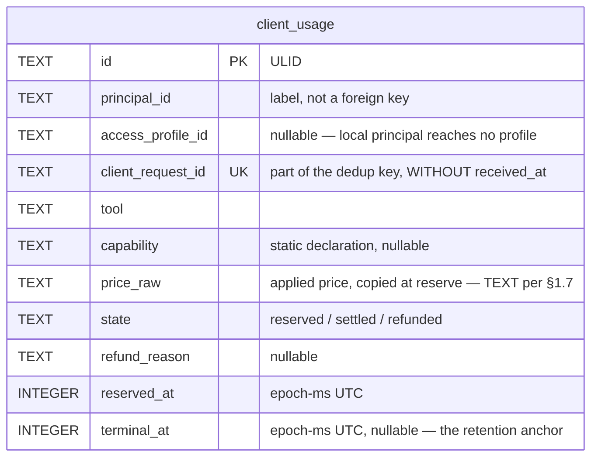

> Part of [docs/ARCHITECTURE.md](../ARCHITECTURE.md) → [data-model.md](data-model.md).
> Heading levels are the parent document's, unchanged: the section numbers are how
> every other document addresses this text.

### 4.6. T-015 — the client billing ledger and the daily call gate

T-015 adds one table, `client_usage` (§4.6.1), and one column, `usage.calls_made` (§4.6.3). Both
extend the shape T-014 built rather than replace any part of it. `client_usage` is declared in both
dialects from one canonical form, the same discipline §4.5 states for the eight T-014 tables
(§4.5.1). It follows the same storage axis — SQLite in `DATA_DIR` for `local`/`network-sqlite`,
Postgres schema `onchain` for `network` — closing `OQ-F` in `ADR-003`.

**Package boundary, stated once here because it decides where each piece below is designed.**
`client_usage` carries `principal_id` and `access_profile_id`, so it belongs to the same family as
`request_trace`/`diagnostics`: designed and written in `packages/mcp-server`, never in
`packages/core` (`security.md` §7.5.1, "`packages/core` gains no knowledge of tokens, roles or
headers"). The daily call gate of §4.6.3 carries neither field — it is `(provider, day)`, the same
shape `usage`/`usage_window` already are — so it belongs to `packages/core`'s `BudgetStore`, beside
the velocity gate it generalizes. `ADR-003` D4's two-ledger split is therefore also a package split:
`client_usage` in `mcp-server`, the provider call counter in `core`.

#### 4.6.1. `client_usage` — the ledger T-015 charges into (R-1, R-2, R-5, R-7)

```sql
-- PLANNED — packages/mcp-server/src/engine/billing-store.ts, both dialects
CREATE TABLE IF NOT EXISTS client_usage (
  id                 TEXT PRIMARY KEY NOT NULL,   -- ULID
  principal_id       TEXT NOT NULL,      -- api_tokens.id, or 'local' — a label, not a foreign key,
                                          -- for the same reason request_trace.principal_id is one
  access_profile_id  TEXT,               -- nullable: the local principal reaches no profile (R-7.5)
  client_request_id  TEXT NOT NULL,      -- the accepted client value, or the server-minted id
  tool               TEXT NOT NULL,      -- the wire name — always known at the reserve point
  capability         TEXT,               -- the tool's STATIC declared capability, or NULL (§4.6.2)
  price_raw          TEXT NOT NULL,      -- the applied price, copied at reserve time (§1.7 canon)
  state              TEXT NOT NULL,      -- 'reserved' | 'settled' | 'refunded'
  refund_reason      TEXT,               -- class name, or 'expired' — only when state='refunded'
  reserved_at        INTEGER NOT NULL,   -- epoch-ms UTC, pinned once
  terminal_at        INTEGER,            -- epoch-ms UTC the row left 'reserved' — the retention anchor
  created_at         INTEGER NOT NULL,
  updated_at         INTEGER NOT NULL,
  UNIQUE (principal_id, client_request_id),
  CHECK (state IN ('reserved','settled','refunded')),
  CHECK ((state = 'refunded') = (refund_reason IS NOT NULL)),
  CHECK ((state = 'reserved') = (terminal_at IS NULL))
);
CREATE INDEX IF NOT EXISTS idx_client_usage_principal ON client_usage (principal_id, reserved_at);
CREATE INDEX IF NOT EXISTS idx_client_usage_terminal   ON client_usage (terminal_at);
CREATE INDEX IF NOT EXISTS idx_client_usage_reserved   ON client_usage (state, reserved_at);
```

- **Primary key:** `id`. **Natural UNIQUE dedup key:** `(principal_id, client_request_id)`.
- **Indexes:** `(principal_id, reserved_at)` for a per-principal period query; `(terminal_at)` for the
  retention job (§4.6.1's own paragraph below); `(state, reserved_at)` for the reconciliation scan
  (§4.6.5).
- **Serves:** R-1.1 through R-1.4, R-2.1 through R-2.4, R-5.1 through R-5.5, R-7.1 through R-7.6.

**Why a separate table, not a column on `BudgetStore`'s `usage`** (R-1.1). `ADR-003` D4: "Слить их в
одну таблицу — значит навсегда потерять различие «наш расход» / «выручка»". `usage` counts what we
owe a vendor; `client_usage` counts what we charged a client. A cache hit costs the vendor nothing
and the client the full price — one row could not hold both facts for one request.

**The dedup key carries no time component** (R-5.1). `request_trace`'s own key is
`(principal_id, client_request_id, received_at)` (§4.5.7) — time is IN it, so a retry writes a SECOND
trace row by design. A billing key with the same shape would let a retry charge twice. `ADR-003`
`OQ-F`: "Леджеру нужен ключ без времени, иначе ретрай спишет дважды."

**`reserve()` is therefore `INSERT … ON CONFLICT (principal_id, client_request_id) DO NOTHING`,
the same atomicity pattern `checkAndReserve` already gives** (R-1.2, `packages/core/src/cache/budget-store.ts:300`).
A conflict means an existing row already answers this `client_request_id`, on ANY of the three
states — the caller reads it back rather than writing a second one. Two concurrent admissions of one
`client_request_id` resolve to one surviving row by the storage engine's own uniqueness constraint,
not by application-level locking (UC-2 A1).

**`principal_id` is a label, not a foreign key, for the same reason `request_trace.principal_id`
is one** (`data-model.md` §4.5.7: "the local profile's principal has no token row"). A foreign key
would refuse every stdio-profile write, the transport that needs no token at all.

**`access_profile_id` carries no `REFERENCES` clause either, mirroring `request_trace`'s own
column.** The two sibling tables disagree with nothing by staying consistent with each other.

**Why `capability` is nullable and is the STATIC declaration, not the dynamic resolved value.** Task
014-30 built TWO different capability values on the same request: `definition.capability` (static,
known before the handler runs) and `resolvedCapability` (`definition.capability ?? outcome.capability
?? null`, known only after it returns, `OD-014-30-12`). The billing reserve happens **before**
`resolve()` (R-2.1), so only the static value exists at that point. A row for `onchain_ping` or
`onchain_list_chains` — whose static `capability` is `null` — carries `capability = NULL` and prices
from `tool` alone (§4.6.2).

**`terminal_at` is the retention anchor, not `reserved_at`** (R-7.6, AC-40). The requirement is three
years from the row's terminal state, and the CHECK constraint ties `terminal_at`'s presence to the
row leaving `'reserved'`, so a query filtering on it never has to branch on `state` separately.

**Retention — three years from `terminal_at`, a value distinct from `request_trace`'s and
`diagnostics`'s windows** (`DB-SCHEMA-CONCEPT` §4; R-7.6). The number is a working figure carried
over verbatim from the phrasing the owner selected on 2026-08-25, not a separately derived one — the
same qualification `docs/TASK.md` §5 states about it. The retention job is designed beside the
reconciliation job it shares a discipline with (§4.6.5).

**Storage axis — only Postgres rows are authoritative** (R-7.2, R-7.3; closes `ADR-003` `OQ-F`). On
SQLite (`local`, `network-sqlite`) the row is written — the seam exercises without a database — but
no ledger read consults it. `client_usage` follows the SAME axis `CacheStore`/`BudgetStore`/
`LimiterStore` already follow (`system-architecture.md` §3.4.8), so `EnvSchema.parse({})` keeps
succeeding (R-13.5) and the local profile requires no Postgres to run.

**Balance arithmetic under `credits_mode = 'metered'` — where `credits_balance_raw` moves, and in
what type** (closes architecture review round 1 BLOCKING-2). Three questions the round-1 draft left
each open to two incompatible readings; each is closed here, once, rather than left for the
Development phase to guess.

1. **Debited at `reserve()`, not at `settle()`.** `access_profiles.credits_balance_raw` is decremented
   by `price_raw` in the SAME transaction as the `client_usage` insert — one connection, one
   `BEGIN`/`COMMIT`, mirroring `checkAndReserve`'s own atomic check-and-write (§3.4.8). `settle()`
   changes nothing on the balance: the amount was already committed at reserve, and R-4.2/R-4.3 make
   the price fixed from that point on. `refund()` credits the SAME amount back, in the same
   transaction as the row's transition to `'refunded'` — **and only when that transition actually
   happened**. The credit runs off the SAME conditional `UPDATE … WHERE state = 'reserved'` this
   section's own "Balance arithmetic" point 3 already uses for the debit ("Zero rows returned is the
   refusal… nothing is written"). So a `refund()` that finds the row already terminal returns a row
   count of zero and credits nothing (task 015-10, closes architecture review round 2 MAJOR-C). A
   second `refund()` on one row — the ordinary shape of UC-2's retry reaching the completion step
   twice — is therefore a no-op on the balance, not a second credit of `price_raw`.

   **Why eager debit, not a lazy one at `settle()`.** A lazy debit leaves a window between reserve and
   settle in which the balance has not yet fallen — exactly the window BLOCKING-2 named: "two parallel
   requests on an exhausted balance both pass." Debiting at reserve closes it: a second concurrent
   `reserve()` against the same profile reads the ALREADY-decremented balance, the same guarantee
   `usage.credits_used` gives `checkAndReserve` today.

2. **"Already reserved" needs no separate aggregate query or index.** Because the debit is eager, the
   single `credits_balance_raw` value already nets out every open reservation for that profile — there
   is no second number to sum. This is why MAJOR-1's missing `(access_profile_id, state)` index is not
   introduced: the balance check is one row read, not a `GROUP BY`.

3. **The comparison and the arithmetic are exact, never a JS `Number`** (CLAUDE.md canon, "BigInt,
   never Number", the L-2 precedent). On the Postgres axis the debit is one conditional statement,
   mirroring §3.4.8's canonical `checkAndReserve` shape:

   ```sql
   UPDATE onchain.access_profiles
      SET credits_balance_raw = (credits_balance_raw::numeric - $2::numeric)::text
    WHERE id = $1 AND credits_balance_raw::numeric >= $2::numeric
   RETURNING credits_balance_raw;
   ```

   `numeric` is Postgres's own arbitrary-precision exact type — never `float`/`double precision`.
   A plain `TEXT` compare reads `'9' > '10'` as true; the cast to `numeric` makes the comparison
   numeric, not textual, so that lexicographic error cannot occur. Zero rows returned is the refusal
   (`ClientCreditsExhaustedError`), and — matching `checkAndReserve`'s own contract
   (`packages/core/src/cache/budget-store.ts:50-51`) — nothing is written. On the SQLite axis the
   same read-compare-write runs inside `db.transaction(fn).immediate()` (§4.2's established pattern),
   with the arithmetic done in JS as `BigInt`, never `Number`, before the single synchronous write.

**Why this reads R-6.1 as "the MODE, not the atomic write, goes through `AccessProfileReader`."**
`AccessProfileReader.read()` (`security.md` §7.5.3a) decides `credits_mode` — a stable, rarely-edited
fact, read once per request with no atomicity requirement.

The debit above is a SEPARATE statement, against the SAME row, inside `reserve()`'s own transaction.
An arbitrary async supplier behind `AccessProfileReader`'s interface cannot promise atomicity with a
concurrent write. So the requirement that credit-checking not use "a separate path" is read as
binding the MODE lookup, not the balance's own atomic update. This narrowing is stated explicitly
rather than left to be inferred from the code.

**`credits_mode = 'unlimited'` never reaches any of the above** (R-6.2). The debit statement runs only
when the profile is `metered`; phase 0's one profile is `unlimited`, so the write path exists and is
tested (AC-13) without being exercised in production.

**The aggregate read AC-4 needs — a second, independent capability, not the balance check above**
(closes architecture review round 1 MAJOR-1). `BillingStore` gains `sumSettled(periodFromMs,
periodToMs): Promise<string>`, Postgres axis only (R-7.3), backing AC-4's "sum of `settled` over a
period ≠ vendor spend over the same period":

```sql
SELECT COALESCE(SUM(price_raw::numeric), 0)::text
  FROM onchain.client_usage
 WHERE state = 'settled' AND terminal_at >= $1 AND terminal_at < $2;
```

The existing `idx_client_usage_terminal (terminal_at)` already serves this read; no new index is
added for it.

**A supplementary diagram, scoped to this table alone** — the existing diagram of §4.3 is left
unchanged, so every coordinate already cited into it (`data-model-network-state.md:381-386`, `:478`, `:488`
and others) keeps resolving where it does today:



**The replay window is a derived value, not a stored one — closes `ADR-003` `OQ-G`, closes
architecture review round 1 MAJOR-11 (R-5.6, R-5.7, R-5.9).**

> `windowMs = min(ttlFor(capability ?? tool) * 1000, REPLAY_AND_RECONCILE_CEILING_MS)`

`client_usage` gains no column for it. The two inputs already exist on the row above: `reserved_at`
(pinned once), and the capability manifest's `ttlSeconds` for the row's own `capability ?? tool`.
That key derivation is the SAME one R-4.6/§4.6.2 already uses to look up a price, reused here for a
different table. `ttlFor` (`packages/core/src/cache/ttl.ts:40`, exported at
`packages/core/src/index.ts:190`) is
called unchanged, from `packages/mcp-server`, across the package boundary this section's own opening
paragraph draws.

**A capability-less tool lands on the 120 000 ms ceiling through that SAME fallback, not a branch
added for it.** `onchain_ping` and `onchain_list_chains` carry `capability = NULL`
(`packages/mcp-server/src/tools/registry.ts:473`, "answer synchronously and resolve no capability").
`ttlFor(null ?? tool)` finds no manifest row for either tool's wire name and resolves through the
function's own existing miss path — `DEFAULT_TTL_SECONDS`, 300 s (`cache/ttl.ts:21`) — so `windowMs`
lands at the ceiling for both by construction.

**One constant, two consumers, not two literals.** `REPLAY_AND_RECONCILE_CEILING_MS` (120 000 ms) is
the SAME number §4.6.5 below derives independently — twice the largest declared `deadlineMs`
(`ADR-002` D4 п.2) — for the reconciliation scan's own threshold. R-5.6 names the two as the same
bound explicitly. One constant read by both this check and §4.6.5's scan is the rule this document
already applies elsewhere against carrying one fact in two places (§4.2.3), not a new rule.

**Two timescales share one row, and they diverge within seconds of it (R-5.9).** `terminal_at` and
the three-year retention clock it anchors (above) answer how long the row is kept. `reserved_at` and
`windowMs` answer a narrower, earlier question — how long `client_request_id` can still be replayed.
Four capabilities are the exception: `gas.price`, `pairs.active` at 30 s; `token.price`,
`wallet.balances.native` at 60 s — their own TTL binds `windowMs`, not the ceiling. For every other
capability, the row stays bookkeeping for years after its own replay key has gone stale.

**What `client_usage` does not gain — the storage half of `OQ-G`'s deferred choice, closed here.** No
response body, no `args_hash`, no pointer into `cache_entries` is added to this table.
`system-architecture.md` §3.5.2a states the mechanism this schema supports. A replay inside the
window re-runs the tool's handler, the same `resolve()`/cache path a fresh call takes. It never reads
a captured answer back out of the ledger. The schema `docs/TASK.md` already specified for R-1 through
R-5.5 needed no column added for R-5.6 through R-5.9. That sufficiency is itself part of the choice's
own justification, stated in full at §3.5.2a — not a coincidence.

#### 4.6.2. The price list — compiled data, not a database table (R-4)

**A price list is a compiled TypeScript artifact — the same class as the capability manifest
(§4.1) and the closed `diagnostics.event` vocabulary (§4.5.8).** It rests on the same three reasons
§4.2.1 gives the chain registry: the offline gate, CI determinism, and reviewability. A price
change is a git diff a human reads, not a runtime mutation nobody sees happen.

This satisfies R-4.1 ("versionable data, not a literal in the call code") without adding a table, a
migration, or a round trip to the reserve path. The price is looked up in memory, before
`resolve()`, on the same request-per-millisecond path the interception point already runs on.

```ts
// PLANNED — packages/mcp-server/src/billing/price-list.ts
export const DEFAULT_PRICE_RAW = '1'; // one credit per call, until a row says otherwise (OQ-1)

export const PRICE_LIST: Readonly<Record<string, string>> = Object.freeze({
  // capability or tool name → price, as TEXT (§1.7). Empty today (R-4.4): phase 0 needs no entry
  // here to charge the default uniformly. A future entry overrides ONE key without touching this
  // module's callers.
});
```

**The lookup key is `capability ?? tool`** (R-4.6, "цена — атрибут строки прайс-листа по
способности/тулу"). For the thirteen single-capability tools this resolves through their static
`capability`; for `onchain_ping`, `onchain_list_chains` and any tool whose static `capability` is
`null`, it falls back to the tool's wire name. A missing key resolves to `DEFAULT_PRICE_RAW`.

**Form of the value — `TEXT`, per `DB-SCHEMA-CONCEPT` §1.7** (R-4.5), the rule that names credits
explicitly: "value_raw TEXT (credits and wei-like integers exceed the safe 2^53…)". The same form
`access_profiles.credits_balance_raw` already carries, so a reserve compares two `TEXT`-encoded
integers rather than one `TEXT` and one `number`.

**The applied price is copied into `client_usage.price_raw` at reserve time and never re-read from
the list afterward** (R-4.2, R-4.3, UC-8). Editing `PRICE_LIST` after a row is written changes the
price of the NEXT reserve; the recorded row is immutable data from that point on, the same
`append-only, no revising` discipline `request_trace` already follows (§4.5.7, "one write, at
completion").

**Why this module carries no version field.** Nothing reads a price list version independently of
a row's own `price_raw`. The requirement is that history does not change, which the copy already
guarantees. A version column would be a second source of the same fact (§4.2.3's rule against
carrying one fact in two places).

#### 4.6.3. `usage.calls_made` — the daily call gate, extending `BudgetStore` (R-9)

**One additive column, mirroring `usage_window.calls_made`'s own pattern at the DAY bucket instead
of the minute one** (R-9.2, R-9.3). `usage_window.calls_made` already exists for exactly this
reason — "the SECOND denominator… a credit-denominated gate can never refuse a call that costs
ZERO credits" (§4.2, Q-3). `ADR-003` D6 names this precisely: "работа T-015 — не новая таблица, а
обобщение существующего сторожа с одного провайдера на любой."

```sql
ALTER TABLE usage ADD COLUMN calls_made INTEGER NOT NULL DEFAULT 0; -- CHECK (calls_made >= 0)
```

Applied the same additive, mechanical way §4.2 already documents for `usage_window.calls_made`.
On the SQLite axis: `PRAGMA table_info`, idempotent on every open, no backfill — `DEFAULT 0` is
correct by construction for a row that predates the column. On the network axis: the Postgres
migration's own `ALTER TABLE`. **Monotonic, never refunded** (mirroring `usage_window`'s own
rule): the vendor was called; giving the count back would let a run of cheap-and-refunded calls slip
past the very limit it exists to enforce.

**`checkAndReserve` gains one more optional parameter, `dailyCalls`, of the same shape `velocity`
already has** (R-9.4, AC-20):

```ts
// PLANNED — packages/core/src/cache/budget-store.ts, BudgetStore.checkAndReserve
checkAndReserve(
  provider: string,
  dayBucketMs: number,
  cost: number,
  ceiling: number,
  velocity?: VelocityLimit,
  dailyCalls?: { ceiling: number }, // R-9 — compared against usage.calls_made, in the SAME transaction
): Promise<{ ok: true } | { ok: false; reason: string }>;
```

**This is the SAME function nansen's velocity gate and blockscout's daily gate both call — the
literal requirement of AC-20** ("тот же гейт-код обслуживает nansen и blockscout без провайдер-
специфичной ветки"). Nothing inside `checkAndReserve` names a provider; the caller supplies the
ceiling, exactly as it already does for `cost`/`ceiling`/`velocity`.

**`AdapterRegistration` gains one field, `dailyCallCeiling: number | 'none'`, TOTAL over every
`tier: 'free'` registration — not optional** (R-9.5, R-9.7, R-9.6; closes architecture review round 1
BLOCKING-1). The field is declared per provider, applied without a route-level setting.

**Why `'none'` and not an absent field.** An absent field is what the round-1 draft of this section
used, and `assertValidAdapterRegistrations()` — called at `packages/mcp-server/src/index.ts:45` and
loudly fatal to the process (`:51`) — refused every `tier: 'free'` registration that carried none.
Measured against `providers.config.ts`: **ten** registrations are `tier: 'free'`
(`coingecko`, `dexscreener`, `defillama`, `blockscout`, `rpc-evm`, `rpc-solana`, `dash-platform`,
`platform-explorer`, `pg-history`, `blockchain-info`); the round-1 draft declared the field on
**one** of them.

The mechanical rule `assertValidAdapterRegistrations()` runs is `tier === 'free' &&
dailyCallCeiling === undefined` fails the process. It cannot see a narrower, intended class of "free
providers WITH an invisible vendor limit" — only a declared value can carry that distinction.
`docs/TASK.md` §2.2 already rejects inventing a number with nothing behind it. `'none'` is total: it
resolves the rule for the nine without fabricating a ceiling for any of them.

**`'none'` carries its reason beside it, not as a bare sentinel** (R-9.6, the same L-3/L-10
precedent §4.5.3 already applies to a declared-not-inferred mode column):

```ts
// PLANNED — packages/core/src/adapters/types.ts, AdapterRegistration
dailyCallCeiling: number | 'none'; // R-9.5/R-9.6 — total over every tier:'free' registration;
// 'none' is paired with a same-line comment naming why
```

| Provider            | `dailyCallCeiling`                    | Why                                                                                                                      |
| :------------------ | :------------------------------------ | :----------------------------------------------------------------------------------------------------------------------- |
| `blockscout`        | `625` (`ADR-003` D6 estimate, R-10.1) | the one measured/estimated free-tier daily cutoff (§4.6.4)                                                               |
| `pg-history`        | `'none'`                              | our own Postgres — no vendor account to exhaust                                                                          |
| `rpc-evm`           | `'none'`                              | curated RPC hosts — the chain itself is the source (§7.2.1)                                                              |
| `rpc-solana`        | `'none'`                              | curated RPC host — the chain itself is the source                                                                        |
| `dash-platform`     | `'none'`                              | no live transport yet — interface + fixture contract (§11)                                                               |
| `coingecko`         | `'none'`                              | documented limit is per-minute, already the `rateLimit` bucket's job; no invisible DAILY ceiling found                   |
| `dexscreener`       | `'none'`                              | keyless catalog endpoint; no documented account-level ceiling                                                            |
| `defillama`         | `'none'`                              | keyless catalog endpoint; no documented account-level ceiling                                                            |
| `platform-explorer` | `'none'`                              | no documented vendor account limit found; not measured — out of T-015 scope, which covers blockscout only (`ADR-003` D6) |
| `blockchain-info`   | `'none'`                              | keyless catalog endpoint; no documented account-level ceiling                                                            |

**The nine `'none'` reasons are not equally strong, and that is stated rather than smoothed over.**
Three are structural (`pg-history`, `rpc-evm`, `rpc-solana` — there is no vendor account behind the
call at all). One is moot today (`dash-platform` has no live transport). Five are an absence of
evidence, not evidence of absence: `coingecko`, `dexscreener`, `defillama`, `platform-explorer` and
`blockchain-info` may yet have an invisible daily ceiling nobody has measured. `'none'` records
today's evidence; it is not a claim that no such ceiling exists, and a future measurement replaces
the value in the same one-line diff `blockscout`'s own row already models.

**`nansen` and `dune`, both `tier: 'paid'`, carry no `dailyCallCeiling` field at all — the class is
`tier: 'free'` only, and the field does not exist on a paid registration.** `assertValidAdapterRegistrations()`
therefore checks exactly the mechanical condition it can check: presence of the field on every
`tier: 'free'` row, nothing narrower and nothing wider (closes BLOCKING-1).

**One provider-level number bounds all four blockscout routes** (R-9.7) — `entity.labels`,
`token.holders`, `chain.transactions`, `gas.price`. `checkAndReserve` is called with
`provider = 'blockscout'` on every one of them, not per route. §4.6.4 states what that number rests
on and what it does not.

**A recorded discrepancy, not a silent one: `dailyCallCeiling` living in `providers.config.ts`
collides with AC-42's literal check (closes architecture review round 1 MAJOR-3).** AC-42 reads
"`refillPerSec` and its 'not measured' comment are unchanged — diff of `providers.config.ts` is
empty." A `dailyCallCeiling` row on ten registrations is itself a diff of that same file, so the
literal check as worded cannot pass once this section is applied.

`docs/TASK.md` is out of this phase's editing scope. A disagreement with it is recorded as an open
question (`open-questions.md` §"AC-42 vs. `dailyCallCeiling`"), not silently resolved here. The
design's own reading is the one AC-42's own text names as what must not change: `refillPerSec`
(`providers.config.ts:342`) and its comment stay untouched BY VALUE. `dailyCallCeiling` is a new,
independent field the same file also carries, added beside them rather than in place of them.

#### 4.6.4. Route pricing behind the ≈625 estimate, and the safe default for the unpriced three

**`entity.labels`' vendor cost is a CITED, derived number: ≈160 credits, from a documented three-way
fan-out.** `get_address_info` (the endpoint behind `entity.labels`) calls three upstreams inside the
vendor — 20 + 120 + 20 ≈ 160 credits
(`docs/tasks/task-008-blockscout-free-tier.md` §1.2, measured 2026-07-28;
`packages/core/src/providers.config.ts:324-330`). `ADR-003` D6's ≈625/day figure is
`100_000 / 160 ≈ 625`, the SAME derivation R-9.7 already names.

**The other three routes carry no such number.** `token.holders` (`/v1/direct_api_call`) and the
`/api/v2/stats` document behind `gas.price`/`chain.transactions` are each ONE upstream call — weight
1, not 3 (`packages/core/src/adapters/blockscout/index.ts:223-227`, `WEIGHT_ADDRESS_INFO`'s own
comment: "`/v1/direct_api_call`… stays at the default weight of 1"). "One upstream" bounds the SHAPE
of the cost, not its vendor credit value — no measurement anywhere in this repository states what
Blockscout's internal accounting charges for a single-upstream call.

**A route whose price is not cited is treated as costing AT LEAST as much as the most expensive
cited route, for any argument that depends on price.** This is the safe default the review round 3
MAJOR-3 asked for, applied rather than deferred. Treating an unpriced route as cheap is the
direction that can silently exceed the vendor's real ceiling. Treating it as expensive is the
direction that can only under-use headroom that was never guaranteed anyway.

**The residual this default carries, named rather than hidden.** A single provider-level
`dailyCallCeiling` of ≈625 protects the vendor's 100 000-credit budget only if NO route actually
costs more than `entity.labels`' ≈160. Nothing measures the other three, so that inequality is
assumed, not proven. `docs/TASK.md` §2.2 records that `ADR-003` D6's own obligation — "T-015 заменяет
догадку измерением" — is left deliberately unfulfilled by the owner's 2026-08-25 decision on
`OQ-6`. This paragraph is that same acceptance, restated at the point where it becomes a concrete
number protecting a concrete budget. The trigger that would revisit it is unchanged: `ADR-003`
§Revisit
when, "if measurement shows the real ceiling is lower than ≈625/day".

#### 4.6.5. Background reconciliation of a stuck `reserved` row (R-14)

**Purpose.** A process that dies between reserving and completing a request leaves a `client_usage`
row in `'reserved'` forever, unless something closes it.

**Threshold — twice the largest declared `deadlineMs`, applied `120_000` ms** (R-14.2). Measured by
`grep -cE '^\s*deadlineMs: [0-9_]+,' packages/core/src/capability-manifest.ts`: 27 rows carry a
value, and the largest is `deadlineMs: 60_000`. A plain `grep -c 'deadlineMs:'` answers 28. The
extra line is the interface field (`packages/core/src/capability-manifest.ts:158` —
`  deadlineMs: number;`), which declares the type rather than a deadline. The threshold `120_000`
and the maximum `60_000` are unaffected: this correction moves the counter, not the bound.

**Why double, and not the single maximum.** `ADR-002` D4 п.2 (R-17) lets an already-accepted paid
call finish past its own deadline — the deadline bounds SPENDING, not delivery
(`reliability.md` §9.1). A row that is genuinely still in flight at exactly one deadline's width is
not yet stuck.

**The scan closes the row AND returns its credit — one SQL operator, not a pair of nodes** (task
015-10, closes architecture review round 2 MAJOR-A). An earlier edition of this section stated the
scan as a bare transition: `SELECT id … LIMIT :batchSize`, then the SAME conditional `UPDATE …
WHERE state = 'reserved'` the completion path uses. It never mentioned
`access_profiles.credits_balance_raw` at all — the reconciliation job MARKED a stuck row without
ever returning what it had reserved. Task 015-18's executor is `n8n`, and an n8n workflow gives no
transaction BETWEEN two SQL nodes: each node is its own round trip, committed on its own. So a
"transition node, then credit node" pair would leave a window in which a row is closed but not yet
credited. The corrected form is a single statement instead — a writable CTE feeding its own credit —
not two nodes hoping nothing runs between them:

```sql
WITH t AS (
  UPDATE client_usage
     SET state = 'refunded', refund_reason = 'expired', terminal_at = :nowMs
   WHERE state = 'reserved' AND reserved_at < :nowMs - 120000
  RETURNING access_profile_id, price_raw
)
UPDATE access_profiles p
   SET credits_balance_raw = (p.credits_balance_raw::numeric + s.sum_raw)::text
  FROM (SELECT access_profile_id, SUM(price_raw::numeric) AS sum_raw
          FROM t WHERE access_profile_id IS NOT NULL GROUP BY 1) s
 WHERE p.id = s.access_profile_id;
```

A row the completion path closes in the same instant the scan reads it is not double-processed. The
first `UPDATE` matches zero rows for it here, never two — exactly as the ordinary completion path's
own conditional `UPDATE … WHERE state = 'reserved'` already behaves (§4.6.1).

**Why `numeric`, not `float` or a textual compare.** `numeric` is Postgres's own exact,
arbitrary-precision type — the SAME reasoning §4.6.1's own "Balance arithmetic" point 3 states for
the debit, and CLAUDE.md's canon ("BigInt, never Number") applied at the SQL layer. A `TEXT` compare
reads `'9' > '10'` as true. A `float` loses exactness past 2^53 the same way a JS `Number` does.

**Why the credit is skipped when `access_profile_id IS NULL`.** The local principal reaches no
access profile at all (R-7.5, `data-model.md` §4.6.1's own column note: "nullable: the local
principal reaches no profile"). There is nothing to credit back for a row reserved on its behalf.
The `WHERE access_profile_id IS NOT NULL` on the aggregate subquery is that skip, not an
omission.

**Why the credit is written at all under `credits_mode = 'unlimited'`, when phase 0's balance never
moves.** It is not needed today — R-6.2's one seeded profile never debits, so it never needs
crediting back either. The operator is written for the axis R-7.3 already declares authoritative,
and for `metered`, which switches on without a workflow edit the day a second profile is seeded.

**One run, one row, the same discipline `retention_runs` already carries** (R-14.3, `CLAUDE.md`
§Working discipline, "nothing silently"). The reconciliation job writes its own row to
`retention_runs` — `job = 'client_usage.reconcile_expired'`, `target_table = 'client_usage'` —
naming how many rows it refunded and for which period, even when that count is zero. `job` carries no
database-level `CHECK` (§4.5.9), so adding this value is additive, not a schema change.

**Execution — outside the server process, the same choice `OQ-T014-DEP-2` already made for
retention** (`deployment.md` §10.6.1). `deployment.md` §10.8 designs the executor and states the
installation-approval precondition; this section owns only the row each pass writes.
