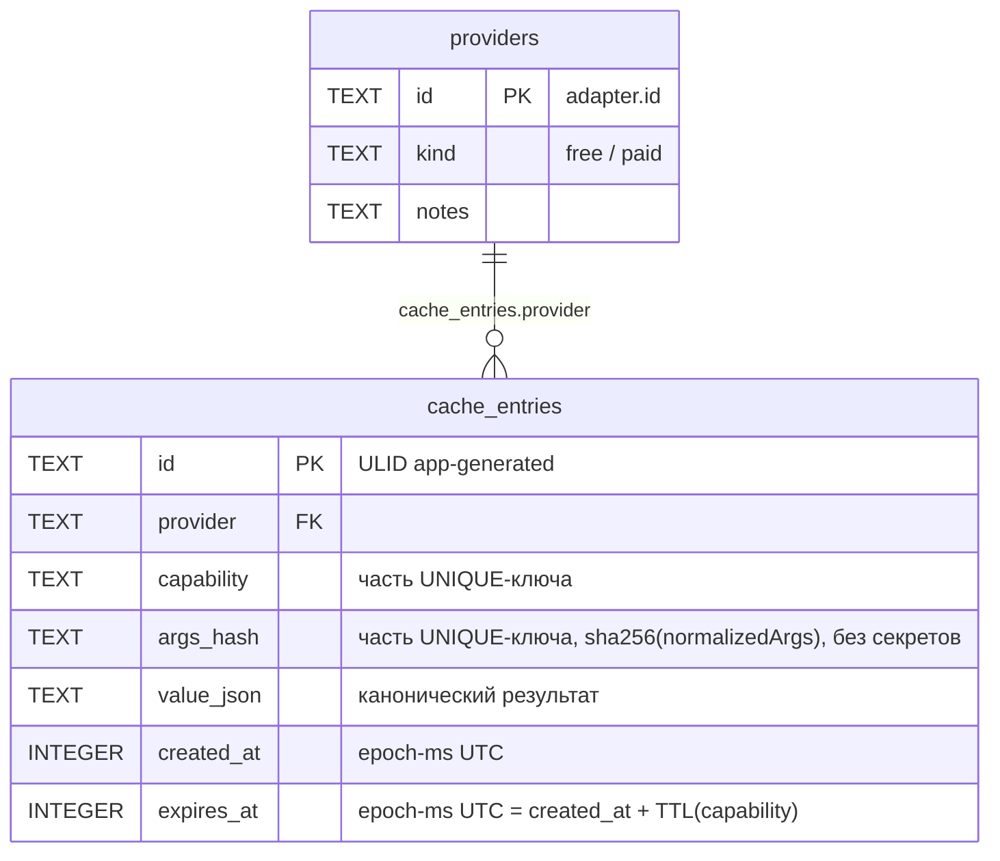

# 4. Data Model (Conceptual)

> Part of [docs/ARCHITECTURE.md](../ARCHITECTURE.md).

### 4.1. Entities Overview

**Канонические типы (M1, `packages/core/src/types/*`)** — см. полные zod-схемы в §3.2. Кратко:

#### Entity: `Token`

- **Описание:** метаданные + цена токена на конкретной сети/адресе.
- **Ключевые атрибуты:** `chain`, `address` (нормализован), `symbol`, `name`, `decimals?`,
  `priceUsd?`, `marketCapUsd?`, `source`, `fetchedAt`.
- **Business rule:** `address` всегда прошёл `normalizeAddress(chain, raw)` до попадания в тип —
  ни один адаптер не кладёт сырой ввод пользователя в канонический объект напрямую.

#### Entity: `Wallet` / `Balance`

- **Описание:** список балансов кошелька на сети. `Balance` — элемент массива, различает
  `assetType: 'native' | 'token'` — в M1 заполняется только `'native'` (§3.2 решение).
- **Relationships:** `Wallet 1:N Balance` (встроенный массив, не отдельная таблица — M1 не
  персистирует их вне кеша).
- **Business rule:** `amountRaw` — точное целое **строкой** (DB-SCHEMA §1.7 конвенция: wei/lamports
  превышают безопасные 2^53); `amountNum` — lossy-проекция, никогда не источник истины.

#### Entity: `Pool`

- **Описание:** торговая пара (DEX) — используется `onchain_new_pairs`.
- **Ключевые атрибуты:** `id`, `chain`, `dexId`, `baseTokenSymbol`/`quoteTokenSymbol`,
  `pairAddress`, `createdAt?`, `liquidityUsd?`, `volume24hUsd?`, `source`, `fetchedAt`.

#### Entity: `OHLCV` (зарезервирован, не потребляется в M1)

- Поля — см. §3.2 схема. Существует для R-1 (тип должен существовать), первый потребитель — M1.5+.

#### Entity: `Snapshot` (D5-дополнение, персистентная форма — DB-SCHEMA-CONCEPT §2)

- В M1 движок его **не пишет** (n8n пишет отдельно, TASK.md §1); тип существует для будущего M3
  поглощения снапшоттера и уже согласован с `snapshots`-таблицей DB-SCHEMA.
- **Маппинг имён на persistence-границе (minor, ревью цикл 1):** `SnapshotSchema` — camelCase
  (`valueRaw`, `valueNum`); персистентная колонка DB-SCHEMA §2 — snake_case (`value_raw`,
  `value_num`). `metric`/`asset`/`ts`/`source`/`height` совпадают буквально и не переименовываются.
  M1 не пишет `snapshots`, поэтому маппинг сейчас нигде не реализован — но когда M3 поглощает
  снапшоттер, понадобится явный (де)сериализатор именно для `valueRaw↔value_raw`/
  `valueNum↔value_num`, не автоматический camelCase→snake_case по всем полям. Зафиксировано здесь
  заранее, чтобы M3 не открывал вопрос заново.

### 4.2. Логическая модель — кеш-БД (`DATA_DIR/cache.sqlite3`)

Полный DDL — §3.2 «Модуль `src/cache/*`». Кратко: `providers(id PK)` ← `cache_entries(provider
FK, capability, args_hash, value_json, created_at, expires_at, UNIQUE(provider,capability,
args_hash))`. Портируемые типы (`TEXT`/`INTEGER`), epoch-ms `INTEGER`, app-generated `TEXT` ULID
id, `PRAGMA foreign_keys=ON` — DB-SCHEMA-CONCEPT §1 применены буквально к новому контексту (кеш,
не аналитический снапшот — см. апсерт-семантику §3.2, отличную от append-only `snapshots`). **Все
девять `adapterRegistrations` (включая `pg-history` — F-2, ревью цикл 1) upsert-ятся в
`providers` при старте** — ни один кеш-хит/промах не может сослаться на несуществующий
`provider`, FK не нарушается ни для одного адаптера, зарегистрированного в `providers.config.ts`.

### 4.3. Диаграмма данных

### 4.4. Миграции и версионирование

M2 добавляет `usage(provider FK, day, credits_used)` — FK на тот же `providers`-реестр, без
изменения `cache_entries` (R-14 acceptance). Канонические типы версионируются по D5 (тип-версия —
поле зарезервировано, но M1 не вводит breaking-change механику — первая ревизия схем).
