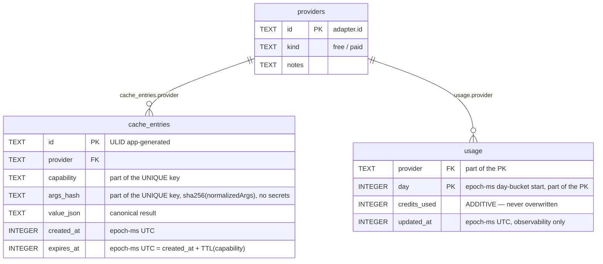
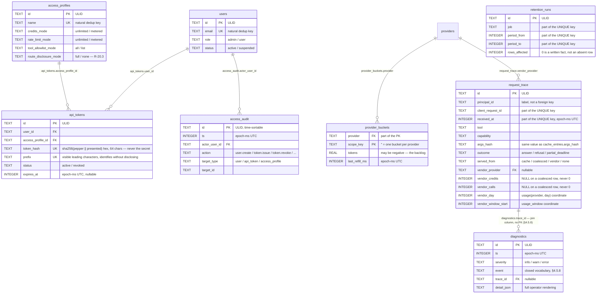

# 4. Data Model (Conceptual)

> Part of [docs/ARCHITECTURE.md](../ARCHITECTURE.md).

### 4.1. Entities Overview

**Canonical types (M1, `packages/core/src/types/*`)** — full zod schemas in §3.2. In brief:

#### Entity: `Token`

- **Description:** token metadata and price for one chain/address.
- **Key attributes:** `chain`, `address` (normalized), `symbol`, `name`, `decimals?`, `priceUsd?`,
  `marketCapUsd?`, `source`, `fetchedAt`.
- **Business rule:** `address` has always passed `normalizeAddress(chain, raw)` before it reaches
  the type — no adapter puts raw user input into a canonical object.

#### Entity: `Wallet` / `Balance`

- **Description:** a wallet's balances on a chain. `Balance` is an array element and distinguishes
  `assetType: 'native' | 'token'`; in M1 only `'native'` is populated (§3.2).
- **Relationships:** `Wallet 1:N Balance` — an embedded array, not a separate table: M1 does not
  persist balances outside the cache.
- **Business rule:** `amountRaw` is the exact integer **as a string** (DB-SCHEMA §1.7: wei/lamports
  exceed the safe 2^53); `amountNum` is a lossy projection and never the source of truth.

#### Entity: `Pool`

- **Description:** a DEX trading pair — consumed by `onchain_active_pairs`.
- **Key attributes:** `id`, `chain`, `dexId`, `baseTokenSymbol`/`quoteTokenSymbol`, `pairAddress`,
  `createdAt?`, `liquidityUsd?`, `volume24hUsd?`, `source`, `fetchedAt`.

#### Entity: `OHLCV` (reserved, not consumed in M1)

- Fields — see the §3.2 schema. The type exists because R-1 requires it to exist; the first consumer
  is M1.5+.

#### Entity: `Snapshot` (D5 addition, persistent form — DB-SCHEMA-CONCEPT §2)

- The engine **never writes** snapshots. The autonomous loop stays on n8n + Postgres permanently
  (owner decision 2026-07-25, ADR-001 D8 addendum). The type exists as the canonical **read** form
  of that same `snapshots` table — the form the `pg-history` adapter returns (R-12).
- **Name mapping at the persistence boundary:** `SnapshotSchema` is camelCase (`valueRaw`,
  `valueNum`); the persistent columns of DB-SCHEMA §2 are snake_case (`value_raw`, `value_num`).
  `metric`/`asset`/`ts`/`source`/`height` match literally and are not renamed. Nothing implements
  the mapping today because nothing on the engine side writes `snapshots`; it is needed on the
  **reading** side once M3 rules start parsing history. It must be an explicit (de)serializer for
  exactly `valueRaw↔value_raw`/`valueNum↔value_num`, not a blanket camelCase→snake_case over every
  field. Recorded here so M3 does not have to reopen the question.

#### Entity: `SmartMoneyFlow` (M2, TASK-005, D5 extension, R-31)

- **Description:** smart-money net flow for a token over several rolling windows, plus the top
  holder addresses with labels — consumed by `onchain_smart_money_flows`. A composite type: it is
  built from TWO Nansen endpoints (`POST /smart-money/netflow` →
  `SmartMoneyNetflowResponse.data[]`, `POST /tgm/holders` → `TGMHoldersResponse.data[]`) merged
  inside a single `nansen.fetch()` call (§3.2) — not two separate canonical types.
- **Key attributes** (traced field-by-field onto the `SmartMoneyNetflow`/`TGMHolder` schemas of
  `nansen-openapi-2026-07-23.json`): `chain`, `tokenAddress` (normalized via `normalizeAddress`),
  `tokenSymbol`, `netflow1hUsd`/`netflow24hUsd`/`netflow7dUsd`/`netflow30dUsd`
  (`SmartMoneyNetflow.net_flow_{1h,24h,7d,30d}_usd`), `traderCount?`/`tokenAgeDays?`/
  `tokenSectors?[]` (`SmartMoneyNetflow.trader_count`/`token_age_days`/`token_sectors`),
  `topHolders[]` (from `TGMHolder[]`: `{address, addressLabel?, tokenAmount?, valueUsd?,
ownershipPercentage?}` — a subset of `TGMHolder`'s fields, not the full DTO), `source`, `fetchedAt`.
- **Four fixed windows, not one generic `windowStart`/`windowEnd`:** the live response does not
  offer an arbitrary window, it offers a fixed set. R-31's `netflowUsd` is read as a floor —
  `netflow24hUsd` satisfies it and the other three are extra precision.
- **Business rule:** anti-corruption layer — the Nansen DTOs (`SmartMoneyNetflow`/`TGMHolder`,
  including the `{data, pagination}` envelope) never leak outward, the same pattern as
  `Token`/`Pool` (§3.2). Golden test on a fixture (R-31 acceptance).

#### Entity: `EntityLabel` (M2, TASK-005, D5 extension, R-32)

- **Description:** the label of an address or entity (wallet, fund, exchange, known trader) —
  consumed by `onchain_entity_label`. The source depends on the call tier (§3.2 `costOf()` table):
  the default tier is `POST /search/general` → `GeneralSearchResponse.{tokens[], entities[]}`
  (`TokenSearchResult`/`EntitySearchResult`); token-scoped enrichment comes from
  `TGMHolder.address_label`; the exhaustive escalation is `POST /profiler/address/labels` (its
  response shape is fixtured from a live call on first real use, R-44).
- **Key attributes:** `chain?` and `address?` are both optional — `EntitySearchResult` carries
  neither, because an entity can be cross-chain (a name and tags with no particular address);
  results derived from `TokenSearchResult`/`TGMHolder` do carry them. Plus `name?`, `tags[]`
  (default `[]`, from `EntitySearchResult.tags`), `labels[]` (default `[]`, from
  `TGMHolder.address_label` wrapped in an array — **an empty array is a valid result**, "no
  labels", not an error, R-32), `premiumRequested: boolean` (an explicit flag — `true` only when
  the call went through the `exhaustive: true` path, R-42), `source`, `fetchedAt`.
- **Business rule:** neither `chain` nor `address` is mandatory (unlike `Token`/`Wallet`) — the only
  M2 type where that holds, and it holds because of the real shape of `EntitySearchResult`. Golden
  tests on a fixture with ≥1 label AND on a fixture with 0 labels (R-32 acceptance).

#### Entity: `TokenRiskScore` (M2, TASK-005, D5 extension, R-33)

- **Description:** risk/reward indicators for a token — consumed by `onchain_token_risk`. A
  composite type: `POST /tgm/indicators` (`TGMIndicatorsResponse`) + `POST /tgm/token-information`
  (token metadata), one `nansen.fetch()` call.
- **Key attributes** (traced onto the `TGMIndicatorsResponse`/`TGMIndicatorTokenInfo`/`TGMIndicator`
  schemas): `chain`, `address`, `marketCapUsd?`/`marketCapGroup?`/`isStablecoin?`
  (`TGMIndicatorTokenInfo`), and `riskIndicators[]`/`rewardIndicators[]` as **separate** arrays
  (R-33: not flattened into one list). Each element is `{indicatorType, score?, signal?,
signalPercentile?, lastTriggerOn?}` (`TGMIndicator`), where `score` is qualitative per the spec —
  risk → low/medium/high, reward → bearish/neutral/bullish — and `signal`/`signalPercentile` are
  `number`, not strings (R-33: these are not wei-like on-chain integers, so a JS `number`/`REAL` is
  safe). Plus `source`, `fetchedAt`.
- **Business rule:** anti-corruption layer, golden test on a fixture (R-33 acceptance).

#### Entity: `ChainSupply` (TASK-009, D5 extension, R-83)

- **Description:** how much of a chain's native asset exists — consumed by `onchain_chain_supply`.
  Served for `bitcoin` only, from the keyless `blockchain-info` adapter. It is the first canonical
  type whose subject is a **chain's monetary state** rather than a token, wallet, pool or label.
- **Key attributes:** `chain`, `symbol`, `decimals`; `emissionRaw` and `circulatingRaw` as
  **satoshi strings**, each with a lossy `…Btc` number projection for charts and comparison;
  `blockCount` (the height the vendor's own emission figure is consistent with); `source`,
  `fetchedAt`.
- **Why two supply fields and not one:** they are different quantities and the difference is real —
  `emission` is what the halving schedule has released, `circulating` is what miners actually
  claimed, and ~29–32 BTC of subsidy was never claimed (§3.2, measured 2026-07-29). Collapsing them
  would mean serving one under the other's name at a 0.00016% error — invisible, and a fabrication.
- **Business rule:** `circulating ≤ emission` is a **consensus** invariant, not a heuristic, and is
  enforced in `normalize()`: a response violating it is refused, never rounded into agreement.
  Exact values stay strings and are computed through `bigint` (DB-SCHEMA §1.7); `decimals: 8` is a
  Bitcoin consensus constant, taken from consensus rather than from the registry, whose
  `nativeDecimals` for `bitcoin` is `null` (see OQ in `docs/TASK.md`).

#### Entity: `ChainInfo` (TASK-006, R-48) — **the chain registry**

- **Description:** one chain, described in full. This is **not** a canonical domain type in the D5
  sense (it is not an observation obtained from a provider) — it is the **registry** against which
  canonical types are interpreted. Hence where it lives: a **vendored build artifact**, not a DB
  table and not a network call (rationale — §4.2.1).
- **Key attributes:**

| Field            | Type                                                        | Purpose                                                                                                                                                                                    |
| ---------------- | ----------------------------------------------------------- | ------------------------------------------------------------------------------------------------------------------------------------------------------------------------------------------ |
| `caip2`          | `string` **PK**                                             | Canonical id in CAIP-2 form: `eip155:80094`, `solana:5eykt4Xh…`. The registry's stable primary key.                                                                                        |
| `slug`           | `string` UNIQUE                                             | Human-readable canonical slug (`berachain`) — what an agent writes in `chain`, what `onchain_list_chains` returns, and what goes into the cache key (§4.2.2).                              |
| `name`           | `string`                                                    | Display name (`Berachain`).                                                                                                                                                                |
| `family`         | `'evm' \| 'svm' \| 'move' \| 'cosmos' \| 'utxo' \| 'other'` | Determines **address validation** (R-55) and whether `rpc-evm` can serve the chain.                                                                                                        |
| `aliases`        | `string[]`                                                  | Every other accepted spelling, including the legacy `ethereum`/`solana` (R-59a) and vendor ids. Globally unique.                                                                           |
| `nativeSymbol`   | `string \| null`                                            | Symbol of the **gas** token (`BERA`, `XDAI`) — consumed by `pairs.active` (R-57a) and `wallet.balances.native` instead of a hardcode.                                                      |
| `nativeDecimals` | `number \| null`                                            | Decimals of that same gas token.                                                                                                                                                           |
| `vendors`        | `Record<vendorId, string \| null>`                          | **Naming only:** what this chain is called at each vendor. `defillama`→`"Berachain"`, `coingecko`→`"berachain"`, `dexscreener`→`"berachain"`. `null` = the vendor does not have the chain. |
| `rpcHosts`       | `string[] \| null`                                          | The curated SSRF allowlist for this chain (R-56a). `null` = `wallet.balances.native` is honestly uncovered, see §7.2.                                                                      |
| `tvlUsdAtSync`   | `number \| null`                                            | TVL **as of the registry sync**, knowingly stale. Exists **solely** to filter and rank in `onchain_list_chains` without a network call.                                                    |
| `deprecated`     | `boolean`                                                   | The chain disappeared from the vendors, but the row is kept (R-49f) — references and cache keys do not break.                                                                              |

The two native-token columns carry the failure they prevent:

- `nativeSymbol` is the **gas** token, never the chain's listing/governance token: `arbitrum` is
  `ETH`, not `ARB`. `null` means we do not know, and the capability that needs it is honestly
  uncovered rather than silently wrong.
- `nativeDecimals` is required because `eth_getBalance` returns an integer in the minimal unit —
  with no decimals there is nothing to label it with. 18 is an EVM convention, not a rule: 29 chains
  in the EIP-155 catalog use something else, and a hardcoded 18 is a wrong answer that looks right.
  For non-EVM families the value comes from the generator's curated table
  (`CURATED_NATIVE_DECIMALS`), because EIP-155 knows nothing about them.

- **Relationships:** `ChainInfo 1:N` aliases (embedded array). It references no other entity — the
  reverse holds: `Token`/`Wallet`/`Pool`/`SmartMoneyFlow` reference a chain through their own
  `chain` field.

- **Business rules (each one is a test, R-60c):**
  1. `caip2` is unique; `slug` is unique; **the set of all `aliases` intersects no `slug` and no
     other `aliases`** — otherwise resolution is ambiguous. Checked at startup.
  2. **An alias is resolved to the canonical chain BEFORE the cache key is built.** Otherwise
     `"ethereum"` and `"eth"` produce two cache entries for one and the same request. This is not
     an optimization, it is correctness (§4.2.2).
  3. `tvlUsdAtSync` is **never** returned as the answer to "what is the TVL" — that is `chain.tvl`
     (R-53). In the `onchain_list_chains` payload the field is named `tvlUsdAtRegistrySync`, so the
     two cannot be confused.
  4. `vendors` describes **naming, not coverage.** Coverage is a derived quantity (§4.2.3), and
     mixing the two is forbidden: otherwise "Nansen does not have this chain" and "we never checked
     Nansen on this chain" become indistinguishable (R-58d).

#### Entity: `CoverageProbe` (TASK-006, R-58) — a recorded fact about a vendor

- **Description:** the recorded result of establishing the chain coverage of a vendor whose coverage
  cannot be derived from a public catalog. In the MVP there is exactly one consumer: `nansen`.
- **Key attributes:** `vendorId`, `probedAt` (epoch-ms UTC), `chains: string[]` (the chains
  confirmed by the evidence), `creditsSpent`, `evidencePath` (a file under `raw/`).
- **Business rule:** the absence of a probe means **`unverified`, not `unsupported`** (R-58d). What
  the engine actually gates on is described in §4.2.3.

#### Artifact: `CapabilityManifest` + `PolicyDescriptor` (T-012, ADR-002 D2/D3) — compiled facts, not tables

**SHIPPED (T-012, commit `6af4b19`, 2026-08-05).**

- **Description:** like `ChainInfo` above, these are **not** canonical domain types in the D5
  sense (they describe how a capability is ROUTED, not an observation obtained from a provider) —
  committed TypeScript literals (`capabilityManifests` in `src/capability-manifest.ts`, the policy
  class dictionary in `src/adapters/policy.ts`), validated once at `CapabilityRegistry` construction
  and held in process memory, never in the cache DB or in Postgres (D1 — tier-1 config in the
  commit).
- **Key attributes:** `CapabilityManifest` is a DISCRIMINATED union, not a flat interface (H4,
  architecture review 2026-08-03 — a flat shape would let a future `merge` field attach to a
  `point` manifest with no compiler objection): `{shape:'point', ttlSeconds, deadlineMs,
shareable?}` or `{shape:'set'|'series', ttlSeconds, deadlineMs, shareable?}`, both variants also
  carrying an optional `paidLegMs` — present only when the capability's route can reach a
  `tier:'paid'` adapter, documenting the UNCANCELLABLE tail past a committed credit reservation
  (OD-3, owner 2026-08-03; worst case for such a capability is `deadlineMs + paidLegMs`, never
  `deadlineMs` alone). `PolicyDescriptor` — a discriminated union, `{ kind: 'any' }` or `{ kind:
'someElementHasAny', fields: string[] }`.
- **Relationships:** every `CapabilityRoute.capability` must resolve to exactly one
  `CapabilityManifest` entry, and every `CapabilityRoute.policy.kind`, when present, must resolve
  against the policy dictionary — both are enforced the same way the chain registry enforces its
  own invariants (§4.2.1: at construction, never at first request), in a FIXED order (manifest
  presence checked before policy `kind`) so a negative test can isolate exactly one failure (C2,
  architecture review 2026-08-03). 🔴 **M-6 correction (architecture review round 2, 2026-08-03):**
  only the MANIFEST map is an injected, defaulted constructor parameter on `CapabilityRegistry`
  (`manifests: Readonly<Record<string, CapabilityManifest>> = capabilityManifests` —
  system-architecture.md, "Capability Registry") — the same seam the chain registry already uses one
  parameter to the left — so a test route table with synthetic capabilities supplies its own small
  manifest map instead of inheriting the real 20-row one. The POLICY class dictionary is a
  **module-level registry** (`src/adapters/policy.ts`, system-architecture.md "Policy descriptor +
  class registry"), not a constructor parameter, and needs no injection of its own: a test exercising
  an unregistered `kind` expresses the bad value in the ROUTE itself (`{ policy: { kind: 'bogus' } }`),
  which is the thing under test either way — there is no scenario where a test needs a DIFFERENT
  policy dictionary, only a route referencing a `kind` the real one does not have. (An earlier draft
  of this section said "both maps are injected... one parameter to the left" — two maps cannot both
  occupy one parameter position, and the code only injects the one that has a real reason to vary.)
- **Business rules:** manifest carries no `chains`/`providers`/`price` (those are derived from
  `chainSupport()`, `routes`, `costOf()` respectively — the identical "one fact, one place" rule the
  chain registry already applies to coverage, §4.2.3); a `policy.kind` or `capability` unresolved
  against either artifact is a construction-time failure, never a silent default.

**DESIGNED, not built (T-013, ADR-002 D5/D6, 2026-08-05) — the merge-eligibility field, and how
`CapabilityResolution` grows to carry a merged answer.** The `set | series` arm of `CapabilityManifest`
gains one optional field (illustrative name `mergeable?: boolean`; final name is Development's
choice, R-159a) discharging the obligation the union's own docstring already names for T-013
(`packages/core/src/capability-manifest.ts:158-159`, `the obligation the paragraphs below used to describe as future is discharged.`)
— declaring it on the `point` arm is a compile error (R-159/R-160).
Eligibility is a fact about the CAPABILITY's identity key (`Snapshot.metric`/`asset`/`ts`, D6 reason
1); it is deliberately NOT sufficient to activate collection by itself — `CapabilityRoute` gains a
second, independent field (`merge?: boolean`) checked against `mergeable` at construction
(`OQ-T013-2`, full reasoning in [system-architecture.md](system-architecture.md) "Merge mechanism").
Two gates, not one: (1) a route flag is a literal deviation from D5's text, which R-181 already
budgets for at exactly two deviations elsewhere — a third would go unrecorded; (2) UC-20 phrases the
failure as an act the ROUTE performs, which manifest-only activation cannot even construct. **A
capability with more than one `CapabilityRoute` is explicitly OUT OF SCOPE** — no construction-time
check enforces that sibling routes agree on `merge`, and the two-gate design does not, on its own,
let one route of a capability merge while another does not (system-architecture.md states this
plainly rather than implying selectivity the design cannot deliver).

`CapabilityRegistry.resolve()`'s return shape gains three OPTIONAL fields, all populated ONLY on a
merge-enabled walk (R-174d/R-175) — `sources?: string[]` (CONTRIBUTORS: participants whose points
are actually present in `result`, not merely everyone who answered — the distinction matters because
an "answered" reading would attribute a merged payload to a participant that returned nothing of its
own), `missingSources?: {adapterId, reason}[]`, `perSourceCache?: {adapterId, cache, ageMs?}[]` — the
18 non-merge capabilities and their tools see no shape change, and no existing field type changes;
`source`'s MEANING does not change either, on a merge walk or off one — it is, and stays, the
highest-ranked adapter among those whose data is IN `result` (`sources`, the CONTRIBUTORS above) —
never simply the first to answer. Corrected here after round 2 (MJ-2): stating only the fallback
below without this primary rule reads as "unchanged" = "first answerer", which on the ordinary
composition where `platform-explorer` answers `[]` and `pg-history` returns 40 points would publish
`source: 'platform-explorer'` over a payload containing none of its data — exactly the defect B-2
raised. `source` falls back to the highest-ranked ANSWERED participant ONLY in the corner case
where `sources` is empty (everyone answered with zero points, so there is no contributor to rank).
The compiled conflict rank on a dedup collision (`(metric, asset, HOUR of ts)` — bucketed
2026-08-07 by owner decision, R-161(e); the stored point keeps its own `ts`) reuses the
route's own `adapterIds` order rather than adding a rank table or reading `AdapterRegistration.trust`
or `onchain.metrics.source_priority` (`OQ-T013-3`; `TC-GATE-02` and R-180 both forbid the latter two
readers) — a narrow, provisional reuse pending T-016's real per-row trust axis, reasoned in full in
[system-architecture.md](system-architecture.md). **Enforced, not merely documented:** a new
construction-time assertion requires every participant of a `merge: true` route to be `tier: 'free'`
(reading `AdapterRegistration.tier`, never `.trust`) — a paid, presumably-authoritative participant
would sit last in spend order and therefore lowest in this reused rank, silently losing every dedup
collision; the assertion turns that hazard into a startup failure until T-016.

### 4.2. Logical model — the cache DB (`DATA_DIR/cache.sqlite3`)

The full DDL is in §3.2, module `src/cache/*`. In brief: `providers(id PK)` ← `cache_entries(provider
FK, capability, args_hash, value_json, created_at, expires_at, UNIQUE(provider,capability,
args_hash))`. Portable types (`TEXT`/`INTEGER`), epoch-ms `INTEGER`, app-generated `TEXT` ULID ids,
`PRAGMA foreign_keys=ON` — DB-SCHEMA-CONCEPT §1 applied literally to a new context (a cache, not an
analytical snapshot: the upsert semantics in §3.2 differ from the append-only `snapshots`). **All
twelve `adapterRegistrations` (including `pg-history`) are upserted into `providers` at startup** —
no cache hit or miss can reference a nonexistent `provider`, and the FK holds for every adapter
registered in `providers.config.ts`. `providers.kind` (`'free' | 'paid'`, informational — no logic
reads it) is populated from `AdapterRegistration.tier` (T-012 task 012-3, ADR-002 D8). Both writers
of this column (`SqliteCacheStore.bootstrapProviders()` and `SqliteBudgetStore.bootstrapProviders()`)
read that ONE field on the same registration; before 012-3 they disagreed — one derived `kind` from a
private `PAID_PROVIDER_IDS` set, the other hardcoded `'unknown'` (system-architecture.md, "Provider
tier"). **Their conflict clauses are also identical now (adversarial cycle 2, F-3):**
`ON CONFLICT (id) DO UPDATE SET kind = excluded.kind`, updating the column both writers OWN and
leaving `notes` alone. The cache store used to add `notes = excluded.notes` with a literal `NULL`, so
merely constructing it erased an operator's note while constructing the budget store preserved it —
the same file's content depending on which store opened it last.

**M2 addition (TASK-005, R-34): `usage(provider FK, day, credits_used)`** — the same cache DB, the
same `providers` registry as the FK target, and **no migration** of `providers`/`cache_entries` (the
forward-compatibility comment in `cache/ddl.ts` was already in place in M1). Portable types, taken
literally (DB-SCHEMA-CONCEPT §1):

```sql
CREATE TABLE IF NOT EXISTS usage (
  provider     TEXT NOT NULL REFERENCES providers(id),
  day          INTEGER NOT NULL,           -- epoch-ms UTC bucket start: floor(ts/86400000)*86400000
  credits_used INTEGER NOT NULL DEFAULT 0, -- ADDITIVE counter — see the upsert semantics below
  updated_at   INTEGER NOT NULL,           -- epoch-ms UTC of the last write (observability only)
  PRIMARY KEY (provider, day)
);
```

**SEC-1 (2026-07-27): `usage_window(provider FK, window_start, credits_used)`** — the same additive
counter with a 60-second bucket instead of a day. A separate table rather than a `bucket_width`
column on `usage`: the daily counter must keep summing whole days, and carrying two widths in one
column would make every existing SELECT ambiguous and force a migration. It ships as an ordinary
`CREATE TABLE IF NOT EXISTS` against the same `providers` registry — it migrates nothing.

```sql
CREATE TABLE IF NOT EXISTS usage_window (
  provider     TEXT NOT NULL REFERENCES providers(id),
  window_start INTEGER NOT NULL,           -- epoch-ms UTC: floor(ts/60000)*60000
  credits_used INTEGER NOT NULL DEFAULT 0, -- same signed additive upsert, same MAX(0, …)
  calls_made   INTEGER NOT NULL DEFAULT 0, -- Q-3: additive and MONOTONIC — never given back
  updated_at   INTEGER NOT NULL,
  PRIMARY KEY (provider, window_start),
  CHECK (credits_used >= 0),
  CHECK (calls_made >= 0)
);
```

`calls_made` is the **second denominator** (Q-3). A gate that counts credits cannot refuse a call
that costs 0 credits: `used + 0 > ceiling` is false for the whole life of the bucket at any ceiling.
That is not a defect of the ceiling, it is what its unit of measure means — so it is cured with a
different unit, not with a stricter number. The column sits on the same row rather than in a second
table: same provider, same window, same transaction, and one read instead of two. The counter is
**monotonic** — reconciliation corrects credits and never the number of calls: the vendor was
called, and "giving one back" would let a run of cheap-and-refunded calls slip past the very limit
it exists to enforce.

The column was added **after** the table had already shipped, so `CREATE TABLE IF NOT EXISTS` does
not create it on an existing file. `SqliteBudgetStore` checks `PRAGMA table_info` and runs
`ALTER TABLE … ADD COLUMN` when needed (`USAGE_WINDOW_COLUMNS` in `cache/ddl.ts`) — idempotent on
every open, additive, with no backfill (`DEFAULT 0` is correct by construction: a window row that
predates the column contains, by definition, no counted calls). This is exactly the "mechanical, not
a project" kind of migration DB-SCHEMA-CONCEPT §1 demands.

It is read and written **inside the same transaction** as the daily reservation (`checkAndReserve`).
Otherwise two processes sharing one `cache.sqlite3` — a supported topology, several stdio sessions
on one machine — would each pass its own window check against a stale read. Rows older than an hour
are deleted opportunistically in that same transaction: only the CURRENT window is ever read, the
rest is retention for post-mortem analysis, and one row per minute per provider forever is a slow
leak into `DATA_DIR`.

- `day` is an **`INTEGER` epoch-ms** day-bucket start, not a string date — DB-SCHEMA §1.2 /
  CLAUDE.md canon taken literally. ADR-001 D6 calls the column "day", but a literal date string
  would contradict the canon; it is bucketed with the same pattern as the n8n snapshotter's
  `ts_bucket`.
- `credits_used` is an `INTEGER`, not the `value_raw TEXT` pattern: it is a small internal counter of
  the engine's own credits, well inside a safe JS `number`, not a canonical observation of arbitrary
  precision. It is not a `Snapshot`, so `INTEGER` does not contradict the canon (R-34).
- **`PRIMARY KEY (provider, day)` is the natural dedup key, and TWO write phases go through ONE and
  the same additive upsert** (not the overwrite-upsert with which `cache_entries.set()` writes its
  row):

  ```sql
  INSERT INTO usage (provider, day, credits_used, updated_at)
  VALUES (@provider, @day, @delta, @now)
  ON CONFLICT (provider, day) DO UPDATE SET
    -- MAX(0, …) is belt-and-braces: @delta is SIGNED (post-call reconciliation, §3.2, writes
    -- actual-reserved and may be negative) — but credits_used must remain a non-negative counter
    -- by construction. Without this clamp any edge or defective path (e.g. a bucket mistakenly NOT
    -- pinned at reservation time, §3.2 "dayBucketMs is pinned once") could push a negative number
    -- into a fresh day bucket and break this column's documented "never overwritten, only grows or
    -- stays" invariant.
    credits_used = MAX(0, credits_used + excluded.credits_used),
    updated_at = excluded.updated_at;
  ```

  (a) the pre-call **reservation** — `@delta = costOf()` (the exact price, R-37); (b) the post-call
  **reconciliation** — `@delta = actual − reserved` (a signed delta, possibly negative, R-38). The
  same SQL pattern serves both phases; a replacing write would double-count or lose spend instead
  (§3.2 works this through in detail). **`day` in both phases of one call is literally the same
  value** (`dayBucketMs`, pinned at reservation, §3.2 "atomic check+reserve") — reconciliation never
  recomputes the bucket from the response's arrival time, so a response that arrives after midnight
  for a call reserved before it still lands in the ORIGINAL day bucket, not a new one.

- `SqliteBudgetStore` (`cache/budget-store.ts`, implementing the `BudgetStore` interface — the same
  injection pattern as `CacheStore`/`SqliteCacheStore`, §3.2/§5.2) opens its **own** `better-sqlite3`
  connection to the same file (`cacheDbPath()`, reusing the existing `cache/data-dir.ts`), runs
  `db.exec(CACHE_DDL)` idempotently (the same string, which now also carries `usage`), and
  **necessarily** reissues `PRAGMA foreign_keys=ON` on THAT connection — the pragma is
  connection-scoped and is not persisted in the file (DB-SCHEMA §1.6; R-34 explicitly requires
  "every" connection, not a global). A `pragma_foreign_keys`/`sqlite_master` query test confirms it
  (R-34/R-35 acceptance).

#### 4.2.1. The chain registry is a build artifact, not a DB table (TASK-006, R-48/R-60)

The registry lands in neither the cache DB, nor Postgres, nor a network call at startup. It lives in
the repository as one deterministic file, is vendored into the build, and is loaded into memory at
startup. Three reasons, each a hard requirement rather than a taste:

1. **The offline gate (R-60a).** M1/M2 established the gate "an offline run makes 0 network calls".
   A registry pulled over the network at startup breaks it the same day.
2. **CI determinism.** A test whose result depends on what a vendor served today is not a test.
3. **Reviewability.** Changing the set of chains is a git diff with a human reviewing it (TASK-006
   UC-4), not a silent shift in production behavior. This matters most for `rpcHosts`: that is a
   security surface (§7.2), and it must change through a commit.

The consequence, stated explicitly: **registry freshness is the operator's duty, not the runtime's.**
A new chain that appeared at a vendor becomes available after the generator runs and the result is
committed (TASK-006 UC-4), not automatically. That is a deliberate trade: determinism and control
over the security surface, against automatic freshness.

**Loading (R-60c/d):** schema validation plus the §4.1 invariants run **at startup**, not on the
first request. A missing or invalid registry is a loud process failure. Degrading to an empty
registry is **forbidden**: an empty registry would turn every request into "unknown chain" — quietly
breaking the entire engine while looking like correct operation.

#### 4.2.2. Effect on the cache key (OQ-3)

The cache key is `(provider, capability, sha256(normalizedArgs))` (M1, §3.2), and `normalizedArgs`
contains `chain`. What goes in there is the canonical **slug**, never the spelling the agent wrote.

- **Correctness requirement:** an alias is canonicalized (`eth` → `ethereum`) **before** hashing.
  Without that, one and the same request written two ways produces two paid calls and two cache
  entries — on a paid route that is a direct monetary defect. Canonicalization happens in the
  handler, ahead of `deriveArgsHash`, and an end-to-end test proves it: `chain:'eth'` after
  `chain:'ethereum'` is a cache HIT with no second upstream request.
- **No cold invalidation happened.** The canonical value is the slug (the rationale, and the
  rejection of CAIP-2 in this position, is recorded in `types/chain.ts` under R-59d), and before
  TASK-006 the tools accepted exactly `ethereum`/`solana` — which are their own slugs. The
  `args_hash` of existing rows therefore did not change and the cache survived the rollout intact.

#### 4.2.3. The coverage matrix is derived, not a second registry (R-51a)

Coverage of a (capability, chain) pair is **stored nowhere as a list.** It is computed as a
composition of two things that already exist:

```
covered(capability, chain) :=
    ∃ adapterId ∈ route(capability).adapterIds :
        adapter(adapterId).chainSupport(chainInfo) === true
```

Every adapter answers the question about a chain itself, with a predicate over `ChainInfo` rather
than a list:

| Adapter                                              | `chainSupport(c, capability)`                                                |
| ---------------------------------------------------- | ---------------------------------------------------------------------------- |
| `defillama`                                          | per capability — see below                                                   |
| `coingecko`                                          | `c.vendors.coingecko !== null`                                               |
| `dexscreener`                                        | `c.vendors.dexscreener !== null`                                             |
| `rpc-evm`                                            | `c.family === 'evm' && c.rpcHosts !== null`                                  |
| `rpc-solana`                                         | `c.caip2 === <solana mainnet caip2>`                                         |
| `nansen`                                             | per capability — see below                                                   |
| `dash-platform` / `platform-explorer` / `pg-history` | `c.caip2 === <dash caip2>`                                                   |
| `blockchain-info`                                    | `c.caip2 === 'other:bitcoin'` — one chain, and the vendor serves exactly one |
| `dune`                                               | unchanged — `isAvailable()` is still unconditionally `false`                 |

A deprecated chain is covered by nothing: `covered()` refuses it before consulting any adapter.

**Why a predicate and not a list column:** a column would mean maintaining coverage in two places
(the registry plus the adapter's `capabilities()`) and the two would diverge on the first change. The
predicate leaves the registry as the single source of **facts about a chain** and the adapter as the
single source of **facts about itself**. This is the same principle by which §3.2 keeps
`providers.config.ts` declarative while `isAvailable()` owns the availability decision.

**`defillama` coverage is per capability too, and for a measured reason (TASK-007, R-63).** The
`vendors.defillama` column was populated from the vendor's **TVL** catalog (`/v2/chains`), so it is
non-null for **all 458** registry chains. The vendor's **DEX-volume** dataset is a different and much
smaller set: `allChains` in a live `/overview/dexs/{chain}` response lists **287** chains, of which
**274** exist in our registry. Reusing the TVL predicate for `dex.volume.history` would therefore
advertise the capability on **184 chains that have no such data** — the exact defect class TASK-006's
review recorded as H-1 (coverage widened, transport not). So:

| capability                  | predicate                                                            | chains |
| --------------------------- | -------------------------------------------------------------------- | ------ |
| `protocol.tvl`, `chain.tvl` | `c.vendors.defillama !== null`                                       | 458    |
| `dex.volume.history`        | `c.vendors.defillama ∈ DEFILLAMA_DEX_CHAINS` (generated vendor list) | 274    |

`DEFILLAMA_DEX_CHAINS` is a **generated, committed build artifact**, produced by
`scripts/gen-defillama-dex-chains.ts` from a recorded raw response under
`docs/onchain-analytics/raw/` — the same doctrine, and the same emit-time token guard, as
`gen-nansen-coverage.ts`: read the evidence we already hold, emit code, review the diff. It is not
fetched at startup, for the three reasons the chain registry itself is a build artifact (§4.2.1):
the offline-run gate, CI determinism, and reviewability. The 13 chains the vendor serves that our
registry does not know are recorded in the raw evidence and covered by nothing — an honest gap beats
a phantom row.

**`nansen` coverage is per capability, and a composite capability is an intersection.** The recorded
coverage comes from the committed vendor spec (`raw/nansen-openapi-2026-07-23.json`), which
enumerates the chains per endpoint, plus a small live spot-check confirming the spec has not
drifted — evidence at zero credits, which meets R-58a's intent more strictly than probing 25 chains
live would. `smart-money.flows` issues two sub-calls (`/smart-money/netflow`, 17 chains, and
`/tgm/holders`, 25), so its coverage is the **intersection**: a union would admit 8 chains where the
first sub-call succeeds, the second is refused, and the credits for the first are already spent. On
top of that the adapter requires the chain's family to have a real address validator — without one
we cannot tell a valid `tokenAddress` from arbitrary text, cannot canonicalize it into a stable cache
key, and cannot know how the vendor cases its address column, on a route that charges for every
attempt. The cost of that condition is stated rather than absorbed silently: after it the covered
counts are `smart-money.flows` 16, `entity.labels` 18 and `token.risk` 18 chains, dropping
`bitcoin`, `near`, `sei`, `starknet`, `sui`, `ton` and `tron`. Each returns the moment its family
gets a validator. One predicate serves all three readers of that answer — what the matrix
advertises, what the transport will build a request for, and what the refusal message lists as
available — because an adapter that answers the same question in two places eventually answers it
two different ways.

**Three different refusals that must not be merged (R-51b, and D4/R-145 since T-012):**

| Situation                                                                 | Error type                             | What it means to the agent                                        |
| ------------------------------------------------------------------------- | -------------------------------------- | ----------------------------------------------------------------- |
| The (capability, chain) pair is not covered                               | `CapabilityNotCoveredOnChainError`     | "It is not here and will not be — look at alternatives"           |
| The pair is covered but the provider is unavailable (no key, vendor down) | `CapabilityUnavailableError` (R-24)    | "This could work — fix the config or retry later"                 |
| The manifest's call deadline expired before a satisfying answer arrived   | `CapabilityDeadlineExceededError` (D4) | "We ran out of our own time budget — this is not a vendor outage" |

Merging any of the three would send the agent into an endless retry where retrying is pointless, or
conversely make it give up where adding a key (or simply retrying later) is enough.
`CapabilityNotCoveredOnChainError` is raised from `validateArgs()`, i.e. **before** `ensureBudget()`
— no credits are reserved to discover it. `CapabilityDeadlineExceededError` reuses the SAME `tried`
list the other two carry (system-architecture.md, "Call deadline"), naming which sources the walk
never reached because time ran out first.

#### 4.2.4. The same four counters in the Postgres dialect (T-014)

Storage and transport are independent axes (`deployment.md` §10.1.1). Storage decides the engine
for these four tables; the transport does not.

| Named profile | Where `providers`, `cache_entries`, `usage`, `usage_window` live |
| :--- | :--- |
| `local` | `DATA_DIR/cache.sqlite3` |
| `network` | Postgres schema `onchain` |
| `network-sqlite` | `DATA_DIR/cache.sqlite3` |

The four are declared from one canonical shape under the type map of §4.5.1. No column is added,
dropped or renamed. The store components that read and write them are designed in
[system-architecture.md](system-architecture.md); this subsection states what their SQL must
guarantee in each dialect.

**The concurrency guarantee is restated per dialect, not carried over.** SQLite takes it from
`BEGIN IMMEDIATE` (`packages/core/src/cache/budget-store.ts:420` `return attempt.immediate();`).
Postgres has no such statement. The existing code already names this hazard
(`packages/core/src/cache/budget-store.ts:295-297`
`a future Postgres` … `forfeits this guarantee entirely`).

**Dialect substitutions that apply to all four.** `MAX(x, y)` becomes `GREATEST(x, y)`;
`INTEGER` becomes `BIGINT`; every object name is schema-qualified (R-30.1). The keys, the columns
and the arithmetic are identical.

**1. `providers` — bootstrap upsert.**

- Statement: `INSERT … ON CONFLICT (id) DO UPDATE SET kind = excluded.kind`, unchanged from §4.2.
- Requirement: single-statement atomicity, which both engines give without a transaction.
- Both writers still leave `notes` alone (§4.2), and the clause text stays identical between them.

**2. `cache_entries` — one indexed read, one upsert.**

- `get` is one equality read on `(provider, capability, args_hash)`; `set` is one upsert on the
  same key.
- Requirement: single-statement atomicity. No cross-statement guarantee is claimed.
- **Why a lost update is admissible here.** Two concurrent writers of one key fetched the same
  capability with the same arguments, so the later row is a copy of the same vendor answer.

**3. `usage` and `usage_window` — the money gate.**

`checkAndReserve` reads both counters and writes both, and refuses a reservation that would cross a
ceiling (`packages/core/src/cache/budget-store.ts:308`
`const attempt = this.db.transaction((): { ok: true } | { ok: false; reason: string } => {`).

- **SQLite requirement:** the whole body runs inside `db.transaction(fn).immediate()`, as today.
- **Postgres requirement:** the ceiling test is expressed inside the writing statement, and a
  refusal is an empty `RETURNING`.

**Why a `SELECT` followed by an `INSERT` is not permitted in the Postgres dialect.** Under
`READ COMMITTED` two connections read the same `credits_used` and both pass the test. The conflict
action's row lock is the only serialization point on `(provider, day)`.

**The canonical Postgres statement is written once, in
[system-architecture.md](system-architecture.md) §3.4.8.** This subsection quotes no SQL of its own
and lists what that statement must guarantee.

**Why the text lives in one section only.** Two copies of one statement drift apart, and a reader
cannot then tell which copy the implementation follows.

- **Zero rows returned is a refusal**, not a failure. The reason string is built in code, from the
  values the caller already holds.
- **Both branches carry the ceiling test, the insert branch included.** A fresh day bucket holds no
  row, so an unguarded insert branch admits a cost larger than the whole ceiling.
- **An unlimited ceiling is bound as `NULL`, and the guard tests for `NULL` explicitly.** A ceiling
  of `off` is a supported configuration, and `… <= NULL` yields `NULL` — zero rows, every
  reservation refused.
- **Reconciliation is a second statement and carries no ceiling bound.** Its `@delta` is signed
  (§4.2), and a refund refused by a `WHERE` would strand credits nobody spent.
- **The velocity counter takes the same shape on `(provider, window_start)`**, with two bounds in
  its `WHERE`: credits per window and `calls_made` per window (Q-3, §4.2).
- **Both counters move inside one `BEGIN` on one connection.** A reservation that reached only the
  daily ledger would leave the window disagreeing with it, and a reconciliation would compound the
  drift.
- **The opportunistic prune of old window rows stays inside that transaction**, as in SQLite, so it
  inherits the same lock instead of racing it (§4.2).
- **`calls_made` stays monotonic** in this dialect too: reconciliation adjusts credits and never the
  call count (§4.2).

**A refusal writes no counter row.** The gate runs before the vendor call, so a refused reservation
has spent nothing to record.

### 4.3. Data diagram


```mermaid
erDiagram
  providers ||--o{ cache_entries : "cache_entries.provider"
  providers ||--o{ usage : "usage.provider"

  providers {
    TEXT id PK "adapter.id"
    TEXT kind "free / paid"
    TEXT notes
  }

  cache_entries {
    TEXT id PK "ULID app-generated"
    TEXT provider FK
    TEXT capability "part of the UNIQUE key"
    TEXT args_hash "part of the UNIQUE key, sha256(normalizedArgs), no secrets"
    TEXT value_json "canonical result"
    INTEGER created_at "epoch-ms UTC"
    INTEGER expires_at "epoch-ms UTC = created_at + TTL(capability)"
  }

  usage {
    TEXT provider FK "part of the PK"
    INTEGER day PK "epoch-ms day-bucket start, part of the PK"
    INTEGER credits_used "ADDITIVE — never overwritten"
    INTEGER updated_at "epoch-ms UTC, observability only"
  }
```

**TASK-006 adds no table to this diagram.** The chain registry (`ChainInfo`) and `CoverageProbe` are
build artifacts living in process memory and in git, not DB rows (§4.2.1). Their only contact with
this diagram is indirect: `cache_entries.args_hash` is computed from the canonical slug rather than
from whatever string the agent wrote (§4.2.2). The table schema does not change — **there is no
migration**.

**T-014 adds eight tables to the persistent state.** They are designed in §4.5 and drawn here. The
diagram above is unchanged: T-014 alters no column of `providers`, `cache_entries`, `usage` or
`usage_window`.


```mermaid
erDiagram
  users ||--o{ api_tokens : "api_tokens.user_id"
  access_profiles ||--o{ api_tokens : "api_tokens.access_profile_id"
  users ||--o{ access_audit : "access_audit.actor_user_id"
  providers ||--o{ provider_buckets : "provider_buckets.provider"
  providers ||--o{ request_trace : "request_trace.vendor_provider"
  request_trace ||--o{ diagnostics : "diagnostics.trace_id — join column, no FK (§4.5.8)"

  users {
    TEXT id PK "ULID"
    TEXT email UK "natural dedup key"
    TEXT role "admin / user"
    TEXT status "active / suspended"
  }

  access_profiles {
    TEXT id PK "ULID"
    TEXT name UK "natural dedup key"
    TEXT credits_mode "unlimited / metered"
    TEXT rate_limit_mode "unlimited / metered"
    TEXT tool_allowlist_mode "all / list"
    TEXT route_disclosure_mode "full / none — R-20.3"
  }

  api_tokens {
    TEXT id PK "ULID"
    TEXT user_id FK
    TEXT access_profile_id FK
    TEXT token_hash UK "sha256(pepper || presented) hex, 64 chars — never the secret"
    TEXT prefix UK "visible leading characters, identifies without disclosing"
    TEXT status "active / revoked"
    INTEGER expires_at "epoch-ms UTC, nullable"
  }

  access_audit {
    TEXT id PK "ULID, time-sortable"
    INTEGER ts "epoch-ms UTC"
    TEXT actor_user_id FK
    TEXT action "user.create / token.issue / token.revoke / ..."
    TEXT target_type "user / api_token / access_profile"
    TEXT target_id
  }

  provider_buckets {
    TEXT provider FK "part of the PK"
    TEXT scope_key PK "'' = one bucket per provider"
    REAL tokens "may be negative — the backlog"
    INTEGER last_refill_ms "epoch-ms UTC"
  }

  request_trace {
    TEXT id PK "ULID"
    TEXT principal_id "label, not a foreign key"
    TEXT client_request_id "part of the UNIQUE key"
    INTEGER received_at "part of the UNIQUE key, epoch-ms UTC"
    TEXT tool
    TEXT capability
    TEXT args_hash "same value as cache_entries.args_hash"
    TEXT outcome "answer / refusal / partial_deadline"
    TEXT served_from "cache / coalesced / vendor / none"
    TEXT vendor_provider FK "nullable"
    INTEGER vendor_credits "NULL on a coalesced row, never 0"
    INTEGER vendor_calls "NULL on a coalesced row, never 0"
    INTEGER vendor_day "usage(provider, day) coordinate"
    INTEGER vendor_window_start "usage_window coordinate"
  }

  diagnostics {
    TEXT id PK "ULID"
    INTEGER ts "epoch-ms UTC"
    TEXT severity "info / warn / error"
    TEXT event "closed vocabulary, §4.5.8"
    TEXT trace_id FK "nullable"
    TEXT detail_json "full operator rendering"
  }

  retention_runs {
    TEXT id PK "ULID"
    TEXT job "part of the UNIQUE key"
    INTEGER period_from "part of the UNIQUE key"
    INTEGER period_to "part of the UNIQUE key"
    INTEGER rows_affected "0 is a written fact, not an absent row"
  }
```

### 4.4. Migrations and versioning

**TASK-006:** no DDL change — no new table, no altered column — and no migration event. Existing
cache rows kept matching, because the canonical value fed into `args_hash` was already what the old
tools accepted (§4.2.2). The registry is versioned by being a file under git: its "version" is the
commit. There is no schema-version field in v1 (YAGNI: the only consumer is this same process from
the same build), but the loader must validate the structure at startup (R-60c), so an incompatible
file fails loudly rather than silently.

**M2 (TASK-005):** `usage(provider FK, day, credits_used, updated_at)` was added to the same cache
DB; `providers`/`cache_entries` are unchanged (R-14/R-34 acceptance) — a mechanical
`CREATE TABLE IF NOT EXISTS`, not a migration of existing rows. `usage_window` (SEC-1) arrived the
same way, and its one additive `ALTER TABLE … ADD COLUMN` (`calls_made`) is described in §4.2.
Canonical types are versioned per D5 — the type-version field is reserved, but M1/M2 introduce no
breaking-change machinery: this is still the first revision of every canonical schema, the three M2
additions included.

**T-014:** two additive migrations, one per storage engine, and no data movement between them.

1. SQLite storage — the eight tables of §4.5 are appended to `CACHE_DDL` (`packages/core/src/cache/ddl.ts`)
   as `CREATE TABLE IF NOT EXISTS`. Postcondition: no `ALTER` of an existing table, no backfill.
   This migration serves the `local` and `network-sqlite` profiles alike.
2. Postgres storage — one new numbered file under `sql/migrations/` creates the same eight tables
   plus the counterparts of `providers`, `cache_entries`, `usage` and `usage_window` (§4.2.4), in
   the existing schema `onchain`. Postcondition: every object is created as `onchain.<name>`, and
   nothing in `public`.
3. Grants — the same file grants the state role and the read role the disjoint privileges listed
   below. Postcondition: the state role selects no row of `assets`, `metrics` or `snapshots`.
4. Verify gate — the migration reports table presence, seeded FK targets, and orphan count zero.
   Postcondition: the run is recorded before the profile serves a request.
5. Admin seed — a second numbered file creates the first admin user and its token row from a digest
   passed as a parameter (§4.5.3). Postcondition: exactly one `active` row in `api_tokens`.

**The engine uses the snapshotter's schema `onchain`** (owner decision 2026-08-12, reversing
`OQ-T014-DEP-1`). The earlier design put the engine in a separate schema `onchain_engine`; that
design is withdrawn. `docs/TASK.md:573` (`в схеме` `onchain`) is met literally.

**This migration creates no schema.** `sql/migrations/001_init.sql:18`
(`CREATE SCHEMA IF NOT EXISTS onchain;`) already created it, and the dev VM holds it today (the
measurement below). A `CREATE SCHEMA` statement here would add nothing.

**Isolation is by role and grant, inside one schema.** The migration issues the four grants below;
[security.md](security.md) §7 owns their text.

- The state role holds `USAGE` on schema `onchain`.
- The state role holds `SELECT, INSERT, UPDATE, DELETE` on the twelve tables of this migration.
- The state role holds no privilege on `assets`, `metrics` or `snapshots`, and owns none of them.
- The `pg-history` role holds `USAGE` on schema `onchain` and `SELECT` on those same three tables.

**ARCHITECTURE §1.2 item 5 is held by the third grant.** An `INSERT` the state role sends to
`onchain.snapshots` is refused by the server, not by our code.

**What removing the schema boundary changed.** The enforcement point moved from schema visibility to
the table privilege, and Postgres checks both on every statement.

**What no longer holds.** The state role can now name a snapshotter table in a statement. It is
refused on the table privilege, where the earlier design refused it on schema `USAGE`.

**Why an absent grant is a refusal and not a default.** Measured 2026-08-13 on the dev VM: each of
the three snapshotter tables carries `{supabase_admin=arwdDxt/supabase_admin,postgres=arwd/supabase_admin}`
and no `PUBLIC` entry. Query:
`select relname, relacl::text from pg_class c join pg_namespace n on n.oid=c.relnamespace where n.nspname='onchain' and c.relkind='r'`.

**The state role must not be role `postgres`.** That role already holds `arwd` on all three
snapshotter tables, per the measurement above. Schema `onchain` additionally carries a default ACL
granting `arwd` on every newly created table to that same role — measured 2026-08-13, returning
`r|{postgres=arwd/supabase_admin}`. Query:
`select defaclobjtype::text, defaclacl::text from pg_default_acl d join pg_namespace n on n.oid=d.defaclnamespace where n.nspname='onchain'`.
Connecting the state store as `postgres` restores the write path these grants exist to remove. The
read role is bound by the same condition, and its DSN is owned by [deployment.md](deployment.md).

**Why the storage engine carries the four cache tables too.** OQ-8 puts runtime data of the network
profile in Postgres only (`docs/TASK.md:538` `данные времени выполнения — только Postgres`).
`docs/TASK.md:572` (`персистентный слой — Postgres с первого дня, кеш и`) names both by name.

**Why the verify gate is shorter than DB-SCHEMA §5.3's.** Nothing is backfilled, so row counts and
`min`/`max(ts)` have no source to be compared against. The orphan check stays, because it is the one
§5.3 assertion that holds on an empty table.

**Name collision check, measured 2026-08-13 — it now runs inside one namespace.** Schema `onchain`
holds three tables — `assets`, `metrics`, `snapshots` — and five indexes: `assets_pkey`,
`metrics_pkey`, `snapshots_pkey`, `uq_snapshots_dedup`, `idx_snapshots_series`. Query:
`select c.relkind::text||' '||n.nspname||'.'||c.relname from pg_class c join pg_namespace n on n.oid=c.relnamespace where n.nspname like 'onchain%'`.

**Why indexes are counted and not tables alone.** A table and an index occupy one relation namespace
per schema in Postgres. A separate schema made this check redundant; a shared schema does not.

The migration creates twelve tables: the eight of §4.5 plus the four counterparts of §4.2.4. Named
in full, so the comparison is checkable rather than asserted:

| Group | Tables | Named indexes |
| :--- | :--- | :--- |
| §4.5 identity | `users`, `access_profiles`, `api_tokens`, `access_audit` | `idx_api_tokens_user`, `idx_access_audit_actor`, `idx_access_audit_target`, `idx_access_audit_ts` |
| §4.5 limiter | `provider_buckets` | none |
| §4.5 operational | `request_trace`, `diagnostics`, `retention_runs` | `idx_request_trace_principal`, `idx_request_trace_received`, `idx_request_trace_spend`, `idx_diagnostics_ts`, `idx_diagnostics_event_ts`, `idx_retention_runs_job` |
| §4.2.4 counters | `providers`, `cache_entries`, `usage`, `usage_window` | none |

**Result: no collision.** None of the twelve table names appears among the three present names, and
none of the ten index names appears among the five present ones.

**Constraint-backed indexes need no separate comparison.** Postgres derives their names from the
table (`users_pkey`, `api_tokens_token_hash_key`), so twelve distinct table names yield distinct
index names.

**The check is re-run against the target server before the migration is applied.** It is a fact
about one server on one date, and the snapshotter may add a table to `onchain` meanwhile.

### 4.5. T-014 — persistent state for the network deployment profile

T-014 introduces eight tables. Four carry identity (`users`, `access_profiles`, `api_tokens`,
`access_audit`), one carries shared limiter state (`provider_buckets`), and three carry operational
records (`request_trace`, `diagnostics`, `retention_runs`).

None of the eight is a canonical domain type in the D5 sense. They record who called, what the
engine did, and under which settings — not an observation obtained from a provider. They are
therefore absent from §4.1 and present in the logical model.

**Two meanings of "profile", kept apart by name.** A **deployment profile** is a named combination of
a transport and a storage engine, one per process (`deployment.md` §10.1.1). An **access profile** is
a settings entity a token references, many per process (`docs/TASK.md:21-24`).

**The two axes are independent.** Transport is stdio or Streamable HTTP; storage is SQLite or
Postgres. Three combinations are named: `local`, `network` and `network-sqlite`.

**Why this section names both axes separately.** Which columns are populated follows the transport;
which dialect declares them follows the storage engine. A single word for both would make one of the
two tables below unwritable.

#### 4.5.1. Where each table lives

Every table is declared in both dialects from one canonical shape. The storage axis picks the
dialect: `DATA_DIR/cache.sqlite3` for SQLite, Postgres schema `onchain` for Postgres (§4.4).

| Table | Written on stdio | Written on HTTP | Requirement |
| :--- | :--- | :--- | :--- |
| `users` | no — inert, see below | yes | R-15.3, R-15.4 |
| `access_profiles` | no — inert | yes | R-13.1 |
| `api_tokens` | no — inert | yes | R-15.1a, R-15.5 |
| `access_audit` | no — inert | yes | R-15.7 |
| `provider_buckets` | yes | yes | R-7 |
| `request_trace` | yes | yes | R-27 |
| `diagnostics` | yes | yes | R-32.2 |
| `retention_runs` | yes | yes | R-32.3 |

**Why the identity tables are declared in SQLite and left empty on stdio.** One DDL string and one
store implementation serve both dialects. A test of revocation or of the append-only audit then runs
against SQLite, with no Postgres process in CI (R-21 forbids network there).

**The `network-sqlite` profile populates them.** It runs the HTTP transport, so it authenticates
every request against the SQLite tables. This is the profile that debugs the transport without a
Postgres server.

**A token issued into the store of a stdio process is inert.** The stdio transport requires no token
and does not check one (`docs/TASK.md:451` `значение не требуется и не проверяется`). An operator
must not read such a row as protection of that transport.

**Type map for the Postgres dialect** (DB-SCHEMA-CONCEPT §5, applied unchanged): `TEXT` → `TEXT`,
`INTEGER` (epoch-ms and counters) → `BIGINT`, `REAL` → `DOUBLE PRECISION`. Keys and `CHECK`
constraints transfer as written.

**Every query names its schema** (R-30.1). `search_path` is not a correctness condition: WI-47
measured that Supavisor substitutes its own, and `packages/core/src/pg/read-client.ts:383`
(`options: '-c search_path=onchain'`) does not survive that pooler.

#### 4.5.2. Where this project's canon overrides the reference identity model

The reference is `/Users/sergey/dev-projects/n8n-lazy-loading-skills/sql/010_identity_tables.sql`
(`cvj.users` / `cvj.api_tokens` / `cvj.access_audit`). It is followed wherever the canon is silent.
Five columns disagree with DB-SCHEMA-CONCEPT §1, and the canon wins in all five.

| Reference | Here | Canon | Why the canon wins |
| :--- | :--- | :--- | :--- |
| `uuid DEFAULT gen_random_uuid()` | `TEXT` ULID, app-generated | §1.3 | the shape ships to two engines, so no server default can own the id |
| `timestamptz DEFAULT now()` | `INTEGER` epoch-ms UTC | §1.2 | a DB time function in logic is forbidden; `BIGINT` in Postgres |
| `token_hash bytea` | `TEXT`, lowercase sha256 hex | §1.1 | `bytea` is Postgres-specific; the digest is fixed-width either way |
| `scopes text[]` | not carried — see §4.5.4 | §1.1 | a Postgres array type is forbidden in v0/v1 |
| `id bigserial` (audit) | `TEXT` ULID | §1.3 | engine row-numbering is never relied on; a ULID also sorts by time |

**Why the ULID amendment of DB-SCHEMA §1.3 does not apply here.** That amendment permits a
server-generated `uuid` in a **unified Postgres profile**. This engine ships two persistence
profiles, and the same writer emits rows into both, which is the condition the amendment excludes.

**What the reference contributes unchanged:** the `admin | user` role check, the `active | suspended`
status check, the visible `prefix` beside the hash, the minimum prefix length of 8, and the
append-only guard on the audit table.

#### 4.5.2a. Every ULID key is declared `PRIMARY KEY NOT NULL`, and the second word is load-bearing

SQLite admits NULL in a `TEXT PRIMARY KEY` column; Postgres does not. The identical DDL therefore
yields a different constraint on each storage axis, which is the class of divergence §1 exists to
prevent. Spelling `NOT NULL` costs nothing on Postgres, where `PRIMARY KEY` already implies it.

**Why it is worth naming rather than assuming.** A conformance test reading `PRAGMA table_info`
counts the declared `NOT NULL` columns. Without the explicit word it finds one fewer on SQLite than
on Postgres — a red test on one axis and a green one on the other, for the same table.

#### 4.5.3. `users` and `access_profiles`

**`users` — purpose:** the person a token belongs to, and the role that decides `_meta` visibility.

```sql
CREATE TABLE IF NOT EXISTS users (
  id           TEXT PRIMARY KEY NOT NULL,   -- ULID, app-generated (§1.3)
  email        TEXT NOT NULL,      -- the only human-facing identity
  display_name TEXT,
  role         TEXT NOT NULL,      -- 'admin' | 'user'   (R-15.3)
  status       TEXT NOT NULL,      -- 'active' | 'suspended'
  created_at   INTEGER NOT NULL,   -- epoch-ms UTC
  updated_at   INTEGER NOT NULL,   -- epoch-ms UTC
  UNIQUE (email),
  CHECK (role IN ('admin','user')),
  CHECK (status IN ('active','suspended'))
);
```

- **Primary key:** `id`. **Natural UNIQUE dedup key:** `email`.
- **Indexes:** none beyond the two the keys create. Every read is by `id` or by `email`.
- **Serves:** R-15.3, R-15.3a, R-15.4.

**`email` is lowercased by the writer before the insert.** Neither engine folds case in a UNIQUE
index by default, so `A@x` and `a@x` would both be admitted as separate people.

**Why the role sits on the user and not on the token.** R-6.1 makes `_meta.budget` visibility a
function of the principal's role. Two tokens of one person could otherwise disagree about that role.

**The first admin is created by a seed migration** (owner decision 2026-08-13, closing
`OQ-T014-DM-3`). Its audit row carries `actor_user_id = NULL` (§4.5.5).

**The migration takes the digest and the visible prefix as parameters**, as the reference project
does (`/Users/sergey/dev-projects/n8n-lazy-loading-skills/sql/019_seed_admin.sql:7`
`-v ADMIN_TOKEN_SHA256=abc123...64hexchars`). The plaintext token reaches neither disk nor the
repository.

**Why a migration and not a row the process writes at first start.** A first-start path that creates
an admin is reachable before any admin exists. The digest form it must produce is §7.5.2's.

**Rows are never deleted.** Withdrawal of access is `status = 'suspended'` plus token revocation.
Consequence: no `ON DELETE` clause is declared anywhere in §4.5, and the audit table needs no
exception for a cascade (§4.5.5).

**`access_profiles` — purpose:** the settings entity a token references (R-13.1).

```sql
CREATE TABLE IF NOT EXISTS access_profiles (
  id                  TEXT PRIMARY KEY NOT NULL,   -- ULID
  name                TEXT NOT NULL,      -- 'phase0-unlimited'
  status              TEXT NOT NULL,      -- 'active' | 'retired'
  credits_mode        TEXT NOT NULL,      -- 'unlimited' | 'metered'   (ADR-003 D5: creditsBalance)
  credits_balance_raw TEXT,               -- exact value as a string (§1.7)
  rate_limit_mode     TEXT NOT NULL,      -- 'unlimited' | 'metered'   (ADR-003 D5: rateLimit)
  rate_limit_per_min  INTEGER,
  tool_allowlist_mode TEXT NOT NULL,      -- 'all' | 'list'            (ADR-003 D5: toolAllowlist)
  tool_allowlist_json TEXT,               -- JSON array as TEXT (§1.4)
  route_disclosure_mode TEXT NOT NULL DEFAULT 'full',
                                          -- 'full' | 'none'           (R-20.3)
  created_at          INTEGER NOT NULL,
  updated_at          INTEGER NOT NULL,
  UNIQUE (name),
  CHECK (status IN ('active','retired')),
  CHECK (credits_mode IN ('unlimited','metered')),
  CHECK (rate_limit_mode IN ('unlimited','metered')),
  CHECK (tool_allowlist_mode IN ('all','list')),
  CHECK (route_disclosure_mode IN ('full','none')),
  CHECK ((credits_mode = 'metered') = (credits_balance_raw IS NOT NULL)),
  CHECK ((rate_limit_mode = 'metered') = (rate_limit_per_min IS NOT NULL)),
  CHECK ((tool_allowlist_mode = 'list') = (tool_allowlist_json IS NOT NULL))
);
```

- **Primary key:** `id`. **Natural UNIQUE dedup key:** `name`.
- **Indexes:** none beyond the two the keys create.
- **Serves:** R-13.1, R-13.7, R-14.4, R-20.3.
- **Phase-0 seed:** one row, `name = 'phase0-unlimited'`, all three limit modes at their unlimited
  value and `route_disclosure_mode = 'full'`.

**The seed row's `id` is a literal ULID written into both migrations, not generated per engine.**
The insert is `ON CONFLICT (name) DO NOTHING`, so re-running either migration adds nothing.

**Why a literal and not a generated value.** A migration is not the application, and two engines
seeding independently would produce two ids for one profile. A token's `access_profile_id` would
then resolve on one host and dangle on the other. This is the one place §1.3's "the app generates
ids" is served by a committed constant rather than by a call at write time.

**Why each limit carries a mode column.** "Unlimited" is declared, never inferred from a missing
value. A NULL that means unlimited cannot be told apart from a profile that was never provisioned.
In L-10, 43 of 458 chains answered a confident "not deployed" and both gates stayed green
(`docs/issues/l-10-two-defillama-chain-vocabularies-43-of-458-chains-answer-a-confident-not-deployed.md`).

**An empty `tool_allowlist_json` under `mode = 'list'` is a reachable state.** It means no tool is
permitted. It is not the same state as `mode = 'all'`, and the three `CHECK` pairs keep the two
apart at the engine level.

**`route_disclosure_mode` is the fourth setting on this entity** (owner decision 2026-08-13, closing
`OQ-T014-IF-1`). It governs whether a successful response may name the resolution route. The route
composition is the set of adapters walked and the order of the walk. The column is a setting of the
access profile, not of the transport and not of the role. Its reader is designed in
`interfaces.md`, not here.

**Scope of the column.** It does not govern `tier`, which `ADR-002` D8 forbids on the wire
unconditionally. It does not govern `_meta.budget`, which stays bound to role `admin` (R-6.1).

**Why it is a mode column with no paired value.** The other three settings pair a mode with a
magnitude. This setting has no magnitude, so the mode is the whole value. `NOT NULL` plus the
`CHECK` keeps disclosure declared rather than inferred. An unprovisioned profile cannot reach an
undeclared state that a reader would have to interpret.

**Why the default is `'full'`.** Phase 0 issues one self-issued token under `ADR-003` D5. That
decision gives it all tools and unlimited quota. The column exists from the start at its permissive
value, by `ADR-003` D5's own argument that an absent field cannot be set to unlimited.

**The column is movable to Postgres under R-29.4.** Its values only remove fields from a response.
A narrowing setting is what R-29.4 admits.

**`credits_balance_raw` is TEXT, unlike `usage.credits_used`.** It is a client-facing balance in our
own currency, and §1.7 names credits as the reason exact values are strings. `usage.credits_used` is
a small internal counter and stays `INTEGER` (§4.2).

**The three limit values are not read from this table in T-014.** R-13.3 puts their source in code
defaults for this milestone, behind an asynchronous reader (R-13.2, AC-38). The columns exist so the
second provider has a target and so R-29.4 can move them later without a schema change. One provider
is configured at a time, so no precedence rule between the two is defined.

#### 4.5.4. `api_tokens`

**Purpose:** the credential presented in `Authorization`, stored as a digest.

```sql
CREATE TABLE IF NOT EXISTS api_tokens (
  id                TEXT PRIMARY KEY NOT NULL,   -- ULID
  user_id           TEXT NOT NULL REFERENCES users(id),
  access_profile_id TEXT NOT NULL REFERENCES access_profiles(id),
  token_hash        TEXT NOT NULL,      -- sha256(pepper || presented), lowercase hex — §7.5.2
  prefix            TEXT NOT NULL,      -- the token's visible leading characters (R-15.2)
  name              TEXT,
  status            TEXT NOT NULL,      -- 'active' | 'revoked'
  expires_at        INTEGER,            -- epoch-ms UTC; NULL = no expiry
  revoked_at        INTEGER,            -- epoch-ms UTC
  created_at        INTEGER NOT NULL,
  UNIQUE (token_hash),
  UNIQUE (prefix),
  CHECK (length(token_hash) = 64),
  CHECK (length(prefix) >= 8),
  CHECK (status IN ('active','revoked')),
  CHECK ((status = 'revoked') = (revoked_at IS NOT NULL)),
  CHECK (expires_at IS NULL OR expires_at > created_at)
);
CREATE INDEX IF NOT EXISTS idx_api_tokens_user ON api_tokens (user_id);
```

- **Primary key:** `id`. **Natural UNIQUE dedup key:** `token_hash`.
- **Second UNIQUE:** `prefix` — identification must be unambiguous.
- **Index:** `(user_id)` — listing and revoking a person's tokens.
- **Serves:** R-15.1a, R-15.2, R-15.5, R-13.1.

**The secret is never stored.** The column holds `sha256(pepper || presented)` as 64 hex characters;
the `length` check is the TEXT equivalent of the reference's `octet_length(token_hash) = 32`.

**`pepper` is the token hashing salt R-29.1 keeps in `.env` permanently**, allocated as
`ONCHAIN_TOKEN_HASH_SALT` (`deployment.md` §10.3). The digest form is decided in
`security.md` §7.5.2; this column carries it.

**Why the pepper is named here and not left to the reader.** An earlier revision of this line said
`sha256` of the presented secret with no salt input, and that column definition was the weakest of
the three the architecture then carried. A stolen table without a pepper is a candidate list for an
offline dictionary attack.

**The pepper does not change the column's width or its dialect** (§4.5.2). It is an input to the
digest, not a stored value, so `CHECK (length(token_hash) = 64)` holds unchanged.

**Why `prefix` is UNIQUE here and not in the reference.** R-15.2 requires the prefix to identify a
token without disclosing it. A duplicate prefix would make that identification ambiguous. The issue
path retries on the constraint failure rather than writing an ambiguous row.

**Why `scopes` is absent.** The narrowing lives on the access profile (`tool_allowlist_json`), which
the token references. Carrying both would put the same fact in two places, and the two would
diverge on the first change — the rule §4.2.3 already applies to coverage.

**Why there is no `last_used_at`.** `request_trace` records every use with its principal (§4.5.7),
so the question is answered by a query. An `UPDATE` per request would put a write on the path R-3
requires to run before routing.

**The authentication read, stated so the transport designer can hold it:**

```sql
SELECT t.id, t.status, t.expires_at, t.access_profile_id,
       u.id AS user_id, u.role, u.status AS user_status
  FROM onchain.api_tokens t
  JOIN onchain.users u ON u.id = t.user_id
 WHERE t.token_hash = $1;
```

One indexed equality read, both objects schema-qualified (R-30.1). This store is not the
`CacheStore`: the unauthenticated path performs no cache read and no vendor call (R-3.3, R-3.4).

**Why the liveness predicate is applied in code and not in the `WHERE` clause.** A query returning
zero rows cannot distinguish an unknown token from a revoked one. R-26 needs the class, and R-31
renders it twice.

**Revocation takes effect on the next request** (R-15.6, AC-26). No verified-token cache is
introduced in T-014, so there is no interval during which a revoked token still answers.

#### 4.5.5. `access_audit`

**Purpose:** the append-only record of what an admin did to users, tokens and profiles.

```sql
CREATE TABLE IF NOT EXISTS access_audit (
  id            TEXT PRIMARY KEY NOT NULL,   -- ULID; time-sortable, so the log reads in order
  ts            INTEGER NOT NULL,   -- epoch-ms UTC
  actor_user_id TEXT REFERENCES users(id),
  action        TEXT NOT NULL,      -- 'user.create' | 'user.suspend' | 'token.issue' | 'token.revoke' | 'profile.update'
  target_type   TEXT NOT NULL,      -- 'user' | 'api_token' | 'access_profile'
  target_id     TEXT NOT NULL,
  before_json   TEXT,               -- JSON as TEXT (§1.4)
  after_json    TEXT,
  created_at    INTEGER NOT NULL,
  CHECK (target_type IN ('user','api_token','access_profile'))
);
CREATE INDEX IF NOT EXISTS idx_access_audit_actor  ON access_audit (actor_user_id);
CREATE INDEX IF NOT EXISTS idx_access_audit_target ON access_audit (target_id);
CREATE INDEX IF NOT EXISTS idx_access_audit_ts     ON access_audit (ts);
```

- **Primary key:** `id`. **Natural UNIQUE dedup key:** none — see the deviation in §4.5.9.
- **Indexes:** three, matching the reference's three query shapes: by actor, by target, by time.
- **Serves:** R-15.7, AC-41.

**`before_json` and `after_json` never carry the secret or its digest.** A token event records the
token's `id` and `prefix`. The audit is read by more readers than the authentication path, and a
digest is a verifier.

**Append-only is enforced by the engine, in both dialects.** Postgres takes the reference's pair — a
`DO INSTEAD NOTHING` rule on `DELETE` and a `BEFORE UPDATE` trigger that raises. SQLite takes two
`BEFORE` triggers with `RAISE(ABORT)`. The guard is not part of the portable shape: dropping it
changes no column, so an engine move stays mechanical.

**Our trigger is stricter than the reference's.** The reference permits one `UPDATE` shape, the
`ON DELETE SET NULL` cascade of `actor_user_id`. No row here is ever deleted (§4.5.3), so that
cascade cannot fire and no exception is written.

#### 4.5.6. `provider_buckets` — the shared vendor limiter (R-7)

**Purpose:** the token-bucket state that today lives in a process-local `Map`
(`packages/core/src/net/rate-limit.ts:255` `const buckets = new Map<string, BucketState>();`).

```sql
CREATE TABLE IF NOT EXISTS provider_buckets (
  provider       TEXT NOT NULL REFERENCES providers(id),
  scope_key      TEXT NOT NULL DEFAULT '',  -- '' = one bucket per provider (R-7.4)
  tokens         REAL NOT NULL,             -- may be negative — the backlog
  last_refill_ms INTEGER NOT NULL,          -- epoch-ms UTC
  updated_at     INTEGER NOT NULL,          -- epoch-ms UTC
  PRIMARY KEY (provider, scope_key)
);
```

- **Primary key and natural UNIQUE dedup key:** `(provider, scope_key)` — R-7.3.
- **Indexes:** none beyond the primary key. Every access is an exact-key upsert.
- **Serves:** R-7.1, R-7.2, R-7.3, R-7.4, R-7.4a, AC-4, AC-5, AC-40, AC-42.

**This is the only cross-group foreign key among the eight tables of §4.5**, and it depends on §4.4
carrying `providers` into the Postgres migration. The other seven reference only tables of their own
group or nothing at all.

**The dependency stated as a condition:** the Postgres migration creates `onchain.providers`
before `onchain.provider_buckets`, and the startup bootstrap upserts every adapter row
(§4.2) before the limiter takes its first token. Removing `providers` from that migration turns
every limiter write into a foreign-key failure, and R-7.7 would degrade the process to its
in-process bucket permanently.

**AC-4 measures two processes of one deployment profile against one store.** Two `network`
processes share one Postgres; two `local` processes share one `DATA_DIR`.

**Why the profiles are not measured against each other.** The owner switches `.mcp.json` from stdio
to HTTP and does not run both (owner decision 2026-08-13, §4.5.11). Two processes on two engines
would hold two independent buckets, and no row in this table would reconcile them.

**`scope_key` is `NOT NULL DEFAULT ''`, never nullable.** SQLite accepts NULL in a primary-key
column and Postgres rejects it. A nullable scope would make one dialect dedup and the other refuse
the row.

**`scope_key` values.** `rpc-evm` declares the chain slug (R-7.4a). Every other provider declares
nothing and gets `''`, which is one bucket for all its calls (AC-40, tested on `defillama`).

**`tokens` is `REAL` and may go negative.** The in-process bucket it replaces already holds a float
and already goes negative (`packages/core/src/net/rate-limit.ts:307`
`const waitMs = (-bucket.tokens / config.refillPerSec) * 1000;`).

**Why the stored value is not clamped at zero.** The next caller computes its wait from that
negative remainder. A clamped row would hand every waiting caller the same zero wait.

**Why `REAL` does not contradict §1.7.** That rule governs credits and wei-like integers. A bucket
balance is a computed float, not an exact value we received from anyone.

**Atomicity mirrors `usage_window`** (R-7.2). Refill, consume and read happen in one statement:

```sql
INSERT INTO onchain.provider_buckets (provider, scope_key, tokens, last_refill_ms, updated_at)
VALUES ($1, $2, $3 - $4, $5, $5)
ON CONFLICT (provider, scope_key) DO UPDATE SET
  tokens = LEAST($3, onchain.provider_buckets.tokens
                     + ($5 - onchain.provider_buckets.last_refill_ms) / 1000.0 * $6) - $4,
  last_refill_ms = $5,
  updated_at = $5
RETURNING tokens;
```

`$3` is capacity, `$4` is weight, `$5` is now, `$6` is `refillPerSec`.

- **Dialect difference:** scalar minimum is `LEAST` in Postgres and `MIN` in SQLite. The statement
  text is per dialect; the key, the columns and the arithmetic are identical.
- **SQLite requires `RETURNING`, available since 3.35.** Measured 2026-08-12: `better-sqlite3` in
  this repo reports `sqlite_version() = 3.49.2`.
- **The SQLite path wraps the statement in `db.transaction(fn).immediate()`,** the same discipline
  `checkAndReserve` uses (`packages/core/src/cache/budget-store.ts:420` `return attempt.immediate();`).

**The refund is a second statement.** A refusal adds `weight` back
(`tokens = tokens + $4`). Between the two statements another process can observe a more negative
bucket. That over-restricts and never over-admits, which is the direction a vendor ceiling tolerates.

**The `throttle` signature is unchanged** (R-7.5): `packages/core/src/net/rate-limit.ts:37-42`
(`export type Throttle = (`) keeps `(providerId, config, weight?, deadlineAtMs?) => Promise<void>`.
The scope value reaches the store through `TokenBucketConfig`, which is already a per-call argument
at `packages/core/src/adapters/rpc-evm/index.ts:181`
(`await throttle('rpc-evm', RATE_LIMIT, 1, deadlineAtMs);`). The field's name is the interface
designer's choice; the storage key is `(provider, scope_key)` either way.

**Degradation on storage failure writes no row here** (R-7.7). The process falls back to the
in-process bucket and writes a `limiter.degraded` diagnostics row (§4.5.8, AC-45).

**No cleanup job.** The row count is bounded by providers times declared scopes: twelve adapters
plus at most one row per registry chain for `rpc-evm`, so under 500 rows permanently.

#### 4.5.7. `request_trace` — the per-request record T-015 charges from (R-27)

**Purpose:** one row per served request, recording the principal, the capability, the time, the
outcome class, whether the answer came from cache or from a vendor, and the vendor spend it caused.

```sql
CREATE TABLE IF NOT EXISTS request_trace (
  id                  TEXT PRIMARY KEY NOT NULL,   -- ULID
  received_at         INTEGER NOT NULL,   -- epoch-ms UTC, pinned at admission (R-27.5)
  completed_at        INTEGER NOT NULL,   -- epoch-ms UTC
  principal_id        TEXT NOT NULL,      -- api_tokens.id, or 'local' in the local profile
  user_id             TEXT,               -- users.id; NULL in the local profile
  access_profile_id   TEXT,
  client_request_id   TEXT NOT NULL,      -- client-supplied, else server-minted ULID
  session_id          TEXT,               -- transport session label
  transport           TEXT NOT NULL,      -- 'stdio' | 'http'
  tool                TEXT NOT NULL,
  capability          TEXT,               -- NULL when no capability was resolved — see §4.5.7a
  args_hash           TEXT,               -- the same value cache_entries carries
  outcome             TEXT NOT NULL,      -- 'answer' | 'refusal' | 'partial_deadline'
  refusal_class       TEXT,               -- error class name, only when outcome='refusal'
  served_from         TEXT NOT NULL,      -- 'cache' | 'coalesced' | 'vendor' | 'none'
  cache_age_ms        INTEGER,
  vendor_provider     TEXT REFERENCES providers(id),
  vendor_credits      INTEGER,            -- credits this request added to usage; NULL when served_from='coalesced'
  vendor_calls        INTEGER,            -- calls this request added to usage_window.calls_made; NULL when served_from='coalesced'
  vendor_day          INTEGER,            -- usage(provider, day) coordinate
  vendor_window_start INTEGER,            -- usage_window(provider, window_start) coordinate
  escalated_to_paid   INTEGER NOT NULL DEFAULT 0,  -- 0 | 1 (R-28.2)
  tried_json          TEXT,               -- the ordered walk, JSON as TEXT
  created_at          INTEGER NOT NULL,
  UNIQUE (principal_id, client_request_id, received_at),
  CHECK (outcome IN ('answer','refusal','partial_deadline')),
  CHECK (served_from IN ('cache','coalesced','vendor','none')),
  CHECK ((outcome = 'refusal') = (refusal_class IS NOT NULL)),
  CHECK (escalated_to_paid IN (0,1))
);
CREATE INDEX IF NOT EXISTS idx_request_trace_principal ON request_trace (principal_id, received_at);
CREATE INDEX IF NOT EXISTS idx_request_trace_received  ON request_trace (received_at);
CREATE INDEX IF NOT EXISTS idx_request_trace_spend     ON request_trace (vendor_provider, vendor_day);
```

- **Primary key:** `id`. **Natural UNIQUE dedup key:**
  `(principal_id, client_request_id, received_at)`.
- **Indexes:** `(principal_id, received_at)` for T-015's per-principal period query;
  `(received_at)` for retention; `(vendor_provider, vendor_day)` for reconciling against `usage`.
- **Serves:** R-27.1 through R-27.7, R-28.2, AC-39, AC-43.

**`outcome` uses ADR-003 D4's three classes** and nothing else: an answer, a refusal, and a partial
answer delivered under the deadline. The third settles at full price in T-015, so it must not be
folded into either neighbour.

**`served_from` has four values, and `coalesced` is the fourth** (owner decision 2026-08-13, closing
`OQ-T014-SA-1`). A request that waited on another request's outstanding vendor call records
`coalesced`; the leader records `vendor`.

**Why the follower is not recorded as `vendor` or as `cache`.** Both clients are charged (OQ-6), and
one vendor call served two charges. Folding the follower into either neighbour loses the count
T-015 must trace: how many charges one vendor call produced.

**A `coalesced` row carries no vendor spend of its own.** `vendor_credits` and `vendor_calls` are
both NULL on that row, and the leader's row holds the whole amount.

**Why NULL and not `0`.** Zero asserts that the spend was measured here and came to nothing, which
is false — the spend sits on the leader's row. NULL states that no amount is attributable here.

**Summing over a period reconciles against `usage` without double-counting** (R-27.3). `SUM` skips
NULL inputs in both engines, so a follower's row adds nothing to either total. A period that
contains only followers sums to NULL, which the reader reports as no attributable spend.

**The two bucket coordinates are still written on a `coalesced` row.** They name which `usage` and
`usage_window` buckets the leader's call landed in, which is how T-015 joins a follower's charge to
the spend that served it.

**Every component of the dedup key is `NOT NULL`.** In both engines a NULL never equals a NULL in a
unique index, so one nullable component would disable dedup entirely. The server mints
`client_request_id` when the client omits it.

**Why `received_at` is part of the key.** A client retry is a new server-side request: it is
admitted again, reads the cache again, and may call a vendor again. Its own row must exist. Charge
idempotency by `client_request_id` is T-015's, one layer up.

**One write, at completion — no reserve-then-update.** R-27.7 makes this an append-only ledger, and
a two-phase row would not be one. Consequence, stated rather than hidden: a process that dies
mid-request leaves no trace row. This is the opposite choice from `usage`, which is an additive
counter and therefore can reserve and reconcile (§4.2).

**What is left of such a request, stated exactly.** Whatever `diagnostics` rows it wrote before
dying, whose `trace_id` then resolves to nothing (§4.5.8). A request that dies without emitting one
of the eight events is **not observable at all**. The dictionary carries no event for an interrupted
request, and a dead process writes nothing on its way out.

**Why that gap is accepted rather than closed.** Closing it needs a reserve-then-update row, which
R-27.7 forbids, or a second ledger with its own crash window. The billing consequence is bounded:
a request that never completed also never reached the vendor spend it would have been charged for.

**A paid call finished after the client disconnected does write its row** (R-17). The process is
alive; only the delivery failed. Its outcome is `answer` and its `served_from` is `vendor`, with the
vendor coordinate columns filled — the spend happened and T-015 must see it.

**The link to the vendor spend is a coordinate, not a row reference.** `usage` is keyed
`(provider, day)` and `usage_window` is keyed `(provider, window_start)`; both are bucketed
counters, so no per-call row exists to point at. The trace records the two bucket coordinates plus
this request's own contribution (`vendor_credits`, `vendor_calls`), which is what T-015 needs to
reconcile a charge against a bucket (R-27.3).

**`args_hash` is stored, and it is the same value `cache_entries` carries** — `deriveArgsHash(capability, args)`
(`packages/core/src/net/args-hash.ts:44` `export function deriveArgsHash(capability: string, args: Record<string, unknown>): string {`).
Two traces of different principals over equal arguments therefore hold equal hashes, which is what
AC-8 observes. T-014 adds no principal to that input (R-5.1).

**`principal_id` is a label, not a foreign key.** The local profile's principal has no token row, so
a foreign key would refuse the write on the transport that needs no token at all.

**`tried_json` is operator-side data.** It names adapters and their order. R-20.3 and R-31.4 forbid
that in the client rendering; the ledger is not the client rendering.

**Retention, mapped onto DB-SCHEMA §4's three layers:** `tried_json` is the RAW layer and is set to
NULL after 90 days, the row itself is the NORMALIZED layer and is kept at least one year. Both
passes are jobs that write to `retention_runs` (§4.5.9).

#### 4.5.7a. `capability` is NULL in two cases, not one

An earlier revision of the column comment named only the failure case. There is a second, and it is
on the success path.

| Case | `outcome` | Example |
| :--- | :--- | :--- |
| the request failed before resolution | `refusal` | a saturated limiter refuses before a route is chosen |
| the tool resolves no capability at all | `answer` | `onchain_ping`, `onchain_list_chains` |

**`outcome = 'partial_deadline'` does not mean a partial result.** `reliability.md` §9.1 (owner
decision 2026-08-03, R-156) withdrew returning one: an expired deadline throws, and that row is a
`refusal`. The surviving branch is a **complete** answer delivered past the declared ceiling —
`deadlineOverrunMs`, surfaced as `_meta.timing.overrunMs` (OQ-T012-6). The value keeps the name
`ADR-002` D4 gave it.

**Why the name is kept rather than corrected.** It is already a `CHECK` constraint value in a
schema two milestones old. Renaming it buys accuracy in one comment and costs a migration plus every
reader's memory of the old value.

**Why the second case exists.** `tool` is `NOT NULL` and `capability` is not, because the trace is
written in `defineTool`'s wrapper (`system-architecture.md` §3.4.3) — above the capability layer.
Two tools of the registry — `onchain_ping` and `onchain_list_chains` — answer without calling
`resolveCapability`, so a schema that required a
capability on every successful row could not record them.

**Why this matters to T-015.** A row with `outcome = 'answer'` and a NULL `capability` is a billable
request that consumed no vendor call. Reading NULL as "something went wrong" would drop it from the
count.

#### 4.5.8. `diagnostics` — the stored channel (R-32)

**Purpose:** the events an administrator must be able to read without access to the process stderr.

```sql
CREATE TABLE IF NOT EXISTS diagnostics (
  id           TEXT PRIMARY KEY NOT NULL,   -- ULID
  ts           INTEGER NOT NULL,   -- epoch-ms UTC
  severity     TEXT NOT NULL,      -- 'info' | 'warn' | 'error'
  event        TEXT NOT NULL,      -- closed vocabulary, table below
  principal_id TEXT,               -- NULL when the request was refused before a principal existed
  session_id   TEXT,
  provider     TEXT,
  capability   TEXT,
  trace_id     TEXT,               -- request_trace.id, when the event belongs to a served request
  detail_json  TEXT NOT NULL,      -- JSON as TEXT (§1.4) — the FULL operator rendering (R-31.1)
  created_at   INTEGER NOT NULL,
  CHECK (severity IN ('info','warn','error'))
);
CREATE INDEX IF NOT EXISTS idx_diagnostics_ts       ON diagnostics (ts);
CREATE INDEX IF NOT EXISTS idx_diagnostics_event_ts ON diagnostics (event, ts);
```

- **Primary key:** `id`. **Natural UNIQUE dedup key:** none — see §4.5.9.
- **Indexes:** `(ts)` for retention and for the daily read; `(event, ts)` for one class over a period.
- **Serves:** R-19.3, R-19.4, R-28.1, R-31.1, R-32.2, AC-28, AC-43, AC-45, AC-48.

**`trace_id` carries no `REFERENCES` clause, deliberately.** A diagnostics row is written when the
event happens; the trace row is written once, at completion (§4.5.7).

**Why a foreign key here would refuse the write.** `limiter.degraded` fires mid-request, before the
trace row exists. With `PRAGMA foreign_keys=ON` (DB-SCHEMA §1.6) that insert would fail, and the
process would lose the diagnostic that says the limiter degraded. The reader joins on the column;
a row whose `trace_id` matches nothing is a request that did not reach completion.

**The event vocabulary is closed and compiled**, like the capability manifest (§4.1) — a committed
TypeScript literal, not a table.

| `event` | Written when | Requirement |
| :--- | :--- | :--- |
| `auth.rejected` | a request presents no valid token | R-19.3 |
| `perimeter.rejected` | `Host` or `Origin` fails the transport check | R-19.4 |
| `session.limit_reached` | the session ceiling refuses a new session | R-24.3 |
| `session.evicted` | an idle session is dropped | R-24.2 |
| `limiter.degraded` | the shared limiter store failed and the process fell back | R-7.7 |
| `source.escalated_to_paid` | a free source in a route yielded nothing and a paid one was called | R-28.1 |
| `tool.refused` | a tool execution failed; `detail_json` holds the full text | R-31.1 |
| `retention.cleanup` | a retention job finished | R-32.3 |

**Why the vocabulary is compiled rather than free text.** An event name invented at runtime makes
AC-48's query impossible to write, and the same three reasons §4.2.1 gives for the chain registry
apply: the offline gate, CI determinism, and a reviewable diff.

**The stderr rendering of an event omits `principal_id` and carries the row `id` instead.** R-5.3
forbids the principal on stderr; R-19.3 requires authentication failures to be observable. The row
id satisfies both, and the principal is read from the table.

**`id` is the join key between a refusal shown to a client and its full text** (owner decision
2026-08-13, closing `OQ-T014-SEC-2`). No second identifier is added to this table.

**Why the existing column is used.** It is already the handle the stderr rendering carries
(paragraph above). A second identifier would carry its own uniqueness rule and its own retention.

**A refusal that shows an identifier to a client writes its row before the response is sent.** The
tool-level class writes `event = 'tool.refused'`, with the full operator text in `detail_json`
(R-31.1, R-32.2).

**Why the write precedes the response.** An identifier that resolves to nothing is worse than no
identifier.

**The identifier is safe to hand to an untrusted client.** Two properties of ULID-as-`TEXT`
(DB-SCHEMA-CONCEPT §1.3) give that: 80 random bits per value, and a payload of timestamp and
randomness only.

**Why those two properties are the required ones.** The random half leaves another principal's row
non-derivable from a held id. The absent payload keeps the refusal reason in `event` and
`detail_json`, under the visibility rules that already bind those columns.

**Retention consequence.** The row falls under §4.5.9's window, which is a movable setting. An
identifier older than the current window resolves to no row.

**A lookup separates an expired identifier from an unknown one.** The first ten characters of a ULID
are its epoch-ms timestamp (§1.3, time-sortable id). An id older than the oldest retained row is
reported as expired.

**The client rendering carries no expiry hint. Recorded as a limit, not as a design.** The client
reads neither the configured window nor the oldest retained row.

**Retention window = 90 days = the RAW-tier floor of DB-SCHEMA §4; measured: none, no diagnostics
volume exists yet; applied 90 days as a floor.** The first month's row count is measured and
recorded in this section before the number is treated as settled. The setting's class is R-29.4
(§4.5.9).

#### 4.5.9. `retention_runs`, the cleanup job, and one recorded deviation

**Purpose:** the record DB-SCHEMA §4 demands of every retention pass — how many rows, and for which
period.

```sql
CREATE TABLE IF NOT EXISTS retention_runs (
  id            TEXT PRIMARY KEY NOT NULL,   -- ULID
  job           TEXT NOT NULL,      -- 'diagnostics.purge' | 'request_trace.raw_null' | 'request_trace.purge'
  target_table  TEXT NOT NULL,
  period_from   INTEGER NOT NULL,   -- epoch-ms UTC, inclusive
  period_to     INTEGER NOT NULL,   -- epoch-ms UTC, exclusive
  rows_affected INTEGER NOT NULL,
  started_at    INTEGER NOT NULL,   -- epoch-ms UTC
  finished_at   INTEGER NOT NULL,   -- epoch-ms UTC
  outcome       TEXT NOT NULL,      -- 'ok' | 'failed'
  detail_json   TEXT,
  UNIQUE (job, period_from, period_to, started_at),
  CHECK (outcome IN ('ok','failed')),
  CHECK (period_to > period_from),
  CHECK (rows_affected >= 0)
);
CREATE INDEX IF NOT EXISTS idx_retention_runs_job ON retention_runs (job, started_at);
```

- **Primary key:** `id`. **Natural UNIQUE dedup key:**
  `(job, period_from, period_to, started_at)`.
- **Index:** `(job, started_at)` — the last run of one job.
- **Serves:** R-32.3, DB-SCHEMA §4.

**A pass that deleted zero rows still writes a row.** "Nothing to delete" and "the job did not run"
are different facts, and only a written row tells them apart.

**The retention window is a movable setting of class R-29.4** (owner decision 2026-08-13, closing
`OQ-T014-DM-2`). Its carrier is the parameter node of the `onchain-retention` workflow
([deployment.md](deployment.md) §10.3.1), and no environment key holds it.

**Each window is bounded by a compiled floor and a compiled maximum**
([deployment.md](deployment.md) §10.3.1 carries the three ranges). A configured value outside its
range is refused, never clamped.

**A refused window writes a row and deletes nothing.** The pass records `outcome = 'failed'` and
names the refused setting in `detail_json` ([deployment.md](deployment.md) §10.6.1).

**Why a refusal and not a clamp.** A clamped window deletes rows the operator asked to keep, and
this table would record the clamped period as the requested one.

**Why the class is R-29.4 and not R-29.2.** A bootstrap setting changes only through a release, and
shortening a retention window is the operation R-29.4 exists to allow without one.

**The passes run outside the server process** (R-32.3, owner decision 2026-08-13, closing
`OQ-T014-DEP-2`). Their executor is designed in [deployment.md](deployment.md) §10.6; this section
owns only the row each pass writes.

**`retention_runs` is never cleaned.** It grows by a few rows per day, and the job that would clean
it would have to write into it.

**Deviation.** DB-SCHEMA-CONCEPT §1.5 requires a natural UNIQUE dedup key on every append-only
table; `access_audit` and `diagnostics` carry none. Two identical events one millisecond apart are
two facts, and a key that collapsed them would under-count exactly the burst a security log exists
to show. Both tables are written once per event, with no re-run path, and the ULID primary key
carries identity. Recorded here rather than resolved silently.

#### 4.5.10. What T-014 does not persist

- **Sessions.** The `sessionId` → `McpServer` mapping is process memory (R-2.3). `request_trace.session_id`
  and `diagnostics.session_id` are labels with no foreign key.
- **The bearer secret.** Only the peppered digest `sha256(pepper || presented)` is stored
  (R-15.1a, §4.5.4). The pepper itself stays in `.env` and is never a column (R-29.1).
- **The principal in the cache key.** `deriveArgsHash` keeps its two inputs, and
  `UNIQUE (provider, capability, args_hash)` (`packages/core/src/cache/ddl.ts:63`
  `UNIQUE (provider, capability, args_hash)`) is unchanged (R-5.1, ADR-003 D4).
- **`tier`.** It stays an adapter registration field. `providers.kind` already mirrors it internally
  and is not published (R-6.2).
- **The client rendering of a refusal.** The ledger holds the operator rendering; the client one is
  produced per response and never stored (R-31).

#### 4.5.11. Questions this section raised, and the decisions that closed them

All three are closed. No question of this section blocks the planning phase.

**`OQ-T014-DM-1`, 2026-08-13, owner Sergey: the two deployment profiles are never run concurrently
against one vendor account.** The owner switches `.mcp.json` from stdio to HTTP rather than running
both. Rejected: one spend ledger shared across the two storage engines — SQLite and Postgres hold
two independent daily ceilings, and no row of `usage` reconciles them.

**Consequence for AC-4.** It measures two processes of ONE deployment profile against one store: two
`network` processes on one Postgres, or two `local` processes on one `DATA_DIR` (§4.5.6).

**Consequence for UC-3 A1** (`docs/TASK.md:447-448` `сетевой сервер запущен над тем же` `DATA_DIR`).
That pair is a `local` process beside a `network-sqlite` one, and the constraint says the owner does
not run it. It stays out of AC-4's scope.

**Nothing in the schema enforces the constraint.** It bounds how the owner starts processes, not what
a row admits. A second process of the same profile remains a supported topology, and it is the one
AC-4 measures.

**`OQ-T014-DM-2`, 2026-08-13, owner Sergey: a retention window is a movable setting of class R-29.4,
bounded by a compiled range** (§4.5.9). Rejected: the bootstrap class R-29.2 — shortening a window
would then require a release.

**Consequence for AC-44.** The gate refuses a secret or a bootstrap key read from Postgres, and the
retention window is neither. The compiled range keeps the movable value narrowing.

**`OQ-T014-DM-3`, 2026-08-13, owner Sergey: the first admin is created by a seed migration taking
the token digest as a parameter** (§4.5.3). Rejected: a first-start path inside the process — it is
reachable on every start, and it creates an admin without an admin.

**Consequence for the data model: none.** `access_audit.actor_user_id` was already nullable so the
bootstrap row is recordable (§4.5.5), and the seed writes exactly that row.
