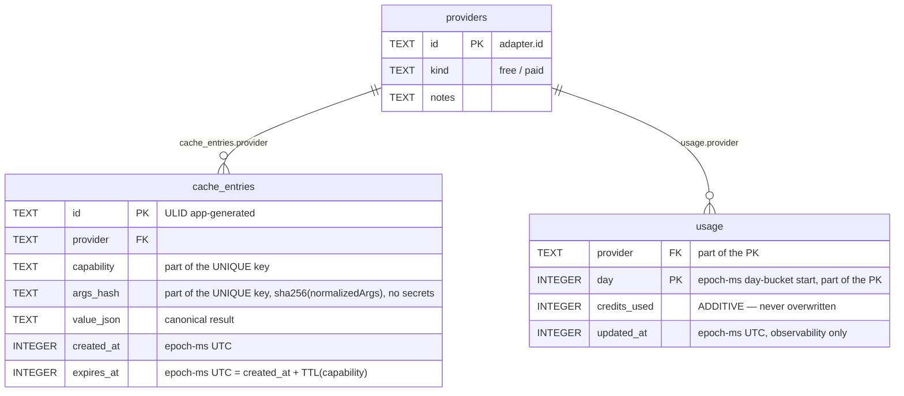
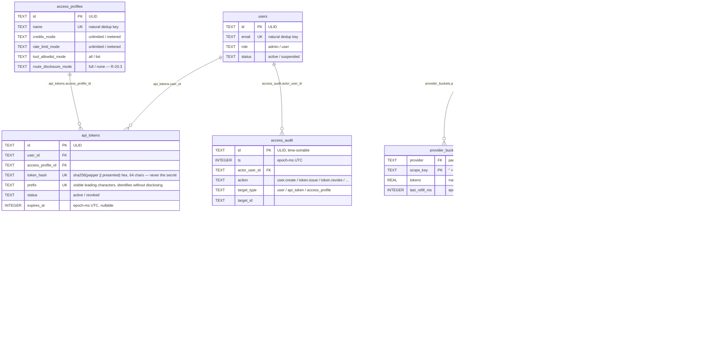

# 4. Data Model (Conceptual)

> Part of [docs/ARCHITECTURE.md](../ARCHITECTURE.md).

### 4.1. Entities Overview

Key attributes and business rules from `Token` to `ChainSupply`, plus the non-D5 registry artifacts `ChainInfo`, `CoverageProbe`, `CapabilityManifest`. → [details](data-model-entities.md)

### 4.2. Logical model — the cache DB (`DATA_DIR/cache.sqlite3`)

`providers`/`cache_entries`/`usage`/`usage_window`, the additive upsert on `(provider, day)`, `calls_made` (Q-3), the coverage predicate, three refusal errors. → [details](data-model-cache-db.md)

### 4.3. Data diagram

```mermaid
erDiagram
  providers ||--o{ cache_entries : "cache_entries.provider"
  providers ||--o{ usage : "usage.provider"

  providers {
    TEXT id PK "adapter.id"
    TEXT kind "free / paid"
    TEXT notes
  }

  cache_entries {
    TEXT id PK "ULID app-generated"
    TEXT provider FK
    TEXT capability "part of the UNIQUE key"
    TEXT args_hash "part of the UNIQUE key, sha256(normalizedArgs), no secrets"
    TEXT value_json "canonical result"
    INTEGER created_at "epoch-ms UTC"
    INTEGER expires_at "epoch-ms UTC = created_at + TTL(capability)"
  }

  usage {
    TEXT provider FK "part of the PK"
    INTEGER day PK "epoch-ms day-bucket start, part of the PK"
    INTEGER credits_used "ADDITIVE — never overwritten"
    INTEGER updated_at "epoch-ms UTC, observability only"
  }
```

**TASK-006 adds no table to this diagram.** The chain registry (`ChainInfo`) and `CoverageProbe` are
build artifacts living in process memory and in git, not DB rows (§4.2.1). Their only contact with
this diagram is indirect: `cache_entries.args_hash` is computed from the canonical slug rather than
from whatever string the agent wrote (§4.2.2). The table schema does not change — **there is no
migration**.

**T-014 adds eight tables to the persistent state.** They are designed in §4.5 and drawn here. The
diagram above is unchanged: T-014 alters no column of `providers`, `cache_entries`, `usage` or
`usage_window`.

```mermaid
erDiagram
  users ||--o{ api_tokens : "api_tokens.user_id"
  access_profiles ||--o{ api_tokens : "api_tokens.access_profile_id"
  users ||--o{ access_audit : "access_audit.actor_user_id"
  providers ||--o{ provider_buckets : "provider_buckets.provider"
  providers ||--o{ request_trace : "request_trace.vendor_provider"
  request_trace ||--o{ diagnostics : "diagnostics.trace_id — join column, no FK (§4.5.8)"

  users {
    TEXT id PK "ULID"
    TEXT email UK "natural dedup key"
    TEXT role "admin / user"
    TEXT status "active / suspended"
  }

  access_profiles {
    TEXT id PK "ULID"
    TEXT name UK "natural dedup key"
    TEXT credits_mode "unlimited / metered"
    TEXT rate_limit_mode "unlimited / metered"
    TEXT tool_allowlist_mode "all / list"
    TEXT route_disclosure_mode "full / none — R-20.3"
  }

  api_tokens {
    TEXT id PK "ULID"
    TEXT user_id FK
    TEXT access_profile_id FK
    TEXT token_hash UK "sha256(pepper || presented) hex, 64 chars — never the secret"
    TEXT prefix UK "visible leading characters, identifies without disclosing"
    TEXT status "active / revoked"
    INTEGER expires_at "epoch-ms UTC, nullable"
  }

  access_audit {
    TEXT id PK "ULID, time-sortable"
    INTEGER ts "epoch-ms UTC"
    TEXT actor_user_id FK
    TEXT action "user.create / token.issue / token.revoke / ..."
    TEXT target_type "user / api_token / access_profile"
    TEXT target_id
  }

  provider_buckets {
    TEXT provider FK "part of the PK"
    TEXT scope_key PK "'' = one bucket per provider"
    REAL tokens "may be negative — the backlog"
    INTEGER last_refill_ms "epoch-ms UTC"
  }

  request_trace {
    TEXT id PK "ULID"
    TEXT principal_id "label, not a foreign key"
    TEXT client_request_id "part of the UNIQUE key"
    INTEGER received_at "part of the UNIQUE key, epoch-ms UTC"
    TEXT tool
    TEXT capability
    TEXT args_hash "same value as cache_entries.args_hash"
    TEXT outcome "answer / refusal / partial_deadline"
    TEXT served_from "cache / coalesced / vendor / none"
    TEXT vendor_provider FK "nullable"
    INTEGER vendor_credits "NULL on a coalesced row, never 0"
    INTEGER vendor_calls "NULL on a coalesced row, never 0"
    INTEGER vendor_day "usage(provider, day) coordinate"
    INTEGER vendor_window_start "usage_window coordinate"
  }

  diagnostics {
    TEXT id PK "ULID"
    INTEGER ts "epoch-ms UTC"
    TEXT severity "info / warn / error"
    TEXT event "closed vocabulary, §4.5.8"
    TEXT trace_id FK "nullable"
    TEXT detail_json "full operator rendering"
  }

  retention_runs {
    TEXT id PK "ULID"
    TEXT job "part of the UNIQUE key"
    INTEGER period_from "part of the UNIQUE key"
    INTEGER period_to "part of the UNIQUE key"
    INTEGER rows_affected "0 is a written fact, not an absent row"
  }
```

### 4.4. Migrations and versioning

**TASK-006:** no DDL change — no new table, no altered column — and no migration event. Existing
cache rows kept matching, because the canonical value fed into `args_hash` was already what the old
tools accepted (§4.2.2). The registry is versioned by being a file under git: its "version" is the
commit. There is no schema-version field in v1 (YAGNI: the only consumer is this same process from
the same build). The loader must validate the structure at startup (R-60c), so an incompatible file
fails loudly rather than silently.

**M2 (TASK-005):** `usage(provider FK, day, credits_used, updated_at)` was added to the same cache
DB; `providers`/`cache_entries` are unchanged (R-14/R-34 acceptance) — a mechanical
`CREATE TABLE IF NOT EXISTS`, not a migration of existing rows. `usage_window` (SEC-1) arrived the
same way, and its one additive `ALTER TABLE … ADD COLUMN` (`calls_made`) is described in §4.2.
Canonical types are versioned per D5 — the type-version field is reserved, but M1/M2 introduce no
breaking-change machinery: this is still the first revision of every canonical schema, the three M2
additions included.

**T-014:** two additive migrations, one per storage engine, and no data movement between them.

1. SQLite storage — the eight tables of §4.5 are appended to `CACHE_DDL` (`packages/core/src/cache/ddl.ts`)
   as `CREATE TABLE IF NOT EXISTS`. Postcondition: no `ALTER` of an existing table, no backfill.
   This migration serves the `local` and `network-sqlite` profiles alike.
2. Postgres storage — one new numbered file under `sql/migrations/` creates the same eight tables
   plus the counterparts of `providers`, `cache_entries`, `usage` and `usage_window` (§4.2.4), in
   the existing schema `onchain`. Postcondition: every object is created as `onchain.<name>`, and
   nothing in `public`.
3. Grants — the same file grants the state role and the read role the disjoint privileges listed
   below. Postcondition: the state role selects no row of `assets`, `metrics` or `snapshots`.
4. Verify gate — the migration reports table presence, seeded FK targets, and orphan count zero.
   Postcondition: the run is recorded before the profile serves a request.
5. Admin seed — a second numbered file creates the first admin user and its token row from a digest
   passed as a parameter (§4.5.3). Postcondition: exactly one `active` row in `api_tokens`.

**The engine uses the snapshotter's schema `onchain`** (owner decision 2026-08-12, reversing
`OQ-T014-DEP-1`). The earlier design put the engine in a separate schema `onchain_engine`; that
design is withdrawn. `docs/tasks/task-014-t014-http-transport-auth-perimeter-profiles-shared-limiter.md:667` (`в схеме` `onchain`) is met literally.

**This migration creates no schema.** `sql/migrations/001_init.sql:18`
(`CREATE SCHEMA IF NOT EXISTS onchain;`) already created it, and the dev VM holds it today (the
measurement below). A `CREATE SCHEMA` statement here would add nothing.

**Isolation is by role and grant, inside one schema.** The migration issues the four grants below;
[security.md](security.md) §7 owns their text.

- The state role holds `USAGE` on schema `onchain`.
- The state role holds `SELECT, INSERT, UPDATE, DELETE` on the twelve tables of this migration.
- The state role holds no privilege on `assets`, `metrics` or `snapshots`, and owns none of them.
- The `pg-history` role holds `USAGE` on schema `onchain` and `SELECT` on those same three tables.

**ARCHITECTURE §1.2 item 5 is held by the third grant.** An `INSERT` the state role sends to
`onchain.snapshots` is refused by the server, not by our code.

**What removing the schema boundary changed.** The enforcement point moved from schema visibility to
the table privilege, and Postgres checks both on every statement.

**What no longer holds.** The state role can now name a snapshotter table in a statement. It is
refused on the table privilege, where the earlier design refused it on schema `USAGE`.

**Why an absent grant is a refusal and not a default.** Measured 2026-08-13 on the dev VM: each of
the three snapshotter tables carries `{supabase_admin=arwdDxt/supabase_admin,postgres=arwd/supabase_admin}`
and no `PUBLIC` entry. Query:
`select relname, relacl::text from pg_class c join pg_namespace n on n.oid=c.relnamespace where n.nspname='onchain' and c.relkind='r'`.

**The state role must not be role `postgres`.** That role already holds `arwd` on all three
snapshotter tables, per the measurement above. Schema `onchain` additionally carries a default ACL
granting `arwd` on every newly created table to that same role — measured 2026-08-13, returning
`r|{postgres=arwd/supabase_admin}`. Query:
`select defaclobjtype::text, defaclacl::text from pg_default_acl d join pg_namespace n on n.oid=d.defaclnamespace where n.nspname='onchain'`.
Connecting the state store as `postgres` restores the write path these grants exist to remove. The
read role is bound by the same condition, and its DSN is owned by [deployment.md](deployment.md).

**Why the storage engine carries the four cache tables too.** OQ-8 puts runtime data of the network
profile in Postgres only (`docs/tasks/task-014-t014-http-transport-auth-perimeter-profiles-shared-limiter.md:609` `данные времени выполнения — только Postgres`).
`docs/tasks/task-014-t014-http-transport-auth-perimeter-profiles-shared-limiter.md:666` (`персистентный слой — Postgres с первого дня, кеш и`) names both by name.

**Why the verify gate is shorter than DB-SCHEMA §5.3's.** Nothing is backfilled, so row counts and
`min`/`max(ts)` have no source to be compared against. The orphan check stays, because it is the one
§5.3 assertion that holds on an empty table.

**Name collision check, measured 2026-08-13 — it now runs inside one namespace.** Schema `onchain`
holds three tables — `assets`, `metrics`, `snapshots` — and five indexes: `assets_pkey`,
`metrics_pkey`, `snapshots_pkey`, `uq_snapshots_dedup`, `idx_snapshots_series`. Query:
`select c.relkind::text||' '||n.nspname||'.'||c.relname from pg_class c join pg_namespace n on n.oid=c.relnamespace where n.nspname like 'onchain%'`.

**Why indexes are counted and not tables alone.** A table and an index occupy one relation namespace
per schema in Postgres. A separate schema made this check redundant; a shared schema does not.

The migration creates twelve tables: the eight of §4.5 plus the four counterparts of §4.2.4. Named
in full, so the comparison is checkable rather than asserted:

| Group            | Tables                                                   | Named indexes                                                                                                                                                      |
| :--------------- | :------------------------------------------------------- | :----------------------------------------------------------------------------------------------------------------------------------------------------------------- |
| §4.5 identity    | `users`, `access_profiles`, `api_tokens`, `access_audit` | `idx_api_tokens_user`, `idx_access_audit_actor`, `idx_access_audit_target`, `idx_access_audit_ts`                                                                  |
| §4.5 limiter     | `provider_buckets`                                       | none                                                                                                                                                               |
| §4.5 operational | `request_trace`, `diagnostics`, `retention_runs`         | `idx_request_trace_principal`, `idx_request_trace_received`, `idx_request_trace_spend`, `idx_diagnostics_ts`, `idx_diagnostics_event_ts`, `idx_retention_runs_job` |
| §4.2.4 counters  | `providers`, `cache_entries`, `usage`, `usage_window`    | none                                                                                                                                                               |

**Result: no collision.** None of the twelve table names appears among the three present names, and
none of the ten index names appears among the five present ones.

**Constraint-backed indexes need no separate comparison.** Postgres derives their names from the
table (`users_pkey`, `api_tokens_token_hash_key`), so twelve distinct table names yield distinct
index names.

**The check is re-run against the target server before the migration is applied.** It is a fact
about one server on one date, and the snapshotter may add a table to `onchain` meanwhile.

### 4.5. T-014 — persistent state for the network deployment profile

DDL, keys and indexes for `users`, `access_profiles`, `api_tokens`, `access_audit`, `provider_buckets`, `request_trace`, `diagnostics` and `retention_runs`. → [details](data-model-network-state.md)

### 4.6. T-015 — the client billing ledger and the daily call gate

`client_usage` reserve/settle/refund before `resolve()`, eager balance debit, `PRICE_LIST`, `usage.calls_made` with `dailyCallCeiling`, 120 s stuck-row refund. → [details](data-model-billing-ledger.md)
