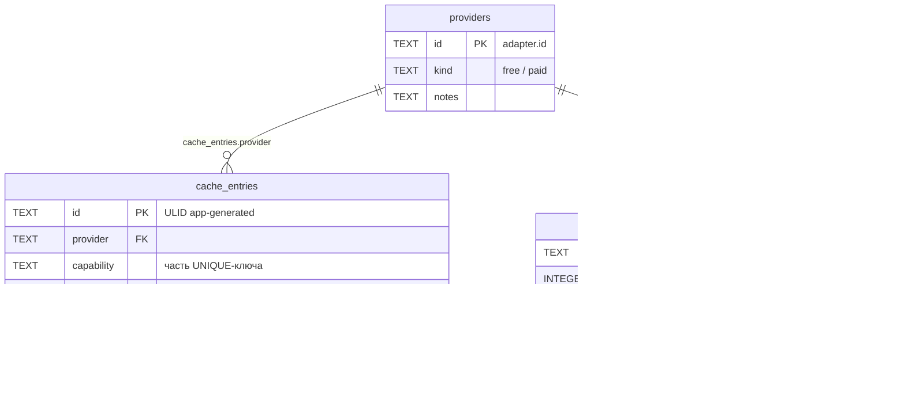

# 4. Data Model (Conceptual)

> Part of [docs/ARCHITECTURE.md](../ARCHITECTURE.md).

### 4.1. Entities Overview

**Канонические типы (M1, `packages/core/src/types/*`)** — см. полные zod-схемы в §3.2. Кратко:

#### Entity: `Token`

- **Описание:** метаданные + цена токена на конкретной сети/адресе.
- **Ключевые атрибуты:** `chain`, `address` (нормализован), `symbol`, `name`, `decimals?`,
  `priceUsd?`, `marketCapUsd?`, `source`, `fetchedAt`.
- **Business rule:** `address` всегда прошёл `normalizeAddress(chain, raw)` до попадания в тип —
  ни один адаптер не кладёт сырой ввод пользователя в канонический объект напрямую.

#### Entity: `Wallet` / `Balance`

- **Описание:** список балансов кошелька на сети. `Balance` — элемент массива, различает
  `assetType: 'native' | 'token'` — в M1 заполняется только `'native'` (§3.2 решение).
- **Relationships:** `Wallet 1:N Balance` (встроенный массив, не отдельная таблица — M1 не
  персистирует их вне кеша).
- **Business rule:** `amountRaw` — точное целое **строкой** (DB-SCHEMA §1.7 конвенция: wei/lamports
  превышают безопасные 2^53); `amountNum` — lossy-проекция, никогда не источник истины.

#### Entity: `Pool`

- **Описание:** торговая пара (DEX) — используется `onchain_new_pairs`.
- **Ключевые атрибуты:** `id`, `chain`, `dexId`, `baseTokenSymbol`/`quoteTokenSymbol`,
  `pairAddress`, `createdAt?`, `liquidityUsd?`, `volume24hUsd?`, `source`, `fetchedAt`.

#### Entity: `OHLCV` (зарезервирован, не потребляется в M1)

- Поля — см. §3.2 схема. Существует для R-1 (тип должен существовать), первый потребитель — M1.5+.

#### Entity: `Snapshot` (D5-дополнение, персистентная форма — DB-SCHEMA-CONCEPT §2)

- Движок его **не пишет** (n8n пишет, TASK.md §1) и, по решению владельца 2026-07-25, **не начнёт**:
  автономный контур остаётся на n8n + Postgres (ADR-001 D8-дополнение). Тип существует как
  каноническая форма ЧТЕНИЯ той же `snapshots`-таблицы — её читает адаптер `pg-history` (R-12).
  Ранее здесь стояло «для будущего M3 поглощения снапшоттера» — поглощение отменено.
- **Маппинг имён на persistence-границе (minor, ревью цикл 1):** `SnapshotSchema` — camelCase
  (`valueRaw`, `valueNum`); персистентная колонка DB-SCHEMA §2 — snake_case (`value_raw`,
  `value_num`). `metric`/`asset`/`ts`/`source`/`height` совпадают буквально и не переименовываются.
  Движок `snapshots` не пишет, поэтому маппинг нигде не реализован — но он понадобится на
  **читающей** стороне, когда правила M3 начнут разбирать историю: явный (де)сериализатор именно
  для `valueRaw↔value_raw`/`valueNum↔value_num`, не автоматический camelCase→snake_case по всем
  полям. Зафиксировано заранее, чтобы M3 не открывал вопрос заново. (Формулировка «когда M3
  поглощает снапшоттер» устарела — поглощение отменено 2026-07-25, направление маппинга сменилось
  с записи на чтение, сам маппинг остался нужен.)

#### Entity: `SmartMoneyFlow` (M2, TASK-005, D5-расширение, R-31)

- **Описание:** net-flow «умных денег» по токену (несколько скользящих окон) + верхние
  holder-адреса с метками — используется `onchain_smart_money_flows`. Композитный тип: строится
  из ДВУХ Nansen-эндпоинтов (`POST /smart-money/netflow` → `SmartMoneyNetflowResponse.data[]`,
  `POST /tgm/holders` → `TGMHoldersResponse.data[]`), объединённых в один `nansen.fetch()`-вызов
  (§3.2) — не два отдельных canonical-типа.
- **Ключевые атрибуты (поле-в-поле трассируется на `nansen-openapi-2026-07-23.json`'s
  `SmartMoneyNetflow`/`TGMHolder` схемы, разведка этой архитектуры):** `chain`, `tokenAddress`
  (нормализован через `normalizeAddress`), `tokenSymbol`, `netflow1hUsd`/`netflow24hUsd`/
  `netflow7dUsd`/`netflow30dUsd` (`SmartMoneyNetflow.net_flow_{1h,24h,7d,30d}_usd` — **четыре**
  скользящих окна, не одно генерическое `windowStart`/`windowEnd`: реальный ответ не даёт
  произвольного окна, он даёт фиксированный набор; уточнение TASK.md R-31's иллюстративной
  формулировки по живой эвиденции, не расхождение с ней — R-31 «netflowUsd» трактуется как
  минимальная планка, `netflow24hUsd` её покрывает, остальные три — дополнительная точность),
  `traderCount?`/`tokenAgeDays?`/`tokenSectors?[]` (`SmartMoneyNetflow.trader_count`/
  `token_age_days`/`token_sectors`), `topHolders[]` (из `TGMHolder[]`: `{address, addressLabel?,
tokenAmount?, valueUsd?, ownershipPercentage?}` — подмножество полей `TGMHolder`, не полный
  DTO), `source`, `fetchedAt`.
- **Business rule:** anti-corruption — Nansen DTO (`SmartMoneyNetflow`/`TGMHolder`, включая
  обёртку `{data, pagination}`) не протекает наружу, тот же паттерн, что `Token`/`Pool` (§3.2).
  Golden-тест на фикстуре (R-31 acceptance).

#### Entity: `EntityLabel` (M2, TASK-005, D5-расширение, R-32)

- **Описание:** метка адреса/сущности (кошелёк, фонд, биржа, известный трейдер) — используется
  `onchain_entity_label`. Источник зависит от tier'а вызова (§3.2 costOf()-таблица): дефолт —
  `POST /search/general` → `GeneralSearchResponse.{tokens[], entities[]}`
  (`TokenSearchResult`/`EntitySearchResult`); token-scoped обогащение — `TGMHolder.address_label`;
  exhaustive-эскалация — `POST /profiler/address/labels` (форма ответа не эксплорится этой
  архитектурой сверх известной по costOf()-таблице цены — Development-фаза фикстурирует её живым
  вызовом при первом реальном использовании, R-44).
- **Ключевые атрибуты:** `chain?` (опционален — `EntitySearchResult` НЕ несёт chain/address,
  сущность может быть кросс-чейн: имя/tags без привязки к конкретному адресу; `TokenSearchResult`/
  `TGMHolder`-производные результаты его несут), `address?` (по той же причине — опционален),
  `name?`, `tags[]` (default `[]`, из `EntitySearchResult.tags`), `labels[]` (default `[]`, из
  `TGMHolder.address_label`, обёрнутого в массив — **пустой массив — валидный результат**, «нет
  меток», не ошибка, R-32), `premiumRequested: boolean` (явный флаг — `true` только когда вызов
  прошёл через `exhaustive: true`-путь, R-42), `source`, `fetchedAt`.
- **Business rule:** ни `chain`, ни `address` не обязательны одновременно (в отличие от `Token`/
  `Wallet`) — единственный M2-тип, где это так, ввиду реальной формы `EntitySearchResult`. Golden-
  тесты на фикстуре с ≥1 меткой И на фикстуре с 0 меток (R-32 acceptance).

#### Entity: `TokenRiskScore` (M2, TASK-005, D5-расширение, R-33)

- **Описание:** risk/reward-индикаторы токена — используется `onchain_token_risk`. Композитный
  тип: `POST /tgm/indicators` (`TGMIndicatorsResponse`) + `POST /tgm/token-information` (метаданные
  токена), один `nansen.fetch()`-вызов.
- **Ключевые атрибуты (трассируются на `TGMIndicatorsResponse`/`TGMIndicatorTokenInfo`/
  `TGMIndicator` схемы):** `chain`, `address`, `marketCapUsd?`/`marketCapGroup?`/`isStablecoin?`
  (`TGMIndicatorTokenInfo`), `riskIndicators[]`/`rewardIndicators[]` — **раздельные** массивы
  (R-33 «не сплющено в один список»), каждый элемент `{indicatorType, score?, signal?,
signalPercentile?, lastTriggerOn?}` (`TGMIndicator` — `score` качественный: risk →
  low/medium/high, reward → bearish/neutral/bullish, по спеке; `signal`/`signalPercentile` —
  `number`, НЕ строки, R-33 — это не wei-подобные ончейн-целые, безопасно для JS-`number`/`REAL`),
  `source`, `fetchedAt`.
- **Business rule:** anti-corruption, golden-тест на фикстуре (R-33 acceptance).

### 4.2. Логическая модель — кеш-БД (`DATA_DIR/cache.sqlite3`)

Полный DDL — §3.2 «Модуль `src/cache/*`». Кратко: `providers(id PK)` ← `cache_entries(provider
FK, capability, args_hash, value_json, created_at, expires_at, UNIQUE(provider,capability,
args_hash))`. Портируемые типы (`TEXT`/`INTEGER`), epoch-ms `INTEGER`, app-generated `TEXT` ULID
id, `PRAGMA foreign_keys=ON` — DB-SCHEMA-CONCEPT §1 применены буквально к новому контексту (кеш,
не аналитический снапшот — см. апсерт-семантику §3.2, отличную от append-only `snapshots`). **Все
девять `adapterRegistrations` (включая `pg-history` — F-2, ревью цикл 1) upsert-ятся в
`providers` при старте** — ни один кеш-хит/промах не может сослаться на несуществующий
`provider`, FK не нарушается ни для одного адаптера, зарегистрированного в `providers.config.ts`.

**M2-дополнение (TASK-005, R-34): `usage(provider FK, day, credits_used)`** — та же кеш-БД, тот же
`providers`-реестр как FK, **без миграции** `providers`/`cache_entries` (форвард-компат комментарий
в `cache/ddl.ts` был подготовлен уже в M1). Портируемые типы буквально (DB-SCHEMA-CONCEPT §1):

```sql
CREATE TABLE IF NOT EXISTS usage (
  provider     TEXT NOT NULL REFERENCES providers(id),
  day          INTEGER NOT NULL,           -- epoch-ms UTC bucket start: floor(ts/86400000)*86400000
  credits_used INTEGER NOT NULL DEFAULT 0, -- АДДИТИВНЫЙ счётчик — см. семантику upsert ниже
  updated_at   INTEGER NOT NULL,           -- epoch-ms UTC последней записи (только для наблюдаемости)
  PRIMARY KEY (provider, day)
);
```

- `day` — **`INTEGER` epoch-ms** (day-bucket start), не строковая дата — DB-SCHEMA §1.2/CLAUDE.md
  канон буквально; несмотря на то что ADR-001 D6 называет колонку «day», буквальная строка-дата
  противоречила бы канону — бакетируется тем же паттерном, что `ts_bucket` у n8n-снапшоттера.
- `credits_used` — `INTEGER` (не `value_raw TEXT`-паттерн: это малый внутренний счётчик кредитов
  движка в пределах безопасного JS-`number`, не canonical-наблюдение произвольной точности — не
  `Snapshot`, поэтому `INTEGER` не противоречит канону, R-34).
- **`PRIMARY KEY (provider, day)` — natural dedup key, ДВЕ фазы записи через ОДИН и тот же
  аддитивный upsert** (не overwrite-upsert, каким `cache_entries.set()` пишет свою строку):

  ```sql
  INSERT INTO usage (provider, day, credits_used, updated_at)
  VALUES (@provider, @day, @delta, @now)
  ON CONFLICT (provider, day) DO UPDATE SET
    -- MAX(0, …) — belt-and-braces (C-2 review): @delta ЗНАКОВАЯ (post-call reconciliation, §3.2,
    -- пишет actual-reserved, может быть отрицательной) — но credits_used обязан оставаться
    -- неотрицательным счётчиком по построению; без этого зажима любой пограничный/дефектный путь
    -- (напр. bucket, ошибочно НЕ зафиксированный на момент резервации, §3.2 «dayBucketMs
    -- фиксируется один раз») мог бы протолкнуть отрицательное число в новый день-бакет и нарушить
    -- задокументированный «never-overwritten, только растёт или остаётся» инвариант этой колонки.
    credits_used = MAX(0, credits_used + excluded.credits_used),
    updated_at = excluded.updated_at;
  ```

  (a) pre-call **резервирование** — `@delta = costOf()` (точная цена, R-37); (b) post-call
  **реконсиляция** — `@delta = actual − reserved` (подписанная дельта, может быть отрицательной,
  R-38). Тот же самый SQL-паттерн для обеих фаз — не «замещающая» запись, иначе задвоился бы или
  потерялся расход (§3.2 разбирает это подробно). **`day` в обеих фазах одного вызова — буквально
  одно и то же значение** (`dayBucketMs`, зафиксированный на резервации, §3.2 «Атомарный
  check+reserve») — реконсиляция никогда не пересчитывает бакет из текущего времени ответа, поэтому
  ответ, пришедший после полуночи для вызова, зарезервированного до неё, всё равно попадает в
  ИСХОДНЫЙ day-бакет, не в новый (C-2 review).

- `SqliteBudgetStore` (`cache/budget-store.ts`, реализует интерфейс `BudgetStore` — тот же паттерн
  инъекции, что `CacheStore`/`SqliteCacheStore`, §3.2/§5.2 M1) открывает **собственное**
  `better-sqlite3`-соединение на тот же файл (`cacheDbPath()`, переиспользует существующий
  `cache/data-dir.ts`), выполняет `db.exec(CACHE_DDL)` идемпотентно (та же строка, включающая
  теперь и `usage`) и **обязательно** переиздаёт `PRAGMA foreign_keys=ON` на ЭТОМ соединении —
  прагма connection-scoped, не персистится в файле (DB-SCHEMA §1.6, R-34 явно требует «каждое»
  соединение, не глобально) — тест `pragma_foreign_keys`/`sqlite_master`-запросом подтверждает это
  (R-34/R-35 acceptance).

### 4.3. Диаграмма данных


```mermaid
erDiagram
  providers ||--o{ cache_entries : "cache_entries.provider"
  providers ||--o{ usage : "usage.provider"

  providers {
    TEXT id PK "adapter.id"
    TEXT kind "free / paid"
    TEXT notes
  }

  cache_entries {
    TEXT id PK "ULID app-generated"
    TEXT provider FK
    TEXT capability "часть UNIQUE-ключа"
    TEXT args_hash "часть UNIQUE-ключа, sha256(normalizedArgs), без секретов"
    TEXT value_json "канонический результат"
    INTEGER created_at "epoch-ms UTC"
    INTEGER expires_at "epoch-ms UTC = created_at + TTL(capability)"
  }

  usage {
    TEXT provider FK "часть PK"
    INTEGER day PK "epoch-ms day-bucket start, часть PK"
    INTEGER credits_used "АДДИТИВНЫЙ — never overwritten"
    INTEGER updated_at "epoch-ms UTC, только наблюдаемость"
  }
```

### 4.4. Миграции и версионирование

**M2 (реализовано этой архитектурой, TASK-005):** `usage(provider FK, day, credits_used,
updated_at)` добавлена в ту же кеш-БД, `providers`/`cache_entries` не изменены (R-14/R-34
acceptance) — механическая `CREATE TABLE IF NOT EXISTS`, не миграция существующих строк. Канонические
типы версионируются по D5 (тип-версия — поле зарезервировано, но M1/M2 не вводят breaking-change
механику — первая ревизия схем для всех шести canonical-типов, включая три новых M2).
