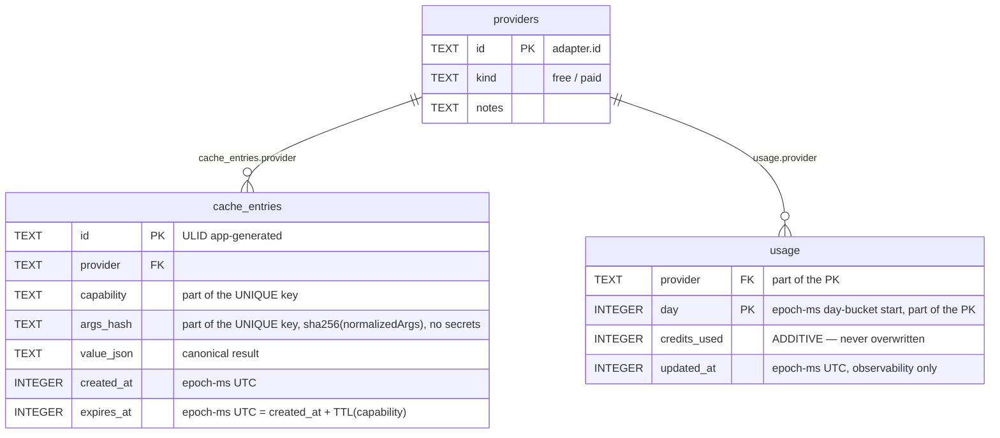

# 4. Data Model (Conceptual)

> Part of [docs/ARCHITECTURE.md](../ARCHITECTURE.md).

### 4.1. Entities Overview

**Canonical types (M1, `packages/core/src/types/*`)** — full zod schemas in §3.2. In brief:

#### Entity: `Token`

- **Description:** token metadata and price for one chain/address.
- **Key attributes:** `chain`, `address` (normalized), `symbol`, `name`, `decimals?`, `priceUsd?`,
  `marketCapUsd?`, `source`, `fetchedAt`.
- **Business rule:** `address` has always passed `normalizeAddress(chain, raw)` before it reaches
  the type — no adapter puts raw user input into a canonical object.

#### Entity: `Wallet` / `Balance`

- **Description:** a wallet's balances on a chain. `Balance` is an array element and distinguishes
  `assetType: 'native' | 'token'`; in M1 only `'native'` is populated (§3.2).
- **Relationships:** `Wallet 1:N Balance` — an embedded array, not a separate table: M1 does not
  persist balances outside the cache.
- **Business rule:** `amountRaw` is the exact integer **as a string** (DB-SCHEMA §1.7: wei/lamports
  exceed the safe 2^53); `amountNum` is a lossy projection and never the source of truth.

#### Entity: `Pool`

- **Description:** a DEX trading pair — consumed by `onchain_new_pairs`.
- **Key attributes:** `id`, `chain`, `dexId`, `baseTokenSymbol`/`quoteTokenSymbol`, `pairAddress`,
  `createdAt?`, `liquidityUsd?`, `volume24hUsd?`, `source`, `fetchedAt`.

#### Entity: `OHLCV` (reserved, not consumed in M1)

- Fields — see the §3.2 schema. The type exists because R-1 requires it to exist; the first consumer
  is M1.5+.

#### Entity: `Snapshot` (D5 addition, persistent form — DB-SCHEMA-CONCEPT §2)

- The engine **never writes** snapshots. The autonomous loop stays on n8n + Postgres permanently
  (owner decision 2026-07-25, ADR-001 D8 addendum). The type exists as the canonical **read** form
  of that same `snapshots` table — the form the `pg-history` adapter returns (R-12).
- **Name mapping at the persistence boundary:** `SnapshotSchema` is camelCase (`valueRaw`,
  `valueNum`); the persistent columns of DB-SCHEMA §2 are snake_case (`value_raw`, `value_num`).
  `metric`/`asset`/`ts`/`source`/`height` match literally and are not renamed. Nothing implements
  the mapping today because nothing on the engine side writes `snapshots`; it is needed on the
  **reading** side once M3 rules start parsing history. It must be an explicit (de)serializer for
  exactly `valueRaw↔value_raw`/`valueNum↔value_num`, not a blanket camelCase→snake_case over every
  field. Recorded here so M3 does not have to reopen the question.

#### Entity: `SmartMoneyFlow` (M2, TASK-005, D5 extension, R-31)

- **Description:** smart-money net flow for a token over several rolling windows, plus the top
  holder addresses with labels — consumed by `onchain_smart_money_flows`. A composite type: it is
  built from TWO Nansen endpoints (`POST /smart-money/netflow` →
  `SmartMoneyNetflowResponse.data[]`, `POST /tgm/holders` → `TGMHoldersResponse.data[]`) merged
  inside a single `nansen.fetch()` call (§3.2) — not two separate canonical types.
- **Key attributes** (traced field-by-field onto the `SmartMoneyNetflow`/`TGMHolder` schemas of
  `nansen-openapi-2026-07-23.json`): `chain`, `tokenAddress` (normalized via `normalizeAddress`),
  `tokenSymbol`, `netflow1hUsd`/`netflow24hUsd`/`netflow7dUsd`/`netflow30dUsd`
  (`SmartMoneyNetflow.net_flow_{1h,24h,7d,30d}_usd`), `traderCount?`/`tokenAgeDays?`/
  `tokenSectors?[]` (`SmartMoneyNetflow.trader_count`/`token_age_days`/`token_sectors`),
  `topHolders[]` (from `TGMHolder[]`: `{address, addressLabel?, tokenAmount?, valueUsd?,
ownershipPercentage?}` — a subset of `TGMHolder`'s fields, not the full DTO), `source`, `fetchedAt`.
- **Four fixed windows, not one generic `windowStart`/`windowEnd`:** the live response does not
  offer an arbitrary window, it offers a fixed set. R-31's `netflowUsd` is read as a floor —
  `netflow24hUsd` satisfies it and the other three are extra precision.
- **Business rule:** anti-corruption layer — the Nansen DTOs (`SmartMoneyNetflow`/`TGMHolder`,
  including the `{data, pagination}` envelope) never leak outward, the same pattern as
  `Token`/`Pool` (§3.2). Golden test on a fixture (R-31 acceptance).

#### Entity: `EntityLabel` (M2, TASK-005, D5 extension, R-32)

- **Description:** the label of an address or entity (wallet, fund, exchange, known trader) —
  consumed by `onchain_entity_label`. The source depends on the call tier (§3.2 `costOf()` table):
  the default tier is `POST /search/general` → `GeneralSearchResponse.{tokens[], entities[]}`
  (`TokenSearchResult`/`EntitySearchResult`); token-scoped enrichment comes from
  `TGMHolder.address_label`; the exhaustive escalation is `POST /profiler/address/labels` (its
  response shape is fixtured from a live call on first real use, R-44).
- **Key attributes:** `chain?` and `address?` are both optional — `EntitySearchResult` carries
  neither, because an entity can be cross-chain (a name and tags with no particular address);
  results derived from `TokenSearchResult`/`TGMHolder` do carry them. Plus `name?`, `tags[]`
  (default `[]`, from `EntitySearchResult.tags`), `labels[]` (default `[]`, from
  `TGMHolder.address_label` wrapped in an array — **an empty array is a valid result**, "no
  labels", not an error, R-32), `premiumRequested: boolean` (an explicit flag — `true` only when
  the call went through the `exhaustive: true` path, R-42), `source`, `fetchedAt`.
- **Business rule:** neither `chain` nor `address` is mandatory (unlike `Token`/`Wallet`) — the only
  M2 type where that holds, and it holds because of the real shape of `EntitySearchResult`. Golden
  tests on a fixture with ≥1 label AND on a fixture with 0 labels (R-32 acceptance).

#### Entity: `TokenRiskScore` (M2, TASK-005, D5 extension, R-33)

- **Description:** risk/reward indicators for a token — consumed by `onchain_token_risk`. A
  composite type: `POST /tgm/indicators` (`TGMIndicatorsResponse`) + `POST /tgm/token-information`
  (token metadata), one `nansen.fetch()` call.
- **Key attributes** (traced onto the `TGMIndicatorsResponse`/`TGMIndicatorTokenInfo`/`TGMIndicator`
  schemas): `chain`, `address`, `marketCapUsd?`/`marketCapGroup?`/`isStablecoin?`
  (`TGMIndicatorTokenInfo`), and `riskIndicators[]`/`rewardIndicators[]` as **separate** arrays
  (R-33: not flattened into one list). Each element is `{indicatorType, score?, signal?,
signalPercentile?, lastTriggerOn?}` (`TGMIndicator`), where `score` is qualitative per the spec —
  risk → low/medium/high, reward → bearish/neutral/bullish — and `signal`/`signalPercentile` are
  `number`, not strings (R-33: these are not wei-like on-chain integers, so a JS `number`/`REAL` is
  safe). Plus `source`, `fetchedAt`.
- **Business rule:** anti-corruption layer, golden test on a fixture (R-33 acceptance).

#### Entity: `ChainInfo` (TASK-006, R-48) — **the chain registry**

- **Description:** one chain, described in full. This is **not** a canonical domain type in the D5
  sense (it is not an observation obtained from a provider) — it is the **registry** against which
  canonical types are interpreted. Hence where it lives: a **vendored build artifact**, not a DB
  table and not a network call (rationale — §4.2.1).
- **Key attributes:**

| Field            | Type                                                        | Purpose                                                                                                                                                                                    |
| ---------------- | ----------------------------------------------------------- | ------------------------------------------------------------------------------------------------------------------------------------------------------------------------------------------ |
| `caip2`          | `string` **PK**                                             | Canonical id in CAIP-2 form: `eip155:80094`, `solana:5eykt4Xh…`. The registry's stable primary key.                                                                                        |
| `slug`           | `string` UNIQUE                                             | Human-readable canonical slug (`berachain`) — what an agent writes in `chain`, what `onchain_list_chains` returns, and what goes into the cache key (§4.2.2).                              |
| `name`           | `string`                                                    | Display name (`Berachain`).                                                                                                                                                                |
| `family`         | `'evm' \| 'svm' \| 'move' \| 'cosmos' \| 'utxo' \| 'other'` | Determines **address validation** (R-55) and whether `rpc-evm` can serve the chain.                                                                                                        |
| `aliases`        | `string[]`                                                  | Every other accepted spelling, including the legacy `ethereum`/`solana` (R-59a) and vendor ids. Globally unique.                                                                           |
| `nativeSymbol`   | `string \| null`                                            | Symbol of the **gas** token (`BERA`, `XDAI`) — consumed by `pairs.new` (R-57a) and `wallet.balances.native` instead of a hardcode.                                                         |
| `nativeDecimals` | `number \| null`                                            | Decimals of that same gas token.                                                                                                                                                           |
| `vendors`        | `Record<vendorId, string \| null>`                          | **Naming only:** what this chain is called at each vendor. `defillama`→`"Berachain"`, `coingecko`→`"berachain"`, `dexscreener`→`"berachain"`. `null` = the vendor does not have the chain. |
| `rpcHosts`       | `string[] \| null`                                          | The curated SSRF allowlist for this chain (R-56a). `null` = `wallet.balances.native` is honestly uncovered, see §7.2.                                                                      |
| `tvlUsdAtSync`   | `number \| null`                                            | TVL **as of the registry sync**, knowingly stale. Exists **solely** to filter and rank in `onchain_list_chains` without a network call.                                                    |
| `deprecated`     | `boolean`                                                   | The chain disappeared from the vendors, but the row is kept (R-49f) — references and cache keys do not break.                                                                              |

The two native-token columns carry the failure they prevent:

- `nativeSymbol` is the **gas** token, never the chain's listing/governance token: `arbitrum` is
  `ETH`, not `ARB`. `null` means we do not know, and the capability that needs it is honestly
  uncovered rather than silently wrong.
- `nativeDecimals` is required because `eth_getBalance` returns an integer in the minimal unit —
  with no decimals there is nothing to label it with. 18 is an EVM convention, not a rule: 29 chains
  in the EIP-155 catalog use something else, and a hardcoded 18 is a wrong answer that looks right.
  For non-EVM families the value comes from the generator's curated table
  (`CURATED_NATIVE_DECIMALS`), because EIP-155 knows nothing about them.

- **Relationships:** `ChainInfo 1:N` aliases (embedded array). It references no other entity — the
  reverse holds: `Token`/`Wallet`/`Pool`/`SmartMoneyFlow` reference a chain through their own
  `chain` field.

- **Business rules (each one is a test, R-60c):**
  1. `caip2` is unique; `slug` is unique; **the set of all `aliases` intersects no `slug` and no
     other `aliases`** — otherwise resolution is ambiguous. Checked at startup.
  2. **An alias is resolved to the canonical chain BEFORE the cache key is built.** Otherwise
     `"ethereum"` and `"eth"` produce two cache entries for one and the same request. This is not
     an optimization, it is correctness (§4.2.2).
  3. `tvlUsdAtSync` is **never** returned as the answer to "what is the TVL" — that is `chain.tvl`
     (R-53). In the `onchain_list_chains` payload the field is named `tvlUsdAtRegistrySync`, so the
     two cannot be confused.
  4. `vendors` describes **naming, not coverage.** Coverage is a derived quantity (§4.2.3), and
     mixing the two is forbidden: otherwise "Nansen does not have this chain" and "we never checked
     Nansen on this chain" become indistinguishable (R-58d).

#### Entity: `CoverageProbe` (TASK-006, R-58) — a recorded fact about a vendor

- **Description:** the recorded result of establishing the chain coverage of a vendor whose coverage
  cannot be derived from a public catalog. In the MVP there is exactly one consumer: `nansen`.
- **Key attributes:** `vendorId`, `probedAt` (epoch-ms UTC), `chains: string[]` (the chains
  confirmed by the evidence), `creditsSpent`, `evidencePath` (a file under `raw/`).
- **Business rule:** the absence of a probe means **`unverified`, not `unsupported`** (R-58d). What
  the engine actually gates on is described in §4.2.3.

### 4.2. Logical model — the cache DB (`DATA_DIR/cache.sqlite3`)

The full DDL is in §3.2, module `src/cache/*`. In brief: `providers(id PK)` ← `cache_entries(provider
FK, capability, args_hash, value_json, created_at, expires_at, UNIQUE(provider,capability,
args_hash))`. Portable types (`TEXT`/`INTEGER`), epoch-ms `INTEGER`, app-generated `TEXT` ULID ids,
`PRAGMA foreign_keys=ON` — DB-SCHEMA-CONCEPT §1 applied literally to a new context (a cache, not an
analytical snapshot: the upsert semantics in §3.2 differ from the append-only `snapshots`). **All ten
`adapterRegistrations` (including `pg-history`) are upserted into `providers` at startup** — no cache
hit or miss can reference a nonexistent `provider`, and the FK holds for every adapter registered in
`providers.config.ts`.

**M2 addition (TASK-005, R-34): `usage(provider FK, day, credits_used)`** — the same cache DB, the
same `providers` registry as the FK target, and **no migration** of `providers`/`cache_entries` (the
forward-compatibility comment in `cache/ddl.ts` was already in place in M1). Portable types, taken
literally (DB-SCHEMA-CONCEPT §1):

```sql
CREATE TABLE IF NOT EXISTS usage (
  provider     TEXT NOT NULL REFERENCES providers(id),
  day          INTEGER NOT NULL,           -- epoch-ms UTC bucket start: floor(ts/86400000)*86400000
  credits_used INTEGER NOT NULL DEFAULT 0, -- ADDITIVE counter — see the upsert semantics below
  updated_at   INTEGER NOT NULL,           -- epoch-ms UTC of the last write (observability only)
  PRIMARY KEY (provider, day)
);
```

**SEC-1 (2026-07-27): `usage_window(provider FK, window_start, credits_used)`** — the same additive
counter with a 60-second bucket instead of a day. A separate table rather than a `bucket_width`
column on `usage`: the daily counter must keep summing whole days, and carrying two widths in one
column would make every existing SELECT ambiguous and force a migration. It ships as an ordinary
`CREATE TABLE IF NOT EXISTS` against the same `providers` registry — it migrates nothing.

```sql
CREATE TABLE IF NOT EXISTS usage_window (
  provider     TEXT NOT NULL REFERENCES providers(id),
  window_start INTEGER NOT NULL,           -- epoch-ms UTC: floor(ts/60000)*60000
  credits_used INTEGER NOT NULL DEFAULT 0, -- same signed additive upsert, same MAX(0, …)
  calls_made   INTEGER NOT NULL DEFAULT 0, -- Q-3: additive and MONOTONIC — never given back
  updated_at   INTEGER NOT NULL,
  PRIMARY KEY (provider, window_start),
  CHECK (credits_used >= 0),
  CHECK (calls_made >= 0)
);
```

`calls_made` is the **second denominator** (Q-3). A gate that counts credits cannot refuse a call
that costs 0 credits: `used + 0 > ceiling` is false for the whole life of the bucket at any ceiling.
That is not a defect of the ceiling, it is what its unit of measure means — so it is cured with a
different unit, not with a stricter number. The column sits on the same row rather than in a second
table: same provider, same window, same transaction, and one read instead of two. The counter is
**monotonic** — reconciliation corrects credits and never the number of calls: the vendor was
called, and "giving one back" would let a run of cheap-and-refunded calls slip past the very limit
it exists to enforce.

The column was added **after** the table had already shipped, so `CREATE TABLE IF NOT EXISTS` does
not create it on an existing file. `SqliteBudgetStore` checks `PRAGMA table_info` and runs
`ALTER TABLE … ADD COLUMN` when needed (`USAGE_WINDOW_COLUMNS` in `cache/ddl.ts`) — idempotent on
every open, additive, with no backfill (`DEFAULT 0` is correct by construction: a window row that
predates the column contains, by definition, no counted calls). This is exactly the "mechanical, not
a project" kind of migration DB-SCHEMA-CONCEPT §1 demands.

It is read and written **inside the same transaction** as the daily reservation (`checkAndReserve`).
Otherwise two processes sharing one `cache.sqlite3` — a supported topology, several stdio sessions
on one machine — would each pass its own window check against a stale read. Rows older than an hour
are deleted opportunistically in that same transaction: only the CURRENT window is ever read, the
rest is retention for post-mortem analysis, and one row per minute per provider forever is a slow
leak into `DATA_DIR`.

- `day` is an **`INTEGER` epoch-ms** day-bucket start, not a string date — DB-SCHEMA §1.2 /
  CLAUDE.md canon taken literally. ADR-001 D6 calls the column "day", but a literal date string
  would contradict the canon; it is bucketed with the same pattern as the n8n snapshotter's
  `ts_bucket`.
- `credits_used` is an `INTEGER`, not the `value_raw TEXT` pattern: it is a small internal counter of
  the engine's own credits, well inside a safe JS `number`, not a canonical observation of arbitrary
  precision. It is not a `Snapshot`, so `INTEGER` does not contradict the canon (R-34).
- **`PRIMARY KEY (provider, day)` is the natural dedup key, and TWO write phases go through ONE and
  the same additive upsert** (not the overwrite-upsert with which `cache_entries.set()` writes its
  row):

  ```sql
  INSERT INTO usage (provider, day, credits_used, updated_at)
  VALUES (@provider, @day, @delta, @now)
  ON CONFLICT (provider, day) DO UPDATE SET
    -- MAX(0, …) is belt-and-braces: @delta is SIGNED (post-call reconciliation, §3.2, writes
    -- actual-reserved and may be negative) — but credits_used must remain a non-negative counter
    -- by construction. Without this clamp any edge or defective path (e.g. a bucket mistakenly NOT
    -- pinned at reservation time, §3.2 "dayBucketMs is pinned once") could push a negative number
    -- into a fresh day bucket and break this column's documented "never overwritten, only grows or
    -- stays" invariant.
    credits_used = MAX(0, credits_used + excluded.credits_used),
    updated_at = excluded.updated_at;
  ```

  (a) the pre-call **reservation** — `@delta = costOf()` (the exact price, R-37); (b) the post-call
  **reconciliation** — `@delta = actual − reserved` (a signed delta, possibly negative, R-38). The
  same SQL pattern serves both phases; a replacing write would double-count or lose spend instead
  (§3.2 works this through in detail). **`day` in both phases of one call is literally the same
  value** (`dayBucketMs`, pinned at reservation, §3.2 "atomic check+reserve") — reconciliation never
  recomputes the bucket from the response's arrival time, so a response that arrives after midnight
  for a call reserved before it still lands in the ORIGINAL day bucket, not a new one.

- `SqliteBudgetStore` (`cache/budget-store.ts`, implementing the `BudgetStore` interface — the same
  injection pattern as `CacheStore`/`SqliteCacheStore`, §3.2/§5.2) opens its **own** `better-sqlite3`
  connection to the same file (`cacheDbPath()`, reusing the existing `cache/data-dir.ts`), runs
  `db.exec(CACHE_DDL)` idempotently (the same string, which now also carries `usage`), and
  **necessarily** reissues `PRAGMA foreign_keys=ON` on THAT connection — the pragma is
  connection-scoped and is not persisted in the file (DB-SCHEMA §1.6; R-34 explicitly requires
  "every" connection, not a global). A `pragma_foreign_keys`/`sqlite_master` query test confirms it
  (R-34/R-35 acceptance).

#### 4.2.1. The chain registry is a build artifact, not a DB table (TASK-006, R-48/R-60)

The registry lands in neither the cache DB, nor Postgres, nor a network call at startup. It lives in
the repository as one deterministic file, is vendored into the build, and is loaded into memory at
startup. Three reasons, each a hard requirement rather than a taste:

1. **The offline gate (R-60a).** M1/M2 established the gate "an offline run makes 0 network calls".
   A registry pulled over the network at startup breaks it the same day.
2. **CI determinism.** A test whose result depends on what a vendor served today is not a test.
3. **Reviewability.** Changing the set of chains is a git diff with a human reviewing it (TASK-006
   UC-4), not a silent shift in production behavior. This matters most for `rpcHosts`: that is a
   security surface (§7.2), and it must change through a commit.

The consequence, stated explicitly: **registry freshness is the operator's duty, not the runtime's.**
A new chain that appeared at a vendor becomes available after the generator runs and the result is
committed (TASK-006 UC-4), not automatically. That is a deliberate trade: determinism and control
over the security surface, against automatic freshness.

**Loading (R-60c/d):** schema validation plus the §4.1 invariants run **at startup**, not on the
first request. A missing or invalid registry is a loud process failure. Degrading to an empty
registry is **forbidden**: an empty registry would turn every request into "unknown chain" — quietly
breaking the entire engine while looking like correct operation.

#### 4.2.2. Effect on the cache key (OQ-3)

The cache key is `(provider, capability, sha256(normalizedArgs))` (M1, §3.2), and `normalizedArgs`
contains `chain`. What goes in there is the canonical **slug**, never the spelling the agent wrote.

- **Correctness requirement:** an alias is canonicalized (`eth` → `ethereum`) **before** hashing.
  Without that, one and the same request written two ways produces two paid calls and two cache
  entries — on a paid route that is a direct monetary defect. Canonicalization happens in the
  handler, ahead of `deriveArgsHash`, and an end-to-end test proves it: `chain:'eth'` after
  `chain:'ethereum'` is a cache HIT with no second upstream request.
- **No cold invalidation happened.** The canonical value is the slug (the rationale, and the
  rejection of CAIP-2 in this position, is recorded in `types/chain.ts` under R-59d), and before
  TASK-006 the tools accepted exactly `ethereum`/`solana` — which are their own slugs. The
  `args_hash` of existing rows therefore did not change and the cache survived the rollout intact.

#### 4.2.3. The coverage matrix is derived, not a second registry (R-51a)

Coverage of a (capability, chain) pair is **stored nowhere as a list.** It is computed as a
composition of two things that already exist:

```
covered(capability, chain) :=
    ∃ adapterId ∈ route(capability).adapterIds :
        adapter(adapterId).chainSupport(chainInfo) === true
```

Every adapter answers the question about a chain itself, with a predicate over `ChainInfo` rather
than a list:

| Adapter                                              | `chainSupport(c)`                                            |
| ---------------------------------------------------- | ------------------------------------------------------------ |
| `defillama`                                          | `c.vendors.defillama !== null`                               |
| `coingecko`                                          | `c.vendors.coingecko !== null`                               |
| `dexscreener`                                        | `c.vendors.dexscreener !== null`                             |
| `rpc-evm`                                            | `c.family === 'evm' && c.rpcHosts !== null`                  |
| `rpc-solana`                                         | `c.caip2 === <solana mainnet caip2>`                         |
| `nansen`                                             | per capability — see below                                   |
| `dash-platform` / `platform-explorer` / `pg-history` | `c.caip2 === <dash caip2>`                                   |
| `dune`                                               | unchanged — `isAvailable()` is still unconditionally `false` |

A deprecated chain is covered by nothing: `covered()` refuses it before consulting any adapter.

**Why a predicate and not a list column:** a column would mean maintaining coverage in two places
(the registry plus the adapter's `capabilities()`) and the two would diverge on the first change. The
predicate leaves the registry as the single source of **facts about a chain** and the adapter as the
single source of **facts about itself**. This is the same principle by which §3.2 keeps
`providers.config.ts` declarative while `isAvailable()` owns the availability decision.

**`nansen` coverage is per capability, and a composite capability is an intersection.** The recorded
coverage comes from the committed vendor spec (`raw/nansen-openapi-2026-07-23.json`), which
enumerates the chains per endpoint, plus a small live spot-check confirming the spec has not
drifted — evidence at zero credits, which meets R-58a's intent more strictly than probing 25 chains
live would. `smart-money.flows` issues two sub-calls (`/smart-money/netflow`, 17 chains, and
`/tgm/holders`, 25), so its coverage is the **intersection**: a union would admit 8 chains where the
first sub-call succeeds, the second is refused, and the credits for the first are already spent. On
top of that the adapter requires the chain's family to have a real address validator — without one
we cannot tell a valid `tokenAddress` from arbitrary text, cannot canonicalize it into a stable cache
key, and cannot know how the vendor cases its address column, on a route that charges for every
attempt. The cost of that condition is stated rather than absorbed silently: after it the covered
counts are `smart-money.flows` 16, `entity.labels` 18 and `token.risk` 18 chains, dropping
`bitcoin`, `near`, `sei`, `starknet`, `sui`, `ton` and `tron`. Each returns the moment its family
gets a validator. One predicate serves all three readers of that answer — what the matrix
advertises, what the transport will build a request for, and what the refusal message lists as
available — because an adapter that answers the same question in two places eventually answers it
two different ways.

**Two different refusals that must not be merged (R-51b):**

| Situation                                                                 | Error type                          | What it means to the agent                              |
| ------------------------------------------------------------------------- | ----------------------------------- | ------------------------------------------------------- |
| The (capability, chain) pair is not covered                               | `CapabilityNotCoveredOnChainError`  | "It is not here and will not be — look at alternatives" |
| The pair is covered but the provider is unavailable (no key, vendor down) | `CapabilityUnavailableError` (R-24) | "This could work — fix the config or retry later"       |

Merging the two would send the agent into an endless retry where retrying is pointless, and
conversely make it give up where adding a key is enough. `CapabilityNotCoveredOnChainError` is
raised from `validateArgs()`, i.e. **before** `ensureBudget()` — no credits are reserved to discover
it.

### 4.3. Data diagram


```mermaid
erDiagram
  providers ||--o{ cache_entries : "cache_entries.provider"
  providers ||--o{ usage : "usage.provider"

  providers {
    TEXT id PK "adapter.id"
    TEXT kind "free / paid"
    TEXT notes
  }

  cache_entries {
    TEXT id PK "ULID app-generated"
    TEXT provider FK
    TEXT capability "part of the UNIQUE key"
    TEXT args_hash "part of the UNIQUE key, sha256(normalizedArgs), no secrets"
    TEXT value_json "canonical result"
    INTEGER created_at "epoch-ms UTC"
    INTEGER expires_at "epoch-ms UTC = created_at + TTL(capability)"
  }

  usage {
    TEXT provider FK "part of the PK"
    INTEGER day PK "epoch-ms day-bucket start, part of the PK"
    INTEGER credits_used "ADDITIVE — never overwritten"
    INTEGER updated_at "epoch-ms UTC, observability only"
  }
```

**TASK-006 adds no table to this diagram.** The chain registry (`ChainInfo`) and `CoverageProbe` are
build artifacts living in process memory and in git, not DB rows (§4.2.1). Their only contact with
this diagram is indirect: `cache_entries.args_hash` is computed from the canonical slug rather than
from whatever string the agent wrote (§4.2.2). The table schema does not change — **there is no
migration**.

### 4.4. Migrations and versioning

**TASK-006:** no DDL change — no new table, no altered column — and no migration event. Existing
cache rows kept matching, because the canonical value fed into `args_hash` was already what the old
tools accepted (§4.2.2). The registry is versioned by being a file under git: its "version" is the
commit. There is no schema-version field in v1 (YAGNI: the only consumer is this same process from
the same build), but the loader must validate the structure at startup (R-60c), so an incompatible
file fails loudly rather than silently.

**M2 (TASK-005):** `usage(provider FK, day, credits_used, updated_at)` was added to the same cache
DB; `providers`/`cache_entries` are unchanged (R-14/R-34 acceptance) — a mechanical
`CREATE TABLE IF NOT EXISTS`, not a migration of existing rows. `usage_window` (SEC-1) arrived the
same way, and its one additive `ALTER TABLE … ADD COLUMN` (`calls_made`) is described in §4.2.
Canonical types are versioned per D5 — the type-version field is reserved, but M1/M2 introduce no
breaking-change machinery: this is still the first revision of every canonical schema, the three M2
additions included.
