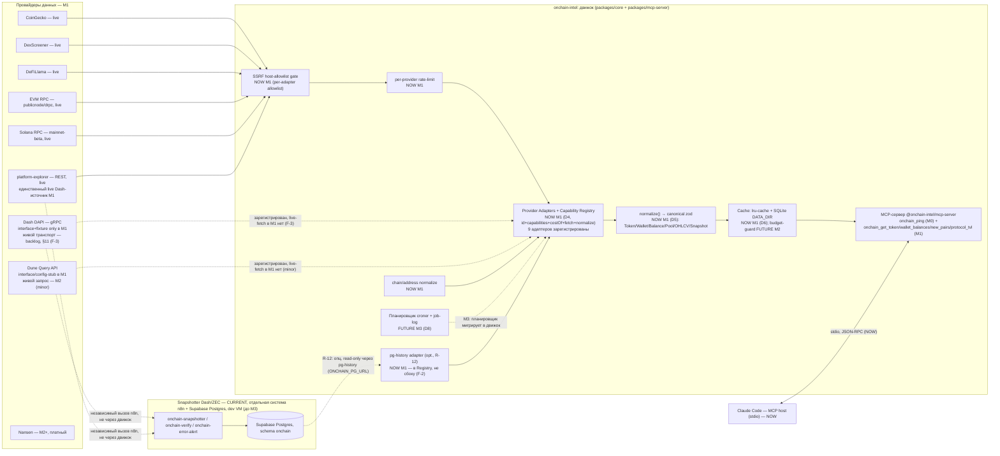

# 2. Функциональная архитектура

> Part of [docs/ARCHITECTURE.md](../ARCHITECTURE.md).

### 2.1. Функциональные компоненты

**Компонент: Chain/Address Normalization — NOW (M1, часть D5)**

- **Назначение:** единая точка входа для валидации и канонизации адресов/сетей, используемая и
  MCP-tool input-схемами, и адаптерами при построении кеш-ключа — гарантирует «один и тот же адрес
  в любом регистре ⇒ один и тот же кеш-ключ» (обязательное требование ревьюера TASK-003).
- **Функции:** `ChainSchema` (enum `ethereum | solana | dash`); `normalizeAddress(chain,
raw): string` — EIP-55 checksum для EVM, валидация base58/32-байта для Solana (без изменения
  регистра — base58 регистро-чувствителен); `isValidAddress(chain, raw): boolean`.
- **Зависимости:** используется `Provider Adapters`, MCP-tool input-схемами (§5.1); не зависит ни
  от чего внутри движка.

**Компонент: Provider Adapters + Capability Registry — NOW (M1, D4)**

- **Назначение:** горячо-заменяемый доступ к внешним провайдерам за стабильным внутренним
  интерфейсом (`id/capabilities()/costOf()/fetch()/normalize()`, D4 — включая поле `id`).
- **Функции:** маршрутизация по способности **и сети** (`(capability, chain)` → упорядоченный
  список адаптеров), приоритет free→paid, hot-swap fallback внутри одной способности (R-11,
  доказательство — DAPI ⇄ platform-explorer), anti-corruption layer (провайдер-DTO не протекают
  наружу — только через `normalize()` в канонический тип).
  - Input: `(capability: string, chain: Chain, args: object)`.
  - Output: `{ result: CanonicalResult, source: string, cache: 'hit'|'miss' }` либо структурированная
    ошибка недоступности (R-24).
  - Related Use Cases: UC-2 (основной путь), UC-3 (кеш), UC-4 (hot-swap).
- **Девять адаптеров M1** (детали — §3.2): `coingecko`, `dexscreener`, `defillama`, `dune`,
  `rpc-evm`, `rpc-solana`, `dash-platform`, `platform-explorer`, `pg-history`. Реконсиляция после
  ревью цикла 1: `dash-platform` (interface + fixture-контракт, живой транспорт — backlog, F-3) и
  `dune` (interface/config-stub, живой запрос — M2, minor) зарегистрированы, но не имеют живого
  сетевого пути в M1; `pg-history` — новый read-only PG-адаптер (F-2), закрывающий R-12 через тот
  же Registry/`providers`-FK контур, что и остальные восемь.
- **Зависимости:** зависит от Chain/Address Normalization, Cache, SSRF-гейта, Rate-limiter;
  зависят от него — MCP tools.

**Компонент: Normalization → canonical zod-схема — NOW (M1, D5)**

- **Назначение:** единый словарь домена: `Token`, `Wallet`/`Balance`, `Pool`, `OHLCV` (типаж
  зарезервирован, ни один M1-tool его пока не потребляет), `Snapshot` (персистентная форма —
  DB-SCHEMA-CONCEPT.md, не используется кеш-БД M1 напрямую — это разные хранилища).
- Провайдер-DTO **никогда** не покидают `normalize()` — все 4 MCP-tools видят только эти типы.

**Компонент: Cache (двухуровневый) — NOW (M1, D6) / Credit-Budget guard — FUTURE (M2)**

- **Назначение:** `lru-cache` (hot, in-process) → `better-sqlite3` (persistent, `DATA_DIR`).
  Ключ = `(provider, capability, argsHash)`; TTL по типу данных (§3.2 таблица). Budget-guard
  (`usage`-таблица, дневной потолок) — **не строится в M1** (TASK.md §4), но схема кеш-БД
  спроектирована так, чтобы `usage` FK-ился на тот же `providers`-реестр без миграции (R-14).
- Hit/miss счётчики — видимы в двух местах (решение архитектора, обосновано в §5.2/§9.3): (1)
  структурированная строка в **stderr**; (2) поле `_meta.cache` в ответе каждого из 4 tools —
  не часть zod-валидируемого `structuredContent`, схема выхода не растёт.

**Компонент: SSRF-гейт + Rate-limiter — NOW (M1)**

- **Назначение:** единственная точка исходящего сетевого доступа. `safeFetch()` проверяет
  hostname запроса (и каждого редиректа) против allowlist **конкретного вызывающего адаптера**
  (не глобального объединённого списка — компрометация/баг одного адаптера не даёт доступа к
  хостам другого). Общий примитив `assertAllowedHost()` спроектирован transport-агностично (для
  будущих неHTTP-транспортов вроде gRPC), но в M1 фактически используется только `safeFetch()` —
  `dash-platform`'s gRPC-канал в M1 не создаётся (interface + fixture-контракт only, F-3, §3.2).
- Rate-limiter — token-bucket per-provider, конфиг в `providers.config.ts`, in-memory (M1 —
  один процесс, персистентность не нужна).

**Компонент: `pg-history` — read-only Postgres адаптер истории — NOW (M1, опционально, R-12)**

- **Назначение:** реализован **как обычный `ProviderAdapter`** (`id: 'pg-history'`), а не
  бесхозный клиент сбоку — регистрируется в `providers`-реестре наравне с остальными восемью
  (закрывает F-2: строка кеша с `provider='pg-history'` иначе нарушала бы FK `cache_entries.
provider → providers(id)`). Ленивое (только когда задан `ONCHAIN_PG_URL` **и** вызвана
  history-способность) SELECT-only подключение к схеме `onchain` (той же, что пишет n8n) для
  истории `privacy.shielded_pool.history`/`platform.metrics.history`. Никакого write-пути в коде
  движка (R-12, R-27). Не единственный источник истории — `platform-explorer` отдаёт **свою**
  history через собственные REST-эндпоинты первым в маршруте (R-10, keyless, всегда доступен);
  `pg-history` — второй по приоритету, доступен только при наличии DSN (детали маршрута — §3.2).

**Компонент: Планировщик / Snapshotter-Signals — CURRENT (n8n, отдельная система) + FUTURE (M3, D8)**

- Без изменений относительно v1.1 — не предмет M1 (TASK.md §4: планировщик — M3).

**Компонент: MCP-сервер (`@onchain-intel/mcp-server`) — NOW (M0 ping) + NOW (M1: 4 новых tools)**

- **NOW (M0, не меняется по контракту, R-20):** `onchain_ping`.
- **NOW (M1):** `onchain_get_token`, `onchain_wallet_balances`, `onchain_new_pairs`,
  `onchain_protocol_tvl` — zod in/out, registry-routed. **Пятого tool нет** (OQ-2 решение
  архитектора, ниже): dash-platform/platform-explorer регистрируют способности в Capability
  Registry и покрываются contract-тестами, но **не** получают отдельный MCP-tool в M1 — Platform
  privacy-правила (M3) — первый реальный потребитель, ROADMAP называет ровно 4 tool для M1.
- **FUTURE:** `onchain_smart_money_flows`, `onchain_entity_label`, `onchain_token_risk`,
  `onchain_watch_add/list/remove` (M2+/M3, D3); Streamable HTTP транспорт (M6).

**Связанные Use Cases (TASK.md §2):** UC-1 (пустой `.env`), UC-2 (4 tools на 2 сетях), UC-3
(cache-hit метрики), UC-4 (hot-swap DAPI→platform-explorer), UC-5 (контрактные тесты без сети).

### 2.2. Диаграмма функциональных компонентов

