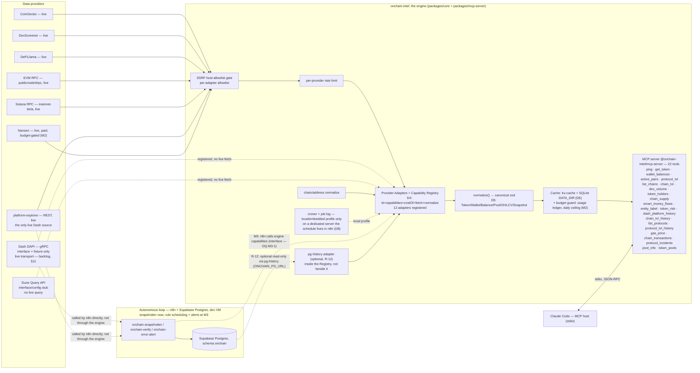

# 2. Functional architecture

> Part of [docs/ARCHITECTURE.md](../ARCHITECTURE.md).

### 2.1. Functional components

> **Use Case numbering is local to each TASK.** Every `UC-n` below is therefore qualified by the
> TASK that owns it — `TASK-006 UC-1` and `TASK-003 UC-1` are different use cases.

**Component: Chain Registry — NOW (TASK-006, R-48/R-49)**

- **Purpose:** the single source of facts about chains. It turns a chain from **code** (a literal
  repeated across five layers) into **data** (a registry row) — the same principle
  DB-SCHEMA-CONCEPT §1 already requires for assets and metrics.
- **Functions:** `resolve(input) → ChainInfo` (slug/alias/caip2 → canonical caip2; a pure function,
  no network, "did you mean" on a miss); `list(filter)` — feeds `onchain_list_chains`;
  `covered(capability, chain)` — the coverage matrix as a **derivative** of `routes` ×
  `adapter.chainSupport()`, not a second registry.
- **Related use cases:** TASK-006 UC-1 (resolving a previously unknown chain), UC-2 (discovery),
  UC-3 (soft degradation), UC-4 (operator-driven sync), UC-5 (offline gate), UC-6 (aliases →
  backward compatibility).
- **Dependencies:** depends on nothing inside the engine (pure data + pure functions).
  `Chain/Address Normalization`, `Provider Adapters` and every MCP tool schema depend on it. The
  direction never inverts — the registry knows nothing about adapters.

**Component: Chain/Address Normalization — NOW (M1, part of D5; extended by TASK-006 R-55)**

- **Purpose:** the single entry point for validating and canonicalizing addresses and chains, used
  both by MCP tool input schemas and by adapters when building a cache key. It guarantees "the same
  address in any case ⇒ the same cache key".
- **Functions:** `ChainSchema` (canonical caip2) plus `ChainInputSchema` (tool input, resolves
  aliases) — **two schemas rather than one `ethereum | solana | dash` enum**. An alias therefore
  cannot seep into the body of a canonical object, and from there into the cache key (§4.2.2). Both
  `normalizeAddress(chain, raw)` and `isValidAddress(chain, raw)` branch on **`chainInfo.family`**,
  not on a chain name — a single `evm` branch serves every EVM chain.
- **Related use cases:** TASK-006 UC-7 (validation by family), UC-6 (cache-key compatibility).
- **Dependencies:** depends on `Chain Registry`; used by `Provider Adapters` and by MCP tool input
  schemas (§5.1).

**Component: Provider Adapters + Capability Registry — NOW (M1, D4)**

- **Purpose:** hot-swappable access to external providers behind a stable internal interface
  (`id/capabilities()/costOf()/fetch()/normalize()`, D4 — including the `id` field).
- **Functions:** routing by capability **and chain** (`(capability, chain)` → an ordered list of
  adapters), free→paid priority, hot-swap fallback within a single capability (R-11, demonstrated by
  DAPI ⇄ platform-explorer), anti-corruption layer. Provider DTOs never leak outward — only through
  `normalize()` into a canonical type.
  - Input: `(capability: string, chain: Chain, args: object)`.
  - Output: `{ result: CanonicalResult, source: string, cache: 'hit'|'miss' }`, or a structured
    unavailability error (R-24).
  - Related use cases: TASK-003 UC-2 (main path), UC-3 (cache), UC-4 (hot swap).
- **Ten registered adapters** (details in §3.2): `coingecko`, `dexscreener`, `defillama`, `dune`,
  `rpc-evm`, `rpc-solana`, `dash-platform`, `platform-explorer`, `pg-history`, `nansen`. Three carry
  a deliberately narrowed status. `dash-platform` is interface + fixture contract only, with no live
  transport (the gRPC channel is a backlog item, §11). `dune` is an interface/config stub with no
  live query. `pg-history` is optional and connects only when `ONCHAIN_PG_URL` is set. `nansen` is
  the tenth and the only paid, budget-gated adapter (M2, TASK-005).
- **Dependencies:** depends on Chain/Address Normalization, Cache, the SSRF gate and the rate
  limiter; MCP tools depend on it.

**Component: Normalization → canonical zod schema — NOW (M1, D5)**

- **Purpose:** one domain vocabulary: `Token`, `Wallet`/`Balance`, `Pool`, `OHLCV` (the type is
  reserved; no tool consumes it yet), `Snapshot` (the persistent form — DB-SCHEMA-CONCEPT.md; not
  used directly by the cache DB, these are different stores).
- Provider DTOs **never** leave `normalize()` — every MCP tool sees only these types.

**Component: Cache (two-level) — NOW (M1, D6) + credit budget guard — NOW (M2)**

- **Purpose:** `lru-cache` (hot, in-process) → `better-sqlite3` (persistent, in `DATA_DIR`). Key =
  `(provider, capability, argsHash)`; TTL by data type (§3.2 table). The budget guard (the `usage`
  ledger and its daily credit ceiling) was out of scope for M1. The cache DB schema was designed so
  that `usage` could FK onto the same `providers` registry without a migration (R-14). M2 added it
  exactly there.
- Hit/miss counters are visible in two places (§5.2/§9.3): (1) a structured line on **stderr**;
  (2) a `_meta.cache` field in every tool response. That field is not part of the zod-validated
  `structuredContent`, so the output schema does not grow.

**Component: SSRF gate + rate limiter — NOW (M1)**

- **Purpose:** the single point of outbound network access. `safeFetch()` checks the hostname of the
  request, and of every redirect, against the allowlist of the **specific calling adapter**, not a
  global merged list. A bug in or compromise of one adapter therefore grants no access to another
  adapter's hosts. The shared `assertAllowedHost()` primitive is transport-agnostic by design (for
  future non-HTTP transports such as gRPC), but only `safeFetch()` uses it today —
  `dash-platform`'s gRPC channel is never created (interface + fixture contract only, §3.2).
- The rate limiter is a per-provider token bucket configured in `providers.config.ts`, in-memory
  (one process, so persistence buys nothing).

**Component: `pg-history` — read-only Postgres history adapter — NOW (M1, optional, R-12)**

- **Purpose:** implemented **as an ordinary `ProviderAdapter`** (`id: 'pg-history'`) rather than an
  ownerless client on the side, so it registers in the `providers` registry alongside the other
  nine. Without that registration, a cache row with `provider='pg-history'` would violate the FK
  `cache_entries.provider → providers(id)`. It opens a lazy SELECT-only connection (only when
  `ONCHAIN_PG_URL` is set **and** a history capability is called) to the `onchain` schema — the same
  schema n8n writes — serving `privacy.shielded_pool.history` and `platform.metrics.history`. There
  is no write path anywhere in the engine (R-12, R-27).
- It is not the only history source. `platform-explorer` serves **its own** history over its REST
  endpoints and comes first in the route (R-10, keyless, always available). `pg-history` is second
  by priority and available only when a DSN is present (route details in §3.2).

**Component: Scheduler / Snapshotter-Signals — n8n + Postgres, permanently**

- Not part of the engine, and not a temporary arrangement. Autonomous data analysis needs cron jobs
  and push notifications, and neither can live in the MCP server — that process exists exactly as
  long as a host session is open.
- The always-on loop — the snapshotter now, rule scheduling and alerts at M3 — therefore stays on
  n8n + Postgres permanently (owner decision 2026-07-25, ADR-001 D8/D9 addenda). The engine is the
  pull side and reads history through `pg-history`, read-only. The interface n8n uses to call engine
  capabilities at M3 is OQ-M3-1.
- For the local/embedded profile the design keeps `croner` plus a durable job log (D8); it is not
  built yet — the scheduler is M3 scope.

**Component: MCP server (`@onchain-intel/mcp-server`) — NOW**

- **Twenty-two registered tools**, all zod in/out and registry-routed, declared once in
  `packages/mcp-server/src/tools/tool-specs.ts` (ADR-002 D7):
  - `onchain_ping` — M0, contract unchanged (R-20).
  - M1 read layer: `onchain_get_token`, `onchain_wallet_balances`, `onchain_active_pairs`,
    `onchain_protocol_tvl`.
  - M2 paid, Nansen-backed, budget-gated: `onchain_smart_money_flows`, `onchain_entity_label`,
    `onchain_token_risk`.
  - **T-013** — `onchain_dash_platform_history`: the merged Dash Platform history
    (`privacy.shielded_pool.history` + `platform.metrics.history`), the first tool to serve more
    than one capability and the first to publish a MERGED series.
  - TASK-006 keyless, registry-backed: `onchain_list_chains` (discovery, zero network calls) and
    `onchain_chain_tvl` (chain-level TVL, DeFiLlama-backed).
  - TASK-007/008/009, free tiers: `onchain_dex_volume` (DEX volume history, DeFiLlama),
    `onchain_token_holders` (holder list, Blockscout) and `onchain_chain_supply` (native-asset
    supply, blockchain.info — BTC only today).
  - WI-49/WI-50, free tiers over the same DeFiLlama documents: `onchain_list_protocols`,
    `onchain_chain_tvl_history` and `onchain_protocol_tvl_history`. `onchain_list_protocols` returns
    the protocol POPULATION on a chain, ranked by TVL or by 1d/7d/30d growth — the tool that removes
    the need to know a slug before asking. The other two are daily TVL runs with the same
    `window`/`gapDays`/`truncated` contract `onchain_dex_volume` publishes, produced by the same
    shaper.
  - WI-51, network activity: `onchain_gas_price` (routed `rpc-evm` → `blockscout`, so a node answers
    where one is curated and the indexer covers the rest) and `onchain_chain_transactions`
    (Blockscout stats). `onchain_gas_price` uses two adapters on purpose, because L-6 was a
    single-adapter capability that died with its vendor's auth change. Active addresses are NOT
    served: no wired provider publishes an activity-scoped address count.
  - **T-014** task 014-32b, DexScreener-backed and keyless: `onchain_pool_info` (ONE pool by pair
    address — the token CONTRACT ADDRESSES `onchain_active_pairs` never returns, closing L-15) and
    `onchain_token_pools` (the pools a token trades in, per chain or as a cross-chain SAMPLE).
    Registered with stub handlers that answer a typed refusal; their logic ships in 014-32c and
    014-32d respectively.
  - WI-52, the risk layer partially: `onchain_protocol_incidents` (DeFiLlama's incident feed).
    EDITORIAL data, not on-chain — it carries its own `feedThroughTs` rather than inheriting a TVL
    number's freshness, and separates four meanings of "no incidents" so an empty list is never
    read as "safe". Developer activity and funding rounds remain unserved.
- `dash-platform` and `platform-explorer` register capabilities in the Capability Registry and are
  covered by contract tests, but neither gets a tool of its own — the Platform privacy rules (M3)
  are the first real consumer.
- **Not yet built:** `onchain_watch_add/list/remove` (M3, D3). The transport is local stdio today;
  Streamable HTTP is **T-014** (ADR-003 D1), added beside stdio behind the same transport
  abstraction (D3). The earlier M6 attribution predates ADR-003 and no longer holds.

**Related use cases (TASK-003, M1):** UC-1 (empty `.env`), UC-2 (four tools on two chains), UC-3
(cache-hit metrics), UC-4 (hot swap DAPI→platform-explorer), UC-5 (contract tests with no network).

### 2.2. Component diagram

```mermaid
flowchart LR
  subgraph SRC["Data providers"]
    CG[CoinGecko — live]
    DS[DexScreener — live]
    DL[DeFiLlama — live]
    RPCE["EVM RPC — publicnode/drpc, live"]
    RPCS["Solana RPC — mainnet-beta, live"]
    PE["platform-explorer — REST, live<br/>the only live Dash source"]
    DAPI["Dash DAPI — gRPC<br/>interface + fixture only<br/>live transport — backlog, §11"]
    DUNE["Dune Query API<br/>interface/config stub<br/>no live query"]
    NAN["Nansen — live, paid, budget-gated (M2)"]
  end

  subgraph ENGINE["onchain-intel: the engine (packages/core + packages/mcp-server)"]
    NORMCHAIN["chain/address normalize"]
    SSRF["SSRF host-allowlist gate<br/>per-adapter allowlist"]
    RATE["per-provider rate limit"]
    AD["Provider Adapters + Capability Registry<br/>D4: id+capabilities+costOf+fetch+normalize<br/>12 adapters registered"]
    NORM["normalize() → canonical zod<br/>D5: Token/Wallet/Balance/Pool/OHLCV/Snapshot"]
    CACHE["Cache: lru-cache + SQLite DATA_DIR (D6)<br/>+ budget guard: usage ledger, daily ceiling (M2)"]
    PGHIST["pg-history adapter (optional, R-12)<br/>inside the Registry, not beside it"]
    SCHED["croner + job log — local/embedded profile only<br/>on a dedicated server the schedule lives in n8n (D8)"]
    MCP["MCP server @onchain-intel/mcp-server — 22 tools<br/>ping · get_token · wallet_balances · active_pairs · protocol_tvl<br/>list_chains · chain_tvl · dex_volume · token_holders · chain_supply<br/>smart_money_flows · entity_label · token_risk · dash_platform_history<br/>chain_tvl_history · list_protocols · protocol_tvl_history<br/>gas_price · chain_transactions · protocol_incidents<br/>pool_info · token_pools"]
  end

  subgraph N8N["Autonomous loop — n8n + Supabase Postgres, dev VM<br/>snapshotter now; rule scheduling + alerts at M3"]
    WF["onchain-snapshotter / onchain-verify / onchain-error-alert"]
    PG[("Supabase Postgres, schema onchain")]
  end

  CLIENT["Claude Code — MCP host (stdio)"]

  CG --> SSRF
  DS --> SSRF
  DL --> SSRF
  RPCE --> SSRF
  RPCS --> SSRF
  PE --> SSRF
  NAN --> SSRF
  SSRF --> RATE --> AD
  DAPI -. "registered, no live fetch" .-> AD
  DUNE -. "registered, no live fetch" .-> AD
  NORMCHAIN --> AD
  AD --> NORM --> CACHE --> MCP
  SCHED -. "local profile" .-> AD
  WF -. "M3: n8n calls engine capabilities (interface — OQ-M3-1)" .-> AD
  CLIENT <-- "stdio, JSON-RPC" --> MCP

  DAPI -. "called by n8n directly, not through the engine" .-> WF
  PE -. "called by n8n directly, not through the engine" .-> WF
  WF --> PG
  PG -. "R-12: optional read-only via pg-history (ONCHAIN_PG_URL)" .-> PGHIST --> AD
```
