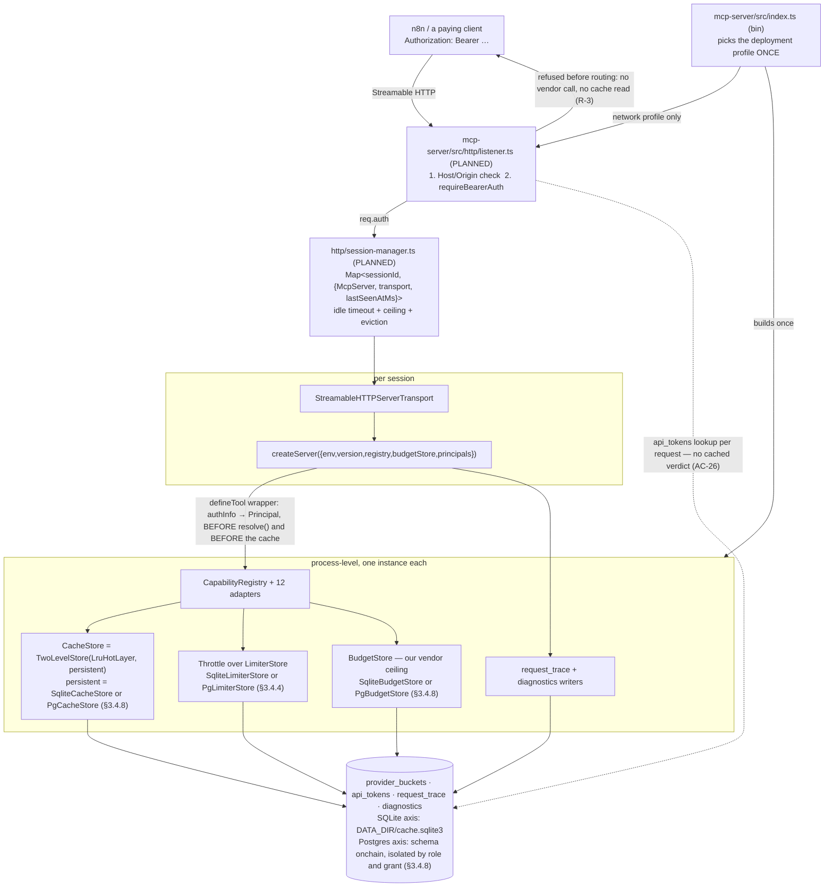

> Part of [docs/ARCHITECTURE.md](../ARCHITECTURE.md) → [system-architecture.md](system-architecture.md).
> Heading levels are the parent document's, unchanged: the section numbers are how
> every other document addresses this text.

### 3.4. T-014 — the network deployment profile

> **DESIGNED, not built (2026-08-12).** Every component in §3.4 is specified by
> [docs/TASK.md](../TASK.md) and exists in no source file yet. The process attaches stdio and
> nothing else: `packages/mcp-server/src/index.ts:166`,
> `await server.connect(new StdioServerTransport());`. Read a `PLANNED` marker in §3.4 as a
> statement about this document, and the code as the authority everywhere else.

**Two meanings of "profile", kept apart by name.** A **deployment profile** is a process mode: local
stdio or network HTTP, one per process. An **access profile** is a settings entity a token
references, many per process (`docs/tasks/task-014-t014-http-transport-auth-perimeter-profiles-shared-limiter.md:21-24`).

**Persistent state for this profile is designed in [data-model.md](data-model.md) §4.5** — eight
tables, of which §3.4 reads five: `api_tokens` and `access_profiles` (the principal),
`provider_buckets` (the shared limiter), `diagnostics` (the observable channel) and `request_trace`
(§3.4.6). This section designs the components; that one designs their rows.

**§3.4.8 additionally designs the components over the four tables the server profile carries from
the local one:** `providers`, `cache_entries`, `usage` and `usage_window` (data-model.md §4.4).

#### 3.4.1. Transport selection (R-1)

`index.ts` decides the deployment profile once, and stays the only module that names a transport
class. It is also the only module that names a storage engine (§3.4.8).

1. `main()` validates the environment and reads the deployment profile from it.
   Postcondition: an invalid value fails process start, never the first request.
2. `main()` assembles the process-level dependencies — one `CapabilityRegistry` over twelve
   adapters and one `CacheStore`, one `BudgetStore`, one `Throttle` over the limiter store.
   Postcondition: the set of dependencies is identical in every profile, and none is built twice.
   2a. `main()` reads the storage axis from the same profile value and picks each store's
   implementation (§3.4.8). Postcondition: no module below `index.ts` learns which engine it holds.
3. **Local profile:** `createServer(deps)` once, then `server.connect(new StdioServerTransport())`.
   Postcondition: no listener is opened and no token is read (R-1.3, `docs/tasks/task-014-t014-http-transport-auth-perimeter-profiles-shared-limiter.md:518`).
4. **Network profile:** an HTTP listener is opened, and each session gets its own
   `StreamableHTTPServerTransport` plus its own `McpServer` from the same factory (§3.4.2).
   Postcondition: `createServer` is called once per session and receives the same shared
   dependencies each time.

**`createServer` keeps its shape** (R-1.2): `createServer(deps: CreateServerDeps): McpServer`,
returning a server with no transport attached (`packages/mcp-server/src/server.ts:66`,
`export function createServer(deps: CreateServerDeps): McpServer {`). T-014 adds one **optional**
field to `CreateServerDeps` (§3.4.3) and no required one, so every existing call site compiles
unchanged and the factory still cannot attach a transport.

**Why the choice is a branch in `index.ts` and not two entry points.** A second `bin` would have to
repeat step 2, and a dependency assembled twice is a dependency that can be assembled differently.
The comment at `packages/mcp-server/src/index.ts:164-165`
(`// The only place a transport is chosen (D3)`) already states the rule; T-014 exercises it.

**Both transports coexist in the build; only one runs per process.** stdio is not a compatibility
shim: `e2e.stdio.test.ts` is the cheapest way to check the tool inventory, and local development
must not require a listener (ADR-003 D1).

**Transport facts measured in the installed SDK** (`@modelcontextprotocol/sdk@1.29.0`, read
2026-08-12 from `dist/esm/server/webStandardStreamableHttp.d.ts` and `.js`, and from
`dist/esm/server/streamableHttp.d.ts` and `.js`):

| Fact                                                                     | Where it is declared                                                                                                                 | Consequence for T-014                                                          |
| :----------------------------------------------------------------------- | :----------------------------------------------------------------------------------------------------------------------------------- | :----------------------------------------------------------------------------- |
| `sessionIdGenerator?: () => string` — absent means stateless mode        | `WebStandardStreamableHTTPServerTransportOptions`                                                                                    | the network profile is **stateful**: it supplies a generator (R-2.3)           |
| `onsessioninitialized` / `onsessionclosed` callbacks                     | same interface                                                                                                                       | the session map is written from these two callbacks, not from request handling |
| a request with an unknown session id is answered `404`                   | the class docstring, `Requests with invalid session IDs are rejected with 404 Not Found`                                             | R-26.2's "invalid `sessionId`" class needs no code of ours                     |
| a non-initialization request without a session id is answered `400`      | same docstring                                                                                                                       | same                                                                           |
| a stateless transport throws when reused across requests                 | `webStandardStreamableHttp.js`, `Stateless transport cannot be reused across requests.`                                              | stateless mode is not an option for a server that holds sessions               |
| `authInfo` reaches the tool callback from `req.auth`                     | `streamableHttp.js` line 131, `const authInfo = req.auth;`                                                                           | §3.4.3's threading needs no wrapper of ours                                    |
| the Node class takes the **same** options object as the web-standard one | `streamableHttp.d.ts` line 20, `export type StreamableHTTPServerTransportOptions = WebStandardStreamableHTTPServerTransportOptions;` | every row above applies to the class §3.4.2 instantiates                       |
| all three perimeter options are `@deprecated`                            | `webStandardStreamableHttp.d.ts` line 82, `:88`, `:94`                                                                               | see the deviation below                                                        |

`StreamableHTTPServerTransport` is the class the session manager instantiates, and it is a wrapper
over the web-standard one (`streamableHttp.d.ts` line 4, `This is a thin wrapper around`). The two names
therefore describe one behaviour, and the table does not need splitting per class.

**Deviation.** The three perimeter options carry three distinct deprecation notes —
`@deprecated Use external middleware for host validation instead.` (`allowedHosts`),
`@deprecated Use external middleware for origin validation instead.` (`allowedOrigins`), and
`@deprecated Use external middleware for DNS rebinding protection instead.`
(`enableDnsRebindingProtection`). R-12.3 requires `enableDnsRebindingProtection` to be set on the
transport. This document sets the three options **and** performs the same check in our own listener
ahead of them. The option satisfies AC-37 and the listener check survives the option's removal;
recorded here rather than resolved by picking one.

**Why our own check runs first, and not only the SDK's.** The SDK's check runs inside
`transport.handleRequest`, which is after bearer verification in any express ordering, and it
compares the `Host` header by exact string (`webStandardStreamableHttp.js` line 120,
`!this._allowedHosts.includes(hostHeader)`). Checking first means a request with a foreign `Host`
costs no token read; the exact-string comparison means `allowedHosts` enumerates the header forms
that are accepted, and a normalizing comparison is ours to perform.

#### 3.4.2. The session manager (R-2, R-24, R-25)

**Purpose:** hold `sessionId → McpServer` for the network profile, and remove entries by four
different causes without leaking either memory or a transport.

**PLANNED — `packages/mcp-server/src/http/session-manager.ts`.** One module, owning one
`Map<string, SessionEntry>`, where `SessionEntry` is
`{ server: McpServer; transport: StreamableHTTPServerTransport; principalId: string; createdAtMs: number; lastSeenAtMs: number }`.

**What is shared and what is per session.** The table below makes ADR-003 §"Проба принципала"
concrete against the modules that exist today.

| Object                                 | Scope                        | Why                                                         |
| :------------------------------------- | :--------------------------- | :---------------------------------------------------------- |
| `CapabilityRegistry` + twelve adapters | process                      | one route table, one adapter set; R-2.2                     |
| `CacheStore`                           | process, inside the registry | a per-session cache would end the margin model (ADR-003 D4) |
| `BudgetStore`                          | process                      | it is our ceiling at one vendor account, not a client's     |
| `Throttle` over the limiter store      | process                      | R-7; the store makes it cross-process as well               |
| chain registry                         | process                      | 458 read-only rows, indexed once at load                    |
| `McpServer`                            | **per session**              | a second `connect` on one instance is refused (probe Q2)    |
| `StreamableHTTPServerTransport`        | **per session**              | it carries that session's id and its streams                |
| `Principal`                            | **per request**              | a revoked token is refused on the next request (§3.4.3)     |

**The per-session cost is one `McpServer` and one transport.** Everything a tool reads is a
reference to a process-level object, so a session holds no copy of the registry, the cache or the
budget store. `createServer` is what constructs the pair, and it already takes those references as
parameters.

**Session lifetime — four causes of removal, one removal path.**

1. The client sends `DELETE` → `onsessionclosed` fires → the entry is removed.
2. The transport closes for any other reason → `transport.onclose` fires → the entry is removed.
3. The sweeper finds `now - lastSeenAtMs > idleTimeoutMs` → the entry is removed (R-24.2).
4. A new session arrives at the ceiling and an idle entry exists → that entry is removed (R-24.3).

Removal always closes the `McpServer` and the transport before dropping the map entry.
Postcondition: after the entry is dropped, the process holds no open stream for that session.

**`lastSeenAtMs` is written on every inbound message, not only on `tools/call`.** A client that
holds a session open with notifications is not idle, and a sweeper that judged by tool calls alone
would evict it mid-conversation.

**Idle timeout — `900_000` = the worst-case request envelope × ~2.7; measured `330_000`; applied
`900_000` as a floor to clear, not a target.** The measurement is this document's own worked example
(§3.2, "Worked example — `entity.labels`"): a cancellable part of ~60_000 ms plus a paid part of
~270_000 ms that D4 п.2 forbids cancelling. A timeout below that number evicts a session whose own
request is still running.

**The idle timeout is asserted against the manifest at startup, not trusted as a constant.** The
assertion is `idleTimeoutMs > max(manifest.deadlineMs)`; measured 2026-08-12,
`max(deadlineMs) = 60_000` over all 26 rows of `packages/core/src/capability-manifest.ts` (27 rows
since task 014-32b; the maximum is unchanged — the added row applies 15_000). The
assertion is the weaker of the two bounds and is the one a machine can check, because the paid part
is a derived envelope rather than a declared field.

**Ceiling on concurrent sessions — applied `64`; measured: none.** The per-session footprint of an
`McpServer` plus a transport has not been measured, so this number bounds memory by assertion rather
than by evidence. The first month of operation measures it and this line records the result before
the number is treated as settled. The ceiling is a narrowing setting in R-29.4's class, so moving it
to Postgres later changes no schema.

**Behaviour at the ceiling (R-24.3, AC-30) — refuse, never wait, never evict a live session.**

1. Sweep entries already past `idleTimeoutMs`. Postcondition: an abandoned session cannot deny
   service to a new one.
2. If the map is still at the ceiling, refuse the new session at the protocol level (§R-26.2's
   class: a transport status, not a tool result). Postcondition: the caller receives a named refusal
   inside its own timeout rather than a hang.
3. Write a `session.limit_reached` row to `diagnostics` (data-model.md §4.5.8). Postcondition: the
   refusal is observable to an administrator with no access to stderr (R-32.1, AC-48).

**Rejected: evicting the least-recently-used live session to admit a new one.** A live session may
hold a paid call already past its credit reservation, and dropping it spends the credit for nobody.
Refusing the newcomer costs one client a retry; evicting an incumbent costs money and an answer.

**An evicted or disconnected session does not cancel a paid call in progress** (R-17.1). The
transport closes, the fetch runs to completion, the result is written to the cache and the spend to
`usage` (R-17.2, R-17.3). The client is gone and the response is discarded — that is the accepted
consequence of D4 п.2, and it is the same path a dropped connection already takes.

**Sessions are not persisted** (data-model.md §4.5.10). A restart ends every session, and clients
re-initialize. `request_trace.session_id` and `diagnostics.session_id` are labels with no foreign
key, because the row is still readable after the session it names has ended.

**The sweeper timer is `unref`'d.** A periodic sweep that kept the event loop alive would stop the
process from exiting after the listener closes.

**Concurrent requests inside one session (R-25).** Both complete, and the order of the responses
does not change their content.

- The SDK dispatches each JSON-RPC request independently and correlates responses by `id`, so
  neither request waits for the other.
- A tool handler holds no per-session mutable state: the context it receives is a projection of
  process-level references plus this request's principal (§3.4.3).
- The one per-session field T-014 writes during a request is `lastSeenAtMs`, an unconditional
  assignment with no read-modify-write.
- The shared state two concurrent requests do touch is concurrency-safe on both storage axes:
  - the limiter's single atomic statement (§3.4.4);
  - `checkAndReserve`'s per-axis atomicity (§3.4.8);
  - the singleflight map (§3.2), which coalesces them rather than racing.

**`BEGIN IMMEDIATE` is the SQLite axis's mechanism, not the guarantee.** §3.2 states it as the
guarantee. That held while `cache.sqlite3` was the only store. §3.4.8 restates the guarantee for
Postgres, where no such file exists.

#### 3.4.3. The principal, from `authInfo` to the tool boundary (R-3, R-4, R-5, R-6)

**The engine's own type, and what it deliberately drops.** This declaration is canonical; `security.md`
§7.5.3 states the same five fields in prose.

```ts
// PLANNED — packages/mcp-server/src/auth/principal.ts
export interface Principal {
  readonly principalId: string; // api_tokens.id, or 'local' on the stdio transport
  readonly userId: string | null; // users.id; null on stdio
  readonly role: 'admin' | 'user'; // R-15.3 — decides `_meta.budget` visibility
  readonly accessProfileId: string | null; // R-13.1 — the settings the token works within
  readonly transport: 'stdio' | 'http'; // R-27.1 — written to request_trace.transport
}
```

**The field is `principalId`, not `id`.** The value is written to a column of that name
(`docs/architectures/data-model-network-state.md:479`, `principal_id        TEXT NOT NULL,`), and one name across
the boundary removes the rename.

**`transport` is a field, not a derivation.** `request_trace.transport` is declared
`NOT NULL` (`docs/architectures/data-model-network-state.md:484`, `transport           TEXT NOT NULL,`), so every
trace row needs the value at write time.

**Why it is carried rather than read from the session.** A trace row is written after the session may
already have closed (§3.4.2), and a principal on stdio belongs to no session at all.

`AuthInfo` carries the bearer secret itself (`AuthInfo.token: string`, SDK
`dist/esm/server/auth/types.d.ts`). `Principal` has no such field, and the mapping is the only place
the secret is read. R-5.3 forbids the principal on stderr and R-5.4 forbids it in `_meta`; a type
that cannot hold the secret makes the stronger half of both mechanical.

**The path, hop by hop** (each hop is a mechanism that exists in the installed SDK, not a plan):

1. `requireBearerAuth({ verifier })` reads `Authorization`, calls
   `verifyAccessToken(token) → AuthInfo`, and sets `req.auth`.
2. `transport.handleRequest(req, res)` copies it: `streamableHttp.js` line 131,
   `const authInfo = req.auth;`.
3. The SDK delivers it to the tool callback as `extra.authInfo` — probe Q1, verdict `YES`
   (`packages/mcp-server/scripts/probe-principal.mjs`, `authInfo reaches the registerTool callback`).
4. `defineTool`'s wrapper resolves it to a `Principal` and passes it in the projected context.

**The interception point is `defineTool`'s wrapper** —
`packages/mcp-server/src/tools/registry.ts:289`,
`async (input) => toCallToolResult(await definition.handler(input, project(ctx, needs))),`. It is
the only place in `src` that touches `server.registerTool`, so the hook is written once and cannot
be forgotten by the twenty-first tool.

**Why there, and not one layer down (R-4.3, R-4.4).** The cache read is **inside**
`CapabilityRegistry.resolve()` — step 3 of the gate order in §3.2, above `adapter.isAvailable()`
and above the budget gate. Three consequences follow, and they are the reason the position is a
requirement rather than a preference:

- A hook at the adapter boundary sits **below** the cache and therefore observes only misses.
- A cache hit is a billable request: both clients pay, and the second one is served from cache
  (owner decision, `docs/tasks/task-014-t014-http-transport-auth-perimeter-profiles-shared-limiter.md:601`). A hook below the cache would undercount exactly the
  requests the margin model is built on.
- R-27.2 requires the trace to record whether the answer came from cache or from a vendor. That
  distinction can only be made by something that runs before the cache and reads the result after.

**Why the unauthenticated path reaches neither (R-3.3, R-3.4).** Verification happens in middleware,
before `transport.handleRequest` is called at all, so no tool callback runs, `resolve()` is never
entered, and the `CacheStore` and `fetchImpl` counters AC-3 reads stay at zero. The refusal is a
transport status, not a tool result (R-26.2).

**The principal is resolved per request, never cached for the session's life.** AC-26 requires a
revoked token to be refused on its **next** request. A verification result held for the session
would keep a revoked token working until the idle timeout — up to `900_000` ms by §3.4.2. Accepted
cost: one indexed read of `api_tokens` per request, on the primary key of a hashed lookup
(data-model.md §4.5.4). Neither a positive nor a negative verification result is cached.

**`ToolContext` gains `principal`, and every tool declares it in `needs`** (R-4.1, R-4.2). The
context object stops being wholly process-level: `createServer` assembles the dependency half once,
and the wrapper completes it per call before `project()` narrows it. Least privilege stays a runtime
fact — a tool that did not declare `'principal'` receives an object without the key, which is what
`packages/mcp-server/src/tools/registry.ts:186` (`function project<K extends keyof ToolContext>(`)
already guarantees for `budgetStore`.

**The resolver arrives as one optional dependency.** `CreateServerDeps` gains
`principals?: PrincipalResolver`, defaulting to the stdio constant principal. That default is
`{ principalId: 'local', userId: null, role: 'admin', accessProfileId: null, transport: 'stdio' }`.

```ts
// PLANNED — packages/mcp-server/src/auth/principal.ts
export type PrincipalResolver = (authInfo: AuthInfo | undefined) => Principal;
```

**Why the parameter is `AuthInfo | undefined` and not the request.** The wrapper receives the SDK's
`extra.authInfo`, and nothing below the transport should hold a request object. `undefined` is the
stdio case, where the constant is returned.

**Why it returns rather than throws on an absent principal.** By the time the wrapper runs, step 2
of §3.4.2 has already refused every request without a valid token. A resolver that could fail here
would state a second time what the admission order already guarantees.
The role is **derived, not chosen**: UC-3 step 3 requires `_meta.budget` in the local profile
(`docs/tasks/task-014-t014-http-transport-auth-perimeter-profiles-shared-limiter.md:509`), and R-6.1 gives that field to role `admin` only.

**The constant principal belongs to stdio only, never to HTTP.** Every HTTP profile requires a token
(R-13.6), including the third combination of §3.4.8, so `transport: 'http'` never resolves to the
constant.

**`_meta` visibility is decided in one function (R-6).** A single `metaFor(principal, parts)`
assembles every `_meta` object, so R-6.4 — the rule reaching fields added later — holds by
construction rather than by review.

| `_meta` field                     | Who sees it              | Source                                               |
| :-------------------------------- | :----------------------- | :--------------------------------------------------- |
| `_meta.cache` (`status`, `ageMs`) | every principal          | part of the commercial contract, ADR-003 D4          |
| `_meta.budget`                    | role `admin` only        | it reports **our** vendor spend, ADR-003 D2          |
| `_meta.timing.overrunMs`          | every principal          | it is a fact about the caller's own request (R-16.4) |
| `tier`                            | nobody, on any transport | never added to a response at all (R-6.2, AC-7)       |

**The principal never enters the cache key** (R-5.1). `deriveArgsHash(capability, args)` keeps its
two inputs (`packages/core/src/net/args-hash.ts`), so two principals asking the same question hit
one entry. This is the same fact §3.4.5's singleflight note rests on, stated once in each place it
is load-bearing.

#### 3.4.4. The shared vendor limiter (R-7, R-8, R-9)

**What moves:** the bucket state, and nothing else.
The `Map<string, BucketState>` that `rate-limit.ts` held is replaced by a `LimiterStore` reading and
writing `provider_buckets` (data-model.md §4.5.6).

**Applied by task 014-18.** The map did not disappear — it moved behind the interface as
`createInProcessLimiterStore` (`packages/core/src/net/limiter-store.ts:164`), because R-7.7 degrades
to exactly that bucket and deleting it would have meant writing it again for 014-19. `createThrottle`
builds it when no store is injected, so a call site that changes nothing keeps today's behaviour.

**What does not move.**

- The signature: `packages/core/src/net/rate-limit.ts:52`, `export type Throttle = (` keeps
  `(providerId, config, weight?, deadlineAtMs?) => Promise<void>` (R-7.5).
- The three refusal classes (R-7.6): `RateLimitRejectedError` (misconfiguration or a saturated
  bucket), `DeadlineExceededError` (our time is up for every adapter), `DeadlineWouldExceedError`
  (not through this bucket — ask the next provider).
- The two numbers (R-9.2): `MAX_WAIT_MS = 30_000`
  (`packages/core/src/net/rate-limit.ts:67`) and `MIN_POST_WAIT_REMAINDER_MS = 5_000`
  (`packages/core/src/net/rate-limit.ts:120`).
- The wait itself: a caller sleeps in its own process. Only the accounting is shared.

**The key is `(providerId, scopeKey)` and the provider declares the scope** (R-7.3). Absent, the
value stored is `''` — one bucket per provider (R-7.4, AC-40). `rpc-evm` is the only declarant, with
the chain slug (R-7.4a, AC-42).

**How the scope reaches the limiter, as applied by task 014-17.** This section proposed
`TokenBucketConfig`; what shipped composes the scope INTO the first argument — `scopedProviderId`
and `limiterKeyOf` (`packages/core/src/net/limiter-store.ts`), so `rpc-evm` calls
`throttle(scopedProviderId('rpc-evm', chain.slug), RATE_LIMIT, 1, deadlineAtMs)` and the store
splits the pair back out. Both routes satisfy R-7.3, and data-model.md §4.5.6 says as much: "the
field's name is the interface designer's choice; the storage key is `(provider, scope_key)` either
way". The composed id was chosen because widening `TokenBucketConfig` would have edited every
declaration of a per-provider rate to express a fact concerning one provider. The separator is `#`,
which appears in no adapter id and no CAIP-2 slug, so the composition is injective.

**The injection point is preserved and is already gated** (R-8.1). Ten adapters import the limiter
and resolve it through `deps.throttle ?? productionThrottle` at eleven sites — nine adapter modules
plus `nansen`'s `endpoints.ts:133` and `budget-gate.ts:417` (measured 2026-08-12). WI-26 built that
dependency injection point. `packages/core/test/throttle-seam.test.ts` requires it of any adapter
importing the limiter, so a regression here fails a test that already exists.

**What changes at the production call site.** Today an adapter falls back to the module singleton
(`packages/core/src/net/rate-limit.ts:445`, `export const throttle: Throttle = createThrottle();`),
which is built at import time and therefore cannot know the deployment profile. `index.ts`
constructs one `Throttle` over the profile's store and threads it into the ten adapter factories —
the shape `budgetStore` already has. The injection point is unchanged. What changes is that
production stops taking the default.

**The ordering was a safety condition rather than a preference.** 014-18 shipped both stores and the
interface between them, and left production on the in-process bucket. The degradation block below
owes three things: `emit`, the per-call timeout and the cooldown. A process wired to a shared store
without them turns a Postgres hiccup into a service outage — the alternative this section rejects
two paragraphs down.

**Applied by task 014-19.** `index.ts` resolves the storage axis through `createStateStores`, builds
ONE `Throttle` over its limiter with the degradation port on top, and threads it into the ten
adapters that throttle. `packages/mcp-server/test/limiter-wiring.test.ts` is the gate. Membership is
derived from which adapters declare the seam, so an eleventh fails on the day it is written. One
behavioural case proves the handed limiter is the one a capability walk actually reaches.

**The same commit moved the cache and the credit ledger onto the axis, and that was a defect rather
than a refinement.** The entry point took `createCacheStore`/`createBudgetStore` unconditionally —
the SQLite pair — so a `network` process kept `cache_entries` and `usage` in a local file while
migration 002 had created both in Postgres and nothing wrote there. Two such processes each held the
full daily Nansen cap. Filed as L-17.

**The concurrency guarantee is restated, not preserved.** `createThrottle`'s docstring rests on
"refill + consume + decide is one wholly SYNCHRONOUS step", which is a property of a `Map` in one
event loop. With a store the decision includes a round trip, so the guarantee moves into the single
`INSERT … ON CONFLICT DO UPDATE … RETURNING` statement (data-model.md §4.5.6). Two consequences
follow, and both are testable:

- **The clock sample must be taken after the store returns, not before.** Today the whole decision
  reads one `nowMs` taken before any work. A sample taken before a round trip is stale by that round
  trip's duration, and it feeds `remainingMs`, which decides `DeadlineWouldExceedError`.

  **Applied as TWO samples, not one moved.** The bucket still gets the instant taken before the
  call, because refill, spend and the wait they imply must read one sample or the arithmetic
  contradicts itself. The deadline gets a second, read after the store answers.

  Pinned by `limiter-cross-process.test.ts`, "the deadline is decided against a clock read AFTER the
  store answered". A store that consumes 2 000 ms of a 6 000 ms budget must refuse a 500 ms wait,
  and does not under the single-sample reading.

- **The post-wait re-check keeps its reason and gains a second one.** It exists because a timer may
  fire late (`packages/core/src/net/rate-limit.ts:387-398`); with a shared bucket the wait can also
  be wrong because another process consumed the tokens this one was waiting for.

**Degradation on storage failure (R-7.7, AC-45).**

1. Every store call carries its own timeout, bounded so that a failing store cannot consume the
   caller's post-wait floor: applied `1_000` ms, one fifth of `MIN_POST_WAIT_REMAINDER_MS`.
   Postcondition: a store failure costs the caller less time than the floor it must still clear.

   **A hang is the failure a `try`/`catch` does not cover, and it is the one this bound exists for.**
   A throwing store costs a caller nothing; a store that never answers parks every throttling call
   in the process for the length of the outage. The deadline is injectable
   (`ThrottleDeps.storeTimer`), so the mechanism is measured without a real timer. It is cancelled
   on every path: a leaked timer per call would be a slow leak in the hottest path this module
   has.

2. On failure the process falls back to an in-process bucket at the **declared** ceiling for that
   provider. Postcondition: the call is neither admitted unlimited nor refused.
3. The process writes one `limiter.degraded` row to `diagnostics` (data-model.md §4.5.8).
   Postcondition: degradation is observable without stderr access.

   **The writer is injected, because the limiter cannot reach it.** `throttle` lives in
   `packages/core/src/net/rate-limit.ts`, and the diagnostics writer lives in `mcp-server` — the
   package `packages/core` is forbidden to know about (`security.md` §7.5.1). `ThrottleDeps`
   (`packages/core/src/net/rate-limit.ts:13`) gains one optional field:

   ```ts
   // PLANNED — packages/core/src/net/rate-limit.ts
   readonly emit?: (event: 'limiter.degraded', detail: Record<string, unknown>) => void;
   ```

   **Why a narrow port and not the store interface.** The event names a fact about this process, not
   a row the limiter owns. A port of one method keeps `core` unable to name a table, a principal or
   a connection.

   **Why the field is optional.** Omitted, the limiter degrades exactly as it does today and writes
   nothing. `createThrottle()` is called with no arguments at
   `packages/core/src/net/rate-limit.ts:409`, and every existing test constructs it the same way.

   **Why it is `void` and not a promise.** Degradation is already the slow path, and awaiting a
   write here would add the store's latency to a call that just failed to reach a store. The sink
   owns its own buffering.

   **Consequence for `limiter.degraded` on the local profile.** Nothing supplies `emit` on stdio, so
   the event exists only where a reader for it does. R-19.2 scopes the stored channel to the network
   profile.

4. The process stops calling the store for a cooldown before retrying — applied `60_000` ms,
   measured: none. Postcondition: a store outage is not paid for once per call by every caller.

   **What it costs, stated rather than left to be discovered.** Up to a minute of per-process
   limiting after the store has recovered. That is the same direction as degradation itself, so the
   cooldown widens a window already accepted and opens no new kind of hole.

   **Recovery is not a step.** The degraded mark is an instant, and an instant in the past is not
   degradation, so the first call after the cooldown simply speaks to the store again. There is no
   recovery EVENT: `DIAGNOSTIC_EVENTS` is closed behind a `CHECK` (`data-model.md` §4.5.8) and has
   no member for one, so a return to shared state is visible only as `limiter.degraded` rows
   stopping. Recorded as a residual rather than taken, because widening that vocabulary is a schema
   change four other writers share.

   **The event is announced on the TRANSITION, not on every degraded call**, or an outage would
   write a row per request and drown the eight events §4.5.8 declares. A second event follows only
   after the cooldown expires and the retry fails again, which is a new fact: the outage continues.

**What degradation buys, stated exactly.** Each process holds itself to the declared ceiling. The
**sum** across processes may exceed it.

**Why this beats both rejected alternatives** (`docs/tasks/task-014-t014-http-transport-auth-perimeter-profiles-shared-limiter.md:115-120`). Skipping the limit moves
spend onto the paid fallback provider. Refusing the call turns a store outage into a service outage.

**How a deadline ends a wait (R-9.1, AC-21).** The wait is refused before it starts, never aborted
part-way through.

1. The store computes `waitMs` from the bucket deficit
   (`packages/core/src/net/limiter-store.ts:98`, `export function waitMsFor(tokensLeft, refillPerSec)`).
   Postcondition: with a shared bucket that deficit includes other processes' consumption.
2. A wait that would leave less than `MIN_POST_WAIT_REMAINDER_MS` is refused
   (`packages/core/src/net/rate-limit.ts:652`, `if (remainingMs - waitMs < MIN_POST_WAIT_REMAINDER_MS) {`).
   Postcondition: the caller leaves the limiter on its own deadline rather than on `MAX_WAIT_MS`.
3. After `await wait(waitMs)` the same test runs against a fresh clock sample
   (`packages/core/src/net/rate-limit.ts:684`, `const observedRemainingMs = deadlineAtMs - now();`).
   Postcondition: a wait that overran its prediction is refused rather than issued.

**Why two principals on one bucket receive different verdicts.** Step 2 reads this caller's
`deadlineAtMs` against the shared deficit, so the shorter deadline is refused first. R-9.1 needs no
new mechanism; the store changes only which deficit step 1 reads.

**No queue between waiters** (R-9.3, owner decision). Accepted consequence: waiters wake
independently, in one process and across processes, so an active tenant can outpace a quiet one.
With one token in phase 0 the case is unreachable.

**The refusal names the remainder and the ceiling** (R-9.4). R-31 splits the rendering: that text is
the operator one, and the client rendering carries neither the provider walk nor operator numbers.

**An earlier revision of this paragraph read the requirement against the wrong pair, and task 014-20
corrected it.** It said `DeadlineWouldExceedError`'s message "already does" — that message named the
DEADLINE's remaining milliseconds and the post-wait floor. R-9.4's «остаток и потолок» are the
LIMITER's, as the rendering table in task 014-20 spells out: the tokens the bucket has left and the
ceiling it refills to. The two readings are not close. The deadline pair is a fact about this
caller's own budget, and it was already on the wire-safe side of the split. The bucket pair is a fact
about shared state: it is the one an operator needs, and the one AC-47 must keep off the wire.

**Applied.** `LimiterBucketState` (`packages/core/src/net/rate-limit.ts:223`) carries
`{remaining, ceiling, refillPerSec}` on both limiter refusals, as a field and through one renderer
(`renderBucketState`, line 233) so the two say it identically. The rate joins the two numbers the
requirement names because a remainder without one does not convert into a duration: −40 against 2/s
is twenty seconds and against 0.05/s is thirteen minutes.

**Why the pair is on the refusal at all, now that the bucket is shared.** Before T-014 a saturated
bucket was a fact about one process and an operator could reproduce it by looking at that process.
With two sessions against one row, "the wait was 40 s" cannot distinguish a bucket configured too
tight from a bucket another tenant drained — and those call for opposite responses.

**The two misconfiguration refusals carry no bucket, and absence is not "unknown".**
`refillPerSec <= 0` and an unsatisfiable `weight` are refused before any bucket is read, so there is
no state to report; inventing one would describe a bucket nobody looked at.

#### 3.4.5. Where the network profile changes an existing invariant

Six claims elsewhere in this document were true of a one-session local process. Each is corrected
in place; this table is the index of those corrections.

| Claim                                                                          | Where it was stated                                     | What T-014 makes of it                                                                          |
| :----------------------------------------------------------------------------- | :------------------------------------------------------ | :---------------------------------------------------------------------------------------------- |
| singleflight coalesces one client's duplicate calls                            | §3.2, "Singleflight (R-39) is deliberately per-process" | it now coalesces two principals' identical calls; both pay                                      |
| refill + consume + decide is wholly synchronous                                | §3.2, `net/rate-limit.ts` code block                    | atomicity moves into one SQL statement (§3.4.4)                                                 |
| single-process, in-memory rate limiter                                         | [ARCHITECTURE.md](../ARCHITECTURE.md) §8                | corrected there 2026-08-12; §8 now names the store, the fallback bucket and the session ceiling |
| `checkAndReserve` is atomic because `BEGIN IMMEDIATE` wraps a synchronous body | §3.2, "Cross-process contract"                          | the guarantee is restated per storage axis (§3.4.8)                                             |
| the hot and the persistent layer are written together                          | §3.2, `TwoLevelStore` promotion note                    | on Postgres, several hot layers stand over one table (§3.4.8)                                   |
| every cache access writes one stderr line                                      | §3.2, "Hit/miss counters"                               | the line becomes level-gated (§3.4.10)                                                          |

#### 3.4.6. Open questions raised by this section

**OQ-T014-SA-1 — CLOSED, 2026-08-13, owner Sergey: a singleflight follower records
`served_from = 'coalesced'`.** Rejected: folding the follower into `'vendor'` or `'cache'` — either
value loses the count T-015 charges from.

**Why.** One vendor call served two charged requests. That number is what T-015 reconciles against
`usage`, and neither neighbouring value carries it.

**Consequences, three, each verifiable.**

1. The follower's `vendor_credits` and `vendor_calls` are both `NULL`. Its `vendor_provider` names
   the leader's provider. Postcondition: `sum(vendor_credits)` per provider still reconciles
   against `usage` (`docs/architectures/data-model-network-state.md:422`,
   `row carries no vendor spend of its own`).
2. A per-principal charge query counts `'coalesced'` beside `'cache'` and `'vendor'`.
   Postcondition: no client is billed less for having arrived second.
3. The value admits an operator query for coalescing rate, which no other column answers.

**Why the follower's `vendor_credits` is `NULL` and not `0`** (owner decision, 2026-08-13). Zero
asserts that the spend was measured and came to zero. That is false: the spend sits on the leader's
row. `NULL` states that no spend is attributable here. A missing measurement that reads as a
confident zero is the defect class L-10 records.

**The `served_from` CHECK constraint already admits this value**
(`docs/architectures/data-model-network-state.md:395`,
`CHECK (served_from IN ('cache','coalesced','vendor','none')),`). No widening is outstanding.

**OQ-T014-SA-2 — is the session ceiling global, or per principal?** Blocks: admitting a second
paying client. Owner: Sergey. §3.4.2 designs one global ceiling, which one greedy client can occupy
entirely. A per-principal sub-ceiling is the same mechanism with a second key and is not designed
here, on the same YAGNI grounds R-9.3 uses for limiter fairness.

#### 3.4.7. Component diagram — the network deployment profile



#### 3.4.8. The storage axis — which store implementation each profile builds (R-7, R-34, R-35)

**Transport and storage are two independent axes** (owner decision, 2026-08-13). Transport is stdio
or Streamable HTTP. Storage is SQLite or Postgres. A deployment profile is a named combination of
the two.

| Profile name     | Transport       | Storage                    | Purpose                                  |
| :--------------- | :-------------- | :------------------------- | :--------------------------------------- |
| `local`          | stdio           | SQLite in `DATA_DIR`       | the shipped local mode (UC-3)            |
| `network`        | Streamable HTTP | Postgres, schema `onchain` | the shipped server mode                  |
| `network-sqlite` | Streamable HTTP | SQLite in `DATA_DIR`       | debugging the transport without Postgres |

**Why the third combination exists.** The owner debugs HTTP on the development machine before
`.mcp.json` is switched over. Requiring Postgres for that is a cost with no purpose.

**The engine writes its tables into the snapshotter's schema `onchain`** (owner decision
2026-08-12, reversing `OQ-T014-DEP-1`). The engine receives no schema of its own.

**Isolation is by role and grant, inside that one schema.** `deployment.md` §10.5.1 enumerates the
two roles and their table privileges. `security.md` §7.3 states which tables the read DSN may reach.

**The three names are values of one key, and `deployment.md` §10.3 owns that key.** Its row lists
all three (`docs/architectures/deployment.md:194`, ``| `ONCHAIN_PROFILE`                  | bootstrap |``).

**Why a third profile name rather than a second key.** Two keys make the fourth combination —
stdio over Postgres — settable, and this document designs no such mode.

**Profile `network` fails process start when its write DSN is unset.** The key is
`ONCHAIN_STATE_PG_URL` (`deployment.md` §10.3, `read-write DSN for the engine's own state`).
Postcondition: a missing or misspelled DSN never selects the SQLite axis.

**Why the guard rather than a fallback.** A downgrade with no refusal would put the server's tokens,
traces and spend ledger in a local file, and every gate would report success (L-10).

**The two shipped profiles are never run concurrently against the same vendor credentials** (owner
operating constraint, 2026-08-13). The owner switches `.mcp.json` from stdio to HTTP rather than
running both.

**Consequence for AC-4.** The criterion scopes to two processes of the **same** profile over one
store: two `network` processes on one Postgres, or two `local` processes on one `DATA_DIR`. This
closes `OQ-T014-DM-1` (`data-model.md` §4.5.11).

**What the storage axis selects, component by component.**

| Component                    | SQLite axis                                    | Postgres axis                              | Interface it satisfies                         |
| :--------------------------- | :--------------------------------------------- | :----------------------------------------- | :--------------------------------------------- |
| `CacheStore`                 | `TwoLevelStore(SqliteCacheStore, LruHotLayer)` | `TwoLevelStore(PgCacheStore, LruHotLayer)` | `packages/core/src/adapters/cache-store.ts:25` |
| `BudgetStore`                | `SqliteBudgetStore`                            | `PgBudgetStore`                            | `packages/core/src/cache/budget-store.ts:46`   |
| `LimiterStore`               | `SqliteLimiterStore`                           | `PgLimiterStore`                           | §3.4.4, `data-model.md` §4.5.6                 |
| identity, trace, diagnostics | `Sqlite*` writers                              | `Pg*` writers                              | `data-model.md` §4.5                           |

**Both existing interfaces are already asynchronous, so the Postgres axis adds implementations and
changes no signature.** `CacheStore.get` returns `Promise<CacheGetResult | undefined>`
(`packages/core/src/adapters/cache-store.ts:26`, `get(provider: string, capability: string, argsHash: string)`),
and every `BudgetStore` method returns a promise
(`packages/core/src/cache/budget-store.ts:63`, `checkAndReserve(`).

**The `Promise` was declared for this case and says so.** `packages/core/src/cache/budget-store.ts:17`
names a `future Postgres-backed implementation`. `CapabilityRegistry` already awaits both.

**The network profile opens a SECOND Postgres client, write-capable.** `pg/read-client.ts` refuses
any non-`SELECT` statement at runtime (`packages/core/src/pg/read-client.ts:63`,
`const SELECT_ONLY_RE = /^\s*select\b/i;`, enforced at
`packages/core/src/pg/read-client.ts:347`, `if (!SELECT_ONLY_RE.test(sql)) {`).

**Why a second client and not a widened one.** Both clients name schema `onchain`. The read client
must stay unable to write to it. Two clients means two DSNs and two roles. The two roles hold
different table grants (`deployment.md` §10.5.1).

##### `TwoLevelStore` — which half moves, and what the split then guarantees

**Only the persistent half moves.** `TwoLevelStore` takes its persistent layer by constructor
injection (`packages/core/src/cache/two-level-store.ts:41-44`,
`private readonly persistent: CacheStore,`), so the Postgres axis constructs the same class over a
different second argument.

**The hot layer stays in process on both axes.** `LruHotLayer` is memory, and a shared hot layer
would need a network round trip per lookup, which is the cost the layer exists to avoid.

**The split's guarantee is restated, not preserved.** In one process a value is written to both
layers by one `set()` call (`packages/core/src/cache/two-level-store.ts:87`,
`await this.persistent.set(provider, capability, argsHash, value, ttlSecondsOverride);`). Across two
processes over one Postgres table, each process holds its own hot layer.

1. A value written by process A is invisible to process B's hot layer until B's own entry expires.
   Postcondition: B may serve an older value than A holds.
2. That staleness is bounded by the capability's TTL, which already bounds a single process's hot
   hit (`packages/core/src/cache/two-level-store.ts:95`,
   `(ttlSecondsOverride ?? ttlFor(capability)) * 1000,`). Postcondition: no answer is older than the
   TTL table of §3.2 permits.
3. `_meta.cache.ageMs` stays the age of the value, not the age of the entry, because a promoted
   entry is back-dated (`packages/core/src/cache/two-level-store.ts:70`,
   `Date.now() - coldHit.ageMs,`). Postcondition: a client can tell how old the answer is.

**Why a shared hot layer is not the fix.** The freshness contract already tolerates a full TTL of
staleness, so the second hot layer costs nothing the contract did not already permit.

##### `checkAndReserve` on the Postgres axis — where the atomicity lives

**The SQLite guarantee rests on a synchronous transaction body.**
`packages/core/src/cache/budget-store.ts:420` (`return attempt.immediate();`) wraps a read, a
comparison and a write that never await. The class docstring records that a Postgres implementation
doing real I/O between the read and the write forfeits it
(`packages/core/src/cache/budget-store.ts:295-298`, `a future Postgres`).

**On Postgres each statement is a round trip, so the comparison moves into the statement.** This is
the same restatement §3.4.4 performs for the limiter, applied to the money gate.

1. The daily reservation is one conditional upsert, refusing by returning zero rows.

```sql
INSERT INTO onchain.usage (provider, day, credits_used, updated_at)
SELECT $1, $2, $3, $4 WHERE ($5 IS NULL OR $3 <= $5)
ON CONFLICT (provider, day) DO UPDATE SET
  credits_used = onchain.usage.credits_used + $3,
  updated_at   = $4
WHERE ($5 IS NULL OR onchain.usage.credits_used + $3 <= $5)
RETURNING credits_used;
```

`$3` is `cost`, `$5` is `ceiling`. Postcondition: zero rows returned means nothing was written.

**The statement above is the canonical text of the Postgres `checkAndReserve`.** `data-model.md`
§4.2.4 references this block rather than restating it.

**Why a single text.** A restatement may omit the `$5 IS NULL` branch. A ceiling of `off` then
compares as `… <= NULL`. That comparison yields `NULL`, the statement returns zero rows, and every
reservation is refused.

2. The velocity counters are a second statement of the same shape against `usage_window`, adding
   `calls_made + 1 <= $maxCalls`. Postcondition: a zero-cost call is still bounded (Q-3).
3. Both statements run on **one** checked-out connection inside one `BEGIN` / `COMMIT`. A zero-row
   result from either rolls back. Postcondition: the two counters never disagree (SEC-1).

**Why the `WHERE` clause is repeated on the insert branch.** `ON CONFLICT DO UPDATE ... WHERE`
governs the conflict branch alone. Without the guarded `SELECT` source, the first call of a day
would reserve a cost larger than the whole ceiling.

**Why the arithmetic reads the table and not a value this process read earlier.** Both branches name
`onchain.usage.credits_used`, which is the row version the statement itself locked. A
concurrent transaction blocks on that lock and re-evaluates against the committed value.

**Why `SERIALIZABLE` is not required.** The conditional upsert takes the row lock it needs, so
`READ COMMITTED` — the `pg` default — already serializes two reservations on one key.

**An unlimited ceiling is bound as `NULL`, which is why both branches above read
`($5 IS NULL OR … <= $5)`.** `+Infinity` is the declared "no self-imposed ceiling" sentinel
(`packages/core/src/cache/budget-store.ts:326`, `may legitimately be`) and has no Postgres numeric
representation.

**The parameter is bound on every call and never omitted.** A `NaN` ceiling or a non-finite cost
refuses before any statement is issued, the rule the SQLite store already applies
(`packages/core/src/cache/budget-store.ts:334`, `if (!Number.isFinite(cost) || Number.isNaN(ceiling)) {`).

**Why an absent binding must not read as unlimited.** A parameter that could be omitted would make
"no ceiling" the value of a mistake rather than of a decision (L-10).

**The refusal message needs `used`, which a zero-row result does not carry.** On refusal the store
issues one extra read of `credits_used` for the message alone.

**Why that read cannot widen the gate.** The decision was already made by the statement, and nothing
was written; the read only fills the three numbers the operator text names today
(`packages/core/src/cache/budget-store.ts:346`, `budget exceeded for provider=`).

##### `PgCacheStore`, `PgBudgetStore` and what each does at construction

1. `PgCacheStore.get` is one `SELECT` filtered on `expires_at`, and a stale row is deleted on the
   same path the SQLite store deletes it. Postcondition: an expired entry is never served.
2. `PgCacheStore.set` is the upsert of §3.2 on `(provider, capability, args_hash)`, with
   `excluded.*` in the update branch. Postcondition: a recomputed value replaces the stale one.
3. The expired-row sweep stays counter-based and indexed, as on SQLite. Postcondition: no timer runs
   inside the server process.
4. `PgBudgetStore` upserts the twelve `providers` rows at construction and runs **no DDL**.
   Postcondition: the FK target exists before the first `usage` write, and the server process
   creates no object in a shared database.

**Why the server process is forbidden DDL while the SQLite axis runs `CACHE_DDL`.** A shared
Postgres server is not this process's to alter; the numbered migration file is the only writer of
schema (`data-model.md` §4.4 item 2).

**Failure behaviour differs per store, and each one is already decided elsewhere.**

| Store              | On a storage failure                                       | Recorded where                                |
| :----------------- | :--------------------------------------------------------- | :-------------------------------------------- |
| `LimiterStore`     | falls back to an in-process bucket at the declared ceiling | §3.4.4, R-7.7                                 |
| `BudgetStore`      | fails closed — the paid call does not proceed              | §3.2, "Fail-closed, never fail-open"          |
| `CacheStore` read  | treated as a miss                                          | `packages/core/src/adapters/registry.ts:1165` |
| `CacheStore` write | best-effort; the result is still returned                  | `packages/core/src/adapters/registry.ts:1242` |

**When the failing store IS the diagnostics store, the event goes to stderr alone.** A
`diagnostics` row written into the database that just refused a write would be lost, and the process
would report nothing at all.

#### 3.4.9. The access profile — where its tool list is applied (R-13.1, R-14, AC-25)

**Definition.** An access profile is a settings entity a token references, holding
`creditsBalance`, `rateLimit` and `toolAllowlist` (R-13.7, ADR-003 D5).

**Its values are read through one interface, never from storage directly** (R-13.2). The reader is
asynchronous from the first day (R-13.3) and is declared in `security.md`. §3.4.9 designs one
consumer of it: the tool inventory.

**The application locus is registration time, once per session.** `createServer` loops over
`toolSpecs` (`packages/mcp-server/src/server.ts:195`, `for (const spec of toolSpecs) {`), and §3.4.2
calls that factory once per session. The loop skips a spec whose name the profile does not allow.

**Why registration time and not per request.** One `McpServer` per session is what makes a
per-session inventory possible.

**What a single shared instance would cost.** `tools/list` would be a process-level fact, and
narrowing would need a second mechanism the SDK does not offer.

**Why the principal is available there.** Bearer verification runs in middleware before
`transport.handleRequest` (§3.4.3), so the initialization request carries `req.auth` and the session
is created with its principal already resolved.

**The narrowing is an intersection, and intersection is the reason it cannot add** (R-14.1). The
applied set is `profile.toolAllowlist ∩ toolSpecs`.

1. A name in the profile that no spec carries selects nothing. Postcondition: `tools/list` is always
   a subset of the process inventory.
2. `tool_allowlist_mode = 'all'` skips the intersection entirely (`data-model.md` §4.5,
   `TEXT tool_allowlist_mode "all / list"`). Postcondition: phase 0 narrows nothing (R-14.4).
3. Two narrowings compose and neither widens: the profile decides **which** tools are registered,
   and `needs` decides **what** each registered tool receives (R-14.2,
   `packages/mcp-server/src/tools/registry.ts:186`, `function project<K extends keyof ToolContext>(`).

**Titles and descriptions never come from the profile** (R-14.3). The allowlist is a list of names,
and `title` and `description` are read from the tool definition
(`packages/mcp-server/src/tools/registry.ts:437`, `server.registerTool(`).

**AC-25 is then two assertions over one mechanism.** A narrowing profile yields fewer tools, and the
texts of the surviving tools are byte-identical to the unnarrowed run.

**Consequence for the frozen snapshot and RISK-3.** AC-2 compares `tools/list` against the inventory
derived from `toolSpecs` (`packages/mcp-server/test/e2e.stdio.test.ts`). That comparison holds only
while every profile in phase 0 narrows nothing.

1. Phase 0 ships every access profile at `tool_allowlist_mode = 'all'`. Postcondition: the snapshot
   has one expected value, and RISK-3's "edited without justification" case cannot arise.
2. The stdio principal carries `accessProfileId: null` (§3.4.3), so the spawn suite reaches no
   profile at all. Postcondition: AC-2's gate is unaffected by this section.
3. When narrowing is first used, the process inventory stays the authority and the per-profile list
   becomes a subset assertion against it. Postcondition: two clients cannot disagree about what the
   process serves.

**A session keeps the inventory it was registered with.** An allowlist edited mid-session reaches
that session on its next initialization.

**Why that is bounded rather than open-ended.** A session ends at the idle timeout of §3.4.2 —
applied `900_000` ms — and revocation closes it at once (`security.md` §7.5.2).

#### 3.4.10. The stderr inventory and its fate on the HTTP transport (R-19.1, R-19.2)

**Inventory, measured 2026-08-13.** Twenty-six call sites write to the process stderr across
`packages/core/src` and `packages/mcp-server/src` — twenty-three `process.stderr.write` and three
`console.error`. Command:
`grep -RnE --include='*.ts' "process\.stderr\.write\(|console\.error\(" packages/core/src packages/mcp-server/src`,
minus two matches inside comments — `packages/core/src/net/safe-fetch.ts:75` and
`packages/core/src/adapters/nansen/budget-gate.ts:671`.

**Why the two are named rather than only counted.** A re-measurement that returns 28 and finds no
list of what to subtract reads as drift from 26, and the reader re-derives the subtraction by hand.

| Site or group                                                                            | Count | Volume characteristic                                             | Fate on HTTP                |
| :--------------------------------------------------------------------------------------- | :---- | :---------------------------------------------------------------- | :-------------------------- |
| `packages/core/src/cache/stats.ts:45`                                                    | 1     | one line per cache access, so at least one per request per client | level-gated, off by default |
| `packages/core/src/adapters/registry.ts:821` and eight cache get/set/merge failure sites | 9     | one per store failure, merge failure or route-policy throw        | container log               |
| `packages/core/src/pg/read-client.ts:392`, `:398`, `:435`                                | 3     | one per pool construction, idle-pool or query failure             | container log               |
| `packages/core/src/adapters/nansen/budget-gate.ts:525`, `:685`                           | 2     | one per `/account` resync; one per threshold crossing per bucket  | container log               |
| `packages/core/src/adapters/nansen/reconcile.ts:89`, `:108`, `:117`                      | 3     | one per degraded reconciliation                                   | container log               |
| `packages/core/src/adapters/nansen/normalize.ts:260`, `:267`                             | 2     | one per response carrying dropped rows                            | container log               |
| `packages/core/src/adapters/nansen/index.ts:741`                                         | 1     | one per ledger-write failure after a paid call                    | container log               |
| `packages/core/src/adapters/dexscreener/index.ts:248`                                    | 1     | one per response carrying malformed pairs                         | container log               |
| `packages/core/src/adapters/blockscout/index.ts:937`                                     | 1     | one per response carrying unusable holder rows                    | container log               |
| `packages/mcp-server/src/env.ts:158`, `:176`                                             | 2     | at most one per process start                                     | container log               |
| `packages/mcp-server/src/index.ts:172`                                                   | 1     | at most one per process, on a fatal error                         | container log               |

**Twenty-five of the twenty-six keep stderr as their only channel** (R-32.1). On HTTP that stream is
the container log, which the operator reads and the client does not.

**None of the twenty-six becomes a `diagnostics` row.** The eight compiled events of
`data-model.md` §4.5.8 are all written by code T-014 adds; no existing line matches one.

**Why that is a finding rather than a gap.** R-32.2 stores the events that need storage, and a
best-effort cache-write failure is read by the operator of the process that failed, not by an
administrator over SQL.

**One line is gated, and it is the only one whose volume scales with traffic**
(`packages/core/src/cache/stats.ts:45`, `process.stderr.write(`). It is emitted only when
`LOG_LEVEL` is `debug`.

1. `LOG_LEVEL` already exists and has no reader (`packages/mcp-server/src/env.ts:47`,
   `LOG_LEVEL: emptyAsUndefined(z.enum(['debug', 'info', 'warn', 'error']).optional()),`). R-19.2
   gives it its first one. Postcondition: no settings key is added, and the §10.2.1 gate sees a key
   the table already carries.
2. The same fact survives in two other channels: `_meta.cache` in the response, and
   `request_trace.served_from` plus `cache_age_ms` in the ledger. Postcondition: gating the line
   loses no fact.
3. `packages/core/test/cache-stats.test.ts:34` (`expect(stderrSpy).toHaveBeenCalledTimes(1);`)
   asserts the line today. It becomes an assertion at level `debug`, plus one that the default level
   writes nothing. Postcondition: the gate follows the behaviour rather than lagging it.

**Why gating rather than deleting.** The line is the only per-access record that survives a process
with no database reachable, which is the state in which the store failures above are diagnosed.

**Retention of the stored channel runs outside this process** (R-32.3, owner decision 2026-08-13):
an n8n workflow beside the snapshotter, never a timer in the server. `deployment.md` owns its
description.

#### 3.4.11. Module-level mutable state — the complete census

**Scope of the count:** every module-level binding in `packages/core/src` and
`packages/mcp-server/src` that is mutated after import. Measured 2026-08-13 with
`grep -RnE "^(export )?(const|let|var) .*= *new (Map|Set|WeakMap|LRUCache|Array)"` plus
`grep -RnE "^(export )?let "`. Five bindings qualify.

| Coordinate                                                                                                                              | What it holds                        | Consequence in the network profile                                                       |
| :-------------------------------------------------------------------------------------------------------------------------------------- | :----------------------------------- | :--------------------------------------------------------------------------------------- |
| `packages/core/src/net/rate-limit.ts:409` — `export const throttle: Throttle = createThrottle();`                                       | token buckets for ten adapters       | the profile stops taking it; `index.ts` injects a store-backed throttle (§3.4.4)         |
| `packages/core/src/cache/stats.ts:13` — `const counters = new Map<string, CacheCounters>();`                                            | hit and miss counts per capability   | counts every principal's accesses together; bounded at one entry per capability          |
| `packages/mcp-server/src/tools/list-chains.ts:81` — `const capabilityCache = new WeakMap<CapabilityRegistry, Map<string, string[]>>();` | chain to capability memo             | keyed on the registry instance, so it holds one entry for the one process-level registry |
| `packages/core/src/chain/registry.ts:25` — `let shippedRegistry: ChainRegistry`                                                         | the parsed 458-row snapshot          | written once, then read-only                                                             |
| `packages/core/src/chain/address.ts:128` — `let legacyRegistry: ChainRegistry`                                                          | the same snapshot for the string arm | written once, then read-only                                                             |

**Only the first two are mutated on the request path.** The other three are written at most once per
process.

**The counters leak nothing across principals.** `getCacheStats()` has no production caller —
measured 2026-08-13, its only other occurrence is the re-export at
`packages/core/src/index.ts:199` (`export { getCacheStats } from './cache/stats.js';`) — and
`_meta.cache` is assembled per request from `resolve()`'s own result.

**Why the census excludes six module-level `Set` and `Map` constants.** `blockscout/sanitize.ts:89`
and `:92`, `blockscout/index.ts:64` and `:336`, `defillama/index.ts:539` and
`defillama/chain-aliases.ts:13` are built at import from committed data and never written again.

**Why `nansen`'s singleflight map is absent.** It is created inside `createSingleflight()`
(`packages/core/src/adapters/nansen/singleflight.ts:29`,
`const inFlight = new Map<string, Promise<unknown>>();`), one per `createNansenAdapter()` call, so it
is instance state rather than module state. One adapter instance per process makes its lifetime
identical, and its scope is not.
