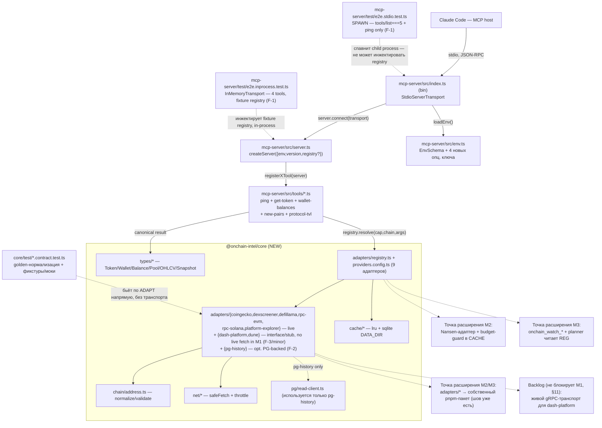

# 3. Системная архитектура

> Part of [docs/ARCHITECTURE.md](../ARCHITECTURE.md).

### 3.1. Архитектурный стиль

**Стиль M1: два пакета в pnpm-монорепо** — `packages/core` (новый) + `packages/mcp-server`
(существующий, M0). Внутри каждого пакета — простая модульная структура, без DI-контейнеров.

**Решение по OQ-3 (packages/core split — предмет решения архитектора, TASK.md §7):** выбрана
**ровно одна** дополнительная граница пакета (`packages/core`), а не полная D12-раскладка
(`core`+`adapters`+`signals`+`cli` четырьмя пакетами).

- **Почему не один пакет (не всё в `mcp-server`):** объём M1 — канонические типы, 9 адаптеров,
  двухуровневый кеш, SSRF-гейт, rate-limiter, PG-клиент — это самостоятельный, тестируемый без
  MCP-транспорта домен (все контрактные тесты D11 бьют по `normalize()`/`fetch()` напрямую, без
  сервера). Смешивание его с MCP-обвязкой в одном пакете усложнило бы M2 (Nansen) и M3 (signals):
  им обоим тоже нужен доступ к Registry/Cache/types, но не к MCP tool-регистрации.
- **Почему не четыре пакета (`core`+`adapters`+`signals`+`cli` сразу):** M0 уже показал реальную
  цену **каждого** нового workspace-пакета в этом toolchain (свой `tsconfig.json` +
  `tsconfig.build.json` + `.prettierignore` из-за CWD-relative resolution — см.
  `packages/mcp-server/.AGENTS.md`; TS strict + `noUncheckedIndexedAccess` дисциплина). D12 сам
  говорит «старт минимальный, режем по швам по мере роста» — `signals`/`cli` не имеют кода до
  M3/по потребности (R-27 anti-scope-creep). Адаптеры — не отдельный пакет, а модульная граница
  **внутри** `packages/core` (`src/adapters/<id>/`): это уже «шов» D12 на уровне директорий —
  вынести их в собственный pnpm-пакет в M2/M3 значит переместить директорию + добавить
  `package.json`, не переписывать код (импорты внутри `core` уже идут через
  `adapters/registry.ts`, а не напрямую между адаптерами).
- **Дополнительный выигрыш:** `packages/core` не нуждается в tsup — это чистая библиотека без
  `bin`, поэтому её `build` — простой `tsc -p tsconfig.build.json` (NodeNext эмит из коробки).
  Это **обходит** баг tsup/rollup-plugin-dts (TS6/TS7 `baseUrl`-конфликт, см. M0 `.AGENTS.md`)
  целиком, а не воспроизводит его во втором пакете — `core` проще собрать, чем `mcp-server`.

**Обоснование стиля в целом:** YAGNI (architecture-design skill, «Simplicity Above All») —
минимальная граница, которая делает M1 честным (тестируемым независимо от MCP) и не создаёт
рефакторинг для M2/M3 slicing.

### 3.2. Системные компоненты

#### Компонент: `@onchain-intel/core` (НОВЫЙ, M1)

- **Тип:** TypeScript library-пакет (без `bin`), потребляется `mcp-server` через
  `workspace:*`-зависимость.
- **Назначение:** канонические типы, chain/address normalization, Adapter + Capability Registry,
  девять адаптеров (два — `dash-platform` и `dune` — interface/fixture-only в M1, см. ниже),
  двухуровневый кеш, SSRF-гейт, rate-limiter, read-only PG-клиент (`pg-history`-адаптер).
- **Технологии:** TypeScript strict, zod, `better-sqlite3`, `lru-cache`, `ulid`, `@noble/hashes`
  (EIP-55 keccak256 — единственная причина её появления: ADR-001 D5 явно требует EVM-checksum, не
  просто lowercase; см. §4.1), `bs58` (Solana base58 decode/validate — не переизобретается вручную
  ради корректности на security-границе валидации адреса), `pg` (read-only PG-клиент,
  `pg-history`-адаптер). **`@grpc/grpc-js`+`@grpc/proto-loader` НЕ входят в M1** (были в v2 —
  убраны в v2.1, F-3): `dash-platform` сужен до interface + fixture-контракта, живого gRPC-вызова
  в M1 нет — см. §3.2 `dash-platform` ниже.
  > Версии выше — реалистичные мажоры, **не** проверенные `pnpm add`-резолвом (в отличие от уже
  > установленных M0-зависимостей в `mcp-server/package.json`); точные minor/patch фиксируются в
  > Development при первом `pnpm add`, не изобретаются здесь (vendor-drift дисциплина).

**Модуль: `src/types/*`** (D5, R-1/R-2)

Канонические zod-схемы, единственный источник правды (используются и рантайм-валидацией, и
tool-схемами через реэкспорт в `mcp-server`):

```ts
export const ChainSchema = z.enum(['ethereum', 'solana', 'dash']);
export type Chain = z.infer<typeof ChainSchema>;

export const TokenSchema = z
  .object({
    chain: ChainSchema,
    address: z.string(), // нормализован: checksum EVM / base58 Solana
    symbol: z.string(),
    name: z.string(),
    decimals: z.number().int().nonnegative().optional(),
    priceUsd: z.number().nonnegative().optional(),
    marketCapUsd: z.number().nonnegative().optional(),
    source: z.string(), // id адаптера-источника
    fetchedAt: z.number().int(), // epoch-ms UTC
  })
  .strict();

export const BalanceSchema = z
  .object({
    assetType: z.enum(['native', 'token']), // M1 заполняет только 'native' — см. §4.1 ниже
    symbol: z.string(),
    decimals: z.number().int().nonnegative(),
    amountRaw: z.string(), // точное целое строкой (DB-SCHEMA §1.7 конвенция)
    amountNum: z.number().optional(), // lossy-проекция
    contractAddress: z.string().optional(), // заполняется, когда assetType === 'token'
  })
  .strict();

export const WalletSchema = z
  .object({
    chain: ChainSchema,
    address: z.string(),
    balances: z.array(BalanceSchema),
    source: z.string(),
    fetchedAt: z.number().int(),
  })
  .strict();

export const PoolSchema = z
  .object({
    id: z.string(),
    chain: ChainSchema,
    dexId: z.string(),
    baseTokenSymbol: z.string(),
    quoteTokenSymbol: z.string(),
    pairAddress: z.string(),
    createdAt: z.number().int().optional(),
    liquidityUsd: z.number().nonnegative().optional(),
    volume24hUsd: z.number().nonnegative().optional(),
    source: z.string(),
    fetchedAt: z.number().int(),
  })
  .strict();

// Зарезервирован (R-1 требует существование типа), M1 не подключает ни одного потребляющего
// tool — первый потребитель: будущий candlestick/chart-tool (M1.5+).
export const OhlcvSchema = z
  .object({
    chain: ChainSchema,
    pairAddress: z.string(),
    ts: z.number().int(),
    open: z.number(),
    high: z.number(),
    low: z.number(),
    close: z.number(),
    volumeUsd: z.number().nonnegative().optional(),
    source: z.string(),
  })
  .strict();

// Персистентная форма D5-дополнения (snapshotter-режим) — согласована с DB-SCHEMA-CONCEPT §2,
// но M1 не пишет её никуда (n8n пишет отдельно); тип существует для будущего M3-поглощения (R-2).
// Маппинг имён на persistence-границе (M3, не M1, minor): valueRaw↔value_raw, valueNum↔value_num
// — остальные поля совпадают буквально (см. §4.1 Entity Snapshot).
export const SnapshotSchema = z
  .object({
    metric: z.string(),
    asset: z.string(),
    ts: z.number().int(),
    valueRaw: z.string(),
    valueNum: z.number().optional(),
    source: z.string(),
    height: z.number().int().optional(),
  })
  .strict();
```

#### 4.1 Address/Chain Normalization (`src/chain/address.ts`) — детально по замечанию ревьюера

- **EVM (ethereum):** канонический вид — **EIP-55 checksum**, не lowercase (ADR-001 D5 явно
  требует checksum). Алгоритм: `keccak256` от lowercase hex-адреса (без `0x`, как ASCII-байты) →
  для каждого hex-символа исходного lowercase-адреса — если соответствующий ниббл хеша ≥ 8,
  символ идёт в верхнем регистре, иначе в нижнем. Это **чистая функция байт адреса**: любой
  входной регистр даёт **один и тот же** checksum-результат — кеш-ключ и хранение детерминированы
  автоматически, отдельная «lowercase-для-ключей» форма не нужна.
- **Solana:** канонический вид — **как есть** (base58 регистро-чувствителен: lowercase испортил
  бы адрес, в отличие от hex). Валидация: base58-декодирование успешно **и** длина декодированных
  байт **точно 32** (Solana-адрес — сырой ed25519-pubkey, без version/checksum-байтов в отличие
  от Bitcoin base58check).
- **Dash:** участвует в `ChainSchema` для консистентности словаря (совпадает с `assets.chain_family`
  из DB-SCHEMA), но `Wallet`/`Balance`-типы для него в M1 не используются — dash-platform отдаёт
  `Snapshot`, не `Balance` (см. §2.1).
- **Единая точка использования:** и MCP-tool input-схемы (`superRefine` вызывает
  `isValidAddress(chain, address)`), и адаптеры (`normalizeAddress` перед вызовом
  `fetch`/построением кеш-ключа) — один модуль, не дублируется.

**Модуль: `src/adapters/*`** (D4, R-3, R-5…R-11)

```ts
export interface CapabilityDescriptor {
  id: string; // 'token.price' | 'wallet.balances.native' | 'pairs.new' | ...
  chains?: Chain[]; // отсутствует = capability не привязана к конкретной сети
}

export interface ProviderAdapter {
  id: string; // D4: явное поле id
  capabilities(): CapabilityDescriptor[];
  costOf(cap: string, args: Record<string, unknown>): { credits: number };
  fetch(cap: string, args: Record<string, unknown>): Promise<unknown>;
  normalize(cap: string, raw: unknown): unknown; // сужается адаптером внутри
  isAvailable?(): { ok: true } | { ok: false; reason: string }; // env/key-готовность, R-24
}
```

**Capability Registry** (`src/adapters/registry.ts`) маршрутизирует по `(capability, chain)`:

```ts
export interface CapabilityRoute {
  capability: string;
  chains?: Chain[];
  adapterIds: string[]; // порядок = приоритет + fallback-цепочка (R-11)
}

export class CapabilityRegistry {
  resolve(
    capability: string,
    chain: Chain,
    args: Record<string, unknown>,
  ): Promise<{ result: unknown; source: string; cache: 'hit' | 'miss'; ageMs?: number }>;
  // при недоступности всех адаптеров маршрута — бросает CapabilityUnavailableError со списком
  // (adapterId, reason) — не тихий пустой ответ (R-24); при ошибке fetch/normalize текущего
  // адаптера — переходит к следующему в adapterIds (R-11 hot-swap), не падает целиком.
  //
  // Cache-fault contract (cycle 1, A1/A2) — ДВА разных контракта: fetch/normalize ошибка →
  // «этот адаптер не смог ответить, пробуем следующий» (в tried); cache.get()/set() ошибка →
  // всегда BEST-EFFORT, никогда не фатальна, никогда не CapabilityUnavailableError — get() throw
  // логируется и трактуется как miss; set() throw логируется в СВОЁМ nested try/catch (не в tried,
  // не триггерит fallback) — уже полученный result всё равно возвращается как 'miss'.
}
```

`providers.config.ts` — декларативные маршруты + реестр адаптеров (id → hosts/rate-limit/env):

```ts
export const routes: CapabilityRoute[] = [
  { capability: 'token.price', chains: ['ethereum', 'solana'], adapterIds: ['coingecko'] },
  { capability: 'token.metadata', chains: ['ethereum', 'solana'], adapterIds: ['coingecko'] },
  { capability: 'pairs.new', chains: ['ethereum', 'solana'], adapterIds: ['dexscreener'] },
  // R-6 Must требует и pairs.new, и pool.info — pool.info пока без tool-потребителя в M1
  // (дёшево объявить сейчас, major fix, ревью цикл 1):
  { capability: 'pool.info', chains: ['ethereum', 'solana'], adapterIds: ['dexscreener'] },
  { capability: 'protocol.tvl', chains: ['ethereum', 'solana'], adapterIds: ['defillama'] },
  { capability: 'wallet.balances.native', chains: ['ethereum'], adapterIds: ['rpc-evm'] },
  { capability: 'wallet.balances.native', chains: ['solana'], adapterIds: ['rpc-solana'] },
  {
    capability: 'privacy.shielded_pool',
    chains: ['dash'],
    adapterIds: ['dash-platform', 'platform-explorer'],
  },
  {
    capability: 'platform.identities',
    chains: ['dash'],
    adapterIds: ['dash-platform', 'platform-explorer'],
  },
  {
    capability: 'platform.contracts',
    chains: ['dash'],
    adapterIds: ['dash-platform', 'platform-explorer'],
  },
  {
    capability: 'platform.documents',
    chains: ['dash'],
    adapterIds: ['dash-platform', 'platform-explorer'],
  },
  {
    capability: 'platform.credits',
    chains: ['dash'],
    adapterIds: ['dash-platform', 'platform-explorer'],
  },
  // R-10 (platform-explorer's own history, always live/keyless) + R-12 (opt. PG-backed history) —
  // fix F-2, ревью цикл 1: platform-explorer первым (не нужен DSN, всегда доступен), pg-history
  // вторым (доп./альтернативный вид истории, только когда задан ONCHAIN_PG_URL):
  {
    capability: 'privacy.shielded_pool.history',
    chains: ['dash'],
    adapterIds: ['platform-explorer', 'pg-history'],
  },
  {
    capability: 'platform.metrics.history',
    chains: ['dash'],
    adapterIds: ['platform-explorer', 'pg-history'],
  },
  // R-8 — Dune, Should, interface/config-stub в M1 (см. решение по dune ниже, F-2/minor):
  // зарегистрирован, не потребляется ни одним из 4 tools, live fetch/фикстура — не в M1.
  { capability: 'token.holders', chains: ['ethereum'], adapterIds: ['dune'] },
];

export const adapterRegistrations: AdapterRegistration[] = [
  {
    id: 'coingecko',
    hosts: ['api.coingecko.com', 'pro-api.coingecko.com'],
    rateLimit: { capacity: 10, refillPerSec: 0.5 },
    requiresEnv: [],
  },
  {
    id: 'dexscreener',
    hosts: ['api.dexscreener.com'],
    rateLimit: { capacity: 5, refillPerSec: 1 },
    requiresEnv: [],
  },
  {
    id: 'defillama',
    hosts: ['api.llama.fi'],
    rateLimit: { capacity: 5, refillPerSec: 1 },
    requiresEnv: [],
  },
  // interface/config-stub в M1 — isAvailable() возвращает false безусловно (см. решение ниже):
  {
    id: 'dune',
    hosts: ['api.dune.com'],
    rateLimit: { capacity: 2, refillPerSec: 0.1 },
    requiresEnv: ['DUNE_API_KEY'],
  },
  {
    id: 'rpc-evm',
    hosts: ['ethereum-rpc.publicnode.com', 'eth.drpc.org'],
    rateLimit: { capacity: 5, refillPerSec: 1 },
    requiresEnv: [],
  },
  {
    id: 'rpc-solana',
    hosts: ['api.mainnet-beta.solana.com'],
    rateLimit: { capacity: 5, refillPerSec: 1 },
    requiresEnv: [],
  },
  // F-3: нет live host в M1 — interface + fixture-контракт only; hosts заполняются, когда
  // приземлится отложенная backlog-задача живого gRPC-транспорта (§11):
  { id: 'dash-platform', hosts: [], rateLimit: { capacity: 5, refillPerSec: 1 }, requiresEnv: [] },
  {
    id: 'platform-explorer',
    hosts: ['platform-explorer.pshenmic.dev'],
    rateLimit: { capacity: 5, refillPerSec: 1 },
    requiresEnv: [],
  },
  // NEW (F-2) — не HTTP-хост: Postgres wire-протокол; сам DSN — контроль доступа, не
  // hostname-allowlist. Регистрация здесь нужна ИСКЛЮЧИТЕЛЬНО для providers-FK (§4.2).
  {
    id: 'pg-history',
    hosts: [],
    rateLimit: { capacity: 2, refillPerSec: 0.2 },
    requiresEnv: ['ONCHAIN_PG_URL'],
  },
];
```

Rate-limit значения — консервативные стартовые (не документированные вендором лимиты, кроме
Dune-кредитов) — легко подкручиваются правкой конфига без изменения кода вызывающей стороны (R-4).

**Девять адаптеров — сводка:**

| id                  | Capability(-ies)                                            | Транспорт                                                             | Ключ                                                                                                                        | Примечание                                                                                                                                                           |
| ------------------- | ----------------------------------------------------------- | --------------------------------------------------------------------- | --------------------------------------------------------------------------------------------------------------------------- | -------------------------------------------------------------------------------------------------------------------------------------------------------------------- |
| `coingecko`         | `token.price`, `token.metadata`                             | REST (`fetch`), `/coins/{platform}/contract/{address}`                | опц. `COINGECKO_API_KEY` (demo, free работает без) / `COINGECKO_PRO_API_KEY` (Pro-контур: pro-хост + pro-заголовок, v2.2.1) | R-5, **live**                                                                                                                                                        |
| `dexscreener`       | `pairs.new`, `pool.info`                                    | REST (`fetch`)                                                        | нет (keyless)                                                                                                               | R-6 Must требует оба; `pool.info` пока без tool-потребителя (дёшево объявить, major fix); точный endpoint — подтверждается при записи фикстуры (R-22), §11; **live** |
| `defillama`         | `protocol.tvl`                                              | REST (`fetch`), `/protocol/{slug}`, срез `chainTvls[chain]`           | нет (keyless)                                                                                                               | R-7, **live**                                                                                                                                                        |
| `dune`              | `token.holders` (Should, не в 4 tools)                      | REST Query API — **не реализован в M1** (interface/config-stub)       | `DUNE_API_KEY` (free tier), но `isAvailable()` безусловно `false` в M1                                                      | R-8, решение ниже                                                                                                                                                    |
| `rpc-evm`           | `wallet.balances.native` (ethereum)                         | JSON-RPC `eth_getBalance` (`fetch`)                                   | нет (keyless)                                                                                                               | R-16/R-17, OQ-1, **live**                                                                                                                                            |
| `rpc-solana`        | `wallet.balances.native` (solana)                           | JSON-RPC `getBalance` (`fetch`)                                       | нет (keyless)                                                                                                               | R-16/R-17, OQ-1, **live**                                                                                                                                            |
| `dash-platform`     | `privacy.shielded_pool`, `platform.*`                       | **gRPC** — **не реализован в M1** (interface + fixture-контракт only) | нет (keyless), но недостижим в M1                                                                                           | R-9 через мок, F-3; см. ниже                                                                                                                                         |
| `platform-explorer` | те же (fallback) + `*.history`                              | REST (`fetch`)                                                        | нет (keyless)                                                                                                               | R-10/R-11, **единственный live Dash-источник M1**                                                                                                                    |
| `pg-history`        | `privacy.shielded_pool.history`, `platform.metrics.history` | Postgres wire (SELECT-only)                                           | `ONCHAIN_PG_URL` (опц.)                                                                                                     | R-12, новый (F-2), **live опционально**                                                                                                                              |

**Input/response hardening по адаптерам (адверсариальные циклы, никогда не доверять сырому
вендор-ответу):** `rpc-evm` — hex-guard ужесточён до `/^0x[0-9a-fA-F]+$/` (требует ≥1 hex-цифру
после `0x`; голая строка `"0x"` раньше давала сырой `BigInt("0x")` `SyntaxError` вместо понятной
ошибки). `rpc-solana` — `result.value` (lamports) валидируется как неотрицательное safe-integer
(`Number.isInteger && >=0 && <=Number.MAX_SAFE_INTEGER`) до `String()`; **задокументированный M2-
дефолт:** баланс выше ~9.007M SOL уже потерял точность на уровне `response.json()` (вендор отдаёт
`result.value` JSON-числом, не hex-строкой, в отличие от `eth_getBalance`) — точный parse больших
значений не решается в M1. `dexscreener.normalize()` — skip-and-log: каждый кандидат-`Pool`
валидируется независимо (`PoolSchema.safeParse`), малформленный дропается (не бросает всю партию),
одна stderr-строка со счётчиком; throw — только если **все** кандидаты партии малформлены (иначе
пустой `Pool[]` неотличим от «новых пар сейчас нет», R-24). `defillama.normalize()` — отвергает
non-finite/negative `tvlUsd`/`totalTvlUsd` **до** попадания в кеш (иначе `onchain_protocol_tvl`'s
собственная `.nonnegative()`-схема увидела бы уже закешированное битое значение). Оба RPC-адаптера
усекают сообщения об ошибке через общий `src/adapters/stringify-truncated.ts` (500 символов +
`…[truncated]`) — раньше сырой JSON-RPC envelope мог попасть в `Error.message` целиком, вплоть до
`safeFetch`'s 10MB-капа.

**`dash-platform` — сужен до interface + fixture-контракта в M1 (F-3, решение ревью-цикла 1):**
живой gRPC-транспорт (v2) — самый дорогой/наименее окупаемый пункт M1-критического пути: нет
tool-потребителя (OQ-2 ниже), evonode-host не верифицирован (§11), а `privacy.shielded_pool`/
`platform.*` уже полностью покрыты `platform-explorer` (keyless REST). **Решение** — только
интерфейс + fixture-backed contract-тест: `capabilities()` объявляет все пять способностей
(`privacy.shielded_pool` + `platform.identities/contracts/documents/credits`, R-9); `normalize()`
реализован и golden-протестирован против **вручную собранной** фикстуры (форма списана с полей
addendum — `getShieldedPoolState`/`getTotalCreditsInPlatform`) — R-9 удовлетворено через мок, не
живой пробник; `fetch()` — stub (`NotImplementedInM1Error`), недостижим в рантайме, т.к.
`isAvailable()` уже отсекает адаптер раньше. `isAvailable()` **безусловно** возвращает
`{ ok: false, reason: 'dash-platform live transport deferred — see backlog, use platform-explorer'
}` (не «если evonode недоступен», а всегда) → Registry **всегда** маршрутизирует
`privacy.shielded_pool`/`platform.*` на `platform-explorer` — не имитация hot-swap «на всякий
случай», а **реальный, постоянно активный** fallback-путь, доказывающий механизм Registry (R-11)
настоящим прогоном. `@grpc/grpc-js`/`@grpc/proto-loader` убраны из M1-зависимостей (были в v2,
удалены в v2.1) — не нужны, пока `fetch()` не реализован. **Живой gRPC-транспорт — отдельная, не
блокирующая M1, backlog-задача** (§11): вендоринг `.proto`, `@grpc/grpc-js`+`@grpc/proto-loader`,
конкретный evonode-host (живой пробник), канал-level `assertAllowedHost()`; когда задача landится,
`isAvailable()` заменяется на условную проверку, не меняя `ProviderAdapter`-контракт наружу.

**`platform-explorer` — единственный live Dash-источник M1 (F-3 требование):** реализует ту же
capability-поверхность, что и `dash-platform` (REST, keyless, всегда доступен), **и** собственный
history-метод (R-10) — используется первым в history-маршрутах (`privacy.shielded_pool.history`/
`platform.metrics.history`, `routes` выше), не только как fallback для live-состояния.

**dash-platform / platform-explorer / dune — не получают отдельный tool (OQ-2, решение
архитектора):** ROADMAP называет ровно 4 MCP-tool для M1, ни один не про Platform-метрики или
holder-статистику; Registry регистрирует способности и покрывает их contract-тестами там, где они
существуют (R-9/R-10/R-11 через `platform-explorer` + мок `dash-platform`) — первый реальный
**потребитель**-tool для Platform-метрик появится в M3 (privacy-правила), для `token.holders` —
в M2 (`onchain_token_risk`).

**`dune` — R-8 явное решение (реконсиляция ревью-цикла 1, minor):** ревьюер рекомендовал более
узкую резолюцию R-8, чем «полный адаптер + фикстура» из v2 — **interface/config-stub в M1**:
`capabilities()` объявляет `token.holders` (число держателей + концентрация топ-10 — способность,
не покрытая ни одним из остальных восьми адаптеров); `fetch()`/`normalize()` **не реализованы**
(fixture-less — нечего golden-тестировать до авторинга запроса); `isAvailable()` возвращает
`{ ok: false, reason: 'dune query authoring deferred to M2' }` безусловно, независимо от
`DUNE_API_KEY` — авторинг живого Dune SQL-запроса (query id, параметризация) переносится на M2
вместе с первым реальным потребителем (`onchain_token_risk`). Ни один из 4 Must-tools от
`token.holders` не зависит ⇒ пустой `.env` остаётся полностью функциональным (UC-1) независимо от
этого решения. **Для Planner:** ýже буквального текста acceptance R-8 («contract-тест на
фикстуре», TASK.md) — резолюция одобрена ревьюером архитектуры явно (F-2/minor, цикл 1); Planner
либо принимает её как обновлённый scope R-8 для M1-задачи, либо эскалирует к Analyst для
формальной правки RTM, если нужен строгий 1:1 с исходной acceptance-формулировкой.

**ERC-20/SPL-балансы — решение архитектора (не в M1):** `onchain_wallet_balances` в M1 заполняет
только `assetType: 'native'` (нативный ETH/SOL через `rpc-evm`/`rpc-solana`). Токен-балансы
(ERC-20/SPL) требуют **либо** per-контракт `eth_call`/`getTokenAccountsByOwner` над неограниченным
множеством контрактов (нужен источник «какие токены проверять» — вопрос не тривиальный на $0),
**либо** индексер/multicall-сервис (обычно платный/недостаточно надёжный keyless), **либо** Dune
(кредиты + латентность). R-17 acceptance ограничивается «контракт зафиксирован, ≥2 сети реально
работают» — нативный баланс это закрывает дёшево. `BalanceSchema` уже несёт `assetType`/
`contractAddress` (§4.1 выше) специально, чтобы M1.5/M2 добавили ERC-20/SPL **без** изменения
схемы — только заполнением дополнительных строк массива `balances`. Зафиксировано как backlog
work-item, не блокирует M1.

**Модуль: `src/cache/*`** (D6, R-13/R-14/R-15)

Двухуровневый: `lru-cache` (hot, in-process, TTL встроен в `set()`) перед `better-sqlite3`
(persistent, `DATA_DIR`). DDL следует DB-SCHEMA-CONCEPT §1 конвенциям, применённым к **новому**
контексту (кеш, не аналитический снапшот):

```sql
CREATE TABLE IF NOT EXISTS providers (
  id    TEXT PRIMARY KEY,   -- adapter.id, напр. 'coingecko' | 'rpc-evm' | ...
  kind  TEXT NOT NULL,      -- 'free' | 'paid' — информационно, отражает приоритет D4
  notes TEXT
);

CREATE TABLE IF NOT EXISTS cache_entries (
  id          TEXT PRIMARY KEY,              -- ULID, генерит приложение (DB-SCHEMA §1.3)
  provider    TEXT NOT NULL REFERENCES providers(id),
  capability  TEXT NOT NULL,
  args_hash   TEXT NOT NULL,                 -- sha256(hex) нормализованных args — НИКОГДА секретов (см. §7)
  value_json  TEXT NOT NULL,                 -- канонический результат, JSON как TEXT (DB-SCHEMA §1.4)
  created_at  INTEGER NOT NULL,              -- epoch-ms UTC
  expires_at  INTEGER NOT NULL,              -- epoch-ms UTC = created_at + TTL(capability)
  UNIQUE (provider, capability, args_hash)
);
CREATE INDEX IF NOT EXISTS idx_cache_entries_expiry ON cache_entries (expires_at);
```

- **Запись — upsert, не append-only:** кеш-запись — пересчитываемая проекция, не наблюдение
  (в терминах DB-SCHEMA §1.5 это ветка «`aggregates`», не «`snapshots`»): `INSERT ... ON CONFLICT
(provider, capability, args_hash) DO UPDATE SET value_json=excluded.value_json,
created_at=excluded.created_at, expires_at=excluded.expires_at`. Обычный insert-only здесь
  оставил бы устаревшее значение молча (то же предостережение, что DB-SCHEMA §1.5 даёт для
  `aggregates`).
- **`providers` — upsert ДО первой записи в `cache_entries`** (registry bootstrap из **всех
  девяти** `adapterRegistrations`, включая `pg-history` — F-2, при старте), FK **включён явно**:
  `PRAGMA foreign_keys=ON` при открытии соединения (DB-SCHEMA §1.6). Это же готовит место для M2
  `usage(provider, day, credits_used)` — FK на тот же `providers`-реестр без миграции (R-14
  acceptance).
- `PRAGMA journal_mode=WAL` — конкурентное чтение hot-path/дебага не блокируется записью.
- **`DATA_DIR`:** опциональный env, по умолчанию `path.join(os.homedir(), '.onchain-intel')`
  (не `process.cwd()`-относительный путь — MCP-сервер запускается Claude Code с произвольным cwd,
  стабильный домашний каталог предсказуем независимо от того, откуда стартовал хост). Файл кеша —
  `${DATA_DIR}/cache.sqlite3`. Перенос инсталляции = перенос одного каталога (DB-SCHEMA §1.10).
- **TTL по типу данных** (ADR-001 D6 диапазоны, конкретизированы под M1-способности):

  | Capability                            | TTL   | Обоснование                                                                |
  | ------------------------------------- | ----- | -------------------------------------------------------------------------- |
  | `token.price`                         | 60с   | D6: цена 15–60с                                                            |
  | `token.metadata`                      | 3600с | имя/символ/decimals почти не меняются                                      |
  | `wallet.balances.native`              | 60с   | D6: балансы 1–5мин, нижняя граница — баланс меняется с каждой tx           |
  | `pairs.new`                           | 30с   | свежесть критична для «new»                                                |
  | `protocol.tvl`                        | 300с  | D6: TVL 5–30мин, нижняя граница                                            |
  | `privacy.shielded_pool`, `platform.*` | 3600с | не имеет смысла опрашивать чаще часового каденса существующего снапшоттера |
  | `token.holders` (dune)                | 3600с | кредит-метрируемо, низкая волатильность                                    |

- **Hit/miss счётчики** (`src/cache/stats.ts`) — `Map<capability, { hit: number; miss: number
}>` в процессе, инкрементируется внутри `TwoLevelStore.get()` (не правкой `registry.ts` — тот же
  `CacheStore`-шов task 003-2, ноль изменений в Registry) на каждое разрешение способности;
  экспортируется функцией `getCacheStats()`, используемой (a) для одной stderr-строки на вызов
  (`cache=hit|miss provider=<id> capability=<cap> ageMs=<n>` — без значений args/секретов) и (b)
  для `_meta.cache` в ответе tool. **Обоснование выбора (обе точки, не одна):** stderr —
  greppable для dev/CI-ассертов без изменения протокола (инвариант §7.3 M0 не нарушается — это
  не stdout); `_meta` — прямая видимость вызывающему агенту (Claude Code) без парсинга логов,
  тестируется прямо в E2E через `result._meta.cache`, не растит `structuredContent`/схему выхода
  (R-15 acceptance «проверяемо в тесте или debug-выводе» — закрыто обоими путями).
- **Реализационное укрепление `SqliteCacheStore` (адверсариальные циклы + polish):** четыре
  повторяющихся SQL-запроса (`get()`-SELECT, `get()`-stale-DELETE, `set()`-upsert, sweep-DELETE)
  `prepare()`-ятся **один раз** в конструкторе, не заново на каждый вызов (цикл 2, fix 5 —
  чистый перформанс-рефактор, поведение не меняется). **Оппортунистический sweep протухших строк**
  (цикл 1, fix H): каждый `sweepEveryNWrites`-й (по умолчанию 50) вызов `set()` удаляет строки с
  `expires_at <= now` через существующий индекс — **задокументированный M2-дефолт: это не
  retention/size-кап** (нет предела на количество строк/размер диска), только избавление от уже
  протухших ключей, которые больше никогда не читаются. **Leak-safe конструктор** (post-M1 polish,
  fix 4): каждый шаг после открытия соединения (PRAGMA/DDL/bootstrap/prepare) обёрнут в try/catch —
  throw теперь best-effort закрывает уже открытый `better-sqlite3`-хендл перед re-throw, вместо
  утечки файлового дескриптора; тестовый seam `postOpenTestHook` (никогда не используется в
  продакшене) позволяет `test/cache.test.ts` симулировать произвольный пост-open сбой. **Честный
  `ageMs` при LRU-промоушене** (цикл 2, fix 2): `TwoLevelStore` при промоушене cold-хита в hot-слой
  передаёт `createdAt = Date.now() - coldHit.ageMs` (не момент промоушена) — иначе каждый
  последующий hot-хит показывал бы `_meta.cache.ageMs` сброшенным к ~0, занижая реальный возраст
  значения.

**Модуль: `src/net/*`** (SSRF, R-25 + rate-limit, R-26)

```ts
export function assertAllowedHost(hostname: string, allowlist: string[]): void; // throws SsrfBlockedError
export function safeFetch(
  url: string,
  opts: RequestInit,
  allowlist: string[],
  fetchImpl?: typeof fetch,
  options?: { timeoutMs?: number; maxResponseBytes?: number },
): Promise<Response>;
// safeFetch: redirect: 'manual' + ручная проверка Location-хоста на каждом хопе (макс. 3);
// https проверяется на ИСХОДНОМ url И на каждом редирект-хопе (cycle 2, finding 4). Hardened
// (cycle 1, fix B): каждый хоп гонится против AbortSignal.timeout(timeoutMs) (15с дефолт) →
// SafeFetchTimeoutError; Content-Length сверяется с maxResponseBytes (10MB дефолт) ДО чтения тела
// → SafeFetchResponseTooLargeError (M2-дефолт: chunked/no-Content-Length не покрыт — нужен
// потоковый byte-counter). Cross-host редирект срезает Authorization/*-api-key-заголовки
// (SENSITIVE_HEADER_RE); same-host редирект хранит их как есть.

export interface TokenBucketConfig {
  capacity: number;
  refillPerSec: number;
}
export function throttle(providerId: string, config: TokenBucketConfig): Promise<void>;
// Concurrency-safe (cycle 1, fix C): refill+consume+decide — целиком СИНХРОННЫЙ шаг (без await до
// фиксации состояния), tokens допускает негативный backlog, никогда не сбрасывается после wait —
// иначе конкурентные вызовы читают одно и то же pre-wait состояние и не расходятся по времени.
// refillPerSec<=0 → типизированный RateLimitRejectedError немедленно (не Infinity-wait/setTimeout-
// clamp, что раньше молча съедало rate-limit). 30с fairness-кап (cycle 2, fix 7): waitMs > 30000мс
// → reject вместо ожидания, с рефандом токена (tokens += 1) перед throw.
```

**Модуль: `src/pg/read-client.ts`** (R-12, используется **только** `adapters/pg-history/index.ts` —
не отдельный side-channel, F-2)

Ленивый `pg.Pool` — создаётся **только** при первом вызове history-способности **и** наличии
`ONCHAIN_PG_URL`; иначе `pg-history.isAvailable()` возвращает `{ ok: false, reason: 'needs
ONCHAIN_PG_URL' }` (R-24). `search_path=onchain` через connection option (`options: '-c
search_path=onchain'`). Все запросы кода движка — **только `SELECT`** (код-ревью гейт + runtime-регекс
guard, R-27); рекомендация для оператора БД — сама роль на сервере тоже должна быть SELECT-only
(defense in depth, §7). `pg-history` оборачивает этот клиент в стандартный `ProviderAdapter` (`id:
'pg-history'`, `capabilities()` → `privacy.shielded_pool.history`/`platform.metrics.history`,
`normalize()` → `Snapshot[]`) — регистрируется в `providers` наравне с остальными восемью (§4.2).

**Pool hardening (adversarial cycle 1, fix D + post-M1 polish, fix 3):** `pool.on('error', ...)`
навешивается сразу после `new Pool(...)` — idle-соединение может отвалиться независимо от
`query()`, а необработанный `'error'` на `EventEmitter` иначе роняет весь процесс; лог в stderr,
игнор. `connectionTimeoutMillis: 10000` / `max: 3` передаются **всегда** явно (не дефолты `pg`).
**Все** пути отказа — и `pool.query(...)` (D2), и сама **конструкция** `new Pool(...)` (post-M1
polish, fix 3: раньше throw конструктора при невалидном DSN обходил D2's try/catch и мог утечь
хост/порт/юзер вызывающему) — санитизируются до единого `'pg-history: database unavailable'`
(`SANITIZED_QUERY_FAILURE_MESSAGE`, с `{cause: error}`); сырая деталь — только в stderr, DSN и его
фрагменты никогда не достигают вызывающего/MCP-клиента.

#### Компонент: `@onchain-intel/mcp-server` (M0, расширяется в M1)

- Тип/технологии — без изменений от v1.1 (Node CLI, stdio, `@modelcontextprotocol/sdk`, zod,
  tsup+tsx+vitest). **Новая** `workspace:*`-зависимость на `@onchain-intel/core`.
- `createServer(deps: { env: Env; version: string; registry?: CapabilityRegistry })` —
  **`registry` теперь injectable** (по умолчанию — реальный, собранный из
  `providers.config.ts`; тесты передают fixture-backed реализацию того же интерфейса
  `resolve()`). Это единственный механизм «MCP E2E без сети» (R-21) — не мокается глобальный
  `fetch`, инжектируется другая реализация того же контракта на границе `createServer`.
  **Важно (F-1, ревью цикл 1):** эта инъекция работает только **in-process** — она недостижима
  через границу спавненного дочернего процесса (`e2e.stdio.test.ts` спавнит `src/index.ts` как
  отдельный процесс через `tsx`, у которого нет способа получить объект `registry` вызывающего
  теста). Поэтому её использует **новый** in-process suite (`e2e.inprocess.test.ts`, см. «Тест-
  сьют» ниже), не спавн-сьют — это и есть ключевое разделение F-1.
- **4 новых `src/tools/*.ts`** (`get-token.ts`, `wallet-balances.ts`, `new-pairs.ts`,
  `protocol-tvl.ts`) — тот же паттерн, что `ping.ts`: pure-хендлер (юнит-тестируем без
  транспорта, возвращает `{ok:true,...}|{ok:false,reason}`, никогда не бросает) + `registerXTool`
  (обвязка над SDK), которая на `{ok:false}` строит `{ isError: true, content: [{ type: 'text',
text: <причина, без значений секретов> }] }` явно. **Исправлено (цикл 2, finding 1 — прежняя
  формулировка здесь была устаревшей/неточной):** это НЕ потому, что автоматическое
  `isError`-преобразование SDK покрывает только zod input-валидацию — установленный SDK
  (`@modelcontextprotocol/sdk@1.29.0`) на самом деле оборачивает **весь** `tools/call`-хендлер
  (input-валидацию, сам колбэк, И output-schema валидацию) в один try/catch и конвертирует
  **любой** брошенный error в `isError: true` (проверено чтением установленного `server/mcp.js`).
  Явная сборка `{isError:true,...}` сохранена намеренно: (a) `{ok:false,reason}`-контракт каждого
  хендлера юнит-тестируем на pure-уровне без транспорта, (b) `reason` — осознанно выбранное
  сообщение, а не generic `.message` брошенного error.
- `src/env.ts` — 4 новых **опциональных** ключа (R-23): `COINGECKO_API_KEY`, `DUNE_API_KEY`,
  `ONCHAIN_PG_URL` (`z.string().url().optional()` — WHATWG URL-парсинг принимает `postgres://`;
  проверить на реальной строке подключения в Development, §11), `DATA_DIR`
  (`z.string().optional()`). `EnvSchema.parse({})` продолжает не бросать (R-23).
  **Пост-M1 фикс (2026-07-23, v2.2.1):** пятый опциональный ключ `COINGECKO_PRO_API_KEY` —
  Pro-подписка CoinGecko это **отдельный контур** аутентификации (хост `pro-api.coingecko.com` +
  заголовок `x-cg-pro-api-key`; pro-хост игнорирует demo-заголовок — подтверждено живым
  пробником), а не «тот же ключ с большими лимитами»: формат ключей обоих тиров одинаков
  (`CG-…`), поэтому контур объявляется тем, какая переменная задана (никогда не
  угадывается по формату); при обеих заданных приоритет у Pro.

#### Тест-сьют — расширения M1 (D11, R-21/R-22)

- **`packages/core/test/`:** по одному `*.contract.test.ts` на адаптер, где есть живой/fixture/
  mock путь — golden-нормализация «сырой ответ фикстуры → канонический объект» (D11);
  `test/fixtures/<adapter>/*.json` — закоммичены (`coingecko`, `dexscreener`, `defillama`,
  `rpc-evm`, `rpc-solana`, `platform-explorer` — реальные HTTP-фикстуры; `dash-platform` —
  вручную собранная фикстура по форме addendum, см. §3.2 выше; `pg-history` — не HTTP-фикстура, а
  мок pg-клиента с фиксированными строками; `dune` — **без** фикстуры/теста в M1, F-2/minor).
  `registry.fallback.test.ts` — R-11: `dash-platform.isAvailable()` детерминированно `false` в M1
  (не мок недоступности, а реальная M1-конфигурация, F-3) → способность отвечает через
  `platform-explorer` — прогон настоящего, не симулированного fallback-пути. `cache.test.ts` —
  hit/miss/TTL обоих уровней, включая `pg-history` (провайдер существует в `providers`-реестре —
  FK не нарушается, F-2). `safe-fetch.test.ts` — SSRF-гейт (allowlist + редирект-цепочка).
  `rate-limit.test.ts` — throttle. `chain-address.test.ts` — checksum/base58/невалидные адреса.
- **`packages/core/scripts/record-fixture.mjs`** (R-22) — ручной dev-скрипт: один живой вызов
  провайдера → сохраняет фикстуру **и** evidence (реальные поля/эндпоинт/дату записи, не
  предположение) рядом в `test/fixtures/<adapter>/<name>.evidence.md`; **не входит в CI**.
- **`packages/mcp-server/test/e2e.stdio.test.ts`** (spawn, **механизм не меняется** от M0) —
  спавнит `src/index.ts` дочерним процессом через `tsx`, как в M0. Расширяется **только** до
  `tools/list` === **5** tools (`onchain_ping` + 4 новых, проверка по имени) и продолжает гонять
  `onchain_ping` end-to-end так же, как в M0. **Не вызывает 4 новых tool через этот транспорт**
  (F-1, ревью цикл 1): инъекция `registry` в `createServer({registry})` — in-process-механизм,
  недостижимый через границу спавненного дочернего процесса; вызов реального (не fixture-backed)
  registry там означал бы живые сетевые вызовы из-под spawn — нарушение R-21.
- **`packages/mcp-server/test/e2e.inprocess.test.ts`** (НОВЫЙ, F-1 fix) — не спавнит процесс:
  использует SDK-шный `InMemoryTransport.createLinkedPair()` (часть `@modelcontextprotocol/sdk`,
  новой зависимости не требует) + `Client` + `createServer({ env, version, registry:
fixtureRegistry })` **в одном процессе теста**. `fixtureRegistry` — реализация того же
  публичного контракта `CapabilityRegistry.resolve()`, собранная из `packages/core/test/
fixtures/`. Гоняет все 4 новых tool целиком через MCP-протокол (input-валидация,
  `structuredContent`, `_meta.cache`, `isError`-путь при недоступности способности) — **0
  сетевых вызовов** (R-21), т.к. инъекция здесь физически возможна (нет границы процесса). Это и
  есть фактический механизм «E2E расширен на 4 tool с mocked/fixture-backed registry» из скоупа
  TASK-003 — терминология уточнена: не «stdio E2E» в буквальном смысле (spawn), а in-process
  JSON-RPC-раунд-трип через `InMemoryTransport`.
- **`scripts/smoke-dist.mjs`** — **решение архитектора: остаётся ping-only.** Его роль —
  проверить, что _собранный_ `dist/index.js` вообще поднимается и говорит по wire-протоколу
  (post-build слепая зона M0). Расширение его до реальных сетевых вызовов против живых провайдеров
  вернуло бы именно ту сетевую зависимость CI, которую R-21 запрещает; `e2e.inprocess.test.ts`
  (на `tsx`, не на `dist/`) уже покрывает поведение всех 4 tools против фикстур. Дублировать в
  build-специфичном смоук-тесте не нужно.

### 3.3. Диаграмма компонентов


