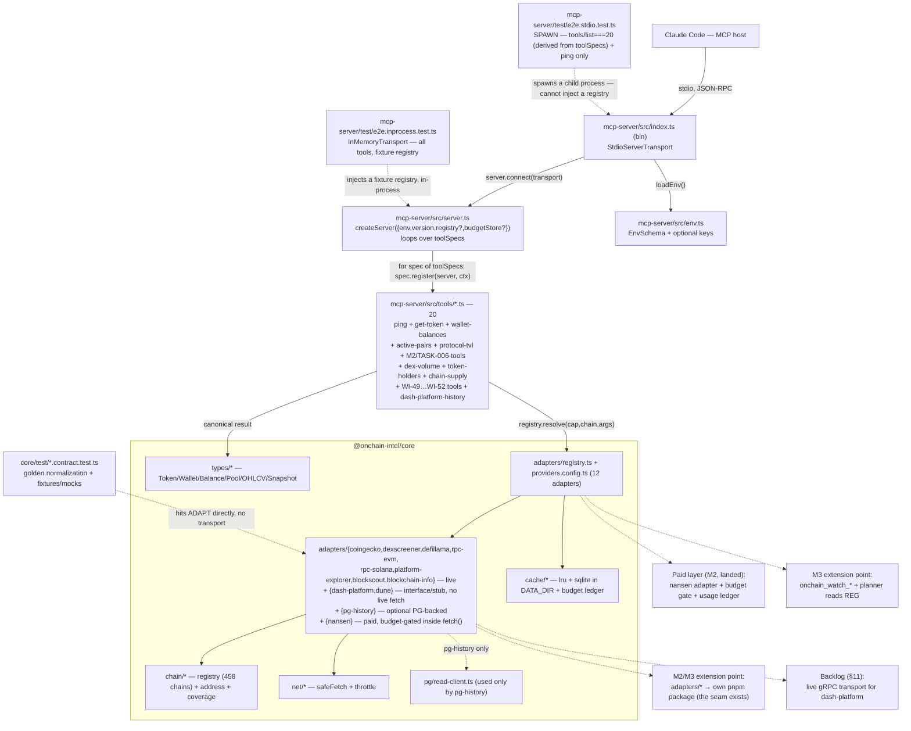

# 3. System architecture

> Part of [docs/ARCHITECTURE.md](../ARCHITECTURE.md).

### 3.1. Architecture style

**Two packages in a pnpm monorepo** — `packages/core` and `packages/mcp-server`. Inside each
package a plain modular structure; no DI containers.

Exactly **one** additional package boundary is drawn (`packages/core`), not the full D12 layout
(`core` + `adapters` + `signals` + `cli` as four packages).

- **Why not a single package (everything inside `mcp-server`).** Canonical types, the chain
  registry, the adapters, the two-level cache, the SSRF gate, the rate limiter and the PG client
  form a domain that is testable without the MCP transport. Every D11 contract test hits
  `normalize()`/`fetch()` directly, with no server in the loop. Fusing that domain with the MCP
  wiring would have made the paid layer (M2) and signals (M3) harder: both need
  Registry/Cache/types, neither needs MCP tool registration.
- **Why not four packages up front.** M0 measured the real price of **each** new workspace package
  in this toolchain: its own `tsconfig.json` + `tsconfig.build.json` + `.prettierignore`, because
  resolution is CWD-relative (see `packages/mcp-server/.AGENTS.md`), on top of the TS strict +
  `noUncheckedIndexedAccess` discipline. D12 itself says start minimal and cut along the seams as
  the system grows: `signals`/`cli` have no code until M3 or until needed (R-27). Adapters are not
  a separate package but a module boundary **inside** `packages/core` (`src/adapters/<id>/`) —
  already a D12 seam at the directory level. Promoting them to their own pnpm package later means
  moving a directory and adding a `package.json`, not rewriting code: imports inside `core` already
  go through `adapters/registry.ts`, never directly between adapters.
- **Extra payoff.** `packages/core` needs no tsup — it is a pure library with no `bin`, so its
  `build` is a plain `tsc -p tsconfig.build.json` (NodeNext emit out of the box). That sidesteps
  the tsup/rollup-plugin-dts bug (the TS6/TS7 `baseUrl` conflict recorded in the M0 `.AGENTS.md`)
  instead of reproducing it in a second package: `core` is easier to build than `mcp-server`.

The style is YAGNI applied to boundaries (architecture-design skill, "Simplicity Above All"): the
minimum boundary that makes M1 honest — testable independently of MCP — without forcing a refactor
for the M2/M3 slicing.

**L-5 (architecture review round 2, 2026-08-03) — noted, not fixed here.** This document is now
~2200 lines and §3.2's `core` component alone carries five distinct T-012 designs (policy
descriptor, capability manifest, provider tier, source trust, call deadline) on top of everything
M0–TASK-009 already put there. Not a T-012 defect, and NOT addressed by this task. It is flagged
for a future split (e.g. `adapters.md` / `cache.md` / `net.md` chunks, the same way `data-model.md`
and `reliability.md` already split off from a single file). The split happens when file size next
becomes the limiting factor for reading it, not before.

### 3.2. System components

#### Component: `@onchain-intel/core`

Canonical zod types, `ChainInputSchema`/`canonicalizeChain`, the 458-row chain registry and sync script, and coverage before the budget gate in `resolve()`. → [details](system-architecture-core-package.md)

#### 3.2.1. Address/chain normalization (`src/chain/address.ts`)

Family branching (R-55) plus `src/adapters/*`: `ProviderAdapter`, `CapabilityRegistry`, `PolicyDescriptor`, `deadlineMs`/`paidLegMs`, the nansen credit gate. → [details](system-architecture-chain-normalization.md)

#### Two second denominators (burst and zero-credit calls)

`usage_window`, `BudgetStore.checkAndReserve` (R-37), singleflight (R-39), reconciliation (R-38), the `cache_entries` DDL and TTL table, `src/net`, `src/pg`. → [details](system-architecture-call-budget.md)

#### Component: `@onchain-intel/mcp-server` (M0, extended in M1)

Injectable `registry` (R-21) and its inert default, `ToolSpec`/`toolSpecs`, `servedCapabilities` and its six readers, `needs` projection, `src/env.ts` keys. → [details](system-architecture-mcp-server-package.md)

#### Test suite

Per-adapter contract fixtures, the `ttl-coverage`/`docs-counts` doc gates, `registry.fallback` (R-11), spawn versus `InMemoryTransport` E2E under R-21. → [details](system-architecture-test-suite.md)

### 3.3. Component diagram

```mermaid
flowchart TB
  HOST["Claude Code — MCP host"]
  ENTRY["mcp-server/src/index.ts (bin)<br/>StdioServerTransport"]
  SRV["mcp-server/src/server.ts<br/>createServer({env,version,registry?,budgetStore?})<br/>loops over toolSpecs"]
  ENV["mcp-server/src/env.ts<br/>EnvSchema + optional keys"]
  TOOLS["mcp-server/src/tools/*.ts — 20<br/>ping + get-token + wallet-balances<br/>+ active-pairs + protocol-tvl + M2/TASK-006 tools<br/>+ dex-volume + token-holders + chain-supply<br/>+ WI-49…WI-52 tools + dash-platform-history"]

  subgraph CORE["@onchain-intel/core"]
    TYPES["types/* — Token/Wallet/Balance/Pool/OHLCV/Snapshot"]
    CHAIN["chain/* — registry (458 chains) + address + coverage"]
    REG["adapters/registry.ts + providers.config.ts (12 adapters)"]
    ADAPT["adapters/{coingecko,dexscreener,defillama,rpc-evm,<br/>rpc-solana,platform-explorer,blockscout,blockchain-info} — live<br/>+ {dash-platform,dune} — interface/stub, no live fetch<br/>+ {pg-history} — optional PG-backed<br/>+ {nansen} — paid, budget-gated inside fetch()"]
    CACHE["cache/* — lru + sqlite in DATA_DIR + budget ledger"]
    NET["net/* — safeFetch + throttle"]
    PGC["pg/read-client.ts (used only by pg-history)"]
  end

  TEST_SPAWN["mcp-server/test/e2e.stdio.test.ts<br/>SPAWN — tools/list===20 (derived from toolSpecs) + ping only"]
  TEST_INPROC["mcp-server/test/e2e.inprocess.test.ts<br/>InMemoryTransport — all tools, fixture registry"]
  CORETEST["core/test/*.contract.test.ts<br/>golden normalization + fixtures/mocks"]

  HOST -- "stdio, JSON-RPC" --> ENTRY
  ENTRY -- "server.connect(transport)" --> SRV
  ENTRY -- "loadEnv()" --> ENV
  SRV -- "for spec of toolSpecs: spec.register(server, ctx)" --> TOOLS
  TOOLS -- "registry.resolve(cap,chain,args)" --> REG
  REG --> ADAPT --> NET
  ADAPT --> CHAIN
  REG --> CACHE
  ADAPT -. "pg-history only" .-> PGC
  TOOLS -- "canonical result" --> TYPES
  TEST_SPAWN -. "spawns a child process — cannot inject a registry" .-> ENTRY
  TEST_INPROC -. "injects a fixture registry, in-process" .-> SRV
  CORETEST -. "hits ADAPT directly, no transport" .-> ADAPT

  SEAM1["Paid layer (M2, landed):<br/>nansen adapter + budget gate + usage ledger"]
  SEAM2["M3 extension point:<br/>onchain_watch_* + planner reads REG"]
  SEAM3["M2/M3 extension point:<br/>adapters/* → own pnpm package (the seam exists)"]
  SEAM4["Backlog (§11):<br/>live gRPC transport for dash-platform"]

  REG -.-> SEAM1
  REG -.-> SEAM2
  ADAPT -.-> SEAM3
  ADAPT -.-> SEAM4
```

The diagram above is the **local deployment profile** — the shape the process has today. The network
profile's diagram is §3.4.7; the two share every node inside `CORE`.

### 3.4. T-014 — the network deployment profile

Per-session `McpServer` and transport, `Principal` from `authInfo`, `LimiterStore` over `provider_buckets`, profiles `local`/`network`/`network-sqlite`. → [details](system-architecture-network-profile.md)

### 3.5. T-015 — the client billing ledger and the provider call gate

`BillingStore.reserve/settle/refund` at the `registry.ts` interception point before `resolve()`, the `OQ-G` replay window, and blockscout's `createCallGate`. → [details](system-architecture-billing.md)
