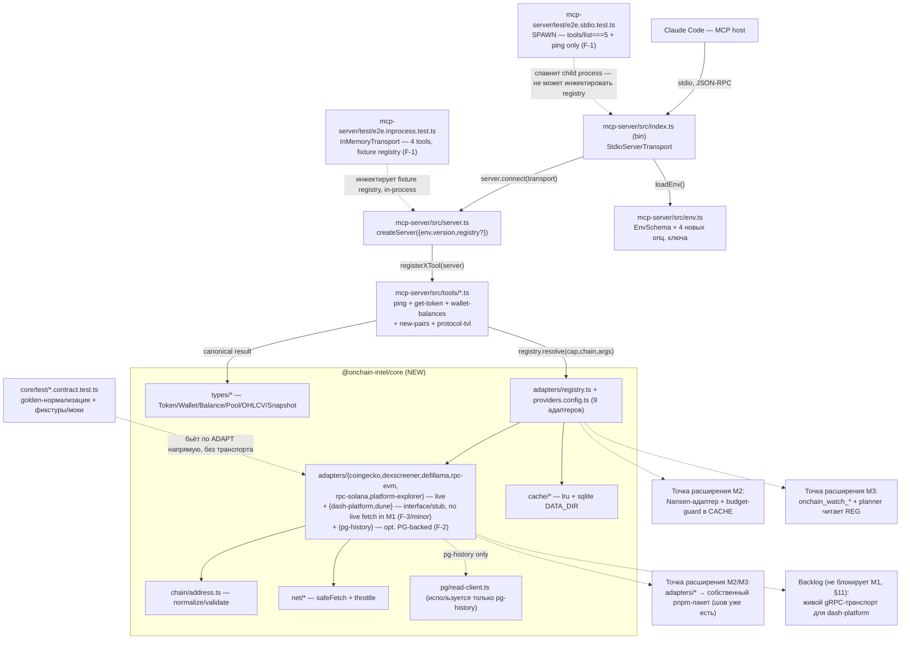

# 3. Системная архитектура

> Part of [docs/ARCHITECTURE.md](../ARCHITECTURE.md).

### 3.1. Архитектурный стиль

**Стиль M1: два пакета в pnpm-монорепо** — `packages/core` (новый) + `packages/mcp-server`
(существующий, M0). Внутри каждого пакета — простая модульная структура, без DI-контейнеров.

**Решение по OQ-3 (packages/core split — предмет решения архитектора, TASK.md §7):** выбрана
**ровно одна** дополнительная граница пакета (`packages/core`), а не полная D12-раскладка
(`core`+`adapters`+`signals`+`cli` четырьмя пакетами).

- **Почему не один пакет (не всё в `mcp-server`):** объём M1 — канонические типы, 9 адаптеров,
  двухуровневый кеш, SSRF-гейт, rate-limiter, PG-клиент — это самостоятельный, тестируемый без
  MCP-транспорта домен (все контрактные тесты D11 бьют по `normalize()`/`fetch()` напрямую, без
  сервера). Смешивание его с MCP-обвязкой в одном пакете усложнило бы M2 (Nansen) и M3 (signals):
  им обоим тоже нужен доступ к Registry/Cache/types, но не к MCP tool-регистрации.
- **Почему не четыре пакета (`core`+`adapters`+`signals`+`cli` сразу):** M0 уже показал реальную
  цену **каждого** нового workspace-пакета в этом toolchain (свой `tsconfig.json` +
  `tsconfig.build.json` + `.prettierignore` из-за CWD-relative resolution — см.
  `packages/mcp-server/.AGENTS.md`; TS strict + `noUncheckedIndexedAccess` дисциплина). D12 сам
  говорит «старт минимальный, режем по швам по мере роста» — `signals`/`cli` не имеют кода до
  M3/по потребности (R-27 anti-scope-creep). Адаптеры — не отдельный пакет, а модульная граница
  **внутри** `packages/core` (`src/adapters/<id>/`): это уже «шов» D12 на уровне директорий —
  вынести их в собственный pnpm-пакет в M2/M3 значит переместить директорию + добавить
  `package.json`, не переписывать код (импорты внутри `core` уже идут через
  `adapters/registry.ts`, а не напрямую между адаптерами).
- **Дополнительный выигрыш:** `packages/core` не нуждается в tsup — это чистая библиотека без
  `bin`, поэтому её `build` — простой `tsc -p tsconfig.build.json` (NodeNext эмит из коробки).
  Это **обходит** баг tsup/rollup-plugin-dts (TS6/TS7 `baseUrl`-конфликт, см. M0 `.AGENTS.md`)
  целиком, а не воспроизводит его во втором пакете — `core` проще собрать, чем `mcp-server`.

**Обоснование стиля в целом:** YAGNI (architecture-design skill, «Simplicity Above All») —
минимальная граница, которая делает M1 честным (тестируемым независимо от MCP) и не создаёт
рефакторинг для M2/M3 slicing.

### 3.2. Системные компоненты

#### Компонент: `@onchain-intel/core` (НОВЫЙ, M1)

- **Тип:** TypeScript library-пакет (без `bin`), потребляется `mcp-server` через
  `workspace:*`-зависимость.
- **Назначение:** канонические типы, chain/address normalization, Adapter + Capability Registry,
  девять адаптеров (два — `dash-platform` и `dune` — interface/fixture-only в M1, см. ниже),
  двухуровневый кеш, SSRF-гейт, rate-limiter, read-only PG-клиент (`pg-history`-адаптер).
- **Технологии:** TypeScript strict, zod, `better-sqlite3`, `lru-cache`, `ulid`, `@noble/hashes`
  (EIP-55 keccak256 — единственная причина её появления: ADR-001 D5 явно требует EVM-checksum, не
  просто lowercase; см. §4.1), `bs58` (Solana base58 decode/validate — не переизобретается вручную
  ради корректности на security-границе валидации адреса), `pg` (read-only PG-клиент,
  `pg-history`-адаптер). **`@grpc/grpc-js`+`@grpc/proto-loader` НЕ входят в M1** (были в v2 —
  убраны в v2.1, F-3): `dash-platform` сужен до interface + fixture-контракта, живого gRPC-вызова
  в M1 нет — см. §3.2 `dash-platform` ниже.
  > Версии выше — реалистичные мажоры, **не** проверенные `pnpm add`-резолвом (в отличие от уже
  > установленных M0-зависимостей в `mcp-server/package.json`); точные minor/patch фиксируются в
  > Development при первом `pnpm add`, не изобретаются здесь (vendor-drift дисциплина).

**Модуль: `src/types/*`** (D5, R-1/R-2)

Канонические zod-схемы, единственный источник правды (используются и рантайм-валидацией, и
tool-схемами через реэкспорт в `mcp-server`):

```ts
// TASK-006 (R-50b): БЫЛО `z.enum(['ethereum','solana','dash'])` — закрытый литерал, который
// приходилось править в пяти слоях ради каждой новой сети. СТАЛО: множество допустимых значений
// живёт в реестре (§3.2 «Модуль src/chain/registry»), не в типе.
//
// ДВЕ схемы, а не одна — намеренно. Одна схема не может обслуживать и вход, и канонический выход:
//   • на ВХОДЕ надо принять всё, что мог написать агент (`ethereum`, `berachain`, `eip155:1`);
//   • на ВЫХОДЕ в canonical-типе обязан лежать УЖЕ разрешённый caip2 — иначе алиас просочится
//     в тело канонического объекта, оттуда в ключ кеша, и мы получим две записи на один запрос
//     (§4.2.2 — это денежный дефект на платных маршрутах, не косметика).

// Канонический вид — используется ВНУТРИ доменных типов. Ничего не резолвит: только проверяет,
// что значение уже canonical и известно реестру.
export const ChainSchema = z
  .string()
  .refine(isKnownCaip2, { message: 'chain must be a canonical CAIP-2 id known to the registry' })
  .brand<'Caip2'>();
export type Chain = z.infer<typeof ChainSchema>;

// Входной вид — используется ТОЛЬКО в схемах MCP-инструментов (§5.1). Принимает slug/алиас/caip2,
// отдаёт canonical. Неизвестная сеть → issue с кандидатами (R-50c), ноль сетевых вызовов.
export const ChainInputSchema = z.string().min(1).transform(resolveChainOrIssue) as z.ZodType<
  Chain,
  z.ZodTypeDef,
  string
>;

export const TokenSchema = z
  .object({
    chain: ChainSchema,
    address: z.string(), // нормализован: checksum EVM / base58 Solana
    symbol: z.string(),
    name: z.string(),
    decimals: z.number().int().nonnegative().optional(),
    priceUsd: z.number().nonnegative().optional(),
    marketCapUsd: z.number().nonnegative().optional(),
    source: z.string(), // id адаптера-источника
    fetchedAt: z.number().int(), // epoch-ms UTC
  })
  .strict();

export const BalanceSchema = z
  .object({
    assetType: z.enum(['native', 'token']), // M1 заполняет только 'native' — см. §4.1 ниже
    symbol: z.string(),
    decimals: z.number().int().nonnegative(),
    amountRaw: z.string(), // точное целое строкой (DB-SCHEMA §1.7 конвенция)
    amountNum: z.number().optional(), // lossy-проекция
    contractAddress: z.string().optional(), // заполняется, когда assetType === 'token'
  })
  .strict();

export const WalletSchema = z
  .object({
    chain: ChainSchema,
    address: z.string(),
    balances: z.array(BalanceSchema),
    source: z.string(),
    fetchedAt: z.number().int(),
  })
  .strict();

export const PoolSchema = z
  .object({
    id: z.string(),
    chain: ChainSchema,
    dexId: z.string(),
    baseTokenSymbol: z.string(),
    quoteTokenSymbol: z.string(),
    pairAddress: z.string(),
    createdAt: z.number().int().optional(),
    liquidityUsd: z.number().nonnegative().optional(),
    volume24hUsd: z.number().nonnegative().optional(),
    source: z.string(),
    fetchedAt: z.number().int(),
  })
  .strict();

// Зарезервирован (R-1 требует существование типа), M1 не подключает ни одного потребляющего
// tool — первый потребитель: будущий candlestick/chart-tool (M1.5+).
export const OhlcvSchema = z
  .object({
    chain: ChainSchema,
    pairAddress: z.string(),
    ts: z.number().int(),
    open: z.number(),
    high: z.number(),
    low: z.number(),
    close: z.number(),
    volumeUsd: z.number().nonnegative().optional(),
    source: z.string(),
  })
  .strict();

// Персистентная форма D5-дополнения (snapshotter-режим) — согласована с DB-SCHEMA-CONCEPT §2,
// но движок её не пишет и не начнёт (n8n пишет; поглощение отменено решением владельца 2026-07-25,
// ADR-001 D8-дополнение) — тип существует как каноническая форма ЧТЕНИЯ той же таблицы (R-2/R-12).
// Маппинг имён на persistence-границе (нужен на читающей стороне в M3): valueRaw↔value_raw, valueNum↔value_num
// — остальные поля совпадают буквально (см. §4.1 Entity Snapshot).
export const SnapshotSchema = z
  .object({
    metric: z.string(),
    asset: z.string(),
    ts: z.number().int(),
    valueRaw: z.string(),
    valueNum: z.number().optional(),
    source: z.string(),
    height: z.number().int().optional(),
  })
  .strict();
```

**Модуль: `src/chain/registry.ts` + `src/chain/registry.data.json` (НОВЫЙ, TASK-006, R-48/R-60)**

Единственный источник фактов о сетях. Данные — отдельным `.json`, код — отдельным `.ts`: дифф
реестра (сотни строк при каждой синхронизации) не должен смешиваться с диффом логики в ревью.

```ts
export interface ChainInfo {
  caip2: string; // PK, напр. 'eip155:80094'
  slug: string; // UNIQUE, напр. 'berachain'
  name: string;
  family: 'evm' | 'svm' | 'move' | 'cosmos' | 'utxo' | 'other';
  aliases: readonly string[]; // включая legacy 'ethereum'/'solana' (R-59a)
  nativeSymbol: string | null;
  vendors: Readonly<Record<string, string | null>>; // ИМЕНОВАНИЕ, не покрытие (§4.1 rule 4)
  rpcHosts: readonly string[] | null; // курируемый SSRF-allowlist (§7.2)
  tvlUsdAtSync: number | null; // заведомо устаревший, только для list_chains
  deprecated: boolean;
}

export interface ChainRegistry {
  resolve(input: string): ChainInfo; // throws UnknownChainError с кандидатами
  tryResolve(input: string): ChainInfo | null;
  get(caip2: string): ChainInfo | null;
  list(filter?: ChainListFilter): ChainInfo[];
  size(): number;
}

export function loadChainRegistry(deps?: { data?: unknown }): ChainRegistry; // валидирует на старте
```

- **Резолв — чистая функция без сети.** Порядок разрешения: точное совпадение `caip2` → `slug` →
  `aliases` → нормализованная форма (lowercase, схлопывание `[^a-z0-9]`). Промах → `UnknownChainError`
  с кандидатами по расстоянию Левенштейна над `slug ∪ aliases` (R-50c). Стоимость промаха — ноль
  сетевых вызовов и ноль кредитов; это важнее удобства, потому что промах чаще всего случается
  именно на платном маршруте (агент угадывает имя сети).
- **Индексы (в памяти, строятся один раз при загрузке):** `Map<caip2>`, `Map<slug>`,
  `Map<alias>`. Резолв — O(1) на точном совпадении; O(n) деградация только на пути «did you mean»,
  который выполняется исключительно в момент ошибки. 461 запись — это десятки килобайт, вопроса
  масштабирования здесь нет и не предвидится (даже 2660 EVM-сетей `chainid.network` — единицы МБ).
- **Инъекция (`deps.data`)** — тот же DI-паттерн, что у `CacheStore`/`BudgetStore`: тесты грузят
  маленький синтетический реестр вместо боевого, не трогая файловую систему. Реестр —
  **фабрика, не модульный синглтон** (§8 уже требует этого от `CapabilityRegistry`/`SqliteCacheStore`).
- **Валидация на старте (R-60c):** уникальность `caip2`/`slug`, глобальная непересекаемость
  `aliases`, формат CAIP-2, непустой `name`. Нарушение — исключение при загрузке, не при первом
  запросе. Деградация в пустой реестр запрещена (§4.2.1).

**Модуль: `scripts/sync-chain-registry.ts` (НОВЫЙ, dev-only, TASK-006, R-49)**

- **Не входит в рантайм-сборку** и не импортируется ни одним модулем `src/` — это dev-скрипт,
  запускаемый оператором вручную (TASK-006 UC-4). Гейт: тест-проверка, что `src/` не содержит импортов из
  `scripts/` — иначе оффлайн-гейт (R-60a) можно сломать незаметно.
- **Источники и ключи join'а** (все три keyless, живая проба 2026-07-26 — evidence в
  [raw/chain-registry-probe-2026-07-26.json](../onchain-analytics/raw/chain-registry-probe-2026-07-26.json)):

  | Источник                           | Даёт                                                  | Ключ join                                                                                                |
  | ---------------------------------- | ----------------------------------------------------- | -------------------------------------------------------------------------------------------------------- |
  | DeFiLlama `/v2/chains` (461)       | `name`, `tvlUsdAtSync`, `gecko_id`                    | — базовый список                                                                                         |
  | CoinGecko `/asset_platforms` (461) | `coingecko` platform id, `chain_identifier` (EIP-155) | `defillama.gecko_id` → `coingecko.native_coin_id` (**235** совпадений, явный вендорский cross-reference) |
  | `chainid.network` (2660)           | `nativeCurrency`, кандидаты в `rpcHosts`              | `coingecko.chain_identifier` → `chainId` (**257 из 270**)                                                |

- **Фаззи-ключ (нормализованное имя, 255 совпадений) — только fallback, и он ОБЯЗАН быть виден.**
  Строки, склеенные по имени, попадают в отдельную секцию дифф-отчёта и требуют глазами
  подтверждённого коммита. Молчаливая фаззи-склейка — это ровно тот класс ошибки, который потом
  проявится как «TVL не той сети», и найти его будет уже нечем.
- **Детерминизм (R-49c):** стабильная сортировка по `caip2`, отсутствие timestamp'ов **внутри**
  файла (дата синхронизации — в отдельном мета-поле шапки, меняющемся только при реальном
  изменении данных), стабильный порядок ключей. Критерий приёмки — два прогона подряд дают
  побайтово одинаковый файл.
- **Отказоустойчивость (R-49e):** недоступность любого из трёх источников → громкий выход
  ненулевым кодом **без записи файла**. Частично записанный реестр хуже отсутствующего: он
  проходит валидацию и молча сужает мир.
- **Исчезнувшие сети (R-49f):** не удаляются, помечаются `deprecated: true`. Удаление сломало бы
  резолв уже сохранённых ссылок; «сеть умерла» и «вендор её временно не отдал» снаружи неразличимы.

**Модуль: `src/chain/coverage.ts` (НОВЫЙ, TASK-006, R-51)**

Реализует `covered(capability, chain)` из §4.2.3 — композицию `routes` × `adapter.chainSupport()`.
Здесь же живёт построение текста ошибки `CapabilityNotCoveredOnChainError`: оба списка (сети для
capability, capability для сети) вычисляются из тех же двух источников, поэтому не могут
разъехаться с реальным поведением.

**Точка вызова — критична для денег (R-51d).** Проверка покрытия выполняется в
`CapabilityRegistry.resolve()` **до** обращения к адаптеру, то есть до budget-gate и до HTTP.
Порядок гейтов на платном маршруте:

```
resolve(capability, args)
  → 1. резолв chain по реестру          (нет сети, нет денег)
  → 2. проверка покрытия пары            (нет сети, нет денег)   ← НОВЫЙ гейт, TASK-006
  → 3. cache lookup                      (нет сети, нет денег)
  → 4. adapter.isAvailable()             (нет сети, нет денег)
  → 5. budget-gate: check + reserve      (деньги резервируются)
  → 6. adapter.fetch()                   (сеть, деньги тратятся)
```

Гейт покрытия обязан стоять **выше** пункта 5: расширение множества сетей с 2 до 461 умножает
число способов промахнуться мимо покрытия, и если промах будет стоить резервации кредитов, само
расширение станет вектором расхода денег (NFR TASK §7). Это же требование сняло с платного пути
целый класс заведомо бесполезных вызовов — что было частью поверхности **SEC-1**, пока сам
velocity-guard не появился (**SEC-1 закрыт 2026-07-27**: кредиты-за-окно, проверяются в той же
транзакции, что и дневная бронь; см. §«Два вторых знаменателя» ниже).

#### 4.1 Address/Chain Normalization (`src/chain/address.ts`) — детально по замечанию ревьюера

- **EVM (ethereum):** канонический вид — **EIP-55 checksum**, не lowercase (ADR-001 D5 явно
  требует checksum). Алгоритм: `keccak256` от lowercase hex-адреса (без `0x`, как ASCII-байты) →
  для каждого hex-символа исходного lowercase-адреса — если соответствующий ниббл хеша ≥ 8,
  символ идёт в верхнем регистре, иначе в нижнем. Это **чистая функция байт адреса**: любой
  входной регистр даёт **один и тот же** checksum-результат — кеш-ключ и хранение детерминированы
  автоматически, отдельная «lowercase-для-ключей» форма не нужна.
- **Solana:** канонический вид — **как есть** (base58 регистро-чувствителен: lowercase испортил
  бы адрес, в отличие от hex). Валидация: base58-декодирование успешно **и** длина декодированных
  байт **точно 32** (Solana-адрес — сырой ed25519-pubkey, без version/checksum-байтов в отличие
  от Bitcoin base58check).
- **Dash:** участвует в словаре реестра для консистентности с `assets.chain_family` из DB-SCHEMA,
  но `Wallet`/`Balance`-типы для него не используются — dash-platform отдаёт `Snapshot`, не
  `Balance` (см. §2.1).
- **Единая точка использования:** и MCP-tool input-схемы (`superRefine` вызывает
  `isValidAddress(chain, address)`), и адаптеры (`normalizeAddress` перед вызовом
  `fetch`/построением кеш-ключа) — один модуль, не дублируется.

**TASK-006 (R-55): ветвление по `family`, а не по имени сети.** `switch (chain)` по литералам
`'ethereum' | 'solana' | 'dash'` заменяется на `switch (chainInfo.family)`. Содержание веток
`evm`/`svm` **не меняется ни на строку** — те же EIP-55 и base58+32 байта, те же тесты (R-55d).
Меняется только охват: одна ветка `evm` начинает обслуживать все 270+ EVM-сетей вместо одной.

| `family`                             | Валидация                            | Канонизация         |
| ------------------------------------ | ------------------------------------ | ------------------- |
| `evm`                                | 40 hex-символов (с/без `0x`)         | EIP-55 checksum     |
| `svm`                                | base58 декодируется в ровно 32 байта | как есть            |
| `move` / `cosmos` / `utxo` / `other` | **нет валидатора** — приём как есть  | **нет канонизации** |

**Отсутствие валидатора — не отказ в обслуживании (R-55c).** Для семейства без валидатора адрес
принимается и передаётся вендору как есть; «адрес не найден» от вендора — нормальный ответ, а не
наш баг. Обратное поведение (отказ) означало бы, что мы не поддерживаем сеть до тех пор, пока не
напишем для неё парсер адресов, — то есть ровно ту связку «сеть = код», которую эта задача
устраняет.

**Осознанная цена, зафиксированная явно:** без канонизации ключ кеша строится от исходной строки,
поэтому один и тот же адрес, написанный в разном регистре, даст **две** записи кеша. Это потеря
эффективности кеша, **не** потеря корректности (ответы одинаковы). На бесплатных маршрутах это
неважно; появление платного провайдера на не-`evm`/`svm` семействе делает написание валидатора для
этого семейства приоритетным — зафиксировано здесь, чтобы вопрос не открывался заново (OQ-1).

**Модуль: `src/adapters/*`** (D4, R-3, R-5…R-11)

```ts
export interface CapabilityDescriptor {
  id: string; // 'token.price' | 'wallet.balances.native' | 'pairs.new' | ...
  chains?: Chain[]; // отсутствует = capability не привязана к конкретной сети
}

export interface ProviderAdapter {
  id: string; // D4: явное поле id
  capabilities(): CapabilityDescriptor[];
  costOf(cap: string, args: Record<string, unknown>): { credits: number };
  fetch(cap: string, args: Record<string, unknown>): Promise<unknown>;
  normalize(cap: string, raw: unknown): unknown; // сужается адаптером внутри
  isAvailable?(): { ok: true } | { ok: false; reason: string }; // env/key-готовность, R-24

  // TASK-006 (R-51a/R-54c): «умею ли я эту сеть» — ПРЕДИКАТ над ChainInfo, не список.
  // Список пришлось бы держать в синхроне с реестром; предикат не может разъехаться.
  // Отсутствует ⇒ адаптер не привязан к сети (см. CapabilityDescriptor.chains).
  chainSupport?(chain: ChainInfo): boolean;
}
```

**TASK-006 (R-54): приватные вендорские мапы сети удаляются из адаптеров.** Три адаптера держат
собственные копии знания о сетях — каждая со своим типом `SupportedChain`, дублирующим `chains:`
из `providers.config.ts`:

| Адаптер       | Что удаляется                                                                   | Чем заменяется                                                                     |
| ------------- | ------------------------------------------------------------------------------- | ---------------------------------------------------------------------------------- |
| `defillama`   | `type SupportedChain`, `CHAIN_TVL_KEY = {ethereum:'Ethereum', solana:'Solana'}` | `chain.vendors.defillama`                                                          |
| `dexscreener` | `type SupportedChain`, `NATIVE_QUERY = {ethereum:'ETH', solana:'SOL'}`          | `chain.nativeSymbol` (R-57a) + `chain.vendors.dexscreener` для client-side фильтра |
| `nansen`      | `type NansenChain = 'ethereum' \| 'solana'`                                     | `chain.vendors.nansen` + `CoverageProbe` (§4.2.3)                                  |
| `coingecko`   | inline-проверка `chain !== 'ethereum' && chain !== 'solana'`                    | `chain.vendors.coingecko` (platform id прямо в URL)                                |
| `rpc-evm`     | проверка `chain !== 'ethereum'` + хосты из `adapterRegistrations`               | `chain.family === 'evm'` + `chain.rpcHosts` (§7.2)                                 |

**Anti-corruption layer (D4) сохраняется без ослабления.** Реестр отдаёт адаптеру вендорский
**ключ** — короткую строку-идентификатор — и ничего больше. Вендорские DTO наружу по-прежнему не
текут, `normalize()` остаётся единственным местом сужения (R-54d). Направление зависимости не
переворачивается: адаптер читает реестр, реестр про адаптеры не знает.

**Capability Registry** (`src/adapters/registry.ts`) маршрутизирует по `(capability, chain)`:

```ts
export interface CapabilityRoute {
  capability: string;
  chains?: Chain[];
  adapterIds: string[]; // порядок = приоритет + fallback-цепочка (R-11)
}

export class CapabilityRegistry {
  resolve(
    capability: string,
    chain: Chain,
    args: Record<string, unknown>,
  ): Promise<{ result: unknown; source: string; cache: 'hit' | 'miss'; ageMs?: number }>;
  // при недоступности всех адаптеров маршрута — бросает CapabilityUnavailableError со списком
  // (adapterId, reason) — не тихий пустой ответ (R-24); при ошибке fetch/normalize текущего
  // адаптера — переходит к следующему в adapterIds (R-11 hot-swap), не падает целиком.
  //
  // Cache-fault contract (cycle 1, A1/A2) — ДВА разных контракта: fetch/normalize ошибка →
  // «этот адаптер не смог ответить, пробуем следующий» (в tried); cache.get()/set() ошибка →
  // всегда BEST-EFFORT, никогда не фатальна, никогда не CapabilityUnavailableError — get() throw
  // логируется и трактуется как miss; set() throw логируется в СВОЁМ nested try/catch (не в tried,
  // не триггерит fallback) — уже полученный result всё равно возвращается как 'miss'.
}
```

`providers.config.ts` — декларативные маршруты + реестр адаптеров (id → hosts/rate-limit/env):

```ts
export const routes: CapabilityRoute[] = [
  { capability: 'token.price', chains: ['ethereum', 'solana'], adapterIds: ['coingecko'] },
  { capability: 'token.metadata', chains: ['ethereum', 'solana'], adapterIds: ['coingecko'] },
  { capability: 'pairs.new', chains: ['ethereum', 'solana'], adapterIds: ['dexscreener'] },
  // R-6 Must требует и pairs.new, и pool.info — pool.info пока без tool-потребителя в M1
  // (дёшево объявить сейчас, major fix, ревью цикл 1):
  { capability: 'pool.info', chains: ['ethereum', 'solana'], adapterIds: ['dexscreener'] },
  { capability: 'protocol.tvl', chains: ['ethereum', 'solana'], adapterIds: ['defillama'] },
  { capability: 'wallet.balances.native', chains: ['ethereum'], adapterIds: ['rpc-evm'] },
  { capability: 'wallet.balances.native', chains: ['solana'], adapterIds: ['rpc-solana'] },
  {
    capability: 'privacy.shielded_pool',
    chains: ['dash'],
    adapterIds: ['dash-platform', 'platform-explorer'],
  },
  {
    capability: 'platform.identities',
    chains: ['dash'],
    adapterIds: ['dash-platform', 'platform-explorer'],
  },
  {
    capability: 'platform.contracts',
    chains: ['dash'],
    adapterIds: ['dash-platform', 'platform-explorer'],
  },
  {
    capability: 'platform.documents',
    chains: ['dash'],
    adapterIds: ['dash-platform', 'platform-explorer'],
  },
  {
    capability: 'platform.credits',
    chains: ['dash'],
    adapterIds: ['dash-platform', 'platform-explorer'],
  },
  // R-10 (platform-explorer's own history, always live/keyless) + R-12 (opt. PG-backed history) —
  // fix F-2, ревью цикл 1: platform-explorer первым (не нужен DSN, всегда доступен), pg-history
  // вторым (доп./альтернативный вид истории, только когда задан ONCHAIN_PG_URL):
  {
    capability: 'privacy.shielded_pool.history',
    chains: ['dash'],
    adapterIds: ['platform-explorer', 'pg-history'],
  },
  {
    capability: 'platform.metrics.history',
    chains: ['dash'],
    adapterIds: ['platform-explorer', 'pg-history'],
  },
  // R-8 — Dune, Should, interface/config-stub в M1 (см. решение по dune ниже, F-2/minor):
  // зарегистрирован, не потребляется ни одним из 4 tools, live fetch/фикстура — не в M1.
  { capability: 'token.holders', chains: ['ethereum'], adapterIds: ['dune'] },
];

export const adapterRegistrations: AdapterRegistration[] = [
  {
    id: 'coingecko',
    hosts: ['api.coingecko.com', 'pro-api.coingecko.com'],
    rateLimit: { capacity: 10, refillPerSec: 0.5 },
    requiresEnv: [],
  },
  {
    id: 'dexscreener',
    hosts: ['api.dexscreener.com'],
    rateLimit: { capacity: 5, refillPerSec: 1 },
    requiresEnv: [],
  },
  {
    id: 'defillama',
    hosts: ['api.llama.fi'],
    rateLimit: { capacity: 5, refillPerSec: 1 },
    requiresEnv: [],
  },
  // interface/config-stub в M1 — isAvailable() возвращает false безусловно (см. решение ниже):
  {
    id: 'dune',
    hosts: ['api.dune.com'],
    rateLimit: { capacity: 2, refillPerSec: 0.1 },
    requiresEnv: ['DUNE_API_KEY'],
  },
  {
    id: 'rpc-evm',
    hosts: ['ethereum-rpc.publicnode.com', 'eth.drpc.org'],
    rateLimit: { capacity: 5, refillPerSec: 1 },
    requiresEnv: [],
  },
  {
    id: 'rpc-solana',
    hosts: ['api.mainnet-beta.solana.com'],
    rateLimit: { capacity: 5, refillPerSec: 1 },
    requiresEnv: [],
  },
  // F-3: нет live host в M1 — interface + fixture-контракт only; hosts заполняются, когда
  // приземлится отложенная backlog-задача живого gRPC-транспорта (§11):
  { id: 'dash-platform', hosts: [], rateLimit: { capacity: 5, refillPerSec: 1 }, requiresEnv: [] },
  {
    id: 'platform-explorer',
    hosts: ['platform-explorer.pshenmic.dev'],
    rateLimit: { capacity: 5, refillPerSec: 1 },
    requiresEnv: [],
  },
  // NEW (F-2) — не HTTP-хост: Postgres wire-протокол; сам DSN — контроль доступа, не
  // hostname-allowlist. Регистрация здесь нужна ИСКЛЮЧИТЕЛЬНО для providers-FK (§4.2).
  {
    id: 'pg-history',
    hosts: [],
    rateLimit: { capacity: 2, refillPerSec: 0.2 },
    requiresEnv: ['ONCHAIN_PG_URL'],
  },
];
```

Rate-limit значения — консервативные стартовые (не документированные вендором лимиты, кроме
Dune-кредитов) — легко подкручиваются правкой конфига без изменения кода вызывающей стороны (R-4).

**Девять адаптеров — сводка:**

| id                  | Capability(-ies)                                            | Транспорт                                                             | Ключ                                                                                                                        | Примечание                                                                                                                                                           |
| ------------------- | ----------------------------------------------------------- | --------------------------------------------------------------------- | --------------------------------------------------------------------------------------------------------------------------- | -------------------------------------------------------------------------------------------------------------------------------------------------------------------- |
| `coingecko`         | `token.price`, `token.metadata`                             | REST (`fetch`), `/coins/{platform}/contract/{address}`                | опц. `COINGECKO_API_KEY` (demo, free работает без) / `COINGECKO_PRO_API_KEY` (Pro-контур: pro-хост + pro-заголовок, v2.2.1) | R-5, **live**                                                                                                                                                        |
| `dexscreener`       | `pairs.new`, `pool.info`                                    | REST (`fetch`)                                                        | нет (keyless)                                                                                                               | R-6 Must требует оба; `pool.info` пока без tool-потребителя (дёшево объявить, major fix); точный endpoint — подтверждается при записи фикстуры (R-22), §11; **live** |
| `defillama`         | `protocol.tvl`                                              | REST (`fetch`), `/protocol/{slug}`, срез `chainTvls[chain]`           | нет (keyless)                                                                                                               | R-7, **live**                                                                                                                                                        |
| `dune`              | `token.holders` (Should, не в 4 tools)                      | REST Query API — **не реализован в M1** (interface/config-stub)       | `DUNE_API_KEY` (free tier), но `isAvailable()` безусловно `false` в M1                                                      | R-8, решение ниже                                                                                                                                                    |
| `rpc-evm`           | `wallet.balances.native` (ethereum)                         | JSON-RPC `eth_getBalance` (`fetch`)                                   | нет (keyless)                                                                                                               | R-16/R-17, OQ-1, **live**                                                                                                                                            |
| `rpc-solana`        | `wallet.balances.native` (solana)                           | JSON-RPC `getBalance` (`fetch`)                                       | нет (keyless)                                                                                                               | R-16/R-17, OQ-1, **live**                                                                                                                                            |
| `dash-platform`     | `privacy.shielded_pool`, `platform.*`                       | **gRPC** — **не реализован в M1** (interface + fixture-контракт only) | нет (keyless), но недостижим в M1                                                                                           | R-9 через мок, F-3; см. ниже                                                                                                                                         |
| `platform-explorer` | те же (fallback) + `*.history`                              | REST (`fetch`)                                                        | нет (keyless)                                                                                                               | R-10/R-11, **единственный live Dash-источник M1**                                                                                                                    |
| `pg-history`        | `privacy.shielded_pool.history`, `platform.metrics.history` | Postgres wire (SELECT-only)                                           | `ONCHAIN_PG_URL` (опц.)                                                                                                     | R-12, новый (F-2), **live опционально**                                                                                                                              |

**Input/response hardening по адаптерам (адверсариальные циклы, никогда не доверять сырому
вендор-ответу):** `rpc-evm` — hex-guard ужесточён до `/^0x[0-9a-fA-F]+$/` (требует ≥1 hex-цифру
после `0x`; голая строка `"0x"` раньше давала сырой `BigInt("0x")` `SyntaxError` вместо понятной
ошибки). `rpc-solana` — `result.value` (lamports) валидируется как неотрицательное safe-integer
(`Number.isInteger && >=0 && <=Number.MAX_SAFE_INTEGER`) до `String()`; **задокументированный M2-
дефолт:** баланс выше ~9.007M SOL уже потерял точность на уровне `response.json()` (вендор отдаёт
`result.value` JSON-числом, не hex-строкой, в отличие от `eth_getBalance`) — точный parse больших
значений не решается в M1. `dexscreener.normalize()` — skip-and-log: каждый кандидат-`Pool`
валидируется независимо (`PoolSchema.safeParse`), малформленный дропается (не бросает всю партию),
одна stderr-строка со счётчиком; throw — только если **все** кандидаты партии малформлены (иначе
пустой `Pool[]` неотличим от «новых пар сейчас нет», R-24). `defillama.normalize()` — отвергает
non-finite/negative `tvlUsd`/`totalTvlUsd` **до** попадания в кеш (иначе `onchain_protocol_tvl`'s
собственная `.nonnegative()`-схема увидела бы уже закешированное битое значение). Оба RPC-адаптера
усекают сообщения об ошибке через общий `src/adapters/stringify-truncated.ts` (500 символов +
`…[truncated]`) — раньше сырой JSON-RPC envelope мог попасть в `Error.message` целиком, вплоть до
`safeFetch`'s 10MB-капа.

**`dash-platform` — сужен до interface + fixture-контракта в M1 (F-3, решение ревью-цикла 1):**
живой gRPC-транспорт (v2) — самый дорогой/наименее окупаемый пункт M1-критического пути: нет
tool-потребителя (OQ-2 ниже), evonode-host не верифицирован (§11), а `privacy.shielded_pool`/
`platform.*` уже полностью покрыты `platform-explorer` (keyless REST). **Решение** — только
интерфейс + fixture-backed contract-тест: `capabilities()` объявляет все пять способностей
(`privacy.shielded_pool` + `platform.identities/contracts/documents/credits`, R-9); `normalize()`
реализован и golden-протестирован против **вручную собранной** фикстуры (форма списана с полей
addendum — `getShieldedPoolState`/`getTotalCreditsInPlatform`) — R-9 удовлетворено через мок, не
живой пробник; `fetch()` — stub (`NotImplementedInM1Error`), недостижим в рантайме, т.к.
`isAvailable()` уже отсекает адаптер раньше. `isAvailable()` **безусловно** возвращает
`{ ok: false, reason: 'dash-platform live transport deferred — see backlog, use platform-explorer'
}` (не «если evonode недоступен», а всегда) → Registry **всегда** маршрутизирует
`privacy.shielded_pool`/`platform.*` на `platform-explorer` — не имитация hot-swap «на всякий
случай», а **реальный, постоянно активный** fallback-путь, доказывающий механизм Registry (R-11)
настоящим прогоном. `@grpc/grpc-js`/`@grpc/proto-loader` убраны из M1-зависимостей (были в v2,
удалены в v2.1) — не нужны, пока `fetch()` не реализован. **Живой gRPC-транспорт — отдельная, не
блокирующая M1, backlog-задача** (§11): вендоринг `.proto`, `@grpc/grpc-js`+`@grpc/proto-loader`,
конкретный evonode-host (живой пробник), канал-level `assertAllowedHost()`; когда задача landится,
`isAvailable()` заменяется на условную проверку, не меняя `ProviderAdapter`-контракт наружу.

**`platform-explorer` — единственный live Dash-источник M1 (F-3 требование):** реализует ту же
capability-поверхность, что и `dash-platform` (REST, keyless, всегда доступен), **и** собственный
history-метод (R-10) — используется первым в history-маршрутах (`privacy.shielded_pool.history`/
`platform.metrics.history`, `routes` выше), не только как fallback для live-состояния.

**dash-platform / platform-explorer / dune — не получают отдельный tool (OQ-2, решение
архитектора):** ROADMAP называет ровно 4 MCP-tool для M1, ни один не про Platform-метрики или
holder-статистику; Registry регистрирует способности и покрывает их contract-тестами там, где они
существуют (R-9/R-10/R-11 через `platform-explorer` + мок `dash-platform`) — первый реальный
**потребитель**-tool для Platform-метрик появится в M3 (privacy-правила), для `token.holders` —
в M2 (`onchain_token_risk`).

**`dune` — R-8 явное решение (реконсиляция ревью-цикла 1, minor):** ревьюер рекомендовал более
узкую резолюцию R-8, чем «полный адаптер + фикстура» из v2 — **interface/config-stub в M1**:
`capabilities()` объявляет `token.holders` (число держателей + концентрация топ-10 — способность,
не покрытая ни одним из остальных восьми адаптеров); `fetch()`/`normalize()` **не реализованы**
(fixture-less — нечего golden-тестировать до авторинга запроса); `isAvailable()` возвращает
`{ ok: false, reason: 'dune query authoring deferred to M2' }` безусловно, независимо от
`DUNE_API_KEY` — авторинг живого Dune SQL-запроса (query id, параметризация) переносится на M2
вместе с первым реальным потребителем (`onchain_token_risk`). Ни один из 4 Must-tools от
`token.holders` не зависит ⇒ пустой `.env` остаётся полностью функциональным (UC-1) независимо от
этого решения. **Для Planner:** ýже буквального текста acceptance R-8 («contract-тест на
фикстуре», TASK.md) — резолюция одобрена ревьюером архитектуры явно (F-2/minor, цикл 1); Planner
либо принимает её как обновлённый scope R-8 для M1-задачи, либо эскалирует к Analyst для
формальной правки RTM, если нужен строгий 1:1 с исходной acceptance-формулировкой.

**ERC-20/SPL-балансы — решение архитектора (не в M1):** `onchain_wallet_balances` в M1 заполняет
только `assetType: 'native'` (нативный ETH/SOL через `rpc-evm`/`rpc-solana`). Токен-балансы
(ERC-20/SPL) требуют **либо** per-контракт `eth_call`/`getTokenAccountsByOwner` над неограниченным
множеством контрактов (нужен источник «какие токены проверять» — вопрос не тривиальный на $0),
**либо** индексер/multicall-сервис (обычно платный/недостаточно надёжный keyless), **либо** Dune
(кредиты + латентность). R-17 acceptance ограничивается «контракт зафиксирован, ≥2 сети реально
работают» — нативный баланс это закрывает дёшево. `BalanceSchema` уже несёт `assetType`/
`contractAddress` (§4.1 выше) специально, чтобы M1.5/M2 добавили ERC-20/SPL **без** изменения
схемы — только заполнением дополнительных строк массива `balances`. Зафиксировано как backlog
work-item, не блокирует M1.

**Десятый адаптер (M2, TASK-005 `m2-alpha-paid`, R-29/R-30): `nansen` — первый платный
адаптер.** Три способности — `smart-money.flows`, `entity.labels`, `token.risk` — поверх REST
`api.nansen.ai`, **не** через официальный MCP-сервер Nansen (`mcp.nansen.ai/ra/mcp`, 37 tools,
решение владельца TASK.md §1 п.2: несколько его tools отдают markdown-текст — непригодно для
canonical zod-нормализации D5 — и проксирование обошло бы наш собственный кеш/бюджет/SSRF-гейт).
Источники формы ответа и цены — **только** `nansen-probe-2026-07-23.json` (живой `/account`,
`credit_cost_table`) и `nansen-openapi-2026-07-23.json` (75 путей, request/response контракты) —
TASK.md §7 запрещает изобретать что-либо сверх них.

_Регистрация (`providers.config.ts.adapterRegistrations`, 10-я запись):_

```ts
{
  id: 'nansen',
  hosts: ['api.nansen.ai'],
  // Тот же консервативный старт, что уже используют 5 из 9 M1-адаптеров (dexscreener/defillama/
  // rpc-evm/rpc-solana/platform-explorer) — заведомо ниже ВСЕХ четырёх документированных вендором
  // порогов (ratelimit-limit:15/окно не подтверждено, -second:150, -minute:3000,
  // -credit-fails-minute:10), независимо от того, как трактовать неподтверждённое окно «15» (R-29).
  rateLimit: { capacity: 5, refillPerSec: 1 },
  requiresEnv: ['NANSEN_API_KEY'],
},
```

_Аутентификация:_ заголовок `apiKey: <NANSEN_API_KEY>`, **не** `Authorization: Bearer` (пробник:
`auth.scheme: 'apiKey', in: 'header', name: 'apiKey'`) — легко перепутать именно с MCP-эндпоинтом,
который использует `Authorization: Bearer <key>`; REST — нет. Все используемые эндпоинты, **кроме**
`GET /api/v1/account`, — `POST` с JSON-телом (подтверждено и пробником, и openapi-путями) — та же
форма `fetch()`, что `rpc-evm`'s JSON-RPC POST (§3.2 выше): `{method:'POST',
headers:{'content-type':'application/json', apiKey}, body: JSON.stringify(...)}`; fixture-recorder
(R-44, расширение `record-fixture.mjs`) обязан сериализовать тело запроса, не только query-string.

_Три маршрута (`providers.config.ts.routes`, без fallback-адаптера — нет бесплатного эквивалента,
R-30):_

```ts
{ capability: 'smart-money.flows', chains: ['ethereum', 'solana'], adapterIds: ['nansen'] },
{ capability: 'entity.labels', chains: ['ethereum', 'solana'], adapterIds: ['nansen'] },
{ capability: 'token.risk', chains: ['ethereum', 'solana'], adapterIds: ['nansen'] },
```

_**Chain-scope — решение по OQ-3:** `ethereum`+`solana`, буквально то же подмножество, что M1._
Живая эвиденция показывает, что три релевантных Nansen-энумератора чейнов **не совпадают друг с
другом**: `SmartMoneyChain` — 17 сетей, `TGMHoldersChain`/`TGMChain` — по 24, а «~32 сети» из
`supported_chains_mcp` пробника относится к **другой**, вне-скоупа M2 поверхности (официальный
MCP-сервер, §1 п.2 — не тот список, с которым вообще стоит сравнивать это решение). Все три
энумератора — **надмножества** `{ethereum, solana}`, но не идентичны друг другу — «поддержать все
Nansen-сети» означало бы для каждой из трёх способностей свой, дрейфующий независимо от вендора
список, без единого проверенного продуктового запроса на такую широту (exit-критерии ROADMAP §M2
просят «flows+labels» и «budget-guard режет», не многосетевой охват). Держим tool-контракт
идентичным M1 (`chain: z.enum(['ethereum','solana'])` на все 3 новых tool, тот же `superRefine`
`isValidAddress`-идиом, §5.1) — меньше когнитивной нагрузки, ноль нового vendor-drift-риска.
Расширение на более широкий список Nansen-сетей — задокументированный backlog-кандидат (§11), не
блокирующий M2, требующий отдельного пробника **на способность**, когда появится реальный запрос.

_**Cost-table generation — костяк `costOf()` (R-37):**_ таблица `(method+path, plan) →
{free,pro}` генерируется **из закоммиченного** `nansen-openapi-2026-07-23.json`'s `x-credit-cost`
per-operation extension (присутствует на всех 74 операциях спеки — подтверждено grep'ом при
разведке этой архитектуры) — **не** тратит кредиты на выяснение цены. Механизм — **committed
`.ts`-модуль, сгенерированный dev-скриптом**, не runtime-парсинг JSON и не build-time codegen в CI:

```ts
// packages/core/scripts/generate-nansen-cost-table.mjs — ручной dev-скрипт (аналог
// record-fixture.mjs, ВНЕ CI): читает x-credit-cost из nansen-openapi-<date>.json, пишет
// packages/core/src/adapters/nansen/cost-table.ts — литерал, коммитится, git-diff'абелен (дрейф
// вендорских цен при следующей перегенерации виден как обычный diff, не скрыт в бинарнике/кеше).
export const NANSEN_COST_TABLE: Readonly<Record<string, { free: number; pro: number }>> = {
  'GET /api/v1/account': { free: 0, pro: 0 },
  'POST /api/v1/smart-money/netflow': { free: 5, pro: 5 },
  'POST /api/v1/tgm/holders': { free: 5, pro: 5 },
  'POST /api/v1/search/general': { free: 0, pro: 0 },
  'POST /api/v1/search/entity-name': { free: 0, pro: 0 },
  'POST /api/v1/profiler/address/labels': { free: 100, pro: 100 },
  'POST /api/v1/tgm/indicators': { free: 5, pro: 5 },
  'POST /api/v1/tgm/token-information': { free: 1, pro: 1 },
  // Only the ~8 endpoints M2's 3 capabilities actually call — NOT all 74 (out of scope, TASK.md §4).
};
```

Выбор в пользу committed-`.ts` (не `resolveJsonModule`-импорт `.json`, не runtime-fetch спеки):
согласуется со стилем `providers.config.ts` (декларативные литералы, регенерируемые правкой файла,
не рантайм-парсингом), не требует `resolveJsonModule`/import-attributes возни под NodeNext-ESM
(`core`'s build — plain `tsc`, §6.1), и держит артефакт человекочитаемым/ревьюабельным в PR-диффе.

`nansen`-адаптер's собственный `costOf(cap, args)` (интерфейсный метод `ProviderAdapter` уже
существует с M1 — все 9 адаптеров тривиально возвращают `{credits: 0}`; `nansen` — первый, кто
реализует его по-настоящему) мэпит capability → фиксированный список `(method,path)` **и суммирует**
их цены под живым `plan` (см. account-state ниже) — **не оценка**, ровно то число, которое реально
спишется:

| Capability                                                          | HTTP-вызовы (метод+путь)                                                   | `costOf()`              |
| ------------------------------------------------------------------- | -------------------------------------------------------------------------- | ----------------------- |
| `smart-money.flows`                                                 | `POST /smart-money/netflow` + `POST /tgm/holders` (всегда оба — R-41)      | **10** (5+5, оба плана) |
| `entity.labels`, дефолт (только `query`)                            | `POST /search/general` [+ `POST /search/entity-name`]                      | **0**                   |
| `entity.labels`, token-scoped (`tokenAddress`, `exhaustive: false`) | + `POST /tgm/holders`                                                      | **5**                   |
| `entity.labels`, `exhaustive: true`                                 | **только** `POST /profiler/address/labels` (не дублирует дешёвый путь)     | **100**                 |
| `token.risk`                                                        | `POST /tgm/indicators` + `POST /tgm/token-information` (всегда оба — R-43) | **6** (5+1, оба плана)  |

**Неизвестный `(method,path)` в `NANSEN_COST_TABLE` → `costOf()` возвращает
`Number.POSITIVE_INFINITY`, никогда `0`** (R-37 MIN-3, буквально второй вариант из требования —
«отказ / бесконечная цена»): защита от будущего дрейфа спеки (перегенерация таблицы теряет ключ),
хотя при текущей, ручно-подобранной capability→endpoint карте это не должно срабатывать. Гейт (ниже)
проверяет `Number.isFinite(cost)` **до** любого обращения к `BudgetStore`/сети — `Infinity` никогда
не достигает SQLite-параметра (нечего было бы туда биндить).

_**Account-state — общая опора для `costOf()`'s "живой plan" и потолка бюджета (OQ-1):**_
`ProviderAdapter.costOf()` остаётся **синхронным** (существующая сигнатура, ломать её ради одного
адаптера — межпакетная breaking change, задевающая всех 9 M1-адаптеров) — «живой план» читается из
мутируемого объекта состояния, который сам адаптер обновляет асинхронно ДО синхронного вызова
`costOf()`:

```ts
// packages/core/src/adapters/nansen/account-state.ts
export interface NansenAccountSnapshot {
  plan: 'free' | 'pro';
  creditsRemainingAtObserve: number;
  usageAtObserve: number; // usage.credits_used(provider, dayBucketMs) в ТОТ ЖЕ логический шаг, что /account
  observedAtMs: number;
  dayBucketMs: number; // floor(observedAtMs/86400000)*86400000 — какой бакет этот снимок обслуживает
}
export interface NansenAccountState {
  get(): NansenAccountSnapshot | undefined; // undefined = ни разу не резолвилось (cold start)
  set(snapshot: NansenAccountSnapshot): void;
  markUnreconciled(): void; // R-38 — транспортная ошибка/402 после резервации
  isUnreconciled(): boolean;
  clearUnreconciled(): void;
}
export function createNansenAccountState(): NansenAccountState {
  /* plain mutable object, in-memory */
}
```

**Инициализация — консервативный дефолт `plan: 'free'`, не «неизвестно/0»:** таблица цен показывает
`free` цену `>= pro` цену на **каждом** из 8 используемых эндпоинтов (единственная во всей 74-путей
таблице пара, где `free≠pro`, — `GET /search/token-sectors` (1 vs 0) — не используется M2), так
`plan:'free'` как дефолт до первого резолва не переоценивает бюджет ни на одном пути M2 (в худшем
случае недооценивает щедрость Pro-плана на один кредит на неиспользуемом эндпоинте — безопасное
направление ошибки).

**Когда происходит resync (`GET /api/v1/account`, 0cr, тот же rate-limit bucket, что любой другой
nansen-вызов):**

1. **Cold start** — `accountState.get()` возвращает `undefined` (ни разу не резолвилось в этом
   процессе) **или** снимок принадлежит **прошлому** day-бакету (`snapshot.dayBucketMs !==
floor(now/86400000)*86400000`) — новый бакет начинается с обязательного 0-кредитного resync,
   не с непроверенного переноса вчерашнего остатка.
2. **Unreconciled** (`accountState.isUnreconciled()`) — предыдущий вызов оставил резервацию
   несверенной (транспортная ошибка/таймаут без ответа — R-38, **или** `402 Payment Required` —
   UC-6, оба используют один и тот же флаг/путь восстановления, а не два разных механизма).
3. **Иначе — НЕ резолвится на каждый вызов.** `/account` бесплатен по кредитам, но не бесплатен по
   rate-limit-слоту и латентности; резолвить на каждый платный вызов означало бы удвоить сетевые
   round-trip'ы без функциональной пользы поверх (1)/(2). Между resync'ами потолок бакета —
   **зафиксированный на момент последнего снимка** остаток (см. формулу ниже) — не «текущий живой».

_**Формула потолка бакета (OQ-1, снимает ловушку двойного счёта из UC-4/§7 open-questions) — ДВА
раздельных условия, не один `min()`:**_ первая версия этого раздела схлопывала вендорский лимит и
`NANSEN_DAILY_CREDIT_CAP` в один `min(...)`, сравниваемый с **бакет-суммарным** `usage` — это
корректно только при resync НА старте бакета (`usageAtObserve` тогда неявно `0`), но resync-триггер
(2) («unreconciled») срабатывает **посреди** бакета, когда `creditsRemainingAtObserve` уже учитывает
весь потраченный в этом бакете расход, а `usage.credits_used(bucket)` — тот же самый расход ещё раз:
двойной счёт, ровно та ловушка, которую формула должна была исключать (найдено координатором на
ревью этой архитектуры). **Исправление — якорить остаток на `usageAtObserve`, а не на старте бакета,
и считать вендорский лимит от расхода "с якоря", а не от расхода "с начала бакета":**

```
spentSinceAnchor = usage.credits_used(provider, bucket) - snapshot.usageAtObserve

allowed  ⟺  (spentSinceAnchor + costOf()) <= snapshot.creditsRemainingAtObserve            // вендорский лимит, anchor-relative
           ∧  (usage.credits_used(provider, bucket) + costOf()) <= (NANSEN_DAILY_CREDIT_CAP ?? Infinity)  // self-imposed cap, bucket-relative
```

**Оба условия обязательны одновременно** — намеренно измеряют РАЗНЫЕ вещи (anchor-relative vs
bucket-relative), поэтому **сырой** `creditsRemainingAtObserve` НЕ схлопывается в один `min()` с
`NANSEN_DAILY_CREDIT_CAP` напрямую (это и была ошибка первой версии этого раздела, которую нашло
координаторское ревью). Но `BudgetStore.checkAndReserve()` (интерфейс — §«Модуль `src/cache/*»`
ниже, M-1) намеренно принимает **один** скалярный `ceiling` — он provider-agnostic, ничего не
знает про якоря, D7-совместим. Оба условия **алгебраически сводятся** к одному bucket-relative
скаляру, если сначала перебазировать вендорский член на `usageAtObserve` — и только так:

```
spentSinceAnchor + cost <= creditsRemainingAtObserve
⟺  usage(bucket) - usageAtObserve + cost <= creditsRemainingAtObserve
⟺  usage(bucket) + cost <= usageAtObserve + creditsRemainingAtObserve

effectiveCeiling = min( snapshot.usageAtObserve + snapshot.creditsRemainingAtObserve,
                        NANSEN_DAILY_CREDIT_CAP ?? Infinity )

allowed  ⟺  usage.credits_used(provider, bucket) + costOf() <= effectiveCeiling
```

**Это — единственная корректная точка, где `min()` разрешён** (наивный `min(creditsRemainingAt
Observe, CAP)` БЕЗ перебазирования на `usageAtObserve` — ровно тот дефект, что был исправлен
предыдущим раундом; координатор явно указал, что интерфейс с одним скалярным `ceiling` без этой
формулы-мостика выглядит как приглашение написать именно наивный вариант заново). `effectiveCeiling`
— **то самое значение**, которое адаптер вычисляет из `NansenAccountSnapshot` и передаёт как
четвёртый аргумент в `checkAndReserve(provider, bucket, cost, effectiveCeiling, velocity?)`; `BudgetStore` со
своей стороны сравнивает его буквально с `usage.credits_used(bucket) + cost` — простое
bucket-relative сравнение, вся anchor-арифметика уже свёрнута ДО вызова, снаружи `BudgetStore`
(тот же R-35-паттерн разделения ответственности, что уже задокументирован выше: `BudgetStore` —
provider-agnostic леджер, живой ceiling/anchor — Nansen-специфичная забота вызывающего). **`/account`
и чтение `usage.credits_used(provider, bucket)` для `usageAtObserve` — один логический шаг
resync'а** (оба значения читаются друг за другом без промежуточного платного вызова, попадают в
ОДИН `NansenAccountSnapshot`) — иначе сам якорь мог бы устареть до того, как станет частью снимка.

**Проверка на cold start:** `usageAtObserve` при самом первом resync'е бакета — это то, что уже
персистентно накоплено в `usage` (обычно `0` для нового дня, но НЕ обязательно `0` при рестарте
процесса посреди уже начатого бакета — та же формула корректно обрабатывает и этот случай, не
только «unreconciled»-триггер).

**Числовой пример (реальный free/100cr аккаунт, ровно кейс координаторского ревью; `NANSEN_DAILY_
CREDIT_CAP` не задан ⇒ `Infinity`, не влияет на `min()` ниже):**

| Шаг                               | `usage.credits_used`                                                                                                             | `creditsRemainingAtObserve`                           | `usageAtObserve`                                | `spentSinceAnchor`     | `effectiveCeiling` = `usageAtObserve + creditsRemainingAtObserve`  | Итог                                                                                                                  |
| --------------------------------- | -------------------------------------------------------------------------------------------------------------------------------- | ----------------------------------------------------- | ----------------------------------------------- | ---------------------- | ------------------------------------------------------------------ | --------------------------------------------------------------------------------------------------------------------- |
| Cold start, resync #1             | 0                                                                                                                                | 100                                                   | 0                                               | 0                      | `0 + 100 = 100`                                                    | снимок: remaining=100, anchor=0, ceiling=100                                                                          |
| 5× вызов по 5cr, все успешны      | 25                                                                                                                               | 100 (снимок не менялся)                               | 0                                               | 25                     | 100 (снимок не менялся)                                            | допустимо: `25+5≤100` (bucket-relative проверка через `effectiveCeiling`, алгебраически = `25+5≤100` anchor-relative) |
| 6-й вызов — таймаут ДО ответа     | 25 (резервация делалась, но не была реконсилирована — прибавка на резервацию произошла отдельно, здесь считаем уже осевший факт) | 100                                                   | 0                                               | —                      | 100                                                                | `markUnreconciled()`                                                                                                  |
| Следующий вход в gate → resync #2 | 25                                                                                                                               | **75** (живой remaining ПОСЛЕ всех пяти успешных 5cr) | **25** (= `usage.credits_used` в тот же момент) | 0 (сразу после снимка) | **`25 + 75 = 100`** (НЕ `75` — перебазировано на `usageAtObserve`) | новый снимок: remaining=75, anchor=25, ceiling=100                                                                    |
| 7-й вызов, 5cr                    | 25                                                                                                                               | 75                                                    | 25                                              | 0                      | 100                                                                | допустимо: `25+5≤100` (`BudgetStore` видит только это) → **проходит**                                                 |

Со СТАРОЙ (однопеременной, наивно-схлопнутой) формулой шаг resync #2 дал бы `ceiling=min(75,
Infinity)=75` — **без** перебазирования на `usageAtObserve=25` — и сравнение `25+5≤75` тоже прошло
бы на ЭТОМ шаге, но потолок для ВСЕХ последующих вызовов уже занижен на 25 (было доступно 75
**новых** кредитов сверх уже потраченных 25, наивная формула видит только 75 суммарно, т.е. 50
новых) — при накоплении повторных resync'ов (таймауты, рестарты процесса) каждый следующий resync
**снова** вычитает уже посчитанный расход, пока доступный остаток не сойдётся к нулю раньше
физического исчерпания счёта — именно тот phantom-lockout, для лечения которого и был введён resync
R-38. С ПЕРЕБАЗИРОВАННЫМ `effectiveCeiling` (`usageAtObserve + creditsRemainingAtObserve = 100`,
не меняется между resync'ами до тех пор, пока вендорский остаток на самом деле не меняется иначе,
чем через наш же учтённый `usage`) ни один resync не съедает уже учтённый расход повторно, сколько
бы раз он ни срабатывал.

**OQ-5 — решение: ДА, вводим необязательный `NANSEN_DAILY_CREDIT_CAP`.** Читается через
`EnvSchema` (пустой/отсутствующий = без ограничения, поведение не меняется от live-derived базы —
решение владельца TASK.md §1 п.1 не нарушается: cap может только **сузить** живой потолок, никогда
не расширить его сверх `credits_remaining`). Дешёвая, полностью опциональная защёлка для оператора,
опасающегося неконтролируемого расхода агентом за один день, без встраивания в обязательный путь.

_**Budget gate — размещение (OQ-2) и почему НЕ registry-generic и НЕ отдельный wrapper-объект:**_
Ни `CapabilityRegistry.resolve()` (там гейт был бы Nansen-специфичным кодом внутри универсального
компонента — code smell, которого TASK.md явно просит избежать, ЛИБО потребовал бы добавить
generic `BudgetStore`/`costOf()`-плюмбинг в `registry.ts`, задевающий все 9 M1-путей ради одного
платного), ни MCP tool-хендлер (`CapabilityRegistry` сам владеет cache lookup — гейт на уровне
хендлера неизбежно исполнялся бы **до** него, ломая обязательный порядок R-37/UC-5 — TASK.md уже
исключает этот вариант явно). **Решение: гейт живёт как внутренний слой РЕАЛИЗАЦИИ `fetch()` самого
`nansen`-адаптера** (`packages/core/src/adapters/nansen/index.ts`) — ровно на существующем шве,
которым `CapabilityRegistry.resolve()` уже вызывает `adapter.fetch(cap, args)` **после**
cache-miss и **до** `normalize()` (шов задокументирован собственным docstring `registry.ts`, §3.2
выше, ноль правок туда не требуется). Это не «wrapper-объект вокруг адаптера» (два экспортируемых
конструктора, где по ошибке можно зарегистрировать несгейченный) — единственная публично
экспортируемая фабрика пакета — `createNansenAdapter(deps): ProviderAdapter`, и singleflight/
gate/reconcile — приватные, не экспортируемые шаги ВНУТРИ её `fetch()`. **Небайпассируемость —
структурная, не конвенция:** `adapters: Map<string, ProviderAdapter>`, которым
`CapabilityRegistry` инициализируется, — единственная точка, где что-либо регистрируется под
ключом `'nansen'` (все три M2-маршрута ссылаются на один и тот же id) — «сырых», не прошедших
gate-логику примитивов **нет в публичном API пакета** вовсе (`src/index.ts` не реэкспортирует ничего
кроме `createNansenAdapter`; внутренние helper'ы `adapters/nansen/*.ts` доступны только
package-internal коду — тестам `packages/core/test/` и dev-скрипту `record-fixture.mjs`,
сознательно и документированно обходящим гейт при **записи фикстур**, не в проде).

**Из этого размещения бесплатно следует ключевой инвариант:** с точки зрения
`CapabilityRegistry.resolve()` отказ гейта **неотличим** от обычного сетевого сбоя адаптера — оба
суть `throw` из `adapter.fetch()`, пойманный **уже существующим** try/catch `resolve()`
(`registry.ts`, §3.2 выше) и записанный в `tried`; поскольку у всех трёх M2-маршрутов нет
fallback-адаптера (`adapterIds: ['nansen']` — единственный элемент), цикл сразу завершается
`CapabilityUnavailableError` → tool возвращает `isError: true` — **тот же самый** R-24/R-40-путь,
что и «ключ не задан», **без единой строки правок в `registry.ts` или `resolve-capability.ts`**
(M1's 287 тестов и `_meta.cache`-контракт остаются побитово теми же).

#### Два вторых знаменателя (SEC-1 + Q-3, 2026-07-27)

Дневной потолок ограничивает расход **за сутки**. Это предел ущерба, а не тормоз, и он слеп к двум
вещам сразу — что и зафиксировали две записи реестра:

| Что не видел дневной потолок            | Почему                                                                                                    | Знаменатель, который видит |
| --------------------------------------- | --------------------------------------------------------------------------------------------------------- | -------------------------- |
| Всплеск (**SEC-1**)                     | Троттлинг держит ~5 платных вызовов/с ≈ 50 кредитов/с — потолок в 2500 съедался меньше чем за минуту      | кредиты за окно 60 с       |
| Вызов ценой **ноль** кредитов (**Q-3**) | `used + 0 > ceiling` ложно всю жизнь бакета при любом потолке — это смысл слова «в кредитах», а не дефект | ВЫЗОВЫ за то же окно       |

Оба живут в одной строке `usage_window(provider, window_start, credits_used, calls_made)` и
проверяются **внутри той же транзакции**, что и дневная бронь. Последнее — не деталь реализации:
`cache.sqlite3` по умолчанию общий на машину (несколько stdio-сессий — поддерживаемая топология),
и две связи, проверяющие своё окно вне общей транзакции, прошли бы каждая по устаревшему чтению.
Либо все лимиты проходят и все счётчики пишутся, либо не трогается ничего.

`BudgetStore` остаётся провайдер-агностичным: он получает `velocity: {windowStartMs, ceiling,
maxCalls?}` и сравнивает обычные числа — про минуты, кредиты и вендора он по-прежнему не знает
ничего, ровно как не знает про `usageAtObserve`.

**Числа и почему они выведены по-разному.** Кредитный лимит выводится
(`max(100, потолок/20)` за окно): балансы `free` и `Pro` различаются на порядки, а решение
владельца #1 требует, чтобы оба работали без правок кода. Делитель 20 даёт минимум ~20 минут на
исчерпание дня; пол 100 — цена самого дорогого одиночного вызова, потому что лимит ниже стоимости
одного вызова делает способность невозможной, а не ограниченной. Лимит вызовов, наоборот,
**фиксирован** (60/мин): вызов есть вызов на любом тарифе — ни лимиты вендора, ни давление на рост
строк кеша не масштабируются балансом, выводить не из чего.

**Асимметрия возврата.** Кредиты возвращаются (сверка пишет `actual − reserved`, возможно
отрицательное) и уходят в **то** окно, где была бронь, — не в текущее, иначе долгий вызов
кредитовал бы окно, которое ничего не тратило. Число вызовов **не возвращается никогда**:
обращение к вендору состоялось, и «возврат» позволил бы череде дешёвых-и-возвращённых вызовов
пройти мимо лимита, ради которого он и заведён.

**Три отказа различимы по тексту**, потому что требуют противоположных действий: поднять потолок,
переждать окно, или — для лимита вызовов — понять, что кредитная ручка тут не поможет вовсе.

**Заявленное ограничение:** окно фиксированное (tumbling), не скользящее, поэтому всплеск на
границе двух окон достигает 2× лимита. Скользящее требует истории вызовов вместо одного счётчика,
а 2× не отменяет цели «дать человеку время заметить».

_**Атомарный check+reserve (R-37 concurrency-требование):**_ `BudgetStore.checkAndReserve(...)`
(интерфейс — §«Модуль `src/cache/*`» ниже) реализован через `better-sqlite3`'s
`db.transaction(fn).immediate()` — **`IMMEDIATE`, не `DEFERRED`** (default) — СИНХРОННУЮ
читай-сравни-пиши секцию (тот же приём конкурентной безопасности, что уже задокументирован и
провёрен для `net/rate-limit.ts`'s `throttle()`, §3.2 выше: «refill+consume+decide — целиком
синхронный шаг» — здесь то же самое для «прочитать usage + сравнить с потолком + аддитивно
записать резервацию», плюс настоящая SQLite-транзакция поверх, а не только JS-семантика отсутствия
`await`). В рамках одного процесса два конкурентных логических вызова, чья суммарная цена превышает
остаток, детерминированно дают **ровно один** `{ok:true}` и один `{ok:false}` — второй никогда не
достигает сети (R-37(c) acceptance). Отказ **не пишет** резервацию вовсе (не «откат», а просто «нет
записи») — `usage` остаётся нетронутым (R-37 acceptance a/b); ответ `{ok:false, reason}` называет
**какой именно** из двух пределов сработал («vendor: need X, remaining (as of last resync) Y» vs
«self-imposed cap: need X, NANSEN_DAILY_CREDIT_CAP allows Y») — иначе оператор не может отличить
реальное исчерпание вендорского счёта от собственной защёлки (OQ-5).

**`dayBucketMs` фиксируется ОДИН раз на вход в gate (M-2 review) — не пересчитывается при
реконсиляции.** Локальная переменная `const bucket = dayBucketMs(Date.now())`, вычисленная **до**
`checkAndReserve`, передаётся дальше по всей цепочке одного логического вызова (резервация → HTTP →
реконсиляция) как параметр, а не пересчитывается из `Date.now()` на каждом шаге. Без этого вызов,
зарезервированный в 23:59:59.8, чей ответ приходит в 00:00:00.2, писал бы отрицательную дельту в
**новый** день-бакет (чужая проблема чужого дня, плюс отрицательный `credits_used` ломает
задокументированный аддитивный/never-overwritten инвариант `usage`, §4.2) — резервация и
реконсиляция одного вызова всегда бьют в ОДНУ и ту же строку `usage`, независимо от того, что
`Date.now()` успел показать между ними.

**Cross-process контракт (M-3 review) — `DATA_DIR` по умолчанию общий на машину
(`~/.onchain-intel`), т.е. несколько stdio-сессий Claude Code одновременно — несколько writer-
соединений к одному `cache.sqlite3`.** Атомарность `checkAndReserve` внутри одного процесса не
означает атомарность между процессами — но `BEGIN IMMEDIATE` (не `DEFERRED`) берёт write-lock СРАЗУ,
поэтому штатный busy-handler/таймаут действительно применяется (с `DEFERRED` конкурентная запись
другого процесса между read и upgrade-to-write даёт `SQLITE_BUSY_SNAPSHOT` **немедленно**, минуя
busy-handler целиком — WAL-специфика, не гипотетическая). `SqliteBudgetStore`'s соединение
открывается явным `new Database(path, { timeout: 5000 })` (не дефолтный 0мс) — при конкуренции
`checkAndReserve` подождёт до 5с занятой БД, а не бросит сразу. Бюджет при этом **никогда не
портится** — транзакция либо целиком коммитится, либо целиком абортится (anchor-формула, §выше,
уже cross-process-корректна по построению — она не зависит от того, кто именно инкрементировал
`usage` между resync'ами); единственный наблюдаемый эффект конкуренции — редкий
`CapabilityUnavailableError` вместо мгновенного успеха, если таймаут всё же истёк (в один stdio-
процесс на пользователя это практически недостижимо, в многопроцессном сценарии — не порча данных,
а лишний повтор). **Singleflight (R-39, ниже) — принципиально per-process**, не per-machine: два
РАЗНЫХ процесса, сделавших идентичный запрос одновременно, — это два настоящих запроса, каждый
законно платит свою цену; коалессинг здесь не нужен и не применяется.

_**Singleflight (R-39) — где именно:**_ САМЫЙ внешний слой `fetch()`'s реализации, ДО
check-and-reserve (иначе два одновременных **идентичных** вызова оба зарезервировали бы кредиты —
двойной счёт для того, что логически один запрос). In-memory `Map<string, Promise<unknown>>`,
ключ — `deriveArgsHash(capability, args)` (переиспользование существующего `net/args-hash.js`
экспорта, не новый примитив), запись стирается в `finally` по расчёту промиса — второй одновременный
идентичный вызов ждёт **тот же** промис (ни второй резервации, ни второго HTTP-запроса, ни второй
записи в `usage`); вызов, пришедший ПОСЛЕ того как первый уже разрешился, стартует заново
(корректно — это новый по времени запрос, ему нужна собственная свежая проверка бюджета).

_**Post-call reconciliation + transport-failure/402 resync (R-38, UC-6) — ОБЯЗАТЕЛЬНЫЙ инвариант:
реконсиляция происходит РОВНО ОДИН РАЗ на логический `fetch()`, ПОСЛЕ того как ВСЕ под-вызовы этого
`fetch()` завершились** (найдено на ревью, C-1 — предыдущая формулировка «после успешного HTTP-
ответа» читалась per-response, что для двух-под-вызовных способностей давало `usage += (5-10) +
(5-10) = 0` вместо реально потраченных 10 — счётчик обнулял сам себя на каждом платном вызове
`smart-money.flows`/`token.risk`):_

- `actualTotal = Σ(X-Nansen-Credits-Used)` по **всем** под-ответам этого `fetch()` (одно число для
  `smart-money.flows`/`token.risk`, совпадает с единственным под-ответом для `entity.labels`, у
  которой всегда ровно один платный HTTP-вызов на escalation-путях), `delta = actualTotal -
reservedTotal` (та же `reservedTotal`, что была передана в `checkAndReserve`, §выше — сумма ОБОИХ
  цен из `costOf()`-таблицы, не по одной за раз). Пишется ОДНИМ вызовом `budgetStore.recordDelta(
'nansen', bucket, delta)` тем же аддитивным upsert, что и резервация (не отдельная замещающая
  запись — R-34/R-38).
- **Отсутствующий/непарсящийся заголовок `X-Nansen-Credits-Used` ХОТЯ БЫ на ОДНОМ под-ответе →
  вся реконсиляция этого `fetch()` деградирует к `delta = 0` целиком** (`Number()`+
  `Number.isFinite`-guard на каждый под-ответ) — **никогда** частичная сумма по тем под-ответам, у
  которых заголовок распарсился: частичная сумма систематически НЕДО-считает факт (те же −5/+0
  математически, только по одной стороне) — хуже, чем консервативный ноль. Резервация остаётся
  единственным известным фактом (никогда не обнуляется молча) + `accountState.markUnreconciled()`.
- Транспортная ошибка/таймаут на ЛЮБОМ под-вызове (ответ не пришёл вовсе) — тот же
  `markUnreconciled()`, реконсиляция для этого `fetch()` не запускается вовсе (нечего суммировать).
- **`402 Payment Required`** (UC-6, openapi: `PaymentRequiredError`, headers `Payment-Required`/
  `WWW-Authenticate: Payment .../Payment-Receipt`) на любом под-вызове — трактуется как
  авторитетный сигнал «бюджета сейчас нет»: `fetch()` бросает целиком (см. «Частичный отказ» ниже),
  резервация остаётся в силе как консервативная оценка факта, плюс `markUnreconciled()` →
  следующий вход в gate обязательно резолвит `/account`, а не доверяет устаревшему локальному
  счётчику. Один и тот же механизм покрывает и «сеть отвалилась», и «Nansen сам сказал нет» — не
  два разных пути.
- **`bucket` в `recordDelta(...)` — тот же `dayBucketMs`, что был зафиксирован ДО `checkAndReserve`
  для ЭТОГО ЖЕ логического вызова** (C-2, §выше) — никогда пересчитанный из `Date.now()` заново на
  момент, когда пришёл ответ.

**Частичный отказ композитных способностей (`smart-money.flows`/`token.risk` — по два HTTP-вызова
каждая):** если ВТОРОЙ под-вызов упал после того, как первый успел вернуться, весь `fetch()`
адаптера бросает целиком (нет частичных canonical-результатов в M2 — YAGNI, тот же fail-fast
принцип, что любой другой M1-адаптер) — **и, по инварианту выше, реконсиляция для этого вызова НЕ
запускается вовсе** (не «частичная сумма по одному ответившему под-вызову» — ровно тот же
недо-счёт, которого C-1 избегает). Резервация (сделанная на СУММУ обоих под-вызовов) остаётся
несверенной, `markUnreconciled()` срабатывает как в общем случае, следующий resync подтягивает
фактический остаток. Отдельного механизма для «частичной» реконсиляции не заводится — переиспользует
уже описанный путь.

**429 Too Many Requests (UC-7) — решение: без retry внутри адаптера.** YAGNI-ограничение задачи
(«no retry/circuit-breaker framework») и явная альтернатива из UC-7 («либо явная ошибка… либо один
ограниченный retry — точный выбор Architecture-фазы») разрешаются в пользу **явной, немедленной
ошибки** с `retry-after` в тексте — простейший вариант, ноль нового retry-механизма, не
взаимодействует с уже сделанной (до HTTP-вызова) резервацией бюджета никаким особым случаем.
Единый unit-тест на этот путь — R-29 acceptance.

**Полный список аддитивных касаний существующего M1-кода (minor — ревью указал, что «единственная
точечная правка» в предыдущей версии этого раздела/ARCHITECTURE.md/version-history.md была
неточной; ни один из пунктов ниже не переписывает существующую логику, все — чистые добавления):**

- `cache/sqlite-store.ts`'s `PAID_PROVIDER_IDS` — `'nansen'` добавляется рядом с `'dune'` (чисто
  информационная `providers.kind`-классификация, ничего не читает эту колонку в логике, см. её
  собственный docstring — но пропустить строку значило бы молча разойтись с задокументированным
  инвариантом «paid providers listed here»).
- `cache/ddl.ts` — `usage`-таблица дописывается в тот же `CACHE_DDL`-темплейт (§4.2, forward-compat
  комментарий уже подготовлен с M1).
- `providers.config.ts` — 10-я запись `adapterRegistrations` + 3 новых `routes` (тот же паттерн,
  что 9 существующих — не структурная правка).
- `mcp-server/src/env.ts` — `NANSEN_API_KEY` + `NANSEN_DAILY_CREDIT_CAP` в `EnvSchema` (тот же
  `emptyAsUndefined`-паттерн, что 6 существующих ключей).
- `.env.example` — `NANSEN_API_KEY` переезжает из «M2+ зарезервировано» в «код читает сейчас»
  (R-46).
- `scripts/record-fixture.mjs` — расширяется на `nansen` (сериализация POST JSON-тела, не только
  query-string, R-44) — сам скрипт остаётся вне CI, как и был.

Ни `registry.ts`, ни `resolve-capability.ts`, ни один из 4 M1 tool-файлов, ни один из 9 существующих
адаптеров **не редактируются** — это утверждение (в отличие от «единственной правки») буквально
верно и проверяемо диффом.

**Модуль: `src/cache/*`** (D6, R-13/R-14/R-15)

Двухуровневый: `lru-cache` (hot, in-process, TTL встроен в `set()`) перед `better-sqlite3`
(persistent, `DATA_DIR`). DDL следует DB-SCHEMA-CONCEPT §1 конвенциям, применённым к **новому**
контексту (кеш, не аналитический снапшот):

```sql
CREATE TABLE IF NOT EXISTS providers (
  id    TEXT PRIMARY KEY,   -- adapter.id, напр. 'coingecko' | 'rpc-evm' | ...
  kind  TEXT NOT NULL,      -- 'free' | 'paid' — информационно, отражает приоритет D4
  notes TEXT
);

CREATE TABLE IF NOT EXISTS cache_entries (
  id          TEXT PRIMARY KEY,              -- ULID, генерит приложение (DB-SCHEMA §1.3)
  provider    TEXT NOT NULL REFERENCES providers(id),
  capability  TEXT NOT NULL,
  args_hash   TEXT NOT NULL,                 -- sha256(hex) нормализованных args — НИКОГДА секретов (см. §7)
  value_json  TEXT NOT NULL,                 -- канонический результат, JSON как TEXT (DB-SCHEMA §1.4)
  created_at  INTEGER NOT NULL,              -- epoch-ms UTC
  expires_at  INTEGER NOT NULL,              -- epoch-ms UTC = created_at + TTL(capability)
  UNIQUE (provider, capability, args_hash)
);
CREATE INDEX IF NOT EXISTS idx_cache_entries_expiry ON cache_entries (expires_at);
```

- **Запись — upsert, не append-only:** кеш-запись — пересчитываемая проекция, не наблюдение
  (в терминах DB-SCHEMA §1.5 это ветка «`aggregates`», не «`snapshots`»): `INSERT ... ON CONFLICT
(provider, capability, args_hash) DO UPDATE SET value_json=excluded.value_json,
created_at=excluded.created_at, expires_at=excluded.expires_at`. Обычный insert-only здесь
  оставил бы устаревшее значение молча (то же предостережение, что DB-SCHEMA §1.5 даёт для
  `aggregates`).
- **`providers` — upsert ДО первой записи в `cache_entries`** (registry bootstrap из **всех
  девяти** `adapterRegistrations`, включая `pg-history` — F-2, при старте), FK **включён явно**:
  `PRAGMA foreign_keys=ON` при открытии соединения (DB-SCHEMA §1.6). Это же готовит место для M2
  `usage(provider, day, credits_used)` — FK на тот же `providers`-реестр без миграции (R-14
  acceptance).
- `PRAGMA journal_mode=WAL` — конкурентное чтение hot-path/дебага не блокируется записью.
- **`DATA_DIR`:** опциональный env, по умолчанию `path.join(os.homedir(), '.onchain-intel')`
  (не `process.cwd()`-относительный путь — MCP-сервер запускается Claude Code с произвольным cwd,
  стабильный домашний каталог предсказуем независимо от того, откуда стартовал хост). Файл кеша —
  `${DATA_DIR}/cache.sqlite3`. Перенос инсталляции = перенос одного каталога (DB-SCHEMA §1.10).
- **TTL по типу данных** (ADR-001 D6 диапазоны, конкретизированы под M1-способности):

  | Capability                            | TTL   | Обоснование                                                                |
  | ------------------------------------- | ----- | -------------------------------------------------------------------------- |
  | `token.price`                         | 60с   | D6: цена 15–60с                                                            |
  | `token.metadata`                      | 3600с | имя/символ/decimals почти не меняются                                      |
  | `wallet.balances.native`              | 60с   | D6: балансы 1–5мин, нижняя граница — баланс меняется с каждой tx           |
  | `pairs.new`                           | 30с   | свежесть критична для «new»                                                |
  | `protocol.tvl`                        | 300с  | D6: TVL 5–30мин, нижняя граница                                            |
  | `privacy.shielded_pool`, `platform.*` | 3600с | не имеет смысла опрашивать чаще часового каденса существующего снапшоттера |
  | `token.holders` (dune)                | 3600с | кредит-метрируемо, низкая волатильность                                    |

- **Hit/miss счётчики** (`src/cache/stats.ts`) — `Map<capability, { hit: number; miss: number
}>` в процессе, инкрементируется внутри `TwoLevelStore.get()` (не правкой `registry.ts` — тот же
  `CacheStore`-шов task 003-2, ноль изменений в Registry) на каждое разрешение способности;
  экспортируется функцией `getCacheStats()`, используемой (a) для одной stderr-строки на вызов
  (`cache=hit|miss provider=<id> capability=<cap> ageMs=<n>` — без значений args/секретов) и (b)
  для `_meta.cache` в ответе tool. **Обоснование выбора (обе точки, не одна):** stderr —
  greppable для dev/CI-ассертов без изменения протокола (инвариант §7.3 M0 не нарушается — это
  не stdout); `_meta` — прямая видимость вызывающему агенту (Claude Code) без парсинга логов,
  тестируется прямо в E2E через `result._meta.cache`, не растит `structuredContent`/схему выхода
  (R-15 acceptance «проверяемо в тесте или debug-выводе» — закрыто обоими путями).
- **Реализационное укрепление `SqliteCacheStore` (адверсариальные циклы + polish):** четыре
  повторяющихся SQL-запроса (`get()`-SELECT, `get()`-stale-DELETE, `set()`-upsert, sweep-DELETE)
  `prepare()`-ятся **один раз** в конструкторе, не заново на каждый вызов (цикл 2, fix 5 —
  чистый перформанс-рефактор, поведение не меняется). **Оппортунистический sweep протухших строк**
  (цикл 1, fix H): каждый `sweepEveryNWrites`-й (по умолчанию 50) вызов `set()` удаляет строки с
  `expires_at <= now` через существующий индекс — **задокументированный M2-дефолт: это не
  retention/size-кап** (нет предела на количество строк/размер диска), только избавление от уже
  протухших ключей, которые больше никогда не читаются. **Leak-safe конструктор** (post-M1 polish,
  fix 4): каждый шаг после открытия соединения (PRAGMA/DDL/bootstrap/prepare) обёрнут в try/catch —
  throw теперь best-effort закрывает уже открытый `better-sqlite3`-хендл перед re-throw, вместо
  утечки файлового дескриптора; тестовый seam `postOpenTestHook` (никогда не используется в
  продакшене) позволяет `test/cache.test.ts` симулировать произвольный пост-open сбой. **Честный
  `ageMs` при LRU-промоушене** (цикл 2, fix 2): `TwoLevelStore` при промоушене cold-хита в hot-слой
  передаёт `createdAt = Date.now() - coldHit.ageMs` (не момент промоушена) — иначе каждый
  последующий hot-хит показывал бы `_meta.cache.ageMs` сброшенным к ~0, занижая реальный возраст
  значения.

**M2-дополнение: `BudgetStore` — интерфейс (M-1 review — этот блок отсутствовал в предыдущей
версии раздела, хотя на него уже ссылались §выше и data-model.md §4.2; определение здесь, тот же
`CacheStore`-паттерн, R-35):**

```ts
// packages/core/src/cache/budget-store.ts
export interface BudgetStore {
  /** Атомарно (см. §выше — db.transaction(fn).immediate()) сравнивает `usage.credits_used(bucket)
   * + cost` с `ceiling` и пишет резервацию, ЕСЛИ проходит; `ok:false` НИЧЕГО не пишет (usage
   * остаётся нетронутым).
   *
   * `ceiling` — ВСЕГДА `effectiveCeiling` (§выше «Формула потолка бакета»), уже перебазированный
   * ВЫЗЫВАЮЩИМ (`usageAtObserve + creditsRemainingAtObserve`, затем `min()` с
   * `NANSEN_DAILY_CREDIT_CAP`) — НЕ сырой `creditsRemainingAtObserve`. `BudgetStore` сам по себе
   * ничего не знает про anchor/`usageAtObserve`/`NansenAccountSnapshot` — принимает уже готовый
   * bucket-relative скаляр и сравнивает его с bucket-relative `usage`, простое неравенство без
   * какой-либо anchor-арифметики внутри (тот же R-35-паттерн разделения, что и отсутствие
   * "прочитать потолок"-метода, ниже). */
  checkAndReserve(
    provider: string,
    dayBucketMs: number,
    cost: number,
    ceiling: number,
  ): Promise<{ ok: true } | { ok: false; reason: string }>;
  /** Безусловная аддитивная запись подписанной дельты (резервация ИЛИ post-call reconciliation —
   * оба используют этот метод, §выше). Никогда не отклоняется — вызывающий уже проверил ceiling
   * через checkAndReserve; recordDelta сам по себе НЕ гейтует. */
  recordDelta(provider: string, dayBucketMs: number, signedDelta: number): Promise<void>;
  /** Read-only — текущий накопленный credits_used за бакет. Используется и внутри checkAndReserve,
   * и отдельно tool-хендлерами для `_meta.budget` (interfaces.md §5.1.2). */
  getUsage(provider: string, dayBucketMs: number): Promise<number>;
}
```

**`Promise<...>` — интерфейсная сигнатура (согласованность с `CacheStore`, которую `registry.ts`
уже `await`-ит), но атомарность `checkAndReserve` держится на том, что ТЕЛО транзакции внутри
СИНХРОННО (minor, ревью).** `SqliteBudgetStore`'s реализация оборачивает `db.transaction(fn)` —
сам `fn` не содержит ни одного `await` (читает `usage`, сравнивает, пишет — всё синхронным
`better-sqlite3`-API, тот же приём, что `throttle()`, §выше) — снаружи это выглядит как обычная
async-функция (для единообразия с `CacheStore`/для будущего Postgres-бэкенда, D7), но именно
отсутствие `await` ВНУТРИ `db.transaction(fn)` — необходимое условие всей atomicity-гарантии этого
раздела. **Явное предупреждение будущей Postgres-реализации `BudgetStore` (D7):** если её
`checkAndReserve` выполнит настоящую асинхронную работу (сетевой round-trip к БД) МЕЖДУ чтением
`usage` и записью резервации внутри одной "транзакции" — она потеряет ту же atomicity-гарантию,
которую здесь даёт исключительно синхронность `better-sqlite3`; корректный Postgres-эквивалент
обязан использовать настоящую SQL-транзакцию с уровнем изоляции, эквивалентным `SELECT ... FOR
UPDATE` внутри одного `BEGIN`/`COMMIT`, а не просто `await`-нуть два раздельных запроса.

**Осознанное отклонение от буквального текста R-35 (тот же паттерн честного расхождения, что уже
применён к Dune/R-8, §выше) — `BudgetStore` НЕ содержит метода «прочитать текущий выведенный
потолок».** R-35 буквально перечисляет три метода как «минимум», включая его; в этой архитектуре
третий сознательно вынесен в `NansenAccountState` (`creditsRemainingAtObserve`/`usageAtObserve`,
§выше), не в `BudgetStore`. Причина: «потолок» здесь — не universal-провайдерское понятие (D7
engine-swap-safety касается ХРАНЕНИЯ usage-леджера, который действительно один и тот же интерфейс
для любого будущего платного провайдера), а Nansen-специфичная живая величина (`credits_remaining`
из `/account`, `plan`) — заставить `BudgetStore` знать её означало бы протащить Nansen-специфику в
предположительно provider-generic интерфейс, тот же анти-паттерн, которого OQ-2's решение (гейт
внутри адаптера, не в Registry) как раз избегает. `BudgetStore` остаётся чистым «леджером»
(read/reserve/record), инжектируемым и engine-swap-safe (SQLite→Postgres, D7) независимо от того,
сколько платных провайдеров появится; каждый провайдер несёт свой собственный live-ceiling-source
рядом с собой, не в общей таблице. Planner/task-reviewer: это обновлённый scope R-35, аналогично
тому, как Dune/R-8 был принят ýже буквального текста в M1.

**`SqliteBudgetStore` — self-sufficient bootstrap (M-2 review).** С включённым `PRAGMA
foreign_keys=ON` первый `INSERT INTO usage` с `provider='nansen'` падает `SQLITE_CONSTRAINT_
FOREIGNKEY`, если строка `providers` для `'nansen'` ещё не существует на ЭТОМ соединении — а
единственное место, где M1-код её сегодня upsert'ит, это `SqliteCacheStore.bootstrapProviders()`
(другой класс, другое соединение). Полагаться на порядок конструирования («сначала
`SqliteCacheStore`, потом `SqliteBudgetStore`») — временная связанность, которую ни один тест не
поймает и с которой первая же stub-first Dev-задача, строящая `SqliteBudgetStore({dbPath:
':memory:'})` изолированно, столкнётся как с непонятной FK-ошибкой, выглядящей как баг бюджета.
**Решение — `SqliteBudgetStore` сам себе bootstrap-ит `providers`:**

```ts
export interface SqliteBudgetStoreOptions {
  dbPath?: string; // по умолчанию тот же cacheDbPath() — тот же файл, что SqliteCacheStore
  providers?: AdapterRegistration[]; // по умолчанию adapterRegistrations (все 10, включая nansen)
}
```

Конструктор выполняет `db.exec(CACHE_DDL)` (та же идемпотентная строка, теперь включающая и
`usage`) и тот же upsert-в-`providers`-паттерн, что `SqliteCacheStore.bootstrapProviders()` (один
переиспользуемый `prepare()`'d statement, тот же приём, что уже задокументирован для
`SqliteCacheStore`, §выше) — **до** любой записи в `usage`. Оба стора теперь идемпотентно
upsert'ят одни и те же строки `providers` на своих отдельных соединениях к одному файлу — не
конфликт (upsert, не insert-only), а independence: ни один из двух не обязан быть сконструирован
первым.

**Budget-warning threshold — именованный конфиг, не хардкод (R-37 «порог — конфиг»):**
`NANSEN_BUDGET_WARN_RATIO` (опциональный env, `z.coerce.number().min(0).max(1).optional()`,
дефолт `0.8` — как доля от `ceiling`, не абсолютное число кредитов, т.к. `ceiling` сам живой/
может меняться между resync'ами) — при `spentSinceAnchor/creditsRemainingAtObserve >=
NANSEN_BUDGET_WARN_RATIO` (или аналогично для `NANSEN_DAILY_CREDIT_CAP`, если задан) — одна
stderr-строка (тот же канал, что M1 cache-метрики, §9.3 индекса), не более одного раза на пересечение
порога за бакет (простой boolean-флаг в `NansenAccountState`, сбрасывается на следующем resync).

**`clearUnreconciled()` — где именно вызывается, и cold-start-resync-fails — что происходит:**
флаг снимается **только** успешным `refreshAccount()`-resync'ом (тем самым, что читает `/account`

- `usageAtObserve`, §выше) — не самим успешным платным вызовом (успешная reconciliation оставляет
  флаг как есть; он существует именно для «между этим моментом и следующим resync'ом доверять
  живому счётчику нельзя», а не «этот конкретный вызов не удался»). Если сам resync (cold-start ИЛИ
  unreconciled-триггер) падает (сеть недоступна для `/account`) — `fetch()` целиком бросает **до**
  `checkAndReserve` (нет валидного `ceiling`, вычислять нечего) → тот же R-24/R-40 `isError`-путь,
  что «ключ не задан» — fail-closed, не fail-open с устаревшим/нулевым потолком.

**Модуль: `src/net/*`** (SSRF, R-25 + rate-limit, R-26)

```ts
export function assertAllowedHost(hostname: string, allowlist: string[]): void; // throws SsrfBlockedError
export function safeFetch(
  url: string,
  opts: RequestInit,
  allowlist: string[],
  fetchImpl?: typeof fetch,
  options?: { timeoutMs?: number; maxResponseBytes?: number },
): Promise<Response>;
// safeFetch: redirect: 'manual' + ручная проверка Location-хоста на каждом хопе (макс. 3);
// https проверяется на ИСХОДНОМ url И на каждом редирект-хопе (cycle 2, finding 4). Hardened
// (cycle 1, fix B): каждый хоп гонится против AbortSignal.timeout(timeoutMs) (15с дефолт) →
// SafeFetchTimeoutError; Content-Length сверяется с maxResponseBytes (10MB дефолт) ДО чтения тела
// → SafeFetchResponseTooLargeError (M2-дефолт: chunked/no-Content-Length не покрыт — нужен
// потоковый byte-counter). Cross-host редирект срезает Authorization/*-api-key-заголовки
// (SENSITIVE_HEADER_RE); same-host редирект хранит их как есть.

export interface TokenBucketConfig {
  capacity: number;
  refillPerSec: number;
}
export function throttle(providerId: string, config: TokenBucketConfig): Promise<void>;
// Concurrency-safe (cycle 1, fix C): refill+consume+decide — целиком СИНХРОННЫЙ шаг (без await до
// фиксации состояния), tokens допускает негативный backlog, никогда не сбрасывается после wait —
// иначе конкурентные вызовы читают одно и то же pre-wait состояние и не расходятся по времени.
// refillPerSec<=0 → типизированный RateLimitRejectedError немедленно (не Infinity-wait/setTimeout-
// clamp, что раньше молча съедало rate-limit). 30с fairness-кап (cycle 2, fix 7): waitMs > 30000мс
// → reject вместо ожидания, с рефандом токена (tokens += 1) перед throw.
```

**Модуль: `src/pg/read-client.ts`** (R-12, используется **только** `adapters/pg-history/index.ts` —
не отдельный side-channel, F-2)

Ленивый `pg.Pool` — создаётся **только** при первом вызове history-способности **и** наличии
`ONCHAIN_PG_URL`; иначе `pg-history.isAvailable()` возвращает `{ ok: false, reason: 'needs
ONCHAIN_PG_URL' }` (R-24). `search_path=onchain` через connection option (`options: '-c
search_path=onchain'`). Все запросы кода движка — **только `SELECT`** (код-ревью гейт + runtime-регекс
guard, R-27); рекомендация для оператора БД — сама роль на сервере тоже должна быть SELECT-only
(defense in depth, §7). `pg-history` оборачивает этот клиент в стандартный `ProviderAdapter` (`id:
'pg-history'`, `capabilities()` → `privacy.shielded_pool.history`/`platform.metrics.history`,
`normalize()` → `Snapshot[]`) — регистрируется в `providers` наравне с остальными восемью (§4.2).

**Pool hardening (adversarial cycle 1, fix D + post-M1 polish, fix 3):** `pool.on('error', ...)`
навешивается сразу после `new Pool(...)` — idle-соединение может отвалиться независимо от
`query()`, а необработанный `'error'` на `EventEmitter` иначе роняет весь процесс; лог в stderr,
игнор. `connectionTimeoutMillis: 10000` / `max: 3` передаются **всегда** явно (не дефолты `pg`).
**Все** пути отказа — и `pool.query(...)` (D2), и сама **конструкция** `new Pool(...)` (post-M1
polish, fix 3: раньше throw конструктора при невалидном DSN обходил D2's try/catch и мог утечь
хост/порт/юзер вызывающему) — санитизируются до единого `'pg-history: database unavailable'`
(`SANITIZED_QUERY_FAILURE_MESSAGE`, с `{cause: error}`); сырая деталь — только в stderr, DSN и его
фрагменты никогда не достигают вызывающего/MCP-клиента.

#### Компонент: `@onchain-intel/mcp-server` (M0, расширяется в M1)

- Тип/технологии — без изменений от v1.1 (Node CLI, stdio, `@modelcontextprotocol/sdk`, zod,
  tsup+tsx+vitest). **Новая** `workspace:*`-зависимость на `@onchain-intel/core`.
- `createServer(deps: { env: Env; version: string; registry?: CapabilityRegistry })` —
  **`registry` теперь injectable** (по умолчанию — реальный, собранный из
  `providers.config.ts`; тесты передают fixture-backed реализацию того же интерфейса
  `resolve()`). Это единственный механизм «MCP E2E без сети» (R-21) — не мокается глобальный
  `fetch`, инжектируется другая реализация того же контракта на границе `createServer`.
  **Важно (F-1, ревью цикл 1):** эта инъекция работает только **in-process** — она недостижима
  через границу спавненного дочернего процесса (`e2e.stdio.test.ts` спавнит `src/index.ts` как
  отдельный процесс через `tsx`, у которого нет способа получить объект `registry` вызывающего
  теста). Поэтому её использует **новый** in-process suite (`e2e.inprocess.test.ts`, см. «Тест-
  сьют» ниже), не спавн-сьют — это и есть ключевое разделение F-1.
- **4 новых `src/tools/*.ts`** (`get-token.ts`, `wallet-balances.ts`, `new-pairs.ts`,
  `protocol-tvl.ts`) — тот же паттерн, что `ping.ts`: pure-хендлер (юнит-тестируем без
  транспорта, возвращает `{ok:true,...}|{ok:false,reason}`, никогда не бросает) + `registerXTool`
  (обвязка над SDK), которая на `{ok:false}` строит `{ isError: true, content: [{ type: 'text',
text: <причина, без значений секретов> }] }` явно. **Исправлено (цикл 2, finding 1 — прежняя
  формулировка здесь была устаревшей/неточной):** это НЕ потому, что автоматическое
  `isError`-преобразование SDK покрывает только zod input-валидацию — установленный SDK
  (`@modelcontextprotocol/sdk@1.29.0`) на самом деле оборачивает **весь** `tools/call`-хендлер
  (input-валидацию, сам колбэк, И output-schema валидацию) в один try/catch и конвертирует
  **любой** брошенный error в `isError: true` (проверено чтением установленного `server/mcp.js`).
  Явная сборка `{isError:true,...}` сохранена намеренно: (a) `{ok:false,reason}`-контракт каждого
  хендлера юнит-тестируем на pure-уровне без транспорта, (b) `reason` — осознанно выбранное
  сообщение, а не generic `.message` брошенного error.
- `src/env.ts` — 4 новых **опциональных** ключа (R-23): `COINGECKO_API_KEY`, `DUNE_API_KEY`,
  `ONCHAIN_PG_URL` (`z.string().url().optional()` — WHATWG URL-парсинг принимает `postgres://`;
  проверить на реальной строке подключения в Development, §11), `DATA_DIR`
  (`z.string().optional()`). `EnvSchema.parse({})` продолжает не бросать (R-23).
  **Пост-M1 фикс (2026-07-23, v2.2.1):** пятый опциональный ключ `COINGECKO_PRO_API_KEY` —
  Pro-подписка CoinGecko это **отдельный контур** аутентификации (хост `pro-api.coingecko.com` +
  заголовок `x-cg-pro-api-key`; pro-хост игнорирует demo-заголовок — подтверждено живым
  пробником), а не «тот же ключ с большими лимитами»: формат ключей обоих тиров одинаков
  (`CG-…`), поэтому контур объявляется тем, какая переменная задана (никогда не
  угадывается по формату); при обеих заданных приоритет у Pro.

#### Тест-сьют — расширения M1 (D11, R-21/R-22)

- **`packages/core/test/`:** по одному `*.contract.test.ts` на адаптер, где есть живой/fixture/
  mock путь — golden-нормализация «сырой ответ фикстуры → канонический объект» (D11);
  `test/fixtures/<adapter>/*.json` — закоммичены (`coingecko`, `dexscreener`, `defillama`,
  `rpc-evm`, `rpc-solana`, `platform-explorer` — реальные HTTP-фикстуры; `dash-platform` —
  вручную собранная фикстура по форме addendum, см. §3.2 выше; `pg-history` — не HTTP-фикстура, а
  мок pg-клиента с фиксированными строками; `dune` — **без** фикстуры/теста в M1, F-2/minor).
  `registry.fallback.test.ts` — R-11: `dash-platform.isAvailable()` детерминированно `false` в M1
  (не мок недоступности, а реальная M1-конфигурация, F-3) → способность отвечает через
  `platform-explorer` — прогон настоящего, не симулированного fallback-пути. `cache.test.ts` —
  hit/miss/TTL обоих уровней, включая `pg-history` (провайдер существует в `providers`-реестре —
  FK не нарушается, F-2). `safe-fetch.test.ts` — SSRF-гейт (allowlist + редирект-цепочка).
  `rate-limit.test.ts` — throttle. `chain-address.test.ts` — checksum/base58/невалидные адреса.
- **`packages/core/scripts/record-fixture.mjs`** (R-22) — ручной dev-скрипт: один живой вызов
  провайдера → сохраняет фикстуру **и** evidence (реальные поля/эндпоинт/дату записи, не
  предположение) рядом в `test/fixtures/<adapter>/<name>.evidence.md`; **не входит в CI**.
- **`packages/mcp-server/test/e2e.stdio.test.ts`** (spawn, **механизм не меняется** от M0) —
  спавнит `src/index.ts` дочерним процессом через `tsx`, как в M0. Расширяется **только** до
  `tools/list` === **5** tools (`onchain_ping` + 4 новых, проверка по имени) и продолжает гонять
  `onchain_ping` end-to-end так же, как в M0. **Не вызывает 4 новых tool через этот транспорт**
  (F-1, ревью цикл 1): инъекция `registry` в `createServer({registry})` — in-process-механизм,
  недостижимый через границу спавненного дочернего процесса; вызов реального (не fixture-backed)
  registry там означал бы живые сетевые вызовы из-под spawn — нарушение R-21.
- **`packages/mcp-server/test/e2e.inprocess.test.ts`** (НОВЫЙ, F-1 fix) — не спавнит процесс:
  использует SDK-шный `InMemoryTransport.createLinkedPair()` (часть `@modelcontextprotocol/sdk`,
  новой зависимости не требует) + `Client` + `createServer({ env, version, registry:
fixtureRegistry })` **в одном процессе теста**. `fixtureRegistry` — реализация того же
  публичного контракта `CapabilityRegistry.resolve()`, собранная из `packages/core/test/
fixtures/`. Гоняет все 4 новых tool целиком через MCP-протокол (input-валидация,
  `structuredContent`, `_meta.cache`, `isError`-путь при недоступности способности) — **0
  сетевых вызовов** (R-21), т.к. инъекция здесь физически возможна (нет границы процесса). Это и
  есть фактический механизм «E2E расширен на 4 tool с mocked/fixture-backed registry» из скоупа
  TASK-003 — терминология уточнена: не «stdio E2E» в буквальном смысле (spawn), а in-process
  JSON-RPC-раунд-трип через `InMemoryTransport`.
- **`scripts/smoke-dist.mjs`** — **решение архитектора: остаётся ping-only.** Его роль —
  проверить, что _собранный_ `dist/index.js` вообще поднимается и говорит по wire-протоколу
  (post-build слепая зона M0). Расширение его до реальных сетевых вызовов против живых провайдеров
  вернуло бы именно ту сетевую зависимость CI, которую R-21 запрещает; `e2e.inprocess.test.ts`
  (на `tsx`, не на `dist/`) уже покрывает поведение всех 4 tools против фикстур. Дублировать в
  build-специфичном смоук-тесте не нужно.

### 3.3. Диаграмма компонентов


```mermaid
flowchart TB
  HOST["Claude Code — MCP host"]
  ENTRY["mcp-server/src/index.ts (bin)<br/>StdioServerTransport"]
  SRV["mcp-server/src/server.ts<br/>createServer({env,version,registry?})"]
  ENV["mcp-server/src/env.ts<br/>EnvSchema + 4 новых опц. ключа"]
  TOOLS["mcp-server/src/tools/*.ts<br/>ping + get-token + wallet-balances<br/>+ new-pairs + protocol-tvl"]

  subgraph CORE["@onchain-intel/core (NEW)"]
    TYPES["types/* — Token/Wallet/Balance/Pool/OHLCV/Snapshot"]
    ADDR["chain/address.ts — normalize/validate"]
    REG["adapters/registry.ts + providers.config.ts (9 адаптеров)"]
    ADAPT["adapters/{coingecko,dexscreener,defillama,rpc-evm,<br/>rpc-solana,platform-explorer} — live<br/>+ {dash-platform,dune} — interface/stub, no live fetch in M1 (F-3/minor)<br/>+ {pg-history} — opt. PG-backed (F-2)"]
    CACHE["cache/* — lru + sqlite DATA_DIR"]
    NET["net/* — safeFetch + throttle"]
    PGC["pg/read-client.ts (используется только pg-history)"]
  end

  TEST_SPAWN["mcp-server/test/e2e.stdio.test.ts<br/>SPAWN — tools/list===5 + ping only (F-1)"]
  TEST_INPROC["mcp-server/test/e2e.inprocess.test.ts<br/>InMemoryTransport — 4 tools, fixture registry (F-1)"]
  CORETEST["core/test/*.contract.test.ts<br/>golden-нормализация + фикстуры/моки"]

  HOST -- "stdio, JSON-RPC" --> ENTRY
  ENTRY -- "server.connect(transport)" --> SRV
  ENTRY -- "loadEnv()" --> ENV
  SRV -- "registerXTool(server)" --> TOOLS
  TOOLS -- "registry.resolve(cap,chain,args)" --> REG
  REG --> ADAPT --> NET
  ADAPT --> ADDR
  REG --> CACHE
  ADAPT -. "pg-history only" .-> PGC
  TOOLS -- "canonical result" --> TYPES
  TEST_SPAWN -. "спавнит child process — не может инжектировать registry" .-> ENTRY
  TEST_INPROC -. "инжектирует fixture registry, in-process" .-> SRV
  CORETEST -. "бьёт по ADAPT напрямую, без транспорта" .-> ADAPT

  SEAM1["Точка расширения M2:<br/>Nansen-адаптер + budget-guard в CACHE"]
  SEAM2["Точка расширения M3:<br/>onchain_watch_* + planner читает REG"]
  SEAM3["Точка расширения M2/M3:<br/>adapters/* → собственный pnpm-пакет (шов уже есть)"]
  SEAM4["Backlog (не блокирует M1, §11):<br/>живой gRPC-транспорт для dash-platform"]

  REG -.-> SEAM1
  REG -.-> SEAM2
  ADAPT -.-> SEAM3
  ADAPT -.-> SEAM4
```
