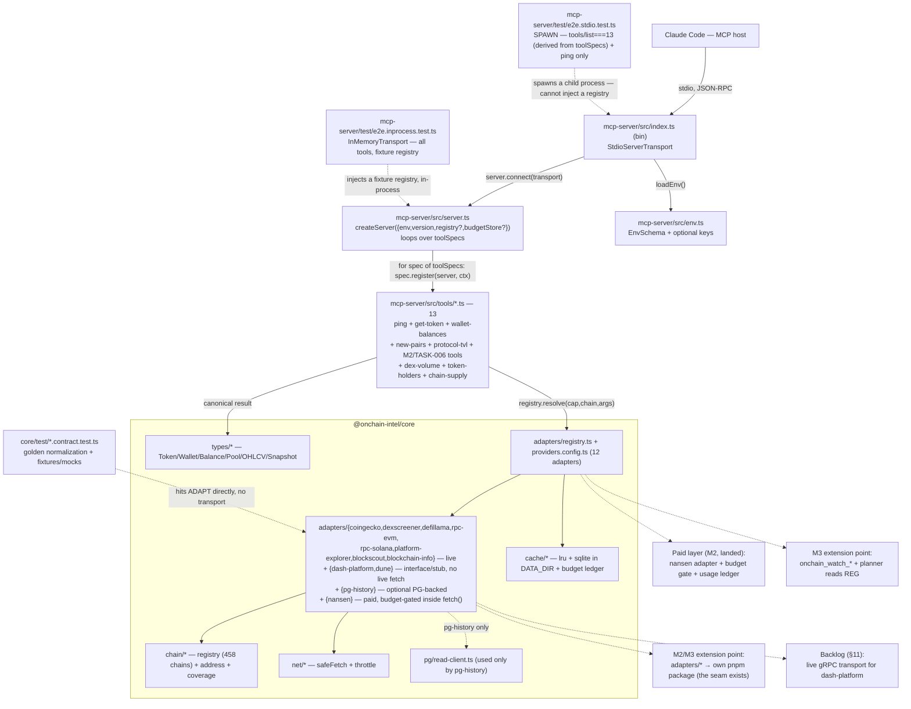

# 3. System architecture

> Part of [docs/ARCHITECTURE.md](../ARCHITECTURE.md).

### 3.1. Architecture style

**Two packages in a pnpm monorepo** — `packages/core` and `packages/mcp-server`. Inside each
package a plain modular structure; no DI containers.

Exactly **one** additional package boundary is drawn (`packages/core`), not the full D12 layout
(`core` + `adapters` + `signals` + `cli` as four packages).

- **Why not a single package (everything inside `mcp-server`).** Canonical types, the chain
  registry, the adapters, the two-level cache, the SSRF gate, the rate limiter and the PG client
  form a domain that is testable without the MCP transport — every D11 contract test hits
  `normalize()`/`fetch()` directly, with no server in the loop. Fusing that domain with the MCP
  wiring would have made the paid layer (M2) and signals (M3) harder: both need
  Registry/Cache/types, neither needs MCP tool registration.
- **Why not four packages up front.** M0 measured the real price of **each** new workspace package
  in this toolchain: its own `tsconfig.json` + `tsconfig.build.json` + `.prettierignore`, because
  resolution is CWD-relative (see `packages/mcp-server/.AGENTS.md`), on top of the TS strict +
  `noUncheckedIndexedAccess` discipline. D12 itself says start minimal and cut along the seams as
  the system grows: `signals`/`cli` have no code until M3 or until needed (R-27). Adapters are not
  a separate package but a module boundary **inside** `packages/core` (`src/adapters/<id>/`) —
  already a D12 seam at the directory level. Promoting them to their own pnpm package later means
  moving a directory and adding a `package.json`, not rewriting code: imports inside `core` already
  go through `adapters/registry.ts`, never directly between adapters.
- **Extra payoff.** `packages/core` needs no tsup — it is a pure library with no `bin`, so its
  `build` is a plain `tsc -p tsconfig.build.json` (NodeNext emit out of the box). That sidesteps
  the tsup/rollup-plugin-dts bug (the TS6/TS7 `baseUrl` conflict recorded in the M0 `.AGENTS.md`)
  instead of reproducing it in a second package: `core` is easier to build than `mcp-server`.

The style is YAGNI applied to boundaries (architecture-design skill, "Simplicity Above All"): the
minimum boundary that makes M1 honest — testable independently of MCP — without forcing a refactor
for the M2/M3 slicing.

### 3.2. System components

#### Component: `@onchain-intel/core`

- **Type:** TypeScript library package (no `bin`), consumed by `mcp-server` through a
  `workspace:*` dependency.
- **Purpose:** canonical types, the chain registry, chain/address normalization, the Adapter +
  Capability Registry, twelve provider adapters (nine landed in M1 — two of them, `dash-platform`
  and `dune`, interface/fixture-only — plus the paid `nansen` from M2, then the free `blockscout`
  from TASK-008 and `blockchain-info` from TASK-009), the two-level cache, the SSRF
  gate, the rate limiter, the credit budget gate, and a read-only PG client (`pg-history` adapter).
- **Technologies:** TypeScript strict, zod, `better-sqlite3`, `lru-cache`, `ulid`, `@noble/hashes`
  (keccak256 for EIP-55 — its only reason for existing here: ADR-001 D5 requires an EVM checksum,
  not just lowercase; §3.2.1), `bs58` (Solana base58 decode/validate — not hand-rolled, because
  address validation is a security boundary), `pg` (the read-only client behind `pg-history`).
  `@grpc/grpc-js` and `@grpc/proto-loader` are **not** dependencies: `dash-platform` is an
  interface + fixture contract with no live transport (below).

**Module: `src/types/*`** (D5, R-1/R-2)

Canonical zod schemas, the single source of truth — used both by runtime validation and by the MCP
tool schemas (re-exported into `mcp-server`):

```ts
// The set of accepted chain values lives in the registry (§3.2, "Module src/chain/registry"), not
// in the type. A closed `z.enum(['ethereum','solana','dash'])` literal had to be edited in five
// layers for every new chain (R-50b).
//
// TWO schemas, deliberately. One schema cannot serve both the input and the canonical output:
//   • on INPUT we must accept anything an agent might write (`ethereum`, `berachain`, `eip155:1`);
//   • on OUTPUT the canonical type must already carry a RESOLVED value — otherwise an alias leaks
//     into the canonical object, from there into the cache key, and one request yields two cache
//     entries (§4.2.2 — a money defect on paid routes, not cosmetics).

// Canonical form — used INSIDE domain types. The canonical value is the chain's SLUG, not its
// CAIP-2 id: R-59d forbids changing the shape of tool responses, and `onchain_get_token` has
// always answered `chain: "ethereum"`. CAIP-2 remains the registry's primary key; the slug is 1:1
// with it, unique, and never an alias — so the §4.2.2 requirement (no alias ever reaches a cache
// key) is met either way.
export const ChainSchema = z.string().min(1);
export type Chain = z.infer<typeof ChainSchema>;

// Input form — used ONLY in MCP tool schemas (§5.1). Accepts slug/alias/caip2. It VALIDATES and
// does not transform: the MCP SDK renders every tool input schema to JSON Schema for `tools/list`,
// and a zod transform has no JSON Schema representation, so a transforming schema makes the server
// answer `tools/list` with `-32603` — taking down tool DISCOVERY, i.e. the whole server. An unknown
// chain fails validation with a "did you mean" list (R-50c), at zero network calls and zero credits.
export const ChainInputSchema = z
  .string()
  .min(1)
  .max(MAX_CHAIN_INPUT_LENGTH)
  .superRefine(assertKnownChain); // registry lookup, skipped entirely for over-length input

// Canonicalization happens one line into each tool handler, still BEFORE the value reaches `args`
// and therefore before `deriveArgsHash`.
export function canonicalizeChain(raw: string, chains?: ChainRegistry): string; // → ChainInfo.slug

export const TokenSchema = z
  .object({
    chain: ChainSchema,
    address: z.string(), // normalized: EVM checksum / Solana base58
    symbol: z.string(),
    name: z.string(),
    decimals: z.number().int().nonnegative().optional(),
    priceUsd: z.number().nonnegative().optional(),
    marketCapUsd: z.number().nonnegative().optional(),
    source: z.string(), // id of the source adapter
    fetchedAt: z.number().int(), // epoch-ms UTC
  })
  .strict();

export const BalanceSchema = z
  .object({
    assetType: z.enum(['native', 'token']), // M1 fills only 'native' — see the ERC-20/SPL decision
    symbol: z.string(),
    decimals: z.number().int().nonnegative(),
    amountRaw: z.string(), // exact integer as a string (DB-SCHEMA §1.7 convention)
    amountNum: z.number().optional(), // lossy projection
    contractAddress: z.string().optional(), // filled when assetType === 'token'
  })
  .strict();

export const WalletSchema = z
  .object({
    chain: ChainSchema,
    address: z.string(),
    balances: z.array(BalanceSchema),
    source: z.string(),
    fetchedAt: z.number().int(),
  })
  .strict();

export const PoolSchema = z
  .object({
    id: z.string(),
    chain: ChainSchema,
    dexId: z.string(),
    baseTokenSymbol: z.string(),
    quoteTokenSymbol: z.string(),
    pairAddress: z.string(),
    createdAt: z.number().int().optional(),
    liquidityUsd: z.number().nonnegative().optional(),
    volume24hUsd: z.number().nonnegative().optional(),
    source: z.string(),
    fetchedAt: z.number().int(),
  })
  .strict();

// Reserved (R-1 requires the type to exist); no tool consumes it yet — the first consumer will be
// a candlestick/chart tool (M1.5+).
export const OhlcvSchema = z
  .object({
    chain: ChainSchema,
    pairAddress: z.string(),
    ts: z.number().int(),
    open: z.number(),
    high: z.number(),
    low: z.number(),
    close: z.number(),
    volumeUsd: z.number().nonnegative().optional(),
    source: z.string(),
  })
  .strict();

// Persistent form of the D5 addendum (snapshotter mode), aligned with DB-SCHEMA-CONCEPT §2. The
// engine does not write it and will not: the snapshotter stays on n8n permanently (owner decision
// 2026-07-25, ADR-001 D8 addendum). The type exists as the canonical form for READING that table
// (R-2/R-12). Name mapping at the persistence boundary (needed on the reading side in M3):
// valueRaw↔value_raw, valueNum↔value_num — every other field matches literally (§4.1, Entity
// Snapshot).
export const SnapshotSchema = z
  .object({
    metric: z.string(),
    asset: z.string(),
    ts: z.number().int(),
    valueRaw: z.string(),
    valueNum: z.number().optional(),
    source: z.string(),
    height: z.number().int().optional(),
  })
  .strict();
```

**Module: `src/chain/registry.ts` + `src/chain/registry.data.json`** (TASK-006, R-48/R-60)

The single source of facts about chains — **458** rows. Data lives in its own `.json`, code in its
own `.ts`: a registry diff (hundreds of lines on every sync) must not be mixed with a logic diff in
review.

```ts
export interface ChainInfo {
  caip2: string; // PK, e.g. 'eip155:80094'
  slug: string; // UNIQUE, e.g. 'berachain'
  name: string;
  family: 'evm' | 'svm' | 'move' | 'cosmos' | 'utxo' | 'other';
  aliases: readonly string[]; // including the legacy 'ethereum'/'solana' (R-59a)
  nativeSymbol: string | null;
  vendors: Readonly<Record<string, string | null>>; // NAMING, not coverage (§4.1, rule 4)
  rpcHosts: readonly string[] | null; // curated SSRF allowlist (§7.2)
  tvlUsdAtSync: number | null; // knowingly stale, only for list_chains
  deprecated: boolean;
}

export interface ChainRegistry {
  resolve(input: string): ChainInfo; // throws UnknownChainError with candidates
  tryResolve(input: string): ChainInfo | null;
  get(caip2: string): ChainInfo | null;
  list(filter?: ChainListFilter): ChainInfo[];
  size(): number;
}

export function loadChainRegistry(deps?: { data?: unknown }): ChainRegistry; // validates at startup
```

- **Resolution is a pure function with no network.** Order: exact `caip2` → `slug` → `aliases` →
  normalized form (lowercase, `[^a-z0-9]` collapsed). A miss raises `UnknownChainError` with
  candidates by Levenshtein distance over `slug ∪ aliases` (R-50c). A miss costs zero network calls
  and zero credits, which matters more than convenience: misses happen most often on the paid route,
  where an agent is guessing a chain name.
- **Indexes** (in memory, built once at load): `Map<caip2>`, `Map<slug>`, `Map<alias>`. Resolution
  is O(1) on an exact match; the O(n) "did you mean" path runs only while building an error. 458
  rows are tens of kilobytes — there is no scaling question here, and none is coming (even the 2660
  EVM chains of `chainid.network` would be single-digit megabytes).
- **Injection (`deps.data`)** is the same DI pattern as `CacheStore`/`BudgetStore`: tests load a
  small synthetic registry instead of the production one, touching no filesystem. The registry is a
  **factory, not a module singleton** (§8 already requires that of
  `CapabilityRegistry`/`SqliteCacheStore`).
- **Startup validation (R-60c):** `caip2`/`slug` uniqueness, global non-overlap of `aliases`, CAIP-2
  format, non-empty `name`. A violation throws at load, not on the first request. Degrading to an
  empty registry is forbidden (§4.2.1).

**Module: `scripts/sync-chain-registry.ts`** (dev-only, TASK-006, R-49)

- **Not part of the runtime build** and imported by no module under `src/` — it is a dev script the
  operator runs by hand (TASK-006 UC-4). A test asserts that `src/` contains no imports from
  `scripts/`; otherwise the offline gate (R-60a) could be broken unnoticed.
- **Sources and join keys** (all three keyless; live probe 2026-07-26, evidence in
  [raw/chain-registry-probe-2026-07-26.json](../onchain-analytics/raw/chain-registry-probe-2026-07-26.json)):

  | Source                             | Provides                                              | Join key                                                                                                |
  | ---------------------------------- | ----------------------------------------------------- | ------------------------------------------------------------------------------------------------------- |
  | DeFiLlama `/v2/chains` (461)       | `name`, `tvlUsdAtSync`, `gecko_id`                    | — the base list                                                                                         |
  | CoinGecko `/asset_platforms` (461) | `coingecko` platform id, `chain_identifier` (EIP-155) | `defillama.gecko_id` → `coingecko.native_coin_id` (**235** matches, an explicit vendor cross-reference) |
  | `chainid.network` (2660)           | `nativeCurrency`, `rpcHosts` candidates               | `coingecko.chain_identifier` → `chainId` (**257 of 270**)                                               |

  The registry ends at **458** rows: the vendor catalogs list 461 each, and testnet rows are
  excluded after the join.

- **The fuzzy key (normalized name, 255 matches) is a fallback only, and it MUST be visible.** Rows
  glued by name land in a separate section of the diff report and require a commit confirmed by
  eye. A silent fuzzy join is exactly the class of error that later surfaces as "TVL of the wrong
  chain", with nothing left to find it by.
- **Determinism (R-49c):** stable sort by `caip2`, no timestamps **inside** the file (the sync date
  lives in a separate header meta field that changes only when the data actually changes), stable
  key order. The acceptance criterion is that two consecutive runs produce a byte-identical file.
- **Failure behaviour (R-49e):** if any of the three sources is unavailable, exit loudly with a
  non-zero code and **write no file**. A partially written registry is worse than a missing one: it
  passes validation and silently narrows the world.
- **Vanished chains (R-49f):** never deleted, marked `deprecated: true`. Deleting would break
  resolution of already-stored references, and "the chain died" is indistinguishable from "the
  vendor did not return it this time" from the outside.

**Module: `src/chain/coverage.ts`** (TASK-006, R-51)

Implements `covered(capability, chain)` from §4.2.3 — the composition of `routes` ×
`adapter.chainSupport()`. The text of `CapabilityNotCoveredOnChainError` is built here too: both
lists (chains for a capability, capabilities for a chain) are computed from those same two sources,
so they cannot drift away from actual behaviour.

**The call site is money-critical (R-51d).** The coverage check runs inside
`CapabilityRegistry.resolve()` **before** the adapter is touched — before the budget gate and
before HTTP. The gate order on a paid route:

```
resolve(capability, args)
  → 1. resolve chain against the registry  (no network, no money)
  → 2. check coverage of the pair          (no network, no money)
  → 3. cache lookup                        (no network, no money)
  → 4. adapter.isAvailable()               (no network, no money)
  → 5. budget gate: check + reserve        (money is reserved)
  → 6. adapter.fetch()                     (network, money is spent)
```

The coverage gate must sit **above** step 5: growing the chain set from 2 to 458 multiplies the ways
to miss coverage, and if a miss cost a credit reservation, the expansion itself would become a
spending vector (NFR, TASK §7). This also removed a whole class of knowingly useless calls from the
paid path — part of the surface **SEC-1** described before the velocity guard existed. SEC-1 is
closed: credits per window, checked in the same transaction as the daily reservation (see "Two
second denominators" below).

#### 3.2.1. Address/chain normalization (`src/chain/address.ts`)

- **EVM:** the canonical form is the **EIP-55 checksum**, not lowercase (ADR-001 D5 requires the
  checksum). Algorithm: `keccak256` of the lowercase hex address (without `0x`, as ASCII bytes);
  for each hex character of the source lowercase address, upper-case it if the corresponding nibble
  of the hash is ≥ 8, lower-case it otherwise. This is a **pure function of the address bytes**: any
  input casing yields the **same** checksum result, so cache keys and storage are deterministic
  automatically and no separate "lowercase for keys" form is needed.
- **Solana:** the canonical form is **as-is** (base58 is case-sensitive: lowercasing would corrupt
  the address, unlike hex). Validation: base58 decoding succeeds **and** the decoded length is
  **exactly 32** bytes (a Solana address is a raw ed25519 pubkey, with no version/checksum bytes,
  unlike Bitcoin base58check).
- **Dash:** present in the registry vocabulary for consistency with `assets.chain_family` from
  DB-SCHEMA, but the `Wallet`/`Balance` types are not used for it — dash-platform returns
  `Snapshot`, not `Balance` (§2.1).
- **One point of use:** both the MCP tool input schemas (`superRefine` calls
  `isValidAddress(chain, address)`) and the adapters (`normalizeAddress` before `fetch` / before
  building the cache key) go through this single module; nothing is duplicated.

**Branching is by `family`, not by chain name (R-55).** `switch (chainInfo.family)` replaced
`switch (chain)` over the `'ethereum' | 'solana' | 'dash'` literals. The bodies of the `evm`/`svm`
branches did not change by a single line — the same EIP-55 and base58+32 bytes, the same tests
(R-55d). Only the reach changed: one `evm` branch now serves all 270+ EVM chains instead of one.

| `family`                             | Validation                            | Canonicalization        |
| ------------------------------------ | ------------------------------------- | ----------------------- |
| `evm`                                | 40 hex characters (with/without `0x`) | EIP-55 checksum         |
| `svm`                                | base58 decodes to exactly 32 bytes    | as-is                   |
| `move` / `cosmos` / `utxo` / `other` | **no validator** — accepted as-is     | **no canonicalization** |

**A missing validator is not a refusal of service on free routes (R-55c).** For a family with no
validator the address is accepted and passed to the vendor as-is; "address not found" from the
vendor is a normal answer, not a bug of ours. The opposite behaviour would mean we do not support a
chain until we write an address parser for it — exactly the "chain = code" coupling the registry
removes.

**On paid routes it is a refusal (OQ-1, revised 2026-07-27).** A paid call on a family with no
validator spends credits on a string we never checked, and a vendor's "not found" is then
indistinguishable from our own garbage input. Paid capabilities therefore refuse on any family
other than `evm`/`svm`; writing a validator for a family is the prerequisite for paid coverage
there, not an optimization.

**The price of no canonicalization, stated explicitly:** the cache key is built from the source
string, so the same address written in different casing produces **two** cache entries. That is a
loss of cache efficiency, **not** of correctness (the answers are identical).

**Module: `src/adapters/*`** (D4, R-3, R-5…R-11)

```ts
export interface CapabilityDescriptor {
  id: string; // 'token.price' | 'wallet.balances.native' | 'pairs.new' | ...
  chains?: Chain[]; // absent = the capability is not bound to a specific chain
}

export interface ProviderAdapter {
  id: string; // D4: an explicit id field
  capabilities(): CapabilityDescriptor[];
  costOf(cap: string, args: Record<string, unknown>): { credits: number };
  fetch(cap: string, args: Record<string, unknown>): Promise<unknown>;
  normalize(cap: string, raw: unknown): unknown; // narrowed by the adapter internally
  isAvailable?(): { ok: true } | { ok: false; reason: string }; // env/key readiness, R-24

  // "Can I serve this chain FOR THIS CAPABILITY" — a PREDICATE over ChainInfo, not a list
  // (R-51a/R-54c). A list would have to be kept in sync with the registry; a predicate cannot drift
  // from it. The second parameter is load-bearing: coverage is a property of the PAIR, not of the
  // adapter — `nansen` serves different chain sets per capability (17/25/25), and `defillama`
  // covers `dex.volume.history` on a narrower set than `chain.tvl`.
  // Absent ⇒ the adapter is not chain-bound (see CapabilityDescriptor.chains).
  chainSupport?(chain: ChainInfo, capability: string): boolean;
}
```

**Adapters hold no private vendor chain maps (R-54).** Each of these was a private copy of chain
knowledge, with its own `SupportedChain` type duplicating the `chains:` literals of
`providers.config.ts`:

| Adapter       | Removed                                                                         | Replaced by                                                                           |
| ------------- | ------------------------------------------------------------------------------- | ------------------------------------------------------------------------------------- |
| `defillama`   | `type SupportedChain`, `CHAIN_TVL_KEY = {ethereum:'Ethereum', solana:'Solana'}` | `chain.vendors.defillama`                                                             |
| `dexscreener` | `type SupportedChain`, `NATIVE_QUERY = {ethereum:'ETH', solana:'SOL'}`          | `chain.nativeSymbol` (R-57a) + `chain.vendors.dexscreener` for the client-side filter |
| `nansen`      | `type NansenChain = 'ethereum' \| 'solana'`                                     | `chain.vendors.nansen` + `CoverageProbe` (§4.2.3)                                     |
| `coingecko`   | inline check `chain !== 'ethereum' && chain !== 'solana'`                       | `chain.vendors.coingecko` (platform id straight into the URL)                         |
| `rpc-evm`     | check `chain !== 'ethereum'` + hosts from `adapterRegistrations`                | `chain.family === 'evm'` + `chain.rpcHosts` (§7.2)                                    |

**The anti-corruption layer (D4) is not weakened by this.** The registry hands the adapter a vendor
**key** — a short identifier string — and nothing else. Vendor DTOs still never leak outward,
`normalize()` remains the single narrowing point (R-54d), and the dependency direction does not
invert: the adapter reads the registry, the registry knows nothing about adapters.

**Capability Registry** (`src/adapters/registry.ts`) routes on `(capability, chain)`:

```ts
export interface CapabilityRoute {
  capability: string;
  chains?: Chain[]; // declared but set by NO route since TASK-006; ADR-002 D2 removes it
  adapterIds: string[]; // order = priority + fallback chain (R-11)

  // Cross-provider policy: "is this answer enough, or should the walk continue" (TASK-008, H-1).
  // It lives on the ROUTE, not inside a provider: an adapter that knows who stands behind it
  // cannot be developed or deployed on its own. Applied to cache hits too, or shadowing returns
  // through the cache. PROVISIONAL — ADR-002 D2 replaces the function with a serialisable
  // descriptor resolved against a registry of policy classes in core.
  isSatisfying?: (result: unknown) => boolean;
}

export class CapabilityRegistry {
  resolve(
    capability: string,
    chain: Chain,
    args: Record<string, unknown>,
  ): Promise<{ result: unknown; source: string; cache: 'hit' | 'miss'; ageMs?: number }>;
  // If every adapter on the route is unavailable, throws CapabilityUnavailableError listing
  // (adapterId, reason) — never a silent empty answer (R-24). If the current adapter's
  // fetch/normalize fails, moves on to the next id in adapterIds (R-11 hot-swap) instead of
  // failing the whole call.
  //
  // Cache-fault contract — TWO different contracts. A fetch/normalize error means "this adapter
  // could not answer, try the next one" (recorded in `tried`). A cache.get()/set() error is ALWAYS
  // best-effort, never fatal, never a CapabilityUnavailableError: a get() throw is logged and
  // treated as a miss; a set() throw is logged in its OWN nested try/catch (not in `tried`, does
  // not trigger fallback) and the already-fetched result is still returned as 'miss'.
}
```

`providers.config.ts` holds the declarative routes plus the adapter registry (id →
hosts/rate-limit/env):

**The route table is NOT reproduced here.** `providers.config.ts` holds **21 routes** over 20
distinct capabilities, and the authoritative list is that file — a copy in this document is a copy
that drifts, which is exactly what happened between TASK-006 and TASK-010 (WI-24: this section
carried `chains:` literals for fourteen routes months after they were deleted from the code, and
was missing four routes that existed). What belongs here is the **shape and the rules**, which do
not change per route:

```ts
export const routes: CapabilityRoute[] = [
  // The ordinary shape: one capability, one adapter. NO `chains:` literal — coverage comes from
  // `chainSupport` (§4.2.3), and a literal here would be a second, drifting answer to the same
  // question. Removed from every route in TASK-006; ADR-002 D2 removes the field itself.
  { capability: 'token.price', adapterIds: ['coingecko'] },

  // Two adapters, ordered. Order IS the spend rule, not a preference hint (R-11): a credit is
  // spent only when the free source cannot answer. `isSatisfying` refines it — without the
  // policy an EMPTY free answer would end the walk and shadow the paid source for a whole TTL.
  { capability: 'entity.labels', adapterIds: ['blockscout', 'nansen'], isSatisfying: /* … */ },

  // Two free adapters, one live vendor view + our own snapshotter history. This is the pair
  // ADR-002 D6 turns on merging for FIRST, because `Snapshot` has a legitimate identity key
  // (metric/asset/ts) and both sides are free.
  { capability: 'privacy.shielded_pool.history', adapterIds: ['platform-explorer', 'pg-history'] },

  // Same capability, two routes rather than one route with two ids: the adapters serve DISJOINT
  // chain families, so the split is what keeps `chainSupport` the only chain authority.
  { capability: 'wallet.balances.native', adapterIds: ['rpc-evm'] },
  { capability: 'wallet.balances.native', adapterIds: ['rpc-solana'] },
];
```

Two absences in that file are decisions, not omissions, and both are recorded beside the routes
they concern: `mempool.space` is deliberately **not** an adapter (it is the eval's independent
reference — a source we answer from cannot also be the check on that answer, §5.1.5/R-89), and
`dune` is registered but permanently unavailable (`isAvailable()` → `{ok: false}`), so its
capabilities are advertised by nobody.

export const adapterRegistrations: AdapterRegistration[] = [
{
id: 'coingecko',
hosts: ['api.coingecko.com', 'pro-api.coingecko.com'],
rateLimit: { capacity: 10, refillPerSec: 0.5 },
requiresEnv: [],
},
{
id: 'dexscreener',
hosts: ['api.dexscreener.com'],
rateLimit: { capacity: 5, refillPerSec: 1 },
requiresEnv: [],
},
{
id: 'defillama',
hosts: ['api.llama.fi'],
// Raised from the M1 placeholder {capacity: 5, refillPerSec: 1} in TASK-007 (R-66). That value
// was OUR brake, not the vendor's: the vendor publishes no numeric limit at all, and a live
// cache-busted probe took 40 CONCURRENT origin requests with 40/40 HTTP 200 and zero 429s. At
// 5/1 a ten-chain sweep — the DoD this capability was built against — spent ~5s asleep in our
// own limiter, and a wide sweep would cross the 30s MAX_WAIT_MS fairness cap and start throwing.
rateLimit: { capacity: 10, refillPerSec: 5 },
requiresEnv: [],
},
// interface/config stub — isAvailable() returns false unconditionally (see below):
{
id: 'dune',
hosts: ['api.dune.com'],
rateLimit: { capacity: 2, refillPerSec: 0.1 },
requiresEnv: ['DUNE_API_KEY'],
},
{
id: 'rpc-evm',
hosts: ['ethereum-rpc.publicnode.com', 'eth.drpc.org'],
rateLimit: { capacity: 5, refillPerSec: 1 },
requiresEnv: [],
},
{
id: 'rpc-solana',
hosts: ['api.mainnet-beta.solana.com'],
rateLimit: { capacity: 5, refillPerSec: 1 },
requiresEnv: [],
},
// No live host: interface + fixture contract only. Hosts get filled in when the deferred live
// gRPC transport lands (§11):
{ id: 'dash-platform', hosts: [], rateLimit: { capacity: 5, refillPerSec: 1 }, requiresEnv: [] },
{
id: 'platform-explorer',
hosts: ['platform-explorer.pshenmic.dev'],
rateLimit: { capacity: 5, refillPerSec: 1 },
requiresEnv: [],
},
// Not an HTTP host: the Postgres wire protocol. The DSN itself is the access control, not a
// hostname allowlist. Registered here SOLELY for the providers FK (§4.2).
{
id: 'pg-history',
hosts: [],
rateLimit: { capacity: 2, refillPerSec: 0.2 },
requiresEnv: ['ONCHAIN_PG_URL'],
},
// R-73 (TASK-008). ONE host. The two-host design this comment used to describe was reverted in
// adversarial cycle 1 — the direct `api.blockscout.com` enforces auth (402 with no key) and
// `token.holders` has no fallback adapter, so on a stock install it was advertised on 39 chains
// and served on none. The stale host then survived in the allowlist on the argument that it
// "costs nothing"; vdd-multi removed it, because `safeFetch` re-checks every REDIRECT hop against
// this list, so an allowlisted host we never call is still a host a misbehaving facade can bounce
// us to — and here the allowlist is the only egress control there is.
//
// `requiresEnv` stays EMPTY on purpose: the facade answers without a key today, so demanding one
// would disable a working capability. The key is read inside fetch(), like COINGECKO_* — after
// the cache key is derived, so it can never enter it.
// `refillPerSec: 2`, not the 5 R-73(b) prescribed: DEFENSIVE, not measured. The vendor sends no
// `RateLimit-*` header at all, so there is nothing to calibrate against, and the thing that runs
// out is CREDITS, not requests — `get_address_info` fans out to three upstreams (~160 credits of
// 100K/day ⇒ a ceiling near 625 calls/day), which 5 RPS would burn in ~125 seconds.
{
id: 'blockscout',
hosts: ['mcp.blockscout.com'],
rateLimit: { capacity: 5, refillPerSec: 2 },
requiresEnv: [],
},
// R-81 (TASK-009) — keyless, no account, no secret of any kind. ONE host: `blockchain.info` and
// `api.blockchain.info` were measured to serve `/q/*` and `/stats` identically (2026-07-29), so a
// second entry would widen the redirect-hop allowlist (the L-4 lesson from `blockscout`) and buy
// nothing. The limiter is defensive for the same reason as `blockscout`'s: no `RateLimit-*`, no
// `Retry-After`, no documented number — five rapid probes returned 200 and that is ALL we know.
{
id: 'blockchain-info',
hosts: ['blockchain.info'],
rateLimit: { capacity: 5, refillPerSec: 1 },
requiresEnv: [],
},
];

````

**Chain scoping is a derived value, not a literal.** The `chains:` arrays above are the committed
form of the routes; they are not the authority on which chains a capability serves. The registry
resolves the chain, and `covered(capability, chain)` (§4.2.3) composes the route with the adapter's
`chainSupport()` predicate over `ChainInfo` — that composition is the coverage matrix. A hand-kept
list would have to track 458 registry rows; a predicate cannot drift from them.

Rate-limit values are conservative starting points (not vendor-documented limits, except for the
Dune credits) and can be tuned by editing the config, with no change on the calling side (R-4).

**The adapters — summary.** Nine from M1, `nansen` from M2, `blockscout` from TASK-008,
`blockchain-info` from TASK-009 — **twelve registered, of which eleven serve something**: `dune`
remains a config stub whose `isAvailable()` is unconditionally `false`.

| id                  | Capabilities                                                   | Transport                                                                                                            | Key                                                                                                                    | Note                                                                                                                                          |
| ------------------- | -------------------------------------------------------------- | -------------------------------------------------------------------------------------------------------------------- | ---------------------------------------------------------------------------------------------------------------------- | --------------------------------------------------------------------------------------------------------------------------------------------- |
| `coingecko`         | `token.price`, `token.metadata`                                | REST (`fetch`), `/coins/{platform}/contract/{address}`                                                               | optional `COINGECKO_API_KEY` (demo; free works without) / `COINGECKO_PRO_API_KEY` (Pro circuit: pro host + pro header) | R-5, **live**                                                                                                                                 |
| `dexscreener`       | `pairs.new`, `pool.info`                                       | REST (`fetch`)                                                                                                       | none (keyless)                                                                                                         | R-6 Must requires both; `pool.info` has no tool consumer yet; exact endpoint confirmed when the fixture is recorded (R-22), §11; **live**     |
| `defillama`         | `protocol.tvl`, `chain.tvl`, `dex.volume.history`              | REST (`fetch`), `/protocol/{slug}`, `/v2/chains`, `/overview/dexs/{chain}`                                           | none (keyless)                                                                                                         | R-7, R-53, **R-61 (TASK-007)**, **live**                                                                                                      |
| `dune`              | **none** (config stub; `token.holders` moved away in TASK-008) | REST Query API — **not implemented** (interface/config stub)                                                         | `DUNE_API_KEY` (free tier), but `isAvailable()` is unconditionally `false`                                             | R-8, decision below. Until TASK-008 it _declared_ `token.holders` while covering zero chains — an advertised capability that answered nowhere |
| `blockscout`        | `token.holders`, `entity.labels`                               | REST (`fetch`), the **facade** `mcp.blockscout.com/v1/<tool>` for both — the two-host design was reverted, see below | optional `BLOCKSCOUT_PRO_API_KEY`, passed as the **`apikey` query parameter** (not a header)                           | **R-73..R-80 (TASK-008)**, **live**                                                                                                           |
| `blockchain-info`   | `chain.supply` (bitcoin only)                                  | REST (`fetch`), `/stats` + `/q/totalbc`                                                                              | **none, and none possible** — the vendor offers no key for these surfaces                                              | **R-81..R-87 (TASK-009)**, **live**                                                                                                           |
| `rpc-evm`           | `wallet.balances.native` (EVM)                                 | JSON-RPC `eth_getBalance` (`fetch`)                                                                                  | none (keyless)                                                                                                         | R-16/R-17, **live**                                                                                                                           |
| `rpc-solana`        | `wallet.balances.native` (Solana)                              | JSON-RPC `getBalance` (`fetch`)                                                                                      | none (keyless)                                                                                                         | R-16/R-17, **live**                                                                                                                           |
| `dash-platform`     | `privacy.shielded_pool`, `platform.*`                          | **gRPC** — **not implemented** (interface + fixture contract only)                                                   | none (keyless), but unreachable                                                                                        | R-9 via a mock; see below                                                                                                                     |
| `platform-explorer` | the same (fallback) + `*.history`                              | REST (`fetch`)                                                                                                       | none (keyless)                                                                                                         | R-10/R-11, **the only live Dash source**                                                                                                      |
| `pg-history`        | `privacy.shielded_pool.history`, `platform.metrics.history`    | Postgres wire (SELECT-only)                                                                                          | `ONCHAIN_PG_URL` (optional)                                                                                            | R-12, **live, optional**                                                                                                                      |

**Input/response hardening per adapter — never trust a raw vendor response.**

- `rpc-evm`: the hex guard is `/^0x[0-9a-fA-F]+$/`, requiring at least one hex digit after `0x`.
  A bare `"0x"` otherwise produced a raw `BigInt("0x")` `SyntaxError` instead of a legible error.
- `rpc-solana`: `result.value` (lamports) is validated as a non-negative safe integer
  (`Number.isInteger && >=0 && <=Number.MAX_SAFE_INTEGER`) before `String()`. Documented default:
  a balance above ~9.007M SOL has already lost precision at `response.json()` — the vendor returns
  `result.value` as a JSON number, not a hex string as `eth_getBalance` does — so exact parsing of
  large values is out of scope here.
- `dexscreener.normalize()`: skip-and-log. Each candidate `Pool` is validated independently
  (`PoolSchema.safeParse`); a malformed one is dropped rather than failing the whole batch, with a
  single stderr line carrying the count. It throws only when **every** candidate in the batch is
  malformed — otherwise an empty `Pool[]` would be indistinguishable from "there are no new pairs
  right now" (R-24).
- `defillama.normalize()`: rejects non-finite/negative `tvlUsd`/`totalTvlUsd` **before** it reaches
  the cache; otherwise `onchain_protocol_tvl`'s own `.nonnegative()` schema would meet an already
  cached broken value.
- `defillama.normalize('dex.volume.history')` (TASK-007, R-68): **verifies the response's own `chain`
  echo field against the vendor name that was requested**, and refuses the response otherwise. This
  is not defensive decoration — it is forced by measured vendor behaviour: `/overview/dexs/{chain}`
  is name-tolerant (`op-mainnet`, `optimism` and `OP Mainnet` all return the same document), an
  unknown chain answers **HTTP 500**, not 404, and a chain outside the vendor's own `allChains` list
  answers **HTTP 200 with zeros and a narrower key set** (`litecoin`, probed 2026-07-27). Without the
  echo check, "the vendor served a different chain than we asked for" and "this chain has no volume"
  are the same observation. The same normalize step rejects non-finite/negative volumes and
  non-integer timestamps before the cache write, and passes **no vendor free text through at all**:
  the document carries 151 protocol cards with `name`/`category`/`methodology`/`logo`, which are
  third-party-editable strings, and none of them reach the tool output.

  **That last rule holds on the ERROR path too, which is where it was first broken** (adversarial
  cycle 3). A `normalize()` throw becomes `tried[].reason` inside `CapabilityUnavailableError` and
  from there the tool's `isError` text — i.e. it lands in the model's context, and because
  `normalize()` failures are negative-cached it is replayed for the whole negative TTL with no
  further network traffic. The first version interpolated the vendor's value verbatim into three
  such messages, bounded only by the 2 MB body cap. Vendor values are now **described, never
  echoed** (`string(length=N)`, `array(length=N)`, or the number itself — a number cannot carry
  instructions), which is the discipline `stringifyTruncated` and `UnknownChainError` already
  encoded elsewhere in this codebase.

- Both RPC adapters truncate error messages through the shared
  `src/adapters/stringify-truncated.ts` (500 characters + `…[truncated]`), so a raw JSON-RPC
  envelope cannot land in `Error.message` in full, up to `safeFetch`'s 10MB cap.

- `blockscout.normalize()` (TASK-008, R-76): the vendor ships fields **addressed to a language
  model**, so the response passes through a mandatory sanitizer before anything else looks at it.
  This is a stronger requirement than the `defillama` rule above, and for a different reason: there
  the risk was third-party-editable strings that _happen_ to reach a model; here the vendor
  **intends** them to. `get_address_info` returns `instructions` — measured 2026-07-28 as seven
  imperatives of the form "This is only the native coin balance. **You MUST also call**
  `get_tokens_by_address`…", with the caller's own address interpolated verbatim — alongside `notes`
  and `data_description`. These three are **dropped, never truncated**: a truncated instruction is
  still an instruction. Label text that we do keep (`tags[].name`, `meta.main_entity`, `slug`) goes
  through `truncate-vendor-text`; the URL-valued fields (`tooltipUrl`, `tagIcon`,
  `tooltipAttribution`) are not emitted at all, since a URL in a model's context is a fetch
  suggestion.

- `blockchain-info.normalize()` (TASK-009, R-84/R-85): the vendor's two supply surfaces are **two
  different quantities, both correct**, and the adapter's job is to keep them from being mistaken
  for one another. Measured 2026-07-29 by a test that settles it without appeal — how many whole
  block subsidies fit between the value and the halving boundary at block 840 000:

  | surface          | subsidies past the boundary | therefore                                             |
  | ---------------- | --------------------------- | ----------------------------------------------------- |
  | `/stats.totalbc` | `120102` — **integer**      | the halving formula itself ⇒ **theoretical emission** |
  | `/q/totalbc`     | `120092.8` — **fractional** | cannot be the formula ⇒ **actually-claimed supply**   |

  The gap (28.75–31.88 BTC, ~0.00016%) is coinbase subsidy miners never claimed. A stale copy of the
  formula would sit at an INTEGER offset; a fractional one cannot. So `emission` and `circulating`
  are separate fields with separate names, and `normalize()` enforces the consensus invariant
  **`circulating ≤ emission`** — you cannot claim more than the subsidy — refusing the response
  rather than serving a number it cannot justify.

  Values are carried as **satoshi strings** through `bigint`, never `number` (DB-SCHEMA §1.7). They
  fit a double _today_, which is exactly the reasoning that rots: the rule is that the value is an
  exact integer, not that it currently happens to be small enough.

**🔴 Verifying supply against the formula is a TAUTOLOGY — the height is what carries information.**
This is the load-bearing insight of TASK-009 and the reason its cross-check is shaped the way it is.
`consensusEmission(n_blocks_total) === totalbc` held **bit-exactly at both probed heights**, and it
will keep holding for as long as the vendor computes the field the same way we do. A check that
cannot fail is not a check. What a second source can genuinely contradict is the **block height** —
so the eval compares our answer's height against `mempool.space` and lets the deterministic formula
propagate that into supply (§5.1.5). The delta is expressed in **blocks of subsidy, never percent**:
one block is 0.000016%, so an off-by-one and a full day of vendor staleness (144 blocks, 0.0023%)
both round to "zero" on any percentage scale a human would pick.

**Two hosts measured, one host used (TASK-008).** The vendor exposes the same data through two
hosts with materially different properties. The measurement below is what made the choice, and it is
kept because the rejected branch is the one a future reader will be tempted to re-propose:

|                        | `api.blockscout.com/<chain_id>/api/v2/…`                  | `mcp.blockscout.com/v1/<tool>`                        |
| ---------------------- | --------------------------------------------------------- | ----------------------------------------------------- |
| auth                   | enforced — real key 200, bogus **401**, absent **402**    | ignored (grace period; a bogus key still returns 200) |
| address labels         | **absent** (`metadata: null` even for Binance Hot Wallet) | present (`data.metadata.tags[]`)                      |
| `instructions`/`notes` | absent                                                    | present                                               |
| upstream cost          | one                                                       | fans out to three (~160 credits)                      |

Both capabilities use the **facade**. Holders were briefly routed to the direct host (cheaper, no
injection wrapper, key verifiable) until adversarial review pointed out the consequence: that host
answers **402 without a key**, `token.holders` routes to `['blockscout']` alone with nothing to
degrade to, and a stock install ships no key — so the capability was advertised on 39 chains and
served on none, which is the very defect this task removed from `dune`. Labels have no alternative
in any case: the enrichment is exactly what the three-way fan-out buys. The expensive path and the useful path are the same path; that is the trade, and it is
why the ~625 calls/day ceiling (not ~5 000) is a design input rather than a footnote.

**The key travels in the URL, which D10 forbids for logs and cache keys.** `apikey` is a query
parameter, not a header — this is the case `rpc-solana` anticipated when it chose to report
`hostOf(endpoint)` instead of the full URL, "because a curated endpoint could one day carry a key in
its path or query". That day arrived. Consequences, each of which is a test rather than an
intention: the full URL never reaches `Error.message`, stderr, or the cache key; the cache key is
derived from `(provider, capability, normalizedArgs)` and the key is not an arg; and `safeFetch`'s
own error path already reports host-only.

**Coverage is keyed on the numeric `chain_id`, never on `ecosystem` or chain name.** The vendor's
`get_chains_list` carries an `ecosystem` field that reads like a family and is not one:
`ecosystem: "Solana"` is Neon (an **EVM** chain, id 245022934) and `ecosystem: "Bitcoin/BCH"` is
Rootstock (an **EVM** sidechain, id 30). All 100 ids are numeric, i.e. the whole list is EVM.
Mapping `ecosystem → family` would advertise `svm`/`utxo` coverage that does not exist — the H-1
defect class from TASK-006, and the same over-claim `dex.volume.history` was built to avoid. The
generated coverage list also drops the 47 testnets.

**`dash-platform` is narrowed to an interface + fixture contract.** A live gRPC transport is the
most expensive and least repaid item on the critical path: no tool consumes it (OQ-2 below), the
evonode host is unverified (§11), and `privacy.shielded_pool`/`platform.*` are already fully
covered by `platform-explorer` (keyless REST). So: `capabilities()` declares all five capabilities
(`privacy.shielded_pool` + `platform.identities/contracts/documents/credits`, R-9); `normalize()`
is implemented and golden-tested against a **hand-built** fixture whose shape is taken from the
addendum fields (`getShieldedPoolState`/`getTotalCreditsInPlatform`) — R-9 satisfied through a mock,
not a live probe; `fetch()` is a stub (`NotImplementedInM1Error`) and is unreachable at runtime
because `isAvailable()` cuts the adapter off earlier. `isAvailable()` **unconditionally** returns
`{ ok: false, reason: 'dash-platform live transport deferred — see backlog, use platform-explorer' }`
— not "if the evonode is down", always — so the Registry **always** routes
`privacy.shielded_pool`/`platform.*` to `platform-explorer`. That is not a simulated hot-swap kept
around for show but a real, permanently active fallback path that exercises the Registry mechanism
(R-11) on every run. The live gRPC transport is a separate backlog item (§11): vendoring the
`.proto`, `@grpc/grpc-js` + `@grpc/proto-loader`, a concrete evonode host (live probe), and a
channel-level `assertAllowedHost()`. When it lands, `isAvailable()` becomes a conditional check
without changing the `ProviderAdapter` contract outward.

**`platform-explorer` is the only live Dash source.** It implements the same capability surface as
`dash-platform` (REST, keyless, always available) **and** its own history method (R-10) — used
first on the history routes (`privacy.shielded_pool.history`/`platform.metrics.history` above), not
only as a fallback for live state.

**dash-platform / platform-explorer / dune get no tool of their own (OQ-2).** The ROADMAP names
exactly four MCP tools for M1, none of them about Platform metrics or holder statistics. The
Registry registers the capabilities and covers them with contract tests where they exist (R-9/R-10/
R-11 via `platform-explorer` + the `dash-platform` mock). The first real **consumer** tool for
Platform metrics arrives in M3 (privacy rules), and for `token.holders` in M2
(`onchain_token_risk`).

**`dune` — the R-8 resolution: an interface/config stub, narrower than the literal acceptance
text.** `capabilities()` declares `token.holders` (holder count + top-10 concentration — a
capability none of the other eight M1 adapters covers); `fetch()`/`normalize()` are **not**
implemented (fixture-less — there is nothing to golden-test before the query is authored);
`isAvailable()` returns `{ ok: false, reason: 'dune query authoring deferred to M2' }`
unconditionally, regardless of `DUNE_API_KEY`. Authoring a live Dune SQL query (query id,
parameterization) moves to M2 together with its first real consumer (`onchain_token_risk`). None of
the four Must tools depends on `token.holders`, so an empty `.env` stays fully functional (UC-1)
regardless of this decision.

**ERC-20/SPL balances are out of scope.** `onchain_wallet_balances` fills only
`assetType: 'native'` (native ETH/SOL through `rpc-evm`/`rpc-solana`). Token balances require
**either** per-contract `eth_call`/`getTokenAccountsByOwner` over an unbounded set of contracts
(which needs a source of "which tokens to check" — not a trivial question at $0), **or** an
indexer/multicall service (usually paid, or not reliable enough keyless), **or** Dune (credits plus
latency). R-17 acceptance stops at "the contract is fixed, ≥2 chains actually work", which the
native balance closes cheaply. `BalanceSchema` already carries `assetType`/`contractAddress`
precisely so that M1.5/M2 can add ERC-20/SPL **without** a schema change — only by appending rows
to the `balances` array. Recorded as a backlog work item.

**The tenth adapter (M2, TASK-005 `m2-alpha-paid`, R-29/R-30): `nansen`, the first paid adapter.**
Three capabilities — `smart-money.flows`, `entity.labels`, `token.risk` — over the REST API at
`api.nansen.ai`, **not** through Nansen's official MCP server (`mcp.nansen.ai/ra/mcp`, 37 tools;
owner decision, TASK.md §1.2): several of its tools return markdown text, which is unusable for
canonical zod normalization (D5), and proxying would bypass our own cache, budget and SSRF gate.
The only sources for response shape and price are `nansen-probe-2026-07-23.json` (a live `/account`
call plus `credit_cost_table`) and `nansen-openapi-2026-07-23.json` (75 paths, request/response
contracts); TASK.md §7 forbids inventing anything beyond them.

_Registration (`providers.config.ts.adapterRegistrations`, the tenth entry):_

```ts
{
  id: 'nansen',
  hosts: ['api.nansen.ai'],
  // The same conservative start already used by five of the nine M1 adapters (dexscreener/
  // defillama/rpc-evm/rpc-solana/platform-explorer) — knowingly below ALL four vendor-documented
  // thresholds (ratelimit-limit: 15/window unconfirmed, -second: 150, -minute: 3000,
  // -credit-fails-minute: 10), whichever way the unconfirmed "15" window is read (R-29).
  rateLimit: { capacity: 5, refillPerSec: 1 },
  requiresEnv: ['NANSEN_API_KEY'],
},
````

_Authentication:_ the header is `apiKey: <NANSEN_API_KEY>`, **not** `Authorization: Bearer` (probe:
`auth.scheme: 'apiKey', in: 'header', name: 'apiKey'`). The MCP endpoint is the one that uses
`Authorization: Bearer <key>`; REST does not, and the two are easy to confuse. Every endpoint used
except `GET /api/v1/account` is a `POST` with a JSON body (confirmed by both the probe and the
openapi paths) — the same `fetch()` shape as `rpc-evm`'s JSON-RPC POST:
`{method:'POST', headers:{'content-type':'application/json', apiKey}, body: JSON.stringify(...)}`.
The fixture recorder (R-44, an extension of `record-fixture.mjs`) must serialize the request body,
not only the query string.

_The three routes M2 introduced (`providers.config.ts.routes`), shown in their CURRENT form — two
still have no fallback because there is no free equivalent (R-30), and `entity.labels` acquired one
in TASK-008:_

```ts
{ capability: 'smart-money.flows', adapterIds: ['nansen'] },
{ capability: 'entity.labels', adapterIds: ['blockscout', 'nansen'], isSatisfying: /* … */ },
{ capability: 'token.risk', adapterIds: ['nansen'] },
```

Two things changed after M2 and are shown above rather than in their M2 form. The `chains:` literals
these three routes carried are **gone** — coverage moved into `chainSupport()` in TASK-006, and the
paragraph below is what replaced them. And `entity.labels` is no longer paid-only: TASK-008 put the
free `blockscout` in front of `nansen`, with a route-level policy so that an EMPTY free answer does
not end the walk. "No fallback adapter — there is no free equivalent (R-30)" therefore holds for two
of the three, not all three.

**Paid chain scope is derived, not enumerated.** The three routes were introduced with the same
`ethereum`+`solana` subset as M1 — the vendor's own chain enumerators disagree with each other
(`SmartMoneyChain` lists 17 chains, `TGMHoldersChain`/`TGMChain` 24 each, and the "~32 chains" of
the probe's `supported_chains_mcp` belongs to the out-of-scope MCP surface), so no vendor list could
be trusted as the definition of coverage. Coverage is now computed instead of enumerated: the
`nansen` adapter's `chainSupport()` composes the registry with the recorded `CoverageProbe`
(§4.2.3), and with the paid address-family gate applied (§3.2.1) it resolves to **16** chains for
`smart-money.flows` and **18** each for `entity.labels` and `token.risk`. An unprobed chain is
reported as `unverified`, never as `unsupported` (R-58d).

_**Cost-table generation — the backbone of `costOf()` (R-37).**_ The `(method+path, plan) →
{free,pro}` table is generated **from the committed** `nansen-openapi-2026-07-23.json`, whose
`x-credit-cost` per-operation extension is present on all 74 operations of the spec — so determining
a price spends no credits. The mechanism is a **committed `.ts` module generated by a dev script**,
not runtime JSON parsing and not build-time codegen in CI:

```ts
// packages/core/scripts/generate-nansen-cost-table.mjs — a manual dev script (like
// record-fixture.mjs, OUTSIDE CI): reads x-credit-cost from nansen-openapi-<date>.json and writes
// packages/core/src/adapters/nansen/cost-table.ts — a literal, committed and git-diffable, so a
// vendor price drift shows up as an ordinary diff on the next regeneration instead of hiding in a
// binary or a cache.
export const NANSEN_COST_TABLE: Readonly<Record<string, { free: number; pro: number }>> = {
  'GET /api/v1/account': { free: 0, pro: 0 },
  'POST /api/v1/smart-money/netflow': { free: 5, pro: 5 },
  'POST /api/v1/tgm/holders': { free: 5, pro: 5 },
  'POST /api/v1/search/general': { free: 0, pro: 0 },
  'POST /api/v1/search/entity-name': { free: 0, pro: 0 },
  'POST /api/v1/profiler/address/labels': { free: 100, pro: 100 },
  'POST /api/v1/tgm/indicators': { free: 5, pro: 5 },
  'POST /api/v1/tgm/token-information': { free: 1, pro: 1 },
  // Only the ~8 endpoints M2's 3 capabilities actually call — NOT all 74 (out of scope, TASK.md §4).
};
```

A committed `.ts` (rather than a `resolveJsonModule` import of the `.json`, or fetching the spec at
runtime) matches the style of `providers.config.ts` — declarative literals regenerated by editing a
file — avoids `resolveJsonModule`/import-attributes friction under NodeNext ESM (`core` builds with
plain `tsc`, §6.1), and keeps the artifact human-readable and reviewable in a PR diff.

The `nansen` adapter's own `costOf(cap, args)` (the `ProviderAdapter` method has existed since M1,
where all nine adapters trivially return `{credits: 0}`; `nansen` is the first to implement it for
real) maps a capability to a fixed list of `(method, path)` pairs and **sums** their prices under
the live `plan` (account state below). This is not an estimate — it is exactly the number that will
be charged:

| Capability                                                          | HTTP calls (method + path)                                                 | `costOf()`               |
| ------------------------------------------------------------------- | -------------------------------------------------------------------------- | ------------------------ |
| `smart-money.flows`                                                 | `POST /smart-money/netflow` + `POST /tgm/holders` (always both, R-41)      | **10** (5+5, both plans) |
| `entity.labels`, default (`query` only)                             | `POST /search/general` [+ `POST /search/entity-name`]                      | **0**                    |
| `entity.labels`, token-scoped (`tokenAddress`, `exhaustive: false`) | + `POST /tgm/holders`                                                      | **5**                    |
| `entity.labels`, `exhaustive: true`                                 | **only** `POST /profiler/address/labels` (does not repeat the cheap path)  | **100**                  |
| `token.risk`                                                        | `POST /tgm/indicators` + `POST /tgm/token-information` (always both, R-43) | **6** (5+1, both plans)  |

**An unknown `(method, path)` makes `costOf()` return `Number.POSITIVE_INFINITY`, never `0`** (R-37
MIN-3 — literally the second option of the requirement, "refuse / infinite price"): protection
against future spec drift, where a regeneration loses a key. With the current hand-picked
capability→endpoint map it should never fire. The gate checks `Number.isFinite(cost)` **before**
touching `BudgetStore` or the network, so `Infinity` never reaches a SQLite parameter — there would
be nothing to bind.

_**Account state — the shared basis for `costOf()`'s live plan and for the budget ceiling
(OQ-1).**_ `ProviderAdapter.costOf()` stays **synchronous** (breaking that signature for one adapter
would be a cross-package breaking change touching all nine M1 adapters), so the live plan is read
from a mutable state object that the adapter refreshes asynchronously **before** the synchronous
`costOf()` call:

```ts
// packages/core/src/adapters/nansen/account-state.ts
export interface NansenAccountSnapshot {
  plan: 'free' | 'pro';
  creditsRemainingAtObserve: number;
  usageAtObserve: number; // usage.credits_used(provider, dayBucketMs) in the SAME logical step as /account
  observedAtMs: number;
  dayBucketMs: number; // floor(observedAtMs/86400000)*86400000 — the bucket this snapshot serves
}
export interface NansenAccountState {
  get(): NansenAccountSnapshot | undefined; // undefined = never resolved (cold start)
  set(snapshot: NansenAccountSnapshot): void;
  markUnreconciled(): void; // R-38 — transport error / 402 after a reservation
  isUnreconciled(): boolean;
  clearUnreconciled(): void;
}
export function createNansenAccountState(): NansenAccountState {
  /* plain mutable object, in-memory */
}
```

**The initial value is the conservative `plan: 'free'`, not "unknown"/0.** The price table shows the
`free` price `>=` the `pro` price on **every** one of the eight endpoints used (the single `free≠pro`
pair in the whole 74-path table is `GET /search/token-sectors`, 1 vs 0, which M2 does not call), so
defaulting to `free` before the first resolve never over-spends the budget on any M2 path. In the
worst case it under-states the Pro plan's generosity by one credit on an unused endpoint — the safe
direction to be wrong in.

**When a resync happens** (`GET /api/v1/account`, 0 credits, same rate-limit bucket as any other
nansen call):

1. **Cold start** — `accountState.get()` returns `undefined` (never resolved in this process) **or**
   the snapshot belongs to a **previous** day bucket (`snapshot.dayBucketMs !==
floor(now/86400000)*86400000`). A new bucket starts with a mandatory zero-credit resync, not with
   an unverified carry-over of yesterday's remainder.
2. **Unreconciled** (`accountState.isUnreconciled()`) — the previous call left a reservation
   unreconciled: a transport error/timeout with no response (R-38) **or** a `402 Payment Required`
   (UC-6). Both use the same flag and the same recovery path, not two mechanisms.
3. **Otherwise, no resync.** `/account` is free in credits but not free in rate-limit slots and
   latency; resolving before every paid call would double the network round-trips for no functional
   gain on top of (1)/(2). Between resyncs the bucket ceiling is the remainder **fixed at the last
   snapshot** (formula below), not a live figure.

_**The bucket ceiling formula (OQ-1) — TWO separate conditions, not one `min()`.**_ Anchor the
remainder to `usageAtObserve` and measure the vendor term against spend "since the anchor", not
spend "since the start of the bucket":

```
spentSinceAnchor = usage.credits_used(provider, bucket) - snapshot.usageAtObserve

allowed  ⟺  (spentSinceAnchor + costOf()) <= snapshot.creditsRemainingAtObserve            // vendor limit, anchor-relative
           ∧  (usage.credits_used(provider, bucket) + costOf()) <= (NANSEN_DAILY_CREDIT_CAP ?? Infinity)  // self-imposed cap, bucket-relative
```

**Both conditions hold simultaneously and measure different things** (anchor-relative vs
bucket-relative), so raw `creditsRemainingAtObserve` must **not** be collapsed into a `min()` with
`NANSEN_DAILY_CREDIT_CAP`. Collapsing them is only correct when the resync happens at the start of a
bucket (where `usageAtObserve` is implicitly `0`); trigger (2) fires **mid-bucket**, when
`creditsRemainingAtObserve` already accounts for everything spent in this bucket and
`usage.credits_used(bucket)` counts that same spend a second time — a double count, exactly the trap
the formula exists to avoid.

`BudgetStore.checkAndReserve()` (interface below, under "Module `src/cache/*`") deliberately takes a
**single** scalar `ceiling`: it is provider-agnostic, knows nothing about anchors, and stays
D7-compatible. The two conditions **reduce algebraically** to one bucket-relative scalar — but only
after the vendor term is rebased onto `usageAtObserve`:

```
spentSinceAnchor + cost <= creditsRemainingAtObserve
⟺  usage(bucket) - usageAtObserve + cost <= creditsRemainingAtObserve
⟺  usage(bucket) + cost <= usageAtObserve + creditsRemainingAtObserve

effectiveCeiling = min( snapshot.usageAtObserve + snapshot.creditsRemainingAtObserve,
                        NANSEN_DAILY_CREDIT_CAP ?? Infinity )

allowed  ⟺  usage.credits_used(provider, bucket) + costOf() <= effectiveCeiling
```

**That is the only place where `min()` is legitimate.** A naive `min(creditsRemainingAtObserve, CAP)`
without the rebase produces a phantom lockout (worked example below). `effectiveCeiling` is the
value the adapter computes from `NansenAccountSnapshot` and passes as the fourth argument to
`checkAndReserve(provider, bucket, cost, effectiveCeiling, velocity?)`; `BudgetStore` compares it
literally against `usage.credits_used(bucket) + cost` — a plain bucket-relative comparison, with all
anchor arithmetic already folded away outside the store. That is the same R-35 separation documented
elsewhere here: `BudgetStore` is a provider-agnostic ledger, the live ceiling/anchor is a
Nansen-specific concern of the caller.

**`/account` and the read of `usage.credits_used(provider, bucket)` for `usageAtObserve` are one
logical resync step** — both values are read back to back with no paid call in between and land in
**one** `NansenAccountSnapshot`. Otherwise the anchor itself could go stale before becoming part of
the snapshot.

On cold start, `usageAtObserve` at the bucket's first resync is whatever is already persisted in
`usage` — usually `0` for a new day, but **not necessarily** `0` when the process restarts
mid-bucket. The same formula handles that case correctly; it is not specific to the unreconciled
trigger.

**Worked example** (a real free/100cr account; `NANSEN_DAILY_CREDIT_CAP` unset ⇒ `Infinity`, so it
does not affect the `min()`):

| Step                                 | `usage.credits_used` | `creditsRemainingAtObserve`                      | `usageAtObserve`                              | `spentSinceAnchor` | `effectiveCeiling`                       | Outcome                           |
| ------------------------------------ | -------------------- | ------------------------------------------------ | --------------------------------------------- | ------------------ | ---------------------------------------- | --------------------------------- |
| Cold start, resync #1                | 0                    | 100                                              | 0                                             | 0                  | `0 + 100 = 100`                          | snapshot: remaining 100, anchor 0 |
| 5 calls × 5cr, all succeed           | 25                   | 100 (snapshot unchanged)                         | 0                                             | 25                 | 100                                      | allowed: `25+5 ≤ 100`             |
| 6th call — timeout before a reply    | 25                   | 100                                              | 0                                             | —                  | 100                                      | `markUnreconciled()`              |
| Next entry into the gate → resync #2 | 25                   | **75** (live remainder after the five 5cr calls) | **25** (`usage.credits_used` at that instant) | 0                  | **`25 + 75 = 100`** (not `75` — rebased) | snapshot: remaining 75, anchor 25 |
| 7th call, 5cr                        | 25                   | 75                                               | 25                                            | 0                  | 100                                      | allowed: `25+5 ≤ 100` → passes    |

In the timeout row, `usage` reads 25 as the settled fact: the reservation for the sixth call was
written separately and is reconciled later, not counted here.

With a naively collapsed formula, resync #2 would give `ceiling = min(75, Infinity) = 75` — no
rebase onto `usageAtObserve = 25`. The check `25+5 ≤ 75` still passes on _that_ step, but the
ceiling for every subsequent call is now understated by 25: 75 **new** credits were available on top
of the 25 already spent, and the naive formula sees only 75 in total, i.e. 50 new. As resyncs
accumulate (timeouts, process restarts) each one subtracts already-counted spend again, until the
available remainder converges to zero long before the account is physically exhausted — the exact
phantom lockout that resync R-38 exists to cure. With the rebased `effectiveCeiling`
(`usageAtObserve + creditsRemainingAtObserve = 100`, stable across resyncs for as long as the vendor
remainder only moves through spend we already counted), no resync eats accounted spend twice,
however often it fires.

**`NANSEN_DAILY_CREDIT_CAP` is an optional self-imposed cap (OQ-5).** Read through `EnvSchema`
(empty/absent = no restriction, behaviour unchanged from the live-derived base — owner decision
TASK.md §1.1 is not violated, since the cap can only **narrow** the live ceiling, never widen it
past `credits_remaining`). A cheap, entirely optional latch for an operator worried about an agent
burning through a day's credits, with nothing added to the mandatory path.

_**Budget gate placement (OQ-2) — inside the adapter, not registry-generic and not a wrapper
object.**_ Not `CapabilityRegistry.resolve()`: the gate there would be Nansen-specific code inside a
universal component, or would require generic `BudgetStore`/`costOf()` plumbing in `registry.ts`
touching all nine M1 paths for the sake of one paid one. Not the MCP tool handler either:
`CapabilityRegistry` owns the cache lookup, so a handler-level gate would inevitably run **before**
it, breaking the mandatory order of R-37/UC-5.

**The gate is an internal layer of the `nansen` adapter's own `fetch()` implementation**
(`packages/core/src/adapters/nansen/index.ts`) — precisely on the seam where
`CapabilityRegistry.resolve()` already calls `adapter.fetch(cap, args)` **after** a cache miss and
**before** `normalize()` (the seam is documented in `registry.ts`'s own docstring; it needs no
edits). This is not a wrapper object around an adapter — two exported constructors, one of which can
be registered ungated by mistake. The only publicly exported factory of the package is
`createNansenAdapter(deps): ProviderAdapter`, and singleflight/gate/reconcile are private steps
inside its `fetch()`.

**Non-bypassability is structural, not a convention.** The `adapters: Map<string, ProviderAdapter>`
that `CapabilityRegistry` is constructed with is the only place anything is registered under the key
`'nansen'` (all three M2 routes point at that same id), and raw, ungated primitives are **absent
from the package's public API** entirely: `src/index.ts` re-exports nothing but
`createNansenAdapter`. The internal helpers under `adapters/nansen/*.ts` are reachable only by
package-internal code — the tests in `packages/core/test/` and the `record-fixture.mjs` dev script,
which bypasses the gate deliberately and documentedly **while recording fixtures**, never in
production.

**A key invariant follows from that placement for free:** from
`CapabilityRegistry.resolve()`'s point of view, a gate refusal is **indistinguishable** from an
ordinary adapter network failure — both are a `throw` out of `adapter.fetch()`, caught by the
**already existing** try/catch in `resolve()` and recorded in `tried`. Since none of the three M2
routes has a fallback adapter (`adapterIds: ['nansen']`, a single element), the loop ends
immediately with `CapabilityUnavailableError` → the tool returns `isError: true` — the **same**
R-24/R-40 path as "the key is not set", without a single line of change in `registry.ts` or
`resolve-capability.ts`. The M1 tests and the `_meta.cache` contract are untouched.

#### Two second denominators (burst and zero-credit calls)

The daily ceiling limits spend **per day**. It is a damage bound, not a brake, and it is blind to
two things at once — which is what the two ledger entries below record:

| What the daily ceiling missed             | Why                                                                                                                                         | Denominator that sees it  |
| ----------------------------------------- | ------------------------------------------------------------------------------------------------------------------------------------------- | ------------------------- |
| A burst (**SEC-1**)                       | Throttling allows ~5 paid calls/s ≈ 50 credits/s — a 2500 ceiling is eaten in under a minute                                                | credits per 60s window    |
| A call costing **zero** credits (**Q-3**) | `used + 0 > ceiling` is false for the entire life of a bucket under any ceiling — that is what "denominated in credits" means, not a defect | CALLS per the same window |

Both live in one `usage_window(provider, window_start, credits_used, calls_made)` row and are checked
**inside the same transaction** as the daily reservation. That last part is not an implementation
detail: `cache.sqlite3` is shared per machine by default (several stdio sessions is a supported
topology), and two connections checking their own window outside a shared transaction would each
pass on a stale read. Either all limits fit and all counters are written, or nothing is touched.

`BudgetStore` stays provider-agnostic: it receives `velocity: {windowStartMs, ceiling, maxCalls?}`
and compares plain numbers. It knows nothing about minutes, credits or the vendor — exactly as it
knows nothing about `usageAtObserve`.

**The numbers, and why they are derived differently.** The credit limit is derived
(`max(100, ceiling/20)` per window): `free` and `Pro` balances differ by orders of magnitude, and
owner decision #1 requires both to work with no code change. A divisor of 20 leaves at least ~20
minutes before a day can be exhausted; the floor of 100 is the price of the most expensive single
call, because a limit below the cost of one call makes a capability impossible rather than bounded.
The call limit, by contrast, is **fixed** (60/min): a call is a call on any plan — neither the
vendor's limits nor the pressure on cache row growth scales with a balance, so there is nothing to
derive from.

**Refunds are asymmetric.** Credits are refunded (reconciliation writes `actual − reserved`,
possibly negative) into **the** window the reservation was made in, not the current one — otherwise
a long call would credit a window that spent nothing. The call count is **never** refunded: the
vendor was contacted, and a "refund" would let a chain of cheap-and-refunded calls slip past the
very limit it exists for.

**The three refusals are distinguishable by their text**, because they demand opposite actions:
raise the ceiling, wait out the window, or — for the call limit — understand that the credit knob
does not help at all.

**Stated limitation:** the window is fixed (tumbling), not sliding, so a burst straddling the
boundary of two windows reaches 2× the limit. A sliding window would need a history of calls instead
of a single counter, and 2× does not defeat the goal of giving a human time to notice.

_**Atomic check + reserve (the R-37 concurrency requirement).**_ `BudgetStore.checkAndReserve(...)`
is implemented with `better-sqlite3`'s `db.transaction(fn).immediate()` — **`IMMEDIATE`, not the
default `DEFERRED`** — around a **synchronous** read-compare-write section. This is the same
concurrency technique already documented for `net/rate-limit.ts`'s `throttle()` ("refill + consume +
decide is one wholly synchronous step"), here applied to "read usage + compare against the ceiling +
additively write the reservation", with a real SQLite transaction on top rather than only the JS
semantics of not awaiting.

Within one process, two concurrent logical calls whose combined cost exceeds the remainder
deterministically produce **exactly one** `{ok:true}` and one `{ok:false}`; the second never reaches
the network (R-37(c) acceptance). A refusal **writes no reservation at all** — not a rollback, simply
no write — so `usage` is left untouched (R-37 acceptance a/b). The `{ok:false, reason}` names
**which** of the limits fired ("vendor: need X, remaining (as of last resync) Y" vs "self-imposed
cap: need X, NANSEN_DAILY_CREDIT_CAP allows Y"); otherwise the operator cannot tell a genuinely
exhausted vendor account from their own latch (OQ-5).

**`dayBucketMs` is fixed once on entry to the gate and never recomputed at reconciliation.** The
local `const bucket = dayBucketMs(Date.now())`, computed **before** `checkAndReserve`, is passed
through the whole chain of one logical call (reservation → HTTP → reconciliation) as a parameter.
Without that, a call reserved at 23:59:59.8 whose response arrives at 00:00:00.2 would write a
negative delta into the **new** day bucket — another day's problem, plus a negative `credits_used`
that breaks the documented additive/never-overwritten invariant of `usage` (§4.2). A call's
reservation and its reconciliation always hit the **same** `usage` row, whatever `Date.now()`
managed to show in between.

**Cross-process contract.** `DATA_DIR` defaults to a per-machine location (`~/.onchain-intel`), so
several concurrent stdio sessions of Claude Code mean several writer connections to one
`cache.sqlite3`. Atomicity of `checkAndReserve` within one process does not imply atomicity between
processes — but `BEGIN IMMEDIATE` (not `DEFERRED`) takes the write lock immediately, so the normal
busy handler/timeout actually applies. With `DEFERRED`, a competing write between the read and the
upgrade-to-write returns `SQLITE_BUSY_SNAPSHOT` **instantly**, bypassing the busy handler entirely —
a WAL specific, not a hypothetical. `SqliteBudgetStore` therefore opens its connection with an
explicit `new Database(path, { timeout: 5000 })` (not the default 0ms): under contention
`checkAndReserve` waits up to 5s for a busy database instead of throwing at once.

The budget itself is **never corrupted**: the transaction either commits entirely or aborts
entirely, and the anchor formula above is cross-process-correct by construction — it does not depend
on who incremented `usage` between resyncs. The only observable effect of contention is a rare
`CapabilityUnavailableError` instead of an instant success if the timeout does expire (practically
unreachable with one stdio process per user; in a multi-process scenario it is an extra retry, not
data corruption).

**Singleflight (R-39) is deliberately per-process**, not per-machine: two _different_ processes
making an identical request at the same time are two genuine requests, each legitimately paying its
own price; coalescing is neither needed nor applied there.

_**Singleflight — exactly where.**_ The outermost layer of `fetch()`'s implementation, **before**
check-and-reserve (otherwise two simultaneous **identical** calls would both reserve credits — a
double count for what is logically one request). An in-memory `Map<string, Promise<unknown>>` keyed
by `deriveArgsHash(capability, args)` (reusing the existing `net/args-hash.js` export, not a new
primitive); the entry is deleted in `finally` when the promise settles. A second simultaneous
identical call awaits the **same** promise — no second reservation, no second HTTP request, no
second `usage` write. A call arriving **after** the first has resolved starts fresh, which is
correct: it is a new request in time and needs its own budget check.

_**Post-call reconciliation + transport-failure/402 resync (R-38, UC-6).**_ The mandatory invariant:
**reconciliation happens EXACTLY ONCE per logical `fetch()`, after ALL of that `fetch()`'s
sub-calls have finished.** Read per-response instead, a two-sub-call capability would write
`usage += (5-10) + (5-10) = 0` instead of the 10 credits actually spent — the counter zeroing itself
on every paid `smart-money.flows`/`token.risk` call.

- `actualTotal = Σ(X-Nansen-Credits-Used)` over **all** sub-responses of this `fetch()` (one number
  for `smart-money.flows`/`token.risk`; identical to the single sub-response for `entity.labels`,
  which always makes exactly one paid HTTP call on its escalation paths).
  `delta = actualTotal - reservedTotal`, where `reservedTotal` is the same value passed to
  `checkAndReserve` — the sum of **both** prices from the `costOf()` table, not one at a time. It is
  written with a single `budgetStore.recordDelta('nansen', bucket, delta)` using the same additive
  upsert as the reservation, not a separate replacing write (R-34/R-38).
- **A missing or unparseable `X-Nansen-Credits-Used` header on even ONE sub-response degrades the
  whole reconciliation of that `fetch()` to `delta = 0`** (a `Number()` + `Number.isFinite` guard per
  sub-response) — **never** a partial sum over the sub-responses whose header did parse. A partial
  sum systematically under-counts the fact (the same −5/+0 arithmetic, applied one-sidedly), which is
  worse than a conservative zero. The reservation remains the only known fact — never silently
  zeroed — plus `accountState.markUnreconciled()`.
- A transport error/timeout on ANY sub-call (no response at all) triggers the same
  `markUnreconciled()`, and reconciliation for that `fetch()` does not run at all (there is nothing
  to sum).
- **`402 Payment Required`** (UC-6; openapi `PaymentRequiredError`, headers `Payment-Required` /
  `WWW-Authenticate: Payment .../Payment-Receipt`) on any sub-call is treated as an authoritative
  "there is no budget right now": `fetch()` throws in full (see partial failure below), the
  reservation stands as a conservative estimate of the fact, and `markUnreconciled()` forces the
  next entry into the gate to resolve `/account` instead of trusting a stale local counter. One
  mechanism covers both "the network dropped" and "Nansen itself said no" — not two paths.
- The `bucket` passed to `recordDelta(...)` is the same `dayBucketMs` fixed **before**
  `checkAndReserve` for **this same** logical call — never recomputed from `Date.now()` when the
  response arrives.

**Partial failure of composite capabilities** (`smart-money.flows`/`token.risk`, two HTTP calls
each): if the second sub-call fails after the first has returned, the adapter's whole `fetch()`
throws (no partial canonical results — YAGNI, the same fail-fast principle as every other adapter),
and by the invariant above **reconciliation for that call does not run at all**. Not "a partial sum
over the one sub-call that answered" — that is precisely the under-count the once-per-`fetch()` rule
avoids. The reservation (made for the **sum** of both sub-calls) stays unreconciled,
`markUnreconciled()` fires as in the general case, and the next resync pulls in the actual
remainder. No separate mechanism for "partial" reconciliation exists; it reuses the path already
described.

**429 Too Many Requests (UC-7): no retry inside the adapter.** The task's YAGNI constraint ("no
retry/circuit-breaker framework") and UC-7's explicit alternative ("either an explicit error… or one
bounded retry") resolve in favour of an **explicit, immediate error** carrying `retry-after` in its
text — the simplest option, zero new retry machinery, and no special case interacting with the
budget reservation already made before the HTTP call. A single unit test covers this path (R-29
acceptance).

**The paid layer touches existing M1 code additively only** — no item below rewrites existing logic:

- `cache/sqlite-store.ts`'s `PAID_PROVIDER_IDS` — `'nansen'` sits next to `'dune'` (a purely
  informational `providers.kind` classification; no logic reads that column, per its own docstring —
  but omitting the line would silently diverge from the documented "paid providers listed here"
  invariant).
- `cache/ddl.ts` — the `usage` table is appended to the same `CACHE_DDL` template (§4.2; the
  forward-compat comment has been in place since M1).
- `providers.config.ts` — a tenth `adapterRegistrations` entry plus three new `routes` (the same
  pattern as the existing nine, not a structural change).
- `mcp-server/src/env.ts` — `NANSEN_API_KEY` and `NANSEN_DAILY_CREDIT_CAP` in `EnvSchema` (the same
  `emptyAsUndefined` pattern as the six existing keys).
- `.env.example` — `NANSEN_API_KEY` moves from "reserved for M2+" to "the code reads this now"
  (R-46).
- `scripts/record-fixture.mjs` — extended for `nansen` (serializing the POST JSON body, not only the
  query string, R-44); the script itself stays outside CI.

Neither `registry.ts`, nor `resolve-capability.ts`, nor any of the four M1 tool files, nor any of the
nine existing adapters is edited — a claim that is literally verifiable by diff.

**Module: `src/cache/*`** (D6, R-13/R-14/R-15)

Two levels: `lru-cache` (hot, in-process, TTL built into `set()`) in front of `better-sqlite3`
(persistent, under `DATA_DIR`). The DDL follows the DB-SCHEMA-CONCEPT §1 conventions applied to a
**new** context (a cache, not an analytical snapshot):

```sql
CREATE TABLE IF NOT EXISTS providers (
  id    TEXT PRIMARY KEY,   -- adapter.id, e.g. 'coingecko' | 'rpc-evm' | ...
  kind  TEXT NOT NULL,      -- 'free' | 'paid' — informational, reflects the D4 priority
  notes TEXT
);

CREATE TABLE IF NOT EXISTS cache_entries (
  id          TEXT PRIMARY KEY,              -- ULID, generated by the app (DB-SCHEMA §1.3)
  provider    TEXT NOT NULL REFERENCES providers(id),
  capability  TEXT NOT NULL,
  args_hash   TEXT NOT NULL,                 -- sha256(hex) of normalized args — NEVER secrets (§7)
  value_json  TEXT NOT NULL,                 -- canonical result, JSON as TEXT (DB-SCHEMA §1.4)
  created_at  INTEGER NOT NULL,              -- epoch-ms UTC
  expires_at  INTEGER NOT NULL,              -- epoch-ms UTC = created_at + TTL(capability)
  UNIQUE (provider, capability, args_hash)
);
CREATE INDEX IF NOT EXISTS idx_cache_entries_expiry ON cache_entries (expires_at);
```

- **Writes are upserts, not append-only:** a cache entry is a recomputable projection, not an
  observation (in DB-SCHEMA §1.5 terms this is the `aggregates` branch, not `snapshots`):
  `INSERT ... ON CONFLICT (provider, capability, args_hash) DO UPDATE SET value_json=excluded.value_json,
created_at=excluded.created_at, expires_at=excluded.expires_at`. A plain insert-only write would
  silently keep serving the stale value — the same warning DB-SCHEMA §1.5 gives for `aggregates`.
- **`providers` is upserted BEFORE the first `cache_entries` write** (registry bootstrap from all
  ten `adapterRegistrations`, including `pg-history` and `nansen`, at startup), with the FK
  **explicitly on**: `PRAGMA foreign_keys=ON` when the connection is opened (DB-SCHEMA §1.6). That
  is also what let `usage(provider, day, credits_used)` reference the same `providers` registry with
  no migration (R-14 acceptance).
- `PRAGMA journal_mode=WAL` — concurrent hot-path/debug reads are not blocked by a write.
- **`DATA_DIR`:** optional env, defaulting to `path.join(os.homedir(), '.onchain-intel')` — not a
  `process.cwd()`-relative path, because the MCP server is launched by Claude Code with an arbitrary
  cwd, whereas a stable home directory is predictable regardless of where the host started. The cache
  file is `${DATA_DIR}/cache.sqlite3`. Moving an installation is moving one directory
  (DB-SCHEMA §1.10).
- **TTL by data type** (ADR-001 D6 ranges, made concrete for the M1 capabilities):

  | Capability                            | TTL   | Rationale                                                                                                                          |
  | ------------------------------------- | ----- | ---------------------------------------------------------------------------------------------------------------------------------- |
  | `token.price`                         | 60s   | D6: price 15–60s                                                                                                                   |
  | `token.metadata`                      | 3600s | name/symbol/decimals barely change                                                                                                 |
  | `wallet.balances.native`              | 60s   | D6: balances 1–5 min, lower bound — a balance changes with every tx                                                                |
  | `pairs.new`                           | 30s   | freshness is the point of "new"                                                                                                    |
  | `protocol.tvl`                        | 300s  | D6: TVL 5–30 min, lower bound                                                                                                      |
  | `dex.volume.history`                  | 3600s | the vendor's own step is **one day** — a shorter TTL cannot buy a newer number, only a second identical download (R-64)            |
  | `privacy.shielded_pool`, `platform.*` | 3600s | no point polling faster than the existing snapshotter's hourly cadence                                                             |
  | `token.holders`                       | 3600s | low volatility (was credit-metered under `dune`; free under `blockscout` since TASK-008)                                           |
  | `chain.supply`                        | 600s  | the value changes **only** when a block is found — the Bitcoin target interval, so a shorter TTL cannot buy a newer number (R-82c) |

- **Hot layer bounded by BYTES, not only by entry count (WI-11).** `LruHotLayer`'s `max: 500` was
  sized when the largest cached value was a ~200 B `ProtocolTvlResult`, so the implied ceiling was
  ~100 KB. TASK-007's `dex.volume.history` result at `days: 1825` is ~95 KB, which moved that ceiling
  to ~47.5 MB **without one line changing in `lru.ts`** — a bound that holds only while nobody caches
  anything large. The layer now carries a second, independent `maxSize` budget of **16 MB of
  SERIALIZED bytes** (retained heap for object-heavy JSON runs ~1.6–2.2× that, so ~26–35 MB — the
  ratio is named rather than folded into one misleading number), plus `ttlAutopurge` so an expired
  entry does not sit resident until something happens to touch it. A value larger than the whole
  budget is simply not hot-cached: the persistent layer still has it, and the write path — which the
  Registry treats as best-effort — never throws.

- **Hit/miss counters** (`src/cache/stats.ts`) — a `Map<capability, { hit: number; miss: number }>`
  in process, incremented inside `TwoLevelStore.get()` (not by editing `registry.ts` — the same
  `CacheStore` seam, zero changes in the Registry) on every capability resolution. Exposed through
  `getCacheStats()` and used in two places, deliberately: (a) one stderr line per call
  (`cache=hit|miss provider=<id> capability=<cap> ageMs=<n>` — never arg values or secrets), which is
  greppable for dev/CI assertions without changing the protocol (the §7.3 M0 invariant holds — this
  is not stdout); and (b) `_meta.cache` in the tool response, giving the calling agent direct
  visibility without log parsing and testable in E2E through `result._meta.cache`, without growing
  `structuredContent` or the output schema. R-15's "verifiable in a test or debug output" is closed
  by both paths.
- **`SqliteCacheStore` implementation hardening.** The four repeated SQL statements (`get()` SELECT,
  `get()` stale DELETE, `set()` upsert, sweep DELETE) are `prepare()`d **once** in the constructor
  rather than on every call. An **opportunistic sweep of expired rows** runs on every
  `sweepEveryNWrites`-th `set()` (default 50), deleting rows with `expires_at <= now` through the
  existing index — a documented default: this is **not** retention or a size cap (there is no bound
  on row count or disk size), only the removal of already-expired keys that will never be read again.
  The constructor is **leak-safe**: every step after the connection is opened (PRAGMA / DDL /
  bootstrap / prepare) is wrapped in try/catch, so a throw best-effort closes the already-open
  `better-sqlite3` handle before re-throwing instead of leaking a file descriptor; the
  `postOpenTestHook` seam (never used in production) lets `test/cache.test.ts` simulate an arbitrary
  post-open failure. Finally, `ageMs` stays honest across LRU promotion: when `TwoLevelStore`
  promotes a cold hit into the hot layer it passes `createdAt = Date.now() - coldHit.ageMs`, not the
  moment of promotion — otherwise every subsequent hot hit would report `_meta.cache.ageMs` reset to
  ~0 and under-state the real age of the value.

**`BudgetStore` — the interface** (the same `CacheStore` pattern, R-35):

```ts
// packages/core/src/cache/budget-store.ts

/** The SECOND, rate-denominated limit `checkAndReserve` may enforce (SEC-1) — a bucket start and a
 * ceiling, exactly like the daily pair, just with a much shorter bucket width. `BudgetStore` stays
 * provider-agnostic and policy-free: it does not know the window width, how the ceiling was
 * derived, or that any of this is about credits per minute. */
export interface VelocityLimit {
  /** Epoch-ms UTC start of the window this cost falls in. */
  readonly windowStartMs: number;
  /** Credits this window may hold in total. */
  readonly ceiling: number;
  /** Calls this window may hold in total (Q-3) — a SECOND denominator, not a variant of the first.
   * A credit-denominated limit cannot refuse a call that costs zero credits. Omitted ⇒ calls are
   * not bounded. */
  readonly maxCalls?: number;
}

export interface BudgetStore {
  /** Atomically (see "Atomic check + reserve" above — db.transaction(fn).immediate()) compares
   * `usage.credits_used(provider, dayBucketMs) + cost` against `ceiling` and, only if it fits,
   * additively reserves `cost`. On `ok:false` NOTHING is written — `usage` is left exactly as it
   * was (not a rollback of a partial write; there never was one).
   *
   * `ceiling` is ALWAYS the caller's already-computed `effectiveCeiling` ("The bucket ceiling
   * formula" above: `usageAtObserve + creditsRemainingAtObserve`, then `min()` with
   * `NANSEN_DAILY_CREDIT_CAP`) — never the raw `creditsRemainingAtObserve`. `BudgetStore` itself
   * knows nothing about anchors / `usageAtObserve` / `NansenAccountSnapshot`; it compares two plain
   * bucket-relative numbers, with no anchor arithmetic inside.
   *
   * `velocity`, when supplied, is checked and reserved IN THE SAME TRANSACTION (SEC-1): either both
   * limits fit and both counters are written, or nothing is touched. */
  checkAndReserve(
    provider: string,
    dayBucketMs: number,
    cost: number,
    ceiling: number,
    velocity?: VelocityLimit,
  ): Promise<{ ok: true } | { ok: false; reason: string }>;

  /** Unconditional additive write of a SIGNED delta (a reservation uses a positive `cost`;
   * post-call reconciliation uses `actual - reserved`, which may be negative). Never gates.
   * `windowStartMs` mirrors the delta into the velocity counter and must be the window the
   * RESERVATION was made in, never the one that happens to be current at reconcile time. */
  recordDelta(
    provider: string,
    dayBucketMs: number,
    signedDelta: number,
    windowStartMs?: number,
  ): Promise<void>;

  /** Read-only — accumulated `credits_used` for `(provider, dayBucketMs)`. Used inside
   * `checkAndReserve` and by tool handlers for `_meta.budget` (interfaces.md §5.1.2). */
  getUsage(provider: string, dayBucketMs: number): Promise<number>;
  /** Read-only — accumulated `credits_used` for `(provider, windowStartMs)`. Observability and
   * tests; the gate never needs it (the check lives inside the reservation transaction). */
  getWindowUsage(provider: string, windowStartMs: number): Promise<number>;
  /** Read-only — accumulated `calls_made` for `(provider, windowStartMs)` (Q-3). */
  getWindowCalls(provider: string, windowStartMs: number): Promise<number>;
}
```

**The `Promise<...>` signatures are for interface consistency** with `CacheStore` (which
`registry.ts` already awaits) and for a future Postgres backend (D7) — but the atomicity of
`checkAndReserve` rests on the transaction **body** being synchronous. `SqliteBudgetStore` wraps
`db.transaction(fn)` where `fn` contains no `await` at all: it reads `usage`, compares, and writes
through the synchronous `better-sqlite3` API, the same technique as `throttle()`. **Explicit warning
for a future Postgres implementation (D7):** if its `checkAndReserve` performs genuinely
asynchronous work (a network round-trip to the database) **between** reading `usage` and writing the
reservation inside one "transaction", it loses the guarantee that synchronicity provides here. The
correct Postgres equivalent must use a real SQL transaction with an isolation level equivalent to
`SELECT ... FOR UPDATE` inside a single `BEGIN`/`COMMIT`, not two separate awaited queries.

**A deliberate deviation from the literal text of R-35: `BudgetStore` has no "read the current
derived ceiling" method.** R-35 lists three methods as a minimum, including that one; here the third
lives in `NansenAccountState` (`creditsRemainingAtObserve`/`usageAtObserve`) instead. The reason: a
"ceiling" is not a universal provider concept. D7 engine-swap safety concerns the STORAGE of the
usage ledger, which really is the same interface for any future paid provider, whereas the ceiling
is a Nansen-specific live quantity (`credits_remaining` from `/account`, `plan`). Making
`BudgetStore` know it would drag Nansen specifics into a supposedly provider-generic interface — the
same anti-pattern that OQ-2's decision (gate inside the adapter, not in the Registry) avoids.
`BudgetStore` stays a pure ledger (read/reserve/record), injectable and engine-swap-safe
(SQLite→Postgres, D7) no matter how many paid providers appear; each provider carries its own
live-ceiling source next to itself, not in a shared table.

**`SqliteBudgetStore` bootstraps itself.** With `PRAGMA foreign_keys=ON`, the first
`INSERT INTO usage` with `provider='nansen'` fails with `SQLITE_CONSTRAINT_FOREIGNKEY` unless the
`providers` row for `'nansen'` already exists on **that** connection — and the only place M1 code
upserts it is `SqliteCacheStore.bootstrapProviders()` (a different class, a different connection).
Relying on construction order ("`SqliteCacheStore` first, then `SqliteBudgetStore`") is temporal
coupling that no test would catch, and the first stub-first development task constructing
`SqliteBudgetStore({dbPath: ':memory:'})` in isolation would meet it as a baffling FK error that
looks like a budget bug. So `SqliteBudgetStore` upserts `providers` itself:

```ts
export interface SqliteBudgetStoreOptions {
  dbPath?: string; // defaults to the same cacheDbPath() — the same file as SqliteCacheStore
  providers?: AdapterRegistration[]; // defaults to adapterRegistrations (all ten, incl. nansen)
}
```

The constructor runs `db.exec(CACHE_DDL)` (the same idempotent string, now including `usage`) and
the same upsert-into-`providers` pattern as `SqliteCacheStore.bootstrapProviders()` (one reusable
prepared statement) **before** any write to `usage`. Both stores now idempotently upsert the same
`providers` rows over their own connections to the same file — not a conflict (upsert, not
insert-only) but independence: neither has to be constructed first.

**The budget-warning threshold is named config, not a hardcoded number** (R-37, "the threshold is
config"): `NANSEN_BUDGET_WARN_RATIO` (optional env, `z.coerce.number().min(0).max(1).optional()`,
default `0.8`) is a fraction of `ceiling` rather than an absolute credit count, because the ceiling
itself is live and may change between resyncs. When
`spentSinceAnchor/creditsRemainingAtObserve >= NANSEN_BUDGET_WARN_RATIO` (or the analogous ratio for
`NANSEN_DAILY_CREDIT_CAP`, when set), one stderr line is emitted — the same channel as the M1 cache
metrics (§9.3 of the index) — at most once per threshold crossing per bucket (a simple boolean flag
in `NansenAccountState`, reset on the next resync).

**Where `clearUnreconciled()` is called, and what happens when a cold-start resync fails.** The flag
is cleared **only** by a successful `refreshAccount()` resync (the one that reads `/account` +
`usageAtObserve`), never by a successful paid call: a successful reconciliation leaves the flag as it
is, because the flag means "between this moment and the next resync the live counter cannot be
trusted", not "this particular call failed". If the resync itself fails (the network is unavailable
for `/account`) — on either the cold-start or the unreconciled trigger — `fetch()` throws in full
**before** `checkAndReserve` (there is no valid ceiling, so there is nothing to compute), which is
the same R-24/R-40 `isError` path as "the key is not set". Fail-closed, never fail-open on a stale
or zero ceiling.

**Module: `src/net/*`** (SSRF, R-25 + rate limiting, R-26)

```ts
export function assertAllowedHost(hostname: string, allowlist: string[]): void; // throws SsrfBlockedError
export function safeFetch(
  url: string,
  opts: RequestInit,
  allowlist: string[],
  fetchImpl?: typeof fetch,
  options?: { timeoutMs?: number; maxResponseBytes?: number },
): Promise<Response>;
// safeFetch: redirect: 'manual' + a manual check of the Location host on every hop (max 3); https
// is checked on the ORIGINAL url AND on every redirect hop. Each hop races an
// AbortSignal.timeout(timeoutMs) (15s default) → SafeFetchTimeoutError; Content-Length is compared
// against maxResponseBytes (10MB default) BEFORE the body is read → SafeFetchResponseTooLargeError
// (documented default: chunked/no-Content-Length is not covered — that needs a streaming byte
// counter). A cross-host redirect strips Authorization and *-api-key headers
// (SENSITIVE_HEADER_RE); a same-host redirect keeps them.

export interface TokenBucketConfig {
  capacity: number;
  refillPerSec: number;
}
export function throttle(providerId: string, config: TokenBucketConfig): Promise<void>;
// Concurrency-safe: refill + consume + decide is one wholly SYNCHRONOUS step (no await before the
// state is committed); tokens may go into a negative backlog and are never reset after a wait —
// otherwise concurrent callers read the same pre-wait state and fail to spread out in time.
// refillPerSec <= 0 → a typed RateLimitRejectedError immediately (not an Infinity wait or a
// setTimeout clamp, which would silently swallow the rate limit). A 30s fairness cap: waitMs >
// 30000 rejects instead of waiting, refunding the token (tokens += 1) before the throw.
```

**Module: `src/pg/read-client.ts`** (R-12, used **only** by `adapters/pg-history/index.ts` — not a
separate side channel)

A lazy `pg.Pool`, created **only** on the first call of a history capability **and** only when
`ONCHAIN_PG_URL` is present; otherwise `pg-history.isAvailable()` returns
`{ ok: false, reason: 'needs ONCHAIN_PG_URL' }` (R-24). `search_path=onchain` is set through a
connection option (`options: '-c search_path=onchain'`). Every query the engine issues is
**`SELECT` only** (a code-review gate plus a runtime regex guard, R-27); the recommendation to the
database operator is that the server-side role be SELECT-only as well (defense in depth, §7).
`pg-history` wraps this client in a standard `ProviderAdapter` (`id: 'pg-history'`, `capabilities()`
→ `privacy.shielded_pool.history`/`platform.metrics.history`, `normalize()` → `Snapshot[]`) and is
registered in `providers` alongside the others (§4.2).

**Pool hardening.** `pool.on('error', ...)` is attached immediately after `new Pool(...)`: an idle
connection can drop independently of `query()`, and an unhandled `'error'` on an `EventEmitter`
would otherwise take down the whole process (logged to stderr, then ignored).
`connectionTimeoutMillis: 10000` and `max: 3` are **always** passed explicitly, never left to `pg`'s
defaults. **All** failure paths — `pool.query(...)` and the **construction** of `new Pool(...)`
itself (a constructor throw on an invalid DSN used to bypass the query try/catch and could leak
host/port/user to the caller) — are sanitized to a single
`'pg-history: database unavailable'` (`SANITIZED_QUERY_FAILURE_MESSAGE`, with `{cause: error}`). The
raw detail goes to stderr only; the DSN and any fragment of it never reach the caller or the MCP
client.

#### Component: `@onchain-intel/mcp-server` (M0, extended in M1)

- Type and technologies are unchanged (Node CLI, stdio, `@modelcontextprotocol/sdk`, zod, tsup +
  tsx + vitest), plus a `workspace:*` dependency on `@onchain-intel/core`.
- `createServer(deps: { env: Env; version: string; registry?: CapabilityRegistry })` — the
  **registry is injectable** (defaulting to the real one assembled from `providers.config.ts`; tests
  pass a fixture-backed implementation of the same `resolve()` interface). This is the only
  mechanism for "MCP E2E without network" (R-21): the global `fetch` is never mocked; a different
  implementation of the same contract is injected at the `createServer` boundary. The injection
  works **in-process only** — it cannot cross the boundary of a spawned child process
  (`e2e.stdio.test.ts` spawns `src/index.ts` through `tsx`, and that process has no way to receive
  the caller's `registry` object). Hence the split between the spawn suite and the in-process suite
  (below).
- **The tool inventory is data, not prose (TASK-011, [ADR-002](../onchain-analytics/ADR-002-configurable-routing.md)
  D7).** Every tool module exports a `ToolSpec` — `name`, `title?`, `description`, the served
  `capability` (`null` for the two that serve none), both zod schemas, and a handler — and
  `createServer` registers by iterating `toolSpecs`. `title?` is part of the type because 4 of the
  13 tools carry one and 9 do not; a spec without it would silently drop four titles from
  `tools/list`. One helper (`defineTool`) is the only place that touches `server.registerTool`, so
  a tool's name is **declared** exactly once.
  - 🔴 **Least privilege stays a RUNTIME fact, not a type-level promise.** Today `server.ts` hands
    each tool a fresh literal (`{version}`, `{registry}`, `{registry, budgetStore}`), so a free
    tool has no reference to the budget store at all. A uniform loop that passed one wide context
    to all thirteen would replace that with self-restraint — and self-restraint is weak here,
    because `budgetStore` is declared **optional** in all three M2 contexts, so any tool could add
    `budgetStore?: BudgetStore` to its own context type and read it, compiling silently. So the
    spec declares the context keys it needs (`needs: ['registry', 'budgetStore']`), the handler
    receives `Pick<ToolContext, K>`, and **the loop projects the object before calling** —
    `pick(ctx, spec.needs)`. Two properties, not one: the type narrows with no assertion anywhere
    (`ToolContext` is assignable to `Pick<ToolContext, K>` by construction — verified by compiling
    it), and the object a tool receives genuinely lacks the keys it did not ask for, which a test
    can assert. `needs` is data, so "what this tool depends on" is inspectable rather than inferred.
  - 🔴 **Schemas: one form, and picking it changes the contract for four tools.** Nine tools pass a
    full zod schema to `registerTool`; four (`chain-tvl`, `chain-supply`, `dex-volume`,
    `list-chains` — the same four that carry `title`) pass `.shape`. The SDK wraps a raw shape in a
    NON-strict object, so those four declare `.strict()` and do not get it: in the captured
    baseline their `inputSchema` has **no** `additionalProperties`, while the other nine have
    `additionalProperties: false`. `ToolSpec` therefore requires the **full schema**, `.shape` is
    rejected by the type — which fixes a latent defect and, in doing so, changes those four tools'
    published schema. That is an enumerated, owner-approved contract change, not a silent one.
    The opposite choice (standardise on `.shape`) is rejected outright: in zod 4 `.superRefine`
    returns `this`, so `GetTokenInputSchema.shape` compiles and carries **none** of the checks —
    `onchain_get_token` would stop validating addresses while still looking correct.
  - **Readers, not copies.** The stdio inventory suite, the dependency-free `smoke-dist` script,
    the eval's capability axis and the documentation gates all derive the list from the registry.
    Non-TypeScript readers go through a committed generated artifact, following
    `gen-blockscout-chains.ts` + `blockscout-chains-in-sync.test.ts` (the generator is an exported
    pure function, regenerated into a tmpdir by a test and compared) — **not**
    `registry.data.json`, whose generator hits three live vendor catalogues and carries
    hand-curated columns, and whose committed file has no freshness gate at all. The artifact is
    read with `readFileSync`, never imported from `src/`: `resolveJsonModule` is core-only and
    `with { type: 'json' }` is pinned as flaky under this TypeScript/NodeNext combination. Both
    generated files go into `.prettierignore` in the same commit, for the reason core already
    records: a generator owns its file's bytes, and byte-identity across two runs is the
    acceptance criterion prettier would break.
    The four independent observation channels of
    [WI-20](../backlog/wi-20-three-tool-inventory-lists.md) all remain — what stops being
    duplicated is the _data_, not the _checking_.
  - 🔴 **Three independent guards against a tool DISAPPEARING**, because deriving every reader from
    the registry would otherwise leave zero (the documentation gate iterates _registered_ tools, so
    a vanished one is simply not iterated): (1) a hand-written lower bound,
    `expect(toolSpecs.length).toBeGreaterThanOrEqual(13)` — the idiom `docs-counts.test.ts` already
    uses, and the only one **no command can regenerate**; (2) orphan-name detection — any
    `onchain_*` token in a gated document must exist in the registry; (3) the artifact in-sync
    test. The frozen `tools/list` snapshot proves the refactor changed no byte, but it is
    deliberately **not** the sole deletion guard: its byte comparison reddens on every SDK/zod bump
    and is healed by re-running the snapshot command, and a routine that says "red → regenerate →
    green" would eventually bless a disappearance too.
  - **Response shape is not uniform today** and the loop has to name that rather than assume it:
    `ping` and `list-chains` are synchronous and emit no `_meta`; the M1 tools are async with
    `_meta.cache`; the M2 tools add `_meta.budget` on a miss. A canonical outcome type covers all
    three, and the two synchronous tools are brought to it.
- **The M1 `src/tools/*.ts`** (`get-token.ts`, `wallet-balances.ts`, `new-pairs.ts`,
  `protocol-tvl.ts`) follow the `ping.ts` pattern: a pure handler (unit-testable without a
  transport, returning `{ok:true,...} | {ok:false,reason}`, never throwing) plus the SDK wiring,
  which on `{ok:false}` explicitly builds
  `{ isError: true, content: [{ type: 'text', text: <reason, no secret values> }] }`. The installed
  SDK (`@modelcontextprotocol/sdk@1.29.0`) already wraps the **whole** `tools/call` handler — input
  validation, the callback itself, and output-schema validation — in one try/catch and converts any
  thrown error into `isError: true` (verified by reading the installed `server/mcp.js`). The
  explicit construction is kept deliberately: (a) each handler's `{ok:false,reason}` contract is
  unit-testable at the pure level with no transport, and (b) `reason` is a chosen message rather
  than the generic `.message` of a thrown error.
- `src/env.ts` — four optional keys (R-23): `COINGECKO_API_KEY`, `DUNE_API_KEY`, `ONCHAIN_PG_URL`
  (`z.string().url().optional()` — WHATWG URL parsing accepts `postgres://`), and `DATA_DIR`
  (`z.string().optional()`). `EnvSchema.parse({})` still does not throw (R-23). A fifth optional key,
  `COINGECKO_PRO_API_KEY`, exists because a CoinGecko Pro subscription is a **separate**
  authentication circuit (host `pro-api.coingecko.com` + header `x-cg-pro-api-key`; the pro host
  ignores the demo header — confirmed by a live probe), not "the same key with higher limits". Key
  formats are identical across tiers (`CG-…`), so the circuit is declared by which variable is set
  and never guessed from the format; when both are set, Pro wins.

#### Test suite

**1106 tests** — `packages/core` 876, `packages/mcp-server` 230 (D11, R-21/R-22).

Two of them are **documentation** gates, added in TASK-009's doc pass because the drift they catch
had twice been caught by a human instead: `core/test/ttl-coverage.test.ts` (every routed capability
has an EXPLICIT TTL row, never the fallback) and `mcp-server/test/docs-counts.test.ts` (the counts
these documents state, and the tool/adapter names they must contain, compared against the code).

- **`packages/core/test/`:** one `*.contract.test.ts` per adapter that has a live/fixture/mock path
  — golden normalization from "raw fixture response" to "canonical object" (D11).
  `test/fixtures/<adapter>/*.json` are committed: `coingecko`, `dexscreener`, `defillama`,
  `rpc-evm`, `rpc-solana`, `platform-explorer` and `nansen` are real HTTP fixtures; `dash-platform`
  is a hand-built fixture shaped after the addendum; `pg-history` is not an HTTP fixture but a
  mocked pg client with fixed rows; `dune` has no fixture and no contract test.
  `registry.fallback.test.ts` covers R-11: `dash-platform.isAvailable()` is deterministically
  `false` (the real configuration, not a mocked unavailability), so the capability answers through
  `platform-explorer` — a run of a genuine, not simulated, fallback path. `cache.test.ts` covers
  hit/miss/TTL on both levels, including `pg-history` (the provider exists in the `providers`
  registry, so the FK holds). `safe-fetch.test.ts` covers the SSRF gate (allowlist + redirect
  chain), `rate-limit.test.ts` the throttle, `chain-address.test.ts` checksum/base58/invalid
  addresses, and the chain-registry, coverage and nansen budget/reconciliation suites the TASK-006
  and M2 surfaces.
- **`packages/core/scripts/record-fixture.mjs`** (R-22) — a manual dev script: one live provider
  call, saving both the fixture **and** the evidence (real fields/endpoint/date of recording, not an
  assumption) next to it in `test/fixtures/<adapter>/<name>.evidence.md`. **Not part of CI.**
- **`packages/mcp-server/test/e2e.stdio.test.ts`** (spawn; the mechanism is unchanged from M0) —
  spawns `src/index.ts` as a child process through `tsx`. It asserts that `tools/list` contains
  exactly **10** tools by name (`onchain_ping` + 4 M1 + 3 M2 + 2 TASK-006) and keeps running
  `onchain_ping` end to end. It deliberately does **not** call the other tools over this transport:
  the `registry` injection is in-process, and using the real registry inside a spawned process
  would mean live network calls under CI — a violation of R-21.
- **`packages/mcp-server/test/e2e.inprocess.test.ts`** — no process spawn: the SDK's
  `InMemoryTransport.createLinkedPair()` (part of `@modelcontextprotocol/sdk`, no new dependency)
  plus `Client` and `createServer({ env, version, registry: fixtureRegistry })` **in the test's own
  process**. `fixtureRegistry` implements the same public `CapabilityRegistry.resolve()` contract,
  assembled from `packages/core/test/fixtures/`. It exercises the M1 tools and the M2 paid tools
  fully through the MCP protocol (input validation, `structuredContent`, `_meta.cache`,
  `_meta.budget`, the `isError` path when a capability is unavailable) with **zero network calls**
  (R-21), because the injection is physically possible with no process boundary. This — not the
  spawn suite — is the actual "E2E extended to the tools with a fixture-backed registry".
- **`scripts/smoke-dist.mjs`** stays ping-only. Its job is to prove that the _built_
  `dist/index.js` starts at all and speaks the wire protocol (M0's post-build blind spot).
  Extending it to real network calls against live providers would reintroduce exactly the CI network
  dependency R-21 forbids, and `e2e.inprocess.test.ts` (running on `tsx`, not on `dist/`) already
  covers tool behaviour against fixtures.

### 3.3. Component diagram


```mermaid
flowchart TB
  HOST["Claude Code — MCP host"]
  ENTRY["mcp-server/src/index.ts (bin)<br/>StdioServerTransport"]
  SRV["mcp-server/src/server.ts<br/>createServer({env,version,registry?,budgetStore?})<br/>loops over toolSpecs"]
  ENV["mcp-server/src/env.ts<br/>EnvSchema + optional keys"]
  TOOLS["mcp-server/src/tools/*.ts — 13<br/>ping + get-token + wallet-balances<br/>+ new-pairs + protocol-tvl + M2/TASK-006 tools<br/>+ dex-volume + token-holders + chain-supply"]

  subgraph CORE["@onchain-intel/core"]
    TYPES["types/* — Token/Wallet/Balance/Pool/OHLCV/Snapshot"]
    CHAIN["chain/* — registry (458 chains) + address + coverage"]
    REG["adapters/registry.ts + providers.config.ts (12 adapters)"]
    ADAPT["adapters/{coingecko,dexscreener,defillama,rpc-evm,<br/>rpc-solana,platform-explorer,blockscout,blockchain-info} — live<br/>+ {dash-platform,dune} — interface/stub, no live fetch<br/>+ {pg-history} — optional PG-backed<br/>+ {nansen} — paid, budget-gated inside fetch()"]
    CACHE["cache/* — lru + sqlite in DATA_DIR + budget ledger"]
    NET["net/* — safeFetch + throttle"]
    PGC["pg/read-client.ts (used only by pg-history)"]
  end

  TEST_SPAWN["mcp-server/test/e2e.stdio.test.ts<br/>SPAWN — tools/list===13 (derived from toolSpecs) + ping only"]
  TEST_INPROC["mcp-server/test/e2e.inprocess.test.ts<br/>InMemoryTransport — all tools, fixture registry"]
  CORETEST["core/test/*.contract.test.ts<br/>golden normalization + fixtures/mocks"]

  HOST -- "stdio, JSON-RPC" --> ENTRY
  ENTRY -- "server.connect(transport)" --> SRV
  ENTRY -- "loadEnv()" --> ENV
  SRV -- "for spec of toolSpecs: spec.register(server, ctx)" --> TOOLS
  TOOLS -- "registry.resolve(cap,chain,args)" --> REG
  REG --> ADAPT --> NET
  ADAPT --> CHAIN
  REG --> CACHE
  ADAPT -. "pg-history only" .-> PGC
  TOOLS -- "canonical result" --> TYPES
  TEST_SPAWN -. "spawns a child process — cannot inject a registry" .-> ENTRY
  TEST_INPROC -. "injects a fixture registry, in-process" .-> SRV
  CORETEST -. "hits ADAPT directly, no transport" .-> ADAPT

  SEAM1["Paid layer (M2, landed):<br/>nansen adapter + budget gate + usage ledger"]
  SEAM2["M3 extension point:<br/>onchain_watch_* + planner reads REG"]
  SEAM3["M2/M3 extension point:<br/>adapters/* → own pnpm package (the seam exists)"]
  SEAM4["Backlog (§11):<br/>live gRPC transport for dash-platform"]

  REG -.-> SEAM1
  REG -.-> SEAM2
  ADAPT -.-> SEAM3
  ADAPT -.-> SEAM4
```
