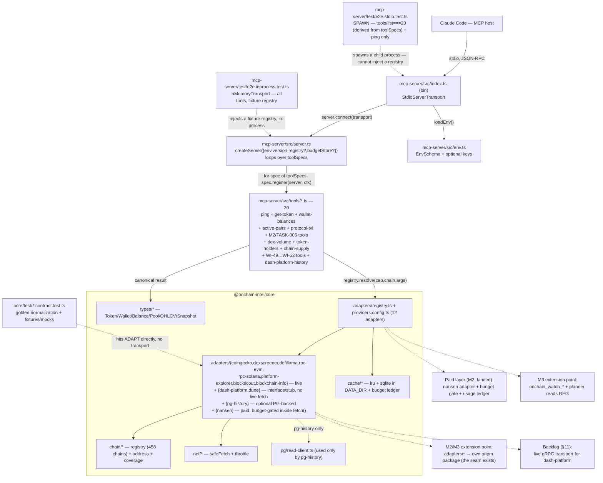
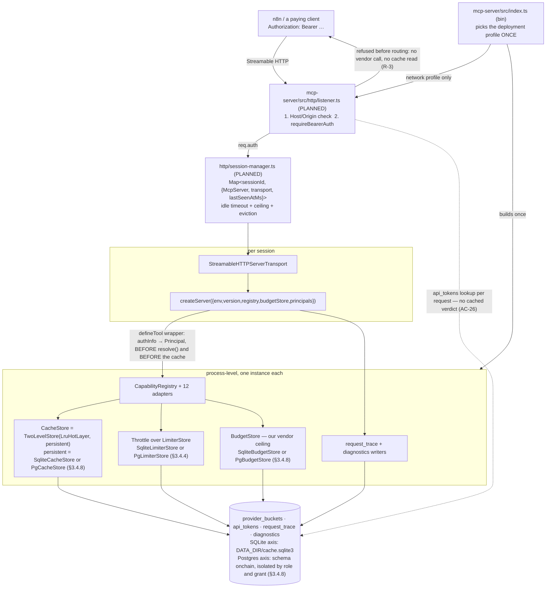

# 3. System architecture

> Part of [docs/ARCHITECTURE.md](../ARCHITECTURE.md).

### 3.1. Architecture style

**Two packages in a pnpm monorepo** — `packages/core` and `packages/mcp-server`. Inside each
package a plain modular structure; no DI containers.

Exactly **one** additional package boundary is drawn (`packages/core`), not the full D12 layout
(`core` + `adapters` + `signals` + `cli` as four packages).

- **Why not a single package (everything inside `mcp-server`).** Canonical types, the chain
  registry, the adapters, the two-level cache, the SSRF gate, the rate limiter and the PG client
  form a domain that is testable without the MCP transport — every D11 contract test hits
  `normalize()`/`fetch()` directly, with no server in the loop. Fusing that domain with the MCP
  wiring would have made the paid layer (M2) and signals (M3) harder: both need
  Registry/Cache/types, neither needs MCP tool registration.
- **Why not four packages up front.** M0 measured the real price of **each** new workspace package
  in this toolchain: its own `tsconfig.json` + `tsconfig.build.json` + `.prettierignore`, because
  resolution is CWD-relative (see `packages/mcp-server/.AGENTS.md`), on top of the TS strict +
  `noUncheckedIndexedAccess` discipline. D12 itself says start minimal and cut along the seams as
  the system grows: `signals`/`cli` have no code until M3 or until needed (R-27). Adapters are not
  a separate package but a module boundary **inside** `packages/core` (`src/adapters/<id>/`) —
  already a D12 seam at the directory level. Promoting them to their own pnpm package later means
  moving a directory and adding a `package.json`, not rewriting code: imports inside `core` already
  go through `adapters/registry.ts`, never directly between adapters.
- **Extra payoff.** `packages/core` needs no tsup — it is a pure library with no `bin`, so its
  `build` is a plain `tsc -p tsconfig.build.json` (NodeNext emit out of the box). That sidesteps
  the tsup/rollup-plugin-dts bug (the TS6/TS7 `baseUrl` conflict recorded in the M0 `.AGENTS.md`)
  instead of reproducing it in a second package: `core` is easier to build than `mcp-server`.

The style is YAGNI applied to boundaries (architecture-design skill, "Simplicity Above All"): the
minimum boundary that makes M1 honest — testable independently of MCP — without forcing a refactor
for the M2/M3 slicing.

**L-5 (architecture review round 2, 2026-08-03) — noted, not fixed here.** This document is now
~2200 lines and §3.2's `core` component alone carries five distinct T-012 designs (policy
descriptor, capability manifest, provider tier, source trust, call deadline) on top of everything
M0–TASK-009 already put there. Not a T-012 defect, and NOT addressed by this task — flagged for a
future split (e.g. `adapters.md` / `cache.md` / `net.md` chunks, the same way `data-model.md` and
`reliability.md` already split off from a single file) when file size next becomes the limiting
factor for reading it, not before.

### 3.2. System components

#### Component: `@onchain-intel/core`

- **Type:** TypeScript library package (no `bin`), consumed by `mcp-server` through a
  `workspace:*` dependency.
- **Purpose:** canonical types, the chain registry, chain/address normalization, the Adapter +
  Capability Registry, twelve provider adapters (nine landed in M1 — two of them, `dash-platform`
  and `dune`, interface/fixture-only — plus the paid `nansen` from M2, then the free `blockscout`
  from TASK-008 and `blockchain-info` from TASK-009), the two-level cache, the SSRF
  gate, the rate limiter, the credit budget gate, and a read-only PG client (`pg-history` adapter).
- **Technologies:** TypeScript strict, zod, `better-sqlite3`, `lru-cache`, `ulid`, `@noble/hashes`
  (keccak256 for EIP-55 — its only reason for existing here: ADR-001 D5 requires an EVM checksum,
  not just lowercase; §3.2.1), `bs58` (Solana base58 decode/validate — not hand-rolled, because
  address validation is a security boundary), `pg` (the read-only client behind `pg-history`).
  `@grpc/grpc-js` and `@grpc/proto-loader` are **not** dependencies: `dash-platform` is an
  interface + fixture contract with no live transport (below).

**Module: `src/types/*`** (D5, R-1/R-2)

Canonical zod schemas, the single source of truth — used both by runtime validation and by the MCP
tool schemas (re-exported into `mcp-server`):

```ts
// The set of accepted chain values lives in the registry (§3.2, "Module src/chain/registry"), not
// in the type. A closed `z.enum(['ethereum','solana','dash'])` literal had to be edited in five
// layers for every new chain (R-50b).
//
// TWO schemas, deliberately. One schema cannot serve both the input and the canonical output:
//   • on INPUT we must accept anything an agent might write (`ethereum`, `berachain`, `eip155:1`);
//   • on OUTPUT the canonical type must already carry a RESOLVED value — otherwise an alias leaks
//     into the canonical object, from there into the cache key, and one request yields two cache
//     entries (§4.2.2 — a money defect on paid routes, not cosmetics).

// Canonical form — used INSIDE domain types. The canonical value is the chain's SLUG, not its
// CAIP-2 id: R-59d forbids changing the shape of tool responses, and `onchain_get_token` has
// always answered `chain: "ethereum"`. CAIP-2 remains the registry's primary key; the slug is 1:1
// with it, unique, and never an alias — so the §4.2.2 requirement (no alias ever reaches a cache
// key) is met either way.
export const ChainSchema = z.string().min(1);
export type Chain = z.infer<typeof ChainSchema>;

// Input form — used ONLY in MCP tool schemas (§5.1). Accepts slug/alias/caip2. It VALIDATES and
// does not transform: the MCP SDK renders every tool input schema to JSON Schema for `tools/list`,
// and a zod transform has no JSON Schema representation, so a transforming schema makes the server
// answer `tools/list` with `-32603` — taking down tool DISCOVERY, i.e. the whole server. An unknown
// chain fails validation with a "did you mean" list (R-50c), at zero network calls and zero credits.
export const ChainInputSchema = z
  .string()
  .min(1)
  .max(MAX_CHAIN_INPUT_LENGTH)
  .superRefine(assertKnownChain); // registry lookup, skipped entirely for over-length input

// Canonicalization happens one line into each tool handler, still BEFORE the value reaches `args`
// and therefore before `deriveArgsHash`.
export function canonicalizeChain(raw: string, chains?: ChainRegistry): string; // → ChainInfo.slug

export const TokenSchema = z
  .object({
    chain: ChainSchema,
    address: z.string(), // normalized: EVM checksum / Solana base58
    symbol: z.string(),
    name: z.string(),
    decimals: z.number().int().nonnegative().optional(),
    priceUsd: z.number().nonnegative().optional(),
    marketCapUsd: z.number().nonnegative().optional(),
    source: z.string(), // id of the source adapter
    fetchedAt: z.number().int(), // epoch-ms UTC
  })
  .strict();

export const BalanceSchema = z
  .object({
    assetType: z.enum(['native', 'token']), // M1 fills only 'native' — see the ERC-20/SPL decision
    symbol: z.string(),
    decimals: z.number().int().nonnegative(),
    amountRaw: z.string(), // exact integer as a string (DB-SCHEMA §1.7 convention)
    amountNum: z.number().optional(), // lossy projection
    contractAddress: z.string().optional(), // filled when assetType === 'token'
  })
  .strict();

export const WalletSchema = z
  .object({
    chain: ChainSchema,
    address: z.string(),
    balances: z.array(BalanceSchema),
    source: z.string(),
    fetchedAt: z.number().int(),
  })
  .strict();

export const PoolSchema = z
  .object({
    id: z.string(),
    chain: ChainSchema,
    dexId: z.string(),
    baseTokenSymbol: z.string(),
    quoteTokenSymbol: z.string(),
    pairAddress: z.string(),
    createdAt: z.number().int().optional(),
    liquidityUsd: z.number().nonnegative().optional(),
    volume24hUsd: z.number().nonnegative().optional(),
    source: z.string(),
    fetchedAt: z.number().int(),
  })
  .strict();

// Reserved (R-1 requires the type to exist); no tool consumes it yet — the first consumer will be
// a candlestick/chart tool (M1.5+).
export const OhlcvSchema = z
  .object({
    chain: ChainSchema,
    pairAddress: z.string(),
    ts: z.number().int(),
    open: z.number(),
    high: z.number(),
    low: z.number(),
    close: z.number(),
    volumeUsd: z.number().nonnegative().optional(),
    source: z.string(),
  })
  .strict();

// Persistent form of the D5 addendum (snapshotter mode), aligned with DB-SCHEMA-CONCEPT §2. The
// engine does not write it and will not: the snapshotter stays on n8n permanently (owner decision
// 2026-07-25, ADR-001 D8 addendum). The type exists as the canonical form for READING that table
// (R-2/R-12). Name mapping at the persistence boundary (needed on the reading side in M3):
// valueRaw↔value_raw, valueNum↔value_num — every other field matches literally (§4.1, Entity
// Snapshot).
export const SnapshotSchema = z
  .object({
    metric: z.string(),
    asset: z.string(),
    ts: z.number().int(),
    valueRaw: z.string(),
    valueNum: z.number().optional(),
    source: z.string(),
    height: z.number().int().optional(),
  })
  .strict();
```

**Module: `src/chain/registry.ts` + `src/chain/registry.data.json`** (TASK-006, R-48/R-60)

The single source of facts about chains — **458** rows. Data lives in its own `.json`, code in its
own `.ts`: a registry diff (hundreds of lines on every sync) must not be mixed with a logic diff in
review.

```ts
export interface ChainInfo {
  caip2: string; // PK, e.g. 'eip155:80094'
  slug: string; // UNIQUE, e.g. 'berachain'
  name: string;
  family: 'evm' | 'svm' | 'move' | 'cosmos' | 'utxo' | 'other';
  aliases: readonly string[]; // including the legacy 'ethereum'/'solana' (R-59a)
  nativeSymbol: string | null;
  vendors: Readonly<Record<string, string | null>>; // NAMING, not coverage (§4.1, rule 4)
  rpcHosts: readonly string[] | null; // curated SSRF allowlist (§7.2)
  tvlUsdAtSync: number | null; // knowingly stale, only for list_chains
  deprecated: boolean;
}

export interface ChainRegistry {
  resolve(input: string): ChainInfo; // throws UnknownChainError with candidates
  tryResolve(input: string): ChainInfo | null;
  get(caip2: string): ChainInfo | null;
  list(filter?: ChainListFilter): ChainInfo[];
  size(): number;
}

export function loadChainRegistry(deps?: { data?: unknown }): ChainRegistry; // validates at startup
```

- **Resolution is a pure function with no network.** Order: exact `caip2` → `slug` → `aliases` →
  normalized form (lowercase, `[^a-z0-9]` collapsed). A miss raises `UnknownChainError` with
  candidates by Levenshtein distance over `slug ∪ aliases` (R-50c). A miss costs zero network calls
  and zero credits, which matters more than convenience: misses happen most often on the paid route,
  where an agent is guessing a chain name.
- **Indexes** (in memory, built once at load): `Map<caip2>`, `Map<slug>`, `Map<alias>`. Resolution
  is O(1) on an exact match; the O(n) "did you mean" path runs only while building an error. 458
  rows are tens of kilobytes — there is no scaling question here, and none is coming (even the 2660
  EVM chains of `chainid.network` would be single-digit megabytes).
- **Injection (`deps.data`)** is the same DI pattern as `CacheStore`/`BudgetStore`: tests load a
  small synthetic registry instead of the production one, touching no filesystem. The registry is a
  **factory, not a module singleton** (§8 already requires that of
  `CapabilityRegistry`/`SqliteCacheStore`).
- **Startup validation (R-60c):** `caip2`/`slug` uniqueness, global non-overlap of `aliases`, CAIP-2
  format, non-empty `name`. A violation throws at load, not on the first request. Degrading to an
  empty registry is forbidden (§4.2.1).

**Module: `scripts/sync-chain-registry.ts`** (dev-only, TASK-006, R-49)

- **Not part of the runtime build** and imported by no module under `src/` — it is a dev script the
  operator runs by hand (TASK-006 UC-4). A test asserts that `src/` contains no imports from
  `scripts/`; otherwise the offline gate (R-60a) could be broken unnoticed.
- **Sources and join keys** (all three keyless; live probe 2026-07-26, evidence in
  [raw/chain-registry-probe-2026-07-26.json](../onchain-analytics/raw/chain-registry-probe-2026-07-26.json)):

  | Source                             | Provides                                              | Join key                                                                                                |
  | ---------------------------------- | ----------------------------------------------------- | ------------------------------------------------------------------------------------------------------- |
  | DeFiLlama `/v2/chains` (461)       | `name`, `tvlUsdAtSync`, `gecko_id`                    | — the base list                                                                                         |
  | CoinGecko `/asset_platforms` (461) | `coingecko` platform id, `chain_identifier` (EIP-155) | `defillama.gecko_id` → `coingecko.native_coin_id` (**235** matches, an explicit vendor cross-reference) |
  | `chainid.network` (2660)           | `nativeCurrency`, `rpcHosts` candidates               | `coingecko.chain_identifier` → `chainId` (**257 of 270**)                                               |

  The registry ends at **458** rows: the vendor catalogs list 461 each, and testnet rows are
  excluded after the join.

- **The fuzzy key (normalized name, 255 matches) is a fallback only, and it MUST be visible.** Rows
  glued by name land in a separate section of the diff report and require a commit confirmed by
  eye. A silent fuzzy join is exactly the class of error that later surfaces as "TVL of the wrong
  chain", with nothing left to find it by.
- **Determinism (R-49c):** stable sort by `caip2`, no timestamps **inside** the file (the sync date
  lives in a separate header meta field that changes only when the data actually changes), stable
  key order. The acceptance criterion is that two consecutive runs produce a byte-identical file.
- **Failure behaviour (R-49e):** if any of the three sources is unavailable, exit loudly with a
  non-zero code and **write no file**. A partially written registry is worse than a missing one: it
  passes validation and silently narrows the world.
- **Vanished chains (R-49f):** never deleted, marked `deprecated: true`. Deleting would break
  resolution of already-stored references, and "the chain died" is indistinguishable from "the
  vendor did not return it this time" from the outside.

**Module: `src/chain/coverage.ts`** (TASK-006, R-51)

Implements `covered(capability, chain)` from §4.2.3 — the composition of `routes` ×
`adapter.chainSupport()`. The text of `CapabilityNotCoveredOnChainError` is built here too: both
lists (chains for a capability, capabilities for a chain) are computed from those same two sources,
so they cannot drift away from actual behaviour.

**The call site is money-critical (R-51d).** The coverage check runs inside
`CapabilityRegistry.resolve()` **before** the adapter is touched — before the budget gate and
before HTTP. The gate order on a paid route:

```
resolve(capability, args)
  → 1. resolve chain against the registry  (no network, no money)
  → 2. check coverage of the pair          (no network, no money)
  → 3. cache lookup                        (no network, no money)
  → 4. adapter.isAvailable()               (no network, no money)
  → 5. budget gate: check + reserve        (money is reserved)
  → 6. adapter.fetch()                     (network, money is spent)
```

The coverage gate must sit **above** step 5: growing the chain set from 2 to 458 multiplies the ways
to miss coverage, and if a miss cost a credit reservation, the expansion itself would become a
spending vector (NFR, TASK §7). This also removed a whole class of knowingly useless calls from the
paid path — part of the surface **SEC-1** described before the velocity guard existed. SEC-1 is
closed: credits per window, checked in the same transaction as the daily reservation (see "Two
second denominators" below).

#### 3.2.1. Address/chain normalization (`src/chain/address.ts`)

- **EVM:** the canonical form is the **EIP-55 checksum**, not lowercase (ADR-001 D5 requires the
  checksum). Algorithm: `keccak256` of the lowercase hex address (without `0x`, as ASCII bytes);
  for each hex character of the source lowercase address, upper-case it if the corresponding nibble
  of the hash is ≥ 8, lower-case it otherwise. This is a **pure function of the address bytes**: any
  input casing yields the **same** checksum result, so cache keys and storage are deterministic
  automatically and no separate "lowercase for keys" form is needed.
- **Solana:** the canonical form is **as-is** (base58 is case-sensitive: lowercasing would corrupt
  the address, unlike hex). Validation: base58 decoding succeeds **and** the decoded length is
  **exactly 32** bytes (a Solana address is a raw ed25519 pubkey, with no version/checksum bytes,
  unlike Bitcoin base58check).
- **Dash:** present in the registry vocabulary for consistency with `assets.chain_family` from
  DB-SCHEMA, but the `Wallet`/`Balance` types are not used for it — dash-platform returns
  `Snapshot`, not `Balance` (§2.1).
- **One point of use:** both the MCP tool input schemas (`superRefine` calls
  `isValidAddress(chain, address)`) and the adapters (`normalizeAddress` before `fetch` / before
  building the cache key) go through this single module; nothing is duplicated.

**Branching is by `family`, not by chain name (R-55).** `switch (chainInfo.family)` replaced
`switch (chain)` over the `'ethereum' | 'solana' | 'dash'` literals. The bodies of the `evm`/`svm`
branches did not change by a single line — the same EIP-55 and base58+32 bytes, the same tests
(R-55d). Only the reach changed: one `evm` branch now serves all 270+ EVM chains instead of one.

| `family`                             | Validation                            | Canonicalization        |
| ------------------------------------ | ------------------------------------- | ----------------------- |
| `evm`                                | 40 hex characters (with/without `0x`) | EIP-55 checksum         |
| `svm`                                | base58 decodes to exactly 32 bytes    | as-is                   |
| `move` / `cosmos` / `utxo` / `other` | **no validator** — accepted as-is     | **no canonicalization** |

**A missing validator is not a refusal of service on free routes (R-55c).** For a family with no
validator the address is accepted and passed to the vendor as-is; "address not found" from the
vendor is a normal answer, not a bug of ours. The opposite behaviour would mean we do not support a
chain until we write an address parser for it — exactly the "chain = code" coupling the registry
removes.

**On paid routes it is a refusal (OQ-1, revised 2026-07-27).** A paid call on a family with no
validator spends credits on a string we never checked, and a vendor's "not found" is then
indistinguishable from our own garbage input. Paid capabilities therefore refuse on any family
other than `evm`/`svm`; writing a validator for a family is the prerequisite for paid coverage
there, not an optimization.

**The price of no canonicalization, stated explicitly:** the cache key is built from the source
string, so the same address written in different casing produces **two** cache entries. That is a
loss of cache efficiency, **not** of correctness (the answers are identical).

**Module: `src/adapters/*`** (D2/D3/D4/D8/D9, R-3, R-5…R-11)

**SHIPPED (T-012, commit `6af4b19`, 2026-08-05).** Everything from here through "Architectural
obligation" at the end of this subsection describes the design **as it is in code**, not a target.
`packages/core/src/adapters/types.ts` carries the post-T-012 shapes: a serialisable
`policy?: PolicyDescriptor` in place of a literal `isSatisfying` (`packages/core/src/adapters/types.ts:333-416`, `tier === undefined ? 'no adapter registration found for this`, class
dictionary in `adapters/policy.ts`), mandatory `tier`/`trust` on every registration
(`types.ts:93,106,137,148`), and the optional `deadlineAtMs` parameter on `fetch()` (`packages/core/src/adapters/types.ts:52`, `fetch(cap: string, args: Record<string, unknown>,`).
Two owner decisions dated 2026-08-03 (OD-3, OD-4) are folded in below, replacing an earlier draft
of this section that an architecture review (same date) found to misdescribe both.

> **Superseded banner, kept rather than deleted.** Until 2026-08-05 this paragraph read "**PLANNED
> (T-012, not in code as of 2026-08-03)** … `types.ts` still has the pre-T-012 shapes … as of this
> writing". It was not updated when T-012 landed, so a PLANNED banner sat over sub-sections already
> marked LANDED (`ttlFor()`) and SHIPPED (adapter uptake) **inside its own declared scope** — the
> documentation-drift class WI-24/WI-28 exist to catch, in the one place no gate reads. Nine further
> `PLANNED (T-012)` status markers inside this subsection's declared scope were corrected in the same
> pass (lines 393/439/492/641/665/805 of the pre-edit file), together with a seventh on the
> `deadlineMs`/`paidLegMs` table, which lives in `Module: src/cache/*` rather than here. One further
> `PLANNED` remains below by design — the word inside the H1 narrative, which is prose about the
> state before the fix and is now introduced as such. A status marker is a claim about running code,
> so each now names the task that landed it.
>
> **Scope of the commit named above.** `6af4b19` is T-012 itself. The WI-34/WI-35/WI-36/WI-37
> follow-up described further down (the applied `pg-history` limiter, the query bounds, 10-of-12
> adapters reading the deadline) landed later on 2026-08-05 and is NOT in that commit — a reader who
> checks `6af4b19` alone finds 2 of 12 adapters and 4 of 20 capabilities.

```ts
export interface CapabilityDescriptor {
  id: string; // 'token.price' | 'wallet.balances.native' | 'pairs.active' | ...
  chains?: Chain[]; // absent = the capability is not bound to a specific chain
}

export interface ProviderAdapter {
  id: string; // D4: an explicit id field
  capabilities(): CapabilityDescriptor[];
  costOf(cap: string, args: Record<string, unknown>): { credits: number };
  // D4/R-140: `deadlineAtMs` is OPTIONAL and ADDITIVE — an absolute epoch-ms moment, never a
  // duration (D4 п.3). An adapter that never reads it degrades exactly to today's per-hop-timeout
  // behaviour, not a compile error or a runtime throw. OD-3/OD-4 (2026-08-03): it bounds ONLY the
  // phase before a paid reservation commits — see "Call deadline" below for the exact boundary and
  // why nothing after that point, in ANY paid adapter's own implementation, ever receives it.
  fetch(cap: string, args: Record<string, unknown>, deadlineAtMs?: number): Promise<unknown>;
  normalize(cap: string, raw: unknown): unknown; // narrowed by the adapter internally
  isAvailable?(): { ok: true } | { ok: false; reason: string }; // env/key readiness, R-24

  // "Can I serve this chain FOR THIS CAPABILITY" — a PREDICATE over ChainInfo, not a list
  // (R-51a/R-54c). A list would have to be kept in sync with the registry; a predicate cannot drift
  // from it. The second parameter is load-bearing: coverage is a property of the PAIR, not of the
  // adapter — `nansen` serves different chain sets per capability (17/25/25), and `defillama`
  // covers `dex.volume.history` on a narrower set than `chain.tvl`.
  // Absent ⇒ the adapter is not chain-bound (see CapabilityDescriptor.chains).
  chainSupport?(chain: ChainInfo, capability: string): boolean;
}

/**
 * D8/D9 — two classifications ADDED to the registration, both MANDATORY in the literal
 * `providers.config.ts` array (a missing value is a compiler error there — the same "obligatory
 * field" discipline D3 already applies to the manifest below).
 */
export interface AdapterRegistration {
  id: string;
  hosts: string[];
  rateLimit: TokenBucketConfig;
  requiresEnv: string[];
  tier: 'free' | 'paid'; // D8
  trust: 'authoritative' | 'derived' | 'community'; // D9, DECLARE-ONLY in T-012 — see below
}
```

**Provider tier — one classification, four readers (D8, R-150/R-151/R-152). LANDED (T-012, tasks
012-2/012-3).** The "Old classification / Where" column below is the **historical** pre-T-012 map:
those line references describe the tree before commit `6af4b19` and no longer resolve
(the `PAID_PROVIDER_IDS` identifier is gone from `src/`; historical notes remain in
`cache/sqlite-store.ts`, `cache/budget-store.ts` and `adapters/types.ts`).
The "Becomes" column is what the tree does today — `types.ts:93,137`, `cache/budget-store.ts` writing
`kind: registration.tier`, and `mcp-server/src/tools/budget-meta.ts` reading `r.tier === 'paid'`.
`tier` replaced four places that used to classify "is this provider paid" independently, none of
which could detect the others disagreeing:

| Old classification                                           | Where                                                                                                              | Becomes                                                                               |
| ------------------------------------------------------------ | ------------------------------------------------------------------------------------------------------------------ | ------------------------------------------------------------------------------------- |
| `PAID_PROVIDER_IDS = new Set(['dune','nansen'])`             | `packages/core/src/cache/sqlite-store.ts:48`, `* the connection opens (PRAGMA/DDL exec, providers bootstrap,`      | reads `registration.tier`                                                             |
| bootstrap writes `kind: 'unknown'` to every provider row     | `packages/core/src/cache/budget-store.ts:263-272`, `if (!existing.has(column.name)) this.db.exec(column.ddl);`     | writes `registration.tier`                                                            |
| `BudgetMeta.provider: 'nansen'` — a hand-picked literal type | `packages/mcp-server/src/tools/budget-meta.ts:9`, `* is the complete set of sources that can have spent anything.` | widens to plain `string`, checked at runtime (M6 below) — the WIRE SHAPE is unchanged |
| `costOf() === 0 \| Infinity` read as a de-facto tier signal  | every adapter's `costOf()`                                                                                         | stays the PRICE mechanism only; nothing reads it as a tier any more                   |

Assignment (`providers.config.ts`'s 12 registrations, measured): **`paid`** — `dune`, `nansen`.
**`free`** — the other ten (`coingecko`, `dexscreener`, `defillama`, `blockscout`, `rpc-evm`,
`rpc-solana`, `dash-platform`, `platform-explorer`, `pg-history`, `blockchain-info`). `tier` is a
property of the VENDOR RELATIONSHIP — static — and is deliberately never derived from `costOf()`,
which varies with arguments and the live account plan (`nansen`'s real price table vs.
`blockchain-info`'s `0`/`Infinity` toggle, ADR-002 D8). **It never reaches a tool response**: the
client pays our price (ADR-003 D4), and our own spend at a vendor is our unit economics, not the
client's contract. `_meta.budget`'s `{provider, creditsUsedToday}` shape (interfaces.md §5.1.2) is
UNCHANGED by this — `tier` is not added to it.

**L5 — obligation for Development. DISCHARGED (T-012, task 012-2).** `providers.config.ts`'s own
docstring used to read "**10 entries** … every one now backed by a real adapter" — stale since
TASK-008/TASK-009 raised the count to twelve, and untouched by the architecture pass that recorded
this (docs-only; that line is source code). It was corrected in the same commit that added
`tier`/`trust` to all twelve registrations, exactly as this note asked. Kept rather than deleted:
the obligation is the reason the correction happened, and a discharged obligation with no record
reads as one that was never raised.

🔴 **M6 — `BudgetMeta.provider` widens to `string` with a runtime check, not a `tier`-derived
literal union; picked and justified, not left ambiguous.** `adapterRegistrations` is exported as a
plain mutable `AdapterRegistration[]` (`providers.config.ts`), and TypeScript widens an array
literal's element type to the ANNOTATED interface — `id` is `string`, not a literal union of the
twelve ids — so no mapped type reading `.tier` off that array can narrow `BudgetMeta.provider`
without ALSO re-typing the array itself (`as const satisfies readonly AdapterRegistration[]`, or
similar). That re-typing has a blast radius this task does not take on:
`SqliteBudgetStoreOptions.providers?: AdapterRegistration[]` and its sibling on `SqliteCacheStore`
both expect a plain mutable array, and every consumer that iterates or mutates it generically would
need its own accommodation. So: `BudgetMeta.provider: string` (documented as "the paid-tier adapter
id that actually answered"), with a runtime assertion at the one place it is constructed
(`budgetMeta()`, `mcp-server/src/tools/budget-meta.ts`) that the value is a member of
`adapterRegistrations.filter((r) => r.tier === 'paid').map((r) => r.id)`. This is not a lesser fix:
ADR-002 D8's own text names the CURRENT literal type itself as the defect ("classification leaked
into the type system") — a derived-but-still-precise literal union would relocate that leak, not
remove it. The wire shape is unaffected: `{provider: string, creditsUsedToday}` serializes
identically to today's `{provider: 'nansen', ...}` for the one value either type can hold right now.

**Source trust — declare-only (D9 slice, R-153/R-154/R-155). LANDED (T-012, task 012-2).** The
field is declared on all twelve registrations and validated at construction
(`assertValidAdapterRegistrations`, `packages/core/src/adapters/types.ts:179-201`, `export function assertValidAdapterRegistrations(registrations:`); "declare-only" still describes its
CONSUMPTION, which is T-016. Assignment, from
ADR-002 D9's own table plus a reasoned analogy (objective vendor/consensus data vs.
third-party-edited content):

| `trust`                         | Adapters                                                                                                                                                                                                                                                                                                                                                                                                                                                                                                     |
| ------------------------------- | ------------------------------------------------------------------------------------------------------------------------------------------------------------------------------------------------------------------------------------------------------------------------------------------------------------------------------------------------------------------------------------------------------------------------------------------------------------------------------------------------------------ |
| `authoritative`                 | `nansen`, `coingecko`, `defillama` (named in ADR-002 D9) + `dexscreener`, `dune`, `rpc-evm`, `rpc-solana`, `blockchain-info`, `dash-platform` (reasoned analogy — objective/consensus data nobody edits) + **`platform-explorer`** (owner decision **OD-5**, 2026-08-03 — D9's scale asks about the REDACTABILITY of content, not the operator's official status; machine-aggregated chain counters nobody edits. Closes OQ-T012-2, and the stake is real: this is the source D6 turns merging on for FIRST) |
| `community`                     | `blockscout` (ADR-002 D9, verbatim: "everything it returns is edited by outsiders") + **`pg-history`** (owner decision **OD-5**, 2026-08-03 — deliberately the LOWEST rank as a conservative PLACEHOLDER until the real per-ROW rank from `source` arrives in T-016. Closes OQ-T012-3. 🔴 The code comment must say "placeholder with a scheduled replacement", not leave it readable as a judgement about our own ledger)                                                                                   |
| assigned to no ADAPTER in T-012 | `derived` — applies to individual `pg-history` ROWS (`source='derived'`), never to a whole registration                                                                                                                                                                                                                                                                                                                                                                                                      |

🔴 **Zero consumer logic (R-155).** No `set`-merge segmentation by rank, no community-marking in
model context, no `source → trust` autofill script exist yet — all three are ADR-002 D9's "full
inclusion", scheduled for T-016 alongside the `entity.labels` merge itself (D6). The ONLY reader in
the whole codebase is a construction-time check that every registration set `trust` (R-154) — see
"where this check actually runs" under Capability Registry below, since `AdapterRegistration` never
reaches `CapabilityRegistry` itself.

🔴 **L1 — the complete YAGNI ledger for T-012, not a sample of it (M-1 correction, architecture
review round 2, 2026-08-03: FIVE fields, not four).** Five fields this task introduces have NO
RUNTIME consumer inside T-012, each justified ONLY by a dated, accepted future decision that will
consume it — not by "just in case": `trust` (T-016, ADR-002 D9, owner 2026-08-01), `shareable`
(T-014, ADR-003 D5), `shape` (T-013, D5 — no merge rule exists yet to key on it),
`requestedDeadlineAtMs` (`resolve()`'s fourth parameter, below — T-012 has exactly one caller, the
engine itself, and passes nothing; T-014's networked client is the first real caller), and
`paidLegMs` (OD-3, owner 2026-08-03 — nothing at runtime reads it; its ONLY reader is the extended
WI-28 doc gate, "`ttlFor()` becomes a READER" above, which checks the manifest's `paidLegMs` against
the documented per-capability derivation table — the identical test-time-only status `shape` already
holds in this same list, not a weaker one). This is the full list; a sixth unconsumed field found
later is a defect, not an omission from this sentence.

**Adapters hold no private vendor chain maps (R-54).** Each of these was a private copy of chain
knowledge, with its own `SupportedChain` type duplicating the `chains:` literals of
`providers.config.ts`:

| Adapter       | Removed                                                                         | Replaced by                                                                           |
| ------------- | ------------------------------------------------------------------------------- | ------------------------------------------------------------------------------------- |
| `defillama`   | `type SupportedChain`, `CHAIN_TVL_KEY = {ethereum:'Ethereum', solana:'Solana'}` | `chain.vendors.defillama`                                                             |
| `dexscreener` | `type SupportedChain`, `NATIVE_QUERY = {ethereum:'ETH', solana:'SOL'}`          | `chain.nativeSymbol` (R-57a) + `chain.vendors.dexscreener` for the client-side filter |
| `nansen`      | `type NansenChain = 'ethereum' \| 'solana'`                                     | `chain.vendors.nansen` + `CoverageProbe` (§4.2.3)                                     |
| `coingecko`   | inline check `chain !== 'ethereum' && chain !== 'solana'`                       | `chain.vendors.coingecko` (platform id straight into the URL)                         |
| `rpc-evm`     | check `chain !== 'ethereum'` + hosts from `adapterRegistrations`                | `chain.family === 'evm'` + `chain.rpcHosts` (§7.2)                                    |

**The anti-corruption layer (D4) is not weakened by this.** The registry hands the adapter a vendor
**key** — a short identifier string — and nothing else. Vendor DTOs still never leak outward,
`normalize()` remains the single narrowing point (R-54d), and the dependency direction does not
invert: the adapter reads the registry, the registry knows nothing about adapters.

**Nor was it weakened by D2/D3/D4/D8/D9 (T-012, shipped).** `fetch()` still returns
`unknown`, and only `normalize()`'s output ever escapes an adapter — a policy descriptor, a
manifest, a deadline, a `tier`, a `trust` are all metadata ABOUT routing and accounting, never a
shape the vendor's DTO is allowed to influence. ADR-002 explicitly rejects the nearest miss
(configurable field-mapping instead of `normalize()`, §Что отклонено п.7) on exactly this ground.

**Capability Registry** (`src/adapters/registry.ts`) routes on `(capability, chain)`. LANDED
(T-012, tasks 012-1/012-4/012-6/012-8):

```ts
export interface CapabilityRoute {
  capability: string;
  adapterIds: string[]; // order = priority + fallback chain (R-11), unchanged

  // D2 — was `isSatisfying?: (result: unknown) => boolean`. Same cross-provider "is this answer
  // enough, or should the walk continue" question (TASK-008, H-1), now a SERIALISABLE value
  // resolved against a class registry in core (below) instead of a literal function. Omitted ⇒
  // `{ kind: 'any' }`. Applied to cache hits too, unchanged (H-1 — otherwise shadowing returns
  // through the cache).
  policy?: PolicyDescriptor;

  // DESIGNED (T-013, OQ-T013-2) — a SECOND, route-level activation gate, on top of the manifest's
  // `mergeable` eligibility (R-159). Name is illustrative (Development's call, same discretion
  // R-159(a) gives the manifest field); the TYPE-LEVEL requirement is fixed here: a boolean (or
  // boolean-shaped descriptor), checked at construction against `capabilityManifests[capability]`
  // (see "Merge mechanism" below for the full reasoning and the constructor validation it adds).
  merge?: boolean;
}

export class CapabilityRegistry {
  constructor(
    routes: CapabilityRoute[],
    adapters: Map<string, ProviderAdapter>,
    cache?: CacheStore,
    chains?: ChainRegistry | null,
    // C2 (architecture review 2026-08-03): INJECTED and DEFAULTED to the real committed table —
    // the identical seam `chains` already uses one parameter to the left (`this.chains ??
    // loadChainRegistry()`). A test route table with a synthetic capability — measured: only
    // `coverage.test.ts`'s `legacy.thing`, at the TWO `new CapabilityRegistry(...)` calls `:86` and
    // `:171` — supplies its OWN small manifest map here instead of inheriting the real 20-row one,
    // so adding a manifest-completeness check does NOT turn every pre-existing fixture route red,
    // which a bare module-level import would have. (`ghost` at `coverage.test.ts:255` and `x` at
    // `:127`/`:139` are NOT affected and must not be cited here: the first is an argument to
    // `createCoverage({routes})`, the second a string handed to a `CapabilityNotCoveredOnChainError`
    // constructor — neither passes through registry validation. See `reliability.md`.)
    manifests: Readonly<Record<string, CapabilityManifest>> = capabilityManifests,
  );
  // R-135/R-138: at CONSTRUCTION (this constructor body, not lazily inside `resolve()`), for EACH
  // route, in a FIXED, STATED order:
  //   1. `manifests[route.capability]` must exist → else `MissingCapabilityManifestError(capability)`.
  //   2. ONLY once (1) passes: if `route.policy` is set, its `kind` must resolve in the policy
  //      class dictionary → else `UnregisteredPolicyClassError(capability, kind)`.
  //   3. DESIGNED (T-013, R-183) — ONLY once (1) passes: if `route.merge` is `true`, the manifest
  //      row found in step 1 must carry `mergeable: true` on its `set | series` arm → else a new
  //      construction-time error naming the capability and the missing eligibility (UC-20). Placed
  //      after step 1 (it reads the SAME manifest row) and independent of step 2 (merge and policy
  //      are orthogonal route properties) — a route wrong on BOTH reports step 2's finding first,
  //      an arbitrary but deterministic tie-break, not a claim that one defect matters more.
  // The order is what makes each requirement's negative test isolate exactly one bad thing (C2): a
  // test exercising ONLY R-135's bad-`kind` path supplies a `manifests` map covering its own
  // synthetic capability (so step 1 passes silently) and sets an invalid `policy.kind` (so step 2
  // is what fires); a test exercising ONLY R-138's missing-manifest path needs no `policy` at all
  // (step 2 never runs for a route that carries none). `mcp-server/src/index.ts` builds the one
  // real registry at process startup, so a bad `kind` or a missing manifest entry there is a
  // startup failure, never a first-request surprise (the same guarantee `loadChainRegistry()`
  // already gives, §4.2.1).
  //
  // `trust`'s OWN construction-time check (R-154) does NOT live here — `AdapterRegistration` never
  // reaches `CapabilityRegistry` (it flows to `SqliteCacheStore`/`SqliteBudgetStore`'s own
  // `bootstrapProviders()` and nowhere else). The check is a small exported function,
  // `assertValidAdapterRegistrations(registrations)` (home: `src/adapters/types.ts`, beside the
  // interface it validates), taking the array as an explicit PARAMETER — never a module-level
  // import it validates unconditionally — called once by `mcp-server/src/index.ts` right after
  // importing `adapterRegistrations`, before either store or `CapabilityRegistry` is constructed.
  // A test passes its own small, deliberately-incomplete array and observes the throw in
  // isolation, the same seam discipline as steps 1/2 above.

  resolve(
    capability: string,
    chain: Chain,
    args: Record<string, unknown>,
    // D4/R-144: the CALLER's ask. It can only NARROW the manifest's own `deadlineMs`, never widen
    // it. Validated BEFORE use, and — L-1 correction, architecture review round 2, 2026-08-03 — the
    // validation now branches on TWO DIFFERENT failure shapes instead of folding them into one
    // "else absent":
    //   1. Not a safe integer at all (`!Number.isSafeInteger(x)` — NaN, a string, `±Infinity`) is
    //      treated as ABSENT, exactly as before. `Math.min(a, NaN)` is `NaN`, and `NaN <= 0` is
    //      `false` — an unguarded NaN would make every downstream deadline comparison silently
    //      never fire, and the first real caller with any incentive to send a malformed value is
    //      T-014's untrusted paying client, not our own code.
    //   2. IS a safe integer, but `x <= Date.now()` — a PAST timestamp. An earlier draft of this
    //      comment folded this into case 1 ("treated as ABSENT"), which is the wrong direction for
    //      R-144: "absent" falls back to the FULL manifest budget — MORE time than the caller
    //      asked for — and R-144 forbids widening in EITHER direction, including from "the caller
    //      asked for a deadline already in the past" to "the caller asked for nothing in
    //      particular". This case throws an immediate typed refusal instead (a well-formed "I am
    //      already out of time" — the same `DeadlineExceededError`/`CapabilityDeadlineExceededError`
    //      family D4 already uses elsewhere, with `tried: []` since no adapter was ever attempted),
    //      rather than silently falling through to case 1's ABSENT branch. (Clamping to `now()` was
    //      considered and rejected: it would make an already-expired caller deadline behave for one
    //      instant exactly like "no deadline supplied", then re-expire on the very next tick — an
    //      unobservable distinction not worth the special case; an immediate refusal is honest
    //      about what actually happened instead.)
    // `effectiveDeadlineAtMs = min(Date.now() + manifest.deadlineMs, requestedDeadlineAtMs ??
    // Infinity)`, computed ONCE here (after both checks above) and threaded unchanged through every
    // adapter call below (the same "fixed once, passed through" pattern the budget gate's
    // `dayBucketMs` already uses). T-012 has exactly ONE caller (the engine itself) and passes
    // nothing — every call takes the `?? Infinity` branch today; the parameter exists so ADR-003's
    // future networked client (T-014) composes additively, with no change to this signature.
    requestedDeadlineAtMs?: number,
    // `attempted` (adversarial cycle 2, F-4) — the adapter ids whose `fetch()` this traversal
    // actually ENTERED, in walk order, omitted when empty (a pure cache hit entered nobody). It is
    // NOT `source`: the walk can enter a paid adapter and still return an earlier adapter's
    // truthful-but-unsatisfying answer (`unsatisfying ??=`), and `_meta.budget` derived from
    // `source` alone then reported no spend on a call that had just paid. Deliberately un-filtered
    // by tier here — the classification lives on `AdapterRegistration` and is applied by the one
    // consumer that needs it (`mcp-server/src/tools/budget-meta.ts`, interfaces.md §5.1.2).
  ): Promise<{
    result: unknown;
    source: string;
    cache: 'hit' | 'miss';
    ageMs?: number;
    attempted?: string[];
    deadlineOverrunMs?: number; // BUILT, T-012 — unchanged by T-013, listed above the line below
    // ---- everything from here down is DESIGNED (T-013), not built, additive and optional, and
    // present ONLY on a merge-enabled route's walk (R-174d) — the 18 non-merge capabilities see no
    // shape change. See "Merge mechanism" below for `sources`' exact membership rule (contributors,
    // not "answered" — corrected after review; the field docstring above ("`source` is who
    // ANSWERED") describes single-adapter `resolve()`, where answering and contributing are the
    // same adapter by construction, and stops being one fact once a walk can have more than one
    // participant).
    sources?: string[];
    missingSources?: { adapterId: string; reason: string }[];
    perSourceCache?: { adapterId: string; cache: 'hit' | 'miss'; ageMs?: number }[];
  }>;
  // If every adapter on the route is unavailable, throws CapabilityUnavailableError listing
  // (adapterId, reason) — never a silent empty answer (R-24). If the current adapter's
  // fetch/normalize fails, moves on to the next id in adapterIds (R-11 hot-swap) instead of
  // failing the whole call. D4 adds a THIRD distinguishable outcome, CapabilityDeadlineExceededError
  // — see "Call deadline" below and reliability.md §9.1.
  //
  // Cache-fault contract — TWO different contracts. A fetch/normalize error means "this adapter
  // could not answer, try the next one" (recorded in `tried`). A cache.get()/set() error is ALWAYS
  // best-effort, never fatal, never a CapabilityUnavailableError: a get() throw is logged and
  // treated as a miss; a set() throw is logged in its OWN nested try/catch (not in `tried`, does
  // not trigger fallback) and the already-fetched result is still returned as 'miss'.
}
```

**`CapabilityRoute.chains` is GONE (OQ-C, ADR-002 D2).** The field was declared, read by the router
(`packages/core/src/adapters/registry.ts:234-238`, `, which for a negative entry is the wrong`, narrowing `matching` routes), and set by ZERO of the 21 entries in
`providers.config.ts` — re-measured 2026-08-03, the same result already recorded at TASK-006 and in
ADR-002 itself. T-012 deletes the field together with the filter that read it, per the escape hatch
ADR-002 D2 specifies: if a construction-time audit of all 27 routes ever finds one that genuinely
needs to narrow chains BELOW what `chainSupport()` already expresses, the field returns with that
route named as the consumer (open-questions.md records the closure).

**H-D (HIGH, architecture review round 2, 2026-08-03) — the deletion's test blast radius, stated
explicitly, not left implicit. DISCHARGED (T-012, task 012-1).** The edits below were made and the
suite is green; the line references are to the tree **as it was on 2026-08-03** and no longer
resolve. It is kept in full because it is the worked example of the rule it exists to teach —
"compiling past a type deletion is not the same as proving the mechanism it replaces is equivalent"
— and because that rule is what a future field-removal needs, not the line numbers.

The type-level field is one thing; `CapabilityDescriptor.chains`
(a DIFFERENT field, on the adapter's OWN capability descriptor — §"Module: src/adapters/*" above) is
untouched and must not be confused with it. What DOES need editing: route-level `chains` is set by
**13 literals across 9 test files** — `packages/core/test/registry.test.ts:76,91,92,122,287`;
`packages/mcp-server/test/env-degradation.integration.test.ts:35`, `adapterIds: ['pg-history'],`; and one literal each in
`packages/mcp-server/test/tools/{active-pairs.test.ts:11, entity-label.test.ts:17,
protocol-tvl.test.ts:12, get-token.test.ts:18, token-risk.test.ts:15, wallet-balances.test.ts:19,
smart-money-flows.test.ts:22}`. Compiling past the type deletion is not the same as proving the
mechanism it replaces is equivalent: `packages/core/test/registry.test.ts:87-111`, `expect(resolution.result).not.toBe(raw);`, titled "selects
the route whose chains list matches the requested chain…", builds its fakes (`makeAdapter`,
`:16-36`) with **no `chainSupport`** declared at all. Removing the `chains` filter with those fakes
left as-is means BOTH routes contribute adapters unfiltered, `rpc-evm` answers first for every
chain, and `expect(solResult.source).toBe('rpc-solana')` at `:108` **fails at runtime** — not a
compile error, a red test. It is the only test guarding route-selection-by-chain semantics, so it
must be **rewritten** (its fakes given a `chainSupport` matching the route split they exercise), not
merely left to recompile — otherwise the deletion would be "proven" by a test that silently stopped
testing the thing its own title names. AC-19's "≥1195 green plus new tests" is met only AFTER these
9-file/13-literal edits, and this rewrite is attributable to T-012, not a pre-existing failure this
task happens to trip over.

**Policy descriptor + class registry (D2, R-133/R-134/R-135) — home: `src/adapters/policy.ts`.
LANDED (T-012, task 012-6).**

```ts
export type PolicyDescriptor =
  | { kind: 'any' } // default — omitting `policy` entirely means this
  | { kind: 'someElementHasAny'; fields: string[] };
```

The class registry is a DICTIONARY OF NAMES, deliberately not a policy engine — `adapters/types.ts`'
own docstring already forbids growing one (weights, partial merges, multi-source collection stay
the router's job), and ADR-002 §Что отклонено п.7 rejects the nearest miss (configurable
field-mapping) on the identical ground. Exactly two entries are needed today:

| `kind`              | Predicate                                                       | Replaces                                                                                                                                                                                                                                                                                                    |
| ------------------- | --------------------------------------------------------------- | ----------------------------------------------------------------------------------------------------------------------------------------------------------------------------------------------------------------------------------------------------------------------------------------------------------- |
| `any`               | always `true` (today's implicit default)                        | 26 of 27 routes, which carry no policy today                                                                                                                                                                                                                                                                |
| `someElementHasAny` | array, and ≥ 1 element has a non-empty value at one of `fields` | `entity.labels`'s literal predicate (`packages/core/src/providers.config.ts:132-142`, `that nansen exists; the policy belongs here, as data, beside`), bit-for-bit — 🔴 NEVER named or aliased `nonEmpty` anywhere (H-1: a non-empty array of contentless Blockscout rows must still count as unsatisfying) |

**Resolved at `CapabilityRegistry` CONSTRUCTION, never lazily inside `resolve()` (R-135).** See the
exact validation order specified on the constructor above (manifest presence, then policy `kind`).
The resolved predicate is cached per route; `resolve()`'s existing `satisfies()` wrapper (fail-open
on a throwing policy, `packages/core/src/adapters/registry.ts:345-361`, `attempted?: string[];`, UNCHANGED) calls the cached predicate instead of a
route's own literal function — zero behaviour change on the 21 real routes (R-135d).

**Capability manifest (D3, R-136/R-137/R-138) — home: `src/capability-manifest.ts`. LANDED
(T-012, tasks 012-4/012-5).** A tier-1 config module sibling in spirit to `mcp-server`'s `tool-specs.ts` (T-011,
D7): one declarative, committed literal, replacing a table (`cache/ttl.ts`'s `TTL_SECONDS`) whose
own comments already record hitting its `DEFAULT_TTL_SECONDS` fallback by accident three times,
with a shape the compiler enforces instead of a row someone can forget to add.

```ts
type CapabilityManifestBase = {
  ttlSeconds: number;
  // D4 — bounds ONLY the phase before a paid reservation commits (OD-3, owner decision 2026-08-03).
  // For a capability with no `tier: 'paid'` adapter anywhere on its route, this IS the whole worst
  // case. For one that does, it is the FIRST of two numbers — see `paidLegMs` and "Call deadline"
  // below; the two are never collapsed into one.
  deadlineMs: number;
  // ADR-003 D5 (T-014) is the first READER; NONE exists in T-012 — optional for exactly that
  // reason, matching `trust`/`shape` above: making it mandatory would put a ritual `true` on 20
  // capabilities with no consumer.
  shareable?: boolean;
  // OD-3 (2026-08-03): present ONLY on a capability whose route can reach a `tier: 'paid'` adapter.
  // D4 п.2 forbids cancelling a committed reservation, so the tail past that commit is
  // STRUCTURALLY uncancellable — `deadlineMs` cannot bound it, and treating it as if it could would
  // reproduce exactly the "retune nansen's own timeouts" option the owner rejected. Worst case for
  // such a capability is `deadlineMs + paidLegMs`, never `deadlineMs` alone. Derived the same way
  // R-149 already requires: measured sub-call count × each sub-call's existing, UNCHANGED ceiling,
  // with the derivation commented beside the number — the same discipline `cache/ttl.ts`'s rows
  // already follow.
  paidLegMs?: number;
};

// H4 (architecture review 2026-08-03): a FLAT interface discriminates nothing — a future `merge`
// field (D5/T-013) could legally be added to a `point` manifest and the compiler would never
// object. This union is what makes "merge only valid on `set`/`series`" a type error the moment
// T-013 adds the field.
//
// DESIGNED (T-013, R-159/R-160) — the obligation this union's own docstring hands to T-013
// (`packages/core/src/capability-manifest.ts:146-153`, `the obligation the paragraphs below used to describe as future is discharged.`)
// will be discharged once built: the `set | series` arm alone gains the
// merge-eligibility field. `mergeable` is illustrative (name is Development's call, R-159a);
// omitted on `entity.labels` and on every `set`/`series` capability that has no second live
// adapter — eligibility is a fact about the CAPABILITY's identity key (Snapshot's metric/asset/ts,
// D6 reason 1), not a promise that merging is ACTIVE (that is `CapabilityRoute.merge`, above,
// OQ-T013-2). Declaring `mergeable` on the `point` arm is a compile error (TC-UNIT-07's sibling
// negative type-test, R-160) — there is no field to name on `point` at all.
export type CapabilityManifest =
  | (CapabilityManifestBase & { shape: 'point' })
  | (CapabilityManifestBase & { shape: 'set' | 'series'; mergeable?: boolean });

export const capabilityManifests: Readonly<Record<string, CapabilityManifest>>; // one entry per
// routed capability — see the classification table below for what ADR-002 D3 already settles and
// what Development still has to classify (open-questions.md OQ-T012-1).
//
// L-3 (architecture review round 2, 2026-08-03): this map is keyed per CAPABILITY, but its
// derivation input (route composition, "Deadline budget tiers" above) is per ROUTE, and
// `wallet.balances.native` already has TWO routes (`rpc-evm` XOR `rpc-solana`) sharing this one
// entry. Harmless today — both routes happen to be single-free-adapter, so they'd derive the same
// `deadlineMs` even if computed separately — but the 1:1 assumption breaks the first time a
// capability gets two routes of genuinely DIFFERENT paid composition (e.g. one free-only, one
// reaching a paid adapter): the shared manifest entry would then have to describe both, which it
// cannot. Not a T-012 problem to solve — flagged here so the next capability that grows a second,
// differently-shaped route does not silently inherit the wrong number.
```

**No chains, no providers, no price (R-137)** — those still come from `chainSupport()`, `routes`,
and `costOf()` respectively, unchanged; restated because it is the exact shape a reviewer would
otherwise reach for first.

**The cache stays per-adapter, even though merge is off (D5, unchanged by T-012).** A `set`/`series`
manifest entry does not create an aggregate cache slot: every adapter on a route is still cached
under its own `(provider, capability, args_hash)` key (§4.2), exactly as today. This matters
precisely BECAUSE T-013 is not far off — stating it now, while merging is still entirely disabled,
is cheaper than re-deriving it once a `shape: 'set'` capability tempts someone to cache the walk's
result as one unit. D5's own reasoning stands unchanged: an aggregate would have no single owner to
invalidate by provider, no TTL matching any one source, and would go stale silently if the route's
adapter set ever changed.

**Merge mechanism (D5/D6, T-013) — DESIGNED, not built, as of 2026-08-05.** Turns on for exactly
two capabilities (`privacy.shielded_pool.history`, `platform.metrics.history`), both routed
`['platform-explorer', 'pg-history']`. Three questions were left to Architecture (`docs/TASK.md`
§6, `OQ-T013-2`/`3`/`4`) and are decided here.

_Activation — TWO gates, not one (OQ-T013-2)._ R-159 already fixed **eligibility**: a fact on the
manifest's `set | series` arm, compile-blocked on `point`. Left open was whether a route ALSO needs
its own activation flag, per D5's literal text — "Маршрут собирает несколько источников, только
если это явно объявлено **в его дескрипторе**" — where "его" (its) grammatically names the
**route's** own descriptor, not the capability's. **Decision: yes, `CapabilityRoute.merge?: boolean`
is a second, independent gate**, checked at construction (`R-183`, alongside the existing manifest/
policy checks, same fixed-order discipline): a route with `merge: true` whose capability has no
`mergeable` manifest entry throws, naming both (by analogy to `UnregisteredPolicyClassError`).

Why not "eligibility alone activates" (R-183/AC-45's branch B, which the TASK explicitly permits as
a structural argument instead of a test) — **two reasons, corrected after review** (an earlier third
reason claimed manifest-only activation could not express "merge on this route, not that one", then
this same section ruled that DISAGREEING routes are a construction-time defect — which makes
per-route selectivity unrepresentable under the two-gate design too, refuting the reason it was meant
to support; withdrawn, not repaired, because the two remaining reasons carry the decision on their
own): (1) it is a literal deviation from D5's text that R-181 does not budget for — R-181/AC-40 fix
the changelog at **exactly two** deviations (conflict rank, outcome distinction), and a third would
go unrecorded; (2) UC-20 itself is phrased "активирует слияние **на маршруте**" — an activation act
the route performs, which branch B cannot even construct. The two-gate design also reads as the
literal enforcement of D9 rule 3 one level up: `merge` and `mergeable` are independent axes (route vs.
capability) exactly as `trust` and adapter order are independent axes within a route — conflating
either pair is the same mistake in two places.

_Multi-route capabilities are OUT OF SCOPE, stated rather than papered over._ Activation is decided
per CAPABILITY, at the point `resolve()` builds `plan`: if ANY matching route sets `merge: true`, the
walk merges. Neither real T-013 capability has more than one route, so this is unexercised. **No
construction-time cross-route consistency check is added** — a route disagreeing with a sibling route
of the same capability on `merge` is not validated, is not an R-number, is not an AC, and has no slot
in the numbered order below; a future task giving a capability a second, merge-eligible route needs
to design that check, not inherit one from here.

_Conflict rank (OQ-T013-3)._ OD-T013-2 (task file §1.4) already ruled out `.trust`
(`TC-GATE-02`) and `onchain.metrics.source_priority` (R-180) — Postgres — leaving two candidates.
**Decision: reuse the route's existing `adapterIds` order** (equivalently, the same de-duplicated,
per-route-pairing `plan` array `resolve()` already builds for policy pairing, §above) — the earlier
adapter in walk order wins a dedup conflict. No new table, no new construction-time validation:
R-163(b) applies constructively WITHOUT needing that rejection, and this tree has no such rejection
(measured, task 013-2 review — `rg` over `packages/` for an empty-`adapterIds` check returns
nothing). The argument does not need one: every PARTICIPANT is an element of `adapterIds`, so it
has an index, so it has a rank, by construction. Zero participants is the case where that universal
claim is vacuously true, not a case requiring a guard — `merge-activation.test.ts` pins this actual
(permissive) behaviour rather than assuming a rejection that isn't there.

The tension the TASK names directly: D9 rule 3 forbids conflating trust rank with the free-first
spend order — "Ранг доверия и порядок адаптеров в маршруте — независимые оси. Сливать их нельзя."
Reusing `adapterIds` for conflict rank does not conflate THOSE two axes — OD-T013-2 already
established the conflict rank is not trust — but it does couple a NEW axis (correctness-on-conflict)
to the spend axis, and D9 rule 3's underlying concern (silently deriving one ranking from another,
so a change to one silently reorders the other) applies to that coupling too, in spirit if not by
its letter. Three reasons make the coupling acceptable HERE, narrowly, rather than as a general
license: (1) the direction of dependence is safe — `adapterIds` order continues to decide only spend
(R-166 is unchanged code, not a new invariant), and conflict rank merely READS that order without
ever writing back to it, so a future re-prioritisation for cost reasons cannot silently corrupt
spend, only conflict resolution, which is the smaller blast radius; (2) `platform-explorer` before
`pg-history` is already the wording the TASK's own §0 uses ("приоритет 1"/"приоритет 2") for these
two adapters, so the reuse states a fact the project already treats as true in prose, not a new one;
(3) T-016 is where the REAL per-row trust-based conflict axis (D9's `set`-segmentation, extended to
`series`) arrives (R-179e) — a bespoke rank table today would be replaced within one further task,
so the placeholder is sized to its lifetime. The merge docstring must say plainly that this is a
narrow, documented, provisional reuse — never a claim that spend order and correctness rank are one
axis in general.

🔴 **The hazard this reuse creates, sized correctly, and ENFORCED rather than left to a docstring.**
R-166's spend order is free-before-paid, so a paid participant sits LAST — which is also LOWEST
conflict rank under this reuse. A paid, presumably more authoritative participant would then lose
EVERY dedup collision to a free one, silently: no test changes colour, nothing in the merge code
objects, and the hazard is triggered by whoever next edits `providers.config.ts`, not by whoever
reads the merge docstring. That inverts this project's own priorities, so it is not left as
narrative: **a new construction-time assertion,
`assertMergeParticipantsAreFree(routes, registrations)`, requires every adapter REACHABLE AS A
PARTICIPANT OF A MERGING CAPABILITY to resolve, in the injected `AdapterRegistration[]`, to `tier:
'free'` — throwing, naming the capability and the first non-free participant, until T-016 replaces
the reused-order placeholder with a real per-row trust rank.** 🔴 **Scoped to the CAPABILITY's
flattened participant set, not to the literal `merge: true` route's own `adapterIds` (MN-1).** `plan`
is the de-duplicated UNION of every matching route's `adapterIds` for a capability (`:638-650`), so
a paid adapter reachable only through a SIBLING, non-merge route of the same capability would enter
the merged walk unchecked if the assertion read `route.adapterIds` literally. Unreachable today —
neither merge capability has a sibling route — but scoping the check to "every id in the capability's
flattened plan, for any capability with at least one `merge: true` route" closes it by construction
rather than by the accident of today's route table. Reads `tier`, never `.trust` (`TC-GATE-02` is
untouched). Lives BESIDE `CapabilityRegistry`, not inside its constructor — `AdapterRegistration[]`
never reaches `CapabilityRegistry` today (data-model.md, "M-6 correction"), and this hazard is a
cross-check between `routes` and the registration array, the same shape `assertValidAdapterRegistrations()`
already is. Called once by `mcp-server/src/index.ts`, immediately after `assertValidAdapterRegistrations()`
and before `CapabilityRegistry` is constructed — the same startup seam `trust`'s own declare-only
check already uses (R-154), so a future paid participant on a merge route fails at PROCESS START,
the same discipline as every other construction-time gate in this file, matching the precedent this
repo just set (WI-34…WI-37 turned a DECLARED rate limit and a DECLARED deadline into ENFORCED ones).

_Dedup and conflict resolution mechanics (R-161/R-162/R-167)._ Walking CONTRIBUTING participants in
rank order (= `adapterIds` order) and inserting each point into a `Map` keyed by
`` `${metric}\0${asset}\0${ts}` `` **only if the key is absent** implements "highest rank wins" with
no value comparison at all — the first (highest-ranked) writer for a key is kept, the later one is
discarded whole, satisfying R-167(b) ("choose one point WHOLESALE, never average/reconcile") by
construction. `value_raw` is never read through this path at all, let alone through `Number(...)`
— R-167(a)/(d)'s ban is satisfied because nothing compares two conflicting values to pick a winner;
rank alone decides. `wallet.balances.native`-style multi-route flattening already gives `resolve()`
one ordered, de-duplicated adapter list per capability (the `plan` array) — dedup walks that same
list, so a capability's rank order can never disagree between the merge builder and the walk that
produced it.

_Policy evaluation point (OQ-T013-4)._ **Decision: per-participant**, not per-merged-whole. Each
participant's normalized answer (cache hit or fresh) is checked with the SAME `satisfies(policy,
value, adapterId)` the non-merge path already applies at `:876`/`:945` (unchanged code, called from
a new site for the merge branch) — satisfying means its points are eligible to enter the merged
`Map` (i.e. the participant becomes a CONTRIBUTOR, see `CapabilityResolution` shape below); not
satisfying means the participant is recorded in `tried` exactly as today ("answered, but not with
what was asked for"), contributes nothing, but is NOT `hadFailure` and is NOT in `missingSources`
(R-164 counts it as "answered" — the policy question is orthogonal to R-164's three-state model).
This is the reading R-182(d) requires as a regression (per-participant, unchanged for non-merge
routes, `entity.labels`'s `someElementHasAny` untouched) and the one that keeps H-1's existing
cache-hit application (`:876`) as the SAME code path a merge walk also uses, rather than a second,
whole-array-shaped evaluation with its own semantics. Per R-182(b)/(c): both real T-013 routes carry
no `policy` (`{kind:'any'}`, always satisfying), so the choice is unobservable in shipped scope — the
equivalence test R-182(c) requires is exactly why the choice still had to be made and stated, not
left as two behaviourally-coincident readings.

🔴 **The one place this diverges from the non-merge contract on purpose, stated rather than left
implicit (M-6).** On a policy-bearing merge route where every participant answers and NONE
satisfies (hypothetical for T-013's shipped scope — both real routes carry no `policy`), the
non-merge path falls back to the first truthful-but-unsatisfying answer (`unsatisfying`,
`packages/core/src/adapters/registry.ts:835`, `let unsatisfying: CapabilityResolution | undefined;`, returned at `:1040`,
`if (unsatisfying && !hadFailure) return withDiagnostics(unsatisfying);`). **The merge path does NOT
reuse that fallback.** Falling
back to one participant's raw, un-merged answer would silently un-merge the very response the
caller asked for — an arbitrary pick among equally-unsatisfying sources, dressed as a merged result.
Branch (a) applies instead: every participant answered, `sources` is empty (nobody contributed), and
the call returns an empty merged success — a genuine, if perhaps surprising, divergence from the
single-source contract, recorded here so it is a decision and not a gap found in Development.

_Where the merge walk executes, relative to `resolve()`'s existing structure._ Unchanged, in this
order: GATE 2 (coverage, `:756-769`) → the one absolute `effectiveDeadlineAtMs` computed once
(`:584-618`) → `plan` built by the existing route-pairing loop (`:638-650`). What changes is what
happens FROM `plan` onward, gated on whether any matching route sets `merge: true`: the merge walk
reuses, per participant and UNCHANGED, the deadline pre-check (`:803-811`), the not-registered check
(`:813-824`), the chain-scoped skip (`:830-832` — silent in `tried[]` by existing design, but
R-174(b) requires `missingSources` to SYNTHESIZE its own reason for this case rather than mirror an
absent `tried[]` entry, so "silent" describes `tried[]` only, never the merge diagnostic),
`isAvailable()` (`:834-839`), the cache-hit read INCLUDING the negative-entry check but EXCLUDING
the early `return` (`:843-875`, `:877-880` — `:876`'s `return withDiagnostics(hit)` is exactly what
the merge loop replaces with an accumulate-and-continue step, never performs), and the
fetch/normalize/cache.set triad, same exclusion (`:882-944`, `:946-969` — `:945` is the fresh-result
mirror of the same early return). **Nothing about per-adapter caching is new code** (this is also
how R-165's 🔴 invariant holds: nothing in the merge path ever calls `cache.set()` on anything but
one adapter's own normalized result; the merged array is assembled in memory, in `resolve()`, and is
never itself a cache write). The one structural difference: the non-merge loop returns on the FIRST
satisfying answer; the merge loop never returns mid-walk — for each participant it either accumulates
into the dedup `Map`/`sources`/`perSourceCache` (satisfied) or into `missingSources` (not-asked/
asked-did-not-answer) or into neither (answered but policy-excluded, tracked only in `tried`) — then
applies the R-164/AC-48 outcome contract ONCE, after the walk (reliability.md §9.1 carries the full
four-branch contract and the deadline precondition, including the THIRD deadline door — the caller's
own already-expired `requestedDeadlineAtMs`, `:615-617` — not restated here to avoid the two copies
drifting).

_Narrowed by T-013 013-3 (2026-08-06) — a FOURTH sentence, found by roast round 1 (B-4), carrying
the same narrower reading as the three already marked below._ "or into neither (answered but
policy-excluded, tracked only in `tried`)" couples `perSourceCache` to the SAME `satisfied`
condition as `sources`/the dedup `Map` — a policy-excluded participant DID answer, so under
R-174(c) (the cache fact is about the answer, not the contribution, and not about whether the
route's policy accepted it) it still gets a `perSourceCache` entry; only its absence from
`sources`/`missingSources` is correct. `docs/tasks/task-013-4-merge-walk.md`'s own TC-INT-11 and
"Политика за участника" section are corrected to state this explicitly, so 013-4's implementer is
not left to infer it from this paragraph. Full argument: `docs/architectures/open-questions.md`
"T-013 task 013-3".

_Line references in this and the preceding two paragraphs corrected review round 3, LOW-4 —
`+87` lines landed above `resolve()` in this task's own diff (the new `MergeEligibilityNotDeclaredError`
class plus the constructor's step 3), shifting every citation at or after old line 375 by that
constant. All twenty numeric anchors from `877` through `952` were re-measured against the current
file and corrected together; none of them pointed at unrelated, already-stale content, unlike six
sibling citations found nearby (see the task's own review record for the full count)._

_`CapabilityResolution` shape (R-174/R-175) — corrected after review: `sources` is CONTRIBUTORS,
not "answered"._ `sources: string[]` names every participant whose points are actually present in
`result` — NOT every participant who merely answered. The distinction is the whole point: on the
composition TASK §1.5 names as ordinary (`platform-explorer` answers `[]`, `pg-history` returns 40
points), an "answered" reading would publish `source: 'platform-explorer'` — the higher-ranked
participant — over a payload containing none of its own data, while `sources` including it would
claim it contributed. `sources` is OPTIONAL (R-174d), omitted when empty (mirrors `attempted`) —
happens on branch (a) when every participant answered with zero points; `perSourceCache` carries one
entry per member of `sources`, same set, so it is never populated for a non-contributor either.
`source` (singular, required, never empty — AC-47) is the highest-ranked entry of `sources` when
`sources` is non-empty; when it IS empty (nobody contributed, branch (a)'s zero-point case), `source`
falls back to the highest-ranked ANSWERED participant instead, purely to keep the field non-empty as
AC-47 requires — this two-tier rule is what makes `source` mean "who provided what is in `result`"
whenever `result` has content, and "who is most authoritative among those asked" only in the one
corner case where nobody provided anything at all. `cache` stays the existing two-literal
`'hit' | 'miss'` (R-175b forbids widening an existing field's type) and is `'hit'` on a merge walk
only when EVERY entry of `perSourceCache` is `'hit'` — a coarse, conservative aggregate for the 11
unrelated tools that read it unmodified; `perSourceCache` carries the granular per-contributor truth
R-174(c) requires ("a fact is not lost, not that it reaches every reader" — M-5 below names ITS
reader). `resolveCapability()` (`mcp-server/src/tools/resolve-capability.ts`) is extended the same
way — `ResolveSuccess` gains `sources?`/`missingSources?`/`perSourceCache?`, forwarded verbatim when
the registry sets them — strictly additive, so its 11 existing callers recompile and behave unchanged
(R-175b); the 14th tool (interfaces.md §5.1.6) reuses the SAME wrapper for its error translation and
reads the new fields — including as its OWN `_meta.cache` (M-5: the reader `perSourceCache`/`sources`
were missing) — rather than re-implementing `CapabilityUnavailableError`/`CapabilityDeadlineExceededError` handling
from scratch.

_Narrowed by T-013 013-3 (2026-08-06)._ The two sentences above — "`perSourceCache` carries one
entry per member of `sources`, same set, so it is never populated for a non-contributor either"
(`:982-983`) and "the granular per-contributor truth" (`:992`) — read `perSourceCache` as
CONTRIBUTORS-only. The shipped field instead covers every participant that ANSWERED, R-174(c): the
cache fact is about the answer, not the contribution, and a participant that answered empty from
cache without contributing must not vanish from `_meta.cache` entirely. Full argument and the
composition on which the narrower reading loses the fact: `docs/architectures/open-questions.md`
"T-013 task 013-3". (A fourth sentence carrying the same narrower reading, in the earlier
procedural paragraph above, is marked separately at `:949-951` — roast round 1, B-4.)

**`ttlFor()` is a READER, its own contract UNCHANGED (R-138). LANDED (T-012, task 012-5).**
`cache/ttl.ts` still exports `ttlFor(capability): number` at the same path (`export { ttlFor } from
'./cache/ttl.js'` in `src/index.ts`) — `mcp-server/test/readme-tool-table.test.ts` imports exactly
that symbol and needed no edit to it. Internally `ttlFor` now reads
`capabilityManifests[capability]?.ttlSeconds`, and the `TTL_SECONDS` table it used to own is
**deleted**; `DEFAULT_TTL_SECONDS = 300` and `NEGATIVE_TTL_SECONDS = 60` (a DIFFERENT, deliberately
non-per-capability constant for cached deterministic failures — unaffected) both stay.
`DEFAULT_TTL_SECONDS` is UNREACHABLE for the 20 routed capabilities the same way an unregistered
policy `kind` will be: `CapabilityRegistry`'s construction-time validation (above) also requires a
`capabilityManifests` entry for every `route.capability`. **M1 — this is what turns AC-13 ("every
`deadlineMs` carries a derivation record") into a RED TEST, not a code-review promise:** the WI-28
gate (`readme-tool-table.test.ts`), which already asserted every routed capability's `ttlFor()` value
matches a documented row, was extended in the same task to assert every capability's `deadlineMs`
(and, where applicable, `paidLegMs`) matches the by-capability table below — a manifest row with a
number and no matching documented derivation fails the SAME gate that already catches an
undocumented TTL. What that gate does **not** read is the Derivation column's prose, so it cannot
tell an alignment from an override; that limit is declared in the gate itself and is why the one
override below is marked in the row.

**Shape classification — 8 of 20 settled by ADR-002 D3 itself, the other 12 audited in task 012-4.
All 20 rows are written.**

| `shape`  | Settled capabilities                                        |
| -------- | ----------------------------------------------------------- |
| `point`  | `token.price`, `chain.tvl`, `chain.supply`                  |
| `set`    | `entity.labels`, `token.holders`, `wallet.balances.native`  |
| `series` | `privacy.shielded_pool.history`, `platform.metrics.history` |

**The remaining 12 were audited and the table is complete — DONE (T-012, task 012-4).**
`token.metadata`, `pairs.active`, `pool.info`, `protocol.tvl`, `dex.volume.history`,
`privacy.shielded_pool`, `platform.identities`, `platform.contracts`, `platform.documents`,
`platform.credits`, `smart-money.flows` and `token.risk` each needed one pass over the adapter's
actual `normalize()` output shape rather than a guess made here. That audit ran, its per-row evidence
lives beside each row in `packages/core/src/capability-manifest.ts` as an `AUDIT:` comment, and
OQ-T012-1 is closed in `open-questions.md`. All 20 rows are written; the heading's "12 left to
Development" is the state at the time this section was authored, kept because the split is what
explains why half the rows cite ADR-002 and half cite a code reading.

**Deadline budget tiers (E-4, R-148/R-149) — the STARTING tiers, not a final 20-row table.**

🔴 **M-5 correction (architecture review round 2, 2026-08-03) — tiers are named by ROUTE
COMPOSITION, not by `shape`.** An earlier draft of this table named the first two tiers "Free
`point`" and "Free `set`/`series`", echoing OD-2's `shape` vocabulary — but the assignment below
("`deadlineMs`/`paidLegMs` by capability") puts `token.holders` and `wallet.balances.native` (both
`shape: 'set'`, per the classification table above) into the SAME ~15_000 row as `token.price`
(`shape: 'point'`), because the real criterion, already visible in this table's own Derivation
column, is single-vs-multi FREE-ADAPTER composition, not result shape — `shape` and the deadline
tier are independent axes that happen to correlate for the 8 capabilities ADR-002 D3 names outright.
Renamed here to remove the false impression that `shape` decides `deadlineMs`:

| Tier (named by what decides it)        | `deadlineMs` | Applies to (examples)                                                                 | Derivation                                                                                                                                                        |
| -------------------------------------- | ------------ | ------------------------------------------------------------------------------------- | ----------------------------------------------------------------------------------------------------------------------------------------------------------------- |
| Single free adapter, one attempt       | ~15_000      | `token.price`, `chain.tvl`, `chain.supply`, `token.holders`, `wallet.balances.native` | one adapter, one network attempt, no composite sub-calls — regardless of whether the capability's OWN `shape` is `point` or `set`                                 |
| ≤2 free adapters in sequence           | ~30_000      | `entity.labels`'s free leg alone, `privacy.shielded_pool.history`                     | ≤2 free adapters attempted in sequence, one attempt each                                                                                                          |
| Paid composite — cancellable head only | ~60_000      | `entity.labels`'s full route, `smart-money.flows`, `token.risk`                       | free leg (if any) + the paid adapter's own free pre-reservation step (e.g. nansen's `/account` resync) — everything up to, but NOT including, `checkAndReserve()` |

OD-2's `shape` labels (`point`/`set`/`series`) remain a useful ILLUSTRATIVE mapping for intuition —
most `point` capabilities happen to be single-free-adapter routes — but they are never the
assignment RULE; the route table (`providers.config.ts`) is. These three are the OWNER's starting
tiers (2026-08-03), not a final per-capability table: assigning each of the 20 capabilities to a tier
and writing its exact `deadlineMs` (and, for paid composites, `paidLegMs`) is Development's job
against a MEASURED envelope for that specific capability, per R-149 — not a mechanical
round-to-nearest-tier.

🔴 **Worked example — `entity.labels`, corrected 2026-08-03 (OD-3, supersedes an earlier draft of
this section that an architecture review found conflated the two phases into one "~410s → ~60s"
claim):**

| Phase                                            | Duration                                                                                                                    | Cancellable?                  | Why                                                                                                    |
| ------------------------------------------------ | --------------------------------------------------------------------------------------------------------------------------- | ----------------------------- | ------------------------------------------------------------------------------------------------------ |
| Cancellable head                                 | ~60_000 (paid composite — cancellable head tier, above)                                                                     | YES — bounded by `deadlineMs` | blockscout's free attempt + nansen's own free `/account` resync, both strictly BEFORE any reservation  |
| Paid leg                                         | ~270_000 (`30+4×15` × 3 nansen sub-calls, the historical derivation, UNCHANGED — owner rejected retuning nansen's timeouts) | NO — D4 п.2                   | credits already committed; cancelling here means paid-and-got-nothing                                  |
| **Worst case, T-012**                            | **~330_000**                                                                                                                | —                             | `deadlineMs + paidLegMs`, deterministic                                                                |
| Worst case, TODAY (no deadline mechanism at all) | **~410_000, and not actually a bound**                                                                                      | —                             | nothing anywhere is cancelled; a slow/hung free leg can ALSO push the total past the historical figure |

Do NOT retune nansen's own timeouts in this task — the owner considered and rejected that option on
2026-08-03; ~270_000 of the historical envelope is written down as a DERIVED, ACCEPTED cost of D4
п.2's correctness rule, not a gap to close here.

**Call deadline (D4, R-140…R-147) — LANDED (T-012, tasks 012-7/012-8/012-9; adapter uptake
completed by WI-37, 2026-08-05).** A pre-commitment budget for the cancellable
phase, threaded as a plain scalar (never wrapped in an object, D4 п.3 rejects a duration, not a
shape); the paid tail is a separate, honestly-budgeted number, per OD-3 above:

```
resolve(capability, chain, args, requestedDeadlineAtMs?)
  → requestedDeadlineAtMs validated (M4, L-1-corrected): !Number.isSafeInteger(x) ⇒ absent;
    Number.isSafeInteger(x) && x <= Date.now() ⇒ immediate typed refusal (see "resolve()" above);
    else used as-is
  → effectiveDeadlineAtMs = min(Date.now() + manifest.deadlineMs, requestedDeadlineAtMs ?? Infinity)
  → adapter.fetch(capability, args, effectiveDeadlineAtMs) — honoured ONLY before a reservation commits
    → throttle(providerId, config, weight?, effectiveDeadlineAtMs)
    → safeFetch(url, opts, allowlist, fetchImpl, { ...opts, deadlineAtMs: effectiveDeadlineAtMs })
```

🔴 **C-1 (CRITICAL, architecture review round 2, 2026-08-03) — TWO distinct signals per hop, not one
shared clock.** An earlier draft of this section read "one hop races `Math.min(timeoutMs, deadlineAtMs

- Date.now())`" and described the error class purely by "remaining time already `≤ 0`at the START of
a hop". That phrasing only covers a deadline expiring AT a hop boundary — it does not cover a deadline
that runs out WHILE a hop is already in flight, which is the ORDINARY case, not the exception:
**every route ends on some adapter's last hop, and that hop has no next iteration**, so the
next-iteration pre-check (below, and the registry loop under "Call deadline") cannot rescue it. On a
single-adapter route the pre-check never runs at all — and single-adapter is the common shape today,
**13 of the 27 routes** (measured from`providers.config.ts`; the other 8 are the five
`dash-platform`+`platform-explorer`pairs, the two`platform-explorer`+`pg-history`history routes,
and`entity.labels`). The argument does **not** rest on that count: the last-hop clause holds for all
21 regardless, which is why it is stated first. An earlier draft of this paragraph asserted "19 of
21" — a number no reading of the route table produces — and review round 3 caught it precisely
because the count was doing load-bearing work the universal clause does better. Under the single-shared-clock design, a mid-flight expiry aborts via
the SAME signal an ordinary per-hop timeout would, is caught by the registry's generic "this adapter
could not answer" branch (`registry.ts`, ~372-391), never sets `deadlineHit`, and the walk ends as a
plain `CapabilityUnavailableError`— R-145(a)/UC-4/AC-8 are unreachable as designed. **Corrected
design:**`safeFetch`builds two distinct`AbortSignal`s per hop and picks the thrown error class by
  WHICH one fired, never by "whichever branch of the code happened to observe the abort first":

```
// `effectiveHopMs` is `timeoutMs` — the per-hop bound, UNCLAMPED by the deadline. Clamping it to
// `min(timeoutMs, deadlineAtMs - Date.now())` is the trap C-1 exists to avoid, one level down:
// both signals would then expire on the SAME millisecond, `hopSignal` is constructed first so its
// abort fires first, `deadlineSignal.aborted` is still `false` inside `onAbort`, and the handler
// falls through to `SafeFetchTimeoutError` — so a genuine deadline expiry never reaches the C-1
// bridge, never sets `deadlineHit`, and the walk ends as `CapabilityUnavailableError`. The
// remaining time is already carried by `deadlineSignal`; clamping the hop buys nothing and costs
// the discriminator. (Found by plan review 2, 2026-08-03: the identifier appeared 8 times across
// this file and the plan with zero definitions.)
const effectiveHopMs = timeoutMs;
const hopSignal      = AbortSignal.timeout(effectiveHopMs);
const deadlineSignal = deadlineAtMs !== undefined
  ? AbortSignal.timeout(Math.max(0, deadlineAtMs - Date.now())) : undefined;
// on abort: deadlineSignal?.aborted → DeadlineExceededError
//           callerSignal?.aborted   → rethrow the caller's own reason
//           else                    → SafeFetchTimeoutError(url, effectiveHopMs)
```

A hop whose remaining time is already `≤ 0` at the START is still refused before any network attempt
at all (no signal race needed there) — that belt-and-braces short-circuit is unchanged. What C-1 fixes
is the hop that STARTS with time left and runs out of it mid-flight: `raceWithTimeout` now inspects
which signal actually aborted rather than manufacturing one error class unconditionally, which is also
what makes the registry's own `deadlineHit` flag (H2 below) reliable — it can only be set from a
genuine `DeadlineExceededError`, and that error can now actually be thrown from the case that matters.
The allowlist check (`assertAllowedHost`) itself is UNCHANGED — the deadline affects only the timeout
signals composed into each hop, never the per-hop host check (Boundaries, TASK.md §5: the SSRF gate
is not touched by this task in substance).

**H1 — the caller's own abort signal stops being silently clobbered, AND stops being conflated with
either timeout signal. SHIPPED (T-012, task 012-7).** The 🔴 marker and the present tense below
described the tree BEFORE the fix and are kept as the derivation, because the argument — why the
naive one-line fix reintroduces C-1 — is what stops the next author from writing it. What shipped is
`composeHopAbort` in `net/safe-fetch.ts`, which records WHICH input fired and resolves the rejection
class from that; the caller's own signal is honoured and returned unwrapped. Read the rest of this
block as "the state that was, and the reasoning out of it", not as a description of running code.

Before the fix, `safe-fetch.ts` built each hop's options as
`{...currentOpts, redirect:'manual', signal}` with the PER-HOP timeout signal LAST, so any
caller-supplied `currentOpts.signal` is unconditionally overwritten and never observed — `safeFetch`
cannot currently be cancelled by its caller at all. The naive one-line fix — fold the caller's signal
and the deadline signal into one shared `AbortSignal.any([...])` and hand THAT single composite to
both `fetchImpl` and `raceWithTimeout` — reintroduces C-1 one level up: `AbortSignal.any` reports only
that ONE of its inputs fired, never WHICH, so a caller's own abort would again be reported as a vendor
timeout (or a deadline expiry) to whatever reads the thrown error's type. PLANNED fix keeps all three
signals distinguishable all the way to the `catch`: `hopSignal`, `deadlineSignal`, and the caller's own
`currentOpts.signal` are combined via `AbortSignal.any([...])` for the actual `fetchImpl` call (which
only accepts one signal), but the handler records, in a closure variable read inside `onAbort`, which
INPUT signal was the one that fired — `deadlineSignal?.aborted` → `DeadlineExceededError`;
`callerSignal?.aborted` → rethrow the caller's OWN abort reason, never wrapped in either typed error;
otherwise → `SafeFetchTimeoutError(url, effectiveHopMs)`. Regression contract, stated so it is
testable: with NO `deadlineAtMs` and NO caller `signal`, behaviour is BYTE-IDENTICAL to today (a lone
per-hop `AbortSignal.timeout`); with a caller `signal` and no deadline, the caller's own abort now
genuinely cancels the fetch AND is reported under its own reason, never as `SafeFetchTimeoutError`
(today it silently does neither); with both present, whichever fires first wins, and each still
reports through its own typed error so a caller cannot mistake "we cancelled you" for "the vendor
timed out" or "we ran out of our own time".

**The limiter is deadline-aware too (R-146, L4-corrected, H-A-corrected 2026-08-03).**
`throttle(providerId, config, weight?, deadlineAtMs?)` computes `remainingMs = deadlineAtMs ?
deadlineAtMs - now() : Infinity`, and distinguishes TWO conditions an earlier draft of this section
conflated into one flag:

- `remainingMs <= 0` — genuine expiry: the deadline itself has already passed, true for EVERY
  adapter on the route, not just this one. `throttle()` refunds the reservation immediately (the
  SAME `bucket.tokens += weight` pattern the `MAX_WAIT_MS` saturation case already uses,
  `net/rate-limit.ts`) and throws `DeadlineExceededError` WITHOUT waiting at all — sleeping only to
  reject afterward buys nothing.
- `remainingMs > 0` but the wait would not LEAVE `MIN_POST_WAIT_REMAINDER_MS` (5 000 ms — the
  shortest per-hop `REQUEST_TIMEOUT_MS` any adapter configures) behind it — a DIFFERENT fact: THIS
  PROVIDER's bucket specifically cannot free up in useful time (buckets are per-provider,
  `net/rate-limit.ts`); time still remains overall. `throttle()` refunds the reservation the same
  way but throws a DIFFERENT typed error, `DeadlineWouldExceedError` (new, `net/rate-limit.ts`,
  sibling to the existing `RateLimitRejectedError`) — a fact about ONE provider's saturation, never
  about the deadline itself.
  **The test is on the REMAINDER, not on whether the wait fits (adversarial cycle 2, F-2).** The
  first implementation compared `computedWaitMs > remainingMs`, which admitted the exact equality
  and every wait leaving a sliver: the caller then slept out its whole budget and `safeFetch`
  answered with `DeadlineExceededError` — the TERMINAL class — one layer down, so the registry
  cancelled every adapter behind the saturated one. That is the H-A defect below, reintroduced by
  the branch written to prevent it (measured on `entity.labels`: 31 s of ceiling, a 30 s backlog,
  `nansen` never asked).

🔴 **H-A (HIGH, architecture review round 2, 2026-08-03) — only genuine expiry latches the
registry's `deadlineHit` flag; a saturated bucket must not skip the rest of the route.** An earlier
draft of the registry loop below skipped every remaining adapter the moment EITHER error was seen —
reproducing the H-1 defect one layer down. Concretely on `entity.labels`: a burst saturates
`blockscout`'s bucket (`capacity 5, refillPerSec 2`), its wait is 30s with 20s of deadline left —
`DeadlineWouldExceedError`. Treating that as route-ending means `nansen`, the very next adapter, with
an IDLE bucket and 20 real seconds still on the clock, is never even attempted — a free source's
unavailability terminating the route before the paid one is asked, which is exactly what H-1 already
forbids for a plain empty answer. A saturated bucket is a reason THIS adapter cannot help right now,
never a reason to stop asking. Otherwise (`remainingMs - computedWaitMs >=
MIN_POST_WAIT_REMAINDER_MS`) `throttle()` proceeds exactly as it does today; the deadline was not
this call's binding constraint.

🔴 **H2 — bridging a net-layer deadline throw into the registry's OWN typed outcome, and OD-4's
"never a partial-as-fact" rule.** `DeadlineExceededError` (net layer) is never rethrown to the
caller AS ITSELF. `CapabilityRegistry.resolve()`'s existing per-adapter `try/catch` — the SAME one
that already special-cases `CapabilityNotCoveredOnChainError` for immediate rethrow
(`packages/core/src/adapters/registry.ts:1549`, `if (error instanceof DeadlineExceededError) deadlineHit = true;` — the SINGLE-WINNER walk's catch; the merge walk grew its own twin at `:1176` in task 013-5) — instead
catches it, sets a NEW `deadlineHit = true` flag alongside the
existing `hadFailure`, and records the same informative `tried[]` entry any other fetch failure
gets. **`DeadlineWouldExceedError` (H-A above) is caught by this SAME per-adapter branch but does
NOT set `deadlineHit`** — it is recorded in `tried[]` exactly like any other single-adapter failure
(e.g. `isAvailable() === false`) and the loop simply moves on to the next `adapterId`; conflating the
two would reproduce H-1 one layer down, per H-A. **Unlike** `CapabilityNotCoveredOnChainError`, a
genuine `DeadlineExceededError` does NOT rethrow immediately: the walk's remaining, not-yet-tried
adapters still need an entry in `tried[]`, produced CHEAPLY by a pre-iteration check with no further
network attempt:

```
for (const { adapterId, policy } of plan) {
  // H-A: the ONLY thing that skips a not-yet-tried adapter for free, with no fetch() attempt at
  // all, is that TIME ITSELF is gone — never a sticky "some earlier adapter in this walk threw a
  // deadline-flavored error" flag. Buckets and per-adapter unavailability are per-PROVIDER; the
  // deadline is global. (An earlier draft read `if (deadlineHit || ...)` here — removed: `deadlineHit`
  // is set BELOW only by a genuine `DeadlineExceededError`, so ORing it back into this guard would
  // let one provider's `DeadlineWouldExceedError`, surfaced through a different code path, wrongly
  // end the walk for every adapter after it.)
  if (Date.now() >= effectiveDeadlineAtMs) {
    deadlineHit = true;
    tried.push({ adapterId, reason: 'deadline exceeded before this source could be attempted' });
    continue;              // no fetch() call at all — free
  }
  // ... existing cache/fetch/normalize logic; its own catch now matches BOTH new error classes —
  // DeadlineExceededError sets deadlineHit = true (genuine expiry, feeds the terminal branch below);
  // DeadlineWouldExceedError does NOT set deadlineHit and simply falls through to the next
  // adapterId, which is the whole point: a saturated FREE bucket must never stand between the walk
  // and a PAID adapter that still has time and an idle bucket of its own.
}
```

**OD-4 (owner, 2026-08-03) — a deadline is a fact about OUR OWN availability, exactly like a
missing key or a 5xx: it sets `hadFailure` UNCONDITIONALLY and is never treated as "everyone
answered and nobody had it".** This supersedes an earlier draft of this section, which read R-145's
"частичный результат" wording as licence to return the truthful-but-unsatisfying answer even when a
deadline (not every adapter) was why the walk ended. It does not — `hadFailure` and `deadlineHit`
are set TOGETHER, so the existing `if (unsatisfying && !hadFailure) return unsatisfying;`
(`packages/core/src/adapters/registry.ts:669`, `args: Record<string, unknown>,`, H-1) does NOT fire, preserving H-1's doctrine unchanged. The terminal throw
becomes:

```
// Belt-and-braces (C-1, architecture review round 2, 2026-08-03): `deadlineHit` is the primary
// signal, set by the per-adapter catch above from a genuine `DeadlineExceededError`. The SECOND
// disjunct guards a path that reaches this line with time already gone WITHOUT having gone through
// that catch (a future adapter whose own error handling swallows the typed error before it reaches
// the registry) — the walk must never report "unavailable" when the true reason is "we ran out of
// our own time". `DeadlineWouldExceedError` (H-A) never reaches this OR: it does not set
// `deadlineHit`, and by construction it is only thrown while `remainingMs > 0`, i.e. strictly BEFORE
// `Date.now() >= effectiveDeadlineAtMs` becomes true — so this guard cannot be tripped by one
// provider's saturation alone.
if (deadlineHit || Date.now() >= effectiveDeadlineAtMs) {
  throw new CapabilityDeadlineExceededError({ capability, chain, tried });
}
throw new CapabilityUnavailableError({ capability, chain, tried });
```

`CapabilityDeadlineExceededError` carries the identical `{capability, chain, tried}` shape —
`tried[]` names both the adapters that answered-but-not-satisfyingly BEFORE the deadline hit and the
ones the pre-iteration check marked "never attempted", which is what makes the thrown TEXT
informative WITHOUT any partial-domain-data return path (D5 stays off; `resolve()` never starts
returning data assembled from more than one source). **TASK.md's R-145(b) wording is being amended
to match this reading** (owner, OD-4) — record this as a dated decision, not an open interpretive
question.

**Fetch failures are still never negative-cached (unchanged) — a deadline cannot poison a
provider's cache slot.** `DeadlineExceededError` AND `DeadlineWouldExceedError` (H-A above) are both
caught by the SAME generic "this adapter could not answer, try the next one" branch every other
fetch-layer error already uses (`registry.ts`, ~372-391) — only `normalize()` failures are ever
written as a negative cache entry (L-1's doctrine, unchanged). A capability that legitimately hits
its deadline once is free to try fully again on the very next call, with no memory of the timeout.

🔴 **H3 — once a reservation commits, NOTHING further in that `fetch()` call receives the deadline,
not just its first sub-call.** Stated unambiguously because a singular "the paid HTTP request"
invites reading it as one call: for a composite capability with N paid sub-calls made under ONE
reservation, sub-calls 2..N and every throttle wait between them ALSO receive no deadline — the
reservation was made for the SUM of their prices (§3.2, "Post-call reconciliation"), and cutting off
sub-call 2 after paying for both would be exactly the "paid and got nothing" outcome D4 п.2
forbids, merely delayed by one step. 🔴 **M-3 correction (architecture review round 2, 2026-08-03) —
per-tier sub-call counts, restated:** `entity.labels`'s DEFAULT tier issues **2 OR 3** paid
sub-calls under one reservation, depending on `args` (`packages/core/src/adapters/nansen/reconcile.ts:8`, `smart-money.flows`) — 3 is the case
`paidLegMs ≈ 270_000` (the OD-3 worked example above) is derived from, and `paidLegMs` is documented
as the WORST CASE over arguments, never a fixed count: a lighter invocation that resolves to fewer
sub-calls has a shorter ACTUAL uncancellable tail, but the manifest publishes the worst-case bound
because that is what a caller must be told to expect. This is the identical argument-dependence
"Provider tier" above already uses to forbid deriving `tier` from `costOf()` — a measured BOUND is
allowed to vary with `args`, a CLASSIFICATION is not, and `paidLegMs` is the former.
`smart-money.flows`/`token.risk` issue two each, unchanged. **Checkable, not a convention Development
could silently violate:** a contract test, parameterised over `adapterRegistrations.filter((r) =>
r.tier === 'paid')`, asserts that no `throttle()`/`safeFetch()` call issued by that adapter's
`fetch()` AFTER its own `checkAndReserve()` resolves `{ok:true}` ever carries a `deadlineAtMs` — a
fake `checkAndReserve` records a timestamp on success, and every subsequent injected
`throttle`/`safeFetch` spy asserts its own `deadlineAtMs` argument is `undefined`. 🔴 **M-2
correction (architecture review round 2, 2026-08-03):** the paid set is `{dune, nansen}` ("Provider
tier" assignment above, matching TASK.md R-150b), NOT `nansen` alone — but `dune.isAvailable()` is
UNCONDITIONALLY `{ok: false}` (§3.2, "The adapters — summary") and its `fetch()`/`normalize()` are
not implemented, so it never reaches `checkAndReserve()` and would make the naive
`.filter((r) => r.tier === 'paid')` iterate a registration with no reservation to spy on. The test
either SKIPS registrations whose `isAvailable()` is unconditionally `{ok: false}` (naming `dune`
explicitly in a code comment, so a future real second paid adapter is not silently skipped the same
way) or filters on "reaches `checkAndReserve()`" rather than on `tier` alone. Either way the test is
written against the registration's properties, not a hardcoded id, so a second LIVE paid adapter is
covered automatically — `tier` is introduced by this very task, so nothing pre-T-012 could have
written this test.

**Singleflight does not see the deadline (M5).** `nansen`'s singleflight key is
`deriveArgsHash(cap, args)` (`packages/core/src/adapters/nansen/index.ts:596`, `'s own docstring for why an OMITTED`) — `deadlineAtMs` never enters it, deliberately:
two calls for the identical `(capability, args)` with DIFFERENT deadlines are still logically one
request in flight. A follower whose OWN deadline expires while the leader's shared promise is still
pending abandons ITS wait and raises `CapabilityDeadlineExceededError` to its own caller — it does
NOT cancel the leader, which keeps running for whoever else may still be awaiting it (including a
caller whose looser deadline will still be satisfied).

**Adapter uptake WAS incremental, and is now complete for every adapter that can wait (R-140e).**
The parameter exists on every `ProviderAdapter.fetch()` signature; whether a GIVEN adapter's
implementation reads it is a per-adapter decision, and R-140e's guarantee — that an adapter ignoring
it degrades exactly to today's per-hop-timeout-only behaviour — still holds and is still tested
(`registry.deadline.test.ts` TC-INT-07). It is what made the staged uptake safe, not a permanent
state.

**SHIPPED state, measured 2026-08-05 (WI-37).** **10 of 12 adapters read the parameter** —
`blockscout`, `nansen`, `coingecko`, `dexscreener`, `defillama`, `rpc-evm`, `rpc-solana`,
`platform-explorer`, `blockchain-info`, `pg-history` — each forwarding it to the limiter and to its
transport, **except where the design forbids it**: `nansen` stops at `checkAndReserve()`, so its paid
sub-calls receive none (H3, and the paragraph on admission control below), and `defillama`'s two
shared-document capabilities bound the caller's WAIT rather than the shared download
(`awaitSharedDocument`) so that one caller's expiry cannot abort a transfer another is awaiting. The other two, `dune` and `dash-platform`, are M1 stubs whose `isAvailable()`
is unconditionally false and whose `fetch()` throws, so they spend no time and cannot weaken a
ceiling (the same fact as E-DASH = 0 in `capability-manifest.ts`). The ceiling is therefore enforced
on **20 of 20 capabilities**.

**What T-014/ADR-003 may read, stated precisely, because "`deadlineMs` is now an admission-control
input" is true only of free-only routes.** On the three capabilities that reach `nansen`, the
enforced ceiling bounds the CANCELLABLE HEAD alone; after `checkAndReserve()` nothing receives a
deadline (H3), by design — cancelling there means paying without receiving. The worst case an
admission controller has to reserve for is therefore `deadlineMs + (paidLegMs ?? 0)`, which for
`entity.labels` is 60_000 + 270_000 ≈ **330_000**, not 60_000. Two obligations follow, and neither is
met today: `paidLegMs` has **no runtime reader** — nothing under `packages/*/src` reads it; its only
consumers are tests (the WI-28 doc gate, TC-UNIT-06 in `capability-manifest.test.ts`, and
`entity-labels-deadline-arithmetic.test.ts`) — and it
appears nowhere in `interfaces.md`, so nothing on the wire tells a client the second number exists.
T-014 is where that field acquires its first runtime consumer.

Both figures are re-derived on every test run **in `packages/core/src/capability-manifest.ts`**,
whose ENFORCEMENT prose `capability-manifest.test.ts`'s TC-F5-GATE regexes and compares against a
scan of the adapter sources and against each row's own ENFORCED/DECLARED marker. **The copies in
THIS document are transcriptions and no gate reads them** — `docs-counts.test.ts` anchors on the
route/adapter/tool counts, not on these.

`deadline-uptake.test.ts` carries the behavioural half: its gate drives every adapter that can wait
except `nansen` and requires the deadline to reach the limiter unchanged, and seven of them
(`coingecko`, `dexscreener`, `defillama`, `rpc-evm`, `rpc-solana`, `platform-explorer`,
`blockchain-info`) also get the two cases that prove an in-flight request is actually cancelled.
`blockscout` (`registry.deadline.test.ts` TC-INT-08a/08b) and `nansen`
(`nansen-deadline-boundary.test.ts`) are proved in their own files; `pg-history` has no cancellation
analogue at all, because a Postgres statement cannot be recalled — its bound stops the waiting. The exemption for the two stubs is derived from whether an adapter
imports a transport module at all — so the day a live gRPC transport lands for `dash-platform`
(§11), it enters the population and the five rows it routes go red until it reads the deadline.

**How this read before WI-37, since the intermediate state is the thing that misled a reader.** From
012-9 to 2026-08-05 only `blockscout` (012-8) and `nansen` (012-9) read the parameter: ten ignored
it, the ceiling
was enforced on 4 of 20 capabilities, and on the other sixteen the registry still refused sources it
had not yet REACHED while no in-flight attempt was cancelled and no limiter wait shortened. The
number in the table below was declared, not applied — sanctioned by R-140e, but not safe to read as
an admission-control bound, which is what
`docs/backlog/wi-37-call-deadline-declared-but-unenforced-on-ten-adapters.md` recorded until this
commit closed it.

**Architectural obligation carried into Development (ADR-002 D4, R-157). DISCHARGED (T-012, task
012-8).** `blockscout/index.ts`'s `REQUEST_TIMEOUT_MS` docstring ended "this docstring must be
rewritten in the SAME commit, not after it", and it was: the rewrite landed with the deadline, stops
saying the deadline "does not exist yet", names the TWO-PHASE mechanism (a cancellable `deadlineAtMs`
head, and — per OD-3 — an UNCANCELLABLE `paidLegMs` tail for any paid route), and KEEPS the
historical `30 + 4×5 (blockscout) + 30 + 4×15 (resync) + 3×(30 + 4×15) (nansen) ≈ 410s` derivation
AS HISTORY — the only place that derivation is recorded, the reason the deadline exists at all, and
the source of the `~270_000` paid-leg figure the manifest reuses rather than re-measuring.

The obligation is kept rather than deleted because its REASON outlives it: landing the deadline
without that rewrite would have reproduced, in a file no doc-count gate reads, the exact
documentation-drift class `docs-counts.test.ts` (WI-24) and `readme-tool-table.test.ts` (WI-28)
exist to catch elsewhere — which is the same
class this subsection's own six stale `PLANNED (T-012)` markers turned out to be, found by review
on 2026-08-05 rather than by any gate.

`providers.config.ts` holds the declarative routes plus the adapter registry (id →
hosts/rate-limit/env):

**The route table is NOT reproduced here.** `providers.config.ts` holds **27 routes** over 26
distinct capabilities, and the authoritative list is that file — a copy in this document is a copy
that drifts, which is exactly what happened between TASK-006 and TASK-010 (WI-24: this section
carried `chains:` literals for fourteen routes months after they were deleted from the code, and
was missing four routes that existed). What belongs here is the **shape and the rules**, which do
not change per route:

```ts
export const routes: CapabilityRoute[] = [
  // The ordinary shape: one capability, one adapter. `CapabilityRoute` no longer carries a chain
  // field of its own AT ALL (OQ-C, ADR-002 D2) — coverage comes from `chainSupport` (§4.2.3), and a
  // second, route-level narrowing would have been a drifting answer to the same question. The
  // field existed, unset by every route, until T-012's audit confirmed zero counter-examples and
  // deleted it.
  { capability: 'token.price', adapterIds: ['coingecko'] },

  // Two adapters, ordered. Order IS the spend rule, not a preference hint (R-11): a credit is
  // spent only when the free source cannot answer. `policy` (D2) refines it — without it an EMPTY
  // free answer would end the walk and shadow the paid source for a whole TTL.
  {
    capability: 'entity.labels',
    adapterIds: ['blockscout', 'nansen'],
    policy: { kind: 'someElementHasAny', fields: ['name', 'tags', 'labels'] },
  },

  // Two free adapters, one live vendor view + our own snapshotter history. This is the pair
  // ADR-002 D6 turns on merging for FIRST, because `Snapshot` has a legitimate identity key
  // (metric/asset/ts) and both sides are free.
  //
  // 🔴 DESIGNED (T-013), NOT in `providers.config.ts` as of 2026-08-05 — shown here anyway because
  // this block's own rule above ("shape and rules, which do not change per route") is exactly what
  // a not-yet-built field violates; flagged inline, not only in the paragraph above, so a reader who
  // skips straight to the literal still sees it. `merge: true` will activate collection on BOTH
  // `*.history` routes (this one and `platform.metrics.history`, not shown here) once built; it is
  // the SECOND of two required gates, the first being `mergeable: true` on each capability's
  // manifest row (OQ-T013-2, see "Merge mechanism" above). Order is unchanged and still the spend
  // rule (R-166) — merge never reorders `adapterIds`, and this same order doubles as the conflict
  // rank (OQ-T013-3).
  {
    capability: 'privacy.shielded_pool.history',
    adapterIds: ['platform-explorer', 'pg-history'],
    merge: true, // DESIGNED (T-013) — not yet in providers.config.ts, see the comment above
  },

  // Same capability, two routes rather than one route with two ids: the adapters serve DISJOINT
  // chain families, so the split is what keeps `chainSupport` the only chain authority.
  { capability: 'wallet.balances.native', adapterIds: ['rpc-evm'] },
  { capability: 'wallet.balances.native', adapterIds: ['rpc-solana'] },
];
```

Two absences in that file are decisions, not omissions, and both are recorded beside the routes
they concern: `mempool.space` is deliberately **not** an adapter (it is the eval's independent
reference — a source we answer from cannot also be the check on that answer, §5.1.5/R-89), and
`dune` is registered but permanently unavailable (`isAvailable()` → `{ok: false}`), so its
capabilities are advertised by nobody.

🔴 **M-7 + L-4 correction (architecture review round 2, 2026-08-03) — reindented, and marked as a
snapshot, not a spec.** The block below reproduces the registrations **as they stand TODAY**
(`id`/`hosts`/`rateLimit`/`requiresEnv` only) — it is NOT yet valid against the `AdapterRegistration`
interface declared above ("Module: src/adapters/*"), which makes `tier`/`trust` MANDATORY fields; as
printed, this snippet would not compile. **T-012 adds `tier`/`trust` to every one of the twelve
entries below**, per the two assignment tables above ("Provider tier" and "Source trust —
declare-only") — this is the BEFORE picture, kept because it is still the fastest way to see
hosts/rate-limits/env-keys side by side; the M8 fence repair below fixed the mismatched-fence bug
but left the block flush-left at column 0, which is also corrected here.

```ts
export const adapterRegistrations: AdapterRegistration[] = [
  {
    id: 'coingecko',
    hosts: ['api.coingecko.com', 'pro-api.coingecko.com'],
    rateLimit: { capacity: 10, refillPerSec: 0.5 },
    requiresEnv: [],
  },
  {
    id: 'dexscreener',
    hosts: ['api.dexscreener.com'],
    rateLimit: { capacity: 5, refillPerSec: 1 },
    requiresEnv: [],
  },
  {
    id: 'defillama',
    hosts: ['api.llama.fi'],
    // Raised from the M1 placeholder {capacity: 5, refillPerSec: 1} in TASK-007 (R-66). That value
    // was OUR brake, not the vendor's: the vendor publishes no numeric limit at all, and a live
    // cache-busted probe took 40 CONCURRENT origin requests with 40/40 HTTP 200 and zero 429s. At
    // 5/1 a ten-chain sweep — the DoD this capability was built against — spent ~5s asleep in our
    // own limiter, and a wide sweep would cross the 30s MAX_WAIT_MS fairness cap and start throwing.
    rateLimit: { capacity: 10, refillPerSec: 5 },
    requiresEnv: [],
  },
  // interface/config stub — isAvailable() returns false unconditionally (see below):
  {
    id: 'dune',
    hosts: ['api.dune.com'],
    rateLimit: { capacity: 2, refillPerSec: 0.1 },
    requiresEnv: ['DUNE_API_KEY'],
  },
  {
    id: 'rpc-evm',
    hosts: ['ethereum-rpc.publicnode.com', 'eth.drpc.org'],
    rateLimit: { capacity: 5, refillPerSec: 1 },
    requiresEnv: [],
  },
  {
    id: 'rpc-solana',
    hosts: ['api.mainnet-beta.solana.com'],
    rateLimit: { capacity: 5, refillPerSec: 1 },
    requiresEnv: [],
  },
  // No live host: interface + fixture contract only. Hosts get filled in when the deferred live
  // gRPC transport lands (§11):
  { id: 'dash-platform', hosts: [], rateLimit: { capacity: 5, refillPerSec: 1 }, requiresEnv: [] },
  {
    id: 'platform-explorer',
    hosts: ['platform-explorer.pshenmic.dev'],
    rateLimit: { capacity: 5, refillPerSec: 1 },
    requiresEnv: [],
  },
  // Not an HTTP host: the Postgres wire protocol. The DSN itself is the access control, not a
  // hostname allowlist. `hosts: []` is therefore empty by nature, not by omission.
  // **`rateLimit` is APPLIED since WI-34 (2026-08-05)** — this comment used to end "registered here
  // SOLELY for the providers FK (§4.2)", which read the whole row as decorative and was true of the
  // rate limit for as long as no code called the limiter. `pg-history.fetch()` now awaits
  // `throttle('pg-history', RATE_LIMIT, 1, deadlineAtMs)`, and that wait contributes 30_000 to the
  // E-PG envelope the two `*.history` deadlines are derived from. The pool's `max: 3` bounds
  // CONCURRENCY, which is a different quantity and never was this limit.
  // **T-013 task 013-6 re-derived the bucket** from `{capacity: 2, refillPerSec: 0.2}` when merge
  // was activated on the two `*.history` routes. The old pair was sized for a spare leg that the
  // merge walk stopped being: every merged cache-miss now takes a token, and one token per five
  // seconds capped both merged capabilities together at ~12 calls/minute. `pg-history` is our own
  // Postgres — no vendor quota to respect — so the limiter is a runaway guard, not a contract.
  {
    id: 'pg-history',
    hosts: [],
    rateLimit: { capacity: 10, refillPerSec: 5 },
    requiresEnv: ['ONCHAIN_PG_URL'],
  },
  // R-73 (TASK-008). ONE host. The two-host design this comment used to describe was reverted in
  // adversarial cycle 1 — the direct `api.blockscout.com` enforces auth (402 with no key) and
  // `token.holders` has no fallback adapter, so on a stock install it was advertised on 39 chains
  // and served on none. The stale host then survived in the allowlist on the argument that it
  // "costs nothing"; vdd-multi removed it, because `safeFetch` re-checks every REDIRECT hop against
  // this list, so an allowlisted host we never call is still a host a misbehaving facade can bounce
  // us to — and here the allowlist is the only egress control there is.
  //
  // `requiresEnv` stays EMPTY on purpose: the facade answers without a key today, so demanding one
  // would disable a working capability. The key is read inside fetch(), like COINGECKO_* — after
  // the cache key is derived, so it can never enter it.
  // `refillPerSec: 2`, not the 5 R-73(b) prescribed: DEFENSIVE, not measured. The vendor sends no
  // `RateLimit-*` header at all, so there is nothing to calibrate against, and the thing that runs
  // out is CREDITS, not requests — `get_address_info` fans out to three upstreams (~160 credits of
  // 100K/day ⇒ a ceiling near 625 calls/day), which 5 RPS would burn in ~125 seconds.
  {
    id: 'blockscout',
    hosts: ['mcp.blockscout.com'],
    rateLimit: { capacity: 5, refillPerSec: 2 },
    requiresEnv: [],
  },
  // R-81 (TASK-009) — keyless, no account, no secret of any kind. ONE host: `blockchain.info` and
  // `api.blockchain.info` were measured to serve `/q/*` and `/stats` identically (2026-07-29), so a
  // second entry would widen the redirect-hop allowlist (the L-4 lesson from `blockscout`) and buy
  // nothing. The limiter is defensive for the same reason as `blockscout`'s: no `RateLimit-*`, no
  // `Retry-After`, no documented number — five rapid probes returned 200 and that is ALL we know.
  {
    id: 'blockchain-info',
    hosts: ['blockchain.info'],
    rateLimit: { capacity: 5, refillPerSec: 1 },
    requiresEnv: [],
  },
];
```

> **M8 (fixed, T-012):** the fence around `adapterRegistrations` above and the one below the nansen
> registration snippet (`_Registration (…the tenth entry):_`) were previously a single mismatched
> pair — a stray 4-backtick line opened here with no matching 3-backtick close, silently swallowing
> everything up to the next 4-backtick line (the nansen snippet's own closing fence) into ONE inert
> code block: the "Chain scoping" paragraph, the twelve-adapter table, all per-adapter hardening
> notes, and the blockscout/nansen narrative never rendered as prose. A naive backtick-count parity
> check reported "balanced" because the total number of fence lines was even — it is not a
> substitute for checking that each OPEN pairs with a close of the SAME backtick count. Pre-existing
> (found at HEAD, not introduced by this task), fixed here because T-012 is the task already editing
> these exact lines.

**Chain scoping is a derived value, not a literal.** `CapabilityRoute` carries no chain field at all
(OQ-C, ADR-002 D2 — the field's fate is settled above) — it is never the authority on which chains a
capability serves. The registry resolves the chain, and `covered(capability, chain)` (§4.2.3)
composes the route with the adapter's `chainSupport()` predicate over `ChainInfo` — that composition
is the coverage matrix. A hand-kept list would have to track 458 registry rows; a predicate cannot
drift from them.

Rate-limit values are conservative starting points (not vendor-documented limits, except for the
Dune credits) and can be tuned by editing the config, with no change on the calling side (R-4).

**The adapters — summary.** Nine from M1, `nansen` from M2, `blockscout` from TASK-008,
`blockchain-info` from TASK-009 — **twelve registered, of which eleven serve something**: `dune`
remains a config stub whose `isAvailable()` is unconditionally `false`.

| id                  | Capabilities                                                   | Transport                                                                                                            | Key                                                                                                                    | Note                                                                                                                                          |
| ------------------- | -------------------------------------------------------------- | -------------------------------------------------------------------------------------------------------------------- | ---------------------------------------------------------------------------------------------------------------------- | --------------------------------------------------------------------------------------------------------------------------------------------- |
| `coingecko`         | `token.price`, `token.metadata`                                | REST (`fetch`), `/coins/{platform}/contract/{address}`                                                               | optional `COINGECKO_API_KEY` (demo; free works without) / `COINGECKO_PRO_API_KEY` (Pro circuit: pro host + pro header) | R-5, **live**                                                                                                                                 |
| `dexscreener`       | `pairs.active`, `pool.info`                                    | REST (`fetch`)                                                                                                       | none (keyless)                                                                                                         | R-6 Must requires both; `pool.info` gains its tool under R-21.1 (`interfaces.md` §5.1); **live**                                              |
| `defillama`         | `protocol.tvl`, `chain.tvl`, `dex.volume.history`              | REST (`fetch`), `/protocols`, `/v2/chains`, `/overview/dexs/{chain}`                                                 | none (keyless)                                                                                                         | R-7, R-53, **R-61 (TASK-007)**, **live**                                                                                                      |
| `dune`              | **none** (config stub; `token.holders` moved away in TASK-008) | REST Query API — **not implemented** (interface/config stub)                                                         | `DUNE_API_KEY` (free tier), but `isAvailable()` is unconditionally `false`                                             | R-8, decision below. Until TASK-008 it _declared_ `token.holders` while covering zero chains — an advertised capability that answered nowhere |
| `blockscout`        | `token.holders`, `entity.labels`                               | REST (`fetch`), the **facade** `mcp.blockscout.com/v1/<tool>` for both — the two-host design was reverted, see below | optional `BLOCKSCOUT_PRO_API_KEY`, passed as the **`apikey` query parameter** (not a header)                           | **R-73..R-80 (TASK-008)**, **live**                                                                                                           |
| `blockchain-info`   | `chain.supply` (bitcoin only)                                  | REST (`fetch`), `/stats` + `/q/totalbc`                                                                              | **none, and none possible** — the vendor offers no key for these surfaces                                              | **R-81..R-87 (TASK-009)**, **live**                                                                                                           |
| `rpc-evm`           | `wallet.balances.native` (EVM)                                 | JSON-RPC `eth_getBalance` (`fetch`)                                                                                  | none (keyless)                                                                                                         | R-16/R-17, **live**                                                                                                                           |
| `rpc-solana`        | `wallet.balances.native` (Solana)                              | JSON-RPC `getBalance` (`fetch`)                                                                                      | none (keyless)                                                                                                         | R-16/R-17, **live**                                                                                                                           |
| `dash-platform`     | `privacy.shielded_pool`, `platform.*`                          | **gRPC** — **not implemented** (interface + fixture contract only)                                                   | none (keyless), but unreachable                                                                                        | R-9 via a mock; see below                                                                                                                     |
| `platform-explorer` | the same (fallback) + `*.history`                              | REST (`fetch`)                                                                                                       | none (keyless)                                                                                                         | R-10/R-11, **the only live Dash source**                                                                                                      |
| `pg-history`        | `privacy.shielded_pool.history`, `platform.metrics.history`    | Postgres wire (SELECT-only)                                                                                          | `ONCHAIN_PG_URL` (optional)                                                                                            | R-12, **live, optional**                                                                                                                      |

**Input/response hardening per adapter — never trust a raw vendor response.**

- `rpc-evm`: the hex guard is `/^0x[0-9a-fA-F]+$/`, requiring at least one hex digit after `0x`.
  A bare `"0x"` otherwise produced a raw `BigInt("0x")` `SyntaxError` instead of a legible error.
- `rpc-solana`: `result.value` (lamports) is validated as a non-negative safe integer
  (`Number.isInteger && >=0 && <=Number.MAX_SAFE_INTEGER`) before `String()`. Documented default:
  a balance above ~9.007M SOL has already lost precision at `response.json()` — the vendor returns
  `result.value` as a JSON number, not a hex string as `eth_getBalance` does — so exact parsing of
  large values is out of scope here.
- `dexscreener.normalize()`: skip-and-log. Each candidate `Pool` is validated independently
  (`PoolSchema.safeParse`); a malformed one is dropped rather than failing the whole batch, with a
  single stderr line carrying the count. It throws only when **every** candidate in the batch is
  malformed — otherwise an empty `Pool[]` would be indistinguishable from "there are no new pairs
  right now" (R-24).
- `defillama.normalize()`: rejects non-finite/negative `tvlUsd`/`totalTvlUsd` **before** it reaches
  the cache; otherwise `onchain_protocol_tvl`'s own `.nonnegative()` schema would meet an already
  cached broken value.
- `defillama.normalize('dex.volume.history')` (TASK-007, R-68): **verifies the response's own `chain`
  echo field against the vendor name that was requested**, and refuses the response otherwise. This
  is not defensive decoration — it is forced by measured vendor behaviour: `/overview/dexs/{chain}`
  is name-tolerant (`op-mainnet`, `optimism` and `OP Mainnet` all return the same document), an
  unknown chain answers **HTTP 500**, not 404, and a chain outside the vendor's own `allChains` list
  answers **HTTP 200 with zeros and a narrower key set** (`litecoin`, probed 2026-07-27). Without the
  echo check, "the vendor served a different chain than we asked for" and "this chain has no volume"
  are the same observation. The same normalize step rejects non-finite/negative volumes and
  non-integer timestamps before the cache write, and passes **no vendor free text through at all**:
  the document carries 151 protocol cards with `name`/`category`/`methodology`/`logo`, which are
  third-party-editable strings, and none of them reach the tool output.

  **That last rule holds on the ERROR path too, which is where it was first broken** (adversarial
  cycle 3). A `normalize()` throw becomes `tried[].reason` inside `CapabilityUnavailableError` and
  from there the tool's `isError` text — i.e. it lands in the model's context, and because
  `normalize()` failures are negative-cached it is replayed for the whole negative TTL with no
  further network traffic. The first version interpolated the vendor's value verbatim into three
  such messages, bounded only by the 2 MB body cap. Vendor values are now **described, never
  echoed** (`string(length=N)`, `array(length=N)`, or the number itself — a number cannot carry
  instructions), which is the discipline `stringifyTruncated` and `UnknownChainError` already
  encoded elsewhere in this codebase.

- Both RPC adapters truncate error messages through the shared
  `src/adapters/stringify-truncated.ts` (500 characters + `…[truncated]`), so a raw JSON-RPC
  envelope cannot land in `Error.message` in full, up to `safeFetch`'s 10MB cap.

- `blockscout.normalize()` (TASK-008, R-76): the vendor ships fields **addressed to a language
  model**, so the response passes through a mandatory sanitizer before anything else looks at it.
  This is a stronger requirement than the `defillama` rule above, and for a different reason: there
  the risk was third-party-editable strings that _happen_ to reach a model; here the vendor
  **intends** them to. `get_address_info` returns `instructions` — measured 2026-07-28 as seven
  imperatives of the form "This is only the native coin balance. **You MUST also call**
  `get_tokens_by_address`…", with the caller's own address interpolated verbatim — alongside `notes`
  and `data_description`. These three are **dropped, never truncated**: a truncated instruction is
  still an instruction. Label text that we do keep (`tags[].name`, `meta.main_entity`, `slug`) goes
  through `truncate-vendor-text`; the URL-valued fields (`tooltipUrl`, `tagIcon`,
  `tooltipAttribution`) are not emitted at all, since a URL in a model's context is a fetch
  suggestion.

- `blockchain-info.normalize()` (TASK-009, R-84/R-85): the vendor's two supply surfaces are **two
  different quantities, both correct**, and the adapter's job is to keep them from being mistaken
  for one another. Measured 2026-07-29 by a test that settles it without appeal — how many whole
  block subsidies fit between the value and the halving boundary at block 840 000:

  | surface          | subsidies past the boundary | therefore                                             |
  | ---------------- | --------------------------- | ----------------------------------------------------- |
  | `/stats.totalbc` | `120102` — **integer**      | the halving formula itself ⇒ **theoretical emission** |
  | `/q/totalbc`     | `120092.8` — **fractional** | cannot be the formula ⇒ **actually-claimed supply**   |

  The gap (28.75–31.88 BTC, ~0.00016%) is coinbase subsidy miners never claimed. A stale copy of the
  formula would sit at an INTEGER offset; a fractional one cannot. So `emission` and `circulating`
  are separate fields with separate names, and `normalize()` enforces the consensus invariant
  **`circulating ≤ emission`** — you cannot claim more than the subsidy — refusing the response
  rather than serving a number it cannot justify.

  Values are carried as **satoshi strings** through `bigint`, never `number` (DB-SCHEMA §1.7). They
  fit a double _today_, which is exactly the reasoning that rots: the rule is that the value is an
  exact integer, not that it currently happens to be small enough.

**🔴 Verifying supply against the formula is a TAUTOLOGY — the height is what carries information.**
This is the load-bearing insight of TASK-009 and the reason its cross-check is shaped the way it is.
`consensusEmission(n_blocks_total) === totalbc` held **bit-exactly at both probed heights**, and it
will keep holding for as long as the vendor computes the field the same way we do. A check that
cannot fail is not a check. What a second source can genuinely contradict is the **block height** —
so the eval compares our answer's height against `mempool.space` and lets the deterministic formula
propagate that into supply (§5.1.5). The delta is expressed in **blocks of subsidy, never percent**:
one block is 0.000016%, so an off-by-one and a full day of vendor staleness (144 blocks, 0.0023%)
both round to "zero" on any percentage scale a human would pick.

**Two hosts measured, one host used (TASK-008).** The vendor exposes the same data through two
hosts with materially different properties. The measurement below is what made the choice, and it is
kept because the rejected branch is the one a future reader will be tempted to re-propose:

|                        | `api.blockscout.com/<chain_id>/api/v2/…`                  | `mcp.blockscout.com/v1/<tool>`                        |
| ---------------------- | --------------------------------------------------------- | ----------------------------------------------------- |
| auth                   | enforced — real key 200, bogus **401**, absent **402**    | ignored (grace period; a bogus key still returns 200) |
| address labels         | **absent** (`metadata: null` even for Binance Hot Wallet) | present (`data.metadata.tags[]`)                      |
| `instructions`/`notes` | absent                                                    | present                                               |
| upstream cost          | one                                                       | fans out to three (~160 credits)                      |

Both capabilities use the **facade**. Holders were briefly routed to the direct host (cheaper, no
injection wrapper, key verifiable) until adversarial review pointed out the consequence: that host
answers **402 without a key**, `token.holders` routes to `['blockscout']` alone with nothing to
degrade to, and a stock install ships no key — so the capability was advertised on 39 chains and
served on none, which is the very defect this task removed from `dune`. Labels have no alternative
in any case: the enrichment is exactly what the three-way fan-out buys. The expensive path and the useful path are the same path; that is the trade, and it is
why the ~625 calls/day ceiling (not ~5 000) is a design input rather than a footnote.

**The key travels in the URL, which D10 forbids for logs and cache keys.** `apikey` is a query
parameter, not a header — this is the case `rpc-solana` anticipated when it chose to report
`hostOf(endpoint)` instead of the full URL, "because a curated endpoint could one day carry a key in
its path or query". That day arrived. Consequences, each of which is a test rather than an
intention: the full URL never reaches `Error.message`, stderr, or the cache key; the cache key is
derived from `(provider, capability, normalizedArgs)` and the key is not an arg; and `safeFetch`'s
own error path already reports host-only.

**Coverage is keyed on the numeric `chain_id`, never on `ecosystem` or chain name.** The vendor's
`get_chains_list` carries an `ecosystem` field that reads like a family and is not one:
`ecosystem: "Solana"` is Neon (an **EVM** chain, id 245022934) and `ecosystem: "Bitcoin/BCH"` is
Rootstock (an **EVM** sidechain, id 30). All 100 ids are numeric, i.e. the whole list is EVM.
Mapping `ecosystem → family` would advertise `svm`/`utxo` coverage that does not exist — the H-1
defect class from TASK-006, and the same over-claim `dex.volume.history` was built to avoid. The
generated coverage list also drops the 47 testnets.

**`dash-platform` is narrowed to an interface + fixture contract.** A live gRPC transport is the
most expensive and least repaid item on the critical path: no tool consumes it (OQ-2 below), the
evonode host is unverified (§11), and `privacy.shielded_pool`/`platform.*` are already fully
covered by `platform-explorer` (keyless REST). So: `capabilities()` declares all five capabilities
(`privacy.shielded_pool` + `platform.identities/contracts/documents/credits`, R-9); `normalize()`
is implemented and golden-tested against a **hand-built** fixture whose shape is taken from the
addendum fields (`getShieldedPoolState`/`getTotalCreditsInPlatform`) — R-9 satisfied through a mock,
not a live probe; `fetch()` is a stub (`NotImplementedInM1Error`) and is unreachable at runtime
because `isAvailable()` cuts the adapter off earlier. `isAvailable()` **unconditionally** returns
`{ ok: false, reason: 'dash-platform live transport deferred — see backlog, use platform-explorer' }`
— not "if the evonode is down", always — so the Registry **always** routes
`privacy.shielded_pool`/`platform.*` to `platform-explorer`. That is not a simulated hot-swap kept
around for show but a real, permanently active fallback path that exercises the Registry mechanism
(R-11) on every run. The live gRPC transport is a separate backlog item (§11): vendoring the
`.proto`, `@grpc/grpc-js` + `@grpc/proto-loader`, a concrete evonode host (live probe), and a
channel-level `assertAllowedHost()`. When it lands, `isAvailable()` becomes a conditional check
without changing the `ProviderAdapter` contract outward.

**`platform-explorer` is the only live Dash source.** It implements the same capability surface as
`dash-platform` (REST, keyless, always available) **and** its own history method (R-10) — used
first on the history routes (`privacy.shielded_pool.history`/`platform.metrics.history` above), not
only as a fallback for live state.

**dash-platform / platform-explorer / dune get no tool of their own (OQ-2).** The ROADMAP names
exactly four MCP tools for M1, none of them about Platform metrics or holder statistics. The
Registry registers the capabilities and covers them with contract tests where they exist (R-9/R-10/
R-11 via `platform-explorer` + the `dash-platform` mock). The first real **consumer** tool for
Platform metrics arrives in M3 (privacy rules), and for `token.holders` in M2
(`onchain_token_risk`).

**`dune` — the R-8 resolution: an interface/config stub, narrower than the literal acceptance
text.** `capabilities()` declares `token.holders` (holder count + top-10 concentration — a
capability none of the other eight M1 adapters covers); `fetch()`/`normalize()` are **not**
implemented (fixture-less — there is nothing to golden-test before the query is authored);
`isAvailable()` returns `{ ok: false, reason: 'dune query authoring deferred to M2' }`
unconditionally, regardless of `DUNE_API_KEY`. Authoring a live Dune SQL query (query id,
parameterization) moves to M2 together with its first real consumer (`onchain_token_risk`). None of
the four Must tools depends on `token.holders`, so an empty `.env` stays fully functional (UC-1)
regardless of this decision.

**ERC-20/SPL balances are out of scope.** `onchain_wallet_balances` fills only
`assetType: 'native'` (native ETH/SOL through `rpc-evm`/`rpc-solana`). Token balances require
**either** per-contract `eth_call`/`getTokenAccountsByOwner` over an unbounded set of contracts
(which needs a source of "which tokens to check" — not a trivial question at $0), **or** an
indexer/multicall service (usually paid, or not reliable enough keyless), **or** Dune (credits plus
latency). R-17 acceptance stops at "the contract is fixed, ≥2 chains actually work", which the
native balance closes cheaply. `BalanceSchema` already carries `assetType`/`contractAddress`
precisely so that M1.5/M2 can add ERC-20/SPL **without** a schema change — only by appending rows
to the `balances` array. Recorded as a backlog work item.

**The tenth adapter (M2, TASK-005 `m2-alpha-paid`, R-29/R-30): `nansen`, the first paid adapter.**
Three capabilities — `smart-money.flows`, `entity.labels`, `token.risk` — over the REST API at
`api.nansen.ai`, **not** through Nansen's official MCP server (`mcp.nansen.ai/ra/mcp`, 37 tools;
owner decision, TASK.md §1.2): several of its tools return markdown text, which is unusable for
canonical zod normalization (D5), and proxying would bypass our own cache, budget and SSRF gate.
The only sources for response shape and price are `nansen-probe-2026-07-23.json` (a live `/account`
call plus `credit_cost_table`) and `nansen-openapi-2026-07-23.json` (75 paths, request/response
contracts); TASK.md §7 forbids inventing anything beyond them.

_Registration (`providers.config.ts.adapterRegistrations`, the tenth entry):_

```ts
{
  id: 'nansen',
  hosts: ['api.nansen.ai'],
  // The same conservative start already used by five of the nine M1 adapters (dexscreener/
  // defillama/rpc-evm/rpc-solana/platform-explorer) — knowingly below ALL four vendor-documented
  // thresholds (ratelimit-limit: 15/window unconfirmed, -second: 150, -minute: 3000,
  // -credit-fails-minute: 10), whichever way the unconfirmed "15" window is read (R-29).
  rateLimit: { capacity: 5, refillPerSec: 1 },
  requiresEnv: ['NANSEN_API_KEY'],
},
```

_Authentication:_ the header is `apiKey: <NANSEN_API_KEY>`, **not** `Authorization: Bearer` (probe:
`auth.scheme: 'apiKey', in: 'header', name: 'apiKey'`). The MCP endpoint is the one that uses
`Authorization: Bearer <key>`; REST does not, and the two are easy to confuse. Every endpoint used
except `GET /api/v1/account` is a `POST` with a JSON body (confirmed by both the probe and the
openapi paths) — the same `fetch()` shape as `rpc-evm`'s JSON-RPC POST:
`{method:'POST', headers:{'content-type':'application/json', apiKey}, body: JSON.stringify(...)}`.
The fixture recorder (R-44, an extension of `record-fixture.mjs`) must serialize the request body,
not only the query string.

_The three routes M2 introduced (`providers.config.ts.routes`), shown in their CURRENT form — two
still have no fallback because there is no free equivalent (R-30), and `entity.labels` acquired one
in TASK-008:_

```ts
{ capability: 'smart-money.flows', adapterIds: ['nansen'] },
{
  capability: 'entity.labels',
  adapterIds: ['blockscout', 'nansen'],
  policy: { kind: 'someElementHasAny', fields: ['name', 'tags', 'labels'] },
},
{ capability: 'token.risk', adapterIds: ['nansen'] },
```

Two things changed after M2 and are shown above rather than in their M2 form. The route-level chain
field these three routes once carried is **gone** — coverage moved into `chainSupport()` in
TASK-006, and the paragraph below is what replaced them. And `entity.labels` is no longer paid-only:
TASK-008 put the free `blockscout` in front of `nansen`, with a route-level policy so that an EMPTY
free answer does
not end the walk. "No fallback adapter — there is no free equivalent (R-30)" therefore holds for two
of the three, not all three.

**Paid chain scope is derived, not enumerated.** The three routes were introduced with the same
`ethereum`+`solana` subset as M1 — the vendor's own chain enumerators disagree with each other
(`SmartMoneyChain` lists 17 chains, `TGMHoldersChain`/`TGMChain` 24 each, and the "~32 chains" of
the probe's `supported_chains_mcp` belongs to the out-of-scope MCP surface), so no vendor list could
be trusted as the definition of coverage. Coverage is now computed instead of enumerated: the
`nansen` adapter's `chainSupport()` composes the registry with the recorded `CoverageProbe`
(§4.2.3), and with the paid address-family gate applied (§3.2.1) it resolves to **16** chains for
`smart-money.flows` and **18** each for `entity.labels` and `token.risk`. An unprobed chain is
reported as `unverified`, never as `unsupported` (R-58d).

_**Cost-table generation — the backbone of `costOf()` (R-37).**_ The `(method+path, plan) →
{free,pro}` table is generated **from the committed** `nansen-openapi-2026-07-23.json`, whose
`x-credit-cost` per-operation extension is present on all 74 operations of the spec — so determining
a price spends no credits. The mechanism is a **committed `.ts` module generated by a dev script**,
not runtime JSON parsing and not build-time codegen in CI:

```ts
// packages/core/scripts/generate-nansen-cost-table.mjs — a manual dev script (like
// record-fixture.mjs, OUTSIDE CI): reads x-credit-cost from nansen-openapi-<date>.json and writes
// packages/core/src/adapters/nansen/cost-table.ts — a literal, committed and git-diffable, so a
// vendor price drift shows up as an ordinary diff on the next regeneration instead of hiding in a
// binary or a cache.
export const NANSEN_COST_TABLE: Readonly<Record<string, { free: number; pro: number }>> = {
  'GET /api/v1/account': { free: 0, pro: 0 },
  'POST /api/v1/smart-money/netflow': { free: 5, pro: 5 },
  'POST /api/v1/tgm/holders': { free: 5, pro: 5 },
  'POST /api/v1/search/general': { free: 0, pro: 0 },
  'POST /api/v1/search/entity-name': { free: 0, pro: 0 },
  'POST /api/v1/profiler/address/labels': { free: 100, pro: 100 },
  'POST /api/v1/tgm/indicators': { free: 5, pro: 5 },
  'POST /api/v1/tgm/token-information': { free: 1, pro: 1 },
  // Only the ~8 endpoints M2's 3 capabilities actually call — NOT all 74 (out of scope, TASK.md §4).
};
```

A committed `.ts` (rather than a `resolveJsonModule` import of the `.json`, or fetching the spec at
runtime) matches the style of `providers.config.ts` — declarative literals regenerated by editing a
file — avoids `resolveJsonModule`/import-attributes friction under NodeNext ESM (`core` builds with
plain `tsc`, §6.1), and keeps the artifact human-readable and reviewable in a PR diff.

The `nansen` adapter's own `costOf(cap, args)` (the `ProviderAdapter` method has existed since M1,
where all nine adapters trivially return `{credits: 0}`; `nansen` is the first to implement it for
real) maps a capability to a fixed list of `(method, path)` pairs and **sums** their prices under
the live `plan` (account state below). This is not an estimate — it is exactly the number that will
be charged:

| Capability                                                          | HTTP calls (method + path)                                                 | `costOf()`               |
| ------------------------------------------------------------------- | -------------------------------------------------------------------------- | ------------------------ |
| `smart-money.flows`                                                 | `POST /smart-money/netflow` + `POST /tgm/holders` (always both, R-41)      | **10** (5+5, both plans) |
| `entity.labels`, default (`query` only)                             | `POST /search/general` [+ `POST /search/entity-name`]                      | **0**                    |
| `entity.labels`, token-scoped (`tokenAddress`, `exhaustive: false`) | + `POST /tgm/holders`                                                      | **5**                    |
| `entity.labels`, `exhaustive: true`                                 | **only** `POST /profiler/address/labels` (does not repeat the cheap path)  | **100**                  |
| `token.risk`                                                        | `POST /tgm/indicators` + `POST /tgm/token-information` (always both, R-43) | **6** (5+1, both plans)  |

**An unknown `(method, path)` makes `costOf()` return `Number.POSITIVE_INFINITY`, never `0`** (R-37
MIN-3 — literally the second option of the requirement, "refuse / infinite price"): protection
against future spec drift, where a regeneration loses a key. With the current hand-picked
capability→endpoint map it should never fire. The gate checks `Number.isFinite(cost)` **before**
touching `BudgetStore` or the network, so `Infinity` never reaches a SQLite parameter — there would
be nothing to bind.

_**Account state — the shared basis for `costOf()`'s live plan and for the budget ceiling
(OQ-1).**_ `ProviderAdapter.costOf()` stays **synchronous** (breaking that signature for one adapter
would be a cross-package breaking change touching all nine M1 adapters), so the live plan is read
from a mutable state object that the adapter refreshes asynchronously **before** the synchronous
`costOf()` call:

```ts
// packages/core/src/adapters/nansen/account-state.ts
export interface NansenAccountSnapshot {
  plan: 'free' | 'pro';
  creditsRemainingAtObserve: number;
  usageAtObserve: number; // usage.credits_used(provider, dayBucketMs) in the SAME logical step as /account
  observedAtMs: number;
  dayBucketMs: number; // floor(observedAtMs/86400000)*86400000 — the bucket this snapshot serves
}
export interface NansenAccountState {
  get(): NansenAccountSnapshot | undefined; // undefined = never resolved (cold start)
  set(snapshot: NansenAccountSnapshot): void;
  markUnreconciled(): void; // R-38 — transport error / 402 after a reservation
  isUnreconciled(): boolean;
  clearUnreconciled(): void;
}
export function createNansenAccountState(): NansenAccountState {
  /* plain mutable object, in-memory */
}
```

**The initial value is the conservative `plan: 'free'`, not "unknown"/0.** The price table shows the
`free` price `>=` the `pro` price on **every** one of the eight endpoints used (the single `free≠pro`
pair in the whole 74-path table is `GET /search/token-sectors`, 1 vs 0, which M2 does not call), so
defaulting to `free` before the first resolve never over-spends the budget on any M2 path. In the
worst case it under-states the Pro plan's generosity by one credit on an unused endpoint — the safe
direction to be wrong in.

**When a resync happens** (`GET /api/v1/account`, 0 credits, same rate-limit bucket as any other
nansen call):

1. **Cold start** — `accountState.get()` returns `undefined` (never resolved in this process) **or**
   the snapshot belongs to a **previous** day bucket (`snapshot.dayBucketMs !==
floor(now/86400000)*86400000`). A new bucket starts with a mandatory zero-credit resync, not with
   an unverified carry-over of yesterday's remainder.
2. **Unreconciled** (`accountState.isUnreconciled()`) — the previous call left a reservation
   unreconciled: a transport error/timeout with no response (R-38) **or** a `402 Payment Required`
   (UC-6). Both use the same flag and the same recovery path, not two mechanisms.
3. **Otherwise, no resync.** `/account` is free in credits but not free in rate-limit slots and
   latency; resolving before every paid call would double the network round-trips for no functional
   gain on top of (1)/(2). Between resyncs the bucket ceiling is the remainder **fixed at the last
   snapshot** (formula below), not a live figure.

_**The bucket ceiling formula (OQ-1) — TWO separate conditions, not one `min()`.**_ Anchor the
remainder to `usageAtObserve` and measure the vendor term against spend "since the anchor", not
spend "since the start of the bucket":

```
spentSinceAnchor = usage.credits_used(provider, bucket) - snapshot.usageAtObserve

allowed  ⟺  (spentSinceAnchor + costOf()) <= snapshot.creditsRemainingAtObserve            // vendor limit, anchor-relative
           ∧  (usage.credits_used(provider, bucket) + costOf()) <= (NANSEN_DAILY_CREDIT_CAP ?? Infinity)  // self-imposed cap, bucket-relative
```

**Both conditions hold simultaneously and measure different things** (anchor-relative vs
bucket-relative), so raw `creditsRemainingAtObserve` must **not** be collapsed into a `min()` with
`NANSEN_DAILY_CREDIT_CAP`. Collapsing them is only correct when the resync happens at the start of a
bucket (where `usageAtObserve` is implicitly `0`); trigger (2) fires **mid-bucket**, when
`creditsRemainingAtObserve` already accounts for everything spent in this bucket and
`usage.credits_used(bucket)` counts that same spend a second time — a double count, exactly the trap
the formula exists to avoid.

`BudgetStore.checkAndReserve()` (interface below, under "Module `src/cache/*`") deliberately takes a
**single** scalar `ceiling`: it is provider-agnostic, knows nothing about anchors, and stays
D7-compatible. The two conditions **reduce algebraically** to one bucket-relative scalar — but only
after the vendor term is rebased onto `usageAtObserve`:

```
spentSinceAnchor + cost <= creditsRemainingAtObserve
⟺  usage(bucket) - usageAtObserve + cost <= creditsRemainingAtObserve
⟺  usage(bucket) + cost <= usageAtObserve + creditsRemainingAtObserve

effectiveCeiling = min( snapshot.usageAtObserve + snapshot.creditsRemainingAtObserve,
                        NANSEN_DAILY_CREDIT_CAP ?? Infinity )

allowed  ⟺  usage.credits_used(provider, bucket) + costOf() <= effectiveCeiling
```

**That is the only place where `min()` is legitimate.** A naive `min(creditsRemainingAtObserve, CAP)`
without the rebase produces a phantom lockout (worked example below). `effectiveCeiling` is the
value the adapter computes from `NansenAccountSnapshot` and passes as the fourth argument to
`checkAndReserve(provider, bucket, cost, effectiveCeiling, velocity?)`; `BudgetStore` compares it
literally against `usage.credits_used(bucket) + cost` — a plain bucket-relative comparison, with all
anchor arithmetic already folded away outside the store. That is the same R-35 separation documented
elsewhere here: `BudgetStore` is a provider-agnostic ledger, the live ceiling/anchor is a
Nansen-specific concern of the caller.

**`/account` and the read of `usage.credits_used(provider, bucket)` for `usageAtObserve` are one
logical resync step** — both values are read back to back with no paid call in between and land in
**one** `NansenAccountSnapshot`. Otherwise the anchor itself could go stale before becoming part of
the snapshot.

On cold start, `usageAtObserve` at the bucket's first resync is whatever is already persisted in
`usage` — usually `0` for a new day, but **not necessarily** `0` when the process restarts
mid-bucket. The same formula handles that case correctly; it is not specific to the unreconciled
trigger.

**Worked example** (a real free/100cr account; `NANSEN_DAILY_CREDIT_CAP` unset ⇒ `Infinity`, so it
does not affect the `min()`):

| Step                                 | `usage.credits_used` | `creditsRemainingAtObserve`                      | `usageAtObserve`                              | `spentSinceAnchor` | `effectiveCeiling`                       | Outcome                           |
| ------------------------------------ | -------------------- | ------------------------------------------------ | --------------------------------------------- | ------------------ | ---------------------------------------- | --------------------------------- |
| Cold start, resync #1                | 0                    | 100                                              | 0                                             | 0                  | `0 + 100 = 100`                          | snapshot: remaining 100, anchor 0 |
| 5 calls × 5cr, all succeed           | 25                   | 100 (snapshot unchanged)                         | 0                                             | 25                 | 100                                      | allowed: `25+5 ≤ 100`             |
| 6th call — timeout before a reply    | 25                   | 100                                              | 0                                             | —                  | 100                                      | `markUnreconciled()`              |
| Next entry into the gate → resync #2 | 25                   | **75** (live remainder after the five 5cr calls) | **25** (`usage.credits_used` at that instant) | 0                  | **`25 + 75 = 100`** (not `75` — rebased) | snapshot: remaining 75, anchor 25 |
| 7th call, 5cr                        | 25                   | 75                                               | 25                                            | 0                  | 100                                      | allowed: `25+5 ≤ 100` → passes    |

In the timeout row, `usage` reads 25 as the settled fact: the reservation for the sixth call was
written separately and is reconciled later, not counted here.

With a naively collapsed formula, resync #2 would give `ceiling = min(75, Infinity) = 75` — no
rebase onto `usageAtObserve = 25`. The check `25+5 ≤ 75` still passes on _that_ step, but the
ceiling for every subsequent call is now understated by 25: 75 **new** credits were available on top
of the 25 already spent, and the naive formula sees only 75 in total, i.e. 50 new. As resyncs
accumulate (timeouts, process restarts) each one subtracts already-counted spend again, until the
available remainder converges to zero long before the account is physically exhausted — the exact
phantom lockout that resync R-38 exists to cure. With the rebased `effectiveCeiling`
(`usageAtObserve + creditsRemainingAtObserve = 100`, stable across resyncs for as long as the vendor
remainder only moves through spend we already counted), no resync eats accounted spend twice,
however often it fires.

**`NANSEN_DAILY_CREDIT_CAP` is an optional self-imposed cap (OQ-5).** Read through `EnvSchema`
(empty/absent = no restriction, behaviour unchanged from the live-derived base — owner decision
TASK.md §1.1 is not violated, since the cap can only **narrow** the live ceiling, never widen it
past `credits_remaining`). A cheap, entirely optional latch for an operator worried about an agent
burning through a day's credits, with nothing added to the mandatory path.

_**Budget gate placement (OQ-2) — inside the adapter, not registry-generic and not a wrapper
object.**_ Not `CapabilityRegistry.resolve()`: the gate there would be Nansen-specific code inside a
universal component, or would require generic `BudgetStore`/`costOf()` plumbing in `registry.ts`
touching all nine M1 paths for the sake of one paid one. Not the MCP tool handler either:
`CapabilityRegistry` owns the cache lookup, so a handler-level gate would inevitably run **before**
it, breaking the mandatory order of R-37/UC-5.

**The gate is an internal layer of the `nansen` adapter's own `fetch()` implementation**
(`packages/core/src/adapters/nansen/index.ts`) — precisely on the seam where
`CapabilityRegistry.resolve()` already calls `adapter.fetch(cap, args)` **after** a cache miss and
**before** `normalize()` (the seam is documented in `registry.ts`'s own docstring; it needs no
edits). This is not a wrapper object around an adapter — two exported constructors, one of which can
be registered ungated by mistake. The only publicly exported factory of the package is
`createNansenAdapter(deps): ProviderAdapter`, and singleflight/gate/reconcile are private steps
inside its `fetch()`.

**Non-bypassability is structural, not a convention.** The `adapters: Map<string, ProviderAdapter>`
that `CapabilityRegistry` is constructed with is the only place anything is registered under the key
`'nansen'` (all three M2 routes point at that same id), and raw, ungated primitives are **absent
from the package's public API** entirely: `src/index.ts` re-exports nothing but
`createNansenAdapter`. The internal helpers under `adapters/nansen/*.ts` are reachable only by
package-internal code — the tests in `packages/core/test/` and the `record-fixture.mjs` dev script,
which bypasses the gate deliberately and documentedly **while recording fixtures**, never in
production.

**A key invariant follows from that placement for free:** from
`CapabilityRegistry.resolve()`'s point of view, a gate refusal is **indistinguishable** from an
ordinary adapter network failure — both are a `throw` out of `adapter.fetch()`, caught by the
**already existing** try/catch in `resolve()` and recorded in `tried`. Since none of the three M2
routes has a fallback adapter (`adapterIds: ['nansen']`, a single element), the loop ends
immediately with `CapabilityUnavailableError` → the tool returns `isError: true` — the **same**
R-24/R-40 path as "the key is not set", without a single line of change in `registry.ts` or
`resolve-capability.ts`. The M1 tests and the `_meta.cache` contract are untouched.

#### Two second denominators (burst and zero-credit calls)

The daily ceiling limits spend **per day**. It is a damage bound, not a brake, and it is blind to
two things at once — which is what the two ledger entries below record:

| What the daily ceiling missed             | Why                                                                                                                                         | Denominator that sees it  |
| ----------------------------------------- | ------------------------------------------------------------------------------------------------------------------------------------------- | ------------------------- |
| A burst (**SEC-1**)                       | Throttling allows ~5 paid calls/s ≈ 50 credits/s — a 2500 ceiling is eaten in under a minute                                                | credits per 60s window    |
| A call costing **zero** credits (**Q-3**) | `used + 0 > ceiling` is false for the entire life of a bucket under any ceiling — that is what "denominated in credits" means, not a defect | CALLS per the same window |

Both live in one `usage_window(provider, window_start, credits_used, calls_made)` row and are checked
**inside the same transaction** as the daily reservation. That last part is not an implementation
detail: `cache.sqlite3` is shared per machine by default (several stdio sessions is a supported
topology), and two connections checking their own window outside a shared transaction would each
pass on a stale read. Either all limits fit and all counters are written, or nothing is touched.

`BudgetStore` stays provider-agnostic: it receives `velocity: {windowStartMs, ceiling, maxCalls?}`
and compares plain numbers. It knows nothing about minutes, credits or the vendor — exactly as it
knows nothing about `usageAtObserve`.

**The numbers, and why they are derived differently.** The credit limit is derived
(`max(100, ceiling/20)` per window): `free` and `Pro` balances differ by orders of magnitude, and
owner decision #1 requires both to work with no code change. A divisor of 20 leaves at least ~20
minutes before a day can be exhausted; the floor of 100 is the price of the most expensive single
call, because a limit below the cost of one call makes a capability impossible rather than bounded.
The call limit, by contrast, is **fixed** (60/min): a call is a call on any plan — neither the
vendor's limits nor the pressure on cache row growth scales with a balance, so there is nothing to
derive from.

**Refunds are asymmetric.** Credits are refunded (reconciliation writes `actual − reserved`,
possibly negative) into **the** window the reservation was made in, not the current one — otherwise
a long call would credit a window that spent nothing. The call count is **never** refunded: the
vendor was contacted, and a "refund" would let a chain of cheap-and-refunded calls slip past the
very limit it exists for.

**The three refusals are distinguishable by their text**, because they demand opposite actions:
raise the ceiling, wait out the window, or — for the call limit — understand that the credit knob
does not help at all.

**Stated limitation:** the window is fixed (tumbling), not sliding, so a burst straddling the
boundary of two windows reaches 2× the limit. A sliding window would need a history of calls instead
of a single counter, and 2× does not defeat the goal of giving a human time to notice.

_**Atomic check + reserve (the R-37 concurrency requirement).**_ `BudgetStore.checkAndReserve(...)`
is implemented with `better-sqlite3`'s `db.transaction(fn).immediate()` — **`IMMEDIATE`, not the
default `DEFERRED`** — around a **synchronous** read-compare-write section. This is the same
concurrency technique already documented for `net/rate-limit.ts`'s `throttle()` ("refill + consume +
decide is one wholly synchronous step"), here applied to "read usage + compare against the ceiling +
additively write the reservation", with a real SQLite transaction on top rather than only the JS
semantics of not awaiting.

Within one process, two concurrent logical calls whose combined cost exceeds the remainder
deterministically produce **exactly one** `{ok:true}` and one `{ok:false}`; the second never reaches
the network (R-37(c) acceptance). A refusal **writes no reservation at all** — not a rollback, simply
no write — so `usage` is left untouched (R-37 acceptance a/b). The `{ok:false, reason}` names
**which** of the limits fired ("vendor: need X, remaining (as of last resync) Y" vs "self-imposed
cap: need X, NANSEN_DAILY_CREDIT_CAP allows Y"); otherwise the operator cannot tell a genuinely
exhausted vendor account from their own latch (OQ-5).

**`dayBucketMs` is fixed once on entry to the gate and never recomputed at reconciliation.** The
local `const bucket = dayBucketMs(Date.now())`, computed **before** `checkAndReserve`, is passed
through the whole chain of one logical call (reservation → HTTP → reconciliation) as a parameter.
Without that, a call reserved at 23:59:59.8 whose response arrives at 00:00:00.2 would write a
negative delta into the **new** day bucket — another day's problem, plus a negative `credits_used`
that breaks the documented additive/never-overwritten invariant of `usage` (§4.2). A call's
reservation and its reconciliation always hit the **same** `usage` row, whatever `Date.now()`
managed to show in between.

**Cross-process contract.** `DATA_DIR` defaults to a per-machine location (`~/.onchain-intel`), so
several concurrent stdio sessions of Claude Code mean several writer connections to one
`cache.sqlite3`. Atomicity of `checkAndReserve` within one process does not imply atomicity between
processes — but `BEGIN IMMEDIATE` (not `DEFERRED`) takes the write lock immediately, so the normal
busy handler/timeout actually applies. With `DEFERRED`, a competing write between the read and the
upgrade-to-write returns `SQLITE_BUSY_SNAPSHOT` **instantly**, bypassing the busy handler entirely —
a WAL specific, not a hypothetical. `SqliteBudgetStore` therefore opens its connection with an
explicit `new Database(path, { timeout: 5000 })` (not the default 0ms): under contention
`checkAndReserve` waits up to 5s for a busy database instead of throwing at once.

The budget itself is **never corrupted**: the transaction either commits entirely or aborts
entirely, and the anchor formula above is cross-process-correct by construction — it does not depend
on who incremented `usage` between resyncs. The only observable effect of contention is a rare
`CapabilityUnavailableError` instead of an instant success if the timeout does expire (practically
unreachable with one stdio process per user; in a multi-process scenario it is an extra retry, not
data corruption).

**Singleflight (R-39) is deliberately per-process**, not per-machine: two _different_ processes
making an identical request at the same time are two genuine requests, each legitimately paying its
own price; coalescing is neither needed nor applied there.

**The justification above stops holding in the network deployment profile, and the mechanism does
not change (T-014, R-27 / ADR-003 D4).** "Two processes = two clients" was true while a process
served one local operator. A network server puts two paying clients inside **one** process, so the
map now coalesces requests from **different principals**.

- **The coalescing itself stays correct.** The key is `deriveArgsHash(capability, args)` and the
  principal is not in it (R-5.1). Two principals asking the same question are asking one question of
  the vendor.
- **What changes is the accounting.** The vendor is called once and both principals are charged
  (owner decision, `docs/TASK.md:530`, OQ-6). Client price and vendor spend were already different
  numbers on a cache hit; a coalesced follower is the second case where they differ.
- **The condition under which coalescing would be wrong is declared but unvalued.** A capability
  whose answer depends on who asked carries `shareable: false` (ADR-003 D5, seam 5), and that flag
  governs the shared cache and this map alike. Measured 2026-08-12: the field is declared
  (`packages/core/src/capability-manifest.ts:149`, `shareable?: boolean;`) and **no** manifest row
  assigns it, so all 26 rows run on ADR-002 D3's `true` default. R-18 gives it a value on every row
  and a reader; until then this map has no way to exclude a row.
- **A coalesced follower records `served_from = 'coalesced'`**, its own value (owner decision
  2026-08-13, §3.4.6). Neither `cache` nor `vendor` is true of it.

_**Singleflight — exactly where.**_ The outermost layer of `fetch()`'s implementation, **before**
check-and-reserve (otherwise two simultaneous **identical** calls would both reserve credits — a
double count for what is logically one request). An in-memory `Map<string, Promise<unknown>>` keyed
by `deriveArgsHash(capability, args)` (reusing the existing `net/args-hash.js` export, not a new
primitive); the entry is deleted in `finally` when the promise settles. A second simultaneous
identical call awaits the **same** promise — no second reservation, no second HTTP request, no
second `usage` write. A call arriving **after** the first has resolved starts fresh, which is
correct: it is a new request in time and needs its own budget check.

_**Post-call reconciliation + transport-failure/402 resync (R-38, UC-6).**_ The mandatory invariant:
**reconciliation happens EXACTLY ONCE per logical `fetch()`, after ALL of that `fetch()`'s
sub-calls have finished.** Read per-response instead, a two-sub-call capability would write
`usage += (5-10) + (5-10) = 0` instead of the 10 credits actually spent — the counter zeroing itself
on every paid `smart-money.flows`/`token.risk` call.

- `actualTotal = Σ(X-Nansen-Credits-Used)` over **all** sub-responses of this `fetch()` (one number
  for `smart-money.flows`/`token.risk`; identical to the single sub-response for `entity.labels`,
  which always makes exactly one paid HTTP call on its escalation paths).
  `delta = actualTotal - reservedTotal`, where `reservedTotal` is the same value passed to
  `checkAndReserve` — the sum of **both** prices from the `costOf()` table, not one at a time. It is
  written with a single `budgetStore.recordDelta('nansen', bucket, delta)` using the same additive
  upsert as the reservation, not a separate replacing write (R-34/R-38).
- **A missing or unparseable `X-Nansen-Credits-Used` header on even ONE sub-response degrades the
  whole reconciliation of that `fetch()` to `delta = 0`** (a `Number()` + `Number.isFinite` guard per
  sub-response) — **never** a partial sum over the sub-responses whose header did parse. A partial
  sum systematically under-counts the fact (the same −5/+0 arithmetic, applied one-sidedly), which is
  worse than a conservative zero. The reservation remains the only known fact — never silently
  zeroed — plus `accountState.markUnreconciled()`.
- A transport error/timeout on ANY sub-call (no response at all) triggers the same
  `markUnreconciled()`, and reconciliation for that `fetch()` does not run at all (there is nothing
  to sum).
- **`402 Payment Required`** (UC-6; openapi `PaymentRequiredError`, headers `Payment-Required` /
  `WWW-Authenticate: Payment .../Payment-Receipt`) on any sub-call is treated as an authoritative
  "there is no budget right now": `fetch()` throws in full (see partial failure below), the
  reservation stands as a conservative estimate of the fact, and `markUnreconciled()` forces the
  next entry into the gate to resolve `/account` instead of trusting a stale local counter. One
  mechanism covers both "the network dropped" and "Nansen itself said no" — not two paths.
- The `bucket` passed to `recordDelta(...)` is the same `dayBucketMs` fixed **before**
  `checkAndReserve` for **this same** logical call — never recomputed from `Date.now()` when the
  response arrives.

**Partial failure of composite capabilities** (`smart-money.flows`/`token.risk`, two HTTP calls
each): if the second sub-call fails after the first has returned, the adapter's whole `fetch()`
throws (no partial canonical results — YAGNI, the same fail-fast principle as every other adapter),
and by the invariant above **reconciliation for that call does not run at all**. Not "a partial sum
over the one sub-call that answered" — that is precisely the under-count the once-per-`fetch()` rule
avoids. The reservation (made for the **sum** of both sub-calls) stays unreconciled,
`markUnreconciled()` fires as in the general case, and the next resync pulls in the actual
remainder. No separate mechanism for "partial" reconciliation exists; it reuses the path already
described.

**429 Too Many Requests (UC-7): no retry inside the adapter.** The task's YAGNI constraint ("no
retry/circuit-breaker framework") and UC-7's explicit alternative ("either an explicit error… or one
bounded retry") resolve in favour of an **explicit, immediate error** carrying `retry-after` in its
text — the simplest option, zero new retry machinery, and no special case interacting with the
budget reservation already made before the HTTP call. A single unit test covers this path (R-29
acceptance).

**The paid layer touches existing M1 code additively only** — no item below rewrites existing logic:

- `cache/sqlite-store.ts`'s `PAID_PROVIDER_IDS` — `'nansen'` sits next to `'dune'` (a purely
  informational `providers.kind` classification; no logic reads that column, per its own docstring —
  but omitting the line would silently diverge from the documented "paid providers listed here"
  invariant).
- `cache/ddl.ts` — the `usage` table is appended to the same `CACHE_DDL` template (§4.2; the
  forward-compat comment has been in place since M1).

  > **Superseded by D8 (T-012).** `PAID_PROVIDER_IDS` above is exactly one of the four places D8
  > replaces with a single `AdapterRegistration.tier` read — see "Provider tier" in the adapters
  > module above for the other three and the full assignment table.

- `providers.config.ts` — a tenth `adapterRegistrations` entry plus three new `routes` (the same
  pattern as the existing nine, not a structural change).
- `mcp-server/src/env.ts` — `NANSEN_API_KEY` and `NANSEN_DAILY_CREDIT_CAP` in `EnvSchema` (the same
  `emptyAsUndefined` pattern as the six existing keys).
- `.env.example` — `NANSEN_API_KEY` moves from "reserved for M2+" to "the code reads this now"
  (R-46).
- `scripts/record-fixture.mjs` — extended for `nansen` (serializing the POST JSON body, not only the
  query string, R-44); the script itself stays outside CI.

Neither `registry.ts`, nor `resolve-capability.ts`, nor any of the four M1 tool files, nor any of the
nine existing adapters is edited — a claim that is literally verifiable by diff.

**Module: `src/cache/*`** (D6, R-13/R-14/R-15)

Two levels: `lru-cache` (hot, in-process, TTL built into `set()`) in front of `better-sqlite3`
(persistent, under `DATA_DIR`). The DDL follows the DB-SCHEMA-CONCEPT §1 conventions applied to a
**new** context (a cache, not an analytical snapshot):

```sql
CREATE TABLE IF NOT EXISTS providers (
  id    TEXT PRIMARY KEY,   -- adapter.id, e.g. 'coingecko' | 'rpc-evm' | ...
  kind  TEXT NOT NULL,      -- 'free' | 'paid' — informational, reflects the D4 priority
  notes TEXT
);

CREATE TABLE IF NOT EXISTS cache_entries (
  id          TEXT PRIMARY KEY,              -- ULID, generated by the app (DB-SCHEMA §1.3)
  provider    TEXT NOT NULL REFERENCES providers(id),
  capability  TEXT NOT NULL,
  args_hash   TEXT NOT NULL,                 -- sha256(hex) of normalized args — NEVER secrets (§7)
  value_json  TEXT NOT NULL,                 -- canonical result, JSON as TEXT (DB-SCHEMA §1.4)
  created_at  INTEGER NOT NULL,              -- epoch-ms UTC
  expires_at  INTEGER NOT NULL,              -- epoch-ms UTC = created_at + TTL(capability)
  UNIQUE (provider, capability, args_hash)
);
CREATE INDEX IF NOT EXISTS idx_cache_entries_expiry ON cache_entries (expires_at);
```

- **Writes are upserts, not append-only:** a cache entry is a recomputable projection, not an
  observation (in DB-SCHEMA §1.5 terms this is the `aggregates` branch, not `snapshots`):
  `INSERT ... ON CONFLICT (provider, capability, args_hash) DO UPDATE SET value_json=excluded.value_json,
created_at=excluded.created_at, expires_at=excluded.expires_at`. A plain insert-only write would
  silently keep serving the stale value — the same warning DB-SCHEMA §1.5 gives for `aggregates`.
- **`providers` is upserted BEFORE the first `cache_entries` write** (registry bootstrap from all
  twelve `adapterRegistrations`, including `pg-history` and `nansen`, at startup), with the FK
  **explicitly on**: `PRAGMA foreign_keys=ON` when the connection is opened (DB-SCHEMA §1.6). That
  is also what let `usage(provider, day, credits_used)` reference the same `providers` registry with
  no migration (R-14 acceptance). Since T-012 (D8), this column's TWO bootstrap writers (this store
  and `SqliteBudgetStore`, below) derive `kind` from the SAME `registration.tier` instead of
  disagreeing — one hardcoded a `PAID_PROVIDER_IDS` set, the other wrote a hardcoded `'unknown'`.
- `PRAGMA journal_mode=WAL` — concurrent hot-path/debug reads are not blocked by a write.
- **`DATA_DIR`:** optional env, defaulting to `path.join(os.homedir(), '.onchain-intel')` — not a
  `process.cwd()`-relative path, because the MCP server is launched by Claude Code with an arbitrary
  cwd, whereas a stable home directory is predictable regardless of where the host started. The cache
  file is `${DATA_DIR}/cache.sqlite3`. Moving an installation is moving one directory
  (DB-SCHEMA §1.10).
- **TTL by data type** (ADR-001 D6 ranges, made concrete for the M1 capabilities):

  🔴 **M1 — re-pointed (T-012, LANDED in task 012-5).** This table was, and remains, the
  human-authored source the code is checked against — but WHICH module in the code holds the checked
  rows has moved: it was `packages/core/src/cache/ttl.ts`'s `TTL_SECONDS`, and it is now
  `packages/core/src/capability-manifest.ts`'s `capabilityManifests[capability].ttlSeconds` (`ttl.ts`
  is a thin reader, "Capability manifest" above; `TTL_SECONDS` no longer exists). No TTL changed in
  the move. WI-28's gate, `mcp-server/test/readme-tool-table.test.ts`, was extended in the SAME task
  to also assert every routed capability's `deadlineMs` (and, where a paid adapter is on the route,
  `paidLegMs`) matches the table below — that is what converts AC-13 ("every `deadlineMs` carries a
  derivation record") from a code-review promise into a RED TEST, the same discipline that already
  applies to TTL: it
  was incomplete for six capabilities when the WI-28 gate was written — `chain.tvl`, `pool.info`,
  the two `*.history` rows and all three paid ones — i.e. the document the implementation names as
  its authority had been silently behind it since M1 (`pool.info` and
  `privacy.shielded_pool.history` are M1 routes, not M2).

  | Capability                                                  | TTL   | Rationale                                                                                                                                           |
  | ----------------------------------------------------------- | ----- | --------------------------------------------------------------------------------------------------------------------------------------------------- |
  | `token.price`                                               | 60s   | D6: price 15–60s                                                                                                                                    |
  | `token.metadata`                                            | 3600s | name/symbol/decimals barely change                                                                                                                  |
  | `wallet.balances.native`                                    | 60s   | D6: balances 1–5 min, lower bound — a balance changes with every tx                                                                                 |
  | `pairs.active`                                              | 30s   | freshness is the point of "new"                                                                                                                     |
  | `protocol.tvl`                                              | 300s  | D6: TVL 5–30 min, lower bound                                                                                                                       |
  | `chain.tvl`                                                 | 300s  | an aggregate DeFiLlama recomputes on its own cadence — no faster-moving than a protocol's TVL, so the same bucket (R-53d)                           |
  | `pool.info`                                                 | 300s  | shares its adapter and its liquidity/volume-style volatility with `protocol.tvl`, not with `pairs.active`                                           |
  | `dex.volume.history`                                        | 3600s | the vendor's own step is **one day** — a shorter TTL cannot buy a newer number, only a second identical download (R-64)                             |
  | `chain.tvl.history`                                         | 3600s | same vendor, same one-day step as the DEX series above — the rationale is identical (WI-50)                                                         |
  | `protocol.tvl.history`                                      | 3600s | same one-day step, and here a shorter TTL would buy a second multi-megabyte download                                                                |
  | `protocol.list`                                             | 300s  | read out of the same `/protocols` document as `protocol.tvl`, so it inherits that bucket rather than inventing one (WI-49)                          |
  | `gas.price`                                                 | 30s   | the shortest row in the table: gas is the most perishable number served, and the indexer re-stamps it about every minute (WI-51)                    |
  | `chain.transactions`                                        | 600s  | same document as `gas.price`, twenty times the bucket — measured, the daily aggregate does not advance between block updates (WI-51)                |
  | `protocol.incidents`                                        | 3600s | editorial, not on-chain: the newest record was 2.5 days old when measured, so a shorter window buys a second download and no fresher answer (WI-52) |
  | `privacy.shielded_pool`, `platform.*`                       | 3600s | no point polling faster than the existing snapshotter's hourly cadence                                                                              |
  | `privacy.shielded_pool.history`, `platform.metrics.history` | 3600s | historical views of an already-hourly capability — the row above's rationale applies unchanged                                                      |
  | `token.holders`                                             | 3600s | low volatility (was credit-metered under `dune`; free under `blockscout` since TASK-008)                                                            |
  | `chain.supply`                                              | 600s  | the value changes **only** when a block is found — the Bitcoin target interval, so a shorter TTL cannot buy a newer number (R-82c)                  |
  | `smart-money.flows`                                         | 300s  | PAID (10 cr/miss): `netflow1hUsd` is a 1-hour rolling window, so a short TTL is genuinely earned here                                               |
  | `token.risk`                                                | 1800s | PAID (6 cr/miss): Nansen Score indicators are daily-ish quantitative scores, not tick data                                                          |
  | `entity.labels`                                             | 3600s | PAID (0/5/100 cr): ENS/CEX/fund attributions change over DAYS, and the `exhaustive` tier is the whole free-plan balance                             |

  **`deadlineMs`/`paidLegMs` by capability (D4, E-4/R-148/R-149) — LANDED (T-012, task 012-4; this
  table aligned to the manifest and put under the extended WI-28 gate in 012-5), the tier-based
  STARTING assignment.** Assigned from the three budget tiers ("Deadline budget tiers" above) by
  each capability's known route composition (route/adapter data is already in `providers.config.ts`
  today; this does not wait on the `shape` classification, which is a separate axis). The two
  `paidLegMs` cells that read `TBD (R-149)` — "only the TIER is known, the measured envelope is
  Development's job" — were measured and filled in task **012-5**; no `TBD` is left, and the same
  "a number without a derivation record is a defect" rule TTL above lives by now applies to every
  cell here.

  🔴 **One row below is an OVERRIDE of this document's own tier assignment, and is marked as one.**
  `privacy.shielded_pool` + the four `platform.*` moved ~30_000 → **~15_000** because their second
  adapter `dash-platform` performs zero network attempts today, so the route is single-LIVE-adapter;
  the reason and the revert condition are in the row's own Derivation cell, and the code carries the
  same record (`capability-manifest.ts`'s override banner). **The distinction is not one the gate can
  make:** `readme-tool-table.test.ts` compares NUMBERS and never reads this prose, so once a cell is
  rewritten it reports "matching" whether the change was an alignment or an unexplained
  redefinition — which is why the marking is a task requirement rather than a courtesy (defect form
  WI-24). The row directly beneath it is visually identical at ~30_000 and is **correct**
  (`platform-explorer` + `pg-history`, two live adapters in sequence): these rows are addressed by
  their capability list, never by line number.

  | Capability                                                                                                                                                                                                                                                              | `deadlineMs` | `paidLegMs`                                       | Derivation                                                                                                                                                                                                                                                                                                                               |
  | ----------------------------------------------------------------------------------------------------------------------------------------------------------------------------------------------------------------------------------------------------------------------- | ------------ | ------------------------------------------------- | ---------------------------------------------------------------------------------------------------------------------------------------------------------------------------------------------------------------------------------------------------------------------------------------------------------------------------------------- |
  | `token.price`, `token.metadata`, `pairs.active`, `protocol.tvl`, `chain.tvl`, `pool.info`, `dex.volume.history`, `chain.tvl.history`, `protocol.list`, `protocol.tvl.history`, `token.holders`, `chain.supply`, `gas.price`, `chain.transactions`, `protocol.incidents` | ~15_000      | — (free-only route)                               | single-free-adapter tier: one adapter, one attempt, no composite sub-calls — `token.holders` is `shape: 'set'` but still a single-adapter route (M-5: tier is route composition, not `shape`)                                                                                                                                            |
  | `wallet.balances.native`                                                                                                                                                                                                                                                | ~15_000      | — (free-only route)                               | single-free-adapter tier: each of its two routes (`rpc-evm` XOR `rpc-solana`) is a single free adapter — also `shape: 'set'`, same M-5 note                                                                                                                                                                                              |
  | `privacy.shielded_pool`, `platform.identities/contracts/documents/credits`                                                                                                                                                                                              | ~15_000      | — (free-only route)                               | **OVERRIDE, not an alignment:** `dash-platform.isAvailable()` is unconditionally false ⇒ zero attempts ⇒ single-LIVE-adapter route (`platform-explorer` alone). Back to ~30_000 when live gRPC lands                                                                                                                                     |
  | `privacy.shielded_pool.history`, `platform.metrics.history`                                                                                                                                                                                                             | ~30_000      | — (free-only route)                               | ≤2-free-adapters tier: `platform-explorer` + `pg-history` in sequence — but **not** two HTTP legs: the second speaks the Postgres wire protocol, so its envelope is **E-PG = 50_000** (30_000 limiter + the 20_000 in-process query bound), not the HTTP template. Measured envelope 140_000, applied 30_000, cuts 110_000 (WI-34/WI-35) |
  | `smart-money.flows`                                                                                                                                                                                                                                                     | ~60_000      | **~180_000** (measured: 2 × E-HTTP15)             | paid-composite tier, cancellable head (nansen-only route, free `/account` resync before reservation); 2 paid sub-calls (netflow+holders) under one reservation, measured at 2 × 90_000                                                                                                                                                   |
  | `token.risk`                                                                                                                                                                                                                                                            | ~60_000      | **~180_000** (measured: 2 × E-HTTP15)             | same shape as `smart-money.flows` — 2 paid sub-calls (indicators+token-information) under one reservation, measured at 2 × 90_000                                                                                                                                                                                                        |
  | `entity.labels`                                                                                                                                                                                                                                                         | ~60_000      | **~270_000** (derived, OD-3 worked example above) | blockscout free leg + nansen free resync = cancellable head; 3 nansen sub-calls at `30+4×15`s each = the uncancellable leg, reusing `blockscout/index.ts`'s own historical derivation rather than re-measuring                                                                                                                           |

- **Hot layer bounded by BYTES, not only by entry count (WI-11).** `LruHotLayer`'s `max: 500` was
  sized when the largest cached value was a ~200 B `ProtocolTvlResult`, so the implied ceiling was
  ~100 KB. TASK-007's `dex.volume.history` result at `days: 1825` is ~95 KB, which moved that ceiling
  to ~47.5 MB **without one line changing in `lru.ts`** — a bound that holds only while nobody caches
  anything large. The layer now carries a second, independent `maxSize` budget of **16 MB of
  SERIALIZED bytes** (retained heap for object-heavy JSON runs ~1.6–2.2× that, so ~26–35 MB — the
  ratio is named rather than folded into one misleading number), plus `ttlAutopurge` so an expired
  entry does not sit resident until something happens to touch it. A value larger than the whole
  budget is simply not hot-cached: the persistent layer still has it, and the write path — which the
  Registry treats as best-effort — never throws.

- **Hit/miss counters** (`src/cache/stats.ts`) — a `Map<capability, { hit: number; miss: number }>`
  in process, incremented inside `TwoLevelStore.get()` (not by editing `registry.ts` — the same
  `CacheStore` seam, zero changes in the Registry) on every capability resolution. Exposed through
  `getCacheStats()` and used in two places, deliberately: (a) one stderr line per call
  (`cache=hit|miss provider=<id> capability=<cap> ageMs=<n>` — never arg values or secrets), which is
  greppable for dev/CI assertions without changing the protocol (the §7.3 M0 invariant holds — this
  is not stdout); and (b) `_meta.cache` in the tool response, giving the calling agent direct
  visibility without log parsing and testable in E2E through `result._meta.cache`, without growing
  `structuredContent` or the output schema. R-15's "verifiable in a test or debug output" is closed
  by both paths.
- **`SqliteCacheStore` implementation hardening.** The four repeated SQL statements (`get()` SELECT,
  `get()` stale DELETE, `set()` upsert, sweep DELETE) are `prepare()`d **once** in the constructor
  rather than on every call. An **opportunistic sweep of expired rows** runs on every
  `sweepEveryNWrites`-th `set()` (default 50), deleting rows with `expires_at <= now` through the
  existing index — a documented default: this is **not** retention or a size cap (there is no bound
  on row count or disk size), only the removal of already-expired keys that will never be read again.
  The constructor is **leak-safe**: every step after the connection is opened (PRAGMA / DDL /
  bootstrap / prepare) is wrapped in try/catch, so a throw best-effort closes the already-open
  `better-sqlite3` handle before re-throwing instead of leaking a file descriptor; the
  `postOpenTestHook` seam (never used in production) lets `test/cache.test.ts` simulate an arbitrary
  post-open failure. Finally, `ageMs` stays honest across LRU promotion: when `TwoLevelStore`
  promotes a cold hit into the hot layer it passes `createdAt = Date.now() - coldHit.ageMs`, not the
  moment of promotion — otherwise every subsequent hot hit would report `_meta.cache.ageMs` reset to
  ~0 and under-state the real age of the value.

**`BudgetStore` — the interface** (the same `CacheStore` pattern, R-35):

```ts
// packages/core/src/cache/budget-store.ts

/** The SECOND, rate-denominated limit `checkAndReserve` may enforce (SEC-1) — a bucket start and a
 * ceiling, exactly like the daily pair, just with a much shorter bucket width. `BudgetStore` stays
 * provider-agnostic and policy-free: it does not know the window width, how the ceiling was
 * derived, or that any of this is about credits per minute. */
export interface VelocityLimit {
  /** Epoch-ms UTC start of the window this cost falls in. */
  readonly windowStartMs: number;
  /** Credits this window may hold in total. */
  readonly ceiling: number;
  /** Calls this window may hold in total (Q-3) — a SECOND denominator, not a variant of the first.
   * A credit-denominated limit cannot refuse a call that costs zero credits. Omitted ⇒ calls are
   * not bounded. */
  readonly maxCalls?: number;
}

export interface BudgetStore {
  /** Atomically (see "Atomic check + reserve" above — db.transaction(fn).immediate()) compares
   * `usage.credits_used(provider, dayBucketMs) + cost` against `ceiling` and, only if it fits,
   * additively reserves `cost`. On `ok:false` NOTHING is written — `usage` is left exactly as it
   * was (not a rollback of a partial write; there never was one).
   *
   * `ceiling` is ALWAYS the caller's already-computed `effectiveCeiling` ("The bucket ceiling
   * formula" above: `usageAtObserve + creditsRemainingAtObserve`, then `min()` with
   * `NANSEN_DAILY_CREDIT_CAP`) — never the raw `creditsRemainingAtObserve`. `BudgetStore` itself
   * knows nothing about anchors / `usageAtObserve` / `NansenAccountSnapshot`; it compares two plain
   * bucket-relative numbers, with no anchor arithmetic inside.
   *
   * `velocity`, when supplied, is checked and reserved IN THE SAME TRANSACTION (SEC-1): either both
   * limits fit and both counters are written, or nothing is touched. */
  checkAndReserve(
    provider: string,
    dayBucketMs: number,
    cost: number,
    ceiling: number,
    velocity?: VelocityLimit,
  ): Promise<{ ok: true } | { ok: false; reason: string }>;

  /** Unconditional additive write of a SIGNED delta (a reservation uses a positive `cost`;
   * post-call reconciliation uses `actual - reserved`, which may be negative). Never gates.
   * `windowStartMs` mirrors the delta into the velocity counter and must be the window the
   * RESERVATION was made in, never the one that happens to be current at reconcile time. */
  recordDelta(
    provider: string,
    dayBucketMs: number,
    signedDelta: number,
    windowStartMs?: number,
  ): Promise<void>;

  /** Read-only — accumulated `credits_used` for `(provider, dayBucketMs)`. Used inside
   * `checkAndReserve` and by tool handlers for `_meta.budget` (interfaces.md §5.1.2). */
  getUsage(provider: string, dayBucketMs: number): Promise<number>;
  /** Read-only — accumulated `credits_used` for `(provider, windowStartMs)`. Observability and
   * tests; the gate never needs it (the check lives inside the reservation transaction). */
  getWindowUsage(provider: string, windowStartMs: number): Promise<number>;
  /** Read-only — accumulated `calls_made` for `(provider, windowStartMs)` (Q-3). */
  getWindowCalls(provider: string, windowStartMs: number): Promise<number>;
}
```

**The `Promise<...>` signatures are for interface consistency** with `CacheStore` (which
`registry.ts` already awaits) and for a future Postgres backend (D7) — but the atomicity of
`checkAndReserve` rests on the transaction **body** being synchronous. `SqliteBudgetStore` wraps
`db.transaction(fn)` where `fn` contains no `await` at all: it reads `usage`, compares, and writes
through the synchronous `better-sqlite3` API, the same technique as `throttle()`. **Explicit warning
for a future Postgres implementation (D7):** if its `checkAndReserve` performs genuinely
asynchronous work (a network round-trip to the database) **between** reading `usage` and writing the
reservation inside one "transaction", it loses the guarantee that synchronicity provides here. The
correct Postgres equivalent must use a real SQL transaction with an isolation level equivalent to
`SELECT ... FOR UPDATE` inside a single `BEGIN`/`COMMIT`, not two separate awaited queries.

**A deliberate deviation from the literal text of R-35: `BudgetStore` has no "read the current
derived ceiling" method.** R-35 lists three methods as a minimum, including that one; here the third
lives in `NansenAccountState` (`creditsRemainingAtObserve`/`usageAtObserve`) instead. The reason: a
"ceiling" is not a universal provider concept. D7 engine-swap safety concerns the STORAGE of the
usage ledger, which really is the same interface for any future paid provider, whereas the ceiling
is a Nansen-specific live quantity (`credits_remaining` from `/account`, `plan`). Making
`BudgetStore` know it would drag Nansen specifics into a supposedly provider-generic interface — the
same anti-pattern that OQ-2's decision (gate inside the adapter, not in the Registry) avoids.
`BudgetStore` stays a pure ledger (read/reserve/record), injectable and engine-swap-safe
(SQLite→Postgres, D7) no matter how many paid providers appear; each provider carries its own
live-ceiling source next to itself, not in a shared table.

**`SqliteBudgetStore` bootstraps itself.** With `PRAGMA foreign_keys=ON`, the first
`INSERT INTO usage` with `provider='nansen'` fails with `SQLITE_CONSTRAINT_FOREIGNKEY` unless the
`providers` row for `'nansen'` already exists on **that** connection — and the only place M1 code
upserts it is `SqliteCacheStore.bootstrapProviders()` (a different class, a different connection).
Relying on construction order ("`SqliteCacheStore` first, then `SqliteBudgetStore`") is temporal
coupling that no test would catch, and the first stub-first development task constructing
`SqliteBudgetStore({dbPath: ':memory:'})` in isolation would meet it as a baffling FK error that
looks like a budget bug. So `SqliteBudgetStore` upserts `providers` itself:

```ts
export interface SqliteBudgetStoreOptions {
  dbPath?: string; // defaults to the same cacheDbPath() — the same file as SqliteCacheStore
  providers?: AdapterRegistration[]; // defaults to adapterRegistrations (all twelve, incl. nansen)
}
```

The constructor runs `db.exec(CACHE_DDL)` (the same idempotent string, now including `usage`) and
the same upsert-into-`providers` pattern as `SqliteCacheStore.bootstrapProviders()` (one reusable
prepared statement) **before** any write to `usage`. Both stores now idempotently upsert the same
`providers` rows over their own connections to the same file — not a conflict (upsert, not
insert-only) but independence: neither has to be constructed first.

**The budget-warning threshold is named config, not a hardcoded number** (R-37, "the threshold is
config"): `NANSEN_BUDGET_WARN_RATIO` (optional env, `z.coerce.number().min(0).max(1).optional()`,
default `0.8`) is a fraction of `ceiling` rather than an absolute credit count, because the ceiling
itself is live and may change between resyncs. When
`spentSinceAnchor/creditsRemainingAtObserve >= NANSEN_BUDGET_WARN_RATIO` (or the analogous ratio for
`NANSEN_DAILY_CREDIT_CAP`, when set), one stderr line is emitted — the same channel as the M1 cache
metrics (§9.3 of the index) — at most once per threshold crossing per bucket (a simple boolean flag
in `NansenAccountState`, reset on the next resync).

**Where `clearUnreconciled()` is called, and what happens when a cold-start resync fails.** The flag
is cleared **only** by a successful `refreshAccount()` resync (the one that reads `/account` +
`usageAtObserve`), never by a successful paid call: a successful reconciliation leaves the flag as it
is, because the flag means "between this moment and the next resync the live counter cannot be
trusted", not "this particular call failed". If the resync itself fails (the network is unavailable
for `/account`) — on either the cold-start or the unreconciled trigger — `fetch()` throws in full
**before** `checkAndReserve` (there is no valid ceiling, so there is nothing to compute), which is
the same R-24/R-40 `isError` path as "the key is not set". Fail-closed, never fail-open on a stale
or zero ceiling.

**Module: `src/net/*`** (SSRF, R-25 + rate limiting, R-26)

```ts
export function assertAllowedHost(hostname: string, allowlist: string[]): void; // throws SsrfBlockedError
export function safeFetch(
  url: string,
  opts: RequestInit,
  allowlist: string[],
  fetchImpl?: typeof fetch,
  // D4/R-140/R-142: `deadlineAtMs` is NEW — an absolute epoch-ms moment for the WHOLE call (all
  // redirect hops), not a fresh per-hop budget. Optional and additive; `timeoutMs` stays the
  // per-hop ceiling, now clamped by whatever of `deadlineAtMs` remains at the start of each hop.
  options?: { timeoutMs?: number; maxResponseBytes?: number; deadlineAtMs?: number },
): Promise<Response>;
// safeFetch: redirect: 'manual' + a manual check of the Location host on every hop (max 3); https
// is checked on the ORIGINAL url AND on every redirect hop — UNCHANGED by D4, which touches only
// the timeout composed into each hop, never this allowlist check.
//
// C-1 (architecture review round 2, 2026-08-03) — TWO signals per hop, not one shared clock (an
// earlier draft of this comment read "each hop races `Math.min(timeoutMs, deadlineAtMs -
// Date.now())`" — that phrasing only covered expiry AT a hop boundary, see "Call deadline" above
// for the full defect and fix):
//   const effectiveHopMs = timeoutMs;    // UNCLAMPED by the deadline — see "Call deadline" above:
//                                        // clamping makes both signals expire on the same ms and
//                                        // `SafeFetchTimeoutError` always wins the tie
//   const hopSignal      = AbortSignal.timeout(effectiveHopMs);           // was: a fresh
//                                                                         // AbortSignal.timeout
//                                                                         // every hop — the root
//                                                                         // cause of the ~410s
//                                                                         // envelope
//   const deadlineSignal = deadlineAtMs !== undefined
//     ? AbortSignal.timeout(Math.max(0, deadlineAtMs - Date.now())) : undefined;
//   // on abort: deadlineSignal?.aborted → DeadlineExceededError
//   //           callerSignal?.aborted   → rethrow the caller's own reason (H1)
//   //           else                    → SafeFetchTimeoutError(url, effectiveHopMs)
// A hop whose remaining time is already `≤ 0` at the start is still refused before any network
// attempt (no signal race needed); the two-signal split is what makes a deadline that runs out
// MID-HOP — the ordinary case, since every route ends on a last hop with no next
// iteration (and 13 of the 21 routes are single-adapter) — throw the SAME
// `DeadlineExceededError` a boundary check throws, instead of the generic `SafeFetchTimeoutError` a
// single shared clock cannot tell apart from an everyday vendor timeout. Content-Length is compared
// against maxResponseBytes (10MB default) BEFORE the body is read → SafeFetchResponseTooLargeError
// (documented default: chunked/no-Content-Length is not covered — that needs a streaming byte
// counter). A cross-host redirect strips Authorization and *-api-key headers
// (SENSITIVE_HEADER_RE); a same-host redirect keeps them.

export interface TokenBucketConfig {
  capacity: number;
  refillPerSec: number;
  // T-014/R-7.3: the scope this provider splits its bucket by. Absent means one bucket for every
  // call of the provider (R-7.4). Only `rpc-evm` declares one — the chain slug (R-7.4a). See §3.4.4.
  scopeKey?: string;
}
// D4/R-146: `deadlineAtMs` is NEW, optional, and additive — see "Call deadline" in the adapters
// module above for the full narrowing/refund semantics.
// T-014/R-7.5: this signature is UNCHANGED when the bucket state moves to shared storage. What
// changes is where the state lives and where the atomicity comes from — §3.4.4.
export function throttle(
  providerId: string,
  config: TokenBucketConfig,
  weight?: number,
  deadlineAtMs?: number,
): Promise<void>;
// Concurrency-safe: refill + consume + decide is one wholly SYNCHRONOUS step (no await before the
// state is committed); tokens may go into a negative backlog and are never reset after a wait —
// otherwise concurrent callers read the same pre-wait state and fail to spread out in time.
// refillPerSec <= 0 → a typed RateLimitRejectedError immediately (not an Infinity wait or a
// setTimeout clamp, which would silently swallow the rate limit). A 30s fairness cap: waitMs >
// 30000 rejects instead of waiting, refunding the reservation (tokens += weight — L2, corrected;
// `rate-limit.ts:176` refunds the call's own `weight`, not a flat 1) before the throw — the SAME
// refund shape a deadline-caused rejection uses (`DeadlineExceededError` OR `DeadlineWouldExceedError`,
// D4/H-A above — both refund before throwing, never leave a reservation stuck on a rejected call).
```

**The "wholly SYNCHRONOUS step" above is a property of the in-process `Map`, and T-014 replaces the
`Map`.** The comment is accurate for the code as it stands
(`packages/core/src/net/rate-limit.ts:255`, `const buckets = new Map<string, BucketState>();`).
Once the state lives in shared storage the decision includes a round trip, so the guarantee is
restated rather than kept: atomicity moves from the event loop into one
`INSERT … ON CONFLICT DO UPDATE … RETURNING` statement (data-model.md §4.5.6). §3.4.4 carries the
full design and the two consequences that follow for the deadline arithmetic.

**Module: `src/pg/read-client.ts`** (R-12, used **only** by `adapters/pg-history/index.ts` — not a
separate side channel)

A lazy `pg.Pool`, created **only** on the first call of a history capability **and** only when
`ONCHAIN_PG_URL` is present; otherwise `pg-history.isAvailable()` returns
`{ ok: false, reason: 'needs ONCHAIN_PG_URL' }` (R-24). `search_path=onchain` is set through a
connection option (`options: '-c search_path=onchain'`). Every query the engine issues is
**`SELECT` only** (a code-review gate plus a runtime regex guard, R-27); the recommendation to the
database operator is that the server-side role be SELECT-only as well (defense in depth, §7).
`pg-history` wraps this client in a standard `ProviderAdapter` (`id: 'pg-history'`, `capabilities()`
→ `privacy.shielded_pool.history`/`platform.metrics.history`, `normalize()` → `Snapshot[]`) and is
registered in `providers` alongside the others (§4.2).

**Bounded in time — TWO numbers, because they stop different things (WI-35, 2026-08-05).** Until
this landed, `connectionTimeoutMillis` bounded ACQUIRING a connection and nothing bounded USING one,
which made this the only I/O path in the package with no upper bound at all while every HTTP hop
carried an `AbortSignal.timeout`.

- **`statement_timeout: 5_000`** — a `pg` config field, sent as a startup parameter. **Server-side**:
  Postgres cancels the statement and the pooled connection is returned. Derived rather than chosen —
  `EXPLAIN (ANALYZE, BUFFERS)` over the dev VM's `onchain.snapshots` (2 390 rows, 2026-08-05)
  measured 0.87 ms for the four-metric query and 0.23 ms for the one-metric one, so the bound is
  ~5 700× the worst measurement; the margin covers a cold buffer cache, a much larger table and an
  unlucky plan (the four-metric query is already on a Seq Scan).
- **`DEFAULT_QUERY_TOTAL_TIMEOUT_MS = 20_000`** — an in-process race owned by this module.
  **Client-side**: it stops the ENGINE waiting, which is the only bound that survives a server that
  goes silent after the connection was established — the failure `statement_timeout` cannot reach,
  and the one that hangs a single-threaded stdio server whole rather than one capability. The number
  is a **sum constraint**: it must exceed `connectionTimeoutMillis` + `statement_timeout` (10 000 +
  5 000) or the two inner bounds become unreachable and three diagnosable failures collapse into one.
  `pg`'s own `query_timeout` is deliberately NOT also set — a second client-side timer with the same
  job and no discriminator between them.

It raises **`PgQueryTimeoutError`**, kept distinct from the sanitized failure message below: "the
database answered with an error" and "the database did not answer at all" are different facts about
an installation. `ReadQueryOptions.deadlineAtMs` (WI-37) narrows the in-process bound to whatever the
caller has left, never widens it, and an already-spent deadline refuses before the pool is
constructed; which of the two bounds is binding also decides the class — `DeadlineExceededError`
(ours, ends the walk) versus `PgQueryTimeoutError` (this source's, the walk continues). Both are
rethrown UNFLATTENED past the sanitizer, for the reason WI-36 gives one transport over: sanitize what
came from outside, never what this module constructed.

Together these make **E-PG = 50_000** (30_000 limiter + 20_000 query bound) — the envelope the two
`*.history` capabilities' `deadlineMs` is derived from, recorded row-by-row in
`packages/core/src/capability-manifest.ts`.

**Pool hardening.** `pool.on('error', ...)` is attached immediately after `new Pool(...)`: an idle
connection can drop independently of `query()`, and an unhandled `'error'` on an `EventEmitter`
would otherwise take down the whole process (logged to stderr, then ignored).
`connectionTimeoutMillis: 10000`, `max: 3` and `statement_timeout: 5000` are **always** passed
explicitly, never left to `pg`'s defaults. **All** failure paths — `pool.query(...)` and the
**construction** of `new Pool(...)`
itself (a constructor throw on an invalid DSN used to bypass the query try/catch and could leak
host/port/user to the caller) — are sanitized, with `{cause: error}` attached. The raw detail goes to
stderr only; the DSN and any fragment of it never reach the caller or the MCP client.

**Two sanitized outcomes, not one (WI-47 item 4).** The paragraph above claims "the database answered
with an error" and "the database did not answer at all" are different facts — and until WI-47 that
was true only of the timeout. A query failure now raises **`PgServerRejectedError`** when the far end
answered with a Postgres ErrorResponse, carrying its **validated** SQLSTATE and severity
(`pg-history: database reachable, request rejected (SQLSTATE 42P01, ERROR)`), and
`'pg-history: database unavailable'` (`SANITIZED_QUERY_FAILURE_MESSAGE`) only when nothing answered.
The discriminator is `severity` together with a SQLSTATE-shaped `code`, chosen from a live probe of
five real failures rather than from the docs: `code` alone would classify Node's `EPIPE` — a socket
dying, the opposite fact — as an answer. It is deliberately NOT a claim that the query was wrong;
`28P01` and Supavisor's `XX000` are the server rejecting the CALLER, and both are equally "someone
was home". The server's own message stays unsurfaced: it quotes the DSN's username back.

#### Component: `@onchain-intel/mcp-server` (M0, extended in M1)

- Type and technologies are unchanged (Node CLI, stdio, `@modelcontextprotocol/sdk`, zod, tsup +
  tsx + vitest), plus a `workspace:*` dependency on `@onchain-intel/core`.
- `createServer(deps: { env: Env; version: string; registry?: CapabilityRegistry; budgetStore?: BudgetStore })`
  — the **registry is injectable**; tests pass a fixture-backed implementation of the same
  `resolve()` interface. This is the only mechanism for "MCP E2E without network" (R-21): the global
  `fetch` is never mocked; a different implementation of the same contract is injected at the
  `createServer` boundary. The injection
  works **in-process only** — it cannot cross the boundary of a spawned child process
  (`e2e.stdio.test.ts` spawns `src/index.ts` through `tsx`, and that process has no way to receive
  the caller's `registry` object). Hence the split between the spawn suite and the in-process suite
  (below).
  - **The omitted-`registry` default is INERT, not the real registry.** This bullet read
    "defaulting to the real one assembled from `providers.config.ts`" until T-014's architecture
    pass. The fallback is `new CapabilityRegistry(routes, new Map())`
    (`packages/mcp-server/src/server.ts:70`, `registry: deps.registry ?? new CapabilityRegistry(routes, new Map())`)
    — the real route table with an **empty** adapter map, so every capability degrades to
    `CapabilityUnavailableError`. `index.ts` is the only place the twelve real adapters are
    assembled (`packages/mcp-server/src/index.ts:136`,
    `return new CapabilityRegistry(routes, adapters, createCacheStore());`).
  - **T-014 keeps this factory transport-agnostic.** It takes no transport argument and attaches
    none; the deployment profile is decided in `index.ts` (§3.4.1). The one additive change is
    described in §3.4.3: `CreateServerDeps` gains an optional principal resolver, and the per-session
    server is constructed by calling this same factory once per session.
- **The tool inventory is data, not prose (TASK-011, [ADR-002](../onchain-analytics/ADR-002-configurable-routing.md)
  D7).** Every tool module exports a `ToolSpec` — `name`, `title?`, `description`, the served
  `capability` (`null` for the two that serve none), both zod schemas, and a handler — and
  `createServer` registers by iterating `toolSpecs`. `title?` is OPTIONAL in the type because it
  described a split when written — 4 of the 13 tools carried one and 9 did not, and a spec without
  it would silently drop four titles from `tools/list`. **Today all 20 carry one** (measured while
  closing WI-48), so the optionality is now a tolerance the type still permits, not a state it
  describes; whether to require it is a separate decision, deliberately not taken here. One helper (`defineTool`) is the only place that touches `server.registerTool`, so
  a tool's name is **declared** exactly once.
  - 🔴 **DESIGNED, corrected (T-013) — `capability` does NOT widen to a union. A new, additive
    field carries the second capability instead.** A first draft of this entry proposed
    `capability: string | string[] | null` and called it "the one change" and "backward-compatible".
    Measured against the tree, it is neither: **three** type declarations name the field
    (`packages/mcp-server/src/tools/registry.ts:110`, `readonly capability: string | null;` — in
    `ToolDefinition`; the same line at `:139` in `ToolSpec`; **and**
    `packages/mcp-server/scripts/gen-tool-inventory.ts:42`, `readonly capability: string | null;`
    in `ToolInventoryEntry` — the schema of the
    _committed artifact_ `tool-inventory.json`, read by `smoke-dist.mjs` and the eval); and a
    `string[]` value is not equal to any string, so every reader that compares `capability` with
    `===` or as a `Set` member goes from "matches" to "silently never matches" — a hard, offline
    failure (`eval/capabilities.mjs`'s `toolFor()` throws AT IMPORT), not a compile error a reviewer
    would catch.
  - 🔴 **Decision: `capability: string | null` is UNCHANGED — same type, same meaning ("the ONE
    capability this tool serves, or `null` for none"). A new, optional field,
    `servedCapabilities?: readonly string[]`, is added to all three declarations above, present
    ONLY on a tool serving more than one capability** (today: only the 14th tool,
    `['privacy.shielded_pool.history', 'platform.metrics.history']`); `capability` itself is `null`
    for it, same value it already carries for `ping`/`list-chains`, but a DIFFERENT fact — disjoint
    from "serves none", which is why the readers below cannot treat `capability === null` as one
    case any more. Additive at the type level (every existing literal recompiles unchanged) — the
    honesty this buys is that no reader capable of comparing a scalar is handed an array it was
    never written to expect.
  - **Readers enumerated by grep — corrected round 2 (MJ-1): FIVE require a behaviour change, not
    three. The two missed both fail SILENTLY, which is the one failure mode this design cannot
    afford to reproduce.**
    (1) `eval/capabilities.mjs`'s `toolFor(capability)` — extend the match to
    `tool.capability === capability || tool.servedCapabilities?.includes(capability)`; (2)
    `docs-counts.test.ts`'s R-119 pairing gate — `documented` becomes `Map<string, string[]>` (one
    tool name can attribute more than one anchor, M-3/BL-1 below), the equality check becomes a SET
    comparison against `spec.servedCapabilities ?? [spec.capability]`, and the `served` Set must
    flatten `servedCapabilities` too or the 14th tool's anchors read as orphaned; (3)
    `tool-spec.test.ts`'s two existing assertions — the "serves no capability" sorted-list check
    (`capability === null`) now also catches the 14th tool and must be told apart by
    `servedCapabilities === undefined`, and the "routes every declared capability" check
    (`routed.has(spec.capability)`) silently skips a `capability: null` entry today and must gain an
    `OR`-clause walking `servedCapabilities` or the 14th tool's two routes are never checked to
    exist.
    🔴 (4) `test/eval-capability-coverage.test.ts`'s `capabilitiesServedByTools()` — this is RF-5's
    OWN guard (`dex.volume.history` shipped with no eval case and a green run read as "the free
    contour is verified"; this test exists so that never happens again silently). Today it does
    `if (spec.capability !== null) byCapability.set(spec.capability, spec.name)` — a tool with
    `capability: null` is invisible to it BY THE SAME CONSTRUCTION that makes `ping`/`list-chains`
    invisible on purpose. **`capabilitiesServedByTools()` MUST also flatten `servedCapabilities`** —
    for each entry, map EVERY member to the tool's name — or the 14th tool's two capabilities are
    never required in `CAPABILITY_TOOLS`/`CAPABILITY_EXCLUSIONS` and RF-5's own gate stays green
    over exactly the hole it was built to close. `test/inventory-channels.ts`'s channel description
    ("fires only when the tool serves a capability") is also wrong for a tool serving two and needs
    the same correction in prose.
    🔴 (5) `test/eval-checks-coverage.test.ts`'s `serverLevelTools` — `toolSpecs.filter(spec =>
spec.capability === null)` reads "answers without a provider" from the SAME bit `null` now
    carries a second meaning under. Left unfixed, it classifies the 14th tool as server-level (like
    `ping`), demands an `eval/checks.mjs` entry FOR THE WRONG REASON (it is capability-routed, just
    through two capabilities), and — since it is also absent from `CAPABILITY_TOOLS` under this
    misreading — produces a LOUD failure, just not the true one; unlike (4), the danger here is
    noise, not silence, but the fix is the same source of truth: filter on
    `spec.capability === null && spec.servedCapabilities === undefined`.
    **Verified unaffected, not merely unmentioned:** `readme-tool-table.test.ts`'s
    `CAPABILITY_OF`/`PAID_CAPABILITIES` (neither of the 14th tool's capabilities routes through
    `nansen`, so its README pricing cell is never consulted) and `smoke-dist.mjs` (does not read
    `capability` at all).
  - 🔴 **MN-2 — the artifact mapper is a SIXTH site, and it is the one reader (1) reads through.**
    `gen-tool-inventory.ts`'s `buildToolInventory()` maps `toolSpecs` to `{name, title, capability}`
    literally; adding `servedCapabilities` to the TYPE (above) does not make this mapper emit it —
    it compiles unchanged and silently drops the field. Readers (2)-(5) import `toolSpecs` directly
    in TypeScript and are unaffected by this mapper; reader (1), `eval/capabilities.mjs`, is plain
    `.mjs` and can ONLY read the generated `tool-inventory.json` — so a mapper that drops the field
    defeats reader (1)'s fix above by itself, silently, downstream of it. The mapper needs the same
    field added to its object literal: `capability: spec.capability, servedCapabilities:
spec.servedCapabilities`.
  - 🔴 **Least privilege stays a RUNTIME fact, not a type-level promise.** Today `server.ts` hands
    each tool a fresh literal (`{version}`, `{registry}`, `{registry, budgetStore}`), so a free
    tool has no reference to the budget store at all. A uniform loop that passed one wide context
    to all twenty would replace that with self-restraint — and self-restraint is weak here,
    because `budgetStore` is declared **optional** in all three M2 contexts, so any tool could add
    `budgetStore?: BudgetStore` to its own context type and read it, compiling silently. So the
    spec declares the context keys it needs (`needs: ['registry', 'budgetStore']`), the handler
    receives `Pick<ToolContext, K>`, and **the loop projects the object before calling** —
    `pick(ctx, spec.needs)`. Two properties, not one: the type narrows with no assertion anywhere
    (`ToolContext` is assignable to `Pick<ToolContext, K>` by construction — verified by compiling
    it), and the object a tool receives genuinely lacks the keys it did not ask for, which a test
    can assert. `needs` is data, so "what this tool depends on" is inspectable rather than inferred.
  - 🔴 **Schemas: one form, and picking it changes the contract for four tools.** Nine tools pass a
    full zod schema to `registerTool`; four (`chain-tvl`, `chain-supply`, `dex-volume`,
    `list-chains` — the same four that carry `title`) pass `.shape`. The SDK wraps a raw shape in a
    NON-strict object, so those four declare `.strict()` and do not get it: in the captured
    baseline their `inputSchema` has **no** `additionalProperties`, while the other nine have
    `additionalProperties: false`. `ToolSpec` therefore requires the **full schema**, `.shape` is
    rejected by the type — which fixes a latent defect and, in doing so, changes those four tools'
    published schema. That is an enumerated, owner-approved contract change, not a silent one.
    The opposite choice (standardise on `.shape`) is rejected outright: in zod 4 `.superRefine`
    returns `this`, so `GetTokenInputSchema.shape` compiles and carries **none** of the checks —
    `onchain_get_token` would stop validating addresses while still looking correct.
  - **Readers, not copies.** The stdio inventory suite, the dependency-free `smoke-dist` script,
    the eval's capability axis and the documentation gates all derive the list from the registry.
    Non-TypeScript readers go through a committed generated artifact, following
    `gen-blockscout-chains.ts` + `blockscout-chains-in-sync.test.ts` (the generator is an exported
    pure function, regenerated into a tmpdir by a test and compared) — **not**
    `registry.data.json`, whose generator hits three live vendor catalogues and carries
    hand-curated columns, and whose committed file has no freshness gate at all. The artifact is
    read with `readFileSync`, never imported from `src/`: `resolveJsonModule` is core-only and
    `with { type: 'json' }` is pinned as flaky under this TypeScript/NodeNext combination. Both
    generated files go into `.prettierignore` in the same commit, for the reason core already
    records: a generator owns its file's bytes, and byte-identity across two runs is the
    acceptance criterion prettier would break.
    The four independent observation channels of
    [WI-20](../backlog/wi-20-three-tool-inventory-lists.md) all remain — what stops being
    duplicated is the _data_, not the _checking_.
  - 🔴 **Three independent guards against a tool DISAPPEARING**, because deriving every reader from
    the registry would otherwise leave zero (the documentation gate iterates _registered_ tools, so
    a vanished one is simply not iterated): (1) a hand-written lower bound,
    `expect(toolSpecs.length).toBeGreaterThanOrEqual(13)` — the idiom `docs-counts.test.ts` already
    uses, and the only one **no command can regenerate**; (2) orphan-name detection — any
    `onchain_*` token in a gated document must exist in the registry; (3) the artifact in-sync
    test. The frozen `tools/list` snapshot proves the refactor changed no byte, but it is
    deliberately **not** the sole deletion guard: its byte comparison reddens on every SDK/zod bump
    and is healed by re-running the snapshot command, and a routine that says "red → regenerate →
    green" would eventually bless a disappearance too.
  - **Response shape is not uniform today** and the loop has to name that rather than assume it:
    `ping` and `list-chains` are synchronous and emit no `_meta`; the M1 tools are async with
    `_meta.cache`; the M2 tools add `_meta.budget` on a miss. A canonical outcome type covers all
    three, and the two synchronous tools are brought to it.
- **The M1 `src/tools/*.ts`** (`get-token.ts`, `wallet-balances.ts`, `active-pairs.ts`,
  `protocol-tvl.ts`) follow the `ping.ts` pattern: a pure handler (unit-testable without a
  transport, returning `{ok:true,...} | {ok:false,reason}`, never throwing) plus the SDK wiring,
  which on `{ok:false}` explicitly builds
  `{ isError: true, content: [{ type: 'text', text: <reason, no secret values> }] }`. The installed
  SDK (`@modelcontextprotocol/sdk@1.29.0`) already wraps the **whole** `tools/call` handler — input
  validation, the callback itself, and output-schema validation — in one try/catch and converts any
  thrown error into `isError: true` (verified by reading the installed `server/mcp.js`). The
  explicit construction is kept deliberately so each handler's `{ok:false,reason}` contract is
  unit-testable at the pure level with no transport. **`reason` is NOT curated copy:** on the
  capability path `resolveCapability` forwards `error.message` verbatim, and a
  `CapabilityUnavailableError` concatenates every adapter's failure — which can carry up to 500
  characters of a vendor's own response body. It reaches the model as `isError` text with none of
  the success path's sanitizing, so a new failure path must treat it as untrusted input. No secret
  reaches it: adapters that embed a vendor body redact keys first, and `safeFetch` reduces URLs to
  origin+pathname. _(This bullet asserted the opposite until adversarial cycle 4 — the fourth place
  the same claim lived, corrected one file at a time across three cycles.)_
- `src/env.ts` — four optional keys (R-23): `COINGECKO_API_KEY`, `DUNE_API_KEY`, `ONCHAIN_PG_URL`
  (`z.string().url().optional()` — WHATWG URL parsing accepts `postgres://`), and `DATA_DIR`
  (`z.string().optional()`). `EnvSchema.parse({})` still does not throw (R-23). A fifth optional key,
  `COINGECKO_PRO_API_KEY`, exists because a CoinGecko Pro subscription is a **separate**
  authentication circuit (host `pro-api.coingecko.com` + header `x-cg-pro-api-key`; the pro host
  ignores the demo header — confirmed by a live probe), not "the same key with higher limits". Key
  formats are identical across tiers (`CG-…`), so the circuit is declared by which variable is set
  and never guessed from the format; when both are set, Pro wins.

#### Test suite

**1161 tests** — `packages/core` 876, `packages/mcp-server` 285 (D11, R-21/R-22).
_(measured 2026-08-02, TASK-011; ungated — no test can count both packages from inside one of them,
so this figure is a dated snapshot in the manner of ADR-002's counts, not a checked claim. It read
1106/230 until cycle 4 of TASK-011's adversarial review.)_

Two of them are **documentation** gates, added in TASK-009's doc pass because the drift they catch
had twice been caught by a human instead: `core/test/ttl-coverage.test.ts` (every routed capability
has an EXPLICIT TTL row, never the fallback) and `mcp-server/test/docs-counts.test.ts` (the counts
these documents state, and the tool/adapter names they must contain, compared against the code).

- **`packages/core/test/`:** one `*.contract.test.ts` per adapter that has a live/fixture/mock path
  — golden normalization from "raw fixture response" to "canonical object" (D11).
  `test/fixtures/<adapter>/*.json` are committed: `coingecko`, `dexscreener`, `defillama`,
  `rpc-evm`, `rpc-solana`, `platform-explorer` and `nansen` are real HTTP fixtures; `dash-platform`
  is a hand-built fixture shaped after the addendum; `pg-history` is not an HTTP fixture but a
  mocked pg client with fixed rows; `dune` has no fixture and no contract test.
  `registry.fallback.test.ts` covers R-11: `dash-platform.isAvailable()` is deterministically
  `false` (the real configuration, not a mocked unavailability), so the capability answers through
  `platform-explorer` — a run of a genuine, not simulated, fallback path. `cache.test.ts` covers
  hit/miss/TTL on both levels, including `pg-history` (the provider exists in the `providers`
  registry, so the FK holds). `safe-fetch.test.ts` covers the SSRF gate (allowlist + redirect
  chain), `rate-limit.test.ts` the throttle, `chain-address.test.ts` checksum/base58/invalid
  addresses, and the chain-registry, coverage and nansen budget/reconciliation suites the TASK-006
  and M2 surfaces.
- **`packages/core/scripts/record-fixture.mjs`** (R-22) — a manual dev script: one live provider
  call, saving both the fixture **and** the evidence (real fields/endpoint/date of recording, not an
  assumption) next to it in `test/fixtures/<adapter>/<name>.evidence.md`. **Not part of CI.**
- **`packages/mcp-server/test/e2e.stdio.test.ts`** (spawn; the mechanism is unchanged from M0) —
  spawns `src/index.ts` as a child process through `tsx`. It asserts that `tools/list` contains
  exactly the **twenty** tools **derived from `toolSpecs`** — `toHaveLength(expected.length)` at
  `packages/mcp-server/test/e2e.stdio.test.ts:162`, `expect(tools, ADD_A_TOOL).toHaveLength(expected.length);`, not a hand-written literal, since TASK-011 made the inventory data — and keeps running
  `onchain_ping` end to end. It deliberately does **not** call the other tools over this transport:
  the `registry` injection is in-process, and using the real registry inside a spawned process
  would mean live network calls under CI — a violation of R-21.
- **`packages/mcp-server/test/e2e.inprocess.test.ts`** — no process spawn: the SDK's
  `InMemoryTransport.createLinkedPair()` (part of `@modelcontextprotocol/sdk`, no new dependency)
  plus `Client` and `createServer({ env, version, registry: fixtureRegistry })` **in the test's own
  process**. `fixtureRegistry` implements the same public `CapabilityRegistry.resolve()` contract,
  assembled from `packages/core/test/fixtures/`. It exercises the M1 tools and the M2 paid tools
  fully through the MCP protocol (input validation, `structuredContent`, `_meta.cache`,
  `_meta.budget`, the `isError` path when a capability is unavailable) with **zero network calls**
  (R-21), because the injection is physically possible with no process boundary. This — not the
  spawn suite — is the actual "E2E extended to the tools with a fixture-backed registry".
- **`scripts/smoke-dist.mjs`** stays ping-only. Its job is to prove that the _built_
  `dist/index.js` starts at all and speaks the wire protocol (M0's post-build blind spot).
  Extending it to real network calls against live providers would reintroduce exactly the CI network
  dependency R-21 forbids, and `e2e.inprocess.test.ts` (running on `tsx`, not on `dist/`) already
  covers tool behaviour against fixtures.

### 3.3. Component diagram


```mermaid
flowchart TB
  HOST["Claude Code — MCP host"]
  ENTRY["mcp-server/src/index.ts (bin)<br/>StdioServerTransport"]
  SRV["mcp-server/src/server.ts<br/>createServer({env,version,registry?,budgetStore?})<br/>loops over toolSpecs"]
  ENV["mcp-server/src/env.ts<br/>EnvSchema + optional keys"]
  TOOLS["mcp-server/src/tools/*.ts — 20<br/>ping + get-token + wallet-balances<br/>+ active-pairs + protocol-tvl + M2/TASK-006 tools<br/>+ dex-volume + token-holders + chain-supply<br/>+ WI-49…WI-52 tools + dash-platform-history"]

  subgraph CORE["@onchain-intel/core"]
    TYPES["types/* — Token/Wallet/Balance/Pool/OHLCV/Snapshot"]
    CHAIN["chain/* — registry (458 chains) + address + coverage"]
    REG["adapters/registry.ts + providers.config.ts (12 adapters)"]
    ADAPT["adapters/{coingecko,dexscreener,defillama,rpc-evm,<br/>rpc-solana,platform-explorer,blockscout,blockchain-info} — live<br/>+ {dash-platform,dune} — interface/stub, no live fetch<br/>+ {pg-history} — optional PG-backed<br/>+ {nansen} — paid, budget-gated inside fetch()"]
    CACHE["cache/* — lru + sqlite in DATA_DIR + budget ledger"]
    NET["net/* — safeFetch + throttle"]
    PGC["pg/read-client.ts (used only by pg-history)"]
  end

  TEST_SPAWN["mcp-server/test/e2e.stdio.test.ts<br/>SPAWN — tools/list===20 (derived from toolSpecs) + ping only"]
  TEST_INPROC["mcp-server/test/e2e.inprocess.test.ts<br/>InMemoryTransport — all tools, fixture registry"]
  CORETEST["core/test/*.contract.test.ts<br/>golden normalization + fixtures/mocks"]

  HOST -- "stdio, JSON-RPC" --> ENTRY
  ENTRY -- "server.connect(transport)" --> SRV
  ENTRY -- "loadEnv()" --> ENV
  SRV -- "for spec of toolSpecs: spec.register(server, ctx)" --> TOOLS
  TOOLS -- "registry.resolve(cap,chain,args)" --> REG
  REG --> ADAPT --> NET
  ADAPT --> CHAIN
  REG --> CACHE
  ADAPT -. "pg-history only" .-> PGC
  TOOLS -- "canonical result" --> TYPES
  TEST_SPAWN -. "spawns a child process — cannot inject a registry" .-> ENTRY
  TEST_INPROC -. "injects a fixture registry, in-process" .-> SRV
  CORETEST -. "hits ADAPT directly, no transport" .-> ADAPT

  SEAM1["Paid layer (M2, landed):<br/>nansen adapter + budget gate + usage ledger"]
  SEAM2["M3 extension point:<br/>onchain_watch_* + planner reads REG"]
  SEAM3["M2/M3 extension point:<br/>adapters/* → own pnpm package (the seam exists)"]
  SEAM4["Backlog (§11):<br/>live gRPC transport for dash-platform"]

  REG -.-> SEAM1
  REG -.-> SEAM2
  ADAPT -.-> SEAM3
  ADAPT -.-> SEAM4
```

The diagram above is the **local deployment profile** — the shape the process has today. The network
profile's diagram is §3.4.7; the two share every node inside `CORE`.

### 3.4. T-014 — the network deployment profile

> **DESIGNED, not built (2026-08-12).** Every component in §3.4 is specified by
> [docs/TASK.md](../TASK.md) and exists in no source file yet. The process attaches stdio and
> nothing else: `packages/mcp-server/src/index.ts:166`,
> `await server.connect(new StdioServerTransport());`. Read a `PLANNED` marker in §3.4 as a
> statement about this document, and the code as the authority everywhere else.

**Two meanings of "profile", kept apart by name.** A **deployment profile** is a process mode: local
stdio or network HTTP, one per process. An **access profile** is a settings entity a token
references, many per process (`docs/TASK.md:21-24`).

**Persistent state for this profile is designed in [data-model.md](data-model.md) §4.5** — eight
tables, of which §3.4 reads five: `api_tokens` and `access_profiles` (the principal),
`provider_buckets` (the shared limiter), `diagnostics` (the observable channel) and `request_trace`
(§3.4.6). This section designs the components; that one designs their rows.

**§3.4.8 additionally designs the components over the four tables the server profile carries from
the local one:** `providers`, `cache_entries`, `usage` and `usage_window` (data-model.md §4.4).

#### 3.4.1. Transport selection (R-1)

`index.ts` decides the deployment profile once, and stays the only module that names a transport
class. It is also the only module that names a storage engine (§3.4.8).

1. `main()` validates the environment and reads the deployment profile from it.
   Postcondition: an invalid value fails process start, never the first request.
2. `main()` assembles the process-level dependencies — one `CapabilityRegistry` over twelve
   adapters and one `CacheStore`, one `BudgetStore`, one `Throttle` over the limiter store.
   Postcondition: the set of dependencies is identical in every profile, and none is built twice.
   2a. `main()` reads the storage axis from the same profile value and picks each store's
   implementation (§3.4.8). Postcondition: no module below `index.ts` learns which engine it holds.
3. **Local profile:** `createServer(deps)` once, then `server.connect(new StdioServerTransport())`.
   Postcondition: no listener is opened and no token is read (R-1.3, `docs/TASK.md:451`).
4. **Network profile:** an HTTP listener is opened, and each session gets its own
   `StreamableHTTPServerTransport` plus its own `McpServer` from the same factory (§3.4.2).
   Postcondition: `createServer` is called once per session and receives the same shared
   dependencies each time.

**`createServer` keeps its shape** (R-1.2): `createServer(deps: CreateServerDeps): McpServer`,
returning a server with no transport attached (`packages/mcp-server/src/server.ts:66`,
`export function createServer(deps: CreateServerDeps): McpServer {`). T-014 adds one **optional**
field to `CreateServerDeps` (§3.4.3) and no required one, so every existing call site compiles
unchanged and the factory still cannot attach a transport.

**Why the choice is a branch in `index.ts` and not two entry points.** A second `bin` would have to
repeat step 2, and a dependency assembled twice is a dependency that can be assembled differently.
The comment at `packages/mcp-server/src/index.ts:164-165`
(`// The only place a transport is chosen (D3)`) already states the rule; T-014 exercises it.

**Both transports coexist in the build; only one runs per process.** stdio is not a compatibility
shim: `e2e.stdio.test.ts` is the cheapest way to check the tool inventory, and local development
must not require a listener (ADR-003 D1).

**Transport facts measured in the installed SDK** (`@modelcontextprotocol/sdk@1.29.0`, read
2026-08-12 from `dist/esm/server/webStandardStreamableHttp.d.ts` and `.js`, and from
`dist/esm/server/streamableHttp.d.ts` and `.js`):

| Fact                                                                     | Where it is declared                                                                                                                 | Consequence for T-014                                                          |
| :----------------------------------------------------------------------- | :----------------------------------------------------------------------------------------------------------------------------------- | :----------------------------------------------------------------------------- |
| `sessionIdGenerator?: () => string` — absent means stateless mode        | `WebStandardStreamableHTTPServerTransportOptions`                                                                                    | the network profile is **stateful**: it supplies a generator (R-2.3)           |
| `onsessioninitialized` / `onsessionclosed` callbacks                     | same interface                                                                                                                       | the session map is written from these two callbacks, not from request handling |
| a request with an unknown session id is answered `404`                   | the class docstring, `Requests with invalid session IDs are rejected with 404 Not Found`                                             | R-26.2's "invalid `sessionId`" class needs no code of ours                     |
| a non-initialization request without a session id is answered `400`      | same docstring                                                                                                                       | same                                                                           |
| a stateless transport throws when reused across requests                 | `webStandardStreamableHttp.js`, `Stateless transport cannot be reused across requests.`                                              | stateless mode is not an option for a server that holds sessions               |
| `authInfo` reaches the tool callback from `req.auth`                     | `streamableHttp.js` line 131, `const authInfo = req.auth;`                                                                           | §3.4.3's threading needs no wrapper of ours                                    |
| the Node class takes the **same** options object as the web-standard one | `streamableHttp.d.ts` line 20, `export type StreamableHTTPServerTransportOptions = WebStandardStreamableHTTPServerTransportOptions;` | every row above applies to the class §3.4.2 instantiates                       |
| all three perimeter options are `@deprecated`                            | `webStandardStreamableHttp.d.ts` line 82, `:88`, `:94`                                                                               | see the deviation below                                                        |

`StreamableHTTPServerTransport` is the class the session manager instantiates, and it is a wrapper
over the web-standard one (`streamableHttp.d.ts` line 4, `This is a thin wrapper around`). The two names
therefore describe one behaviour, and the table does not need splitting per class.

**Deviation.** The three perimeter options carry three distinct deprecation notes —
`@deprecated Use external middleware for host validation instead.` (`allowedHosts`),
`@deprecated Use external middleware for origin validation instead.` (`allowedOrigins`), and
`@deprecated Use external middleware for DNS rebinding protection instead.`
(`enableDnsRebindingProtection`). R-12.3 requires `enableDnsRebindingProtection` to be set on the
transport. This document sets the three options **and** performs the same check in our own listener
ahead of them. The option satisfies AC-37 and the listener check survives the option's removal;
recorded here rather than resolved by picking one.

**Why our own check runs first, and not only the SDK's.** The SDK's check runs inside
`transport.handleRequest`, which is after bearer verification in any express ordering, and it
compares the `Host` header by exact string (`webStandardStreamableHttp.js` line 120,
`!this._allowedHosts.includes(hostHeader)`). Checking first means a request with a foreign `Host`
costs no token read; the exact-string comparison means `allowedHosts` enumerates the header forms
that are accepted, and a normalizing comparison is ours to perform.

#### 3.4.2. The session manager (R-2, R-24, R-25)

**Purpose:** hold `sessionId → McpServer` for the network profile, and remove entries by four
different causes without leaking either memory or a transport.

**PLANNED — `packages/mcp-server/src/http/session-manager.ts`.** One module, owning one
`Map<string, SessionEntry>`, where `SessionEntry` is
`{ server: McpServer; transport: StreamableHTTPServerTransport; principalId: string; createdAtMs: number; lastSeenAtMs: number }`.

**What is shared and what is per session.** The table below makes ADR-003 §"Проба принципала"
concrete against the modules that exist today.

| Object                                 | Scope                        | Why                                                         |
| :------------------------------------- | :--------------------------- | :---------------------------------------------------------- |
| `CapabilityRegistry` + twelve adapters | process                      | one route table, one adapter set; R-2.2                     |
| `CacheStore`                           | process, inside the registry | a per-session cache would end the margin model (ADR-003 D4) |
| `BudgetStore`                          | process                      | it is our ceiling at one vendor account, not a client's     |
| `Throttle` over the limiter store      | process                      | R-7; the store makes it cross-process as well               |
| chain registry                         | process                      | 458 read-only rows, indexed once at load                    |
| `McpServer`                            | **per session**              | a second `connect` on one instance is refused (probe Q2)    |
| `StreamableHTTPServerTransport`        | **per session**              | it carries that session's id and its streams                |
| `Principal`                            | **per request**              | a revoked token is refused on the next request (§3.4.3)     |

**The per-session cost is one `McpServer` and one transport.** Everything a tool reads is a
reference to a process-level object, so a session holds no copy of the registry, the cache or the
budget store. `createServer` is what constructs the pair, and it already takes those references as
parameters.

**Session lifetime — four causes of removal, one removal path.**

1. The client sends `DELETE` → `onsessionclosed` fires → the entry is removed.
2. The transport closes for any other reason → `transport.onclose` fires → the entry is removed.
3. The sweeper finds `now - lastSeenAtMs > idleTimeoutMs` → the entry is removed (R-24.2).
4. A new session arrives at the ceiling and an idle entry exists → that entry is removed (R-24.3).

Removal always closes the `McpServer` and the transport before dropping the map entry.
Postcondition: after the entry is dropped, the process holds no open stream for that session.

**`lastSeenAtMs` is written on every inbound message, not only on `tools/call`.** A client that
holds a session open with notifications is not idle, and a sweeper that judged by tool calls alone
would evict it mid-conversation.

**Idle timeout — `900_000` = the worst-case request envelope × ~2.7; measured `330_000`; applied
`900_000` as a floor to clear, not a target.** The measurement is this document's own worked example
(§3.2, "Worked example — `entity.labels`"): a cancellable part of ~60_000 ms plus a paid part of
~270_000 ms that D4 п.2 forbids cancelling. A timeout below that number evicts a session whose own
request is still running.

**The idle timeout is asserted against the manifest at startup, not trusted as a constant.** The
assertion is `idleTimeoutMs > max(manifest.deadlineMs)`; measured 2026-08-12,
`max(deadlineMs) = 60_000` over all 26 rows of `packages/core/src/capability-manifest.ts`. The
assertion is the weaker of the two bounds and is the one a machine can check, because the paid part
is a derived envelope rather than a declared field.

**Ceiling on concurrent sessions — applied `64`; measured: none.** The per-session footprint of an
`McpServer` plus a transport has not been measured, so this number bounds memory by assertion rather
than by evidence. The first month of operation measures it and this line records the result before
the number is treated as settled. The ceiling is a narrowing setting in R-29.4's class, so moving it
to Postgres later changes no schema.

**Behaviour at the ceiling (R-24.3, AC-30) — refuse, never wait, never evict a live session.**

1. Sweep entries already past `idleTimeoutMs`. Postcondition: an abandoned session cannot deny
   service to a new one.
2. If the map is still at the ceiling, refuse the new session at the protocol level (§R-26.2's
   class: a transport status, not a tool result). Postcondition: the caller receives a named refusal
   inside its own timeout rather than a hang.
3. Write a `session.limit_reached` row to `diagnostics` (data-model.md §4.5.8). Postcondition: the
   refusal is observable to an administrator with no access to stderr (R-32.1, AC-48).

**Rejected: evicting the least-recently-used live session to admit a new one.** A live session may
hold a paid call already past its credit reservation, and dropping it spends the credit for nobody.
Refusing the newcomer costs one client a retry; evicting an incumbent costs money and an answer.

**An evicted or disconnected session does not cancel a paid call in progress** (R-17.1). The
transport closes, the fetch runs to completion, the result is written to the cache and the spend to
`usage` (R-17.2, R-17.3). The client is gone and the response is discarded — that is the accepted
consequence of D4 п.2, and it is the same path a dropped connection already takes.

**Sessions are not persisted** (data-model.md §4.5.10). A restart ends every session, and clients
re-initialize. `request_trace.session_id` and `diagnostics.session_id` are labels with no foreign
key, because the row is still readable after the session it names has ended.

**The sweeper timer is `unref`'d.** A periodic sweep that kept the event loop alive would stop the
process from exiting after the listener closes.

**Concurrent requests inside one session (R-25).** Both complete, and the order of the responses
does not change their content.

- The SDK dispatches each JSON-RPC request independently and correlates responses by `id`, so
  neither request waits for the other.
- A tool handler holds no per-session mutable state: the context it receives is a projection of
  process-level references plus this request's principal (§3.4.3).
- The one per-session field T-014 writes during a request is `lastSeenAtMs`, an unconditional
  assignment with no read-modify-write.
- The shared state two concurrent requests do touch is concurrency-safe on both storage axes:
  - the limiter's single atomic statement (§3.4.4);
  - `checkAndReserve`'s per-axis atomicity (§3.4.8);
  - the singleflight map (§3.2), which coalesces them rather than racing.

**`BEGIN IMMEDIATE` is the SQLite axis's mechanism, not the guarantee.** §3.2 states it as the
guarantee. That held while `cache.sqlite3` was the only store. §3.4.8 restates the guarantee for
Postgres, where no such file exists.

#### 3.4.3. The principal, from `authInfo` to the tool boundary (R-3, R-4, R-5, R-6)

**The engine's own type, and what it deliberately drops.** This declaration is canonical; `security.md`
§7.5.3 states the same five fields in prose.

```ts
// PLANNED — packages/mcp-server/src/auth/principal.ts
export interface Principal {
  readonly principalId: string; // api_tokens.id, or 'local' on the stdio transport
  readonly userId: string | null; // users.id; null on stdio
  readonly role: 'admin' | 'user'; // R-15.3 — decides `_meta.budget` visibility
  readonly accessProfileId: string | null; // R-13.1 — the settings the token works within
  readonly transport: 'stdio' | 'http'; // R-27.1 — written to request_trace.transport
}
```

**The field is `principalId`, not `id`.** The value is written to a column of that name
(`docs/architectures/data-model.md:1257`, `principal_id        TEXT NOT NULL,`), and one name across
the boundary removes the rename.

**`transport` is a field, not a derivation.** `request_trace.transport` is declared
`NOT NULL` (`docs/architectures/data-model.md:1262`, `transport           TEXT NOT NULL,`), so every
trace row needs the value at write time.

**Why it is carried rather than read from the session.** A trace row is written after the session may
already have closed (§3.4.2), and a principal on stdio belongs to no session at all.

`AuthInfo` carries the bearer secret itself (`AuthInfo.token: string`, SDK
`dist/esm/server/auth/types.d.ts`). `Principal` has no such field, and the mapping is the only place
the secret is read. R-5.3 forbids the principal on stderr and R-5.4 forbids it in `_meta`; a type
that cannot hold the secret makes the stronger half of both mechanical.

**The path, hop by hop** (each hop is a mechanism that exists in the installed SDK, not a plan):

1. `requireBearerAuth({ verifier })` reads `Authorization`, calls
   `verifyAccessToken(token) → AuthInfo`, and sets `req.auth`.
2. `transport.handleRequest(req, res)` copies it: `streamableHttp.js` line 131,
   `const authInfo = req.auth;`.
3. The SDK delivers it to the tool callback as `extra.authInfo` — probe Q1, verdict `YES`
   (`packages/mcp-server/scripts/probe-principal.mjs`, `authInfo reaches the registerTool callback`).
4. `defineTool`'s wrapper resolves it to a `Principal` and passes it in the projected context.

**The interception point is `defineTool`'s wrapper** —
`packages/mcp-server/src/tools/registry.ts:289`,
`async (input) => toCallToolResult(await definition.handler(input, project(ctx, needs))),`. It is
the only place in `src` that touches `server.registerTool`, so the hook is written once and cannot
be forgotten by the twenty-first tool.

**Why there, and not one layer down (R-4.3, R-4.4).** The cache read is **inside**
`CapabilityRegistry.resolve()` — step 3 of the gate order in §3.2, above `adapter.isAvailable()`
and above the budget gate. Three consequences follow, and they are the reason the position is a
requirement rather than a preference:

- A hook at the adapter boundary sits **below** the cache and therefore observes only misses.
- A cache hit is a billable request: both clients pay, and the second one is served from cache
  (owner decision, `docs/TASK.md:530`). A hook below the cache would undercount exactly the
  requests the margin model is built on.
- R-27.2 requires the trace to record whether the answer came from cache or from a vendor. That
  distinction can only be made by something that runs before the cache and reads the result after.

**Why the unauthenticated path reaches neither (R-3.3, R-3.4).** Verification happens in middleware,
before `transport.handleRequest` is called at all, so no tool callback runs, `resolve()` is never
entered, and the `CacheStore` and `fetchImpl` counters AC-3 reads stay at zero. The refusal is a
transport status, not a tool result (R-26.2).

**The principal is resolved per request, never cached for the session's life.** AC-26 requires a
revoked token to be refused on its **next** request. A verification result held for the session
would keep a revoked token working until the idle timeout — up to `900_000` ms by §3.4.2. Accepted
cost: one indexed read of `api_tokens` per request, on the primary key of a hashed lookup
(data-model.md §4.5.4). Neither a positive nor a negative verification result is cached.

**`ToolContext` gains `principal`, and every tool declares it in `needs`** (R-4.1, R-4.2). The
context object stops being wholly process-level: `createServer` assembles the dependency half once,
and the wrapper completes it per call before `project()` narrows it. Least privilege stays a runtime
fact — a tool that did not declare `'principal'` receives an object without the key, which is what
`packages/mcp-server/src/tools/registry.ts:186` (`function project<K extends keyof ToolContext>(`)
already guarantees for `budgetStore`.

**The resolver arrives as one optional dependency.** `CreateServerDeps` gains
`principals?: PrincipalResolver`, defaulting to the stdio constant principal. That default is
`{ principalId: 'local', userId: null, role: 'admin', accessProfileId: null, transport: 'stdio' }`.

```ts
// PLANNED — packages/mcp-server/src/auth/principal.ts
export type PrincipalResolver = (authInfo: AuthInfo | undefined) => Principal;
```

**Why the parameter is `AuthInfo | undefined` and not the request.** The wrapper receives the SDK's
`extra.authInfo`, and nothing below the transport should hold a request object. `undefined` is the
stdio case, where the constant is returned.

**Why it returns rather than throws on an absent principal.** By the time the wrapper runs, step 2
of §3.4.2 has already refused every request without a valid token. A resolver that could fail here
would state a second time what the admission order already guarantees.
The role is **derived, not chosen**: UC-3 step 3 requires `_meta.budget` in the local profile
(`docs/TASK.md:442`), and R-6.1 gives that field to role `admin` only.

**The constant principal belongs to stdio only, never to HTTP.** Every HTTP profile requires a token
(R-13.6), including the third combination of §3.4.8, so `transport: 'http'` never resolves to the
constant.

**`_meta` visibility is decided in one function (R-6).** A single `metaFor(principal, parts)`
assembles every `_meta` object, so R-6.4 — the rule reaching fields added later — holds by
construction rather than by review.

| `_meta` field                     | Who sees it              | Source                                               |
| :-------------------------------- | :----------------------- | :--------------------------------------------------- |
| `_meta.cache` (`status`, `ageMs`) | every principal          | part of the commercial contract, ADR-003 D4          |
| `_meta.budget`                    | role `admin` only        | it reports **our** vendor spend, ADR-003 D2          |
| `_meta.timing.overrunMs`          | every principal          | it is a fact about the caller's own request (R-16.4) |
| `tier`                            | nobody, on any transport | never added to a response at all (R-6.2, AC-7)       |

**The principal never enters the cache key** (R-5.1). `deriveArgsHash(capability, args)` keeps its
two inputs (`packages/core/src/net/args-hash.ts`), so two principals asking the same question hit
one entry. This is the same fact §3.4.5's singleflight note rests on, stated once in each place it
is load-bearing.

#### 3.4.4. The shared vendor limiter (R-7, R-8, R-9)

**What moves:** the bucket state, and nothing else.
The `Map<string, BucketState>` that `rate-limit.ts` held is replaced by a `LimiterStore` reading and
writing `provider_buckets` (data-model.md §4.5.6).

**Applied by task 014-18.** The map did not disappear — it moved behind the interface as
`createInProcessLimiterStore` (`packages/core/src/net/limiter-store.ts:164`), because R-7.7 degrades
to exactly that bucket and deleting it would have meant writing it again for 014-19. `createThrottle`
builds it when no store is injected, so a call site that changes nothing keeps today's behaviour.

**What does not move.**

- The signature: `packages/core/src/net/rate-limit.ts:52`, `export type Throttle = (` keeps
  `(providerId, config, weight?, deadlineAtMs?) => Promise<void>` (R-7.5).
- The three refusal classes (R-7.6): `RateLimitRejectedError` (misconfiguration or a saturated
  bucket), `DeadlineExceededError` (our time is up for every adapter), `DeadlineWouldExceedError`
  (not through this bucket — ask the next provider).
- The two numbers (R-9.2): `MAX_WAIT_MS = 30_000`
  (`packages/core/src/net/rate-limit.ts:67`) and `MIN_POST_WAIT_REMAINDER_MS = 5_000`
  (`packages/core/src/net/rate-limit.ts:120`).
- The wait itself: a caller sleeps in its own process. Only the accounting is shared.

**The key is `(providerId, scopeKey)` and the provider declares the scope** (R-7.3). Absent, the
value stored is `''` — one bucket per provider (R-7.4, AC-40). `rpc-evm` is the only declarant, with
the chain slug (R-7.4a, AC-42).

**How the scope reaches the limiter, as applied by task 014-17.** This section proposed
`TokenBucketConfig`; what shipped composes the scope INTO the first argument — `scopedProviderId`
and `limiterKeyOf` (`packages/core/src/net/limiter-store.ts`), so `rpc-evm` calls
`throttle(scopedProviderId('rpc-evm', chain.slug), RATE_LIMIT, 1, deadlineAtMs)` and the store
splits the pair back out. Both routes satisfy R-7.3, and data-model.md §4.5.6 says as much: "the
field's name is the interface designer's choice; the storage key is `(provider, scope_key)` either
way". The composed id was chosen because widening `TokenBucketConfig` would have edited every
declaration of a per-provider rate to express a fact concerning one provider. The separator is `#`,
which appears in no adapter id and no CAIP-2 slug, so the composition is injective.

**The injection point is preserved and is already gated** (R-8.1). Ten adapters import the limiter
and resolve it through `deps.throttle ?? productionThrottle` at eleven sites — nine adapter modules
plus `nansen`'s `endpoints.ts:133` and `budget-gate.ts:417` (measured 2026-08-12). WI-26 built that
dependency injection point. `packages/core/test/throttle-seam.test.ts` requires it of any adapter
importing the limiter, so a regression here fails a test that already exists.

**What changes at the production call site.** Today an adapter falls back to the module singleton
(`packages/core/src/net/rate-limit.ts:445`, `export const throttle: Throttle = createThrottle();`),
which is built at import time and therefore cannot know the deployment profile. `index.ts`
constructs one `Throttle` over the profile's store and threads it into the ten adapter factories —
the shape `budgetStore` already has. The injection point is unchanged. What changes is that
production stops taking the default.

**The ordering was a safety condition rather than a preference.** 014-18 shipped both stores and the
interface between them, and left production on the in-process bucket. The degradation block below
owes three things: `emit`, the per-call timeout and the cooldown. A process wired to a shared store
without them turns a Postgres hiccup into a service outage — the alternative this section rejects
two paragraphs down.

**Applied by task 014-19.** `index.ts` resolves the storage axis through `createStateStores`, builds
ONE `Throttle` over its limiter with the degradation port on top, and threads it into the ten
adapters that throttle. `packages/mcp-server/test/limiter-wiring.test.ts` is the gate. Membership is
derived from which adapters declare the seam, so an eleventh fails on the day it is written. One
behavioural case proves the handed limiter is the one a capability walk actually reaches.

**The same commit moved the cache and the credit ledger onto the axis, and that was a defect rather
than a refinement.** The entry point took `createCacheStore`/`createBudgetStore` unconditionally —
the SQLite pair — so a `network` process kept `cache_entries` and `usage` in a local file while
migration 002 had created both in Postgres and nothing wrote there. Two such processes each held the
full daily Nansen cap. Filed as L-17.

**The concurrency guarantee is restated, not preserved.** `createThrottle`'s docstring rests on
"refill + consume + decide is one wholly SYNCHRONOUS step", which is a property of a `Map` in one
event loop. With a store the decision includes a round trip, so the guarantee moves into the single
`INSERT … ON CONFLICT DO UPDATE … RETURNING` statement (data-model.md §4.5.6). Two consequences
follow, and both are testable:

- **The clock sample must be taken after the store returns, not before.** Today the whole decision
  reads one `nowMs` taken before any work. A sample taken before a round trip is stale by that round
  trip's duration, and it feeds `remainingMs`, which decides `DeadlineWouldExceedError`.

  **Applied as TWO samples, not one moved.** The bucket still gets the instant taken before the
  call, because refill, spend and the wait they imply must read one sample or the arithmetic
  contradicts itself. The deadline gets a second, read after the store answers.

  Pinned by `limiter-cross-process.test.ts`, "the deadline is decided against a clock read AFTER the
  store answered". A store that consumes 2 000 ms of a 6 000 ms budget must refuse a 500 ms wait,
  and does not under the single-sample reading.

- **The post-wait re-check keeps its reason and gains a second one.** It exists because a timer may
  fire late (`packages/core/src/net/rate-limit.ts:387-398`); with a shared bucket the wait can also
  be wrong because another process consumed the tokens this one was waiting for.

**Degradation on storage failure (R-7.7, AC-45).**

1. Every store call carries its own timeout, bounded so that a failing store cannot consume the
   caller's post-wait floor: applied `1_000` ms, one fifth of `MIN_POST_WAIT_REMAINDER_MS`.
   Postcondition: a store failure costs the caller less time than the floor it must still clear.

   **A hang is the failure a `try`/`catch` does not cover, and it is the one this bound exists for.**
   A throwing store costs a caller nothing; a store that never answers parks every throttling call
   in the process for the length of the outage. The deadline is injectable
   (`ThrottleDeps.storeTimer`), so the mechanism is measured without a real timer. It is cancelled
   on every path: a leaked timer per call would be a slow leak in the hottest path this module
   has.

2. On failure the process falls back to an in-process bucket at the **declared** ceiling for that
   provider. Postcondition: the call is neither admitted unlimited nor refused.
3. The process writes one `limiter.degraded` row to `diagnostics` (data-model.md §4.5.8).
   Postcondition: degradation is observable without stderr access.

   **The writer is injected, because the limiter cannot reach it.** `throttle` lives in
   `packages/core/src/net/rate-limit.ts`, and the diagnostics writer lives in `mcp-server` — the
   package `packages/core` is forbidden to know about (`security.md` §7.5.1). `ThrottleDeps`
   (`packages/core/src/net/rate-limit.ts:13`) gains one optional field:

   ```ts
   // PLANNED — packages/core/src/net/rate-limit.ts
   readonly emit?: (event: 'limiter.degraded', detail: Record<string, unknown>) => void;
   ```

   **Why a narrow port and not the store interface.** The event names a fact about this process, not
   a row the limiter owns. A port of one method keeps `core` unable to name a table, a principal or
   a connection.

   **Why the field is optional.** Omitted, the limiter degrades exactly as it does today and writes
   nothing. `createThrottle()` is called with no arguments at
   `packages/core/src/net/rate-limit.ts:409`, and every existing test constructs it the same way.

   **Why it is `void` and not a promise.** Degradation is already the slow path, and awaiting a
   write here would add the store's latency to a call that just failed to reach a store. The sink
   owns its own buffering.

   **Consequence for `limiter.degraded` on the local profile.** Nothing supplies `emit` on stdio, so
   the event exists only where a reader for it does. R-19.2 scopes the stored channel to the network
   profile.

4. The process stops calling the store for a cooldown before retrying — applied `60_000` ms,
   measured: none. Postcondition: a store outage is not paid for once per call by every caller.

   **What it costs, stated rather than left to be discovered.** Up to a minute of per-process
   limiting after the store has recovered. That is the same direction as degradation itself, so the
   cooldown widens a window already accepted and opens no new kind of hole.

   **Recovery is not a step.** The degraded mark is an instant, and an instant in the past is not
   degradation, so the first call after the cooldown simply speaks to the store again. There is no
   recovery EVENT: `DIAGNOSTIC_EVENTS` is closed behind a `CHECK` (`data-model.md` §4.5.8) and has
   no member for one, so a return to shared state is visible only as `limiter.degraded` rows
   stopping. Recorded as a residual rather than taken, because widening that vocabulary is a schema
   change four other writers share.

   **The event is announced on the TRANSITION, not on every degraded call**, or an outage would
   write a row per request and drown the eight events §4.5.8 declares. A second event follows only
   after the cooldown expires and the retry fails again, which is a new fact: the outage continues.

**What degradation buys, stated exactly.** Each process holds itself to the declared ceiling. The
**sum** across processes may exceed it.

**Why this beats both rejected alternatives** (`docs/TASK.md:115-120`). Skipping the limit moves
spend onto the paid fallback provider. Refusing the call turns a store outage into a service outage.

**How a deadline ends a wait (R-9.1, AC-21).** The wait is refused before it starts, never aborted
part-way through.

1. `throttle` computes `waitMs` from the bucket deficit
   (`packages/core/src/net/rate-limit.ts:307`, `const waitMs = (-bucket.tokens / config.refillPerSec) * 1000;`).
   Postcondition: with a shared bucket that deficit includes other processes' consumption.
2. A wait that would leave less than `MIN_POST_WAIT_REMAINDER_MS` is refused
   (`packages/core/src/net/rate-limit.ts:358`, `if (remainingMs - waitMs < MIN_POST_WAIT_REMAINDER_MS) {`).
   Postcondition: the caller leaves the limiter on its own deadline rather than on `MAX_WAIT_MS`.
3. After `await wait(waitMs)` the same test runs against a fresh clock sample
   (`packages/core/src/net/rate-limit.ts:388`, `const observedRemainingMs = deadlineAtMs - now();`).
   Postcondition: a wait that overran its prediction is refused rather than issued.

**Why two principals on one bucket receive different verdicts.** Step 2 reads this caller's
`deadlineAtMs` against the shared deficit, so the shorter deadline is refused first. R-9.1 needs no
new mechanism; the store changes only which deficit step 1 reads.

**No queue between waiters** (R-9.3, owner decision). Accepted consequence: waiters wake
independently, in one process and across processes, so an active tenant can outpace a quiet one.
With one token in phase 0 the case is unreachable.

**The refusal names the remainder and the ceiling** (R-9.4). `DeadlineWouldExceedError`'s message
already does (`packages/core/src/net/rate-limit.ts:179-187`). R-31 splits the rendering: this text
is the operator one, and the client rendering carries neither the provider walk nor operator
numbers.

#### 3.4.5. Where the network profile changes an existing invariant

Six claims elsewhere in this document were true of a one-session local process. Each is corrected
in place; this table is the index of those corrections.

| Claim                                                                          | Where it was stated                                     | What T-014 makes of it                                                                          |
| :----------------------------------------------------------------------------- | :------------------------------------------------------ | :---------------------------------------------------------------------------------------------- |
| singleflight coalesces one client's duplicate calls                            | §3.2, "Singleflight (R-39) is deliberately per-process" | it now coalesces two principals' identical calls; both pay                                      |
| refill + consume + decide is wholly synchronous                                | §3.2, `net/rate-limit.ts` code block                    | atomicity moves into one SQL statement (§3.4.4)                                                 |
| single-process, in-memory rate limiter                                         | [ARCHITECTURE.md](../ARCHITECTURE.md) §8                | corrected there 2026-08-12; §8 now names the store, the fallback bucket and the session ceiling |
| `checkAndReserve` is atomic because `BEGIN IMMEDIATE` wraps a synchronous body | §3.2, "Cross-process contract"                          | the guarantee is restated per storage axis (§3.4.8)                                             |
| the hot and the persistent layer are written together                          | §3.2, `TwoLevelStore` promotion note                    | on Postgres, several hot layers stand over one table (§3.4.8)                                   |
| every cache access writes one stderr line                                      | §3.2, "Hit/miss counters"                               | the line becomes level-gated (§3.4.10)                                                          |

#### 3.4.6. Open questions raised by this section

**OQ-T014-SA-1 — CLOSED, 2026-08-13, owner Sergey: a singleflight follower records
`served_from = 'coalesced'`.** Rejected: folding the follower into `'vendor'` or `'cache'` — either
value loses the count T-015 charges from.

**Why.** One vendor call served two charged requests. That number is what T-015 reconciles against
`usage`, and neither neighbouring value carries it.

**Consequences, three, each verifiable.**

1. The follower's `vendor_credits` and `vendor_calls` are both `NULL`. Its `vendor_provider` names
   the leader's provider. Postcondition: `sum(vendor_credits)` per provider still reconciles
   against `usage` (`docs/architectures/data-model.md:1281`,
   `row carries no vendor spend of its own`).
2. A per-principal charge query counts `'coalesced'` beside `'cache'` and `'vendor'`.
   Postcondition: no client is billed less for having arrived second.
3. The value admits an operator query for coalescing rate, which no other column answers.

**Why the follower's `vendor_credits` is `NULL` and not `0`** (owner decision, 2026-08-13). Zero
asserts that the spend was measured and came to zero. That is false: the spend sits on the leader's
row. `NULL` states that no spend is attributable here. A missing measurement that reads as a
confident zero is the defect class L-10 records.

**The `served_from` CHECK constraint already admits this value**
(`docs/architectures/data-model.md:1254`,
`CHECK (served_from IN ('cache','coalesced','vendor','none')),`). No widening is outstanding.

**OQ-T014-SA-2 — is the session ceiling global, or per principal?** Blocks: admitting a second
paying client. Owner: Sergey. §3.4.2 designs one global ceiling, which one greedy client can occupy
entirely. A per-principal sub-ceiling is the same mechanism with a second key and is not designed
here, on the same YAGNI grounds R-9.3 uses for limiter fairness.

#### 3.4.7. Component diagram — the network deployment profile


```mermaid
flowchart TB
  CLIENT["n8n / a paying client<br/>Authorization: Bearer …"]
  LISTEN["mcp-server/src/http/listener.ts (PLANNED)<br/>1. Host/Origin check  2. requireBearerAuth"]
  SESS["http/session-manager.ts (PLANNED)<br/>Map&lt;sessionId, {McpServer, transport, lastSeenAtMs}&gt;<br/>idle timeout + ceiling + eviction"]
  ENTRY2["mcp-server/src/index.ts (bin)<br/>picks the deployment profile ONCE"]

  subgraph PERSESSION["per session"]
    TRANSPORT["StreamableHTTPServerTransport"]
    SRV2["createServer({env,version,registry,budgetStore,principals})"]
  end

  subgraph SHARED["process-level, one instance each"]
    REG2["CapabilityRegistry + 12 adapters"]
    CACHE2["CacheStore = TwoLevelStore(LruHotLayer, persistent)<br/>persistent = SqliteCacheStore or PgCacheStore (§3.4.8)"]
    BUDGET["BudgetStore — our vendor ceiling<br/>SqliteBudgetStore or PgBudgetStore (§3.4.8)"]
    THROT["Throttle over LimiterStore<br/>SqliteLimiterStore or PgLimiterStore (§3.4.4)"]
    TRACE["request_trace + diagnostics writers"]
  end

  STORE[("provider_buckets · api_tokens · request_trace · diagnostics<br/>SQLite axis: DATA_DIR/cache.sqlite3<br/>Postgres axis: schema onchain, isolated by role and grant (§3.4.8)")]

  CLIENT -- "Streamable HTTP" --> LISTEN
  LISTEN -- "refused before routing: no vendor call, no cache read (R-3)" --> CLIENT
  LISTEN -- "req.auth" --> SESS
  SESS --> TRANSPORT --> SRV2
  ENTRY2 -- "builds once" --> SHARED
  ENTRY2 -- "network profile only" --> LISTEN
  SRV2 -- "defineTool wrapper: authInfo → Principal, BEFORE resolve() and BEFORE the cache" --> REG2
  REG2 --> CACHE2
  REG2 --> THROT
  REG2 --> BUDGET
  SRV2 --> TRACE
  THROT --> STORE
  TRACE --> STORE
  CACHE2 --> STORE
  BUDGET --> STORE
  LISTEN -. "api_tokens lookup per request — no cached verdict (AC-26)" .-> STORE
```

#### 3.4.8. The storage axis — which store implementation each profile builds (R-7, R-34, R-35)

**Transport and storage are two independent axes** (owner decision, 2026-08-13). Transport is stdio
or Streamable HTTP. Storage is SQLite or Postgres. A deployment profile is a named combination of
the two.

| Profile name     | Transport       | Storage                    | Purpose                                  |
| :--------------- | :-------------- | :------------------------- | :--------------------------------------- |
| `local`          | stdio           | SQLite in `DATA_DIR`       | the shipped local mode (UC-3)            |
| `network`        | Streamable HTTP | Postgres, schema `onchain` | the shipped server mode                  |
| `network-sqlite` | Streamable HTTP | SQLite in `DATA_DIR`       | debugging the transport without Postgres |

**Why the third combination exists.** The owner debugs HTTP on the development machine before
`.mcp.json` is switched over. Requiring Postgres for that is a cost with no purpose.

**The engine writes its tables into the snapshotter's schema `onchain`** (owner decision
2026-08-12, reversing `OQ-T014-DEP-1`). The engine receives no schema of its own.

**Isolation is by role and grant, inside that one schema.** `deployment.md` §10.5.1 enumerates the
two roles and their table privileges. `security.md` §7.3 states which tables the read DSN may reach.

**The three names are values of one key, and `deployment.md` §10.3 owns that key.** Its row lists
all three (`docs/architectures/deployment.md:191`, ``| `ONCHAIN_PROFILE`                  | bootstrap |``).

**Why a third profile name rather than a second key.** Two keys make the fourth combination —
stdio over Postgres — settable, and this document designs no such mode.

**Profile `network` fails process start when its write DSN is unset.** The key is
`ONCHAIN_STATE_PG_URL` (`deployment.md` §10.3, `read-write DSN for the engine's own state`).
Postcondition: a missing or misspelled DSN never selects the SQLite axis.

**Why the guard rather than a fallback.** A downgrade with no refusal would put the server's tokens,
traces and spend ledger in a local file, and every gate would report success (L-10).

**The two shipped profiles are never run concurrently against the same vendor credentials** (owner
operating constraint, 2026-08-13). The owner switches `.mcp.json` from stdio to HTTP rather than
running both.

**Consequence for AC-4.** The criterion scopes to two processes of the **same** profile over one
store: two `network` processes on one Postgres, or two `local` processes on one `DATA_DIR`. This
closes `OQ-T014-DM-1` (`data-model.md` §4.5.11).

**What the storage axis selects, component by component.**

| Component                    | SQLite axis                                    | Postgres axis                              | Interface it satisfies                         |
| :--------------------------- | :--------------------------------------------- | :----------------------------------------- | :--------------------------------------------- |
| `CacheStore`                 | `TwoLevelStore(SqliteCacheStore, LruHotLayer)` | `TwoLevelStore(PgCacheStore, LruHotLayer)` | `packages/core/src/adapters/cache-store.ts:25` |
| `BudgetStore`                | `SqliteBudgetStore`                            | `PgBudgetStore`                            | `packages/core/src/cache/budget-store.ts:46`   |
| `LimiterStore`               | `SqliteLimiterStore`                           | `PgLimiterStore`                           | §3.4.4, `data-model.md` §4.5.6                 |
| identity, trace, diagnostics | `Sqlite*` writers                              | `Pg*` writers                              | `data-model.md` §4.5                           |

**Both existing interfaces are already asynchronous, so the Postgres axis adds implementations and
changes no signature.** `CacheStore.get` returns `Promise<CacheGetResult | undefined>`
(`packages/core/src/adapters/cache-store.ts:26`, `get(provider: string, capability: string, argsHash: string)`),
and every `BudgetStore` method returns a promise
(`packages/core/src/cache/budget-store.ts:63`, `checkAndReserve(`).

**The `Promise` was declared for this case and says so.** `packages/core/src/cache/budget-store.ts:17`
names a `future Postgres-backed implementation`. `CapabilityRegistry` already awaits both.

**The network profile opens a SECOND Postgres client, write-capable.** `pg/read-client.ts` refuses
any non-`SELECT` statement at runtime (`packages/core/src/pg/read-client.ts:63`,
`const SELECT_ONLY_RE = /^\s*select\b/i;`, enforced at
`packages/core/src/pg/read-client.ts:347`, `if (!SELECT_ONLY_RE.test(sql)) {`).

**Why a second client and not a widened one.** Both clients name schema `onchain`. The read client
must stay unable to write to it. Two clients means two DSNs and two roles. The two roles hold
different table grants (`deployment.md` §10.5.1).

##### `TwoLevelStore` — which half moves, and what the split then guarantees

**Only the persistent half moves.** `TwoLevelStore` takes its persistent layer by constructor
injection (`packages/core/src/cache/two-level-store.ts:41-44`,
`private readonly persistent: CacheStore,`), so the Postgres axis constructs the same class over a
different second argument.

**The hot layer stays in process on both axes.** `LruHotLayer` is memory, and a shared hot layer
would need a network round trip per lookup, which is the cost the layer exists to avoid.

**The split's guarantee is restated, not preserved.** In one process a value is written to both
layers by one `set()` call (`packages/core/src/cache/two-level-store.ts:87`,
`await this.persistent.set(provider, capability, argsHash, value, ttlSecondsOverride);`). Across two
processes over one Postgres table, each process holds its own hot layer.

1. A value written by process A is invisible to process B's hot layer until B's own entry expires.
   Postcondition: B may serve an older value than A holds.
2. That staleness is bounded by the capability's TTL, which already bounds a single process's hot
   hit (`packages/core/src/cache/two-level-store.ts:95`,
   `(ttlSecondsOverride ?? ttlFor(capability)) * 1000,`). Postcondition: no answer is older than the
   TTL table of §3.2 permits.
3. `_meta.cache.ageMs` stays the age of the value, not the age of the entry, because a promoted
   entry is back-dated (`packages/core/src/cache/two-level-store.ts:70`,
   `Date.now() - coldHit.ageMs,`). Postcondition: a client can tell how old the answer is.

**Why a shared hot layer is not the fix.** The freshness contract already tolerates a full TTL of
staleness, so the second hot layer costs nothing the contract did not already permit.

##### `checkAndReserve` on the Postgres axis — where the atomicity lives

**The SQLite guarantee rests on a synchronous transaction body.**
`packages/core/src/cache/budget-store.ts:420` (`return attempt.immediate();`) wraps a read, a
comparison and a write that never await. The class docstring records that a Postgres implementation
doing real I/O between the read and the write forfeits it
(`packages/core/src/cache/budget-store.ts:295-298`, `a future Postgres`).

**On Postgres each statement is a round trip, so the comparison moves into the statement.** This is
the same restatement §3.4.4 performs for the limiter, applied to the money gate.

1. The daily reservation is one conditional upsert, refusing by returning zero rows.

```sql
INSERT INTO onchain.usage (provider, day, credits_used, updated_at)
SELECT $1, $2, $3, $4 WHERE ($5 IS NULL OR $3 <= $5)
ON CONFLICT (provider, day) DO UPDATE SET
  credits_used = onchain.usage.credits_used + $3,
  updated_at   = $4
WHERE ($5 IS NULL OR onchain.usage.credits_used + $3 <= $5)
RETURNING credits_used;
```

`$3` is `cost`, `$5` is `ceiling`. Postcondition: zero rows returned means nothing was written.

**The statement above is the canonical text of the Postgres `checkAndReserve`.** `data-model.md`
§4.2.4 references this block rather than restating it.

**Why a single text.** A restatement may omit the `$5 IS NULL` branch. A ceiling of `off` then
compares as `… <= NULL`. That comparison yields `NULL`, the statement returns zero rows, and every
reservation is refused.

2. The velocity counters are a second statement of the same shape against `usage_window`, adding
   `calls_made + 1 <= $maxCalls`. Postcondition: a zero-cost call is still bounded (Q-3).
3. Both statements run on **one** checked-out connection inside one `BEGIN` / `COMMIT`. A zero-row
   result from either rolls back. Postcondition: the two counters never disagree (SEC-1).

**Why the `WHERE` clause is repeated on the insert branch.** `ON CONFLICT DO UPDATE ... WHERE`
governs the conflict branch alone. Without the guarded `SELECT` source, the first call of a day
would reserve a cost larger than the whole ceiling.

**Why the arithmetic reads the table and not a value this process read earlier.** Both branches name
`onchain.usage.credits_used`, which is the row version the statement itself locked. A
concurrent transaction blocks on that lock and re-evaluates against the committed value.

**Why `SERIALIZABLE` is not required.** The conditional upsert takes the row lock it needs, so
`READ COMMITTED` — the `pg` default — already serializes two reservations on one key.

**An unlimited ceiling is bound as `NULL`, which is why both branches above read
`($5 IS NULL OR … <= $5)`.** `+Infinity` is the declared "no self-imposed ceiling" sentinel
(`packages/core/src/cache/budget-store.ts:326`, `may legitimately be`) and has no Postgres numeric
representation.

**The parameter is bound on every call and never omitted.** A `NaN` ceiling or a non-finite cost
refuses before any statement is issued, the rule the SQLite store already applies
(`packages/core/src/cache/budget-store.ts:334`, `if (!Number.isFinite(cost) || Number.isNaN(ceiling)) {`).

**Why an absent binding must not read as unlimited.** A parameter that could be omitted would make
"no ceiling" the value of a mistake rather than of a decision (L-10).

**The refusal message needs `used`, which a zero-row result does not carry.** On refusal the store
issues one extra read of `credits_used` for the message alone.

**Why that read cannot widen the gate.** The decision was already made by the statement, and nothing
was written; the read only fills the three numbers the operator text names today
(`packages/core/src/cache/budget-store.ts:346`, `budget exceeded for provider=`).

##### `PgCacheStore`, `PgBudgetStore` and what each does at construction

1. `PgCacheStore.get` is one `SELECT` filtered on `expires_at`, and a stale row is deleted on the
   same path the SQLite store deletes it. Postcondition: an expired entry is never served.
2. `PgCacheStore.set` is the upsert of §3.2 on `(provider, capability, args_hash)`, with
   `excluded.*` in the update branch. Postcondition: a recomputed value replaces the stale one.
3. The expired-row sweep stays counter-based and indexed, as on SQLite. Postcondition: no timer runs
   inside the server process.
4. `PgBudgetStore` upserts the twelve `providers` rows at construction and runs **no DDL**.
   Postcondition: the FK target exists before the first `usage` write, and the server process
   creates no object in a shared database.

**Why the server process is forbidden DDL while the SQLite axis runs `CACHE_DDL`.** A shared
Postgres server is not this process's to alter; the numbered migration file is the only writer of
schema (`data-model.md` §4.4 item 2).

**Failure behaviour differs per store, and each one is already decided elsewhere.**

| Store              | On a storage failure                                       | Recorded where                                |
| :----------------- | :--------------------------------------------------------- | :-------------------------------------------- |
| `LimiterStore`     | falls back to an in-process bucket at the declared ceiling | §3.4.4, R-7.7                                 |
| `BudgetStore`      | fails closed — the paid call does not proceed              | §3.2, "Fail-closed, never fail-open"          |
| `CacheStore` read  | treated as a miss                                          | `packages/core/src/adapters/registry.ts:1165` |
| `CacheStore` write | best-effort; the result is still returned                  | `packages/core/src/adapters/registry.ts:1242` |

**When the failing store IS the diagnostics store, the event goes to stderr alone.** A
`diagnostics` row written into the database that just refused a write would be lost, and the process
would report nothing at all.

#### 3.4.9. The access profile — where its tool list is applied (R-13.1, R-14, AC-25)

**Definition.** An access profile is a settings entity a token references, holding
`creditsBalance`, `rateLimit` and `toolAllowlist` (R-13.7, ADR-003 D5).

**Its values are read through one interface, never from storage directly** (R-13.2). The reader is
asynchronous from the first day (R-13.3) and is declared in `security.md`. §3.4.9 designs one
consumer of it: the tool inventory.

**The application locus is registration time, once per session.** `createServer` loops over
`toolSpecs` (`packages/mcp-server/src/server.ts:74`, `for (const spec of toolSpecs) {`), and §3.4.2
calls that factory once per session. The loop skips a spec whose name the profile does not allow.

**Why registration time and not per request.** One `McpServer` per session is what makes a
per-session inventory possible.

**What a single shared instance would cost.** `tools/list` would be a process-level fact, and
narrowing would need a second mechanism the SDK does not offer.

**Why the principal is available there.** Bearer verification runs in middleware before
`transport.handleRequest` (§3.4.3), so the initialization request carries `req.auth` and the session
is created with its principal already resolved.

**The narrowing is an intersection, and intersection is the reason it cannot add** (R-14.1). The
applied set is `profile.toolAllowlist ∩ toolSpecs`.

1. A name in the profile that no spec carries selects nothing. Postcondition: `tools/list` is always
   a subset of the process inventory.
2. `tool_allowlist_mode = 'all'` skips the intersection entirely (`data-model.md` §4.5,
   `TEXT tool_allowlist_mode "all / list"`). Postcondition: phase 0 narrows nothing (R-14.4).
3. Two narrowings compose and neither widens: the profile decides **which** tools are registered,
   and `needs` decides **what** each registered tool receives (R-14.2,
   `packages/mcp-server/src/tools/registry.ts:186`, `function project<K extends keyof ToolContext>(`).

**Titles and descriptions never come from the profile** (R-14.3). The allowlist is a list of names,
and `title` and `description` are read from the tool definition
(`packages/mcp-server/src/tools/registry.ts:281`, `server.registerTool(`).

**AC-25 is then two assertions over one mechanism.** A narrowing profile yields fewer tools, and the
texts of the surviving tools are byte-identical to the unnarrowed run.

**Consequence for the frozen snapshot and RISK-3.** AC-2 compares `tools/list` against the inventory
derived from `toolSpecs` (`packages/mcp-server/test/e2e.stdio.test.ts`). That comparison holds only
while every profile in phase 0 narrows nothing.

1. Phase 0 ships every access profile at `tool_allowlist_mode = 'all'`. Postcondition: the snapshot
   has one expected value, and RISK-3's "edited without justification" case cannot arise.
2. The stdio principal carries `accessProfileId: null` (§3.4.3), so the spawn suite reaches no
   profile at all. Postcondition: AC-2's gate is unaffected by this section.
3. When narrowing is first used, the process inventory stays the authority and the per-profile list
   becomes a subset assertion against it. Postcondition: two clients cannot disagree about what the
   process serves.

**A session keeps the inventory it was registered with.** An allowlist edited mid-session reaches
that session on its next initialization.

**Why that is bounded rather than open-ended.** A session ends at the idle timeout of §3.4.2 —
applied `900_000` ms — and revocation closes it at once (`security.md` §7.5.2).

#### 3.4.10. The stderr inventory and its fate on the HTTP transport (R-19.1, R-19.2)

**Inventory, measured 2026-08-13.** Twenty-six call sites write to the process stderr across
`packages/core/src` and `packages/mcp-server/src` — twenty-three `process.stderr.write` and three
`console.error`. Command:
`grep -RnE --include='*.ts' "process\.stderr\.write\(|console\.error\(" packages/core/src packages/mcp-server/src`,
minus two matches inside comments — `packages/core/src/net/safe-fetch.ts:75` and
`packages/core/src/adapters/nansen/budget-gate.ts:671`.

**Why the two are named rather than only counted.** A re-measurement that returns 28 and finds no
list of what to subtract reads as drift from 26, and the reader re-derives the subtraction by hand.

| Site or group                                                                            | Count | Volume characteristic                                             | Fate on HTTP                |
| :--------------------------------------------------------------------------------------- | :---- | :---------------------------------------------------------------- | :-------------------------- |
| `packages/core/src/cache/stats.ts:45`                                                    | 1     | one line per cache access, so at least one per request per client | level-gated, off by default |
| `packages/core/src/adapters/registry.ts:821` and eight cache get/set/merge failure sites | 9     | one per store failure, merge failure or route-policy throw        | container log               |
| `packages/core/src/pg/read-client.ts:392`, `:398`, `:435`                                | 3     | one per pool construction, idle-pool or query failure             | container log               |
| `packages/core/src/adapters/nansen/budget-gate.ts:525`, `:685`                           | 2     | one per `/account` resync; one per threshold crossing per bucket  | container log               |
| `packages/core/src/adapters/nansen/reconcile.ts:89`, `:108`, `:117`                      | 3     | one per degraded reconciliation                                   | container log               |
| `packages/core/src/adapters/nansen/normalize.ts:260`, `:267`                             | 2     | one per response carrying dropped rows                            | container log               |
| `packages/core/src/adapters/nansen/index.ts:741`                                         | 1     | one per ledger-write failure after a paid call                    | container log               |
| `packages/core/src/adapters/dexscreener/index.ts:248`                                    | 1     | one per response carrying malformed pairs                         | container log               |
| `packages/core/src/adapters/blockscout/index.ts:937`                                     | 1     | one per response carrying unusable holder rows                    | container log               |
| `packages/mcp-server/src/env.ts:158`, `:176`                                             | 2     | at most one per process start                                     | container log               |
| `packages/mcp-server/src/index.ts:172`                                                   | 1     | at most one per process, on a fatal error                         | container log               |

**Twenty-five of the twenty-six keep stderr as their only channel** (R-32.1). On HTTP that stream is
the container log, which the operator reads and the client does not.

**None of the twenty-six becomes a `diagnostics` row.** The eight compiled events of
`data-model.md` §4.5.8 are all written by code T-014 adds; no existing line matches one.

**Why that is a finding rather than a gap.** R-32.2 stores the events that need storage, and a
best-effort cache-write failure is read by the operator of the process that failed, not by an
administrator over SQL.

**One line is gated, and it is the only one whose volume scales with traffic**
(`packages/core/src/cache/stats.ts:45`, `process.stderr.write(`). It is emitted only when
`LOG_LEVEL` is `debug`.

1. `LOG_LEVEL` already exists and has no reader (`packages/mcp-server/src/env.ts:47`,
   `LOG_LEVEL: emptyAsUndefined(z.enum(['debug', 'info', 'warn', 'error']).optional()),`). R-19.2
   gives it its first one. Postcondition: no settings key is added, and the §10.2.1 gate sees a key
   the table already carries.
2. The same fact survives in two other channels: `_meta.cache` in the response, and
   `request_trace.served_from` plus `cache_age_ms` in the ledger. Postcondition: gating the line
   loses no fact.
3. `packages/core/test/cache-stats.test.ts:34` (`expect(stderrSpy).toHaveBeenCalledTimes(1);`)
   asserts the line today. It becomes an assertion at level `debug`, plus one that the default level
   writes nothing. Postcondition: the gate follows the behaviour rather than lagging it.

**Why gating rather than deleting.** The line is the only per-access record that survives a process
with no database reachable, which is the state in which the store failures above are diagnosed.

**Retention of the stored channel runs outside this process** (R-32.3, owner decision 2026-08-13):
an n8n workflow beside the snapshotter, never a timer in the server. `deployment.md` owns its
description.

#### 3.4.11. Module-level mutable state — the complete census

**Scope of the count:** every module-level binding in `packages/core/src` and
`packages/mcp-server/src` that is mutated after import. Measured 2026-08-13 with
`grep -RnE "^(export )?(const|let|var) .*= *new (Map|Set|WeakMap|LRUCache|Array)"` plus
`grep -RnE "^(export )?let "`. Five bindings qualify.

| Coordinate                                                                                                                              | What it holds                        | Consequence in the network profile                                                       |
| :-------------------------------------------------------------------------------------------------------------------------------------- | :----------------------------------- | :--------------------------------------------------------------------------------------- |
| `packages/core/src/net/rate-limit.ts:409` — `export const throttle: Throttle = createThrottle();`                                       | token buckets for ten adapters       | the profile stops taking it; `index.ts` injects a store-backed throttle (§3.4.4)         |
| `packages/core/src/cache/stats.ts:13` — `const counters = new Map<string, CacheCounters>();`                                            | hit and miss counts per capability   | counts every principal's accesses together; bounded at one entry per capability          |
| `packages/mcp-server/src/tools/list-chains.ts:81` — `const capabilityCache = new WeakMap<CapabilityRegistry, Map<string, string[]>>();` | chain to capability memo             | keyed on the registry instance, so it holds one entry for the one process-level registry |
| `packages/core/src/chain/registry.ts:25` — `let shippedRegistry: ChainRegistry`                                                         | the parsed 458-row snapshot          | written once, then read-only                                                             |
| `packages/core/src/chain/address.ts:128` — `let legacyRegistry: ChainRegistry`                                                          | the same snapshot for the string arm | written once, then read-only                                                             |

**Only the first two are mutated on the request path.** The other three are written at most once per
process.

**The counters leak nothing across principals.** `getCacheStats()` has no production caller —
measured 2026-08-13, its only other occurrence is the re-export at
`packages/core/src/index.ts:199` (`export { getCacheStats } from './cache/stats.js';`) — and
`_meta.cache` is assembled per request from `resolve()`'s own result.

**Why the census excludes six module-level `Set` and `Map` constants.** `blockscout/sanitize.ts:89`
and `:92`, `blockscout/index.ts:63` and `:285`, `defillama/index.ts:539` and
`defillama/chain-aliases.ts:13` are built at import from committed data and never written again.

**Why `nansen`'s singleflight map is absent.** It is created inside `createSingleflight()`
(`packages/core/src/adapters/nansen/singleflight.ts:29`,
`const inFlight = new Map<string, Promise<unknown>>();`), one per `createNansenAdapter()` call, so it
is instance state rather than module state. One adapter instance per process makes its lifetime
identical, and its scope is not.
