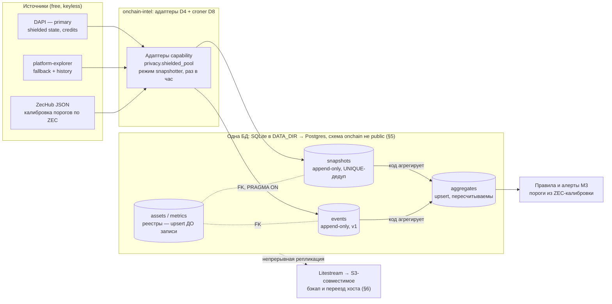
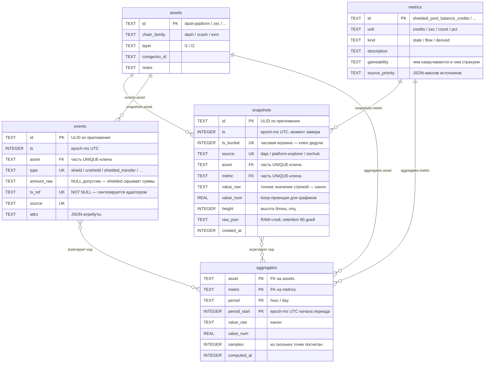

# DB-SCHEMA-CONCEPT — расширяемая схема данных `onchain-intel`

- **Статус:** Draft (companion к [ADR-001](ADR-001-tech-stack.md) D6/D7; решения движка НЕ пересматривает)
- **Дата:** 2026-07-20
- **Провенанс:** пробелы и подтверждённые факты — из верификации coin-analytics-диалога
  (run `wf_f294ed8b-f82`, [вердикты](../../reference/coin-analytics-dialog-verification.md));
  план внедрения — [reference/coin-insights-build-plan.md](../../reference/coin-insights-build-plan.md)
- **Скоуп:** схема аналитических данных (снапшоты → события → агрегаты) + миграция
  SQLite→Postgres + переезд сервер→сервер. НЕ скоуп: кеш/budget-таблицы (описаны в D6),
  watchlists/алерты (D7/M3) — они сосуществуют в той же БД, здесь не перепроектируются.

---

## 1. Принципы (portable-by-design)

Схема проектируется так, чтобы **оба вида миграции — движка (SQLite→Postgres) и хоста
(сервер→сервер) — были механическими операциями**, а не проектами:

1. **Только переносимые типы.** `TEXT` / `INTEGER` / `REAL`; никаких SQLite-специфичных
   фич (виртуальные таблицы, `AUTOINCREMENT`-зависимость) и Postgres-специфичных
   (массивы, enum-типы) в v0/v1.
2. **Время — только `INTEGER` epoch-ms UTC.** Никаких строковых локальных дат и функций
   времени БД в логике приложения. (В Postgres остаётся `BIGINT`; удобные `timestamptz` —
   через view на этапе 4, не в каноне.)
3. **ID генерирует приложение** (ULID как `TEXT`) — не полагаемся на автоинкремент движка;
   идентификаторы глобально уникальны и переживают любой перенос/слияние.
   *(Поправка 2026-07-20 — Postgres-first профиль, §8):* ULID был конвенцией **переносимости
   SQLite** (у SQLite нет server-side genid, а нужна кросс-движковая уникальность). В едином
   PG-профиле id допустим как `uuid DEFAULT gen_random_uuid()` (сервер генерит надёжно;
   миграции «назад в SQLite» в этом профиле нет). app-ULID остаётся валиден для
   embedded/локального профиля и там, где нужен **сортируемый-по-времени** id. Инвариант
   «id стабилен и глобально уникален» не меняется; ключ дедупа наблюдений — не id, а
   natural-UNIQUE (§1.5), поэтому server-default id безопасен.
4. **JSON хранится как `TEXT`**; никакого `json1`-SQL в логике — парсинг на стороне
   приложения. (JSONB-индексы — опция этапа 4 в Postgres.)
5. **Append-only + идемпотентность (snapshots, events).** Таблицы наблюдений только
   дописываются; у каждой — естественный UNIQUE-ключ дедупликации, запись через
   `INSERT ... ON CONFLICT DO NOTHING` (работает в обоих движках, SQLite ≥3.24).
   Следствие: повторный прогон снапшоттера безвреден, параллельные писатели **в одной
   БД** не создают дублей (кросс-серверная механика — §6). Исключение — `aggregates`:
   они пересчитываемы и пишутся upsert-ом `INSERT ... ON CONFLICT DO UPDATE`
   (портабелен так же) либо транзакционным delete+recompute периода — иначе пересчёт
   молча оставляет устаревшую строку.
6. **FK — включать явно.** SQLite по умолчанию НЕ проверяет `REFERENCES`
   (`foreign_keys=OFF` per-connection; Postgres проверяет всегда): Repository открывает
   каждое SQLite-соединение с `PRAGMA foreign_keys=ON`, адаптеры upsert-ят строки
   реестров `assets`/`metrics` ДО записи наблюдений, verify-скрипт (§5.3) считает
   строки-сироты. Иначе месяцы тихих сирот превращают «механический» backfill §5
   в разбор данных (COPY падает на первом FK-нарушении).
7. **Точные значения — строкой.** Канон числа — `value_raw TEXT` (credits и wei-подобные
   целые могут превышать безопасные 2^53 для `REAL`/JS-number); `value_num REAL` — удобная
   проекция для графиков/сравнений, допускающая потерю точности. В Postgres `value_raw`
   опционально становится `NUMERIC` (этап 4).
8. **Один словарь метрик.** Имена метрик/источников — из реестра (`metrics`, §2), а не
   свободные строки по вкусу агента; это персистентная форма canonical-типа `Snapshot` (D5).
9. **Доступ через Repository-интерфейс** (паттерн `CacheStore`/`BudgetStore` из D6) —
   смена движка не трогает логику.
10. **Весь state — в одном каталоге `DATA_DIR`** (db-файл + WAL + экспорты); секреты —
   отдельно в `.env` (D10), в БД не попадают; код stateless. Перенос инсталляции =
   перенос одного каталога.
11. **В Postgres — собственная схема, не `public`.** Все таблицы движка создаются в
   выделенной схеме **`onchain`**: роль приложения — её владелец, `search_path = onchain`,
   в `public` не создаётся ничего (опционально жёстче:
   `REVOKE CREATE ON SCHEMA public FROM PUBLIC`). Зачем: изоляция при общем
   Postgres-сервере с другими приложениями (n8n и т.п.), дамп и перенос одной командой
   (`pg_dump --schema=onchain`), простые права (одна роль — одна схема). В SQLite схем
   нет — изоляцией служит сам отдельный файл БД; имена таблиц остаются без префиксов,
   идентичность SQL между движками обеспечивает `search_path`
   (drizzle: `pgSchema('onchain')` в pg-диалекте, обычные имена в sqlite-диалекте).

**Анти-цели**: НЕ 50–100 таблиц ([build-plan §4](../../reference/coin-insights-build-plan.md)),
НЕ партиционирование/materialized views сейчас ([build-plan §2, «Не делать»](../../reference/coin-insights-build-plan.md)),
НЕ TimescaleDB и НЕ таблица-на-чейн — собственные scope-решения этого документа
(масштабирование — через `asset`/`metric` колонки + реестр). Подтверждённые объёмы первой
цели этого не оправдывают: Dash Platform = 17 537 documents, 3 038 identities, 133
shielded-tx **за всё время** (as-of 2026-07-19, [верификация #4](../../reference/coin-analytics-dialog-verification.md)) —
снапшоттер пишет сотни строк в день.

**Обзор: поток данных и место схемы в движке**



---

## 2. Схема v0 — снапшоттер (нужна сегодня)

Три таблицы. Достаточно для pre-M0 снапшоттера из [ROADMAP](ROADMAP.md) и калибровки порогов.

> DDL ниже — движко-нейтральный канон. В Postgres все таблицы создаются в схеме
> `onchain`, не в `public` (§1.11, через `search_path`); в SQLite — как есть
> (отдельный файл БД = пространство имён).

```sql
-- Реестр активов (справочник, десятки строк)
CREATE TABLE IF NOT EXISTS assets (
  id            TEXT PRIMARY KEY,   -- 'dash-platform' | 'dash' | 'zec' | ...
  chain_family  TEXT,               -- 'dash' | 'zcash' | 'evm' | ...
  layer         TEXT,               -- 'l1' | 'l2'
  coingecko_id  TEXT,
  notes         TEXT
);

-- Реестр метрик (справочник; персистентный словарь canonical-типа Snapshot из D5)
CREATE TABLE IF NOT EXISTS metrics (
  id               TEXT PRIMARY KEY, -- 'shielded_pool_balance_credits' | 'identities_total' | ...
  unit             TEXT NOT NULL,    -- 'credits' | 'zec' | 'count' | 'pct'
  kind             TEXT NOT NULL,    -- 'state' (снимок) | 'flow' (за период) | 'derived' (вычислена)
  description      TEXT,
  gameability      TEXT,             -- чем накручивается и каким derived-сигналом страхуем (§4 стандартов)
  source_priority  TEXT              -- JSON-массив источников по приоритету: ["dapi","platform-explorer"]
);

-- Точки временных рядов (append-only; главная таблица v0)
CREATE TABLE IF NOT EXISTS snapshots (
  id          TEXT PRIMARY KEY,      -- ULID (генерит приложение)
  ts          INTEGER NOT NULL,      -- epoch-ms UTC, момент замера
  ts_bucket   INTEGER NOT NULL,      -- floor(ts/3600000)*3600000 — часовая корзина (ключ дедупа)
  source      TEXT NOT NULL,         -- 'dapi' | 'platform-explorer' | 'zechub' | ...
  asset       TEXT NOT NULL REFERENCES assets(id),
  metric      TEXT NOT NULL REFERENCES metrics(id),
  value_raw   TEXT NOT NULL,         -- точное значение строкой (канон)
  value_num   REAL,                  -- проекция для графиков (может терять точность)
  height      INTEGER,               -- высота блока/metadata.height источника, если отдаёт
  raw_json    TEXT,                  -- полный ответ источника (RAW-слой; retention см. §4)
  created_at  INTEGER NOT NULL,
  UNIQUE (source, asset, metric, ts_bucket)   -- идемпотентность и безопасная двойная запись
);
CREATE INDEX IF NOT EXISTS idx_snapshots_series ON snapshots (asset, metric, ts);
```

Замечания:

- `UNIQUE (source, ..., ts_bucket)` включает `source`: DAPI и platform-explorer пишут
  **параллельные ряды** одной метрики — это фича (кросс-чек первичного и вторичного
  источника), выбор «какому ряду верить» делает `metrics.source_priority`.
- `raw_json` — это RAW-уровень из трёхслойной модели диалога (RAW→NORMALIZED→METRICS),
  ужатый до одной колонки: полный ответ хранится рядом со значением, отдельного
  «сырого стора» не нужно на этих объёмах.

## 3. Схема v1 — события и агрегаты (M1–M3, добавляется без переделки v0)

```sql
-- Нормализованные события (shield/unshield/transfer/...); появляется, когда
-- появится источник событийной гранулярности (история platform-explorer / DAPI)
CREATE TABLE IF NOT EXISTS events (
  id        TEXT PRIMARY KEY,        -- ULID
  ts        INTEGER NOT NULL,        -- epoch-ms UTC
  asset     TEXT NOT NULL REFERENCES assets(id),
  type      TEXT NOT NULL,           -- 'shield' | 'unshield' | 'shielded_transfer' | ...
  amount_raw TEXT,                   -- точная сумма строкой (может быть NULL: shielded скрывает суммы)
  tx_ref    TEXT NOT NULL,           -- txid / 'height:index' / контент-хэш — ДЕТЕРМИНИРОВАННАЯ координата;
                                     -- нет txid у источника => адаптер ОБЯЗАН синтезировать её
                                     -- (NULL в ключе дедупа не ловится: NULLs distinct в обоих движках)
  source    TEXT NOT NULL,
  attrs     TEXT,                    -- JSON-атрибуты типа события
  UNIQUE (source, asset, type, tx_ref)
);
CREATE INDEX IF NOT EXISTS idx_events_series ON events (asset, type, ts);

-- Агрегаты (hourly/daily; считает КОД из snapshots/events — детерминированно, пересчитываемо)
CREATE TABLE IF NOT EXISTS aggregates (
  asset        TEXT NOT NULL REFERENCES assets(id),
  metric       TEXT NOT NULL REFERENCES metrics(id),
  period       TEXT NOT NULL,        -- 'hour' | 'day'
  period_start INTEGER NOT NULL,     -- epoch-ms UTC начала периода
  value_raw    TEXT NOT NULL,
  value_num    REAL,
  samples      INTEGER NOT NULL,     -- из скольких точек посчитан (честность агрегата)
  computed_at  INTEGER NOT NULL,
  PRIMARY KEY (asset, metric, period, period_start)
);
```

Watchlists / rules / alerts / job-log (M3) и cache / usage (D6) живут в той же БД по своим
определениям из ADR-001 — сюда не дублируются. `Signal` (D5) ссылается на `aggregates`
по `(asset, metric, period, period_start)`, на `snapshots` — по `(source, asset, metric, ts_bucket)`.

**ER-схема целиком** (проекция; источник истины — DDL в §2–§3):



## 4. Уровни хранения и retention

Трёхслойная идея диалога (RAW→NORMALIZED→METRICS) — подтверждённо здравая, применяем в
минимальной форме:

| Слой | Где живёт | Retention |
|---|---|---|
| RAW | `snapshots.raw_json`, `events.attrs` | ≥90 дней, дальше можно `NULL`-ить колонку (значения остаются) |
| NORMALIZED | `snapshots` (без raw_json), `events` | ≥1 год (на текущих объёмах — можно вечно) |
| METRICS | `aggregates` | вечно (копейки) |

Правило: retention-чистка — отдельный явный job с логом «сколько строк, какой период»
(ничего молча, §6 стандартов).

---

## 5. Миграция SQLite → Postgres (по триггерам ADR-001 §Revisit)

**Триггеры** (не календарь): >1 пишущего инстанса · нужны durable-ретраи/конкуренция ·
файл БД растёт к десяткам ГБ · нужен SQL-доступ нескольким потребителям одновременно.

**Карта типов** (механическая благодаря §1):

| SQLite (канон) | Postgres | Примечание |
|---|---|---|
| `TEXT` (id/ULID, metric, source) | `TEXT` | как есть |
| `INTEGER` (epoch-ms) | `BIGINT` | НЕ `timestamptz` в каноне; view `*_ts` с `to_timestamp(ts/1000.0)` — для удобства |
| `REAL` | `DOUBLE PRECISION` | как есть |
| `value_raw TEXT` | `TEXT` → опц. `NUMERIC` | смена типа — этап 4, отдельной миграцией |
| `raw_json/attrs TEXT` | `TEXT` → опц. `JSONB` | этап 4; до того — байт-в-байт |
| `UNIQUE`/`PRIMARY KEY` | как есть | ключи дедупа переносятся без изменений |

**Этапы:**

1. **Подготовка.** Поднять Postgres 16 (docker-сервис рядом); `CREATE SCHEMA onchain` +
   роль-владелец + `search_path = onchain` — ничего в `public` (§1.11); drizzle-схема
   второго диалекта (`pgSchema('onchain')`) из того же описания таблиц; контрактные
   golden-тесты Repository гоняются против ОБОИХ движков в CI (D11).
2. **Backfill.** Экспорт SQLite → CSV (`sqlite3 -csv`) → `COPY` в `onchain.<table>`
   (или скрипт через Repository, батчами). Append-only ⇒ backfill можно повторять
   инкрементально по `ts > max(ts)`.
3. **Verify (обязательный гейт).** По каждой таблице: row count совпадает; `min(ts)`/`max(ts)`
   совпадают; `sum(value_num)` в допуске; N случайных строк — `value_raw` байт-в-байт;
   строк-сирот (наблюдение без строки в `assets`/`metrics`, §1.6) — ноль.
   Скрипт verify остаётся в repo — он же используется при переездах хоста (§6).
4. **Dual-write окно.** Repository пишет в оба движка (идемпотентность из §1.5 делает это
   безопасным), чтение — из SQLite. День-два наблюдения расхождений (verify по крону).
5. **Cutover.** Чтение переключается на Postgres; SQLite-файл замораживается как
   cold-архив (и остаётся путём отката: flip чтения обратно + докатка дельты из PG
   скриптом — append-only это позволяет).
6. **Постгрес-фичи — только теперь** (и по потребности): `JSONB` + GIN-индекс,
   партиционирование `events` по месяцу, materialized views вместо таблицы `aggregates`,
   Timescale — отдельным решением, если вообще понадобится.

## 6. Переезд сервер → сервер (частые миграции хоста)

Требование: хост может меняться часто. Дизайн выше делает переезд дешёвым; вот механика.

**Инварианты, которые делают переезд безопасным:**

- Весь state = каталог `DATA_DIR` (§1.10); деплой = `docker compose up` + `.env` + `DATA_DIR`.
- Идемпотентная запись (§1.5) ⇒ **zero-gap стратегия — с оговоркой по фазам.**
  UNIQUE-ключ дедуплицирует параллельных писателей только **внутри одной БД**:
  в Postgres/managed-фазе (общая БД) двойная запись со старого и нового хоста безопасна
  как есть; в SQLite-фазе у каждого хоста СВОЙ файл — дублей не будет, но ряды
  расходятся по файлам. Поэтому порядок runbook ниже: сначала перенести историю, потом
  запускать нового писателя (окно передачи покрывает продолжающий работать старый);
  расхождение хвостов при необходимости закрывается явным merge-ом:
  `ATTACH` старой БД + `INSERT ... SELECT ... ON CONFLICT DO NOTHING`.
- Off-site бэкап существует независимо от переездов (см. Litestream ниже) — переезд
  никогда не единственная копия данных.

**SQLite-фаза — три механики на выбор:**

| Механика | Как | Когда выбирать |
|---|---|---|
| **Litestream** (рекомендуется как постоянный фон) | непрерывная репликация db-файла в S3-совместимое хранилище (R2/B2/minio); на новом хосте `litestream restore` → старт | частые переезды: новый сервер разворачивается из реплики за минуты, RPO — секунды; это одновременно и бэкап |
| Горячий снапшот + rsync | `VACUUM INTO 'export.db'` (онлайн, консистентно) или `sqlite3 .backup` → rsync/scp каталога → старт | разовый перенос без внешнего хранилища |
| Холодная копия | остановить писатель → `PRAGMA wal_checkpoint(TRUNCATE)` → скопировать файл | самый простой путь; при часовом каденсе и двойной записи даунтайм не создаёт дыр |

**Postgres-фаза:**

- На подтверждённых объёмах (годы вперёд): `pg_dump -Fc --schema=onchain` →
  `pg_restore` — достаточный путь, даунтайм минуты; с двойной записью снапшоттера —
  тоже zero-gap. Выделенная схема (§1.11) делает дамп точным: ничего чужого из общего
  сервера не прихватывается.
- Почти нулевой даунтайм при больших объёмах: логическая репликация
  (publication → subscription старый→новый; на PG15+ — `FOR TABLES IN SCHEMA onchain`) →
  переключение писателя.
- Радикальный вариант при действительно частых переездах: **managed Postgres**
  (Neon/Supabase/RDS) — тогда переезд сервера приложения БД вообще не трогает
  (меняется только хост процесса, connection string тот же).

**Runbook переезда (чек-лист):**

1. Новый хост: развернуть compose + `.env` (секреты — руками/из менеджера, не в архиве с данными).
2. Перенести историю **до старта нового писателя**: `litestream restore` (restore не
   пишет поверх существующего файла) или экспорт+rsync из таблицы выше. Старый
   снапшоттер продолжает работать — окно передачи покрыто им.
3. Запустить снапшоттер на новом хосте. В Postgres/managed-фазе это честная двойная
   запись в общую БД; в SQLite-фазе хвост старого хоста (строки, записанные после
   шага 2) при необходимости докатывается merge-ом из инвариантов выше.
4. **Verify-скрипт** (тот же, что в §5.3): row counts, `max(ts)` свежее двух каденсов,
   spot-check `value_raw`, ноль сирот.
5. Переключить нотификации/cron/DNS на новый хост; остановить старый снапшоттер;
   старый `DATA_DIR` заморозить на N дней (путь отката).
6. Записать переезд в лог инсталляции (дата, хосты, verify-результат) — §6 стандартов:
   ничего молча.

---

## 7. Дисциплина чисел

Все числовые обоснования этого документа (объёмы Dash Platform, отсутствие истории в
DAPI, наличие history у platform-explorer) — из адверсариальной верификации 2026-07-19:
[reference/coin-analytics-dialog-verification.md](../../reference/coin-analytics-dialog-verification.md).
Объёмные оценки «на глаз» из coin-analytics-диалога (250 байт/событие, ГБ/мес по чейнам)
сюда **не переносились** как непроверенные (§2 стандартов, number-source rule). Прежде чем
проектировать под бóльшие объёмы — измерить: проиндексировать 1 000 реальных блоков в эту
схему и снять фактический размер таблиц+индексов.

---

## 8. Профиль деплоя: n8n + Postgres («выделенный сервер»)

*(Добавлено 2026-07-20. Companion к [ADR-001](ADR-001-tech-stack.md) D8/D6/D7-дополнениям:
n8n принят как планировщик/оркестратор, Postgres-first с первого дня. Причина — **не объём**
данных, а операционное ограничение: `croner`-скрипт на ноутбуке не always-on, машина
спит/выключена → пропуски часовых замеров, а истории в DAPI нет — дыру не восстановить.
Разработка/обкатка — на локальной Ubuntu; прод — тот же стек на выделенном сервере.)*

### 8.1 Топология БД

- **Отдельная database `onchain_intel`** на **том же PG-кластере**, где работает n8n —
  **НЕ внутренняя БД n8n** (её трогать нельзя: миграции/бэкапы n8n снесут чужие данные, и
  наоборот). n8n и снапшоттер делят *сервер*, но не *базу*.
- Внутри `onchain_intel` — схема **`onchain`, не `public`** (§1.11): владелец — роль
  **`onchain_app`**, `search_path = onchain`, в `public` ничего не создаётся. Даёт точный
  `pg_dump --schema=onchain` и изоляцию прав (одна роль — одна схема).
- `onchain_app` — единственная роль, нужная снапшоттеру (владелец схемы: DML + DDL миграций).
  n8n-нода Postgres подключается к `onchain_intel` под ней (или под rw-ролью с
  `search_path=onchain`); к своей служебной БД n8n ходит под собственной ролью.

### 8.2 Тип id в этом профиле (поправка §1.3)

id генерирует **сервер**: `id uuid PRIMARY KEY DEFAULT gen_random_uuid()` (встроено в PG13+;
иначе расширение `pgcrypto`). ULID-как-`TEXT` (§1.3) был конвенцией переносимости SQLite и
здесь необязателен. Ключ дедупа наблюдений — не id, а natural-UNIQUE
`(source, asset, metric, ts_bucket)` (§1.5) → server-default id безопасен, и Code-нода n8n id
**не формирует** (INSERT его опускает).

### 8.3 Что НЕ отменяется сменой стека (инварианты §1 — обязательны)

Смена SQLite→Postgres и croner→n8n меняет только движок и оркестратор. **Незыблемо:**

- **Схема `onchain`, не `public`** (§1.11) — см. 8.1.
- **Время — `BIGINT` epoch-ms UTC** (§1.2); никаких БД-функций времени в логике.
- **`value_raw` — СТРОКОЙ, не float** (§1.7): credits превышают безопасные 2^53; `value_num`
  (`DOUBLE PRECISION`) — только lossy-проекция для графиков. Приведение credits к number в
  Code-ноде n8n **запрещено** (1c: нормализация без парсинга значения в число).
- **Идемпотентность — `INSERT ... ON CONFLICT DO NOTHING`** по UNIQUE
  `(source, asset, metric, ts_bucket)` (§1.5): повторный прогон часа не создаёт дублей.
- **Upsert реестров `assets`/`metrics` ДО записи наблюдений**, `FK` включён (§1.6; в PG FK
  проверяется всегда). Seed реестров — в миграции (8.4 / 1b).
- **Каждое число — с источником и as-of** (§7, number-source rule): `source`, `height` (если
  источник отдаёт), `raw_json`, `created_at` — заполняются всегда.

### 8.4 Dev-среда (локальная Ubuntu, docker compose)

- `docker compose`: `postgres:16` + `n8n` (по скиллу `n8n-self-hosting`); named volumes для
  PGDATA и n8n-data; `.env` с секретами (0600, вне git — ADR-001 D10).
- Bootstrap БД: `CREATE DATABASE onchain_intel`; роль `onchain_app`; `CREATE SCHEMA onchain
  AUTHORIZATION onchain_app`; `ALTER ROLE onchain_app SET search_path = onchain`.
- Миграции — SQL-файлы в repo (`sql/migrations/001_init.sql`): DDL из §2 в PG-диалекте по
  карте типов §5 (`INTEGER`→`BIGINT` для epoch-ms, `REAL`→`DOUBLE PRECISION`, `value_raw`→`TEXT`,
  id→`uuid DEFAULT gen_random_uuid()`), + seed `assets` (`dash-platform`, `zec`) и `metrics`
  (словарь §2 с `unit`/`kind`/`source_priority`). Применение **идемпотентно**
  (`CREATE TABLE IF NOT EXISTS`; seed через `ON CONFLICT DO NOTHING`) — повторный прогон безопасен.

### 8.5 План dev→prod (написать сейчас, выполнить после отладки — 1d)

Специализация runbook'а §6 для **двух отдельных PG-инстансов**. **Порядок обязателен**
(UNIQUE дедупит только внутри одной БД — инстансы не видят ключи друг друга):

1. Prod-хост: тот же `docker compose` (`n8n-self-hosting` / `n8n-multi-instance`); bootstrap
   БД/роли/схемы (8.1); применить те же миграции (8.4).
2. **Сначала перенести историю:** `pg_dump -Fc --schema=onchain` c dev → `pg_restore` на prod
   (выделенная схема → берётся ровно `onchain`, ничего чужого с общего сервера). **Только
   потом** включать prod-schedule снапшоттера.
3. Хвост dev-периода (строки после дампа) докатить **повторным дампом** с `ON CONFLICT DO
   NOTHING` (append-only + идемпотентность §1.5 делают докатку безопасной).
4. Импорт workflow'ов на prod через `n8n-mcp`/n8n API; **креды пересоздать руками** в n8n
   Credentials (в экспортном JSON их нет — 1c).
5. **Verify-гейт** (тот же, что §5.3/§6): row counts совпадают, `max(ts)` свежее двух каденсов,
   сирот (наблюдение без строки реестра) = 0, spot-check `value_raw` байт-в-байт. Результат — в
   лог инсталляции (дата, хосты, verify).
6. Переключить нотификации/DNS на prod; остановить dev-schedule; dev-дамп заморозить как путь
   отката на N дней.

### 8.6 Бэкап prod с первого дня

`pg_dump -Fc --schema=onchain onchain_intel` по расписанию (можно отдельным n8n-workflow) →
S3-совместимое хранилище (R2/B2/minio), retention по поколениям. Off-site-копия существует
**независимо** от переездов (переезд — никогда не единственная копия). На подтверждённых
объёмах (сотни строк/день) `pg_dump`/`pg_restore` достаточно; логическая репликация PG
(`FOR TABLES IN SCHEMA onchain`) — только если объём вырастет (§6).
