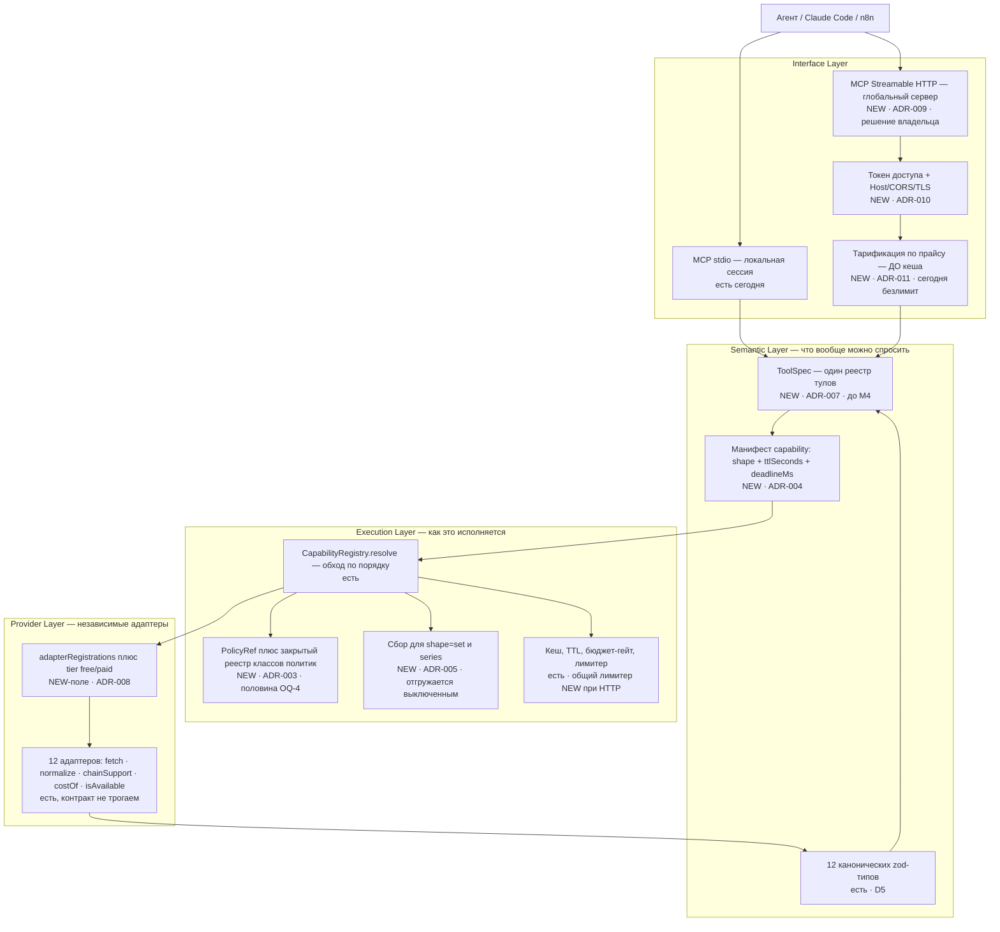
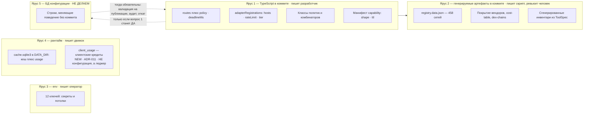
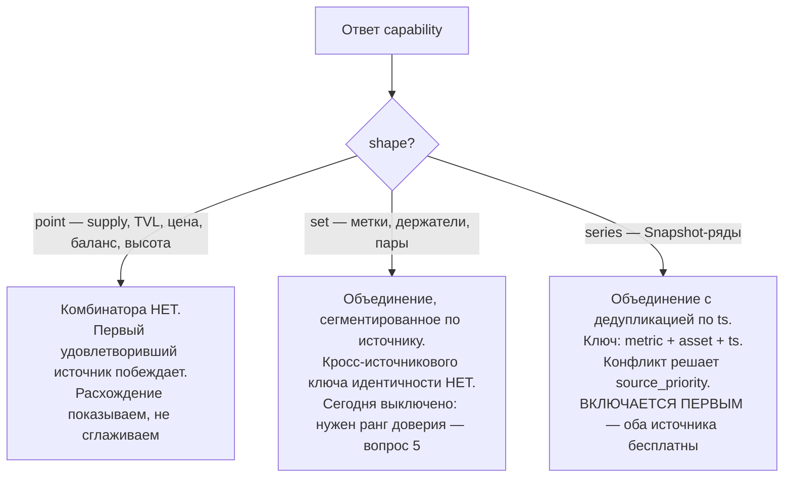
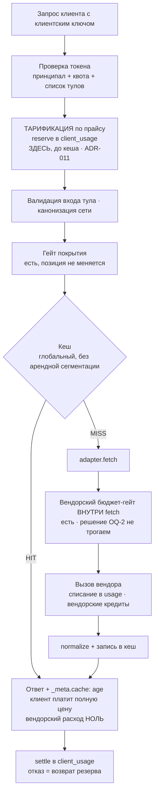

# Разбор идеи «конфигурируемый DPAL» — варианты и заготовки ADR

- **Дата:** 2026-07-31 · **Статус:** анализ; **четыре вопроса из восьми закрыты владельцем 2026-07-31** (§0.1),
  ADR не подписаны
- **Вход:** [`docs/architect_idea_20260730.txt`](../architect_idea_20260730.txt) — исходная идея владельца
  (SAP-подобные профили вызовов) + ответ LLM (DPAL, четыре слоя, Execution Plan, Strategy)
- **Метод:** 13 агентов — 5 читателей кода, 3 независимых архитектурных варианта, 3 адверсариальных
  ревьюера, поэлементный вердикт, синтез. Каждое утверждение о коде привязано к `файл:строка`.
- **Связанные:** [ADR-001](ADR-001-tech-stack.md) (D1–D12) · [ARCHITECTURE](../ARCHITECTURE.md) §1.2
  (постоянные ограничения) · [open-questions](../architectures/open-questions.md) (OQ-4, OQ-M3-1)

---

## 0. Краткий вывод

**Цель, ради которой предлагается редизайн, уже достигнута.** TASK-009 добавил двенадцатый адаптер —
50 файлов — и **не тронул ни `adapters/registry.ts`, ни `adapters/types.ts`** (`git show --stat 4713993`).
«Добавить провайдера = написать коннектор + строки конфигурации, роутер не менять» — это описание
сегодняшнего состояния, а не будущего.

Разбор 32 элементов идеи:

| Вердикт | Сколько | Смысл |
|---|---|---|
| **already-built** | 6 | Уже есть, часто под другим именем и с большей строгостью |
| **adopt** | 5 | Брать как есть — настоящие пробелы |
| **adopt-modified** | 12 | Брать, но с ограничением, иначе ломает что-то оплаченное |
| **defer** | 2 | Ждали выбора транспорта (OQ-M3-1) → **разблокированы 2026-07-31**, см. §2.3 |
| **reject** | 7 | Разворот решений, у которых есть измеренная цена ошибки |

Три полноценных варианта (A/B/C) написаны и адверсариально отревьюены. **Ни один не прошёл ревью
целиком** (оценки 5/4/3 из 10). Рекомендация — **граф**: четыре дешёвых независимых куска +
семантика агрегации.

**После ответов владельца 2026-07-31** (§0.1) картина такая: транспорт — **HTTP для глобального MCP**;
**доступ продаётся** по нашим общим вендорским ключам за клиентские кредиты, сейчас не в полном объёме,
но швы закладываются сразу (§0.2); Tool Registry — **до M4**; первым включается слияние **исторических
рядов**; ранг доверия провайдера — **нужен**; дедлайн вызова — **настоящая граница с отменой**, а не
отчётность. ADR стало **12**: добавились ADR-010 (периметр сетевого сервера), **ADR-011 (тарификация
клиента и швы мультиарендности)** и ADR-012 (ранг доверия). **Все восемь вопросов закрыты**; формально
открыт один — локус конфигурации в проде (1), и он не влияет на код.

> 🔴 **Отзыв предыдущей редакции.** В версии от того же дня здесь стояло «коммерческого яруса не будет,
> вариант C снят» — это было моим неверным прочтением ответа про второго арендатора. Коммерческий ярус
> **есть**, он целевой; снята только его BYO-часть. Все затронутые места помечены таким же значком.

## 0.1. Ответы владельца (2026-07-31)

Записаны дословно по смыслу, с последствиями. Разделы ниже приведены в соответствие с ними;
там, где ответ что-то закрывает, стоит пометка **[решено 2026-07-31]**.

| № | Вопрос | Ответ владельца | Что из этого следует |
|---|---|---|---|
| **3. Транспорт** | Какой из трёх вариантов OQ-M3-1 | **«Это будет HTTP для глобального MCP»** | OQ-M3-1 закрывается вариантом 1 — Streamable HTTP. Движок перестаёт быть только локальным stdio-процессом; открываются профили и токен доступа (§2.3), и вместе с ними появляется обязательная связка auth/CORS/порт/TLS — **отдельный под-ADR внутри ADR-009** |
| **8. Коммерческая модель** | Есть ли второй арендатор / коммерческое обязательство в 12 месяцев | **«Я разработаю MCP, но хочу продавать к нему доступ по своим общим ключам с кредитами. Клиент создаёт кабинет на моём портале, генерирует ключ, пополняет кредитами и не заботится о том, как я достаю данные. Сейчас в полной мере делать не буду, но надо сразу заложить архитектуру под эту фичу»** | 🔴 **Мой предыдущий вывод был неверен и отозван.** Коммерческий ярус — это **целевая модель**, а не отменённый вариант. Правильная формулировка: **мультиарендность на НАШИХ вендорских ключах**. Отсюда: BYO-ключи, KMS и ротация клиентских вендорских ключей **не нужны** (это был верный вывод по другой причине), а **клиентские ключи доступа, кредитный баланс и списание — нужны и должны быть заложены сейчас**. Разбор — §0.2 |
| **Режим сегодня** | — | **«Сейчас я создаю ключ для себя и пользуюсь им безлимитно, пока тестирую и разрабатываю»** | Фаза 0 модели: **один самовыпущенный токен с безлимитной квотой**. Важно, что это не «механизма нет», а «механизм есть, значение = безлимит»; иначе безлимит окажется закодирован отсутствием кода, и его нельзя будет ограничить, не переписывая путь запроса |
| **6. Момент Tool Registry** | До M4 или после | **«Скорее всего до»** | ADR-007 переезжает в план **до M4** — и это дополнительно усиливается ответом про HTTP: второй интерфейс делает единый `ToolSpec` не удобством, а условием, иначе инвентарей станет не шесть, а семь |
| **2. Ценность слияния** | Стоит ли двухисточниковый `entity.labels` кредита Nansen | **«В параграфе 7 правильно описано»** | Принята переформулировка §7: первым включается сбор на **исторических рядах** (`*.history`, оба источника бесплатны), `entity.labels` остаётся выключенным до появления ранга доверия |
| **1. Локус конфигурации** | Может ли непроверенная строка конфигурации переставить платный маршрут | **«Тут ты прав. Но это можно выявить на этапе использования / разработки и сделать настройки как надо»** | Возражение принято как **порядок работы**: значения находятся в разработке и эксплуатации, после чего фиксируются. Вопрос сужен — §5 |
| **5. Ранг доверия провайдера** | Нужен ли атрибут доверия сейчас | **«Да, нужен. Только эти варианты будут использоваться?»** | Нужен, и **не двузначный** — ответ на встречный вопрос в §5 п.5: предлагается упорядоченный `authoritative` / `community` / `derived`, с правилом «добавление значения = правка кода + тест», как у реестра политик |
| **7. Учёт Blockscout** | Мерить сейчас или ждать первого отказа | **«Да, надо померить и посчитать, чтобы ориентироваться на эти цифры. Можно будет сделать заодно с другими задачами»** | Вариант (а). **Не отдельная задача** — прицепляется к ближайшей работе, которая и так трогает `usage`/леджер, то есть к ADR-011 (клиентская тарификация) |
| **4. Глубина дедлайна** | Отчётная граница или настоящая отмена | **«Давай вариант (б)»** | Настоящая граница: абсолютный `deadlineAtMs` в `ProviderAdapter.fetch`, протянутый в `throttle()` и `safeFetch`. Огибающая `entity.labels` падает с **≈410 с** до значения из манифеста. Ограничение, без которого решение стоило бы денег: **платный запрос в полёте дорезается** — отмена бьёт только по тому, что ещё не оплачено. Полная форма — §5 п.4. ADR-004 становится подписываемым целиком |
| **Объём T-014** | Полный HTTP-кусок или минимальный | **«T-014 полный»** | Транспорт, токен, периметр, **профили и общий лимитер сразу** — без промежуточного состояния, где сетевой сервер живёт с процессным бакетом. Цена принята явно: M3 сдвигается примерно на два месяца. Взамен исчезает окно, в котором первый внешний клиент упирается в лимитер, рассчитанный на одну локальную сессию |

**Отозванное предупреждение.** В предыдущей редакции здесь стоял тезис «сервер тратит наши кредиты по
чужим запросам без коммерческой обвязки, которая эти траты оправдывает». Он снят: обвязка **и есть**
продукт — клиент платит кредитами за доступ. Три пункта самозащиты (токен, общий лимитер, учёт по
токену) остаются в силе, но меняют статус: это не защита от отсутствия бизнес-модели, а **несущие
детали самой бизнес-модели**.

## 0.2. Коммерческая модель и швы, которые надо заложить сразу

Модель, как её сформулировал владелец: **клиент покупает доступ, а не данные**. Кабинет на портале →
клиентский ключ → пополнение кредитами → вызовы MCP. Как движок достаёт данные — не его дело.

### 0.2.1. Разграничение терминов (иначе разговор рассыпается)

| Термин | Что это | Статус |
|---|---|---|
| **Клиентский ключ** | Ключ доступа **к нашему MCP**, выпускается в кабинете | ✅ **Это и есть продукт.** Закладываем сейчас |
| **Клиентские кредиты** | Наша внутренняя валюта: клиент пополняет, мы списываем по прайсу | ✅ Закладываем сейчас (сегодня: один токен, безлимит) |
| **Вендорский ключ (наш)** | Наш `NANSEN_API_KEY` и прочие — в `.env`, 0600, D10 | ✅ Без изменений |
| **Вендорский ключ клиента (BYO)** | Клиент приносит свой ключ Nansen | ❌ **Не нужен и не проектируется** — модель ровно обратная. Отсюда: KMS, ротация и шифрование чужих секретов из плана уходят |

### 0.2.2. 🔴 Два независимых счётчика, которые нельзя сливать

Это главное архитектурное следствие ответа владельца про кеш, и оно **исправляет** мою прежнюю ошибку.

| | **Вендорский расход** | **Клиентское списание** |
|---|---|---|
| Что считает | сколько мы задолжали Nansen/Blockscout | сколько мы списали с клиента |
| Единица | вендорские кредиты + вызовы | **наши** кредиты по прайсу |
| Где считается | **внутри `adapter.fetch()`** (решение OQ-2, не трогаем) | **на границе тула, ДО обращения к кешу** |
| При попадании в кеш | **ноль** | **полная цена** |
| Кто устанавливает | вендор | мы, прайс-листом |
| Хранилище | `usage` / `usage_window` (есть) | `client_usage` (новое) |

**Почему «до кеша» — не деталь, а требование.** Владелец: «второй пользователь должен будет нам
заплатить столько же, даже если использует кэш — в этом бизнес-модель». Значит списание **не может**
жить там, где живёт вендорский гейт: тот вызывается только на промахе. Тарификация обязана стоять на
границе тула, до `resolve()`, иначе кеш-попадание окажется бесплатным для клиента — то есть скидка,
которую никто не назначал.

**Что это исправляет в моём прежнем анализе.** Я писал: «персональный ключ ломает инвариант ключа кеша
в обе стороны, третьего варианта нет». Это было верно **только для BYO-модели**. В модели «наши ключи +
прайс» третий вариант есть и он лучше обоих:

> **Кеш остаётся глобальным и без арендной сегментации; `args_hash` не меняется. Клиент платит не за
> вызов вендора, а за ответ.**

Кеш перестаёт быть механизмом экономии для клиента и становится **чистой маржой**: выручка не зависит
от попадания, а наш расход — зависит. Это, кстати, снимает конфликт интересов вокруг TTL: агрессивный
кеш выгоден нам и не обкрадывает клиента.

**Обязательная плата за это — раскрытие возраста данных.** Если клиент платит полную цену за ответ из
кеша, он должен видеть, что ответ из кеша и какого он возраста. У нас это **уже есть** — `_meta.cache`
с `status` и `ageMs`. Меняется его статус: из отладочного поля оно становится **частью коммерческого
контракта** и не может быть убрано «за ненадобностью». Иначе продажа несвежих данных без раскрытия.

### 0.2.3. Швы, которые надо заложить сейчас, даже не реализуя фичу

Владелец: «сейчас в полной мере делать не буду, но надо сразу заложить архитектуру». Дешёвые сейчас и
дорогие потом — ровно эти шесть:

1. **Принципал протянут через весь путь запроса.** `ctx.principal` появляется на границе тула и доходит
   до леджера. Сегодня значение всегда одно (`self`), квота — безлимит. Цена сейчас: одно поле в
   контексте. Цена потом: правка 13 тулов + сигнатуры роутера.
2. **Тарификация — отдельный `BillingStore`, а не колонка в `BudgetStore`.** Тот же проверенный паттерн
   `reserve → settle`, что уже работает на вендорском бюджете (атомарность через `BEGIN IMMEDIATE`), но
   **другой леджер и другая единица**. Слить их в одну таблицу — значит навсегда потерять различие
   «наш расход» / «выручка», а на кеш-попадании они расходятся всегда.
3. **Прайс-лист как версионируемые данные, отдельно от вендорских цен.** Цена **фиксируется в момент
   списания** и хранится в строке леджера: иначе изменение прайса задним числом переписывает историю
   начислений.
4. **Идемпотентность списания.** Клиентский `request_id`: ретрай по таймауту не должен списывать дважды.
   У сетевого клиента ретраи — норма, а не исключение.
5. **`shareable: boolean` в манифесте capability.** Сегодня все 17 — публичные ончейн-факты, общий кеш
   безопасен. Флаг нужен как **страховка на будущее**: первая же capability, чей ответ зависит от
   личности вызывающего (watchlist, приватный алерт), не должна попасть в общий кеш по невнимательности.
   Правило: `shareable: false` → кеш только в пределах принципала либо не кешируется вовсе.
6. **Квоты и лимиты — поля на токене с самого начала.** `creditsBalance`, `rateLimit`, `toolAllowlist`.
   Сегодня: безлимит, все тулы. Отсутствующее поле нельзя «выставить в безлимит» — его придётся вводить,
   а вместе с ним и весь путь проверки.

**Чего сознательно НЕ делаем сейчас** (и это остаётся honest-оценкой цены яруса C): кабинет и портал,
приём платежей, инвойсинг, экспорт метрик потребления, тарифные планы, SLA и дежурство. Заложенные швы
делают их **аддитивными**, но сами по себе продуктом не являются.

---

## 1. Что уже построено (поправка к премисе)

| Объект идеи | Что это в коде сегодня |
|---|---|
| «Поля / объекты данных абстракций» | 12 канонических zod-типов, все `.strict()`, каждый несёт `source` и `fetchedAt`; валидируются дважды — в адаптере и на границе MCP (D5) |
| «Capability Model» (бизнес-операция над тулом) | Capability — **первичная** ось: по ней маршрут, TTL, покрытие, ключ кеша и бюджет-гейт. 17 capability за 13 тулами |
| «Последовательности доступа» | `routes[].adapterIds`, обход по порядку; порядок задокументирован как **правило траты**, а не подсказка (`providers.config.ts:81-84`) |
| «Первый найденный» + FallbackOnly | Реализовано, причём с различением, которого в списке Strategy нет: «все ответили, ни у кого нет» ≠ «кого-то не удалось спросить» (`packages/core/src/adapters/registry.ts:440-455`) |
| «Никаких кросс-проверок между адаптерами» | Не просто соблюдается — записано как **отклонённая альтернатива**: первый фикс делал `blockscout` бросающим на пустом ответе и был отвергнут (`adapters/types.ts:86-100`) |
| Canonical Schema | Есть, и набор лучше предложенного: `ChainSupply` — **два** именованных поля, потому что два вендорских числа измеряют разные величины |

Итого: **~85% идеи — это отгруженный дизайн под новыми именами.**

Что действительно стоит 50 файлов на адаптер: ~15 файлов кода + ~25 файлов документации/evidence
под гейтами + **шесть дублирующихся инвентарей тулов**. Из всей идеи на это влияет **только Tool
Registry**.

---

## 2. Поэлементные вердикты

### 2.1. Брать как есть (adopt)

| Элемент | Почему | Что меняется |
|---|---|---|
| **«MCP-сервер настраивается по списку настроенных тулов»** (Tool Registry) | Самый острый реальный выигрыш. Новый тул надо вписать в **шесть** независимых списков, ссылающихся друг на друга только в текстах падений; самый медленный (`smoke-dist.mjs`) срабатывает лишь после полной сборки — из-за чего дважды оставался красным на main (RF-4). TASK-009 потратил ~49 строк чистой бухгалтерии | `createServer` — цикл по `ToolSpec[]`; шесть инвентарей становятся **читателями** одного реестра. Не сливать их: WI-20 закрыт с формулировкой «избыточность намеренная» — они бегут в четырёх разных средах исполнения |
| **«каждый шаг с дополнительным лимитом по токенам»** | Называет уже записанный и открытый дефект: perf H-3 — свободный ярус `entity.labels` может съесть суточный потолок в 30 кредитов за шесть обращений; blockscout тратит реальный вендорский бюджет вообще без учёта (`costOf` = 0, нет строки `usage`, ~160 кредитов на вызов при 100K/сутки ≈ 625 вызовов) | Потолок на шаг, проверяемый до шага. Обязан использовать **два знаменателя** — кредиты И вызовы: один знаменатель не может отказать вызову ценой 0 (Q-3) |
| **Execution Profile** (группировка retry/timeout/cache/rate limit/budget/logging) | Все механизмы есть, но раскиданы по пяти файлам на **четырёх разных гранулярностях**, и `SafeFetchOptions {timeoutMs, maxResponseBytes}` — параметр, который **ни один адаптер не переопределяет**: keyless-каталог и 250 КБ график DeFiLlama делят одну пару 15 с / 10 МБ | Один объект профиля на провайдера. **Три оговорки обязательны:** retry и circuit breaker намеренно отсутствуют (записано, `reliability.md:36-38`); один бюджетный знаменатель — регрессия SEC-1+Q-3; rate limit — **на процесс**, бюджет — межпроцессный через SQLite, т.е. N сессий = N полных бакетов |
| **LangGraph — не в ядре, уровнем выше** | Совпадает с уже принятым D1: тяжёлая оркестрация делегируется внешним движкам как чёрный ящик; фреймворков оркестрации в репозитории нет | Строка в ADR. Ни кода, ни зависимости |
| **Четырёхслойное деление (Semantic/Execution/Provider/Interface)** как словарь | Слои уже существуют директориями с принудительной границей: `fetch()` возвращает `unknown`, наружу выходит только результат `normalize()` | Раздел ADR, переименовывающий существующее. Ноль кода |

### 2.2. Брать с ограничением (adopt-modified) — ключевые

| Элемент | Ограничение, без которого ломает |
|---|---|
| **Тул как таблица (описание, поля, признак активности)** | Описание и обе схемы существуют, но как TS-литералы в 13 почти одинаковых модулях. Из четырёх подпунктов **два не выживают как данные**: «маппинги» (см. Normalization) и список полей не должен рендерить сети/enum в схему |
| **Провайдер (платный/бесплатный, профиль подключения, адаптер)** | Объект есть — `adapterRegistrations`, 12 строк. Реальный пробел: флага paid/free нет, зато есть **вторая, руками синхронизируемая** классификация `PAID_PROVIDER_IDS` в `cache/sqlite-store.ts:48`, а `providers.kind` пишется как `'unknown'` и никем не читается. Подтаблица «возвращаемых тулов» = хранимая матрица покрытия → отклонить |
| **Merge / WeightedMerge** | Это единственное, чего OQ-4 действительно просит, и код это **предразрешил**. Но: `WeightedMerge` над точечными величинами (TVL, supply, баланс) — жёсткий отказ, репозиторий **отказывает, а не примиряет** (`blockchain-info/index.ts:281-286`). Годится только для **множественных** capability, чей канонический элемент несёт собственный `source` |
| **Normalization Layer / Mapping как сущность** | Слой есть; «маппинг как строки конфигурации» в основном непостроим: замерено по десяти адаптерам — **85–90% `normalize()` это не переименование**, а отказ на форме, которую вендор не утверждал, точная bigint-арифметика, конверсия единиц и эпох, ветвление канонизации адреса по семейству. У `blockchain-info` переименований **ноль**. Единственная реально декларативная ось: `on_invalid: drop_field \| drop_row \| refuse` |
| **Connection Type → Instance → Profile** | Трёхуровневая форма полезна, и случай уже есть: у coingecko два непересекающихся контура. Переносить в конфиг можно **выбор контура**; нельзя — полезную нагрузку: ключ остаётся в `.env` (D10), хост остаётся скомпилированным литералом (SSRF-allowlist перепроверяется на каждом редирект-хопе) |
| **Feature Flags** | Из восьми построены две (`Disabled`, `Requires API key`), одна — реальный пробел (`Paid only`), пять не имеют читателя. `dune` буквально и есть выключенный провайдер, выраженный захардкоженным `isAvailable() → false` |
| **Execution Plan вместо последовательности доступа** | Вырожденный предок уже есть: `resolve()` строит план, **паря каждый адаптер с политикой того маршрута, который его дал** — и это был фикс дефекта M-2/M-3. Любой редизайн с политикой на capability, а не на шаг, возвращает уже найденный баг. Ветвления `если confidence < 80` — убрать: входа нет, а существующая политика обязана **fail-open**, у числового порога такого прочтения нет |

### 2.3. Отложить (defer) → **разблокировано** решением по транспорту [решено 2026-07-31]

Исходно оба элемента упирались в один невыбранный транспорт. Владелец выбрал: **HTTP для глобального
MCP**. Ниже — что это меняет и что при этом остаётся обязательным.

| Элемент | Было заблокировано | Стало после выбора HTTP |
|---|---|---|
| **Токен доступа к MCP с лимитами и списком тулов** | Сетевого транспорта нет: stdio не объявляет session id, один процесс = один сервер = одна сессия | **Становится реализуемым и обязательным.** Streamable HTTP несёт `authInfo` в обработчик запроса — принципал появляется. Обязательным его делает не удобство: сетевой адрес движка без токена — это открытый кран к платному Nansen |
| **Список профилей / пер-профильный инвентарь тулов** | `enabled` — свойство **глобального для сервера** `RegisteredTool`: спрятать тул = спрятать у всех | **Решается топологией, а не протоколом.** Протокольная сторона и так бесплатна (сервер уже объявляет `tools: {listChanged: true}`); нужен **экземпляр `McpServer` на сессию**, построенный из профиля — фабрика `createServer(deps)` эту форму уже поддерживает. Не пытаться сделать это через `disable()` на общем сервере |
| **Клиентские ключи доступа** | Ломали инвариант ключа кеша в обе стороны | 🔴 **Прежний вывод отозван — он относился к BYO-модели.** Продаются ключи **к нашему MCP**, вендорские ключи остаются нашими. Значит `args_hash` не меняется, **кеш остаётся глобальным**, а клиент платит по прайсу за ответ, а не за вызов вендора (§0.2.2). Это и есть тот «третий вариант», которого, как я утверждал, не существует |
| **Пер-клиентский бюджет** | В `usage` нет колонки арендатора (PK = `(provider, day)`) | **Нужен отдельный леджер `client_usage`, а не колонка в `usage`.** Единицы разные, момент списания разный, и на кеш-попадании они расходятся всегда: вендорский расход 0, клиентское списание — полная цена |

**Что при этом становится строго обязательным и раньше не было:**

1. **Аутентификация и сетевая гигиена** — bearer-токен, валидация заголовка `Host`, CORS, порт, TLS-терминация.
   Это отдельный под-ADR внутри ADR-009, и его нельзя отложить «на потом»: он появляется в ту же секунду,
   что и слушающий сокет.
2. **Общий лимитер вместо процессного.** Сегодня бакет — модульный синглтон в процессе, рассчитанный на
   последовательный обход одной сессии; N процессов = N полных бакетов, тогда как бюджет межпроцессный
   через SQLite. С сетевым сервером эта асимметрия перестаёт быть теоретической.
3. **Ревизия SSRF-гейта под новый вход.** Сегодня вход — доверенный локальный агент. У сетевого сервера
   параметры тула приходят от кого угодно; `hosts`-allowlist и запрет «данные из сети влияют на allowlist»
   становятся не гигиеной, а периметром.
4. **Тарификация до кеша и раскрытие возраста данных** (§0.2.2) — появляется вместе с первым платящим
   клиентом, но шов закладывается сразу.

### 2.4. Отклонить (reject) — с ценой ошибки

| Элемент | Почему нет |
|---|---|
| **«Матрица покрытия — не надо проверять кодом, пусть будет таблица»** | Самый резкий разворот в документе. Покрытие **выводится**: `∃ adapterId ∈ route(cap) : adapter.chainSupport(chain, cap)` и не хранится нигде, потому что «колонка означала бы поддержку покрытия в двух местах, и они разойдутся на первом же изменении». Измеренный случай: переиспользование TVL-предиката DeFiLlama для DEX-объёмов рекламировало бы capability на **184 сетях без данных** (458 против 274). Таблица вдобавок не выражает пересечение по под-вызовам — ровно тот баг, ради которого предикат и сделан |
| **Типы подключений в БД (API_KEY, тип проброски, endpoint, тест-link)** | Каждое названное поле — поверхность безопасности. Секреты: D10 держит ключи только в `.env` 0600, читаются внутри `fetch()` **после** вычисления хеша аргументов; шифрования at rest, ротации и аудита ключей в проекте нет вовсе. Хосты: R-56c — «allowlist остаётся статическим на всё время работы, любой путь, где данные из сети влияют на allowlist, запрещён», и `.env.example:25-28` уже отказал более слабой env-версии ровно этого. Настраиваемое имя заголовка вне `SENSITIVE_HEADER_RE = /authorization\|api-?key/i` — это credential, которого не узнаёт срезатель при кросс-хостовом редиректе. «Тест-link», который движок дёргает, — SSRF-примитив по построению |
| **`Confidence` на контракте тула; HighestConfidence, MajorityVote** | Сигнала confidence в рантайме нет — **ноль вхождений** по `packages/*/src` (проверено). Существующие сигналы качества (`truncated`, `droppedRows`, `gapDays`, `ageMs`) — булевы и счётчики, не сводимые в скаляр. MajorityVote вдобавок тавтологичен: провайдеры, считающие величину одинаково, совпадают по построению — репозиторий это выяснил и **вынес кросс-сверку за пределы пути ответа**, в eval, где `circulating === emission` докладывается как **дефект**. Согласие здесь — тревога, а не сигнал качества |
| **Fastest (гонка провайдеров), Cheapest** | Fastest — вектор траты: на платном маршруте кредиты резервируются **внутри** `fetch()`, значит проигравший в гонке всё равно платит. Бакет per-provider, в процессе, рассчитан на последовательный обход, с порогом честности 30 с, который **отказывает**, а не ждёт. Cheapest — no-op в костюме фичи: порядок адаптеров уже и есть правило траты, а `costOf()` **не вызывается роутером ни разу** |
| **Численное слияние точечных величин** (TVL, цена, баланс, supply, высота) | Репозиторий отказывает, а не примиряет; точные значения — bigint через строки именно для того, чтобы никто их не усреднял. Отдельно: не втягивать mempool.space в путь ответа — он намеренно отсутствует во всех маршрутах и allowlist'ах, «источник, которым мы сами отдаём число, не может быть его проверкой» |
| **`execute()/health()/capabilities()/normalize()` — «и всё»** | Буквально удаляет две несущие методы и оставляет мёртвый. `chainSupport(chain, capability)` — **единственный** механизм за матрицей покрытия, `onchain_list_chains` и гейтом отказа на платном маршруте (и берёт capability, потому что покрытие — свойство **пары**: у nansen 16 против 18 сетей). `costOf` — вход бюджет-гейта. Схлопывание `isAvailable()` `{ok:false, reason}` в булев `health()` ломает R-24. Ирония: `capabilities()`, один из четырёх оставляемых, **не имеет ни одного вызова** в `src/` |
| **«Поддерживаемые сети» плоским списком на контракте тула** | Две независимые причины, у каждой измеренная цена. (а) Плоский список не выражает составное покрытие: `smart-money.flows` делает два под-вызова, покрытие = **пересечение** (16), а объединение впустило бы 8 сетей, где второй под-вызов откажет **после** траты кредитов — класс дефекта DF-1, стоивший 35 живых кредитов. (б) Рендер набора сетей в схему тула — это закрытый enum, против которого владелец уже решил: ~8.7k токенов в **каждом** запросе к модели, заменено открытой строкой + `onchain_list_chains`, и охраняется тестом |

---

## 3. Варианты

Три варианта написаны независимо и отревьюены по шести линзам (соответствие отгруженному коду,
доктрина истинности данных, безопасность, эксплуатируемость, цена/ценность, коммерческий эндшпиль).

### Вариант A — «Thin Collect» (оценка 5/10)

Политика маршрута из JS-замыкания превращается в сериализуемый дескриптор `{kind, params}`,
выбирающий класс из закрытого реестра; последовательный обход учится **продолжать сбор** для
множественных capability; добавляется дедлайн на весь обход. Никакого хранилища, никакого
параллелизма, никакой мультиарендности.

- **Цена:** заявлено 3 инж.-недели / ~34 файла; после обязательных сокращений — ~3 дня кода + починка документации.
- **Что нашло ревью:** заглавный примитив сбора — **доказуемый no-op** на отгруженной таблице маршрутов
  (см. §7 — здесь у меня поправка); `source = sources[0]` публикует ложное происхождение; дедлайн не может
  ограничить то, ради чего вводится, потому что у `ProviderAdapter.fetch` нет параметра сигнала.
- **Брать, если** ответ на вопрос «может ли непроверенная строка конфигурации переставить платный маршрут» — **нет**.

### Вариант B — «Compiled Configuration Plane» (оценка 4/10)

Все объекты идеи становятся первоклассными (Capability, Tool manifest, ResolutionPlan, Connection
Type/Instance/Profile, RequestProfile), но пишутся как zod-валидируемый ревьюируемый исходник,
компилируемый в закоммиченный артефакт, загружаемый один раз на старте. Плюс агрегирующий роутер
(union множеств с провенансом).

- **Цена:** 9–11 инж.-недель + ~30% документации (девять прозаических счётчиков связаны тестом).
- **Что нашло ревью:** флагманская поставка — no-op; экономическое обоснование опирается на «налог шести
  инвентарей», который составляет ~4 файла и ~49 строк из 50 файлов, при том что адаптер после всего
  по-прежнему стоит ~15 файлов кода — это **срабатывание собственного kill-критерия**; `ONCHAIN_PROFILE`
  даёт env-переменной выбирать профиль подключения, т.е. SSRF-allowlist — противоречит собственному же
  заглавному правилу; предложенный валидатор хостов **забракует все 12 отгруженных строк** и не даст загрузиться.
- **Брать, если** нужна полная SAP-подобная объектная модель явно и есть готовность потратить квартал до M3.

### Вариант C — «DPAL-Commercial» (оценка 3/10) — **целевая модель, но не как единый проект** [уточнено 2026-07-31]

> 🔴 **Пометка «снят с рассмотрения» из предыдущей редакции отозвана.** Она стояла на моём неверном
> прочтении ответа про коммерцию. Владелец: доступ к MCP **продаётся** — по нашим общим ключам, за
> клиентские кредиты; сейчас не строится в полном объёме, но архитектура закладывается сразу (§0.2).
>
> **Что при этом остаётся верным из оценки 3/10.** Низкая оценка была не за коммерческую цель, а за
> **упаковку**: 50–67 недель одним проектом, где мультиарендность, control-plane Postgres, OAuth,
> REST/OpenAPI, KMS и слияние едут одним поездом, причём ревью нашло внутренние противоречия (шаг 8
> против собственного ADR-008, HTTP-трафик на этап раньше общего лимитера). Правильная форма —
> **разобрать на швы и фазы**: §0.2.3 закладывает шесть швов сейчас, ADR-011 описывает тарификацию,
> а кабинет/платежи/тарифные планы приходят тогда, когда появится первый платящий клиент.
>
> **Что из варианта C выпадает окончательно** — всё, что было построено вокруг **BYO-ключей клиентов**:
> KMS, ротация чужих секретов, шифрование клиентских вендорских credential'ов, сегментация кеша по
> арендатору. Модель «наши ключи + прайс» их не требует, и это не отсрочка, а другое проектное решение.

Два плана: скомпилированное ядро (адаптеры, allowlist'ы, стили авторизации, `normalize`, классы
стратегий, схемы) и неизменяемо версионируемый каталог в Postgres, строки которого могут только
**ссылаться** на зарегистрированные ядром id. Сверху MCP-over-HTTP + OAuth, REST/OpenAPI,
мультиарендность, пер-арендаторный бюджет, арендная сегментация кеша.

- **Цена:** **50–67 инж.-недель** (12–16 месяцев соло), **исключая** биллинг, метринг, инвойсинг,
  поддержку и SLA; плюс постоянные Postgres, KMS, Redis, always-on хост и дежурство.
- **Что нашло ревью:** машинерия слияния, вокруг которой всё построено, имеет **одну** живую цель, и
  `UnionByElementIdentity` на ней несостоятелен (у Nansen `EntitySearchResult` нет ни chain, ни address,
  идентичность падает на `name`, который сама схема помечает как задаваемый атакующим); шаг 8 (роутер
  резервирует в одной транзакции) **противоречит** собственному ADR-008 («бюджет-гейт остаётся внутри
  `fetch()` адаптера»); канонические схемы v2 — крупнейший ломающий пункт — **не нужны** для слияния,
  ради которого заложены; многоарендный HTTP-трафик выпускается **на этап раньше** общего лимитера.
- **Как читать эту цену теперь.** 50–67 недель — это стоимость **всего** варианта одним проектом,
  включая BYO-часть, которая вычеркнута, и кабинет с платежами, который приходит по факту первого
  клиента. Цена того, что закладывается **сейчас** (шесть швов §0.2.3 + фаза 0: принципал, `BillingStore`,
  прайс-лист, идемпотентность, `shareable`, поля квот на токене) — **порядка 1–2 недель** поверх
  ADR-009/010, потому что паттерн `reserve → settle` и атомарность через `BEGIN IMMEDIATE` уже
  отработаны на вендорском бюджете и переиспользуются, а не изобретаются.

### Рекомендация — граф (то, с чем согласны все три и что пережило ревью)

Отгрузить четыре дешёвых, независимо откатываемых куска, каждому не нужны ни хранилище, ни транспорт:

1. **`isSatisfying` → сериализуемый `policy?: {kind, params?}`** + закрытый реестр классов. Это
   дословно половина «политика как классы» из решения владельца 2026-07-28, процитированная из
   собственного докстринга (`adapters/types.ts:101-111`). Радиус: 3 файла исходников, 2 файла тестов.
2. **Манифест capability** с `ttlSeconds NOT NULL` и новым `shape: 'point' | 'set' | 'series'`
   (три значения, а не два — см. схему 3 и §7). `shape` делает слияние точечной величины
   **непредставимым на этапе конструирования**, а не запрещённым по договорённости; `NOT NULL` делает
   класс дефекта «забыли строку TTL» (случался **четырежды**) структурно невозможным вместо
   «обнаруживаемого гейтом, читающим исходник».
3. **Скомпилированный `ToolSpec[]`**, из которого генерируются шесть инвентарей. Единственный пункт с
   измеренной повторяющейся ценой. **Делается до M4** — решение владельца 2026-07-31.
4. **`tier: 'free' | 'paid'`** на `AdapterRegistration`; удалить дублирующий `PAID_PROVIDER_IDS`.

Плюс: **определить семантику агрегации сейчас** — сбор разрешён только для `set` и `series`, никогда
не кешируется как единица, недоступный участник по-прежнему даёт `hadFailure` и бросок. Отличие от
исходной редакции: механизм отгружается **выключенным только для `set`**; на `series` он **включается
сразу** (`*.history`, оба источника бесплатны, ключ дедупликации `(metric, asset, ts)`) — §7, принято
владельцем.

Половину OQ-4 про БД — **отклонить письменно** с дешёвым путём возврата (дескриптор остаётся чистым
сериализуемым значением, поэтому загрузчик позже строго аддитивен), а сам вопрос **задать владельцу**,
а не решать в техническом ADR.

### Схема 1 — целевая картина после графа + решения по транспорту

Прямоугольники с пометкой **NEW** — то, чего сегодня нет. Всё остальное существует и не переписывается.



### Схема 2 — где живёт конфигурация и кто её пишет

Ключевой водораздел: всё, что может **потратить деньги, назвать хост или нести секрет**, остаётся в
ревьюируемом диффе. Пунктир — путь возврата, если ответ на вопрос 1 когда-нибудь станет «да».



### Схема 3 — что можно объединять, а что нельзя

`shape` из ADR-004 — не метаданные, а **отказ конструктора**: у точечной величины комбинатора
не существует, поэтому «слить два TVL» нельзя написать даже по ошибке.



### Схема 4 — два счётчика: где списывается с клиента и где тратится у вендора

Ключ к §0.2.2: **тарификация стоит до кеша, вендорский гейт — после**. Поэтому кеш-попадание стоит
клиенту столько же, а нам — ноль.



---

## 4. Разбиение на ADR

| # | ADR | Вопрос | Подписываем сейчас? |
|---|---|---|---|
| **ADR-002** | Локус конфигурации | Может ли строка конфигурации, не проверенная в git-диффе, менять, какой провайдер вызывается, в каком порядке, к каким хостам и с каким credential? | ⚠️ **сужен** — владелец согласился с доводом; осталось решить только про **прод** после появления HTTP (§5, вопрос 1) |
| **ADR-003** | Политика ответа маршрута = сериализуемый дескриптор + классы в коде | Как выражается кросс-провайдерная политика теперь, когда её собственный докстринг называет её временной? | ✅ |
| **ADR-004** | Capability как первоклассный объект: `shape`, обязательный TTL, дедлайн вызова | Где живут вид результата, TTL и граница времени всего вызова, и как «не сливать точечные величины» превращается из ревью-правила в отказ конструктора? | ✅ **целиком [решено 2026-07-31]** — глубина дедлайна выбрана: вариант (б), §5 п.4 |
| **ADR-005** | Семантика агрегации, механизм выключен | Чем **может быть** многоисточниковый ответ и что возвращается, когда одного участника не удалось спросить? | ✅ — с тремя значениями `shape`: `point` / `set` / `series` (схема 3) |
| **ADR-006** | На чём включается сбор первым | Ряды `*.history` или метки `entity.labels`? | ✅ **[решено 2026-07-31]** — формулировка §7 принята: первыми ряды, `entity.labels` остаётся выключенным |
| **ADR-007** | Идентичность тула = один скомпилированный реестр | Инвентарь тулов — один артефакт или шесть списков вручную? | ✅ **[решено 2026-07-31]** — делаем **до M4** |
| **ADR-008** | Ярус провайдера как одна классификация | Платный/бесплатный — свойство регистрации, и кто имеет право это читать? | ✅ |
| **ADR-009** | OQ-M3-1: каким интерфейсом зовут способности движка | Streamable HTTP, one-shot CLI, или таблица заданий в Postgres? | ✅ **[решено 2026-07-31]** — **HTTP для глобального MCP**. Остаётся оформить + под-ADR по auth/CORS/порту/TLS |
| **ADR-010** *(следствие ADR-009)* | Периметр сетевого сервера | Токен доступа, общий лимитер вместо процессного, ревизия SSRF-гейта под недоверенный вход | ❌ — пишется вместе с ADR-009, подписывается после него |
| **ADR-011** *(новый — коммерческая модель)* | Тарификация клиента и швы мультиарендности | Где списываются клиентские кредиты, почему это **до** кеша и в **отдельном** леджере, и какие шесть швов закладываются сейчас при одном безлимитном токене? | ⚠️ **можно писать сейчас** — модель владельцем задана (§0.2); подписывается вместе с ADR-009/010, т.к. без принципала не реализуема |
| **ADR-012** *(новый — вопрос 5 закрыт)* | Ранг доверия провайдера | Какая шкала: два значения или больше, и что она меняет в выдаче? | ✅ **[решено 2026-07-31 — «да, нужен»]** — предложение по шкале в §5 п.5, требует только подтверждения набора значений |

**Порядок относительно дорожной карты** (обновлён после ответов владельца).

**Первым**, на старте M3: оформить **ADR-009** (транспорт) вместе с **ADR-010** (периметр) и
**ADR-011** (тарификация и швы). Три ADR идут одним пакетом не по удобству, а потому что **разделить их
нельзя**: принципал появляется в ADR-009, проверяется в ADR-010 и списывает кредиты в ADR-011 — любые
два без третьего дают либо сетевой адрес без владельца запроса, либо владельца без учёта.

Здесь же реализуется **фаза 0** (§0.2.3): один самовыпущенный токен, безлимитная квота, все тулы,
`client_usage` пишется, но ничего не запрещает. Это единственный способ убедиться, что швы рабочие, не
строя кабинет. Сюда же прицепляется **замер Blockscout** (вопрос 7, ответ «заодно с другими задачами»):
работа и так трогает леджер и счётчик вызовов.

**Вторым**, параллельно M3 и независимо от HTTP-работ (~1–2 недели, каждый откатывается одним
коммитом): ADR-003, манифестная половина ADR-004, ADR-008 + починка документации
(`system-architecture.md:352` показывает `chainSupport?(chain: ChainInfo)` без параметра `capability`,
который есть в коде; `:376-380` показывает `CapabilityRoute` без поля политики; `:405-464` всё ещё
несёт литералы `chains: [...]`, удалённые в TASK-006).

**Третьим**, ещё в M3: ADR-005 + ADR-006 — семантика агрегации и включение сбора **на рядах**
`privacy.shielded_pool.history` / `platform.metrics.history`; плюс решение о глубине дедлайна. Дедлайн
в M3 важнее, чем сегодня, вдвойне: плановый опрос превращает неограниченный обход в фоновое зависание,
а сетевой сервер — ещё и в удерживаемое соединение.

**Четвёртым — до M4** (решение владельца): **ADR-007**, единый `ToolSpec`. Ответ про HTTP усиливает
этот пункт: второй интерфейс без единого реестра означает не шесть инвентарей, а семь.

**Пятым**, после M4: **ADR-012** (ранг доверия) и следом включение сбора на `entity.labels` — оно ждало
именно ранга. Плюс половина ADR-002 про БД (вопрос 1), если к тому моменту эксплуатация действительно
отделится от разработки.

**Шестым — по появлению первого платящего клиента, не по календарю:** кабинет, приём платежей,
тарифные планы, экспорт метрик потребления. Швы из §0.2.3 к этому моменту уже стоят, поэтому это
аддитивная работа, а не переделка.

**Чего в плане нет и не будет** (в отличие от предыдущей редакции — здесь список сузился и стал
точнее): **BYO-ключи вендоров от клиентов** и всё, что из них следовало — KMS, ротация чужих секретов,
шифрование клиентских credential'ов, сегментация кеша по арендатору. Это не отложено, а **вычеркнуто
другим проектным решением**: продаём доступ по своим ключам, а не проксируем чужие.

---

## 5. Вопросы владельцу — статус после 2026-07-31

**Закрыты (все восемь):** 2 (слияние — формулировка §7) · 3 (транспорт — HTTP) · **4 (дедлайн —
вариант «б», настоящая граница)** · 5 (ранг доверия — «да», шкала предложена ниже) · 6 (Tool Registry —
до M4) · 7 (Blockscout — мерить, заодно с ADR-011) · 8 (коммерческая модель — продаём доступ по своим
ключам за клиентские кредиты).
**Сужен и формально остаётся открытым:** 1 (локус конфигурации в проде) — на код не влияет, решается
при написании ADR-003.
**Требует подтверждения:** набор значений шкалы доверия (п. 5).

---

### 1. Локус конфигурации — сужен [частично решено 2026-07-31]

> **Ответ владельца:** «Тут ты прав. Но это можно выявить на этапе использования / разработки и сделать
> настройки как надо».

Принято, и это снимает бо́льшую часть вопроса: правильные значения (порядок адаптеров, политики,
лимиты) **находятся эмпирически в разработке и эксплуатации**, а потом фиксируются. Именно так уже
устроены все измеренные значения в `providers.config.ts` — рядом с каждым лежит запись, каким замером
оно получено. То есть **процесс** «выяснили → записали» уже принят и работает; спора о нём нет.

**Остаётся ровно один остаток, и он вырос из ответа про HTTP.** Пока движок был локальным stdio-процессом,
«кто пишет конфигурацию» и «кто её запускает» — одно лицо, и вопрос был почти академическим. У глобального
сетевого сервера появляется эксплуатация, отделённая от разработки, и тогда:

- **(а)** конфигурация остаётся скомпилированной, изменение = релиз. Плюс: любое изменение правила траты
  видно в диффе. Минус: чтобы поменять порядок провайдеров на живом сервере, нужен деплой.
- **(б)** конфигурация читается из хранилища и правится без релиза. Тогда обязательны: валидация на
  публикации (строка может ссылаться только на зарегистрированные ядром id), аудит-лог, откат к предыдущей
  версии — и жёсткая граница: **хосты, ключи и стили авторизации в хранилище не попадают никогда**.

Решать это можно **не сейчас, а вместе с ADR-009**: дескриптор политики в любом случае делается чистым
сериализуемым значением, поэтому загрузчик из хранилища добавляется позже без единой правки роутера.

### 4. Глубина дедлайна — **решено: вариант (б), настоящая граница** [решено 2026-07-31]

> **Ответ владельца:** «Давай вариант (б)».

**Что было сломано.** Таймаут существует, но он **на один сетевой хоп**, а не на вызов: `safeFetch`
строит `AbortSignal.timeout(timeoutMs)` **внутри** цикла редиректов (`net/safe-fetch.ts:360-363`), а
`MAX_REDIRECTS = 3` даёт четыре хопа с полным таймаутом каждый; сверху `throttle()` ждёт до
`MAX_WAIT_MS = 30_000` (`net/rate-limit.ts:50`), и обход маршрута последовательный. Огибающая для
`entity.labels` выведена в самом коде (`adapters/blockscout/index.ts:124-143`):
`30 + 4×5` (blockscout) `+ 30 + 4×15` (ресинк бюджета) `+ 3×(30 + 4×15)` (три подвызова nansen)
**≈ 410 с ≈ 7 минут**. Тот же комментарий и адресует задачу сюда: «настоящая граница — это дедлайн на
весь обход `resolve()`, которого не существует; см. OQ-4».

**Принятая форма — пять пунктов, все обязательные.**

1. **Реальная отмена, а не проверка часов на границе шага.** `ProviderAdapter.fetch` получает
   необязательный дедлайн; он протягивается в `throttle()` (прервать ожидание) и в `safeFetch`
   (считать остаток, а не выдавать новый таймаут на каждый хоп). Параметр необязателен: адаптер,
   который его игнорирует, деградирует ровно до отклонённого варианта (а), а не ломается.
2. **🔴 Платный запрос, уже ушедший вендору, дорезается до конца.** Кредиты резервируются **внутри**
   `fetch()` (решение OQ-2), поэтому отмена принятого вендором запроса означает «заплатили и не
   получили» — строго хуже ожидания. Дедлайн бьёт по тому, что ещё не стоило денег: ожидание в
   лимитере, бесплатные шаги, хопы редиректа. Это ограничение — не оптимизация, а условие
   корректности.
3. **Абсолютный `deadlineAtMs` (epoch), а не `timeoutMs`.** Длительности не складываются между шагами
   — каждый следующий шаг получает «свои 15 секунд» заново, и именно из этого выросли 410 с. Момент
   времени складывается сам.
4. **Владелец значения — манифест capability; вызывающий может только сузить, никогда не расширить.**
   Тот же паттерн, что уже принят для `NANSEN_DAILY_CREDIT_CAP` («сужает, но не расширяет выведенный
   потолок», OQ-5 в `open-questions.md`). С платящими клиентами это перестаёт быть эстетикой: иначе
   клиент задирает дедлайн и держит наше соединение.
5. **Превышение — типизированное событие.** Ни один источник не ответил → ошибка. Ответил хотя бы один
   → частичный результат **с явным перечислением недостающих источников**, по той же логике, что уже
   действует у `hadFailure` / `unsatisfying` (`packages/core/src/adapters/registry.ts:440-455`). До T-013 это академично, после
   включения слияния рядов — нет.

**Почему это перестало быть вопросом вкуса после решений того же дня.** Два новых довода, которых не
было при первой постановке: у сетевого сервера незавершённый обход — **удерживаемое соединение**, а не
медленный ответ в локальной сессии; и клиент **уже списан** (тарификация стоит до кеша, §0.2.2), а
значит нужен момент возврата резерва — он определён только если превышение является типизированным
событием, а не «когда-нибудь ответит».

**Что входит в поставку помимо кода:** обновить docstring `adapters/blockscout/index.ts:124-143` — он
сегодня заканчивается словами «которого не существует; см. OQ-4», и это перестанет быть правдой в том
же коммите. Оставить его как есть — значит воспроизвести класс дрейфа документации, который в проекте
уже ловили гейтами.

**Критерии приёмки, которые стоит записать в RTM T-012:** обход трёх медленных адаптеров завершается
дедлайном с типизированной ошибкой, а не на двенадцатом хопе; ожидание в лимитере **прерывается**
дедлайном (тест на насыщенном бакете); платный вызов, начатый до дедлайна, **доводится до конца**, а
резерв не теряется; вызывающий не может расширить дедлайн сверх манифеста; мутационная проверка —
снятие любого из четырёх свойств роняет ≥1 тест.

### 5. Ранг доверия провайдера — **решено «да»**, отвечаю на встречный вопрос про шкалу

> **Ответ владельца:** «Да, нужен. Только эти варианты будут использоваться?»

**Нет, двух значений мало — и вот на каких конкретных строках они ломаются.**

Двузначная шкала `authoritative` / `community` не описывает два случая, которые в репозитории **уже
есть**:

- **`derived`** — значение, которое движок **вычислил сам**, а не получил от вендора. Это не гипотеза:
  в проекте уже принято правило писать такие величины под `source='derived'`, с формулой и входами в
  `raw_json`, и **никогда** под именем вендора (урок L-2 из `CLAUDE.n8n.md`, `metrics.source_priority`
  в `DB-SCHEMA-CONCEPT` §1). Если шкала доверия не знает про `derived`, вычисленная величина получит
  ярлык того, кто её не утверждал.
- **`self-reported`** — данные, которые об объекте сообщил сам объект (метаданные токена от эмитента,
  описание протокола от протокола). Формально это не «сообщество», но и не независимый источник.
  Сегодня консументов нет, поэтому в первую версию **не включаю**.

**Предлагаю: упорядоченный enum из трёх значений** — `authoritative` > `derived` > `community`.

| Значение | Кто | Пример сегодня |
|---|---|---|
| `authoritative` | вендор отвечает за данные своим продуктом | `nansen`, `coingecko`, `defillama` |
| `derived` | наш собственный вывод по явной формуле | `bitcoinEmissionSat`, будущие производные метрики |
| `community` | содержимое редактируется посторонними | теги `blockscout` |

**Три правила, ради которых шкала и вводится** — без них это просто колонка:

1. В `set`-объединении элементы разных ярусов **сегментируются, а не перемешиваются**: клиент видит,
   что «вот это сказал Nansen, а вот это — кто-то написал в публичном эксплорере».
2. Элемент яруса `community`, попадающий в контекст модели, **помечен** — это ровно тот канал, где
   `instructions`/`tool_name` Blockscout уже выбрасываются целиком (§6).
3. Порядок — **не** правило траты. Ранг доверия и порядок адаптеров в маршруте (free-first) —
   независимые оси; сливать их нельзя, иначе бесплатный community-источник автоматически уедет вниз и
   спенд-правило сломается молча.

**Почему именно упорядоченный enum, а не булев флаг:** добавление четвёртого значения не должно быть
сменой типа. Правило то же, что у реестра политик из ADR-003: **добавление значения = правка кода +
тест**, выбор значения = строка конфигурации.

**На включение сбора на рядах (`*.history`) не влияет** — там конфликт решает `source_priority`, и обе
стороны не `community`.

### 7. Учёт трат у Blockscout — переписано простым языком

> **Ответ владельца:** «Не понял вопроса. Нужно пояснить».

**Факт.** Blockscout у нас помечен как бесплатный провайдер: `costOf` возвращает 0, строки в леджере
`usage` нет, бюджет-гейт на него не смотрит. Но у вендора есть реальный лимит: **100 000 кредитов в
сутки**, а один наш вызов `get_address_info` внутри вендора расходится на три запроса и стоит
**≈160 кредитов**. Это **≈625 вызовов в сутки** — и после этого вендор просто перестаёт отвечать.

**В чём проблема.** Мы не считаем этот расход вообще. Значит:

- узнать, что кредиты кончаются, можно только по факту — когда провайдер начнёт отказывать;
- отказ будет выглядеть по-разному в двух местах и оба раза неочевидно: на `entity.labels` цепочка
  просто уйдёт на **платный** Nansen (то есть исчерпание бесплатного провайдера начнёт незаметно
  тратить деньги), а на `token.holders` — жёсткий отказ, потому что там больше некому ответить;
- лимитер, который сейчас стоит (`refillPerSec: 2`), выбран **оборонительно**, «на глаз», и в
  комментарии прямо написано, что цитировать его как измеренный потолок нельзя.

**Почему «второй знаменатель».** Один счётчик здесь не работает. Считать **кредиты** — нельзя, потому
что для нас цена вызова равна нулю, и любой кредитный гейт пропустит бесконечно много вызовов. Считать
**вызовы** — можно, и это единственная величина, которую мы видим со своей стороны. У Nansen мы уже
наступили на это (записи SEC-1 и Q-3): счётчика кредитов оказалось недостаточно, пришлось добавлять
счётчик вызовов в минуту, потому что вызов ценой 0 кредитов не отклоняет ни один кредитный потолок.
Здесь ситуация та же, только все вызовы нулевые.

**Собственно вопрос — что делать сейчас:**

- **(а) Померить и посчитать.** Несколько часов работы: снять реальную цену наших вызовов, завести
  строку в `usage` со счётчиком **вызовов** (не кредитов) и мягкий потолок с предупреждением. Тогда
  исчерпание видно заранее, а не по симптомам.
- **(б) Ничего не делать до первого отказа.** Дешевле сейчас, но первое проявление — это либо тихая
  трата денег на Nansen, либо отказ `token.holders`, и разбираться придётся в момент инцидента.

> **Ответ владельца 2026-07-31 — вариант (а):** «Да, надо померить и посчитать, чтобы ориентироваться
> на эти цифры. Можно будет сделать заодно с другими задачами».
>
> **Куда прицепляется.** Отдельной задачей не заводим. Естественное место — **ADR-011 / фаза 0**: та
> работа и так вводит второй леджер и счётчик вызовов, а замер Blockscout — это ровно счётчик вызовов
> с известным пересчётом в вендорские кредиты. Побочная выгода: как только появится клиентский прайс,
> цифра «≈625 вызовов в сутки» перестаёт быть абстракцией и становится **входом в юнит-экономику** —
> сколько бесплатных ответов в сутки мы физически можем продать, прежде чем начнём платить Nansen за
> то, что клиенту продано как бесплатный ярус.

### Закрытые вопросы (для истории)

| № | Вопрос | Ответ 2026-07-31 | Последствие |
|---|---|---|---|
| 2 | Стоит ли двухисточниковый `entity.labels` кредита Nansen | «В параграфе 7 правильно описано» | Первыми включаются ряды; метки ждут ADR-012 |
| 3 | Транспорт OQ-M3-1 | «HTTP для глобального MCP» | ADR-009 = Streamable HTTP |
| 5 | Нужен ли ранг доверия провайдера | «Да, нужен. Только эти варианты?» | ADR-012; шкала расширена до трёх значений (§5 п.5) |
| 6 | Момент Tool Registry | «Скорее всего до» | ADR-007 до M4 |
| 7 | Мерить ли расход Blockscout | «Да… можно заодно с другими задачами» | Прицеплено к ADR-011 / фазе 0 |
| 8 | Коммерческая модель | «Продавать доступ по своим общим ключам с кредитами; кабинет, ключ, пополнение. Сейчас не в полном объёме, но архитектуру заложить сразу» | 🔴 Прежний вывод «ярус C снят» **отозван**. ADR-011 + шесть швов §0.2.3 |

---

## 6. Что отклонить громко

Сведено в §2.4. Короткая форма для ADR: **матрица покрытия таблицей**, **типы подключений с ключами и
эндпойнтами в БД**, **любой confidence-скор и голосование**, **численное слияние точечных величин**,
**гонка провайдеров**, **четырёхметодный контракт адаптера**, **маппинг строками конфигурации вместо
`normalize()`**, **рендер сетей/провайдеров/capability в схему тула**.

**Уточнено после ответов владельца — две записи из этого списка отозваны.**

- **Токены доступа и профили** больше не отклонены: транспорт выбран, они — обязательная часть
  периметра (ADR-010).
- 🔴 **«Персональные API-ключи пользователей» отозвано целиком.** Формулировка была построена на моём
  неверном прочтении коммерческой модели и смешивала две разные вещи. Разделяю:
  - **клиентский ключ доступа к нашему MCP** — это продукт, он проектируется (ADR-011);
  - **BYO — клиент приносит свой вендорский ключ** — вот это не делается, но не «из-за отсутствия
    второго арендатора», а потому что выбрана обратная модель: продаём доступ по **своим** ключам.
    Вместе с BYO уходят KMS, ротация чужих секретов и сегментация кеша по арендатору.
  - Утверждение «третьего варианта нет» было неверным. Третий вариант — **тарификация по прайсу,
    независимая от кеша** (§0.2.2): кеш глобальный, `args_hash` не трогаем, клиент платит за ответ.

Отдельно и **бессрочно**, вне зависимости от транспорта и арендаторов: **тексты описаний тулов,
задаваемые конфигурацией и попадающие в контекст модели** — это ровно тот канал инъекции, который
проект закрывает снаружи, где `instructions`/`tool_name` Blockscout **выбрасываются**, а не обрезаются,
за брендированным типом. Сетевой сервер делает этот запрет строже, а не мягче: у него источник
конфигурации и источник запроса перестают совпадать.

---

## 7. Поправка к анализу (проверено вручную, 2026-07-31) — **принята владельцем**

> **Ответ владельца 2026-07-31: «в параграфе 7 правильно описано».** Раздел переходит из статуса
> «поправка к выводам агентов» в статус **принятой формулировки ADR-006**: сбор включается первым на
> исторических рядах, `entity.labels` остаётся выключенным до ответа на вопрос 5 (ранг доверия).

Синтез утверждает, что `entity.labels` — **единственный** маршрут, где два адаптера могут ответить на
одной сети, и делает из этого вывод, что слиянию сегодня почти не на чем работать. **Это неточно, и
поправка меняет рекомендацию по ADR-006.**

Многоадаптерных маршрутов восемь (`providers.config.ts`). Пять (`dash-platform` + `platform-explorer`)
фактически одноадаптерные — живого gRPC-транспорта у `dash-platform` нет. Но **два** маршрута —

```
{ capability: 'privacy.shielded_pool.history', adapterIds: ['platform-explorer', 'pg-history'] }
{ capability: 'platform.metrics.history',      adapterIds: ['platform-explorer', 'pg-history'] }
```

— обслуживаются **двумя живыми адаптерами**, и оба возвращают **один и тот же канонический тип**
`Snapshot[]` (`platform-explorer/index.ts:203`, `pg-history/index.ts:100`). А `Snapshot`
(`types/snapshot.ts:16-26`) несёт `metric`, `asset`, `ts` и `source`.

Это **лучший кандидат на слияние в репозитории**, чем `entity.labels`, по четырём причинам:

1. **Ключ идентичности существует и состоятелен** — `(metric, asset, ts)`. Ровно то, чего нет у
   `entity.labels`, где остаётся только задаваемый атакующим `name`.
2. **Провенанс уже поэлементный** — `Snapshot.source`, менять `.strict()`-схему не нужно.
3. **Оба участника бесплатны** — вопрос «стоит ли это кредита Nansen» здесь не возникает вовсе, а
   вместе с ним исчезает и главное возражение ревью против ADR-006.
4. **Слияние здесь имеет продуктовый смысл, а не только технический:** `platform-explorer` — история
   вендора, `pg-history` — наши собственные снапшоты того же ряда из Supabase. Объединение с
   дедупликацией по `ts` — это заполнение разрывов, ровно то, ради чего снапшоттер и существует.

**Следствия.** (а) Тезис «сначала дождаться второго бесплатного провайдера на множественной capability»
уже выполнен — ждать нечего. (б) Первой включённой агрегацией должны быть **исторические ряды**, а не
`entity.labels`: там ноль денежного риска и состоятельный ключ дедупликации. (в) ADR-006 стоит
переформулировать с «включать ли сбор на `entity.labels`» на «включить сбор на `*.history`, оставив
`entity.labels` выключенным до появления доверительного ранга (вопрос 5)». (г) `shape` из ADR-004
получает **третье значение — `series`**, а не пытается уложить ряды в `set`: у ряда своя семантика
дедупликации (по `ts`) и своё правило разрешения конфликта (`source_priority`), тогда как у множества
меток кросс-источникового ключа идентичности нет вовсе. Одно значение на два разных случая означало бы
либо запрет корректного слияния рядов, либо разрешение некорректного слияния меток.

**Что при этом остаётся верным из выводов ревью:** оба ряда описывают одну и ту же величину из
пересекающихся источников, поэтому объединение обязано быть **дедупликацией по `ts` с явным правилом
разрешения конфликта**, а не конкатенацией — и правило должно быть «источник с более высоким
приоритетом выигрывает», как уже записано в `DB-SCHEMA-CONCEPT` §1 для `metrics.source_priority`,
а не усреднением. Расхождение двух источников в одной точке `ts` — это факт, который надо **показать**,
а не сгладить.

---

## 8. Каталог настроек — что будет существовать по итогам работ

Ответ на вопрос «какие настройки в результате будут созданы». Четыре яруса, различающиеся не форматом
хранения, а **тем, кто имеет право писать** и что проверяет запись. Граница проведена по одному
признаку: всё, что может **потратить деньги, назвать хост или нести вендорский секрет**, остаётся в
ревьюируемом коммите.

Обозначения: **есть** — работает сегодня · **расшир.** — добавляются поля · **НОВОЕ** — объекта нет.

### 8.1. Ярус 1 — TypeScript в коммите

*Пишет разработчик · проверяется диффом, zod-схемой и гейтом полноты.*

| Объект | Поля | Статус |
|---|---|---|
| `routes` — маршруты | `capability`, `adapterIds[]` (порядок = правило траты), `policy {kind, params}` вместо JS-замыкания, `collect {mode, combiner}` | расшир. |
| **Манифест capability** | `id`, `shape` (`point`/`set`/`series`), `ttlSeconds` **NOT NULL** (переезжает из `cache/ttl.ts`), `deadlineMs` **NOT NULL**, `shareable`, `identityKey`, описание | **НОВОЕ** |
| `adapterRegistrations` — провайдеры | `id`, `hosts[]` (SSRF-allowlist), `rateLimit`, `requiresEnv`, `tier` (`free`/`paid`), `trust` (`authoritative`/`derived`/`community`), `authStyle`, `envKeyName` — **имя переменной, не значение**, `rationale` — чем обоснован нестандартный лимит | расшир. |
| **Реестр политик** | именованные классы (`first-satisfying`, `non-empty-labels`, …). Конфигурация **выбирает** класс; добавление класса = код + тест | **НОВОЕ** |
| **Реестр комбинаторов** | `segmented-union` для `set`, `dedup-by-ts` для `series`. Точечной величине комбинатор недоступен по типу | **НОВОЕ** |
| **Реестр тулов** (`ToolSpec[]`) | `name`, `capability`, `title`, `description`, `annotations`, ссылки на схемы, функция регистрации | **НОВОЕ** |
| **Прайс-лист** | capability → цена в **наших** кредитах + версия. Цена **фиксируется в момент списания** и хранится в строке леджера | **НОВОЕ** |
| Транспортные константы | `MAX_REDIRECTS`, `DEFAULT_TIMEOUT_MS`, потолок тела ответа, `SENSITIVE_HEADER_RE` | есть |

### 8.2. Ярус 2 — генерируемые артефакты в коммите

*Пишет скрипт, перезапускает человек · проверяется тестом на совпадение регенерации.*

| Артефакт | Что в нём | Статус |
|---|---|---|
| `chain/registry.data.json` | 458 сетей: CAIP-2, вендорские соответствия, семейство адресов; колонка `rpcHosts` курируется вручную, автозаполнение запрещено | есть |
| Покрытие вендоров | три файла: nansen-coverage, blockscout-chains, defillama dex-chains — выведены из запиненных проб | есть |
| `cost-table` Nansen | цена каждой операции в **вендорских** кредитах; побайтовый дифф и есть сигнал смены прайса вендором | есть |
| **Инвентари тулов** | список для stdio-E2E, `expectedNames` для `smoke-dist`, ось `eval/capabilities.mjs`, §5 `interfaces.md` — генерируются из реестра тулов | **НОВОЕ** |
| `docs/provenance.json` | хеши запиненных живых проб | есть |

### 8.3. Ярус 3 — переменные окружения

*Пишет оператор · файл 0600 вне репозитория, валидация zod при старте (D10).*

| Группа | Что задаёт | Статус |
|---|---|---|
| Вендорские ключи | ключи провайдеров + `DATA_DIR` — 12 записей; значение **никогда** не попадает в ключ кеша и в логи | есть |
| Потолки расхода | `NANSEN_DAILY_CREDIT_CAP`, скорость расхода, максимум вызовов в минуту, порог предупреждения | есть |
| **Сетевой сервер** | порт, адрес привязки, публичный URL для проверки заголовка `Host`, разрешённые `Origin` | **НОВОЕ** |
| **Секрет токенов** | соль для хеширования клиентских токенов — в БД хранится **хеш**, не сам токен | **НОВОЕ** |

### 8.4. Ярус 4 — данные времени выполнения

*Пишет движок и кабинет · это **данные**, а не конфигурация кода.*

| Таблица | Что в ней | Статус |
|---|---|---|
| `cache_entries` | ключ `(провайдер, capability, argsHash)`; **общий для всех клиентов** | есть |
| `usage` / `usage_window` | наш расход у вендора за сутки и за скользящее окно | есть |
| **`client_tokens`** | хеш токена, владелец, баланс кредитов, лимит скорости, список разрешённых тулов, статус. **Это то, что правится через кабинет без релиза** | **НОВОЕ** |
| **`client_usage`** | кто, когда, за какую capability, по какой **зафиксированной** цене; `request_id` против двойного списания при ретрае; состояние `reserved`/`settled`/`refunded` | **НОВОЕ** |
| **Общий лимитер** | состояние бакетов по провайдерам, общее на все процессы вместо нынешнего внутрипроцессного | **НОВОЕ** |

### 8.5. 🔴 База данных появляется — но не там, где её отговаривали делать

Исходная идея предлагала хранить в БД **маршруты, типы подключений, эндпойнты и ключи**. Это отклонено
(§2.4): строка, меняющая порядок провайдеров, меняет **правило траты денег**, а строка с хостом —
**периметр исходящих запросов**.

`client_tokens` и `client_usage` — другой случай, и инвариант на них держится:

> **Клиентский токен может потратить только свой баланс, но не может изменить, к какому хосту мы
> пойдём и какого провайдера позовём.**

Поэтому они живут в БД и правятся без релиза, а маршрутизация — нет. Граница проведена по «что может
потратить деньги, назвать хост или нести вендорский секрет», а не по «что лежит в базе».

### 8.6. Что придётся трогать руками регулярно

Из всего каталога в постоянной работе участвуют три вещи; остальное настраивается один раз.

| Что | Как часто | Через что | Нужен релиз |
|---|---|---|---|
| Токены и балансы клиентов | постоянно | кабинет | нет |
| Прайс-лист capability | редко | коммит | да |
| Лимиты и порядок провайдеров по итогам эксплуатации | по факту наблюдений | коммит, с записью замера рядом со значением | да |

Третья строка — это ровно тот порядок работы, который владелец описал в ответе на вопрос 1: значения
**находятся в эксплуатации, а потом фиксируются**.

---

## 9. Приложение — где лежат полные материалы прогона

Полные тексты трёх вариантов (модель данных, план миграции по шагам с гейтами, модель исполнения,
риски, kill-критерии), 20 находок каждого адверсариального ревью и 32 поэлементных вердикта с
цитатами — в журнале прогона:
`~/.claude/projects/-Users-sergey-dev-projects-onchain-analytics/<session>/subagents/workflows/wf_43aa033f-db6/journal.jsonl`
(run `wf_43aa033f-db6`, 13 агентов, 0 ошибок).
