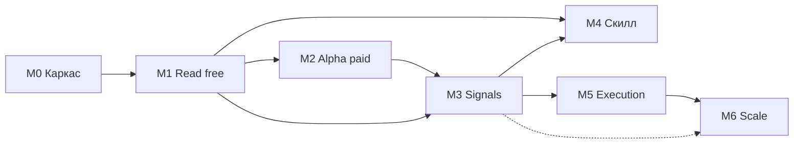

# ROADMAP — `onchain-intel` (движок) + `onchain-analytics` (скилл)

- **Дата:** 2026-06-30 · **Обновлён:** 2026-07-23 (**M1 выполнен**; ранее — **M0 выполнен** 2026-07-22; ранее 2026-07-20 — снапшоттер Dash Platform + privacy-метрики, пометки *(2026-07-20)*) · **Статус:** Active (M0 ✅ → M1)
- **Связанные:** [REPORT.md](REPORT.md) · [ADR-001-tech-stack.md](ADR-001-tech-stack.md) · [DB-SCHEMA-CONCEPT.md](DB-SCHEMA-CONCEPT.md) · [research-digest.md](research-digest.md)
- **Стек (из ADR-001):** TypeScript / Node 22 · `@modelcontextprotocol/sdk` · SQLite · zod · pnpm-monorepo · Apache-2.0.

> Оценки в «инженеро-неделях» при ~1 разработчике. Это not-fixed — границы фаз управляются **exit-критериями**, а не календарём.

---

## Принципы дорожной карты

1. **Free-first.** Сначала ценность без единого платного ключа (CoinGecko/DexScreener/DeFiLlama/Dune-free). Платное включаем, когда есть что монетизировать.
2. **Read раньше act.** Сначала надёжное чтение+сигналы; исполнение — последним и за approval-gate.
3. **Каждая фаза — самостоятельный релиз** с измеримым выходом.
4. **Адаптеры горячо заменяемы** — провайдер может умереть (Dune Sim) или подорожать; маршрутизация декларативна.
5. **Гейты качества** на каждой границе: `code-reviewer` + `security-auditor` (ключи, SSRF, approval-gate для write-tools).

---

## Обзор фаз

| Фаза | Цель | ≈Усилия | Платные ключи | Главный выход |
|---|---|---|---|---|
| **M0** Discovery & каркас ✅ *(2026-07-22)* | решить и заскелетить | 1 нед | нет | репо + MCP «hello» + CI |
| **M1** MVP read-слой (free) ✅ *(2026-07-23)* | ончейн-ответы без затрат | 1–2 нед | нет | 4 data-tools на free-провайдерах |
| **M2** Alpha-слой (paid) | «куда идут умные деньги» | 1–2 нед | Nansen $49 | smart-money + метки + budget-guard |
| **M3** Signal/Alert-движок | проактивные алерты | 2 нед | (как M2) | watchlists + правила + Telegram |
| **M4** Скилл в Universal-skills | агент-агностичный фронт | 1 нед | нет | `onchain-analytics` + evals + плагин |
| **M5** Execution (опц.) | сигнал → сделка | 2 нед | CEX/CDP по нужде | Hummingbot+MCP за approval-gate |
| **M6** Hardening/scale (опц.) | прод-готовность | 2–3 нед | — | Redis/Postgres, стриминг, обсервабилити |

---

## M0 — Discovery & каркас (≈1 нед) — ✅ ВЫПОЛНЕН 2026-07-22

> ***(2026-07-22) Итог:*** все exit-критерии закрыты. `onchain_ping` отвечает **живым вызовом из
> Claude Code** (`{"ok":true,"service":"onchain-intel-mcp-server","version":"0.1.0"}`); CI зелёный
> на GitHub (Node 22: lint → format → typecheck → 21 тест (вкл. stdio E2E) → build → smoke собранного
> `dist/`); ADR-001 Accepted (2026-07-20). Коммиты: `07cf9f2` (каркас + сервер), `8816799` +
> `c81f2b8` (13 находок трёхцикловой адверсариальной ревизии), `16c9ae1` (retro-леджеры).
> Пайплайн: VDD-Enhanced (TASK-001 → ARCHITECTURE → PLAN/4 задачи → dev+review → adversarial
> convergence). Детали: [ARCHITECTURE](../ARCHITECTURE.md), архив
> [task-001](../tasks/task-001-m0-discovery-skeleton.md) / [plan-001](../plans/plan-001-m0-discovery-skeleton.md).
> Примечание к стеку: TypeScript запинен `^6` (dts-пайплайн tsup несовместим с TS7) — см.
> work-item в [BACKLOG](../BACKLOG.md).

**Цель:** зафиксировать решения и поднять минимальный скелет.

**Задачи:**
- Принять [ADR-001](ADR-001-tech-stack.md) (закрыть Open questions: TS vs Python, хостинг).
- `docs/ARCHITECTURE.md` + `docs/TASK.md` для `onchain-intel` (через ваш agentic-пайплайн).
- pnpm-монорепо, TS strict, ESLint/Prettier, vitest, CI-гейт.
- Скелет MCP-сервера (`@modelcontextprotocol/sdk`, stdio) с одним dummy-tool `onchain_ping`.
- Каркас секретов: `.env` (0600) + zod-валидация env.

**Exit-критерии:** `onchain_ping` отвечает из Claude Code (stdio); CI зелёный; ADR подписан.
**Зависит от:** sign-off по ADR. **Риск-гейт:** —.

> ***(2026-07-20) Pre-M0, вне гейта sign-off:* мини-снапшоттер Dash Platform.** Один cron-скрипт
> (croner или system cron) раз в час пишет в SQLite снимки: `platform-explorer.pshenmic.dev/status`
> (identities/contracts/documents/credits) + `/transactions/shielded/statistic` (баланс пула,
> shield/unshield) + ZecHub-ряды ZEC для калибровки. Почему вне очереди: истории в DAPI НЕТ
> (подтверждено — [верификация #5](../../reference/coin-analytics-dialog-verification.md)), Orchard активирован в mainnet
> 2026-07-17, а единственный сторонний источник истории — community-explorer без SLA с неаудированной
> полнотой рядов ([верификация #4](../../reference/coin-analytics-dialog-verification.md)) → собственные снапшоты с первого дня. Схема таблицы —
> [DB-SCHEMA-CONCEPT.md](DB-SCHEMA-CONCEPT.md) §2. Позже скрипт переезжает в M1 как адаптер `dash-platform`/`platform-explorer` (D4).
> ***(2026-07-22) Статус: реализован ещё до M0*** — в форме n8n-workflow'ов (`onchain-snapshotter`,
> `onchain-verify`, `onchain-error-alert`) + Supabase Postgres (schema `onchain`) в dev-VM, по
> deploy-profile-дополнению ADR-001 (не croner/SQLite из исходного плана). См. CLAUDE.n8n.md,
> [PROD-RUNBOOK](PROD-RUNBOOK.md), экспорт в `n8n-workflows/exported/`.

---

## M1 — MVP read-слой, только free (≈1–2 нед) — ✅ ВЫПОЛНЕН 2026-07-23

> ***(2026-07-23) Итог:*** все exit-критерии закрыты. Все 4 tools ответили **живыми вызовами из
> Claude Code** на ethereum+solana (USDC price, SOL balance, Uniswap TVL, Solana pairs); cache-hit
> виден в `_meta.cache` (miss→hit доказан e2e на реальном TwoLevelStore) и stderr-метриках; $0
> потрачено (все адаптеры keyless/free, ключи опциональны); golden-тесты зелёные — сюита 21 → **277
> тестов**; CI зелёный на GitHub (вкл. clean-checkout гейт и dist-smoke). Пакет `@onchain-intel/core`:
> канонические типы (D5), Registry (D4, hot-swap доказан: dash-platform⇄platform-explorer), 9
> адаптеров (6 live; dash-platform stub — живой gRPC отложен; dune config-stub → M2; pg-history
> опционально читает Supabase), двухуровневый кеш (D6, SQLite/`DATA_DIR`), SSRF-гейт, rate-limit.
> Отклонения от исходного плана (все задокументированы): wallet_balances = keyless RPC
> (publicnode/drpc/solana mainnet), а не Dune; поглощение снапшоттера отложено до M3 (решение
> владельца 2026-07-22 — n8n пишет, движок читает). Адверсариальная ревизия: 3 цикла, 23 находки
> исправлено (вкл. TTL цены get_token); неверифицированный хвост цикла 3 — в
> [BACKLOG](../BACKLOG.md). Коммиты `0519674..8a602cc`; архивы
> [task-003](../tasks/task-003-m1-read-layer.md)* / [plan-003](../plans/plan-003-m1-read-layer.md)*
> (*ротируются при старте следующей задачи).

**Цель:** агент отвечает на ончейн-вопросы **без платных ключей**.

**Задачи:**
- Канонические zod-типы: `Token`, `Wallet`, `Balance`, `OHLCV`, `Pool` (D5).
- Adapter + Capability Registry (D4) с декларативным `providers.config.ts`.
- **Адаптеры (free):** CoinGecko (через офиц. MCP/REST), DexScreener (keyless), DeFiLlama (free), Dune Query API (free 2,500cr/мес).
- *(2026-07-20)* **Адаптер `dash-platform` + `platform-explorer`** (оба free/keyless) — capability `privacy.shielded_pool` + Platform-метрики (identities/contracts/documents/credits); поглощает pre-M0 снапшоттер. Первое доказательство «горячей заменяемости» (принцип 4): DAPI primary ⇄ platform-explorer fallback, пока shielded-эндпоинты «not yet available on public nodes». Данные: [raw/providers-addendum-2026-07-20.json](raw/providers-addendum-2026-07-20.json). ZecHub-ингест остаётся отдельным скриптом до M3 (нужен только калибровке порогов); канонические типы M1 расширяются типом `Snapshot` (D5).
- Двухуровневый кеш SQLite+LRU + TTL по типам (D6).
- **MCP-tools:** `onchain_get_token`, `onchain_wallet_balances`, `onchain_new_pairs`, `onchain_protocol_tvl`.
- Контрактные тесты адаптеров на записанных фикстурах (D11).

**Exit-критерии:** все 4 tools работают на ≥2 сетях; cache-hit виден в метриках; 0 трат; golden-тесты нормализации зелёные.
**Зависит от:** M0. **Риск-гейт:** SSRF-гейт на исходящие fetch; rate-limit per-provider.

---

## M2 — Alpha-слой, платный (≈1–2 нед)

**Цель:** премиальный сигнал — «куда идут умные деньги».

**Задачи:**
- **Nansen-адаптер** (REST + офиц. MCP `mcp.nansen.ai/ra/mcp`, 24 tools): smart-money flows, entity labels, token god-mode. План **Pro $49/мес**.
- **Credit-budget guard** (D6): дневной потолок, парсинг `credits_used`, отказ/деградация на free-провайдера при превышении.
- (Опц.) **Bitquery**-адаптер для realtime DEX-трейдов (free 1,000pts на eval, далее Commercial).
- **MCP-tools:** `onchain_smart_money_flows`, `onchain_entity_label`, `onchain_token_risk`.

**Exit-критерии:** smart-money-запрос отдаёт метки+потоки; budget-guard реально режет при достижении лимита (тест); деградация на free работает.
**Зависит от:** M1. **Риск-гейт:** ключи только из `.env`/секретов, не в логах/кеш-ключах; бюджет-алерт.

---

## M3 — Signal/Alert-движок (≈2 нед)

**Цель:** система сама уведомляет, а не только отвечает на pull-запросы.

**Задачи:**
- **Watchlists** (кошельки/токены/протоколы) в SQLite (D7); tools `onchain_watch_add/list/remove`.
- **Правила** (стартовый набор): накопление smart-money по кошельку; скачок ликвидности/объёма новой пары; режим рынка по Glassnode SOPR/MVRV (если включён Glassnode); крупный отток с CEX.
- *(2026-07-20)* **Privacy-правила** поверх снапшотов `privacy.shielded_pool`: рост пула за сутки > порога; shield/unshield ratio (держат приватно vs сразу выводят); доля пула в % от credits in circulation. Пороги — НЕ выдуманные константы, а калибровка по ZEC-кривой (ZecHub: ~8–8.8% нач. 2024 → пик ~31% апр 2026 → 26.06% as-of 2026-07-19) с mapping-таблицей в methodology будущего рана `coin-insights`.
- **Планировщик** `croner` + durable job-log (D8); поллинг с уважением rate-limit и бюджета.
- **swap-decode** как паттерн из `handi-cat` (Raydium/Jupiter/Pump.fun) — **переписать самим** (репо без лицензии → не копировать код).
- **Нотификации** Telegram (`grammY`, D9).

**Exit-критерии:** добавленный в watchlist кошелёк генерирует Telegram-алерт по правилу на реальном событии; планировщик переживает рестарт; нет дублей алертов.
**Зависит от:** M1 (data), желательно M2 (smart-money-правила). **Риск-гейт:** идемпотентность алертов; backpressure при rate-limit.

---

## M4 — Скилл `onchain-analytics` в Universal-skills (≈1 нед)

**Цель:** агент-агностичный фронт к движку + аналитические playbook-и.

**Задачи:**
- Через `skill-creator`: `SKILL.md` (CSO-описание, Red Flags, Capabilities, Execution Mode=hybrid, Script Contract), `references/` (playbooks: как читать smart-money flows, как оценивать риск токена, как трактовать SOPR/MVRV), тонкий клиент к MCP-серверу.
- **evals** (baseline vs with-skill) на реальных вопросах; eval-viewer.
- Регистрация плагином в `Universal-skills/.claude-plugin/marketplace.json` (категория — новая `onchain`/`crypto`).
- **Решение о расколе:** если playbook-контент перерос — разделить на `onchain-data-access` + `onchain-signals` (иначе оставить один).

**Exit-критерии:** скилл проходит `skill-validator`; evals показывают прирост vs baseline; `/plugin install` ставит его и он триггерится на ончейн-вопросах.
**Зависит от:** M1 (минимум), лучше M3. **Риск-гейт:** скилл не вшивает секреты; free-путь работает без ключей.

---

## M5 — Execution (опционально, ≈2 нед)

**Цель:** замкнуть петлю «сигнал → (одобрение) → сделка», **не строя движок исполнения**.

**Задачи:**
- Интеграция **Hummingbot + офиц. `hummingbot/mcp`** как внешнего процесса (GPL-движки — только так, без вендоринга).
- **Explicit approval-gate**: write/trade-tools по умолчанию в **paper-режиме**, реальная сделка — только после явного подтверждения.
- (Альт.) `coinbase/agentkit` (TS, Apache-2.0) для on-chain действий с CDP-ключом, если нужен нативный DEX/USDC-флоу.

**Exit-критерии:** сигнал из M3 инициирует paper-ордер в Hummingbot; реальная сделка требует подтверждения; полный аудит-лог действий.
**Зависит от:** M3. **Риск-гейт (максимальный):** `security-auditor` обязателен; ключи бирж/кошельков изолированы; лимиты позиций; kill-switch.

---

## M6 — Hardening & scale (опционально, ≈2–3 нед)

**Цель:** прод-готовность под нагрузку/мультиклиент.

**Задачи:** Streamable-HTTP MCP за reverse-proxy; миграция кеша→Redis, состояния→Postgres, планировщика→BullMQ (по триггерам из ADR-001 §Revisit); стриминг-консьюмеры (Bitquery WS) вместо поллинга; обсервабилити (pino + OpenTelemetry, дашборд расходов кредитов); отдельный ADR по секретам (SOPS/secret-manager).

**Exit-критерии:** горизонтальное масштабирование MCP-сервера; SLA по latency; дашборд per-provider costs.

---

## Лестница затрат (cost ladder)

| До фазы | Минимальный API-бюджет/мес |
|---|---|
| M0–M1 | **$0** (только free/keyless) |
| M2–M4 | **~$49** (Nansen Pro); опц. Bitquery Commercial по запросу |
| M5 | + комиссии бирж/газ (CDP-ключ бесплатен; торгуете своими средствами) |
| M6 | + хостинг ($5–20 VPS) + опц. Redis/Postgres managed |

> Намеренно избегаем: Dune Sim (**sunset 01.08.2026**), Allium (~$5K+/мес enterprise), Glassnode Professional (custom $) — до явной потребности.

---

## Граф зависимостей

## Now / Next / Later

- **Done:** снапшоттер Dash Platform (pre-M0, n8n+Supabase) ✅ · ADR-001 Accepted (2026-07-20) ✅ · **M0 каркас ✅ (2026-07-22)** · **M1 read-слой ✅ (2026-07-23)** (DB-вопрос закрыт решением владельца: кеш = SQLite/`DATA_DIR`, история = n8n→Supabase, движок читает опционально).
- **Now:** **M2** — Alpha-слой (Nansen Pro $49, smart-money flows, budget-guard D6) + триаж бэклога (dune live query, TTL/cache-полировка из адверсариального хвоста M1).
- **Next:** M3 (алерты, вкл. privacy-правила; поглощение n8n-снапшоттера) → M4 (скилл-релиз).
- **Later (по спросу):** M5 (исполнение за approval-gate), M6 (масштаб/стриминг/обсервабилити).

## Сквозные риски (контроль на каждой фазе)

- **Хрупкость провайдеров** (Sim умер, GoldRush/Moralis MCP в churn) → декларативная маршрутизация + контрактные тесты на смену провайдера.
- **Разбег платных кредитов** → budget-guard с M2, дашборд costs с M6.
- **Лицензии** → GPL-движки только внешним процессом; no-license репо — паттерн, не код.
- **Marketing-числа врут** → live tool-list при каждой интеграции, не хардкод.
- **Безопасность исполнения** (M5) → paper-default, approval-gate, kill-switch, обязательный security-аудит.
